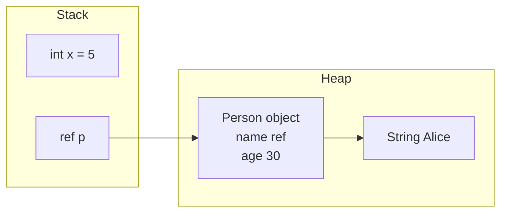
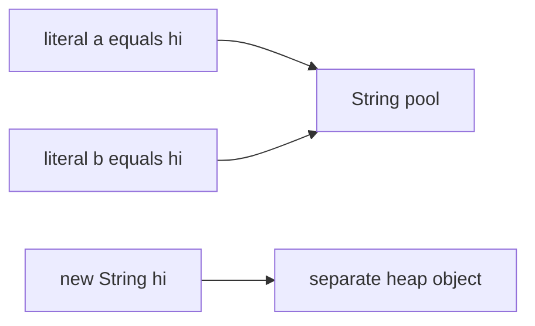

The Java type system splits cleanly into two worlds: eight primitive types that hold raw values, and reference types that hold pointers to objects on the heap. Almost every classic Java "gotcha" — `==` on `Integer`, silent overflow, floating-point money bugs — comes from misunderstanding this split. This page gives you the mental model interviewers expect you to have cold.

## Primitives versus reference types

A **primitive** stores its value directly. A **reference type** stores an address that points at an object living on the heap. There are exactly eight primitives, and their sizes are fixed by the JVM specification regardless of platform.

| Type | Size | Range | Default |
|---|---|---|---|
| `boolean` | JVM-defined (1 bit logical) | `true` / `false` | `false` |
| `byte` | 8 bits | -128 to 127 | `0` |
| `short` | 16 bits | -32,768 to 32,767 | `0` |
| `char` | 16 bits | 0 to 65,535 (unsigned) | `\u0000` |
| `int` | 32 bits | -2,147,483,648 to 2,147,483,647 | `0` |
| `long` | 64 bits | about -9.2e18 to 9.2e18 | `0L` |
| `float` | 32 bits | IEEE-754 single precision | `0.0f` |
| `double` | 64 bits | IEEE-754 double precision | `0.0d` |

Everything else — arrays, `String`, your own classes, and the wrapper classes `Integer`, `Long`, `Double` and friends — is a reference type.

> [!KEY]
> Primitives hold the value; references hold an address to a heap object. Get this one distinction right and most Java "surprises" stop being surprising.

## Stack and heap: what lives where

Local variables and method parameters live on the **stack**, one frame per method call. A primitive local holds its bits inline on the stack. A reference local holds an address on the stack, but the object it points to lives on the **heap**. Fields of an object always live inside that object on the heap, whatever their type.



So `int x = 5` puts `5` on the stack. `Person p = new Person()` puts an address on the stack and the `Person` object on the heap. When the method returns, the stack frame is discarded; the heap object survives until the garbage collector proves nothing references it.

## Autoboxing, unboxing and the Integer cache

Autoboxing converts a primitive to its wrapper (`int` to `Integer`) automatically; unboxing does the reverse. It looks free but hides two dangerous behaviours.

First, the **Integer cache**. `Integer.valueOf` caches boxed values from -128 to 127, so two boxings of the same small number return the *same* object, while larger values return distinct objects.

```java
Integer a = 127, b = 127;
Integer c = 128, d = 128;
System.out.println(a == b); // true  - both from the cache
System.out.println(c == d); // false - two different objects
System.out.println(c.equals(d)); // true - compares values
```

> [!DANGER]
> `==` on wrapper objects compares references, not values. It "works" for -128..127 because of the cache and silently breaks above 127. Always use `.equals()` for wrappers.

Second, **unboxing a null**. If an `Integer` is `null` and you use it where an `int` is expected, the JVM calls `.intValue()` on `null` and throws `NullPointerException` — often far from the real cause.

```java
Map<String, Integer> counts = new HashMap<>();
int n = counts.get("missing"); // NPE: get returns null, then unboxes
```

Prefer `valueOf` over `new Integer(...)` (deprecated since Java 9): `new` always allocates a fresh object and defeats the cache.

## Integer overflow is silent

Integer arithmetic wraps around on overflow without any error. Adding one to `Integer.MAX_VALUE` gives `Integer.MIN_VALUE`. This causes real bugs in things like midpoint calculations and duration maths.

```java
int max = Integer.MAX_VALUE;
System.out.println(max + 1);          // -2147483648, wraps silently
System.out.println(Math.addExact(max, 1)); // throws ArithmeticException
```

Use `Math.addExact`, `multiplyExact` and friends when an overflow must be caught, or use `long` for values that can grow.

## Floating point and money

`float` and `double` are IEEE-754 binary types and cannot represent most decimal fractions exactly. `0.1 + 0.2` is not `0.3`.

```java
System.out.println(0.1 + 0.2 == 0.3); // false
System.out.println(0.1 + 0.2);        // 0.30000000000000004
```

For money, use `BigDecimal` constructed from a `String`, and compare with `compareTo`, not `equals`, because `equals` also compares scale so `2.0` and `2.00` are unequal.

```java
BigDecimal price = new BigDecimal("0.10");     // String ctor avoids binary drift
BigDecimal total = price.add(new BigDecimal("0.20"));
System.out.println(total.compareTo(new BigDecimal("0.30")) == 0); // true
```

> [!WARNING]
> Never build a `BigDecimal` from a `double` (`new BigDecimal(0.1)`) — you inherit the binary imprecision you were trying to avoid. Always pass a `String`.

## char, UTF-16 and surrogate pairs

A `char` is a single UTF-16 **code unit**, not a full Unicode character. Characters outside the Basic Multilingual Plane (like most emoji) need two `char` values, a *surrogate pair*. So `String.length()` counts code units, not visible characters.

```java
String emoji = "😀";
System.out.println(emoji.length());          // 2, one surrogate pair
System.out.println(emoji.codePointCount(0, emoji.length())); // 1
```

Iterate with `codePoints()` when correctness for the full Unicode range matters.

## Conversions, casting and var

**Widening** conversions (`int` to `long`, `int` to `double`) are implicit and safe. **Narrowing** conversions (`long` to `int`, `double` to `int`) require an explicit cast and may lose data or truncate.

```java
long big = 4_000_000_000L;
int lossy = (int) big; // narrowing, silently wraps to a wrong value
double d = 100;        // widening, implicit and safe
```

`var` (Java 10+) infers the type of a **local variable** from its initialiser. It is still statically typed — `var x = 10` is an `int` forever. It cannot be used for fields, method parameters, return types, or without an initialiser, and `var x = null` will not compile.

## Strings, interning and equality

`String` is immutable; every "modification" creates a new object. String literals are pooled (interned), so identical literals share one object, but strings built at runtime are distinct.

```java
String a = "hi";
String b = "hi";
String c = new String("hi");
System.out.println(a == b);        // true  - same pooled literal
System.out.println(a == c);        // false - c is a new heap object
System.out.println(a.equals(c));   // true  - compare contents
```

Use `StringBuilder` (not thread-safe, fast) for building strings in a loop; `StringBuffer` is the synchronised, slower variant you rarely need.



| Type | Mutable | Thread-safe | Use when |
|---|---|---|---|
| `String` | No | Yes (immutable) | Fixed text, keys, constants |
| `StringBuilder` | Yes | No | Building strings in one thread |
| `StringBuffer` | Yes | Yes | Legacy shared mutation, rarely needed |

## Pass by value, always

Java is **always pass by value**. For primitives, the value is copied. For objects, the *reference* is copied — so the method can mutate the object the reference points to, but reassigning the parameter does not affect the caller.

```java
void mutate(int[] arr, String s) {
    arr[0] = 99;   // caller sees this - same array object
    s = "changed"; // caller does NOT see this - only the copy is reassigned
}
```

> [!TIP]
> The senior phrasing: "Java passes references by value. You can change the object's state, but you cannot repoint the caller's variable." Saying this precisely settles the whole debate.

## final and static

`final` means "assigned once". On a variable it prevents reassignment (not deep immutability — a `final List` can still be mutated). On a method it blocks overriding; on a class it blocks subclassing. `static` members belong to the class, not an instance. Static fields initialise when the class is first loaded, in textual order alongside static blocks.

```java
class Config {
    static final int LIMIT = 100;     // class-level constant
    static int counter = 0;           // shared across all instances
    final String id;                  // must be set once, in the constructor
    Config(String id) { this.id = id; }
}
```

## Class initialisation order

A class is loaded and initialised lazily, the first time it is actively used — an instance is created or a static member is accessed. Static field assignments and static initialiser blocks then run exactly once, top to bottom.

```java
class Registry {
    static final List<String> NAMES = new ArrayList<>(); // runs first, once at class load
    static { NAMES.add("default"); }                      // static block, after the field above
    static int size() { return NAMES.size(); }
}
```

Order matters: a static block that reads a static field declared below it sees the default value, not the intended one, because initialisers execute in textual order. A circular static dependency between two classes can even briefly expose a partially initialised class. Keep static initialisation simple and self-contained, and prefer `static final` constants that do not depend on another class loading first. Instance-level fields follow the separate per-object order covered earlier: superclass constructor, then field initialisers, then the constructor body.

## Cheat sheet

- Eight primitives hold values; everything else is a reference to a heap object.
- Primitive locals live on the stack; objects live on the heap; object fields live inside the object.
- `Integer` caches -128..127, so `==` "works" then silently breaks — use `.equals()`.
- Unboxing a `null` wrapper throws `NullPointerException`.
- `int` overflow wraps silently; use `Math.addExact` or `long` when it matters.
- `double` cannot represent decimals exactly; use `BigDecimal("...")` and `compareTo` for money.
- `char` is one UTF-16 code unit; emoji need surrogate pairs, so `length()` can mislead.
- Widening is implicit and safe; narrowing needs a cast and can lose data.
- `String` is immutable and pooled; `==` compares references, `.equals()` compares content.
- Java is always pass by value; the copied thing for objects is the reference.

## Common mistakes

| Mistake | Fix |
|---|---|
| `==` to compare `Integer` or `String` values | Use `.equals()` |
| `int total = map.get(key)` on a possibly-missing key | Check for `null` or use `getOrDefault` |
| `new BigDecimal(0.1)` for money | Use `new BigDecimal("0.1")` |
| Assuming `str.length()` counts characters | Use `codePointCount` for full Unicode |
| Believing objects are passed by reference | It is the reference passed by value |
| Expecting `final List` to be immutable | `final` blocks reassignment, not mutation |
| `new Integer(5)` in new code | Use `Integer.valueOf(5)` or autoboxing |

## Summary

Java's type system is a two-tier design: value-holding primitives with fixed sizes and heap-allocated reference types reached through pointers. The stack holds locals and references while the heap holds objects, and knowing which is which explains autoboxing bugs, null unboxing, and pass-by-value semantics. Numeric edge cases — silent overflow and floating-point imprecision — demand `Math.exact` methods and `BigDecimal` for correctness. `String` immutability, interning, and the reference-versus-content distinction round out the model that every other Java topic builds on.

## Top Interview Questions

### Q1. Is Java pass by value or pass by reference?

Java is always pass by value. For a primitive, the actual value is copied into the parameter. For an object, the *reference* (the address) is copied by value — so both the caller's variable and the parameter point at the same object. That means a method can mutate the object's internal state and the caller will see it, but if the method reassigns the parameter to a new object, the caller's variable is unaffected because only the copied reference changed. The precise one-liner is "Java passes references by value," which resolves the confusion between mutating an object and repointing a variable.

### Q2. Why does `Integer a = 127; Integer b = 127; a == b` return true but `128 == 128` return false?

Autoboxing calls `Integer.valueOf`, which caches boxed values from -128 to 127 and returns the same cached object for values in that range. So two boxings of 127 yield the identical object and `==` (a reference comparison) is true. 128 is outside the cache, so each boxing allocates a new `Integer`, and `==` compares two distinct references, giving false. `.equals()` compares the numeric values and returns true in both cases. The lesson: never use `==` on wrapper types; it only appears to work inside the small cache window.

### Q3. How can autoboxing cause a NullPointerException?

When a wrapper reference is `null` and you use it in a context that requires the primitive, the JVM auto-unboxes by calling a method like `.intValue()` on the `null` reference, which throws `NullPointerException`. The classic case is `int count = map.get(key)` where the key is absent: `get` returns `null`, and the assignment forces unboxing. It is nasty because the stack trace points at the assignment line, not at why the value was null. Guard with a null check, `getOrDefault`, or keep the variable as the wrapper type until you have confirmed it is non-null.

### Q4. Why should money never be stored in a `double`, and what do you use instead?

`double` is IEEE-754 binary floating point and cannot represent most decimal fractions exactly, so values like `0.1` are stored approximately and errors accumulate over arithmetic — `0.1 + 0.2` yields `0.30000000000000004`. For currency you use `BigDecimal` constructed from a `String` (never from a `double`, which reintroduces the imprecision), giving exact decimal arithmetic with an explicit scale and rounding mode. Compare with `compareTo`, not `equals`, because `equals` also compares scale, so `new BigDecimal("2.0")` and `new BigDecimal("2.00")` are unequal by `equals` but equal by `compareTo`.

### Q5. What is the difference between the stack and the heap in Java?

The stack holds method call frames: local variables and parameters, including primitive values inline and object references (addresses). It is per-thread, fast, and automatically unwound when a method returns. The heap holds all objects created with `new` (and arrays and interned strings); it is shared across threads and managed by the garbage collector, which frees objects once nothing references them. An object's fields always live inside the object on the heap regardless of their declared type. Understanding this split explains pass-by-value, why local primitives are cheap, and why escaping references keep objects alive.

### Q6. What is `String` interning and how does it affect equality checks?

String literals are stored in a shared pool, so two identical literals refer to the same object and `==` returns true for them. Strings created with `new String("x")` or built at runtime are separate heap objects, so `==` against a literal returns false even though the contents match. `String.intern()` returns the pooled instance for a given content. Because of all this, you should compare string contents with `.equals()`, never `==`. Relying on interning for equality is fragile — it works for compile-time constants and breaks the moment a string is produced dynamically.

### Q7. Your nightly job computing an average over millions of records occasionally returns a wildly negative number. What is the likely cause?

This is almost certainly `int` overflow. Summing many positive values into an `int` accumulator can exceed `Integer.MAX_VALUE` (about 2.1 billion), at which point the value wraps around to a large negative number, and dividing by the count produces a nonsensical average. The fix is to accumulate the sum in a `long` (or `BigInteger` if even a long might overflow), or to use `Math.addExact` so an overflow throws instead of silently corrupting the result. A senior answer also notes computing running averages incrementally to bound the magnitude of the accumulator.

### Q8. What does `var` do, and where can you not use it?

`var` (Java 10+) is local variable type inference: the compiler deduces the static type from the initialiser, so `var list = new ArrayList<String>()` is exactly an `ArrayList<String>`. It is still fully static typing — the type is fixed at compile time, not dynamic. You cannot use `var` for fields, method parameters, method return types, catch clauses, or a variable without an initialiser, and `var x = null` fails because there is nothing to infer. Use it to cut noise where the type is obvious from the right-hand side, not to hide an unclear type.

### Q9. Why does `"😀".length()` return 2, and how do you count actual characters?

`String` is stored as UTF-16, and `length()` returns the number of 16-bit code units, not the number of visible characters. Code points outside the Basic Multilingual Plane, such as most emoji, are encoded as a surrogate pair of two `char` values, so a single emoji reports a length of 2. To count real characters (code points), use `codePointCount(0, length())`, and to iterate correctly use the `codePoints()` stream or `offsetByCodePoints`. This matters for input validation, truncation, and any logic that assumes one `char` equals one character.

### Q10. What is the difference between `final`, `finally`, and `finalize`?

They are unrelated despite the similar names. `final` is a modifier: a `final` variable can be assigned once, a `final` method cannot be overridden, and a `final` class cannot be subclassed. `finally` is a block attached to `try` that always runs whether or not an exception was thrown, used for cleanup. `finalize` was a deprecated `Object` method the garbage collector could call before reclaiming an object; it is unreliable, deprecated for removal, and you should use try-with-resources or `Cleaner` instead. Interviewers ask this to check you are not confusing surface-level keyword similarity with actual semantics.

### Q11. When should you choose `StringBuilder` over `String` concatenation?

Use `StringBuilder` when building a string incrementally, especially in a loop. Because `String` is immutable, `s += x` inside a loop allocates a new string and copies the whole buffer on every iteration, giving quadratic time and heavy garbage. `StringBuilder` mutates one growable buffer, giving linear time. For a small fixed number of concatenations the compiler already optimises `+` into `StringBuilder`, so readability wins there. Prefer `StringBuilder` over `StringBuffer` unless you genuinely need thread-safe mutation, since `StringBuffer`'s synchronisation adds cost you rarely need in single-threaded building.

### Q12. What is the difference between widening and narrowing conversions?

Widening converts a smaller type to a larger compatible one — `int` to `long`, `int` to `double` — and is implicit because no information is lost (though `int`/`long` to `float`/`double` can lose precision on very large magnitudes). Narrowing converts a larger type to a smaller one — `long` to `int`, `double` to `int` — and requires an explicit cast because it can lose data or truncate the fractional part, and integer narrowing simply keeps the low-order bits, which can flip the sign. Casting tells the compiler you accept the potential loss, so the risk is on you to ensure the value fits.
