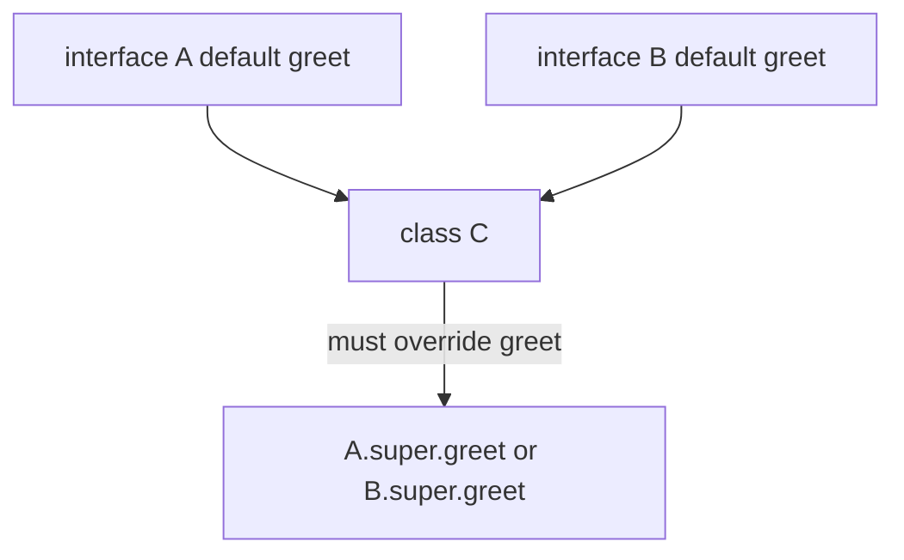
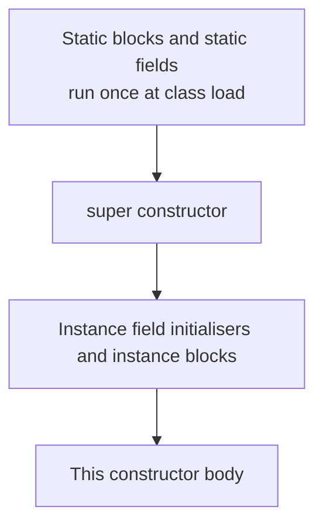

Object orientation in Java is not about reciting four pillars — it is about choosing between a class, an abstract class, an interface, a record, and composition, and defending that choice. This page grounds the theory in the design decisions interviewers actually probe.

## The four pillars in Java terms

| Pillar | What it means | Java mechanism |
|---|---|---|
| Encapsulation | Hide state, expose behaviour | `private` fields, public methods |
| Inheritance | Reuse and specialise a type | `extends`, `implements` |
| Polymorphism | One reference, many runtime types | Overriding, dynamic dispatch |
| Abstraction | Program to a contract, not an implementation | `interface`, `abstract` |

Encapsulation is the one to lead with: keep fields `private`, expose intent through methods, and you can change internals without breaking callers. Polymorphism is what lets a `List` variable behave as an `ArrayList` or `LinkedList` at runtime.

> [!KEY]
> Interviewers rarely want the textbook definitions. They want you to justify a design choice — interface versus abstract class, inheritance versus composition — using these principles as the reasoning.

## Class, abstract class, or interface

An **interface** is a pure contract: what a type can do. An **abstract class** is a partial implementation: shared state and behaviour plus abstract holes for subclasses. A concrete **class** is a complete, instantiable implementation.

| Feature | Interface | Abstract class |
|---|---|---|
| Instance state (fields) | Only `static final` constants | Yes, real fields |
| Constructors | No | Yes |
| Multiple inheritance | Yes, implement many | No, extend one |
| Method bodies | `default` and `static` | Any |
| Intent | Capability a type offers | Shared base for a family |

```java
interface Payment {                 // a capability
    boolean charge(long cents);
    default String currency() { return "USD"; } // shared default
}

abstract class Shape {              // a family with shared state
    private final String id;
    Shape(String id) { this.id = id; }
    abstract double area();         // each subtype must supply this
    String id() { return id; }
}
```

Pick an interface when unrelated types share a capability (`Comparable`, `Runnable`). Pick an abstract class when a family of types shares real state and constructor logic. When in doubt, prefer an interface — it keeps the single `extends` slot free.

## Default methods and the diamond problem

Java 8 added `default` and `static` methods to interfaces so libraries could evolve without breaking implementers. This reintroduced a diamond risk: what if two interfaces provide the same default method? Java resolves it with the **most specific** rule and forces you to disambiguate when it cannot.



```java
interface A { default String greet() { return "A"; } }
interface B { default String greet() { return "B"; } }
class C implements A, B {
    public String greet() { return A.super.greet(); } // explicit choice
}
```

Java allows multiple inheritance of **type and behaviour** through interfaces, but never of **state** — interfaces cannot hold instance fields, so there is no conflicting data to inherit.

## Overloading versus overriding

**Overloading** is choosing among same-named methods by parameter types, resolved by the compiler at **compile time** using the static (declared) type. **Overriding** replaces a superclass method in a subclass, resolved at **runtime** by the object's actual type (dynamic dispatch).

```java
class Base { String who() { return "Base"; } }
class Derived extends Base { String who() { return "Derived"; } }

Base b = new Derived();
System.out.println(b.who()); // "Derived" - runtime dispatch on actual type
```

```java
void print(Object o) { System.out.println("object"); }
void print(String s) { System.out.println("string"); }

Object x = "hello";
print(x); // "object" - overload picked at compile time from declared type Object
```

> [!WARNING]
> Overload resolution uses the declared type; override dispatch uses the runtime type. Mixing up the two produces answers that look wrong until you remember which decision happens when.

Overriding may use **covariant return types**: the override can return a subtype of the original return type. Always annotate overrides with `@Override` so the compiler catches a signature that silently overloads instead of overriding.

## Access modifiers

| Modifier | Same class | Same package | Subclass (other pkg) | Anywhere |
|---|---|---|---|---|
| `private` | ✅ | ❌ | ❌ | ❌ |
| package-private (default) | ✅ | ✅ | ❌ | ❌ |
| `protected` | ✅ | ✅ | ✅ | ❌ |
| `public` | ✅ | ✅ | ✅ | ✅ |

The absence of a modifier is **package-private**, not public — a point candidates routinely get wrong. Default to the most restrictive access that works; widen only when a real caller needs it.

## Constructors and initialisation order

A constructor may delegate to another constructor of the same class with `this(...)` or to its superclass with `super(...)`, and that call must be the first statement. When an object is created, initialisation runs in a fixed order.



```java
class Parent {
    Parent() { init(); }              // calls overridable method - dangerous
    void init() { System.out.println("parent init"); }
}
class Child extends Parent {
    private String name = "set";
    void init() { System.out.println("child sees name=" + name); } // name still null
}
```

Running `new Child()` prints `child sees name=null`: the `Parent` constructor calls `init` before the `Child` field initialiser runs.

> [!DANGER]
> Never call an overridable method from a constructor. The subclass override runs before the subclass's own fields are initialised, so it sees half-built state.

## Nested classes and the inner-class leak

Java has four kinds of nested class: **static nested** (no outer reference), **inner** (non-static, holds an implicit outer reference), **local** (declared in a method), and **anonymous** (a one-off implementation).

| Kind | Holds outer reference | Typical use |
|---|---|---|
| Static nested | No | Helper tied to the outer type, e.g. `Map.Entry` |
| Inner (non-static) | Yes | Needs the enclosing instance's state |
| Local | Effectively yes | Short-lived helper inside a method |
| Anonymous | Yes | One-off listener or callback |

> [!TIP]
> A non-static inner class holds a hidden reference to its enclosing instance. If that inner object outlives the outer (stored in a static cache, passed to a long-lived executor), the outer object cannot be garbage collected — a real memory leak. Make it `static` unless it truly needs the outer instance.

## Composition over inheritance

Inheritance couples a subclass to its parent's implementation; a change in the base can break subclasses (the fragile base class problem). Composition — holding a collaborator and delegating — is looser and more flexible.

```java
// Inheritance abuse: a Stack is not really a Vector
class BadStack extends java.util.Vector<Integer> {}

// Composition: expose only stack operations, delegate storage
class GoodStack {
    private final Deque<Integer> items = new ArrayDeque<>();
    void push(int v) { items.push(v); }
    int pop() { return items.pop(); }
}
```

The composed `GoodStack` exposes exactly the stack contract and can swap its backing store without affecting callers, whereas the inherited version leaks every `Vector` method. "Favour composition over inheritance" is the safe default; reserve inheritance for genuine "is-a" relationships with a stable base.

## Sealed types and records (Java 17)

A `sealed` interface or class restricts which types may extend or implement it, giving you a closed, exhaustive hierarchy the compiler can reason about. A `record` is a transparent, immutable data carrier that generates its constructor, accessors, `equals`, `hashCode`, and `toString`.

```java
sealed interface Shape permits Circle, Square {}
record Circle(double radius) implements Shape {}
record Square(double side) implements Shape {}
```

Sealed hierarchies pair with pattern-matching `switch` (a preview refined through Java 21) so the compiler can verify you handled every permitted case. Every class you write also inherits the `Object` methods — `equals`, `hashCode`, `toString`, `getClass`, `clone`, and the `wait`/`notify` family — which is why overriding `equals` and `hashCode` correctly is a recurring interview theme.

## Object methods every class inherits

Every class silently extends `Object`, inheriting methods you frequently override.

| Method | Default behaviour | Override when |
|---|---|---|
| `equals(Object)` | Reference identity | Value equality matters |
| `hashCode()` | Identity hash | You override `equals` |
| `toString()` | Class name and hash | You want readable output |
| `getClass()` | Runtime class | Never, it is final |
| `clone()` | Shallow field copy | Rarely, prefer a copy constructor |

The `wait`, `notify`, and `notifyAll` methods support the low-level monitor protocol used for thread coordination and are `final`, so you cannot override them. Overriding `equals`, `hashCode`, and `toString` sensibly is expected of any value type — which is precisely the boilerplate a `record` generates for you automatically, another reason records are the modern default for simple data carriers.

## Cheat sheet

- Encapsulate state with `private` fields and expose behaviour, not data.
- Interface for a capability across unrelated types; abstract class for a family sharing state.
- Prefer interfaces to keep the single `extends` slot free.
- Java has multiple inheritance of type and default behaviour, never of state.
- Overloading is compile-time on declared type; overriding is runtime on actual type.
- Always write `@Override`; it catches accidental overloads.
- No modifier means package-private, not public.
- Never call an overridable method from a constructor.
- Make nested classes `static` unless they need the enclosing instance.
- Favour composition over inheritance; reserve `extends` for true is-a.
- `record` generates data-class boilerplate; `sealed` closes a hierarchy.

## Common mistakes

| Mistake | Fix |
|---|---|
| Extending a class just to reuse a few methods | Compose and delegate instead |
| Forgetting `@Override` on an intended override | Always annotate; let the compiler check |
| Assuming no access modifier means public | It is package-private |
| Calling an overridable method in a constructor | Call only private or final methods there |
| A non-static inner class in a long-lived cache | Make it static or clear the reference |
| Using an abstract class for a pure contract | Use an interface with default methods |
| Hand-writing `equals`/`hashCode` for a data holder | Use a `record` |

## Summary

Java's OOP model turns the four pillars into concrete tools: `private` for encapsulation, `extends`/`implements` for inheritance, dynamic dispatch for polymorphism, and interfaces for abstraction. The core design decisions are interface versus abstract class, overloading versus overriding, and inheritance versus composition — each with a defensible rule of thumb. Initialisation order and the constructor-calls-overridable trap catch out candidates who have not thought about object lifecycle. Modern additions — `record` and `sealed` — remove boilerplate and let the compiler enforce closed hierarchies, which is where senior-level Java design is heading.

## Top Interview Questions

### Q1. When would you use an interface versus an abstract class?

Use an interface to declare a capability that possibly unrelated types can offer — `Comparable`, `Serializable`, a `Repository` contract — especially since a class can implement many interfaces but extend only one class. Use an abstract class when a family of related types shares real instance state, constructor logic, or common method bodies that subclasses build on, such as a `Shape` base with an `id` field. Since Java 8, interfaces can carry `default` and `static` methods, so behaviour sharing alone no longer forces an abstract class. The default heuristic is "interface unless you need shared state," which keeps the single inheritance slot free.

### Q2. What is the difference between overloading and overriding?

Overloading defines multiple methods with the same name but different parameter lists; the compiler picks one at compile time based on the static (declared) types of the arguments. Overriding replaces a superclass method with a matching signature in a subclass; the JVM picks it at runtime based on the object's actual type, which is dynamic dispatch and the basis of polymorphism. A classic trap: `print(Object)` and `print(String)` called with a variable declared `Object` but holding a `String` invokes the `Object` overload, because overload resolution ignores the runtime type. Always mark overrides with `@Override` so the compiler flags an accidental overload.

### Q3. How did Java 8 default methods handle the diamond problem?

Default methods let interfaces ship method bodies, which reopened the possibility of inheriting two conflicting implementations. Java resolves it with the most-specific rule: a class implementation beats any interface default, and a more specific sub-interface's default beats a super-interface's. If two unrelated interfaces provide the same default method and neither is more specific, the class fails to compile until you override the method and explicitly delegate with `A.super.method()` or `B.super.method()`. Crucially, interfaces still cannot hold instance state, so Java gains multiple inheritance of type and behaviour without ever inheriting conflicting fields.

### Q4. Why should you never call an overridable method from a constructor?

During construction the superclass constructor runs before the subclass's field initialisers and constructor body. If the superclass constructor calls a method the subclass overrides, the override executes against a partially constructed object whose fields are still at their default values (null, 0, false). The result is subtle bugs — NullPointerExceptions or wrong behaviour that only appear for subclasses. The safe rule is to call only `private`, `static`, or `final` methods from a constructor, since none of those can be overridden. If polymorphic initialisation is genuinely needed, use a factory method or a separate `init()` called after construction completes.

### Q5. Explain composition over inheritance with a concrete example.

Inheritance ties a subclass to the parent's implementation, so changes to the base can silently break subclasses (the fragile base class problem), and it exposes every inherited method whether appropriate or not. Composition holds a collaborator and delegates to it, exposing only the intended contract. For example, rather than `class Stack extends Vector` — which leaks `insertElementAt` and every other `Vector` method — write a `Stack` that holds a private `ArrayDeque` and exposes only `push`/`pop`. You can then swap the backing collection freely. Reserve inheritance for genuine is-a relationships with a stable, designed-for-extension base; otherwise compose.

### Q6. What are the access modifiers and which is the default?

There are four levels. `private` restricts access to the declaring class. Package-private (no keyword at all) allows access within the same package. `protected` allows the package plus subclasses in other packages. `public` allows access from anywhere. The default when you omit a modifier is package-private, not public — a common mistake. Good practice is to start with the most restrictive access that compiles and widen only when a real external caller needs it, because a narrow API is easier to evolve without breaking clients. Fields should almost always be `private`; expose behaviour through methods.

### Q7. How does a non-static inner class cause a memory leak?

A non-static inner class instance holds an implicit reference to the enclosing instance so it can access the outer object's fields. If that inner instance is stored somewhere long-lived — a static registry, a cache, a running executor, an event listener list — it keeps the entire outer object (and everything the outer references) reachable, so the garbage collector cannot reclaim it even after the outer object is logically finished. The fix is to make the nested class `static` when it does not need the outer instance, or to null out the reference when done. This is a frequent source of leaks in listener and callback code.

### Q8. What is the object initialisation order in Java?

When a class is first loaded, its static fields and static initialiser blocks run once, in textual order. When an instance is created, the flow is: the chained `super(...)` constructor runs first (all the way up the hierarchy), then the instance field initialisers and instance initialiser blocks run in textual order, then the rest of the current constructor body executes. A `this(...)` call defers to another constructor of the same class before the body continues. Knowing this order explains why a superclass constructor calling an overridable method sees uninitialised subclass fields, and why static state is ready before any instance exists.

### Q9. What is a record and what does it generate for you?

A `record` (Java 16+) is a transparent carrier for immutable data. From a header like `record Point(int x, int y)`, the compiler generates a canonical constructor, private final fields, public accessor methods (`x()`, `y()`), and value-based `equals`, `hashCode`, and `toString`. Records are implicitly final, cannot extend another class, and their components are final, so they are shallowly immutable. You can add a compact constructor for validation and extra methods, but you cannot add mutable instance fields. Use records for DTOs, value objects, map keys, and multiple-return-value holders instead of hand-writing error-prone boilerplate.

### Q10. What are sealed classes and why are they useful?

A `sealed` class or interface explicitly lists the types permitted to extend or implement it via a `permits` clause (or same-file subtypes). This closes the hierarchy: no outside code can add a new subtype, so the set of possibilities is finite and known at compile time. Combined with pattern-matching `switch`, the compiler can verify exhaustiveness — if you handle every permitted subtype, no `default` branch is needed, and adding a new subtype forces every switch to be updated. This gives algebraic-data-type-style modelling with compiler-enforced completeness, ideal for closed domains like a fixed set of shapes, events, or states.

### Q11. What is a covariant return type?

A covariant return type lets an overriding method return a subtype of the type returned by the method it overrides. For example, if `Object clone()` is overridden in `MyList` to return `MyList` rather than `Object`, callers get the precise type without casting. It was added in Java 5 and is common with `clone()`, builder methods, and fluent APIs. It is still a valid override — the JVM uses a bridge method to reconcile the erased signatures — and it improves type safety by removing downcasts at call sites while preserving the substitutability guarantee of the original method.

### Q12. You have a class hierarchy where a change to the base class keeps breaking subclasses. How do you fix the design?

This is the fragile base class problem, and it signals inheritance being used for code reuse rather than a true is-a relationship. I would refactor toward composition: extract the reusable behaviour into a separate collaborator class and have the former subclasses hold and delegate to it, exposing only the contract they actually need. If polymorphism is still required, define a narrow interface and let each type implement it independently. If inheritance must remain, I would design the base explicitly for extension — document which methods are safe to override, make the rest `final`, and avoid calling overridable methods internally — following the "design for inheritance or prohibit it" guideline.
