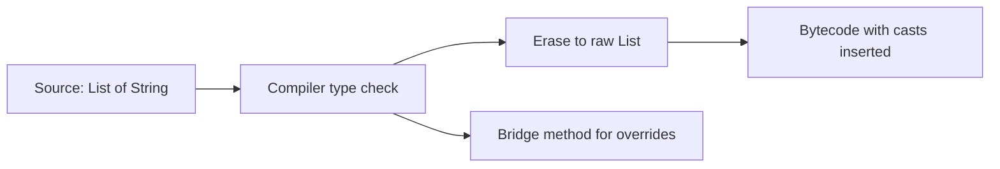
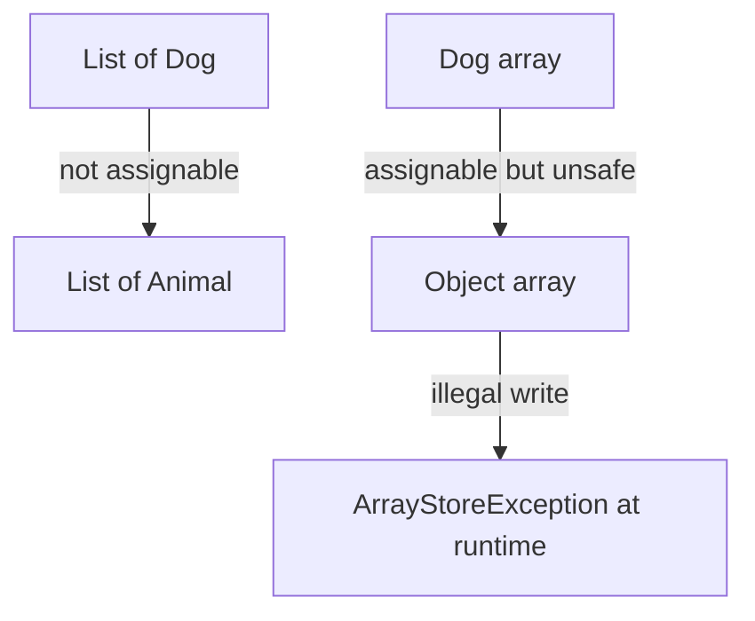

Generics give you compile-time type safety and remove casts, but Java implements them by erasure — the type parameters vanish at runtime. Almost every generics interview question is really about a consequence of erasure. This page connects the feature to its costs and the idioms that work around them.

## Why generics exist

Before generics, collections held `Object` and every read needed a cast that could fail at runtime. Generics move that check to compile time.

```java
List raw = new ArrayList();
raw.add("hi");
Integer n = (Integer) raw.get(0); // compiles, throws ClassCastException at runtime

List<String> typed = new ArrayList<>();
typed.add("hi");
String s = typed.get(0);          // no cast, checked at compile time
```

> [!KEY]
> Generics exist to turn runtime `ClassCastException` into a compile error. The type parameter is a promise the compiler enforces, then discards.

## Type erasure and bridge methods

The compiler checks generic types, then **erases** them: `List<String>` becomes `List`, and a type variable `T` becomes its leftmost bound (`Object` if unbounded). The bytecode has no idea what the type argument was. To keep polymorphism working after erasure, the compiler sometimes inserts a synthetic **bridge method**.



```java
class Box<T> implements Comparable<Box<T>> {
    private final T value;
    Box(T value) { this.value = value; }
    public int compareTo(Box<T> other) { return 0; } // compiler adds compareTo(Object) bridge
}
```

The bridge `compareTo(Object)` calls your `compareTo(Box<T>)` after a cast, so the erased `Comparable` interface still dispatches correctly.

## What erasure forbids

Because the type argument is gone at runtime, several things are simply illegal.

| Not allowed | Why | Workaround |
|---|---|---|
| `new T()` / `new T[]` | No runtime type to instantiate | Pass a `Class<T>` or `Supplier<T>` |
| `obj instanceof List<String>` | Runtime sees only `List` | Check `instanceof List<?>` |
| `List<int>` | Primitives are not reference types | Use `List<Integer>` |
| `static T field` | `T` differs per instance, not per class | Make the method generic instead |
| Overloads differing only by type arg | Both erase to the same signature | Rename one method |

```java
// void print(List<String> s) {}
// void print(List<Integer> i) {} // will not compile: same erasure print(List)
```

> [!WARNING]
> You cannot ask an object at runtime what its generic type argument was — that information was erased. Any API that seems to (like Jackson) captured it another way, through a type token, before erasure hit.

## Bounded type parameters

A bound restricts what a type parameter can be, which unlocks the methods of the bound. `<T extends Comparable<T>>` means "any `T` that can be compared to itself."

```java
static <T extends Comparable<T>> T max(List<T> items) {
    T best = items.get(0);
    for (T item : items)
        if (item.compareTo(best) > 0) best = item; // compareTo available thanks to the bound
    return best;
}
```

You can combine bounds with `&`, for example `<T extends Number & Comparable<T>>`. The first bound may be a class; the rest must be interfaces.

## Wildcards and PECS

Wildcards express variance for a single use site. `? extends T` is an unknown subtype (a **producer** you read from); `? super T` is an unknown supertype (a **consumer** you write to). The mnemonic is **PECS**: Producer Extends, Consumer Super.

```java
// Producer: you only read Numbers out of it
double sum(List<? extends Number> nums) {
    double total = 0;
    for (Number n : nums) total += n.doubleValue();
    return total; // cannot add to nums: the exact subtype is unknown
}

// Consumer: you only write Ts into it
static <T> void copy(List<? super T> dest, List<? extends T> src) {
    for (int i = 0; i < src.size(); i++) dest.set(i, src.get(i));
}
```

`Collections.copy(dest, src)` is the canonical example: the destination is `? super T` (you write to it) and the source is `? extends T` (you read from it).

| Wildcard | Read | Write | Role |
|---|---|---|---|
| `List<? extends T>` | ✅ as `T` | ❌ (except null) | Producer |
| `List<? super T>` | ✅ as `Object` | ✅ `T` and subtypes | Consumer |
| `List<T>` | ✅ | ✅ | Exact type |
| `List<?>` | ✅ as `Object` | ❌ (except null) | Unknown, read-only |

> [!TIP]
> Say the mnemonic out loud in interviews: "Producer Extends, Consumer Super. If a structure only gives you values, use `extends`; if it only receives values, use `super`." It signals you have used the API, not just read about it.

## Generics are invariant; arrays are covariant

`List<Dog>` is **not** a `List<Animal>`, even though `Dog` is an `Animal`. Generics are invariant, and that invariance is what keeps them type-safe. Arrays chose the opposite: they are **covariant**, which lets unsafe writes slip past the compiler and fail at runtime with `ArrayStoreException`.

```java
Object[] animals = new Dog[2];   // legal: arrays are covariant
animals[0] = new Cat();          // compiles, throws ArrayStoreException at runtime

// List<Animal> list = new ArrayList<Dog>(); // will not compile - invariant, and safer
```

> [!DANGER]
> Array covariance defers a type error to runtime; generic invariance catches it at compile time. This is exactly why you should prefer `List` over arrays in generic code.



## Generic methods and inference

A method can declare its own type parameters before the return type, and the compiler infers them from the arguments or the target type. The diamond operator `<>` infers the type argument of a constructor from the left-hand side.

```java
static <T> List<T> listOf(T a, T b) { return List.of(a, b); }

Map<String, List<Integer>> m = new HashMap<>(); // diamond infers the arguments
var names = listOf("a", "b");                    // T inferred as String
```

## Recursive generics

A type parameter can refer to itself, the classic being `Enum<T extends Enum<T>>`, which lets `Enum` methods return the exact enum type. The same pattern powers self-returning builders.

```java
abstract class Builder<T extends Builder<T>> {
    abstract T self();
    T name(String n) { /* ... */ return self(); } // returns the concrete builder type
}
```

## Heap pollution and @SafeVarargs

A generic varargs parameter creates an array of a generic type, which is unsound (arrays are covariant, generics erase). This "heap pollution" produces an unchecked warning. If your method only reads the varargs and never stores an unsafe value, annotate it `@SafeVarargs` to suppress the warning honestly.

```java
@SafeVarargs
static <T> List<T> asList(T... items) { // items is really a T[], erased to Object[]
    return new ArrayList<>(List.of(items));
}
```

Never suppress unchecked warnings blindly; only do so when you have manually verified the operation is safe.

## Type tokens for reflection

Because erasure removes the type argument, frameworks that need it at runtime capture it two ways. A simple `Class<T>` token works for a plain class. For a parameterised type like `List<String>`, they use a **super type token**: an anonymous subclass whose generic superclass retains the type via `getGenericSuperclass()`.

```java
List<String> parsed = mapper.readValue(json,
    new TypeReference<List<String>>() {}); // anonymous subclass preserves List<String>
```

Jackson's `TypeReference` and Guava's `TypeToken` both rely on this trick: subclass information about the generic superclass survives erasure even though the instance's own type argument does not.

Erasure also touches equality and comparison. `equals(Object)` takes `Object` by design, so a generic type's `equals` cannot statically restrict its argument, and a `Comparator<T>` is checked at compile time but erased at runtime, so a raw or wildcard misuse can still slip an incompatible element in and throw `ClassCastException` on comparison.

## Unbounded wildcards versus raw types

`List<?>` and the raw `List` look similar but differ crucially. `List<?>` is type-safe: the compiler knows the list holds *some* specific unknown type, so it forbids adding anything except `null`, which prevents corruption. Raw `List` opts out of generics entirely, disabling every check and inviting `ClassCastException`.

```java
static void printAll(List<?> list) {        // safe: read each element as Object
    for (Object o : list) System.out.println(o);
}
// list.add("x"); // will not compile - the element type is unknown, so writes are blocked
```

Use `List<?>` when a method only reads and genuinely does not care about the element type. Never use raw types in new code; they exist only for pre-Java-5 backward compatibility and silently defeat the type checker. The unbounded wildcard gives you the same "any list" flexibility while keeping the safety that erasure would otherwise strip away.

## Cheat sheet

- Generics give compile-time type safety and eliminate casts.
- Type parameters are erased at runtime to their bound (or `Object`).
- Bridge methods keep overriding correct after erasure.
- No `new T[]`, no `instanceof List<String>`, no primitive type args, no `static T` field.
- Two methods that erase to the same signature will not compile.
- Bounds like `<T extends Comparable<T>>` unlock the bound's methods.
- PECS: Producer Extends, Consumer Super.
- Generics are invariant; arrays are covariant and can throw `ArrayStoreException`.
- Prefer `List` over arrays in generic code for compile-time safety.
- Use `Class<T>` or a super type token to recover type info for reflection.
- `@SafeVarargs` only when you have verified the varargs use is safe.

## Common mistakes

| Mistake | Fix |
|---|---|
| Using raw types like `List` | Parameterise every generic type |
| Expecting `instanceof List<String>` to work | Erasure means only `List<?>` is testable |
| `new T[size]` inside a generic class | Create `Object[]` and cast, or pass a `Class<T>` |
| Getting `extends`/`super` backwards | Apply PECS: producer extends, consumer super |
| Mixing arrays and generics | Prefer `List<T>` over `T[]` |
| Suppressing unchecked warnings reflexively | Only suppress after proving safety |
| Assuming reflection can read the type argument | Capture it with a super type token first |

## Summary

Java generics are a compile-time feature erased before runtime, which is the single fact that explains every limitation and idiom around them. Erasure forbids `new T[]`, runtime generic `instanceof`, primitive type arguments, and overloads that collide after erasure, while bridge methods quietly preserve overriding. Variance is handled per use site with wildcards and the PECS rule, and the invariance of generics — contrasted with unsafe array covariance — is what makes them type-safe. When runtime type information is genuinely needed, `Class<T>` tokens and super type tokens recover it, which is how frameworks like Jackson work despite erasure.

## Top Interview Questions

### Q1. What is type erasure and why does Java use it?

Type erasure means the compiler verifies generic types, then removes the type parameters from the bytecode: `List<String>` becomes raw `List`, and a type variable `T` becomes its leftmost bound (or `Object` if unbounded), with casts inserted where needed. Java chose erasure for backward compatibility — generics were added in Java 5 and had to interoperate with pre-generics code and the existing non-generic collection classes without changing the class file format or the JVM. The trade-off is that generic type information is unavailable at runtime, which is the root cause of restrictions like no `new T[]`, no generic `instanceof`, and no reflection on type arguments.

### Q2. Explain PECS with an example.

PECS stands for Producer Extends, Consumer Super, and it decides which wildcard to use. If a parameter is a producer — you only read values out of it — use `? extends T`, so you can read them as `T` but cannot add (the exact subtype is unknown). If it is a consumer — you only write values into it — use `? super T`, so you can add `T` and its subtypes but read back only as `Object`. `Collections.copy(List<? super T> dest, List<? extends T> src)` is the canonical case: you read from the `extends` source and write to the `super` destination. Applying PECS makes generic APIs maximally flexible while staying type-safe.

### Q3. Why can't you create a generic array like `new T[10]`?

Arrays are covariant and carry their element type at runtime so they can throw `ArrayStoreException` on an illegal write. Generics are erased, so at runtime there is no `T` for the array to enforce, making a `T[]` unsound — it could silently accept the wrong type. Therefore `new T[10]` is a compile error. The usual workarounds are to create an `Object[]` and cast it to `T[]` (accepting an unchecked warning and keeping it encapsulated), or to pass a `Class<T>` token and use `Array.newInstance(clazz, size)` for a genuinely typed array. In most code, using a `List<T>` instead avoids the problem entirely.

### Q4. Why is `List<Dog>` not a `List<Animal>` when `Dog` is an `Animal`?

Generics are invariant precisely to preserve type safety. If `List<Dog>` were assignable to `List<Animal>`, you could then add a `Cat` through the `List<Animal>` reference, corrupting a list that is supposed to hold only dogs — and because of erasure nothing would catch it until a later read failed. Invariance rejects that assignment at compile time. Arrays made the opposite choice (covariance), which is why `Object[] a = new Dog[2]; a[0] = new Cat();` compiles but throws `ArrayStoreException` at runtime. When you need flexibility with generics, you use bounded wildcards (`? extends Animal`) rather than relying on subtyping of the parameterised type.

### Q5. What is a bridge method?

A bridge method is a synthetic method the compiler generates to preserve polymorphism after erasure. When a generic class or interface is subclassed with a concrete type argument, the erased signature of the override may not match the erased signature of the inherited method. The compiler inserts a bridge with the erased (usually `Object`) signature that casts and forwards to your real method, so virtual dispatch through the erased supertype still lands on your implementation. For example, implementing `Comparable<Box>` and writing `compareTo(Box)` causes the compiler to emit a `compareTo(Object)` bridge. You never write bridge methods yourself; they show up in stack traces and reflection.

### Q6. How do frameworks like Jackson deserialize into `List<String>` if the type is erased?

They capture the type before erasure using a super type token. You create an anonymous subclass such as `new TypeReference<List<String>>() {}`; although the instance's own type argument is erased, the generic superclass of that anonymous class is retained in the class file and readable at runtime via `getGenericSuperclass()`, which returns a `ParameterizedType` describing `List<String>`. Jackson reads that to know both the container and element types. The key insight is that erasure removes an object's type argument but not the generic superclass declaration of a subclass, so subclassing preserves exactly the information reflection needs.

### Q7. Why can't you have two overloaded methods `foo(List<String>)` and `foo(List<Integer>)`?

After erasure both signatures become `foo(List)`, so the class would contain two methods with identical signatures, which is illegal — the compiler rejects it with a "name clash" error. This is a direct consequence of erasure removing the type argument. The workarounds are to give the methods different names, change one parameter's raw type, or use a single method with a bounded wildcard and handle the distinction inside. Interviewers use this to check that you understand erasure operates on the whole method signature, not just on field declarations.

### Q8. What is heap pollution and when do you use `@SafeVarargs`?

Heap pollution is when a variable of a parameterised type refers to an object that is not of that type, which can happen because generic arrays are unsound — a generic varargs parameter (`T... args`) is really a `T[]` that erases to `Object[]`, so the compiler emits an unchecked warning. If your method only reads from the varargs array and never stores a value of the wrong type into it or leaks it, the operation is actually safe, and you annotate the method `@SafeVarargs` to suppress the warning at the declaration rather than every call site. You must manually verify safety first — `@SafeVarargs` silences the warning, it does not make an unsafe method safe.

### Q9. Your code compiles cleanly but throws `ClassCastException` at runtime from inside library code you never cast in. What happened?

This is the fingerprint of an erasure gap, usually from mixing raw and generic types or from unsafe unchecked casts. When you use a raw type or suppress an unchecked warning, the compiler stops enforcing the type parameter, so a wrong-typed element can enter a `List<String>`. Nothing fails until later code reads the element and the compiler-inserted cast (the one erasure added on your behalf) executes and fails — often deep in library code like a `Comparator` or an iterator. The fix is to eliminate raw types and unchecked warnings so the compiler catches the insertion point rather than letting a bad value slip in to explode later.

### Q10. What is a bounded type parameter and why use one?

A bounded type parameter restricts what a type argument may be, using `extends` for an upper bound, for example `<T extends Comparable<T>>` or `<T extends Number>`. The bound does two things: it limits which types callers may supply, and — more importantly — it makes the bound's methods available on `T` inside the method body, so you can call `compareTo` or `doubleValue` on a value of type `T`. You can require multiple bounds with `&` (`<T extends Number & Comparable<T>>`), where at most the first may be a class and the rest are interfaces. Without a bound, `T` erases to `Object` and you can only call `Object` methods on it.

### Q11. What are recursive generic bounds and where do they appear?

A recursive generic bound is a type parameter constrained by a type that mentions the parameter itself, such as `T extends Comparable<T>` or the JDK's own `Enum<E extends Enum<E>>`. It expresses "a type that can be compared to (or otherwise operate on) exactly its own kind," giving self-referential type safety. It underpins `Enum` so methods like `compareTo` and `getDeclaringClass` return the precise enum type, and it powers the self-returning builder pattern (`Builder<T extends Builder<T>>`) so fluent chains keep the concrete subtype instead of degrading to the base builder. It looks intimidating but simply pins the type parameter to itself.

### Q12. In production you need a factory that creates instances of a generic type parameter. How do you do it despite erasure?

Since `new T()` is impossible after erasure, you inject the type information the constructor needs. The common approaches are to pass a `Class<T>` token and call `clazz.getDeclaredConstructor().newInstance()`, or better, pass a `Supplier<T>` (a factory lambda like `MyType::new`) so creation is type-safe, requires no reflection, and works even when the type has constructor arguments. The `Supplier` approach is preferred in modern code because it avoids reflective exceptions and keeps everything checked at compile time. This pattern shows up throughout the JDK and frameworks — for instance `Collectors.toCollection(ArrayList::new)` — precisely because a bare `new T()` cannot exist.
