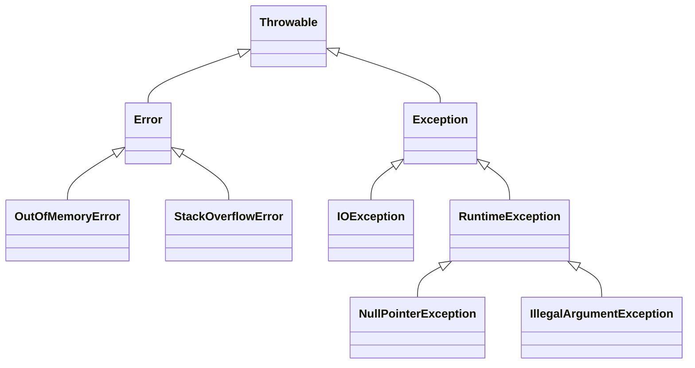
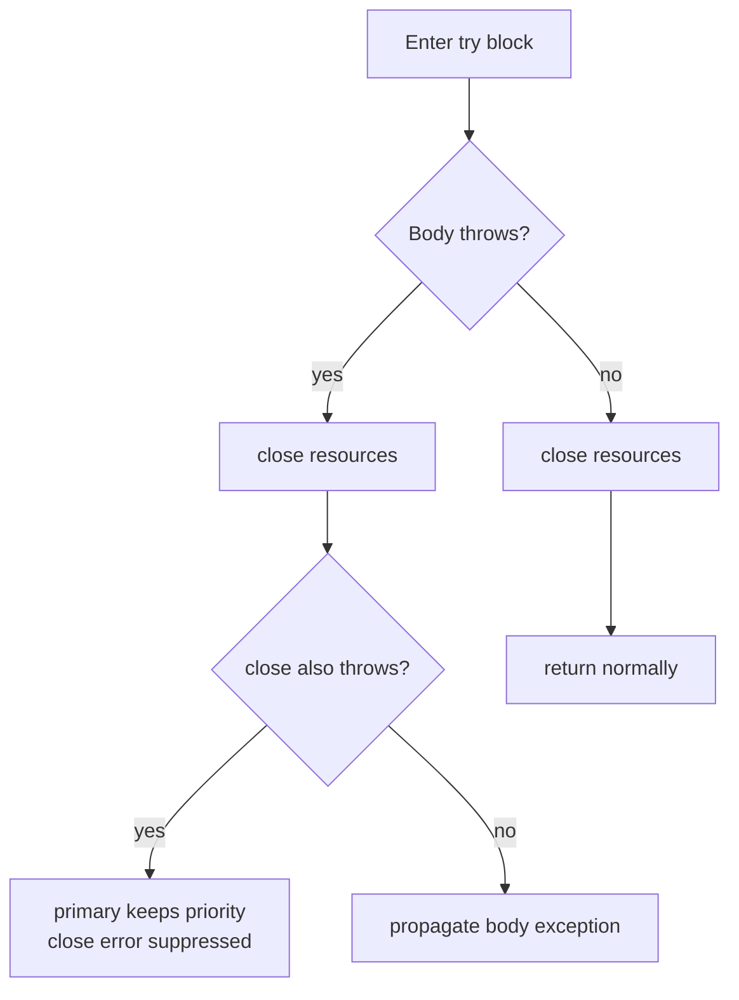

Error handling separates code that survives production from code that hides bugs. Java's checked-versus-unchecked split, try-with-resources, and exception chaining are recurring senior interview topics because they reveal whether you think about failure as a first-class design concern. This page covers the mechanics and the judgment calls.

## The Throwable hierarchy

Everything you can throw or catch descends from `Throwable`. It has two branches: `Error` for serious JVM problems you should not catch, and `Exception` for conditions your program can reasonably handle. `RuntimeException` is a subtree of `Exception` that is **unchecked**.



| Category | Root | Checked | Catch it? |
|---|---|---|---|
| Error | `Error` | No | No, JVM-level failure |
| Checked exception | `Exception` (not `RuntimeException`) | Yes | Yes, recoverable condition |
| Unchecked exception | `RuntimeException` | No | Usually a bug to fix, not catch |

> [!KEY]
> `Error` means the JVM is in trouble; do not catch it. Checked exceptions are recoverable conditions the compiler forces you to acknowledge. Unchecked exceptions usually signal programming bugs.

## Checked versus unchecked

A **checked** exception must be declared in a `throws` clause or caught — the compiler enforces it. An **unchecked** exception (`RuntimeException` and subclasses) need not be. The debate is real and worth articulating.

The argument *for* checked exceptions: they document failure modes in the signature and force the caller to make a conscious decision. The argument *against*: they leak implementation details, encourage empty `catch` blocks, and pollute lambdas and streams, which cannot throw checked exceptions cleanly.

```java
// Checked: caller must handle or declare
String read(Path p) throws IOException { return Files.readString(p); }

// Unchecked: a programming error, not a recoverable condition
int parse(String s) { return Integer.parseInt(s); } // throws NumberFormatException
```

The modern consensus: use checked exceptions for recoverable conditions the caller genuinely can act on, and unchecked for programming errors and unrecoverable failures. Many frameworks (Spring, Hibernate) wrap checked exceptions in unchecked ones for exactly this reason.

## try, catch, finally, multi-catch

`finally` always runs — after a normal return, after a caught exception, even after an uncaught one propagates. Multi-catch handles several types in one block.

```java
try {
    risky();
} catch (IOException | SQLException e) { // multi-catch, e is effectively final
    log.error("operation failed", e);
    throw new ServiceException("could not complete", e); // preserve the cause
} finally {
    releaseResources();                  // always runs
}
```

> [!DANGER]
> A `return` (or `throw`) inside `finally` overrides whatever the `try` block was returning or throwing — including swallowing an in-flight exception entirely. Never put control flow in `finally`.

```java
int broken() {
    try { throw new IllegalStateException("real error"); }
    finally { return 42; } // swallows the exception, returns 42 silently
}
```

## try-with-resources and suppressed exceptions

Any object implementing `AutoCloseable` can be declared in a try-with-resources header; the JVM closes it automatically in reverse order, even on exception. This replaces the error-prone manual `finally { conn.close(); }` pattern.

```java
try (var conn = dataSource.getConnection();
     var stmt = conn.prepareStatement(sql)) {
    return stmt.executeQuery();
} // stmt then conn closed automatically, in reverse order
```

If the body throws and `close()` also throws, the body's exception is primary and the `close()` exception is attached as a **suppressed** exception (retrievable via `getSuppressed()`), so you never lose the original error.



## Exception chaining and preserving the cause

When you catch a low-level exception and throw a higher-level one, pass the original as the **cause**. This preserves the full stack trace and lets debuggers see the root problem.

```java
try {
    return repository.load(id);
} catch (SQLException e) {
    throw new DataAccessException("load failed for " + id, e); // e is the cause
}
```

> [!WARNING]
> `throw new RuntimeException(e.getMessage())` throws away the original stack trace and cause. Always pass the exception itself (`new RuntimeException(msg, e)`), not just its message.

## Designing custom exceptions

Create a custom exception when callers need to distinguish it programmatically; otherwise reuse a standard one like `IllegalArgumentException` or `IllegalStateException`. Decide between **wrapping** (translate a low-level cause into a domain exception) and **propagating** (let it bubble up unchanged).

| Situation | Do |
|---|---|
| Caller can act on the specific failure | Custom checked or unchecked exception |
| Low-level detail should not leak upward | Wrap with the cause preserved |
| No added value at this layer | Propagate unchanged |
| Argument or state is invalid | Reuse `IllegalArgumentException` / `IllegalStateException` |

## Anti-patterns to avoid

Never catch `Throwable` (it swallows `Error`s like `OutOfMemoryError`), never leave an empty `catch` block, and never both log and rethrow the same exception at every layer — that produces duplicate stack traces (the double-log anti-pattern). Log where you handle; rethrow where you cannot.

```java
catch (Exception e) { } // DANGER: swallows everything, hides bugs forever
```

Constructing an exception is costly because `fillInStackTrace` walks the whole call stack. In a genuine hot path where you throw frequently and never use the trace (control flow, parsers), a stackless exception overriding `fillInStackTrace` is justified — but this is a rare, measured optimisation, not a default.

## InterruptedException and Optional

`InterruptedException` is special: catching it clears the thread's interrupt flag. If you cannot propagate it, restore the flag so higher-level code still sees the interruption.

```java
try {
    queue.take();
} catch (InterruptedException e) {
    Thread.currentThread().interrupt(); // restore the flag, do not swallow
    return; // stop the work cleanly
}
```

For *expected absence* — a lookup that may legitimately find nothing — return `Optional` rather than throwing. Exceptions are for exceptional conditions, not normal control flow.

```java
Optional<User> findByEmail(String email); // absence is normal, not exceptional
```

> [!TIP]
> Draw the line clearly in interviews: validation errors are expected and belong to normal flow (return a result or `Optional`), while system failures (disk, network, corrupted state) are exceptional and belong in the exception path. Conflating the two is a common design smell.

## Global handling

Every thread can have a `Thread.UncaughtExceptionHandler` as a last resort for exceptions that escape `run()`, useful for logging in thread pools. At the application layer, frameworks centralise this: Spring MVC uses `@ExceptionHandler` and `@ControllerAdvice` to map exceptions to HTTP responses, so a `ResourceNotFoundException` becomes a 404 and a validation failure becomes a 400, keeping controllers free of repetitive try/catch.

```java
@ExceptionHandler(ResourceNotFoundException.class)
ResponseEntity<Problem> handle(ResourceNotFoundException e) {
    return ResponseEntity.status(404).body(new Problem(e.getMessage()));
}
```

## Fail fast with precondition checks

Detecting bad input at the boundary, before it corrupts state, is far cheaper than debugging a `NullPointerException` ten frames deeper. Validate arguments at the top of public methods and throw immediately with a message that names the violated contract.

```java
Order(String id, int quantity) {
    this.id = Objects.requireNonNull(id, "id must not be null"); // throws at the boundary
    if (quantity <= 0)
        throw new IllegalArgumentException("quantity must be positive, was " + quantity);
    this.quantity = quantity;
}
```

`Objects.requireNonNull` throws a `NullPointerException` with a clear message the instant a null slips in, turning a vague downstream failure into an obvious one at the source. Use `IllegalArgumentException` for a bad argument value and `IllegalStateException` when the object is in the wrong state for the call. Both are unchecked because they signal a programming error the caller must fix, not a runtime condition to recover from. Treat fail-fast validation as executable documentation of a method's contract, and keep it distinct from the exceptional-failure path reserved for I/O and system errors.

## Cheat sheet

- `Throwable` splits into `Error` (do not catch) and `Exception`.
- `RuntimeException` and subclasses are unchecked; other `Exception`s are checked.
- Use checked for recoverable conditions, unchecked for programming bugs.
- `finally` always runs; never put `return` or `throw` in it.
- try-with-resources closes `AutoCloseable` in reverse order and records suppressed exceptions.
- Always chain the cause: `new XException(msg, e)`, never just the message.
- Never catch `Throwable`, never leave `catch` empty, never double-log and rethrow.
- Restore the interrupt flag when you catch `InterruptedException`.
- Use `Optional` for expected absence, exceptions for exceptional failures.
- Centralise mapping (Spring `@ControllerAdvice`) instead of per-controller try/catch.

## Common mistakes

| Mistake | Fix |
|---|---|
| `catch (Throwable t)` | Catch specific `Exception` types only |
| Empty `catch` block | Handle, log with context, or rethrow |
| `throw new RuntimeException(e.getMessage())` | Pass the cause: `new RuntimeException(msg, e)` |
| `return` inside `finally` | Keep `finally` for cleanup only |
| Swallowing `InterruptedException` | Restore the flag with `Thread.currentThread().interrupt()` |
| Throwing to signal normal absence | Return `Optional` or an empty result |
| Logging and rethrowing at every layer | Log once at the boundary where you handle it |

## Summary

Java's error handling is built on the `Throwable` hierarchy, where `Error` is off-limits and `Exception` splits into checked (compiler-enforced, for recoverable conditions) and unchecked (for bugs). Robust code uses try-with-resources for deterministic cleanup, preserves causes through exception chaining, and avoids the classic traps: control flow in `finally`, catching `Throwable`, empty blocks, and double-logging. Judgment matters most — distinguishing expected absence (use `Optional`) from genuine failure, deciding when to wrap versus propagate, and restoring the interrupt flag. At the application edge, centralised handlers like Spring's `@ControllerAdvice` translate exceptions into responses cleanly.

## Top Interview Questions

### Q1. What is the difference between checked and unchecked exceptions?

Checked exceptions are subclasses of `Exception` (excluding `RuntimeException`) that the compiler forces you to either catch or declare in a `throws` clause; they model recoverable conditions the caller should consciously handle, like `IOException`. Unchecked exceptions are `RuntimeException` and its subclasses (plus `Error`), which need no declaration and typically signal programming bugs such as `NullPointerException` or `IllegalArgumentException`. The practical guidance is to use checked exceptions only when the caller can genuinely recover and act, and unchecked for defects and unrecoverable situations. Many frameworks deliberately convert checked exceptions to unchecked ones to keep APIs clean and to work smoothly with streams and lambdas, which cannot propagate checked exceptions.

### Q2. Why should you never catch `Throwable` or `Error`?

`Throwable` is the root of everything, so catching it also catches `Error` types like `OutOfMemoryError`, `StackOverflowError`, and `NoClassDefFoundError`. These indicate the JVM itself is in an unrecoverable state; swallowing them can leave the application running in a corrupted condition, mask fatal problems, and prevent proper shutdown. You also risk catching `InterruptedException`-related control flow and other things you never intended to handle. Catch the most specific `Exception` types you can actually deal with. If you truly need a last-resort net (for example in a thread pool worker), catch `Exception`, log with full context, and let `Error` propagate so the JVM can fail fast.

### Q3. How does try-with-resources work and what are suppressed exceptions?

Any resource declared in the try header must implement `AutoCloseable`; the JVM guarantees its `close()` is called when the block exits, whether normally or via exception, and multiple resources are closed in reverse order of declaration. This replaces manual `finally` cleanup, which is verbose and easy to get wrong. Suppressed exceptions handle a subtle case: if the try body throws and `close()` also throws, the body's exception is kept as primary and the `close()` exception is attached to it, retrievable via `getSuppressed()`. This preserves the original failure — the one you usually care about — while not losing the secondary close failure, something the old manual pattern silently dropped.

### Q4. What happens if you put a `return` inside a `finally` block?

The `finally` block runs after the `try` (and any `catch`) block, so a `return` in `finally` overrides any value the `try`/`catch` was about to return, and worse, it silently discards any exception that was propagating. For example, a method that throws in `try` but has `finally { return 42; }` will swallow the exception and simply return 42, hiding the real error. The same applies to a `throw` inside `finally`. Because this makes control flow nearly impossible to reason about and destroys error information, `finally` should be used strictly for cleanup — never for `return`, `throw`, `break`, or `continue`.

### Q5. Why is preserving the cause important when wrapping exceptions?

When you catch a low-level exception and throw a domain-specific one, passing the original as the cause (`new DataAccessException(msg, e)`) links the two, so the logged stack trace shows both the high-level context and the exact low-level origin, often with a "Caused by:" chain. If you instead throw `new RuntimeException(e.getMessage())`, you keep only a string and lose the original stack trace, making the true root cause — a specific SQL error, a socket timeout — invisible during debugging. Chaining costs nothing and is the difference between a five-minute fix and hours of guessing. Always pass the exception object, not just its message.

### Q6. How should you handle `InterruptedException`?

`InterruptedException` signals that another thread requested this thread stop what it is doing. Catching it clears the thread's interrupt flag, so if you simply swallow it, higher-level code loses the signal and the thread may never stop. The correct handling is either to propagate it (declare `throws InterruptedException` and let the caller decide) or, if you must catch it, to restore the flag with `Thread.currentThread().interrupt()` and then stop the current work cleanly, typically by returning. Never swallow it in an empty catch. This matters enormously in thread pools and long-running loops, where honoring interruption is how you get responsive shutdown and cancellation.

### Q7. When would you return `Optional` instead of throwing an exception?

Return `Optional` when absence is a normal, expected outcome rather than an error — for example a `findByEmail` that legitimately may not find a user. Using an exception for expected absence abuses exceptions as control flow: it is slower (stack trace construction), forces callers into try/catch for a routine case, and muddies the distinction between "not found" and "something broke." Reserve exceptions for genuinely exceptional conditions: invalid input that violates a contract, or system failures like I/O and connectivity. A senior answer frames it as separating expected results (return a value or `Optional`) from failures (throw), which keeps both the happy path and the error path readable.

### Q8. A service logs the same exception with a full stack trace three times before the user sees an error. What is happening and how do you fix it?

This is the double-log (or multi-log) anti-pattern: each layer catches the exception, logs it, and rethrows, so the same failure is recorded at the repository, the service, and the controller. It floods logs, wastes storage, and makes it look like three separate incidents. The fix is to decide ownership: lower layers should either handle an exception (and log it once) or let it propagate without logging, adding context by wrapping with a cause when useful. Log the exception exactly once, at the boundary where it is finally handled — typically a global handler like Spring's `@ControllerAdvice` — and let it travel silently up to that point.

### Q9. When is a stackless exception justified?

Constructing an exception calls `fillInStackTrace`, which walks the entire call stack and is relatively expensive. If you throw exceptions frequently on a hot path and never actually use the stack trace — for instance a parser using an exception for control flow, or a framework signalling a common expected condition — you can override `fillInStackTrace` to return `this` (or use the protected `Throwable` constructor that disables the trace) to skip that cost. This is a measured, last-resort optimisation for a proven hot path; it is not a default, because losing the stack trace makes any unexpected use of that exception far harder to debug. Profile before doing it.

### Q10. How does Spring map exceptions to HTTP responses?

Spring MVC lets you centralise exception-to-response translation instead of scattering try/catch across controllers. A method annotated `@ExceptionHandler` for a given exception type, placed in a `@ControllerAdvice` (or `@RestControllerAdvice`) class, intercepts that exception anywhere in the request handling and produces a chosen `ResponseEntity` with the right status code and body. So a `ResourceNotFoundException` maps to 404, a validation failure to 400, and an unexpected error to 500, often in a consistent problem-detail format. This keeps controllers focused on the happy path, centralises error contracts, and ensures a single place to log and shape failures. It is a clean example of separating business logic from cross-cutting error handling.

### Q11. What is the argument for and against checked exceptions?

For: checked exceptions are self-documenting — they appear in the method signature, forcing callers to acknowledge and consciously handle recoverable failure modes rather than forgetting them, which can make APIs safer. Against: they couple callers to implementation details, tend to encourage lazy empty catch blocks or blanket `throws Exception`, propagate awkwardly up long call chains, and are incompatible with lambdas and streams, which cannot throw checked exceptions. This tension is why influential APIs and frameworks — Spring's data access, many newer libraries — favor unchecked exceptions and translate checked ones. A strong answer states both sides and lands on: checked for genuinely recoverable conditions the caller can act on, unchecked otherwise.

### Q12. You catch an exception in a background thread pool task and it seems to vanish with no log. What is going on?

Exceptions thrown from a task submitted to an `ExecutorService` via `submit` are captured inside the returned `Future` and only surface when you call `Future.get()`, which wraps them in `ExecutionException`; if nobody calls `get()`, the failure is silently swallowed. With `execute` (Runnable), an uncaught exception instead goes to the thread's `UncaughtExceptionHandler`, which by default just prints to standard error and may be missed. The fix is to always inspect `Future` results, wrap task bodies in try/catch that logs with context, and set a `Thread.UncaughtExceptionHandler` (or a custom `ThreadFactory`) on the pool so no failure disappears. This is a very common production bug in concurrent code.
