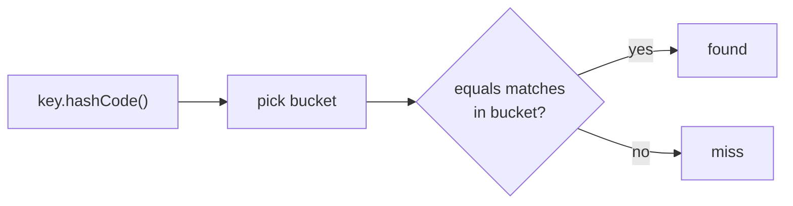
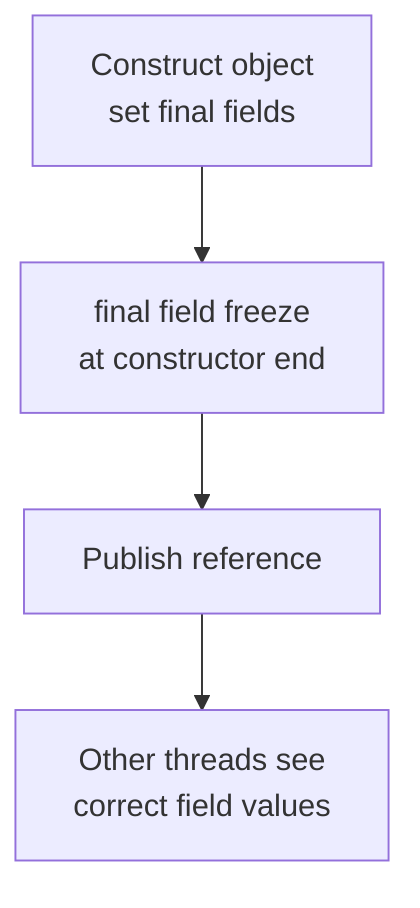

`equals`, `hashCode`, and immutability form one tightly coupled topic: get the contracts wrong and a `HashMap` silently loses your data. Interviewers use this area to test whether you understand not just the rules but why they exist and how they interact with collections and concurrency. This page ties it together.

## The equals contract

`Object.equals` compares references by default. When you override it, you must honour five rules for the whole object system to work.

| Property | Meaning |
|---|---|
| Reflexive | `x.equals(x)` is always true |
| Symmetric | `x.equals(y)` implies `y.equals(x)` |
| Transitive | `x.equals(y)` and `y.equals(z)` implies `x.equals(z)` |
| Consistent | Repeated calls return the same result if the objects do not change |
| Null-false | `x.equals(null)` is always false, never throws |

## The hashCode contract

`hashCode` returns an `int` used to bucket objects in hash-based collections. Two rules bind it to `equals`:

- If two objects are equal by `equals`, they **must** have the same `hashCode`.
- Unequal objects *may* share a hashCode (a collision), but good distribution reduces them.

> [!KEY]
> Equal objects must have equal hash codes. This single rule is why you can never override `equals` without also overriding `hashCode`.

## What breaks when you override only one

A `HashMap` finds a key in two steps: pick the bucket from `hashCode`, then confirm the match with `equals`. If you override `equals` (so two "equal" keys are logically the same) but leave the default `hashCode` (identity-based, different per instance), the two keys land in different buckets and the map never finds the entry.



```java
Map<Point, String> map = new HashMap<>();
map.put(new Point(1, 2), "a");
System.out.println(map.get(new Point(1, 2))); // null if hashCode not overridden
```

The entry is in the map, but a logically equal key computes a different bucket, so `get` returns null. Data is effectively lost.

## A correct equals and hashCode pair

Write both together, based on the same fields. `Objects.equals` handles nulls; `Objects.hash` builds a combined hash.

```java
final class Point {
    private final int x, y;
    Point(int x, int y) { this.x = x; this.y = y; }

    @Override public boolean equals(Object o) {
        if (this == o) return true;                 // fast identity check
        if (!(o instanceof Point p)) return false;  // pattern-match, also null-safe
        return x == p.x && y == p.y;
    }
    @Override public int hashCode() { return Objects.hash(x, y); }
}
```

> [!TIP]
> `Objects.hash(...)` is clean but allocates a varargs array and boxes each argument on every call. In a hot path (a key hashed millions of times) hand-roll `31 * result + field` to avoid the allocation, and cache the result for immutable objects.

```java
@Override public int hashCode() {
    int result = x;
    result = 31 * result + y; // 31 is odd and prime, cheap via shift-and-subtract
    return result;
}
```

## instanceof versus getClass

Two schools of `equals` exist. `instanceof` allows a subclass instance to equal a superclass instance; `getClass()` requires exact class match. The problem is that mixing inheritance with `equals` fundamentally breaks symmetry.

```java
// With instanceof: Point p, ColorPoint cp
p.equals(cp);  // true  - cp is a Point with matching coordinates
cp.equals(p);  // false - p has no color, so ColorPoint.equals rejects it
```

That asymmetry violates the contract. `getClass()` avoids it but then a subclass instance can never equal its superclass, breaking Liskov substitution. There is no clean fix, which is why the modern advice is to **favour composition over inheritance** for value types, or use `record` and never subclass them.

> [!WARNING]
> You cannot add a value-carrying field in a subclass and keep a symmetric `equals`. This is a fundamental limitation, not a coding mistake. Prefer composition or final value types.

## Mutable keys become unreachable

If you use a mutable object as a hash key and then mutate a field that participates in `hashCode`, the object's bucket changes but it stays physically in the old bucket. You can no longer find it — even with the same reference.

```java
Set<List<Integer>> set = new HashSet<>();
List<Integer> key = new ArrayList<>(List.of(1, 2));
set.add(key);
key.add(3);                       // mutates hashCode
System.out.println(set.contains(key)); // false - lost, wrong bucket
```

> [!DANGER]
> Never use a mutable object as a key in a hash-based collection if the fields used by `hashCode` can change. The entry becomes unreachable and leaks. Use immutable keys.

## compareTo consistency and TreeSet versus HashSet

`compareTo` (from `Comparable`) should be *consistent with equals*: `x.compareTo(y) == 0` should mean `x.equals(y)`. When it is not, ordered and hashed collections disagree. The classic example is `BigDecimal`: `new BigDecimal("1.0")` and `new BigDecimal("1.00")` are `compareTo`-equal but not `equals`-equal (different scale).

```java
var a = new BigDecimal("1.0");
var b = new BigDecimal("1.00");
Set<BigDecimal> hash = new HashSet<>(List.of(a, b));
Set<BigDecimal> tree = new TreeSet<>(List.of(a, b));
System.out.println(hash.size()); // 2 - equals says different
System.out.println(tree.size()); // 1 - compareTo says equal
```

| Collection | Uses | Result for the two BigDecimals |
|---|---|---|
| `HashSet` | `equals` + `hashCode` | Keeps both (size 2) |
| `TreeSet` | `compareTo` | Keeps one (size 1) |

The two collections genuinely disagree about how many elements exist. Keep `compareTo` consistent with `equals` unless you have a documented reason not to.

## Records generate it for you

A `record` auto-generates `equals`, `hashCode`, and `toString` from its components, all consistent by construction. For a value type with no inheritance needs, a record removes an entire class of bugs.

```java
record Money(long cents, String currency) {} // equals, hashCode, toString generated
```

## Designing an immutable class

Immutability is the most reliable way to make `equals`/`hashCode` safe, and it makes objects trivially thread-safe. The recipe:

- Make the class `final` so behaviour cannot be subclassed away.
- Make all fields `private final`.
- Provide no setters and no mutating methods.
- **Defensively copy** mutable inputs in the constructor and mutable outputs in getters.
- Do not leak `this` during construction (no registering callbacks mid-constructor).

```java
final class Period {
    private final Date start, end;                 // Date is mutable
    Period(Date start, Date end) {
        this.start = new Date(start.getTime());    // copy in - caller can't mutate our state
        this.end = new Date(end.getTime());
    }
    Date start() { return new Date(start.getTime()); } // copy out - caller can't mutate ours
}
```

## Safe publication

A subtle guarantee: `final` fields set in the constructor are safely published, meaning other threads see the fully constructed values without extra synchronisation. This is why a properly immutable object can be shared across threads freely.



## The shallow-immutability trap

`List.of`, `Map.of`, and `Collections.unmodifiableList` prevent structural changes to the collection, but they do **not** deep-freeze the elements. If the elements are mutable, their internal state can still change.

```java
List<StringBuilder> list = List.of(new StringBuilder("a"));
// list.add(...) throws UnsupportedOperationException
list.get(0).append("b"); // allowed - the element itself is still mutable
```

Immutability of the container is not immutability of what it contains. For true immutability, the elements must also be immutable.

## Objects utility helpers

`java.util.Objects` removes boilerplate and null hazards from equality code.

| Method | Purpose |
|---|---|
| `Objects.equals(a, b)` | Null-safe equality, true if both are null |
| `Objects.hashCode(x)` | Zero for null, otherwise `x.hashCode()` |
| `Objects.hash(a, b, ...)` | Combined hash across several fields |
| `Objects.requireNonNull(x)` | Fail fast on null with a message |

```java
@Override public boolean equals(Object o) {
    if (this == o) return true;
    if (!(o instanceof User u)) return false;
    return Objects.equals(email, u.email); // safe even if email is null on either side
}
```

`Objects.equals` is essential when a field may be null, because calling `email.equals(...)` directly would throw a `NullPointerException`. Prefer these helpers over hand-rolled null checks — they are shorter and less error-prone — while remembering that `Objects.hash` allocates a varargs array on every call, so a hot path may still warrant a hand-written hash.

## Cheat sheet

- Override `equals` and `hashCode` together, from the same fields.
- Equal objects must return equal hash codes; unequal may collide.
- Overriding only `equals` makes a `HashMap` fail to find equal keys.
- `equals` must be reflexive, symmetric, transitive, consistent, and null-false.
- `instanceof` risks asymmetry; adding a field in a subclass breaks symmetry.
- Never use a mutable object as a hash key if its `hashCode` fields can change.
- Keep `compareTo` consistent with `equals`; `BigDecimal` is the classic exception.
- `TreeSet` uses `compareTo`, `HashSet` uses `equals` — they can disagree.
- Records generate correct `equals`/`hashCode`/`toString` for value types.
- Immutable class: final class, private final fields, no setters, defensive copies.
- `final` fields are safely published across threads without extra synchronisation.
- `List.of` and friends are shallowly immutable; elements can still mutate.

## Common mistakes

| Mistake | Fix |
|---|---|
| Overriding `equals` but not `hashCode` | Always override both together |
| Using different fields in `equals` and `hashCode` | Base both on the same fields |
| Mutable object as a `HashMap` key | Use immutable keys |
| Storing the passed-in `Date`/array reference directly | Defensively copy in the constructor |
| Returning the internal mutable field | Return a defensive copy |
| Assuming `List.of` deep-freezes elements | Ensure elements are also immutable |
| Adding a value field in a subclass with `equals` | Use composition or a `record` |
| Assuming `TreeSet` and `HashSet` agree on size | Keep `compareTo` consistent with `equals` |

## Summary

`equals` and `hashCode` are a contract pair: equal objects must hash equally, or hash-based collections silently misplace and lose data. Correct implementations use the same fields, handle null via `Objects.equals`, and weigh `Objects.hash` convenience against its allocation cost on hot paths. Inheritance plus `equals` is fundamentally hard because a value-carrying subclass cannot stay symmetric, which pushes value types toward composition or records. Immutability resolves most of these hazards at once — it makes keys safe, makes objects thread-safe through safe publication of `final` fields, and simplifies caching — provided you defensively copy and remember that `List.of` freezes only the container, not its elements.

## Top Interview Questions

### Q1. Why does overriding `equals` without `hashCode` break a HashMap?

A `HashMap` locates entries in two steps: it computes the key's `hashCode` to choose a bucket, then uses `equals` within that bucket to confirm the match. If you override `equals` so two logically equal keys are considered the same, but leave the inherited identity-based `hashCode`, those two keys almost certainly produce different hash codes and land in different buckets. So after `map.put(keyA, v)`, a lookup with an equal `keyB` computes a different bucket and returns null — the entry is present but unreachable. The `hashCode` contract requires equal objects to have equal hash codes precisely so the bucket step and the equals step agree. Always override both together.

### Q2. What is the full `equals` contract?

`equals` must satisfy five properties. Reflexive: `x.equals(x)` is true. Symmetric: if `x.equals(y)` then `y.equals(x)`. Transitive: if `x.equals(y)` and `y.equals(z)` then `x.equals(z)`. Consistent: repeated calls give the same answer as long as the objects are unchanged. And null-handling: `x.equals(null)` returns false and never throws. Additionally, whenever you override `equals` you must override `hashCode` so equal objects hash equally. Violating any of these breaks collections and comparisons in subtle ways — for instance broken symmetry makes `contains` return different answers depending on argument order.

### Q3. Why is it hard to implement `equals` correctly across an inheritance hierarchy?

Because adding a value-carrying field in a subclass makes symmetry impossible. Suppose `Point` uses `instanceof` in `equals`, and `ColorPoint` adds a color. Then `point.equals(colorPoint)` may be true (the point sees matching coordinates) while `colorPoint.equals(point)` is false (the color point demands a matching color), violating symmetry. Switching to `getClass()` restores symmetry but then a `ColorPoint` can never equal a `Point`, breaking substitutability. There is no implementation that adds a significant field and preserves the contract, so the accepted solutions are to favour composition over inheritance for value types, or to use final classes and records that cannot be extended.

### Q4. When would you hand-write `hashCode` instead of using `Objects.hash`?

`Objects.hash(a, b, c)` is concise and correct, but it allocates a varargs array and autoboxes every argument on each call. For an object hashed extremely frequently — a key in a hot map iterated millions of times — that per-call allocation and boxing shows up in profiles. In that case, hand-roll the classic `int result = f1; result = 31 * result + f2; ...` form, which avoids the array and boxing (31 is chosen because it is an odd prime and `31 * x` optimises to `(x << 5) - x`). For immutable objects you can go further and cache the computed hash in a field. For ordinary code, `Objects.hash` is the right, readable default.

### Q5. What happens if you mutate a field of an object used as a HashMap key?

If the mutated field participates in `hashCode`, the key's hash changes, but the entry remains physically stored in the bucket chosen by its original hash. The map has no way to know it should be moved. As a result, lookups now compute the new bucket and miss, so `get`, `containsKey`, and even removal by that key all fail — the entry becomes unreachable and effectively a memory leak. Even iterating and re-adding will not cleanly recover it. The rule is to use immutable keys, or at least keys whose `hashCode`/`equals` fields never change while they are in the collection. This is a frequent, hard-to-diagnose production bug.

### Q6. Why do `HashSet` and `TreeSet` sometimes disagree about how many elements they contain?

`HashSet` decides equality with `equals` plus `hashCode`, while `TreeSet` decides it with `compareTo` (or a supplied `Comparator`), treating any two elements with a comparison result of 0 as duplicates. When `compareTo` is not consistent with `equals`, the two collections disagree. The textbook example is `BigDecimal`: `new BigDecimal("1.0")` and `new BigDecimal("1.00")` are not `equals`-equal (scale differs) but are `compareTo`-equal. So a `HashSet` of both has size 2 while a `TreeSet` has size 1. The lesson is to keep `compareTo` consistent with `equals`, and to be aware which contract a given collection relies on.

### Q7. How do you design a properly immutable class?

Make the class `final` so no subclass can add mutable behaviour. Make every field `private final`. Provide no setters and no methods that change state. For any field of a mutable type (arrays, `Date`, collections), defensively copy the value in the constructor so the caller cannot mutate your internal state afterward, and copy again when returning it from a getter so callers cannot mutate it through the returned reference. Do not let `this` escape during construction (for example by registering a listener before the constructor finishes), because another thread could then see a half-built object. For simple value types, a `record` gives you shallow immutability and the boilerplate for free.

### Q8. What is safe publication and how does immutability provide it for free?

Safe publication means that when one thread makes an object visible to another, the second thread sees the object's fields fully and correctly initialised rather than default or partial values. The Java Memory Model gives a special guarantee: `final` fields set in a constructor are frozen at the end of construction, so any thread that obtains the reference afterward is guaranteed to see their correct values without additional synchronisation. A properly immutable object — final fields, no mutation, no `this` escaping during construction — is therefore safely publishable and shareable across threads with no locks or volatile. This is a core reason immutability simplifies concurrency: correctly published immutable objects are inherently thread-safe.

### Q9. You wrap a list with `Collections.unmodifiableList` but a caller still changed the data. How is that possible?

`Collections.unmodifiableList` (and `List.of`, `Map.of`) produce shallowly immutable views: they block structural modification of the container — `add`, `remove`, `set` throw `UnsupportedOperationException` — but they do nothing to the elements themselves. If the elements are mutable objects, a caller can still retrieve one and mutate its internal state, which changes the data the "unmodifiable" list holds. There is also the trap that `unmodifiableList` wraps the original list, so if you keep and mutate the backing list, the view reflects it. True immutability requires the elements to be immutable too (and copying the backing collection). Deep immutability is the caller's responsibility, not something these wrappers provide.

### Q10. How does a `record` implement `equals`, `hashCode`, and `toString`?

A `record` derives all three from its components in declaration order. The generated `equals` returns true only if the other object is the same record type and every corresponding component is equal (using `Objects.equals` semantics, and the type-appropriate comparison for primitives, including `Double.compare` for floating point). The generated `hashCode` combines the components' hash codes, and `toString` renders `TypeName[comp1=v1, comp2=v2]`. Because all three are generated consistently from the same components, the contracts are satisfied by construction, eliminating the classic mismatch bugs. Records are implicitly final and their components final, so they are shallowly immutable value types — ideal for DTOs, map keys, and compound return values.

### Q11. Why does immutability simplify concurrency and caching?

An immutable object has no mutable state, so there are no writes to coordinate: any number of threads can read it simultaneously with no locks, no visibility hazards, and no risk of seeing an inconsistent intermediate state. Combined with the `final`-field safe-publication guarantee, sharing one is free of synchronisation. For caching, immutability means a cached value can never be corrupted by a caller mutating it later, so you can share a single instance widely, cache derived values like a computed `hashCode`, and even intern frequently used instances. This is why the JDK makes `String`, the boxed number types, and `LocalDate`/`LocalDateTime` immutable — safety and shareability outweigh the cost of allocating new objects on change.

### Q12. A cache keyed on a custom object has a growing miss rate and memory footprint in production. How do you diagnose it?

The prime suspects are a broken `equals`/`hashCode` pair or a mutable key. First I would confirm the key class overrides both `equals` and `hashCode`, based on the same fields — if only `equals` is overridden, every lookup misses and the cache grows without bound because equal keys never match existing entries. Next I would check whether the key is mutable and whether any code mutates a field used in `hashCode` after insertion, which strands entries in the wrong bucket. I would also verify the fields used are stable and that no subclass introduced an asymmetric `equals`. The fix is a correct, consistent `equals`/`hashCode` on an immutable key — ideally converting the key to a `record`.
