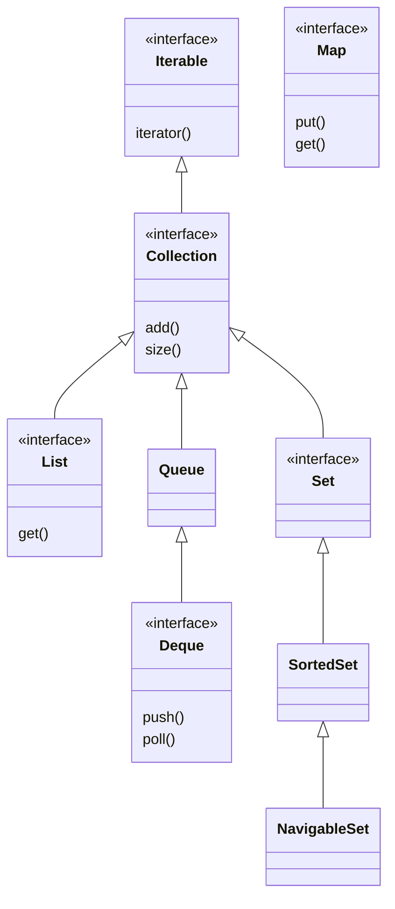

The collections framework is the vocabulary of everyday Java. Interviewers use it to check whether you reach for the right structure by reflex and can defend the choice with real numbers, not habit.

## The interface hierarchy

Everything iterable descends from `Iterable`. `Collection` adds bulk operations, and three shapes split off it: `List` (ordered, indexed, duplicates allowed), `Set` (no duplicates), and `Queue`/`Deque` (ends-first access). `Map` is deliberately **not** a `Collection` — it stores key-value pairs, so its contract does not fit `add(E)`.



> [!KEY]
> `Map` is not a `Collection`. Say this out loud in an interview — candidates who claim `Map extends Collection` lose credibility instantly.

The concrete classes hang off those interfaces, and the split between what is an interface and what is an implementation is exactly what an interviewer is checking when they ask you to "draw the collections hierarchy".


Note the legacy branch on the left: `Vector` and its subclass `Stack` are synchronised on every method and predate the framework. They still compile, but reaching for them signals unfamiliarity with modern Java — use `ArrayList` with external synchronisation, `ArrayDeque` for stack semantics, or a `java.util.concurrent` class when you genuinely need thread safety.

## ArrayList vs LinkedList

`ArrayList` is a resizable `Object[]`. `LinkedList` is a doubly-linked chain of nodes. On paper `LinkedList` wins insert and delete at O(1), but that ignores how CPUs actually work.

| Operation | ArrayList | LinkedList |
|---|---|---|
| `get(i)` | O(1) | O(n) walk from an end |
| `add` at end | O(1) amortised | O(1) |
| `add`/`remove` mid-list | O(n) shift | O(1) *given a node*, but O(n) to find it |
| Memory per element | one reference | one node object plus 2 references |
| Cache locality | excellent (contiguous) | poor (scattered heap nodes) |

The trap: to insert "in the middle" of a `LinkedList` you must first *reach* the index, which is an O(n) pointer walk. Each hop is a pointer chase to a random heap address — a likely cache miss. A `LinkedList` node carries roughly **40 bytes** of overhead (object header, prev, next, element reference) versus a single 4–8 byte slot in `ArrayList`. In practice `ArrayList` beats `LinkedList` even for insert-heavy workloads because contiguous memory streams through the cache.

> [!DANGER]
> "`LinkedList` is faster for inserts" is the classic wrong answer. `LinkedList` is almost always the wrong choice; the only real niche is a queue/deque, and `ArrayDeque` beats it there too.

### How ArrayList grows

When the backing array fills, `ArrayList` allocates a new array at **1.5x** the old capacity (`oldCap + (oldCap >> 1)`), then copies with the intrinsic `System.arraycopy`. If you know the size up front, call `ensureCapacity` or pass the capacity to the constructor to avoid repeated resizes.

```java
List<String> ids = new ArrayList<>(10_000); // pre-size: skip ~14 resize+copy cycles
for (int i = 0; i < 10_000; i++) ids.add("id-" + i);

ArrayList<String> big = new ArrayList<>();
big.ensureCapacity(1_000_000); // one allocation instead of log-many
```

## Queues, stacks and dead legacy classes

For a stack or a queue, the modern answer is `ArrayDeque`: array-backed, no per-node allocation, and faster than both `Stack` and `LinkedList`.

```java
Deque<Integer> stack = new ArrayDeque<>();
stack.push(1); stack.push(2);        // LIFO
int top = stack.pop();               // 2

Deque<Integer> queue = new ArrayDeque<>();
queue.offer(1); queue.offer(2);      // FIFO
int head = queue.poll();             // 1
```

`Vector`, `Stack` and `Hashtable` are effectively dead. They synchronise every method, which is slow and still does not make compound operations atomic. `Stack` even extends `Vector`, so it exposes index access that breaks the LIFO abstraction. Use `ArrayDeque` for stacks/queues and `ConcurrentHashMap` when you need a thread-safe map.

### PriorityQueue

`PriorityQueue` is a binary **min-heap** backed by an array. The smallest element (by natural order or a `Comparator`) is always at the head.

```java
PriorityQueue<Task> pq = new PriorityQueue<>(Comparator.comparingInt(Task::priority));
pq.offer(a); pq.offer(b);   // O(log n) sift-up
Task next = pq.peek();      // O(1) smallest, no removal
Task run  = pq.poll();      // O(log n) remove smallest
```

Know the sharp edges: `offer`/`poll` are O(log n), `peek` is O(1), but `remove(Object)` and `contains` are **O(n)** linear scans. There is **no decrease-key** operation and iteration order is not sorted. It is also **not stable** — equal-priority elements come out in arbitrary order. If you need stability, add an insertion-sequence tiebreaker to the comparator.

## Big-O across implementations

| Structure | get/contains | add | remove | ordered? |
|---|---|---|---|---|
| `ArrayList` | O(1) index, O(n) contains | O(1)* end | O(n) | insertion |
| `LinkedList` | O(n) | O(1) ends | O(n) find | insertion |
| `ArrayDeque` | O(1) ends | O(1)* ends | O(1) ends | insertion |
| `HashSet` | O(1) avg | O(1) avg | O(1) avg | none |
| `TreeSet` | O(log n) | O(log n) | O(log n) | sorted |
| `PriorityQueue` | O(1) peek, O(n) contains | O(log n) | O(log n) min | heap |

`*` amortised across resizes.

## Iterators and fail-fast behaviour

Every `Collection` gives an `Iterator`. `List` also gives a `ListIterator`, which walks backwards and can `set`/`add` in place. Iterators over the non-concurrent collections are **fail-fast**: they snapshot a `modCount` counter, and if the collection is structurally modified during iteration by anything other than the iterator itself, the next `next()` throws `ConcurrentModificationException`.

```java
List<String> names = new ArrayList<>(List.of("a", "b", "c"));
for (String n : names) {
    if (n.equals("b")) names.remove(n); // throws ConcurrentModificationException
}
```

Remove safely with the iterator's own `remove()`, or the cleaner `removeIf`:

```java
names.removeIf(n -> n.equals("b"));      // safe, O(n), no CME

Iterator<String> it = names.iterator();
while (it.hasNext()) {
    if (it.next().equals("b")) it.remove(); // safe via the iterator
}
```

> [!WARNING]
> Fail-fast is a best-effort bug detector, not a thread-safety guarantee. It can miss races and is undefined across threads. Never rely on `ConcurrentModificationException` for correctness.

## Views, immutability and factory pitfalls

Three "list from values" idioms behave very differently, and this is a favourite gotcha.

| Expression | Mutable? | Resizable? | Backed by source? |
|---|---|---|---|
| `Arrays.asList(arr)` | element `set` only | ❌ fixed size | ✅ writes through to `arr` |
| `List.of(a, b)` | ❌ fully immutable | ❌ | ❌ null-hostile |
| `new ArrayList<>(src)` | ✅ | ✅ | ❌ independent copy |

```java
Integer[] arr = {1, 2, 3};
List<Integer> view = Arrays.asList(arr);
view.set(0, 9);          // OK, and arr[0] becomes 9 too
// view.add(4);          // UnsupportedOperationException — fixed size

List<Integer> immut = List.of(1, 2, 3);
// immut.set(0, 9);      // UnsupportedOperationException
```

`Collections.unmodifiableList(list)` returns a read-only **view**, not a copy — mutating the underlying `list` still shows through. `list.subList(from, to)` is likewise a live view: structural changes to the parent invalidate it, and changes through the sublist write back to the parent.

## Sorting and comparators

Build comparators declaratively; never subtract integers.

```java
people.sort(
    Comparator.comparing(Person::lastName)
              .thenComparing(Person::firstName)
              .reversed());                          // reverse the whole key

// null-safe ordering of a nullable field
people.sort(Comparator.comparing(Person::nickname,
            Comparator.nullsFirst(Comparator.naturalOrder())));
```

The `(a, b) -> a - b` comparator is a bug: for values like `Integer.MIN_VALUE` and a large positive number the subtraction **overflows** and returns the wrong sign. Use `Integer.compare(a, b)` or `Comparator.comparingInt`.

Under the hood, `Arrays.sort(int[])` (and other primitive overloads) uses a **dual-pivot quicksort** (fast, in-place, but **unstable** — irrelevant for primitives). `Arrays.sort(Object[])` and `Collections.sort` use **TimSort**, which is **stable** and adaptive to partially-ordered data. Stability matters when you sort by one key after another.

## The Collections utility class and fail-safe iteration

`java.util.Collections` holds static helpers you should reach for instead of reinventing them: `Collections.binarySearch` on a sorted list, `frequency`, `disjoint`, `max`/`min` with a comparator, `reverse`, `shuffle`, `swap`, and the `emptyList`/`singletonList` factories for cheap constants.

```java
int idx = Collections.binarySearch(sorted, 42); // list MUST already be sorted
int hits = Collections.frequency(list, "x");     // count occurrences
List<String> none = Collections.emptyList();      // shared immutable empty list
```

When you genuinely need to iterate while another thread mutates, use a **fail-safe** collection instead of fighting fail-fast. `CopyOnWriteArrayList` snapshots its backing array on every write, so iterators see a stable copy and never throw `ConcurrentModificationException`. It is ideal for read-heavy, write-rare data such as listener lists.

| Iterator style | Collections | On concurrent modification |
|---|---|---|
| Fail-fast | `ArrayList`, `HashMap`, `HashSet` | throws `ConcurrentModificationException` |
| Fail-safe (weakly consistent) | `CopyOnWriteArrayList`, `ConcurrentHashMap` | snapshot for copy-on-write, weakly consistent for CHM, no throw |

> [!NOTE]
> Fail-safe is not free: `CopyOnWriteArrayList` copies the whole array on every write, so it is O(n) per mutation. Use it only when reads vastly outnumber writes.

## Choosing a collection

| Need | Reach for |
|---|---|
| Indexed sequence, iterate a lot | `ArrayList` |
| Stack or queue | `ArrayDeque` |
| Unique elements, fast membership | `HashSet` |
| Sorted unique / range queries | `TreeSet` |
| Key-value lookup | `HashMap` |
| Always-smallest / scheduling | `PriorityQueue` |

## Cheat sheet

- `Map` is not a `Collection`; `Iterable` is the root of everything you can `for-each`.
- Default to `ArrayList`; `LinkedList` is almost always the wrong answer (cache misses, node overhead, O(n) index).
- `ArrayList` grows 1.5x and copies with `System.arraycopy`; pre-size with the constructor or `ensureCapacity`.
- Use `ArrayDeque` for both stacks and queues; `Vector`, `Stack`, `Hashtable` are legacy.
- `PriorityQueue` is a min-heap: O(log n) offer/poll, O(1) peek, O(n) remove, no decrease-key, not stable.
- Mutating a collection during a for-each throws `ConcurrentModificationException`; use `removeIf` or `iterator.remove()`.
- `Arrays.asList` is a fixed-size backed view; `List.of` is immutable; `new ArrayList<>(...)` is a copy.
- `unmodifiableList` and `subList` are views, not copies.
- Never sort with `(a, b) -> a - b`; it overflows. Use `Integer.compare`.

## Common mistakes

| Mistake | Fix |
|---|---|
| Choosing `LinkedList` for "fast inserts" | Use `ArrayList`; measure — cache locality wins |
| `list.add` inside a for-each loop | Use `iterator.add` / `removeIf` / collect into a new list |
| `Arrays.asList(arr).add(x)` | It is fixed-size; use `new ArrayList<>(Arrays.asList(arr))` |
| `List.of(a, null)` | `List.of` rejects null; use `Arrays.asList` or a mutable list |
| `(a, b) -> a - b` comparator | `Integer.compare(a, b)` to avoid overflow |
| Treating `unmodifiableList` as a snapshot | It is a view; copy first with `List.copyOf` |
| Using `Stack` for a stack | Use `ArrayDeque` |

## Summary

The framework hangs off `Iterable` → `Collection` splitting into `List`, `Set`, and `Queue`/`Deque`, with `Map` standing apart. Default to `ArrayList` and `ArrayDeque`; `LinkedList` and the legacy synchronised classes rarely earn their place. Know that `ArrayList` grows 1.5x, that fail-fast iterators throw `ConcurrentModificationException`, and that `Arrays.asList`, `List.of`, and `new ArrayList<>` differ in mutability. Finally, build comparators with `comparing().thenComparing()` and never subtract integers to compare them.

## Top Interview Questions

### Q1. Why is ArrayList usually faster than LinkedList even for insertions?

Because CPUs love contiguous memory. `ArrayList` stores elements in a single backing array, so iteration and access stream through the CPU cache with almost no misses. `LinkedList` scatters nodes across the heap, so every hop is a pointer chase to a random address — a likely cache miss — and each node carries ~40 bytes of overhead. `LinkedList` insert is only O(1) if you already hold the node; reaching an index is an O(n) walk. In benchmarks, `ArrayList` typically wins even insert-in-the-middle workloads once you account for the traversal cost. The only place `LinkedList` is defensible is as a deque, and `ArrayDeque` beats it there too.

### Q2. Is Map part of the Collection hierarchy?

No. `Map` does not extend `Collection`, and this is deliberate. `Collection` is built around single elements with methods like `add(E)`, `contains(E)`, and `iterator()`. A `Map` stores key-value **pairs**, which do not fit that single-element contract. Instead `Map` is a sibling root interface. You can still get collection views from it: `keySet()` returns a `Set`, `values()` returns a `Collection`, and `entrySet()` returns a `Set<Map.Entry<K,V>>`. Those views are what let you iterate a map. Claiming `Map extends Collection` is a common slip that signals shaky fundamentals.

### Q3. How does ArrayList grow, and how do you avoid repeated resizing?

`ArrayList` wraps an `Object[]`. When you `add` past capacity it computes a new capacity of roughly 1.5x the old one (`oldCap + (oldCap >> 1)`), allocates a new array, and copies the elements with the intrinsic `System.arraycopy`. Growth is geometric, so `add` at the end is **amortised** O(1), but each individual resize is O(n). If you know the final size, pass it to the constructor (`new ArrayList<>(n)`) or call `ensureCapacity(n)` once. That turns log-many allocations and copies into a single allocation, which matters in hot loops that build large lists.

### Q4. What is a fail-fast iterator and how do you delete safely during iteration?

Fail-fast iterators track a `modCount` field that increments on every structural change. When you create an iterator it records the current `modCount`; on each `next()` it checks that the count is unchanged and throws `ConcurrentModificationException` if the collection was modified by anything except the iterator itself. To delete safely, use the iterator's own `remove()`, or better, `collection.removeIf(predicate)`, which handles it internally. Note fail-fast is best-effort bug detection, not a concurrency guarantee — it can miss modifications and is undefined across threads. For concurrent iteration use `CopyOnWriteArrayList` or `ConcurrentHashMap`, whose iterators are weakly consistent.

### Q5. Explain the difference between Arrays.asList, List.of, and new ArrayList<>.

`Arrays.asList(arr)` returns a **fixed-size list backed by the array**: you can `set` elements (which writes through to the array) but `add`/`remove` throw `UnsupportedOperationException`. `List.of(...)` returns a **truly immutable** list — no mutation at all — and it rejects null elements. `new ArrayList<>(source)` creates an **independent, fully mutable copy** with no link back to the source. The interview trap is calling `add` on `Arrays.asList` or `List.of` and being surprised by the exception, or mutating the array behind an `Arrays.asList` view and seeing the list change. Choose based on whether you need mutability, resizability, and a live link to the source.

### Q6. Why is (a, b) -> a - b a buggy comparator?

Because integer subtraction can overflow. If `a` is a large positive number and `b` is `Integer.MIN_VALUE`, `a - b` overflows the 32-bit range and wraps to a negative value, so the comparator reports the wrong order. That silently corrupts sorts and `TreeMap`/`TreeSet` structure. The correct forms are `Integer.compare(a, b)`, `Comparator.comparingInt(...)`, or `Comparator.naturalOrder()`, all of which compute the sign without arithmetic overflow. This question checks whether you understand that a comparator must return the sign of the comparison, not a difference, and that difference-based comparators are only safe when both values are known to be non-negative and bounded.

### Q7. When would you actually use a PriorityQueue, and what are its limits?

Use it whenever you repeatedly need the current minimum or maximum: Dijkstra's shortest path, event scheduling, merging k sorted streams, or a top-k heap. It is a binary heap giving O(log n) `offer`/`poll` and O(1) `peek`. The limits interviewers probe: `remove(Object)` and `contains` are O(n) linear scans; there is no efficient decrease-key, so graph algorithms often re-insert and lazily skip stale entries; iteration order is not sorted; and it is not stable, so equal-priority items emerge in arbitrary order. For stability, encode an insertion sequence number as a comparator tiebreaker. It also permits duplicates and forbids null elements.

### Q8. A colleague wraps a list with Collections.unmodifiableList and hands it out as a snapshot. What is the bug?

`unmodifiableList` returns a read-only **view**, not a copy. The wrapper only blocks mutations through *itself*; whoever holds the original backing list can still mutate it, and every change shows through the "unmodifiable" view. So the snapshot is not really frozen — it reflects later edits, which can surprise callers and cause data races if the writer runs on another thread. The fix is to take a defensive copy: `List.copyOf(list)` (immutable copy, Java 10+) or `new ArrayList<>(list)` if the caller needs mutability. The same view-not-copy gotcha applies to `subList`, `keySet`, `values`, and `Arrays.asList`.

### Q9. Which is stable, Arrays.sort on primitives or on objects, and why does it matter?

`Arrays.sort(int[])` (and other primitive overloads) uses a dual-pivot quicksort, which is **unstable** — but stability is meaningless for primitives, since equal ints are indistinguishable. `Arrays.sort(Object[])` and `Collections.sort` use **TimSort**, which is **stable** and preserves the relative order of elements that compare equal. Stability matters when you sort in stages: sort by secondary key, then by primary key, and a stable sort keeps the secondary order within equal primary groups. If the object sort were unstable, that layered approach would break. TimSort also runs in O(n) on already-sorted or reverse-sorted runs, so it is adaptive to real-world partially-ordered data.

### Q10. In production you see intermittent ConcurrentModificationException from an ArrayList shared by two threads. What is happening and how do you fix it?

A plain `ArrayList` is not thread-safe. Two threads modifying it concurrently corrupt the internal state and `modCount`, and one thread's iterator sees the other's structural change and throws `ConcurrentModificationException` — though corruption can also manifest as lost updates, wrong sizes, or `ArrayIndexOutOfBoundsException`, which is worse because it is silent. The exception here is actually doing you a favour by surfacing the race. Fixes, in order of preference: confine the list to one thread; use a concurrent collection like `CopyOnWriteArrayList` (great for read-heavy, low-write) or `ConcurrentLinkedQueue`; or guard every access with a single lock. `Collections.synchronizedList` makes individual calls atomic but you still must synchronise manually around iteration.
