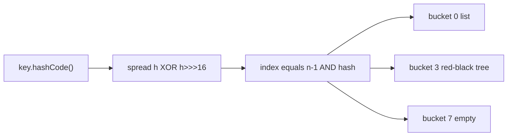

`HashMap` is the single most-asked data structure in Java interviews. Senior rounds go past "it uses hashing" into buckets, resizing, treeification, and the concurrency pitfalls that have caused real outages.

## HashMap internals

A `HashMap` is an array of buckets. Each bucket holds entries whose keys map to the same index. The array length is always a **power of two**, which lets the map compute an index with a fast bitmask instead of a modulo.

```java
// JDK hash spread: mix high bits down so they influence the low-bit index
static int hash(Object key) {
    int h;
    return (key == null) ? 0 : (h = key.hashCode()) ^ (h >>> 16);
}
int index = (n - 1) & hash; // n is the power-of-two table length
```

Why the `h ^ (h >>> 16)` spread? The index is `(n - 1) & hash`, which only keeps the **low** bits of the hash. Many real `hashCode()` implementations vary mostly in their high bits, so without spreading, keys would collide in a handful of buckets. XOR-ing the top 16 bits down mixes them into the low bits that actually pick the bucket.



Defaults: capacity **16**, load factor **0.75**. When `size > capacity * loadFactor` (12 entries at capacity 16), the table **resizes** — it doubles to 32 and rehashes every entry into the larger array. Doubling keeps indices cheap because an entry either stays at index `i` or moves to `i + oldCap`, decided by one bit.

### Collisions and treeification

Colliding keys chain in a bucket. From Java 8, once a single bucket holds **8** entries *and* the table capacity is at least 64, that bucket **treeifies** — the linked list becomes a **red-black tree**, so lookups in a pathological bucket drop from O(n) to O(log n). If the bucket later shrinks to **6** entries it **untreeifies** back to a list.

> [!KEY]
> A broken `hashCode` that returns a constant funnels every key into one bucket. Before Java 8 that was O(n) per lookup; since Java 8 treeification softens the worst bucket to O(log n) using a red-black tree, with tie-breakers even for non-`Comparable` keys. Fix the `hashCode`; do not rely on the tree.

## HashSet is a HashMap

`HashSet` is literally a `HashMap` where every key maps to a shared dummy `PRESENT` value. `add(e)` calls `map.put(e, PRESENT)`. So everything about `HashMap` hashing, resizing, and treeification applies to `HashSet` unchanged. `LinkedHashSet` and `TreeSet` similarly wrap `LinkedHashMap` and `TreeMap`.

## The hashCode and equals contract

Every hash-based collection depends on a contract: if `a.equals(b)`, then `a.hashCode() == b.hashCode()`. The reverse need not hold — unequal objects may share a hash (a collision), which is fine. Break the forward direction and lookups silently fail, because the map looks in the wrong bucket. Override both together, using the same fields.

```java
record Point(int x, int y) {} // record auto-generates correct equals + hashCode

// Manual version for a class:
@Override public boolean equals(Object o) {
    if (this == o) return true;
    if (!(o instanceof Point p)) return false;
    return x == p.x && y == p.y;
}
@Override public int hashCode() { return Objects.hash(x, y); } // same fields as equals
```

A good `hashCode` spreads values across the int range so buckets fill evenly; a constant `hashCode` is legal but funnels everything into one bucket. This is exactly why records — which generate both methods from their components — make ideal, bug-free map keys.

## LinkedHashMap and a 3-line LRU cache

`LinkedHashMap` keeps a doubly-linked list threaded through its entries. In **insertion order** (default) it iterates in the order keys were added; in **access order** (`accessOrder = true`) every `get`/`put` moves the entry to the tail. Override `removeEldestEntry` and you have an LRU cache:

```java
class LruCache<K, V> extends LinkedHashMap<K, V> {
    private final int cap;
    LruCache(int cap) { super(16, 0.75f, true); this.cap = cap; } // access-order
    @Override protected boolean removeEldestEntry(Map.Entry<K, V> e) {
        return size() > cap; // evict least-recently-used when over capacity
    }
}
```

## TreeMap and the navigation API

`TreeMap` is a **red-black tree** — a self-balancing BST keeping keys sorted. All core operations are O(log n), and it offers a rich navigation API that `HashMap` cannot:

| Method | Returns |
|---|---|
| `firstKey` / `lastKey` | smallest / largest key |
| `firstEntry` / `pollFirstEntry` | peek / remove the smallest entry |
| `floorKey(k)` | greatest key `<= k` |
| `ceilingKey(k)` | smallest key `>= k` |
| `lowerKey(k)` / `higherKey(k)` | strictly `<` / `>` k |
| `headMap` / `tailMap` / `subMap` | sorted range views |

```java
TreeMap<Integer, String> t = new TreeMap<>();
t.put(10, "a"); t.put(20, "b"); t.put(30, "c");
t.floorKey(25);          // 20  — largest key <= 25
t.ceilingKey(25);        // 30  — smallest key >= 25
t.subMap(10, true, 20, true); // {10=a, 20=b} live range view
```

> [!WARNING]
> `TreeMap` decides equality by the **comparator**, not `equals`. If your comparator says two keys are equal but `equals` disagrees, the map treats them as the same key — silently overwriting. This is the "comparator inconsistent with equals" trap. Keep them consistent.

## Specialised maps

| Map | Backed by | Use when |
|---|---|---|
| `EnumMap` | an array indexed by ordinal | keys are enum constants — tiny and fast |
| `IdentityHashMap` | `==` identity, not `equals` | you need reference identity (frameworks, serialization graphs) |
| `WeakHashMap` | weak key references | keys can be GC'd when unreferenced elsewhere (caches, listeners) |

`EnumMap` is dramatically smaller and faster than `HashMap` for enum keys because it is just an array — no hashing at all. `WeakHashMap` lets entries disappear when their key is no longer strongly referenced, which is perfect for metadata caches keyed by a live object. `IdentityHashMap` compares keys by `==`, used where two `equals`-equal-but-distinct objects must stay separate.

## ConcurrentHashMap vs the alternatives

A plain `HashMap` is not thread-safe. The three thread-safe options are not equivalent:

| Option | Locking | Reads | Notes |
|---|---|---|---|
| `Hashtable` | one lock, whole map | blocked by writers | legacy, avoid |
| `Collections.synchronizedMap` | one lock, whole map | blocked | manual sync needed to iterate |
| `ConcurrentHashMap` | per-bin (CAS + short locks) | lock-free | scales with cores |

`ConcurrentHashMap` (CHM) locks only the bin being written, so unrelated writes proceed in parallel and reads are usually lock-free. Its atomic combinators avoid check-then-act races:

```java
ConcurrentHashMap<String, List<Order>> byUser = new ConcurrentHashMap<>();
byUser.computeIfAbsent(userId, k -> new CopyOnWriteArrayList<>()).add(order); // atomic
counts.merge(word, 1L, Long::sum); // atomic increment even under contention
```

CHM iterators are **weakly consistent**: they never throw `ConcurrentModificationException`, reflect some but not necessarily all concurrent updates, and traverse safely. Its `size()` is **not** a locked snapshot — it is an estimate that can be stale under concurrent writes. CHM forbids null keys and null values precisely so that `get` returning null unambiguously means "absent."

> [!DANGER]
> `computeIfAbsent` must not modify the same map inside its mapping function, and the function should be short and non-blocking. A long or re-entrant function can deadlock or livelock a bin.

## Concurrency history and hazards

In Java 7 and earlier, `HashMap` resize built buckets by moving nodes to the head of the new list, which reversed order. Under concurrent resize by two threads this could form a **cycle**, and a later `get` would spin forever — a real production hang that pinned a CPU at 100%. Java 8 changed resize to preserve order and split each bin into "low" and "high" lists, removing that specific cycle. But the lesson stands: **never share a plain `HashMap` across threads for writes.** Even in Java 8+, concurrent writes lose updates and corrupt state. Use `ConcurrentHashMap`.

Another subtle bug: **mutable keys.** If you store a key, then mutate a field that its `hashCode`/`equals` depend on, the key now hashes to a different bucket than where it lives, so `get` cannot find it — the entry becomes unreachable but still occupies space. Use immutable keys (records, `String`, boxed primitives).

## Null rules by implementation

| Map | Null key | Null value |
|---|---|---|
| `HashMap` | ✅ one | ✅ |
| `LinkedHashMap` | ✅ one | ✅ |
| `TreeMap` | ❌ (NPE, needs ordering) | ✅ |
| `Hashtable` | ❌ | ❌ |
| `ConcurrentHashMap` | ❌ | ❌ |

## Cheat sheet

- Bucket index is `(n - 1) & hash`; `n` is a power of two so the mask replaces modulo.
- `hash()` spreads high bits with `h ^ (h >>> 16)` so they affect the low-bit index.
- Defaults: capacity 16, load factor 0.75; resize doubles and rehashes at 12 entries.
- A bucket treeifies to a red-black tree at 8 entries (capacity ≥ 64), untreeifies at 6.
- `HashSet` is a `HashMap` with a dummy value; `TreeSet`/`LinkedHashSet` wrap their maps too.
- `LinkedHashMap(…, true)` plus `removeEldestEntry` gives a 3-line LRU cache.
- `TreeMap` is a red-black tree with `floor/ceiling/higher/lower` navigation; keep comparator consistent with equals.
- Prefer `ConcurrentHashMap` over `Hashtable`/`synchronizedMap`; use `computeIfAbsent`/`merge` for atomic updates.
- Never mutate a key's hashCode-relevant fields after insertion.

## Common mistakes

| Mistake | Fix |
|---|---|
| Overriding `equals` but not `hashCode` | Override both; unequal hashCodes break lookups |
| Constant/poor `hashCode` | Use all identifying fields; `Objects.hash(...)` |
| Sharing a plain `HashMap` across writer threads | Use `ConcurrentHashMap` |
| `if (!map.containsKey(k)) map.put(k, new List())` | `computeIfAbsent(k, ...)` — atomic and race-free |
| Mutable map keys | Use immutable keys (records, String) |
| Expecting `TreeMap` to allow null keys | It throws NPE; only `HashMap`/`LinkedHashMap` allow one |
| Trusting `ConcurrentHashMap.size()` as exact | It is an estimate under concurrent writes |

## Summary

`HashMap` is a power-of-two bucket array indexed by `(n - 1) & hash`, with a high-bit spread, a 0.75 load factor that triggers doubling resizes, and treeification of hot buckets into red-black trees at eight entries. `HashSet` is just a `HashMap` with a placeholder value, `LinkedHashMap` adds ordering and a trivial LRU, and `TreeMap` trades O(1) for sorted O(log n) navigation. For concurrency, `ConcurrentHashMap` with `computeIfAbsent`/`merge` is the modern answer; `Hashtable` and `synchronizedMap` serialise the whole map, and a plain `HashMap` shared across threads can corrupt or historically even hang.

## Top Interview Questions

### Q1. Walk me through what happens on HashMap.put.

First `hash(key)` computes `key.hashCode()` and spreads it with `h ^ (h >>> 16)` so high bits influence the low-order index. The bucket index is `(n - 1) & hash`, where `n` is the power-of-two table length. If the bucket is empty, the entry goes straight in. If not, the map walks the bucket comparing by `hash` then `equals`: a matching key has its value replaced; otherwise the new entry is appended. If appending makes the bucket reach 8 entries and capacity is ≥ 64, the bucket treeifies into a red-black tree. Finally, if `size` exceeds `capacity * 0.75`, the table doubles and rehashes. So `put` is amortised O(1) with a good hash.

### Q2. Why is HashMap capacity always a power of two?

Because it lets the map replace an expensive modulo with a cheap bitmask. The bucket index is `(n - 1) & hash`. When `n` is a power of two, `n - 1` is a mask of all ones in the low bits, so the AND keeps exactly `log2(n)` low bits of the hash — equivalent to `hash % n` but far faster and branch-free. It also makes resizing cheap: doubling the table means each entry either stays at index `i` or moves to `i + oldCap`, chosen by a single bit of the hash, so no full recomputation is needed. The cost is that only low bits pick the bucket, which is exactly why the hash-spread step mixes high bits down.

### Q3. What is treeification and when does it happen?

Since Java 8, a `HashMap` bucket that would otherwise be a long linked list is converted into a red-black tree once it holds **8** entries, provided the table capacity is at least **64** (otherwise the map resizes instead). This caps worst-case lookup in a pathological bucket at O(log n) rather than O(n), which hardened `HashMap` against hash-collision denial-of-service attacks. If the bucket later drops to **6** entries during removals, it untreeifies back to a linked list to save memory. Treeification needs a total order, so keys are compared by `Comparable` if they implement it, falling back to a tiebreaker on class name and identity hash. It is a safety net, not a substitute for a good `hashCode`.

### Q4. How do you build an LRU cache in Java?

Extend `LinkedHashMap` in access-order mode and override `removeEldestEntry`:

```java
class Lru<K, V> extends LinkedHashMap<K, V> {
    private final int cap;
    Lru(int cap) { super(16, 0.75f, true); this.cap = cap; }
    @Override protected boolean removeEldestEntry(Map.Entry<K, V> e) {
        return size() > cap;
    }
}
```

The `true` third argument enables access order, so each `get`/`put` moves the entry to the tail; the eldest (head) is the least-recently-used. `removeEldestEntry` is consulted after each insertion and evicts when over capacity. This is single-threaded; for concurrency wrap it with a lock or use a purpose-built cache like Caffeine, which uses a smarter eviction policy.

### Q5. HashMap vs TreeMap vs LinkedHashMap — how do you choose?

`HashMap` gives average O(1) `get`/`put` with no ordering — the default choice. `LinkedHashMap` adds predictable iteration order (insertion or access) at a small memory cost for the linked list, useful for LRU caches or deterministic output. `TreeMap` keeps keys sorted in a red-black tree at O(log n), and it is the only one with navigation (`floorKey`, `ceilingKey`, `subMap`, range views) — pick it when you need ordered iteration or range queries. So: unordered and fastest → `HashMap`; need insertion/access order → `LinkedHashMap`; need sorting or nearest-key lookups → `TreeMap`. Note `TreeMap` rejects null keys because it must order them.

### Q6. Why must equals and hashCode be overridden together?

Because `HashMap` locates entries in two steps: it picks the bucket from `hashCode`, then finds the entry within it using `equals`. If two objects are `equals` but return different `hashCode`s, they land in different buckets, so `map.get(key)` will not find a value stored under an equal key — the map appears to lose data. Conversely, overriding only `hashCode` breaks set semantics differently. The contract is: equal objects must have equal hash codes (the reverse need not hold). Use `Objects.hash(fields...)` for `hashCode` and compare the same fields in `equals`. Records generate both correctly for you, which is one reason they make great map keys.

### Q7. How does ConcurrentHashMap achieve thread safety without a global lock?

It shards contention across the bucket array. Reads are usually lock-free, relying on volatile reads of bin heads. Writes lock only the individual bin (the first node of a bucket) using a short synchronized block, with a CAS fast path when the bin is empty — so writes to different bins proceed in parallel. During resize, threads cooperate to transfer bins. This per-bin locking scales with the number of cores, unlike `Hashtable` and `synchronizedMap`, which take one lock for the entire map. CHM also offers atomic combinators (`computeIfAbsent`, `merge`, `compute`) so you never need an external check-then-act. Its iterators are weakly consistent and `size()` is an estimate, both consequences of avoiding a global lock.

### Q8. What is the difference between orElse-style check-then-put and computeIfAbsent under concurrency?

The classic `if (!map.containsKey(k)) map.put(k, create())` is a **check-then-act** race: two threads can both see the key absent and both create and put, so one value is lost or, worse, two callers get different instances of something meant to be shared (like a lock or connection). `computeIfAbsent(k, key -> create())` performs the check and insert atomically for that bin, guaranteeing the mapping function runs at most once per absent key and every caller receives the same value. On `ConcurrentHashMap` this is genuinely thread-safe. The caveat is that the mapping function must be short, non-blocking, and must not modify the same map, or it can stall the bin.

### Q9. A cache keyed by a mutable object occasionally cannot find entries it definitely inserted. Why?

The keys are being mutated after insertion. `HashMap` places an entry in the bucket chosen by the key's `hashCode` at insert time. If code later mutates a field that `hashCode`/`equals` depend on, the key now hashes to a different bucket than the one it physically lives in. A subsequent `get` computes the new bucket, does not find the entry there, and returns null — even though the entry is still in the map, now effectively unreachable and leaking memory. The fix is to use immutable keys: records, `String`, boxed primitives, or a defensive copy. If a key must change, remove it, mutate, then re-insert.

### Q10. Why can a plain HashMap hang under concurrent use, and what do you use instead?

In Java 7, `HashMap` resize moved entries to the head of the new bucket, reversing their order. If two threads resized the same map simultaneously, the relinking could form a **circular linked list** in a bucket; a later `get` on that bucket would loop forever, pinning a CPU at 100% — a well-known production incident pattern. Java 8 rewrote resize to preserve order and split each bin into low/high lists, eliminating that specific cycle. But concurrent writes still corrupt state and lose updates in any version, so the rule holds: never share a plain `HashMap` across threads for writing. Use `ConcurrentHashMap`, which is designed for it, or confine the map to one thread.
