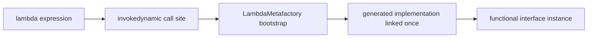

Lambdas made Java concise, but interviewers use them to test depth: what they compile to, how capture works, and why a lambda is not just shorthand for an anonymous class. This page covers the mechanics and the traps.

## What a lambda actually compiles to

A lambda is **not** an anonymous inner class. The compiler emits an `invokedynamic` bytecode instruction whose bootstrap is `LambdaMetafactory`. On first execution the JVM links that call site, generating a lightweight implementation class (or reusing a method handle) once, then caches it.

```java
Runnable r = () -> System.out.println("hi"); // one invokedynamic call site
```



This matters for two reasons. **Startup and memory**: an anonymous class generates a separate `.class` file at compile time and loads it eagerly; a non-capturing lambda can be linked to a single shared instance, so a thousand identical lambdas need not allocate a thousand objects. **Capture**: a non-capturing lambda is effectively a singleton, while a capturing lambda allocates a small object holding the captured values.

> [!KEY]
> "A lambda is just an anonymous class" is wrong. It is `invokedynamic` + `LambdaMetafactory`, which means less classfile bloat, potential instance reuse, and different `this` semantics.

## Functional interfaces and @FunctionalInterface

A **functional interface** has exactly one abstract method (the Single Abstract Method, or SAM). A lambda's body supplies that method. `@FunctionalInterface` is an optional annotation that makes the compiler enforce the single-abstract-method rule, so an accidental second abstract method becomes a compile error. Default and static methods do not count toward the one abstract method.

```java
@FunctionalInterface
interface Validator<T> {
    boolean isValid(T t);                       // the one abstract method
    default Validator<T> and(Validator<T> o) {  // extra defaults are fine
        return t -> this.isValid(t) && o.isValid(t);
    }
}
```

## The java.util.function catalogue

Most lambdas target a built-in interface. Learn the shape by arity and return type.

| Interface | Signature | Purpose |
|---|---|---|
| `Supplier<T>` | `() -> T` | produce a value |
| `Consumer<T>` | `T -> void` | consume a value |
| `BiConsumer<T,U>` | `(T,U) -> void` | consume two |
| `Function<T,R>` | `T -> R` | transform |
| `BiFunction<T,U,R>` | `(T,U) -> R` | transform two |
| `Predicate<T>` | `T -> boolean` | test |
| `BiPredicate<T,U>` | `(T,U) -> boolean` | test two |
| `UnaryOperator<T>` | `T -> T` | `Function` with same in/out |
| `BinaryOperator<T>` | `(T,T) -> T` | reduce two into one |

### Why the primitive specialisations exist

`Function<Integer,Integer>` boxes: each `int` becomes an `Integer` object on the heap. In a hot loop that is millions of allocations. The primitive specialisations — `IntFunction<R>`, `ToIntFunction<T>`, `IntPredicate`, `IntUnaryOperator`, `IntBinaryOperator`, `IntSupplier`, `IntConsumer` and the `Long`/`Double` variants — avoid boxing by working with primitives directly.

```java
ToIntFunction<String> len = String::length; // returns primitive int, no Integer box
IntPredicate even = n -> n % 2 == 0;         // takes primitive int
```

## Composing functions and predicates

Functional interfaces carry default methods for composition. Know the direction of `andThen` versus `compose`.

```java
Function<Integer,Integer> times2 = x -> x * 2;
Function<Integer,Integer> plus3  = x -> x + 3;
times2.andThen(plus3).apply(5); // 13  — times2 first, then plus3
times2.compose(plus3).apply(5); // 16  — plus3 first, then times2

Predicate<String> nonEmpty = s -> !s.isEmpty();
Predicate<String> shortStr = s -> s.length() < 10;
nonEmpty.and(shortStr).negate().test("x"); // combine and invert
```

`andThen` runs *this* then the argument; `compose` runs the argument first. `Predicate` offers `and`, `or`, `negate`; `Consumer` offers `andThen`.

## Method references

When a lambda just forwards to an existing method, a method reference is cleaner. There are four kinds.

| Kind | Syntax | Equivalent lambda |
|---|---|---|
| Static | `Integer::parseInt` | `s -> Integer.parseInt(s)` |
| Bound instance | `System.out::println` | `x -> System.out.println(x)` |
| Unbound instance | `String::toUpperCase` | `s -> s.toUpperCase()` |
| Constructor | `ArrayList::new` | `() -> new ArrayList<>()` |

The subtle one is **unbound**: `String::toUpperCase` takes the receiver as the first argument, so it fits `Function<String,String>`. A **bound** reference captures a specific instance (`System.out`) already.

## Variable capture and effective finality

A lambda can read local variables only if they are **effectively final** — assigned once and never reassigned. This is not arbitrary: lambdas may outlive the method call, so Java captures the *value*, not the variable. Allowing reassignment would create ambiguity about which value the lambda sees.

```java
int factor = 3;
Function<Integer,Integer> f = x -> x * factor; // OK: factor is effectively final
// factor = 4;                                  // would break it — no longer final
```

The mutable-holder workaround uses an array or `AtomicInteger` to smuggle mutation past the rule:

```java
int[] count = {0};
list.forEach(x -> count[0]++); // compiles, but this is a code smell
```

> [!DANGER]
> Mutable-holder capture is a smell. It signals you are forcing imperative mutation into a functional API. Prefer `stream().count()`, `reduce`, or a plain `for` loop, all of which express the intent honestly and are safe under parallelism.

### Closures over loop variables

Capturing a loop variable is a classic trap. An **enhanced** for-loop declares a fresh variable each iteration, so each lambda captures its own value. A **classic** `for` loop reuses one counter, which is not effectively final, so the lambda will not even compile.

```java
List<Runnable> tasks = new ArrayList<>();
for (String name : names) {
    tasks.add(() -> System.out.println(name)); // OK: fresh `name` per iteration
}

for (int i = 0; i < 3; i++) {
    // tasks.add(() -> System.out.println(i)); // compile error: i is not effectively final
    int captured = i;                          // copy into a fresh local to capture safely
    tasks.add(() -> System.out.println(captured));
}
```

This bites people migrating from languages where all closures over a loop counter share one mutable variable. Java's effective-finality rule prevents that entire class of bug — but only if you introduce a fresh variable per iteration.

## Lambda vs anonymous class

They look interchangeable but differ in several ways interviewers like to enumerate.

| Aspect | Lambda | Anonymous class |
|---|---|---|
| Compiles to | `invokedynamic` + `LambdaMetafactory` | a separate `.class` file |
| `this` | enclosing instance | the anonymous object |
| Instance reuse | possible when non-capturing | new object every time |
| Shadowing locals | cannot redeclare enclosing names | can declare its own fields/methods |
| Target | functional interface only | any interface or class |

Use an anonymous class only when you need state, multiple methods, or to subclass a concrete type; otherwise a lambda is lighter and clearer.

## `this` inside a lambda

Inside a lambda, `this` refers to the **enclosing instance**, not the lambda itself — unlike an anonymous class, where `this` is the anonymous object. This makes calling enclosing methods natural, but it has a leak hazard.

```java
class Screen {
    private String name = "main";
    Runnable make() {
        return () -> System.out.println(this.name); // captures the enclosing Screen
    }
}
```

Because the lambda captures `this`, registering it in a long-lived collection keeps the whole enclosing object alive. In an event bus or listener registry that is never unsubscribed, this is a classic memory leak.

> [!WARNING]
> A lambda that captures `this` keeps its enclosing object reachable. In long-lived registries, always provide an unsubscribe path or the enclosing instance (and everything it references) leaks.

## Designing your own vs reusing a JDK interface

Prefer a JDK interface when your signature matches one — it composes with the standard library and needs no documentation. Define your own when the name adds domain meaning, when you need a checked exception in the signature, or when the arity is unusual.

Speaking of checked exceptions: the standard interfaces declare none, so a lambda that throws a checked exception will not compile against them. Options: wrap in an unchecked exception, or define a throwing functional interface.

```java
@FunctionalInterface
interface ThrowingFunction<T, R> {
    R apply(T t) throws Exception; // custom SAM that permits checked exceptions
}
```

`Comparator<T>` is the functional interface you use most without thinking about it — `Comparator.comparing(...)` returns one, and sorting APIs consume it.

## Cheat sheet

- A lambda compiles to `invokedynamic` + `LambdaMetafactory`, not an anonymous class.
- A functional interface has exactly one abstract method; `@FunctionalInterface` enforces it.
- `Supplier` produces, `Consumer` consumes, `Function` transforms, `Predicate` tests; `Bi*` takes two args.
- Primitive specialisations (`IntFunction`, `ToIntFunction`, `IntPredicate`) exist to avoid boxing.
- `andThen` runs this-then-next; `compose` runs the argument first.
- Four method-reference kinds: static, bound instance, unbound instance, constructor.
- Captured locals must be effectively final; the lambda captures the value, not the variable.
- `this` in a lambda is the enclosing instance, not the lambda — watch for leaks in registries.
- Standard functional interfaces cannot throw checked exceptions; wrap or define your own SAM.

## Common mistakes

| Mistake | Fix |
|---|---|
| Saying a lambda is an anonymous class | It is `invokedynamic`; different `this`, less classfile bloat |
| Reassigning a captured local | Keep it effectively final; use a stream/reduce instead |
| Mutable-holder (`int[] count`) capture | Use `count()`/`reduce`; it is a smell |
| `Function<Integer,Integer>` in a hot loop | Use `IntUnaryOperator` to avoid boxing |
| Confusing `andThen` and `compose` | `andThen` = this first; `compose` = argument first |
| Throwing checked exceptions from a `Function` | Wrap as unchecked or define a throwing SAM |
| Long-lived lambda capturing `this` | Provide unsubscribe; otherwise the enclosing object leaks |

## Summary

Lambdas are backed by `invokedynamic` and `LambdaMetafactory`, giving smaller classfiles and instance reuse rather than an anonymous class per site. They target functional interfaces — one abstract method — and most fit the `java.util.function` catalogue, with primitive specialisations existing purely to dodge boxing. Method references come in four kinds, capture requires effective finality because the value is copied, and `this` refers to the enclosing instance, which can leak in long-lived registries. Compose with `andThen`/`compose` and `and`/`or`/`negate`, and reach for a custom SAM only when the JDK does not already model your signature.

## Top Interview Questions

### Q1. What does a lambda compile to, and why is it not an anonymous class?

A lambda compiles to an `invokedynamic` bytecode instruction whose bootstrap method is `LambdaMetafactory`. At first execution the JVM links the call site and produces an implementation lazily, then caches it. An anonymous class, by contrast, is a separate compiled `.class` file loaded eagerly. The consequences: lambdas cause far less classfile bloat, a non-capturing lambda can be linked to a single reusable instance instead of allocating one per use, and the runtime keeps flexibility to optimise the strategy. There is also a semantic difference — `this` in a lambda refers to the enclosing instance, whereas `this` in an anonymous class refers to the anonymous object. Saying "a lambda is syntactic sugar for an anonymous class" is a common but incorrect answer.

### Q2. What is a functional interface, and what does @FunctionalInterface do?

A functional interface has exactly one abstract method, called the Single Abstract Method (SAM), which is what a lambda or method reference implements. Default methods and static methods do not count, so an interface can have many of those and still be functional. `@FunctionalInterface` is an optional annotation that asks the compiler to enforce the single-abstract-method rule; if someone later adds a second abstract method, compilation fails, protecting every lambda that targets the interface. It is documentation and a safety net, not a requirement — `Runnable`, `Callable`, and `Comparator` were functional long before the annotation existed. Use it on your own SAM interfaces to prevent accidental breakage.

### Q3. Why do IntFunction, ToIntFunction, and IntPredicate exist separately?

To avoid autoboxing. The generic `Function<Integer,Integer>` works only with reference types, so every `int` flowing through it is boxed into an `Integer` object on the heap and unboxed on the way out. In a tight loop processing millions of values, that is millions of allocations and extra GC pressure. The primitive specialisations operate on `int`, `long`, and `double` directly: `IntPredicate` takes a primitive `int`, `ToIntFunction<T>` returns a primitive `int`, `IntUnaryOperator` is `int -> int`. Streams follow the same pattern with `IntStream`/`LongStream`/`DoubleStream`. Interviewers ask this to check whether you understand the hidden cost of boxing and know the tools that eliminate it in performance-sensitive code.

### Q4. Explain the difference between andThen and compose.

Both chain two functions, but in opposite order. `f.andThen(g)` produces a function that applies `f` first and feeds its result to `g` — read it left to right. `f.compose(g)` applies `g` first, then `f` — the mathematical composition order. For example, with `times2` and `plus3`, `times2.andThen(plus3).apply(5)` is `(5*2)+3 = 13`, while `times2.compose(plus3).apply(5)` is `(5+3)*2 = 16`. The mnemonic: `andThen` means "do this, and then that"; `compose` mirrors `g(f(x))` notation where the inner function runs first. `Predicate` uses `and`/`or`/`negate` instead, and `Consumer` provides `andThen` for sequencing side effects.

### Q5. What are the four kinds of method reference?

Static (`Integer::parseInt`), which forwards to a static method; bound instance (`System.out::println`), which captures a specific object and calls an instance method on it; unbound instance (`String::toUpperCase`), where the receiver is supplied as the first argument at call time; and constructor (`ArrayList::new`), which forwards to a constructor. The tricky pair is bound versus unbound: `System.out::println` already holds `System.out`, so it behaves like `x -> System.out.println(x)`. `String::toUpperCase` has no fixed receiver, so it behaves like `s -> s.toUpperCase()` and fits `Function<String,String>`, taking the string as the argument. Constructor references pair naturally with `Supplier` or `Function`, e.g. `Function<String,StringBuilder>` from `StringBuilder::new`.

### Q6. Why must captured local variables be effectively final?

Because a lambda can outlive the method that created it, Java captures the *value* of a local variable, not the variable itself — it copies it into the lambda's state. If the local could be reassigned afterwards, there would be two conflicting notions of its value: the one the lambda captured and the current one. To avoid that ambiguity and to keep capture cheap and thread-safe, the language requires captured locals to be effectively final — assigned exactly once. Instance and static fields are exempt because they are captured through the object reference, not copied, so they can change. The common workaround of a one-element array or `AtomicInteger` bypasses the rule but signals you are mutating shared state, which is usually better expressed with a reduction.

### Q7. What does `this` refer to inside a lambda, and how can that cause a leak?

Inside a lambda `this` refers to the **enclosing instance** — the object whose method created the lambda — not to the lambda itself. That is convenient because you can call the enclosing object's methods directly. The hazard is lifetime: capturing `this` (explicitly, or implicitly by using an instance field or method) makes the lambda hold a strong reference to the enclosing object. If you register that lambda in a long-lived structure — an event bus, a static listener list, a cache — the enclosing object and everything it transitively references cannot be garbage collected until the lambda is removed. The fix is to always provide an unsubscribe path, use weak references for listeners, or capture only the specific fields you need rather than the whole object.

### Q8. How do you handle checked exceptions inside a lambda?

The standard `java.util.function` interfaces declare no checked exceptions, so a lambda body that throws one (say `IOException`) will not compile against `Function` or `Consumer`. You have three options. First, catch it inside the lambda and rethrow as an unchecked exception (`RuntimeException` or a domain exception), which is simplest but loses the checked contract. Second, define your own throwing functional interface — a SAM whose method declares `throws Exception` — and write a small adapter that wraps it into a standard interface. Third, avoid the lambda and use a plain loop or try/catch where the exception is handled naturally. In production I usually wrap with a helper that converts the checked exception to an unchecked one with context, so the stream stays readable while preserving the stack trace.

### Q9. When should you define your own functional interface instead of using a JDK one?

Reuse a JDK interface whenever your method signature matches one — it composes with the standard library, is instantly understood, and needs no docs. Define your own in three cases: when a domain-specific name adds clarity (a `PriceCalculator` reads better than `BiFunction<Item,Discount,Money>`), when you need the SAM to declare a checked exception, or when the arity or primitive shape has no JDK equivalent (three parameters, or a specific mix of primitives). A named interface also gives you a place to hang default methods for composition. The trade-off is that a custom interface does not interoperate automatically with methods expecting `Function` or `Predicate`, so you may need adapters — weigh clarity against that friction.

### Q10. You see `int[] counter = {0}; list.forEach(x -> counter[0]++);` in a code review. What do you flag?

Two things. First, it is a smell: the one-element array exists only to sidestep the effective-finality rule so the lambda can mutate a counter. The honest expressions are `list.size()`, `list.stream().count()`, or a reduction — they state the intent and avoid the trick. Second, it is a correctness landmine under parallelism: if this ever becomes `list.parallelStream().forEach(...)`, multiple threads increment `counter[0]` without synchronization, producing lost updates and a wrong total. Even sequentially, mutating shared state from inside a functional operation is exactly the pattern the streams API warns against. I would rewrite it as a proper reduction or, if a side effect is genuinely needed, a plain `for` loop where the mutation is explicit and thread confinement is obvious.
