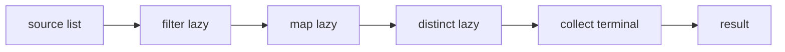
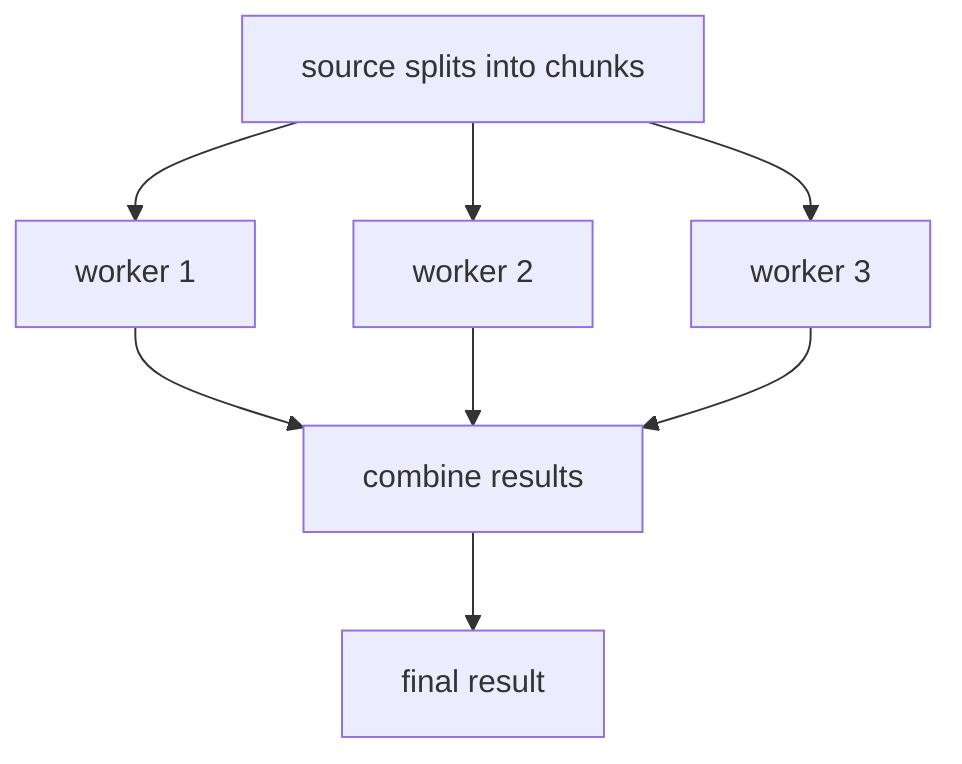

Streams express data processing as a pipeline of operations rather than explicit loops. Interviewers probe whether you understand the laziness model, the collector toolkit, and — the senior filter — when a parallel stream helps and when it silently makes things worse.

## The pipeline model

Every stream has three parts: a **source** (collection, array, generator), zero or more **intermediate** operations that are lazy and return a new stream, and exactly one **terminal** operation that produces a result or side effect and triggers execution.



Nothing runs until the terminal operation. Intermediate operations only build up a plan.

```java
List<String> names = users.stream()
    .filter(u -> u.age() >= 18)   // lazy — nothing happens yet
    .map(User::name)              // still lazy
    .toList();                    // terminal — now the pipeline executes once
```

> [!KEY]
> Streams are lazy and single-use. Intermediate operations do nothing until a terminal operation runs, and once consumed a stream throws `IllegalStateException` if you try to reuse it. Create a fresh stream per terminal operation.

Laziness enables **short-circuiting**: `findFirst`, `anyMatch`, and `limit` can stop as soon as the answer is known, so `stream.filter(...).findFirst()` may inspect only the first matching element, not the whole source.

## Creating streams

Streams come from more than collections. Knowing the sources lets you avoid manual loops entirely.

```java
Stream.of("a", "b", "c");                 // fixed values
IntStream.range(0, 10);                   // 0..9, primitive, no boxing
Stream.iterate(1, n -> n * 2).limit(10);  // infinite, bounded by limit
Stream.generate(Math::random).limit(5);   // infinite supplier, bounded
Arrays.stream(array);                     // from an array
```

An infinite stream (`iterate`, `generate`) is only usable because intermediate laziness lets a downstream `limit` or short-circuit stop it. Without a bounding operation it never terminates. Since Java 9, `Stream.iterate` also takes a predicate — `Stream.iterate(1, n -> n < 100, n -> n * 2)` — giving a functional equivalent of a bounded `for` loop.

## Core intermediate operations

| Operation | Effect |
|---|---|
| `filter(pred)` | keep matching elements |
| `map(fn)` | transform each element |
| `flatMap(fn)` | flatten a stream-of-streams into one stream |
| `distinct()` | remove duplicates (uses `equals`) |
| `sorted()` | sort (stateful — buffers all elements) |
| `peek(action)` | observe elements, for debugging only |
| `limit(n)` / `skip(n)` | take first n / drop first n |
| `takeWhile(pred)` / `dropWhile(pred)` | prefix-based take/drop (Java 9+) |
| `mapMulti(...)` | imperative one-to-many (Java 16+) |

`flatMap` is the one people trip on: use it when each element maps to *many* values you want in one flat stream.

```java
List<String> tags = posts.stream()
    .flatMap(p -> p.tags().stream()) // each post has a List<String>; flatten them
    .distinct()
    .toList();
```

`takeWhile` and `dropWhile` (Java 9+) are prefix-based: `takeWhile` yields elements until the predicate first fails and then stops; `dropWhile` discards the leading run that matches and keeps the rest. On an ordered stream they are cheaper than `filter` because they short-circuit rather than scanning everything.

## Terminal operations and collectors

Terminal operations include `collect`, `reduce`, `forEach`, `count`, `min`, `max`, `toList`, `toArray`, and the matchers `anyMatch`/`allMatch`/`noneMatch`. The richest is `collect` with a `Collector`.

| Collector | Produces |
|---|---|
| `toList()` | a list (implementation-defined mutability) |
| `toUnmodifiableList()` | an immutable list, rejects nulls |
| `toMap(k, v)` | a map — throws on duplicate keys |
| `groupingBy(fn)` | `Map<K, List<T>>` |
| `partitioningBy(pred)` | `Map<Boolean, List<T>>` |
| `joining(sep)` | a concatenated `String` |
| `counting()` / `summingInt()` | aggregates, usually downstream |
| `averagingDouble()` | a `Double` average |
| `teeing(a, b, merge)` | combine two collectors (Java 12+) |

### toList variants

There are three ways to get a list and they differ:

- `Collectors.toList()` — mutability not guaranteed; do not rely on it.
- `Collectors.toUnmodifiableList()` — immutable, throws on null elements.
- `stream.toList()` (Java 16+) — the modern default: unmodifiable **and** allows nulls, no import needed.

```java
List<Integer> a = nums.stream().map(n -> n * 2).toList(); // preferred since Java 16
```

### toMap duplicate-key trap

`Collectors.toMap` throws `IllegalStateException` if two elements produce the same key. Supply a **merge function** to resolve collisions.

```java
Map<String, User> byEmail = users.stream()
    .collect(Collectors.toMap(User::email, u -> u,
        (existing, dup) -> existing)); // keep first on duplicate email
```

### groupingBy with downstream collectors

`groupingBy` is far more powerful with a second, downstream collector.

```java
Map<Dept, Long> headcount = employees.stream()
    .collect(Collectors.groupingBy(Employee::dept, Collectors.counting()));

Map<Dept, Double> avgSalary = employees.stream()
    .collect(Collectors.groupingBy(Employee::dept,
             Collectors.averagingDouble(Employee::salary)));
```

## Primitive streams

`IntStream`, `LongStream`, and `DoubleStream` avoid boxing and add numeric conveniences. Convert with `mapToInt`/`mapToObj`/`boxed`.

```java
int total = orders.stream().mapToInt(Order::quantity).sum(); // no Integer boxing
IntSummaryStatistics stats = orders.stream()
    .mapToInt(Order::quantity)
    .summaryStatistics(); // count, sum, min, max, average in one pass
```

Use `boxed()` when you must collect into a `List<Integer>`. Prefer primitive streams in numeric hot paths precisely to avoid the box/unbox churn.

## reduce and its rules

`reduce` folds a stream into one value. The three-argument form needs an **identity**, an **accumulator**, and a **combiner**, and it imposes real constraints for correctness — especially in parallel.

```java
int sum = nums.stream().reduce(0, Integer::sum); // identity 0, associative +
```

The identity must be a true identity (`0` for `+`, `1` for `*`), and the accumulator must be **associative** and **stateless**. If it is not associative, a parallel reduce splits the work differently and produces a different answer. Subtraction, for instance, is not associative and will give wrong results in parallel.

## Parallel streams

`parallelStream()` (or `.parallel()`) splits the source and runs stages on the shared **common `ForkJoinPool`**, sized to the number of cores minus one by default.



Parallel streams help when the work is **CPU-bound and large**, and the source **splits cheaply** — arrays, `ArrayList`, `IntStream.range`. They hurt in several ways:

| Situation | Why parallel hurts |
|---|---|
| Small streams | split/merge overhead exceeds the work |
| `LinkedList` / `Iterator` sources | cannot split evenly, poor load balance |
| Blocking I/O in the pipeline | blocks common-pool threads shared by the whole JVM |
| Shared mutable state | data races, wrong results |
| Cheap per-element work | coordination cost dominates |

> [!DANGER]
> A blocking call inside a parallel stream starves the common `ForkJoinPool`, which is shared JVM-wide. One slow parallel stream can stall unrelated parallel work across your application. Never do I/O in a parallel stream on the common pool.

For concurrent grouping into a shared map, use `groupingByConcurrent`, which is designed for unordered parallel accumulation:

```java
Map<Dept, List<Employee>> g = employees.parallelStream()
    .collect(Collectors.groupingByConcurrent(Employee::dept)); // concurrent-safe
```

## Side effects, debugging, and the honest loop

Lambdas passed to stream operations should be **stateless** and **side-effect-free**. A stateful lambda (one that reads or writes external mutable state) breaks under parallelism and is fragile even sequentially. `forEach` order is not guaranteed in parallel — use `forEachOrdered` if you need it.

Streams are also harder to debug than loops: you cannot set a breakpoint on a fluent chain as easily, and stack traces are dense. `peek` helps observe elements, but only for debugging — do not use it for logic. Sometimes the senior answer is: **a plain `for` loop is clearer**, especially when logic is complex, you need early return with a value, or you are mutating an accumulator. For pure map/filter/reduce transformations, streams win on readability.

> [!TIP]
> For a straight `sum` over an array, a `for` loop often beats a sequential stream on raw speed because it avoids per-element lambda dispatch. Reach for streams for clarity of transformation, not to squeeze out microseconds.

## Cheat sheet

- A stream is source → lazy intermediates → one terminal; nothing runs until the terminal.
- Streams are single-use; a second terminal throws `IllegalStateException`.
- Short-circuit with `findFirst`, `anyMatch`, `limit`; laziness makes them stop early.
- `flatMap` flattens a stream of collections into one stream.
- Prefer `stream.toList()` (Java 16+): unmodifiable and allows nulls.
- `toMap` throws on duplicate keys — pass a merge function.
- `groupingBy` shines with downstream collectors (`counting`, `averagingDouble`, `mapping`).
- Use `IntStream`/`mapToInt`/`summaryStatistics` to avoid boxing in numeric work.
- `reduce` needs an identity and an associative, stateless accumulator — or parallel breaks it.
- Parallel helps only for large CPU-bound work on splittable sources; never block on the common pool.

## Common mistakes

| Mistake | Fix |
|---|---|
| Reusing a consumed stream | Create a new stream per terminal operation |
| `toMap` on data with duplicate keys | Add a merge function `(a, b) -> ...` |
| Mutating shared state in `forEach` | Use `collect`/`reduce`; keep lambdas stateless |
| Using `peek` for real logic | `peek` is for debugging; use `map`/`forEach` |
| `parallelStream()` on a small or `LinkedList` source | Stay sequential; split cost dominates |
| Blocking I/O inside a parallel stream | Keep I/O off the common pool; use a dedicated executor |
| Non-associative accumulator in `reduce` | Ensure associativity or results differ in parallel |

## Summary

A stream is a lazy pipeline: a source, lazy intermediate operations, and a single terminal that triggers execution, with short-circuiting operations stopping early. Collectors do the heavy lifting — `groupingBy` with downstream collectors, `toMap` with a merge function, and the modern `stream.toList()` that is unmodifiable and null-tolerant. Primitive streams avoid boxing, and `reduce` demands an associative, stateless accumulator. Parallel streams pay off only for large CPU-bound work on cheaply splittable sources; on small streams, linked lists, blocking I/O, or shared state they hurt, and blocking on the shared common pool can stall the whole JVM. When logic gets gnarly, a plain loop is a legitimate senior choice.

## Top Interview Questions

### Q1. Explain the difference between intermediate and terminal operations.

Intermediate operations (`filter`, `map`, `flatMap`, `sorted`, `distinct`, `limit`) are **lazy**: each returns a new stream and does no work when called — it just records the step. Terminal operations (`collect`, `reduce`, `forEach`, `count`, `toList`, `anyMatch`) are **eager**: invoking one triggers the whole pipeline to execute and produces a result or side effect. Because intermediates are lazy, the runtime can fuse them and process elements one at a time, and short-circuiting terminals like `findFirst` or `anyMatch` can stop early without touching every element. A stream also runs at most once — after a terminal operation the stream is consumed, and reusing it throws `IllegalStateException`. So the mental model is: build a plan with intermediates, execute it exactly once with a terminal.

### Q2. What is laziness good for, and can you give an example of short-circuiting?

Laziness lets the pipeline avoid work it does not need. Because nothing executes until the terminal, the runtime can process elements one-by-one and stop the moment the answer is determined. `stream.filter(expensive).findFirst()` may evaluate the filter on only the first matching element rather than the entire source; `anyMatch` returns as soon as one element matches; `limit(10)` stops pulling after ten elements even from an infinite `Stream.generate`. Without laziness each intermediate would materialise a full intermediate collection, wasting memory and time. This is why you can write `IntStream.iterate(1, n -> n + 1).filter(this::isPrime).limit(5)` over a conceptually infinite stream and it still terminates.

### Q3. Why does toMap sometimes throw IllegalStateException, and how do you fix it?

`Collectors.toMap(keyFn, valueFn)` assumes keys are unique. If two elements map to the same key, it does not know which value to keep, so it throws `IllegalStateException: Duplicate key`. The fix is the three-argument overload that takes a **merge function** describing how to combine values for colliding keys: `toMap(User::email, u -> u, (a, b) -> a)` keeps the first, `(a, b) -> b` keeps the last, or you can merge fields. You can also pass a fourth argument to choose the map implementation (e.g. `LinkedHashMap::new` for insertion order). This is a frequent production bug: code works in tests with unique keys, then throws in production when real data has duplicates. Always provide a merge function unless uniqueness is truly guaranteed.

### Q4. What is the difference between Collectors.toList, toUnmodifiableList, and stream.toList()?

`Collectors.toList()` returns a list whose type and mutability are unspecified — historically `ArrayList`, but you must not depend on that. `Collectors.toUnmodifiableList()` returns a genuinely immutable list and throws `NullPointerException` if any element is null. `stream.toList()`, added in Java 16, is the modern default: it returns an **unmodifiable** list, requires no `Collectors` import, and — unlike `toUnmodifiableList` — **permits null elements**. So if your stream can contain nulls and you want immutability, `stream.toList()` is the right call; if you need a mutable list to modify afterwards, collect into `new ArrayList<>` via `Collectors.toCollection(ArrayList::new)`. Preferring `stream.toList()` signals you are current with recent Java.

### Q5. When do parallel streams actually help, and when do they hurt?

They help when three things hold: the work per element is genuinely CPU-bound and substantial, the source splits cheaply and evenly (arrays, `ArrayList`, `IntStream.range`), and there is no shared mutable state or ordering dependency. Then the common `ForkJoinPool` spreads the work across cores and you get near-linear speedup. They hurt when the stream is small (split/merge overhead dwarfs the work), when the source is a `LinkedList` or an iterator that cannot split evenly, when the pipeline does blocking I/O (which ties up shared common-pool threads and can stall unrelated parallel work JVM-wide), or when lambdas touch shared mutable state (data races and wrong answers). My default is sequential; I only parallelise after measuring a real CPU-bound bottleneck on a splittable source.

### Q6. Why does a blocking call inside a parallel stream cause problems?

`parallelStream()` runs on the shared common `ForkJoinPool`, which has only about (cores − 1) threads and is used by every parallel stream in the JVM. If your pipeline makes a blocking call — an HTTP request, a database query, a `Thread.sleep` — those pool threads sit idle-blocked instead of doing CPU work. Because the pool is shared, you are not just slowing your own stream; you can starve every other parallel stream and parallel task in the process, causing latency spikes far from the offending code. The correct patterns are: keep I/O out of parallel streams entirely, use a `CompletableFuture` with a dedicated bounded executor for concurrent I/O, or run the blocking work on your own `ForkJoinPool` instance rather than the common one. This is a classic senior gotcha.

### Q7. What requirements does reduce place on its accumulator, and why?

The accumulator must be **associative** and **stateless**, and the identity must be a real identity for the operation. Associativity matters because a parallel reduce splits the stream into chunks, reduces each independently, and combines the partial results — if the operation is not associative, the grouping changes the answer. Addition and multiplication are associative; subtraction and division are not, so `reduce(0, (a, b) -> a - b)` gives different results sequentially versus in parallel. The identity must satisfy `op(identity, x) == x` (0 for sum, 1 for product, empty string for concatenation); a wrong identity corrupts results, especially on empty partitions. Statelessness ensures the accumulator does not depend on external mutable data that other threads might change. Meeting these three rules is what makes a reduction safe to parallelise.

### Q8. A stream computes wrong results only when run in parallel. How do you debug it?

Wrong-only-in-parallel almost always means a **correctness assumption that holds sequentially but not concurrently**. I check three things. First, shared mutable state: is a lambda writing to a field, a collection, or a captured variable? That is a data race — replace it with a proper `collect`/`reduce` or a concurrent collector. Second, associativity and identity in `reduce`/`collect`: a non-associative accumulator or a bad identity produces different results when the work is split. Third, ordering: `forEach` does not preserve encounter order in parallel — if order matters, use `forEachOrdered` or keep the stream sequential. I would reproduce with a small deterministic input, temporarily force sequential to confirm the logic is right, then reintroduce parallelism while auditing each lambda for statelessness. The fix is usually to remove side effects, not to add locks.

### Q9. When is a plain for loop the better answer than a stream?

When the logic is imperative or complex enough that a stream obscures it. Concretely: when you need to break out early returning a value and the stream equivalent is contorted; when you are mutating an accumulator or multiple variables together; when you need indices, or to look at neighbouring elements; when exception handling is involved and checked exceptions make lambdas ugly; and in the very hottest numeric loops where per-element lambda dispatch adds measurable overhead. Streams excel at declarative map/filter/reduce transformations where they read like a description of intent. A senior engineer picks based on clarity for the reader, not dogma — and is comfortable saying "here a loop is simpler and faster" rather than forcing every iteration into a fluent chain.

### Q10. What does flatMap do, and when do you need it over map?

`map` is one-to-one: each element becomes exactly one output element. `flatMap` is one-to-many: each element becomes a *stream* of elements, and `flatMap` concatenates those substreams into a single flat stream. You need it whenever an element contains a collection you want to iterate across as if it were flattened. For example, given `List<Order>` where each `Order` has a `List<LineItem>`, `orders.stream().map(Order::items)` yields a `Stream<List<LineItem>>` (a stream of lists), whereas `orders.stream().flatMap(o -> o.items().stream())` yields a `Stream<LineItem>` you can then filter or sum directly. The tell is: if your `map` produces a stream-of-collections and the next step needs the inner elements, you wanted `flatMap`. It is also how you handle `Optional` in streams via `flatMap(Optional::stream)`.
