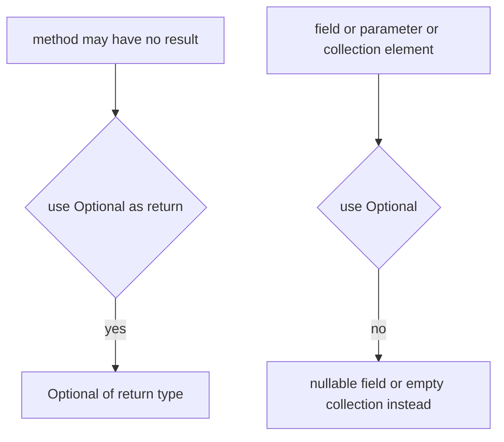
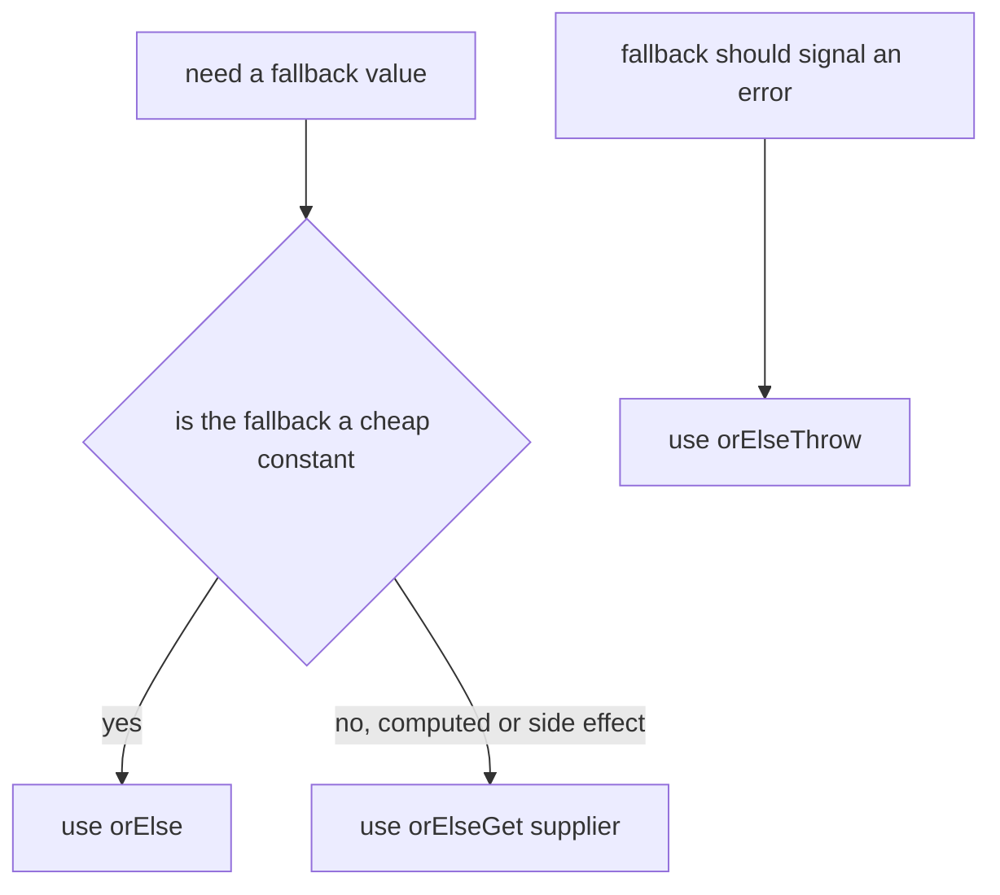

`Optional` is one of the most misused types in Java. Interviewers use it to check whether you understand its narrow intended purpose, the eager-evaluation traps, and the wider set of tools for keeping null out of your code.

## What Optional is for

`Optional<T>` was introduced in Java 8 as a **return type** that explicitly expresses "there may be no result." It replaces returning `null` from a method, forcing the caller to acknowledge the empty case instead of blindly dereferencing.

The JDK architects were explicit about what it is **not** for: it was never meant for fields, method parameters, or collection elements. Using it there adds allocation and ceremony without benefit — an empty collection or a nullable field annotation serves better.



> [!KEY]
> `Optional` is a return type for "no result," not a general null replacement. Do not put it in fields, parameters, or collections. Say this in an interview and you sound like you have read the design rationale.

## The API

| Method | Purpose |
|---|---|
| `of(v)` | wrap a non-null value; NPE if null |
| `ofNullable(v)` | wrap a possibly-null value |
| `empty()` | an empty Optional |
| `map(fn)` | transform if present |
| `flatMap(fn)` | transform when `fn` itself returns an Optional |
| `filter(pred)` | keep the value only if it matches |
| `or(supplier)` | fall back to another Optional (Java 9+) |
| `stream()` | 0-or-1-element stream (Java 9+) |
| `ifPresent(c)` / `ifPresentOrElse(c, r)` | act on present / present-or-empty |
| `orElse(v)` | value or a default |
| `orElseGet(supplier)` | value or a lazily-computed default |
| `orElseThrow()` | value or throw `NoSuchElementException` |

```java
String city = Optional.ofNullable(user)
    .map(User::address)      // Optional<Address>, empty-safe
    .map(Address::city)      // Optional<String>
    .orElse("unknown");      // default if any step was null
```

## The orElse versus orElseGet trap

This is the single most-asked `Optional` gotcha. `orElse(x)` evaluates its argument **eagerly, always** — even when the Optional is present. `orElseGet(supplier)` evaluates its supplier **lazily, only when empty**.

```java
// createDefault() runs EVERY time, even when the value is present — wasteful or buggy
String v1 = maybeValue.orElse(createDefault());

// createDefault() runs ONLY when the Optional is empty
String v2 = maybeValue.orElseGet(() -> createDefault());
```

If `createDefault()` is expensive (a database hit) or has side effects (inserting a row, logging), `orElse` runs it needlessly on every call — a real performance bug and sometimes a correctness bug. Use `orElse` only for cheap constants; use `orElseGet` for anything computed.

> [!DANGER]
> `orElse(expensiveCall())` executes `expensiveCall()` unconditionally, defeating the point of the Optional. Default to `orElseGet` for any non-constant fallback.



## get() is the anti-pattern

Calling `get()` without first checking `isPresent()` throws `NoSuchElementException` on an empty Optional — reintroducing the exact null-pointer surprise `Optional` was meant to remove. Worse is the pattern `if (opt.isPresent()) return opt.get();`, which is a null check with extra syntax and no benefit.

```java
// ❌ null check with extra steps
if (opt.isPresent()) { return opt.get(); }

// ✅ express intent directly
return opt.orElseThrow(() -> new UserNotFoundException(id));
return opt.map(this::render).orElse(DEFAULT);
```

Prefer `map`, `filter`, `orElse`, `orElseGet`, `orElseThrow`, and `ifPresentOrElse`. These are the methods the API was designed around; `get()` should be rare.

## Chaining to flatten nested lookups

`map` transforms a present value; `flatMap` is for when the transform *itself* returns an `Optional`, avoiding a nested `Optional<Optional<T>>`.

```java
Optional<String> zip = Optional.ofNullable(order)
    .map(Order::customer)              // Optional<Customer>
    .flatMap(Customer::findAddress)    // findAddress returns Optional<Address>
    .map(Address::zip);                // Optional<String>
```

Use `map` when the function returns a plain value, `flatMap` when it returns an `Optional`.

### Optional and streams

`Optional.stream()` (Java 9+) bridges Optionals into a stream pipeline, letting you drop the empties in one step. It turns a present Optional into a one-element stream and an empty one into an empty stream.

```java
List<Address> addresses = customers.stream()
    .map(Customer::findAddress)     // Stream<Optional<Address>>
    .flatMap(Optional::stream)      // drops empties, unwraps present values
    .toList();
```

`ifPresentOrElse(action, emptyAction)` handles both branches without an `if`:

```java
lookup(id).ifPresentOrElse(
    this::render,                   // runs when present
    () -> log.warn("missing {}", id) // runs when empty
);
```

Together these keep null-absence handling inside the fluent style instead of scattering explicit checks.

## Costs and interoperability

`Optional` is **not `Serializable`**, which is one reason it is unsuitable for fields on serializable classes. Each `Optional` is also a heap allocation wrapping the value, so in tight loops it adds overhead — the primitive variants `OptionalInt`, `OptionalLong`, and `OptionalDouble` avoid boxing the payload.

| Concern | Guidance |
|---|---|
| Fields | avoid; use a nullable field or a value + presence flag |
| Serialization | `Optional` is not `Serializable` |
| Numeric results | use `OptionalInt` / `OptionalLong` / `OptionalDouble` |
| Spring Data repos | `Optional<T>` return types are idiomatic and supported |
| JSON (Jackson) | needs `Jdk8Module` to serialize present/empty cleanly |
| JAX-RS | `Optional` params/returns supported in modern versions |

In Spring Data, `findById` returns `Optional<T>` by design, and it reads well: `repo.findById(id).orElseThrow(...)`. For JSON, register Jackson's `Jdk8Module` so an empty `Optional` serialises to `null` (or is omitted) rather than an odd object.

## Broader null safety

`Optional` is one tool; a null-safe codebase uses several.

**Fail fast at the boundary** with `Objects.requireNonNull`, ideally in constructors so an invalid object can never exist:

```java
public Order(Customer customer, Money total) {
    this.customer = Objects.requireNonNull(customer, "customer"); // NPE here, not later
    this.total = Objects.requireNonNull(total, "total");
}
```

**Supply defaults** with `Objects.requireNonNullElse(value, fallback)` and `Map.getOrDefault(key, fallback)`. **Return empty collections, never null** — callers can iterate without a guard. **Null-safe ordering** uses `Comparator.nullsFirst`/`nullsLast`. And the Yoda-style `"active".equals(status)` never throws even when `status` is null.

```java
List<Item> items = order.items() == null ? List.of() : order.items(); // never hand back null
boolean isActive = "active".equals(status); // null-safe even if status is null
```

**Annotations** document nullability so tools and IDEs can catch mistakes at compile time: JSpecify (the emerging cross-vendor standard), JetBrains `@Nullable`/`@NotNull`, and Spring's `@NonNullApi`/`@Nullable` package defaults. They are advisory unless a checker enforces them, but they turn null intent into something reviewable.

Keep a mental checklist of the everyday null-safe idioms:

| Idiom | Replaces |
|---|---|
| `Objects.requireNonNull(x, "x")` | a delayed NPE deep in the call stack |
| `Objects.requireNonNullElse(x, def)` | a manual `x == null ? def : x` |
| `Map.getOrDefault(k, def)` | `map.containsKey(k) ? map.get(k) : def` |
| `Comparator.nullsFirst(...)` | a comparator that NPEs on null keys |
| `return List.of()` | returning `null` for "no elements" |
| `"active".equals(status)` | `status.equals("active")` (NPE risk) |


> [!TIP]
> Records and immutability shrink the null surface: a record validates its components once in a compact constructor, and immutable objects cannot drift into a null state after construction. Fewer setters means fewer places for null to leak in.

Finally, since Java 14, **Helpful NullPointerExceptions** are on by default: the message names the exact reference that was null, e.g. "Cannot invoke String.length() because the return value of Order.customer() is null." This turns a bare NPE into a precise diagnosis.

## Cheat sheet

- `Optional` is a return type for "no result"; not for fields, parameters, or collection elements.
- `orElse` evaluates its argument always; `orElseGet` only when empty — use `orElseGet` for anything computed.
- `get()` without `isPresent()` throws; prefer `map`/`orElse`/`orElseThrow`/`ifPresentOrElse`.
- `isPresent()` + `get()` is a null check with extra steps — rewrite it.
- `map` for plain returns, `flatMap` when the function returns an Optional.
- `Optional` is not `Serializable` and costs an allocation; use `OptionalInt`/`OptionalLong`/`OptionalDouble` for primitives.
- `Objects.requireNonNull` in constructors fails fast; `requireNonNullElse` supplies a default.
- Return empty collections instead of null; use `Comparator.nullsFirst` for nullable sort keys.
- Nullability annotations (JSpecify, JetBrains, Spring) document intent for tooling.
- Java 14+ Helpful NPE messages name the exact null reference.

## Common mistakes

| Mistake | Fix |
|---|---|
| `Optional` fields or parameters | Use nullable fields; keep `Optional` as a return type |
| `orElse(expensiveCall())` | Use `orElseGet(() -> expensiveCall())` |
| `opt.get()` without checking | `orElseThrow(...)` or `map(...).orElse(...)` |
| `if (opt.isPresent()) opt.get()` | Chain `map`/`orElse` instead |
| Returning `null` for an empty list | Return `List.of()` / `Collections.emptyList()` |
| `status.equals("active")` risking NPE | Yoda-style `"active".equals(status)` |
| `Optional<Integer>` in numeric loops | Use `OptionalInt` to avoid boxing |

## Summary

`Optional` exists to make "no result" explicit at a method's return type, not to sprinkle over fields, parameters, or collections. The defining trap is `orElse` versus `orElseGet`: the former always evaluates its argument, the latter only when empty, so any computed or side-effecting fallback belongs in `orElseGet`. Avoid `get()` and the `isPresent()`-then-`get()` anti-pattern; chain `map` and `flatMap` instead. Round it out with the broader toolkit — `Objects.requireNonNull` for fail-fast validation, empty collections over null, null-safe comparators, nullability annotations, records for immutability, and Java 14's helpful NPE messages that name the offending reference.

## Top Interview Questions

### Q1. What was Optional designed for, and what was it not designed for?

`Optional<T>` was designed as a **return type** that makes the absence of a result explicit, replacing methods that used to return `null`. It forces the caller to deal with the empty case through the API rather than silently dereferencing and hitting a `NullPointerException`. The JDK architects were clear about the boundaries: it was **not** intended for fields, method parameters, or collection elements. On a field it adds an allocation and is not `Serializable`; as a parameter it just shifts null-checking work and clutters call sites; in a collection an empty collection already expresses "nothing." So the correct use is narrow — return `Optional<T>` from a method that might legitimately find nothing, like a lookup — and everywhere else prefer nullable references with annotations, empty collections, or plain values.

### Q2. Explain the difference between orElse and orElseGet.

`orElse(default)` takes a value and returns it when the Optional is empty — but the expression producing that value is **always evaluated**, even when the Optional is present, because arguments are evaluated before the method runs. `orElseGet(supplier)` takes a `Supplier` and invokes it **only when the Optional is empty**, so the fallback is computed lazily. The difference is invisible for cheap constants but critical when the fallback is expensive or has side effects. `optional.orElse(fetchFromDb())` hits the database on every call regardless of whether the value is present, wasting work and possibly duplicating side effects; `optional.orElseGet(() -> fetchFromDb())` only queries when actually needed. Rule of thumb: constants → `orElse`, anything computed → `orElseGet`.

### Q3. Why is calling get() considered an anti-pattern?

Because `get()` throws `NoSuchElementException` if the Optional is empty, which reintroduces exactly the unchecked runtime failure `Optional` was created to eliminate. Every unguarded `get()` is a latent crash. Even the guarded form `if (opt.isPresent()) { use(opt.get()); }` is an anti-pattern — it is a manual null check dressed up in Optional syntax, giving none of the compositional benefits. The API provides better tools: `orElse`/`orElseGet` for a default, `orElseThrow` for an explicit domain exception, `map`/`filter` to transform, and `ifPresent`/`ifPresentOrElse` for side effects. If you find yourself calling `get()`, there is almost always a cleaner method that expresses the intent and cannot throw unexpectedly.

### Q4. When do you use map versus flatMap on an Optional?

Use `map` when the transformation function returns a **plain value**: `optional.map(String::length)` turns an `Optional<String>` into an `Optional<Integer>`, wrapping the result for you. Use `flatMap` when the function **itself returns an `Optional`**: if `Customer::findAddress` returns `Optional<Address>`, then `optional.map(Customer::findAddress)` would give you a clumsy `Optional<Optional<Address>>`, whereas `optional.flatMap(Customer::findAddress)` flattens it to `Optional<Address>`. It is the same distinction as `Stream.map` versus `Stream.flatMap`. Chaining them lets you walk a nested object graph safely — `map(Order::customer).flatMap(Customer::findAddress).map(Address::zip)` — where any empty step short-circuits to an empty result with no explicit null checks.

### Q5. Should Optional be used as a field or method parameter? Why or why not?

No. As a field, `Optional` adds a heap allocation per instance, is **not `Serializable`** (breaking serializable classes), and does not actually prevent the field reference itself from being null — so you gain little and pay overhead. Better to use a nullable field, ideally documented with a `@Nullable` annotation, or model absence with a sensible default. As a method parameter, `Optional` forces callers to wrap arguments (`someMethod(Optional.of(x))`), which is noisier than an overload or a nullable parameter, and callers can still pass `null` for the Optional itself. The idiomatic uses are: `Optional` as a return type, and nullability annotations or overloads for parameters. This restraint is exactly what the API designers recommended.

### Q6. How do you keep the number of NullPointerExceptions low across a codebase?

A layered strategy. Validate at boundaries with `Objects.requireNonNull` in constructors and public methods so invalid objects never exist and failures point at the true origin. Return empty collections (`List.of()`) instead of null so callers never guard before iterating. Use `Optional` as the return type for lookups that can find nothing. Prefer immutable objects and records, which validate once and cannot drift into a null state via setters. Adopt nullability annotations (JSpecify or a vendor set) with a static checker so violations surface at compile time. Use null-safe idioms — `Comparator.nullsFirst`, `Map.getOrDefault`, Yoda-style `"x".equals(value)`. Together these push null handling to the edges of the system and keep the core logic null-free, so an NPE becomes a rare, loud event rather than a routine hazard.

### Q7. What is the cost of using Optional, and when does it matter?

Each `Optional` is an object allocated on the heap that wraps the underlying value, so creating many of them in a hot loop adds allocation and garbage-collection pressure, plus an extra layer of indirection on every access. It is also not `Serializable`. For a method that returns occasionally, the cost is negligible and the clarity is worth it. It matters in tight numeric or high-throughput loops where allocating millions of wrappers shows up in profiling — there you avoid `Optional<Integer>` (which also boxes the int) and use `OptionalInt`/`OptionalLong`/`OptionalDouble`, or restructure to avoid Optional entirely. The senior nuance is that `Optional` is a design tool for API clarity at boundaries, not something to thread through performance-critical inner loops.

### Q8. A service intermittently performs an extra database insert. The code is `repo.find(id).orElse(createAndSave(id))`. What is wrong?

`orElse` evaluates its argument eagerly and unconditionally. So `createAndSave(id)` runs on **every** call, including when `repo.find(id)` already returned a present value — the found case still triggers an insert as a side effect, producing the extra row you are seeing. The Optional's presence check happens too late to prevent the work. The fix is `repo.find(id).orElseGet(() -> createAndSave(id))`, which invokes the supplier only when the Optional is empty, so the insert happens exactly when the entity is missing. This is the canonical `orElse`-versus-`orElseGet` bug: it is easy to miss in review because the code reads naturally, but any fallback with a side effect or real cost must use `orElseGet`.

### Q9. How does Optional fit with Spring Data and JSON serialization?

In Spring Data, repository methods like `findById` return `Optional<T>` by design, which reads cleanly as `repo.findById(id).orElseThrow(() -> new NotFoundException(id))` and forces the caller to handle the missing row. You can also declare derived query methods to return `Optional<T>`. For JSON, Jackson does not handle `Optional` well out of the box — it can serialize it as a nested object with an odd shape. Registering the `Jdk8Module` makes an empty `Optional` serialize to `null` (or be omitted with the right inclusion setting) and a present one to its value, which is what clients expect. The broader point for interviews: `Optional` is fine at the persistence and service boundary, but you should not expose it as DTO fields — map it to a nullable field or omit it before it reaches the wire.

### Q10. What are Helpful NullPointerException messages, and how do they change debugging?

Since Java 14 (on by default from Java 15), the JVM produces **Helpful NullPointerException** messages that name the precise reference that was null and the operation attempted. Instead of a bare `NullPointerException` with only a line number — ambiguous when a line chains several dereferences — you get something like "Cannot invoke `String.length()` because the return value of `Order.getCustomer()` is null." That pinpoints which link in `a.getB().getC().getD()` failed without adding logging or a debugger session. It dramatically shortens diagnosis for the null bugs that still slip through. It does not prevent NPEs — you still design for null safety with `Optional`, annotations, and `requireNonNull` — but when one occurs, the message tells you exactly where to look, turning a guessing game into a direct fix.
