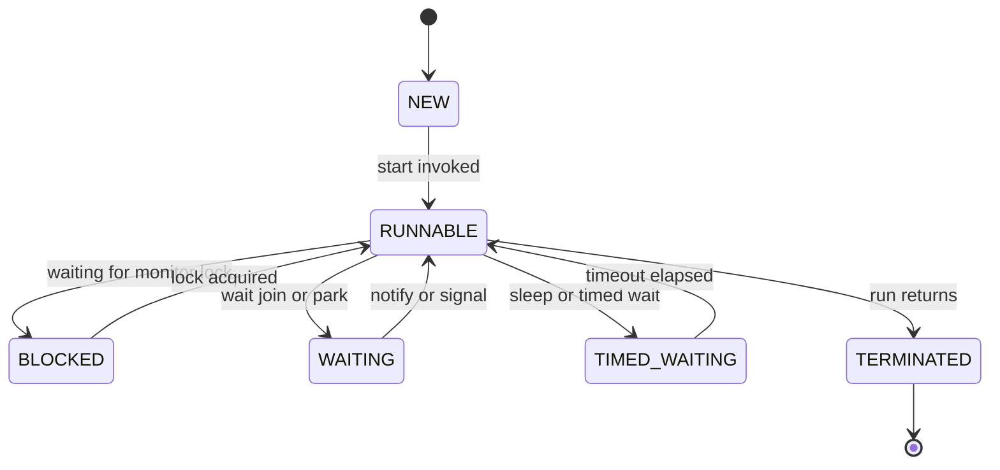

A Java platform thread is a thin wrapper over an operating-system thread. Understanding what that costs, how a thread moves between states, and how to stop one safely is the foundation every other concurrency question builds on.

## Platform Threads and Their Cost

Every ordinary `new Thread(...)` you create is a **platform thread** — before Java 21 it was the only built-in thread kind, and it maps **1:1 to an OS thread** scheduled by the operating system. That mapping is not free:

- Each thread reserves roughly **1 MB of stack** (`-Xss` default, often 512 KB–1 MB). 10,000 threads is gigabytes of committed stack before any work runs.
- Creating one costs **a few microseconds** and a system call; it is not something to do per request in a hot path.
- The OS scheduler **context-switches** between them, saving and restoring registers and blowing CPU caches — typically 1–5 microseconds of pure overhead per switch.

The practical consequence: **more threads is not more throughput**. Past the point where runnable threads exceed available cores, you pay scheduling and cache-thrash cost for no gain. This is exactly the ceiling virtual threads (Java 21) were built to remove.

> [!KEY]
> The number to remember: a platform thread ≈ 1 MB stack + a kernel-scheduled OS thread. That single fact explains thread pools, the async movement, and virtual threads all at once.

## The Six Thread States

`Thread.getState()` returns one of six values from the `Thread.State` enum. Interviewers love asking you to name all six and what moves a thread between them.



| State | Meaning |
|---|---|
| `NEW` | Created but `start()` not yet called |
| `RUNNABLE` | Eligible to run — either running or waiting for a CPU core |
| `BLOCKED` | Waiting to acquire an intrinsic `synchronized` monitor |
| `WAITING` | Parked indefinitely via `wait()`, `join()`, or `LockSupport.park()` |
| `TIMED_WAITING` | Same, but with a deadline: `sleep(n)`, `wait(n)`, `join(n)` |
| `TERMINATED` | `run()` has completed or thrown |

Note that `RUNNABLE` in Java lumps together "actually executing" and "ready but no core free" — the JVM cannot distinguish them, and a thread blocked on I/O also shows `RUNNABLE`, which surprises people reading a dump.

## Creating Threads — Three Ways

You can supply work as a `Runnable`, a `Callable`, or by subclassing `Thread`. You almost never subclass.

```java
// 1. Runnable — the idiomatic choice; separates the task from the worker
Thread t = new Thread(() -> System.out.println("work"), "worker-1");
t.start();

// 2. Callable — returns a value and may throw a checked exception
Callable<Integer> job = () -> 42;

// 3. Subclassing Thread — couples task to thread, blocks other superclasses; avoid
class Worker extends Thread { public void run() { /* ... */ } }
```

Extending `Thread` is discouraged because it welds your task to the threading mechanism, prevents extending any other class, and gains you nothing over passing a `Runnable`. `Callable` differs from `Runnable` by **returning a result and being allowed to throw checked exceptions**; you run it through an `ExecutorService` to get a `Future`.

> [!WARNING]
> Call `start()`, never `run()`. `t.run()` executes the body on the **current** thread — no new thread is created — and every interviewer plants this trap. `start()` is what schedules a new thread and eventually invokes `run()`.

## join, sleep, yield

- `join()` blocks the caller until the target thread terminates — the standard way to wait for a result without a shared flag.
- `sleep(ms)` parks the current thread for at least the given time without releasing any lock it holds.
- `yield()` is a hint to the scheduler that you would give up the core; it is advisory and often a no-op. Do not build correctness on it.

## Daemon vs User Threads

A thread is either a **user** thread or a **daemon** thread. The JVM exits when the last **non-daemon** thread finishes; daemon threads are abandoned mid-execution at shutdown. Background helpers (housekeeping, metrics flushers) are usually daemons so they cannot keep the process alive.

```java
Thread housekeeping = new Thread(this::cleanupLoop);
housekeeping.setDaemon(true); // must be set BEFORE start(), else IllegalThreadStateException
housekeeping.start();
```

> [!DANGER]
> A daemon thread can be killed at any point during shutdown, including mid-write. Never let a daemon hold resources (files, sockets, locks) whose partial state matters — it may never run its `finally` block.

## Cooperative Interruption

Java has **no safe way to force-stop a thread**. Instead it uses a cooperative model: `interrupt()` sets a boolean flag, and well-behaved code checks and reacts to it.

- `t.interrupt()` sets the target's interrupt flag.
- `Thread.currentThread().isInterrupted()` reads it **without** clearing.
- `Thread.interrupted()` reads **and clears** it (static, acts on the current thread).
- Blocking calls like `sleep`, `wait`, `join`, and `BlockingQueue.take` throw `InterruptedException` **and clear the flag** when interrupted.

The golden rule: when you catch `InterruptedException`, either **rethrow it** or **restore the flag** so callers up the stack can still see it. Swallowing it silently strands the interruption.

```java
try {
    queue.take();
} catch (InterruptedException e) {
    Thread.currentThread().interrupt(); // restore flag — never swallow it silently
    return; // stop the work cleanly
}
```

A long CPU-bound loop must poll the flag itself, because nothing throws for it:

```java
while (!Thread.currentThread().isInterrupted()) {
    process(next());
}
```

### Why stop, suspend, resume Are Deprecated

`Thread.stop()` throws a `ThreadDeath` at an arbitrary point, so it can leave objects in a **corrupt, half-updated state** and release monitors while invariants are broken. `suspend()` freezes a thread **while holding its locks**, which deadlocks anything that needs them; `resume()` is its unsafe partner. All three are deprecated; cooperative interruption is the only correct mechanism.

## wait, notify, and the Producer-Consumer

`wait()`, `notify()`, and `notifyAll()` are methods on `Object` and require holding that object's **monitor** (you must be inside a `synchronized` block on it), or you get `IllegalMonitorStateException`. `wait()` atomically releases the monitor and parks; `notify` wakes one waiter, `notifyAll` wakes all.

Two rules are non-negotiable. **Always wait in a loop that re-checks the condition**, because *spurious wakeups* happen and because another thread may have changed state between the notify and your reacquiring the lock. And **prefer `notifyAll`** unless you can prove exactly one waiter can make progress — `notify` can wake the "wrong" waiter and lose a signal.

```java
class BoundedBuffer<T> {
    private final Queue<T> q = new ArrayDeque<>();
    private final int cap;
    BoundedBuffer(int cap) { this.cap = cap; }

    synchronized void put(T item) throws InterruptedException {
        while (q.size() == cap) wait();   // loop, not if — guards against spurious wakeups
        q.add(item);
        notifyAll();                      // wake any waiting consumers
    }

    synchronized T take() throws InterruptedException {
        while (q.isEmpty()) wait();
        T item = q.remove();
        notifyAll();                      // wake any waiting producers
        return item;
    }
}
```

## ThreadLocal and Its Leak Risk

`ThreadLocal<T>` gives each thread its own copy of a value — handy for per-request context, non-thread-safe formatters, or transaction handles. The trap is **pooled threads**: a pool thread lives for the life of the process, so anything you leave in a `ThreadLocal` persists across unrelated tasks and is never garbage-collected. That is both a **memory leak** and a **data-bleed** bug.

```java
static final ThreadLocal<SimpleDateFormat> FMT =
    ThreadLocal.withInitial(() -> new SimpleDateFormat("yyyy-MM-dd"));

try {
    return FMT.get().format(date);
} finally {
    FMT.remove(); // essential on pooled threads — clears the slot for the next task
}
```

### Thread Priorities and Scheduling

`Thread.setPriority(1..10)` is only a **hint**. Most operating systems either ignore Java priorities or map them coarsely, and behavior differs across platforms, so you must never rely on priority for correctness — a low-priority thread can still run before a high-priority one, and priority inversion is possible. Treat scheduling as unfair and unpredictable. If ordering matters, enforce it explicitly with locks, queues, or a fairness policy rather than trusting priorities to arrange it for you.

## Debuggability — Naming, Handlers, and jstack

Always **name your threads** (`new Thread(r, "import-worker-3")`); a stack dump full of `Thread-14` is useless during an incident. Attach a `Thread.UncaughtExceptionHandler` so an exception that escapes `run()` is logged rather than silently killing the thread.

```java
t.setUncaughtExceptionHandler((thr, ex) ->
    log.error("thread {} died", thr.getName(), ex));
```

`jstack <pid>` (or `jcmd <pid> Thread.print`) prints every thread, its state, and its stack. You read it to find who is `BLOCKED` on which lock, spot a deadlock (jstack prints "Found one Java-level deadlock"), and see how many threads are stuck in the same frame — a classic sign of a saturated downstream dependency.

## Cheat sheet

- Platform thread = 1:1 OS thread ≈ 1 MB stack; creation and context switches cost real CPU.
- Six states: `NEW`, `RUNNABLE`, `BLOCKED`, `WAITING`, `TIMED_WAITING`, `TERMINATED`.
- `start()` spawns a thread; `run()` just calls a method on the current one.
- Prefer `Runnable`/`Callable` over subclassing `Thread`.
- Set `setDaemon(true)` before `start()`; the JVM exits when the last user thread ends.
- Interruption is cooperative: rethrow `InterruptedException` or restore the flag with `interrupt()`.
- `Thread.interrupted()` clears the flag; `isInterrupted()` does not.
- `wait`/`notify` need the monitor; always loop on the condition and prefer `notifyAll`.
- Call `ThreadLocal.remove()` in a `finally` on pooled threads to avoid leaks.
- Name threads and set an uncaught-exception handler for readable `jstack` dumps.

## Common mistakes

| Mistake | Fix |
|---|---|
| Calling `run()` expecting a new thread | Call `start()` |
| Swallowing `InterruptedException` | Rethrow it or restore the flag via `interrupt()` |
| `wait()` guarded by `if` instead of `while` | Loop and re-check the condition |
| Using `Thread.stop`/`suspend`/`resume` | Use cooperative interruption and shared flags |
| Leaving values in a `ThreadLocal` on a pool thread | `remove()` in a `finally` block |
| `setDaemon(true)` after `start()` | Set it before starting the thread |
| Unnamed threads and no uncaught handler | Name every thread; attach a handler |
| Assuming more threads means more throughput | Match runnable threads to cores; use a pool |

## Summary

A platform thread is an OS thread with a ~1 MB stack, so threads are a scarce, expensive resource to pool rather than spawn freely. Threads move through six well-defined states, and you should be able to name each and its transitions from memory. Stopping a thread is always cooperative — `interrupt()` plus disciplined handling of `InterruptedException` — because the forceful `stop`/`suspend`/`resume` methods corrupt state and are deprecated. Coordinating threads with `wait`/`notify` demands holding the monitor, looping on the condition, and usually `notifyAll`. Name your threads and clean up `ThreadLocal`s so your production dumps stay readable.

## Top Interview Questions

### Q1. What is the difference between calling start() and run() on a Thread?

`start()` asks the JVM to create a new OS thread and schedule it; that new thread then invokes `run()`. Calling `run()` directly just executes the method **synchronously on the current thread** — no new thread exists, so there is no concurrency at all. A tell-tale symptom of the bug is that the "worker" code runs on `main` and blocks it. You can also only call `start()` once per `Thread` instance; a second call throws `IllegalThreadStateException`. This is one of the most common beginner traps and interviewers use it to check you understand that a `Thread` object and an OS thread are not the same thing.

### Q2. Name the six thread states and what causes each transition.

`NEW` (constructed, not started), `RUNNABLE` (running or ready and waiting for a core), `BLOCKED` (waiting to enter a `synchronized` monitor), `WAITING` (`wait()`, `join()`, `LockSupport.park()` with no timeout), `TIMED_WAITING` (the same with a deadline, plus `sleep(n)`), and `TERMINATED` (run finished or threw). `start()` moves `NEW` to `RUNNABLE`; contending for a monitor moves it to `BLOCKED`; `wait`/`join`/`park` move it to `WAITING`; a timeout returns it to `RUNNABLE`. Worth noting: a thread blocked on network I/O still shows `RUNNABLE`, because the JVM cannot see the OS-level block, which trips people up when reading dumps.

### Q3. How does interruption work in Java, and why is it called cooperative?

Interruption sets a per-thread boolean flag via `interrupt()`; it does not forcibly stop anything. Code must **cooperate** by checking `isInterrupted()` in loops or by responding to `InterruptedException`, which blocking methods throw (and which clears the flag). The correct handling is to either rethrow the exception or restore the flag with `Thread.currentThread().interrupt()`, so code higher up the stack still learns of the request. It is cooperative because there is no safe way to yank a thread off the CPU mid-operation without risking corrupt state or held locks — the same reason `Thread.stop` was deprecated. Ignoring an interrupt (an empty catch block) is the classic bug it prevents.

### Q4. Why must wait() be called inside a loop rather than an if?

Because a waiting thread can wake for reasons other than a matching `notify`: **spurious wakeups** are permitted by the spec, and more importantly, between the `notify` and the moment your thread reacquires the monitor, another thread may have already consumed the condition you were waiting for. If you used `if`, you would proceed on a false assumption — for example, taking from an empty buffer. Re-checking the predicate in a `while` loop means you go back to waiting whenever the condition is not actually satisfied. This is why the canonical pattern is `while (!condition) wait();`. Interviewers treat the `if`-vs-`while` distinction as a litmus test for real concurrency experience.

### Q5. When would you choose notify() over notifyAll(), and what is the risk?

`notifyAll()` is the safe default because it wakes every waiter, letting each re-check its condition and letting the scheduler sort out who proceeds. `notify()` wakes only one arbitrary waiter and is a valid optimization only when you can prove that **any single waiter can make progress and they are all equivalent** — for example, a single condition with interchangeable consumers. The risk with `notify()` is a **lost wakeup**: it may wake a thread whose condition is not satisfied, which goes back to waiting, while a thread that *could* have proceeded is never signalled, and the system stalls. Given how subtle that is, most code should use `notifyAll` or, better, `Condition` objects with a `Lock`.

### Q6. What is a daemon thread and when would you use one?

A daemon thread is a background thread that does not prevent the JVM from exiting — the process shuts down once the last **non-daemon** (user) thread completes, abandoning any daemons where they stand. You mark one with `setDaemon(true)` **before** `start()`. Use daemons for supporting work that should never keep the application alive on its own: periodic cache eviction, metrics flushing, monitoring, or the timer threads inside libraries. The caveat is that daemons can be terminated mid-operation during shutdown and may not run their `finally` blocks, so they must not own resources whose partial state matters — don't let a daemon be the only thing flushing critical data to disk.

### Q7. Why are Thread.stop, suspend, and resume deprecated?

`stop()` raises an asynchronous `ThreadDeath` at an unpredictable point, which can leave shared objects **half-updated** while their invariants are broken, and it releases held monitors, exposing that corruption to other threads. `suspend()` pauses a thread **without releasing its locks**, so any thread that later needs those locks blocks forever — an easy deadlock — and `resume()` only helps if it is called before the deadlock, which you cannot guarantee. Because none of these can be made safe in general, they were deprecated and replaced by cooperative interruption plus explicit shared state (volatile flags, `AtomicBoolean`) that the target thread checks at safe points of its own choosing.

### Q8. You see hundreds of threads BLOCKED on the same lock in a jstack dump. How do you diagnose it?

First identify the lock: each `BLOCKED` thread's top frame names the monitor it wants (`- waiting to lock <0x...>`), and one thread will show `- locked <0x...>` for that same address — that thread is the holder. I look at what the holder is doing: if it is stuck in a slow call (a database query, an external HTTP request, a `synchronized` block doing I/O), that single slow section is serializing everyone behind it. The fixes depend on the cause — shrink the critical section, move I/O out of the lock, replace the coarse lock with striping or a concurrent data structure, or add a timeout. If two holders are each `BLOCKED` waiting for the other, jstack will explicitly report a deadlock, which is a different fix (lock ordering).

### Q9. What is a ThreadLocal and what is its danger on a thread pool?

A `ThreadLocal<T>` stores a value that is private to each thread, so different threads reading the same `ThreadLocal` see independent copies — useful for per-request context, transaction handles, or non-thread-safe helpers like `SimpleDateFormat`. The danger appears with **pooled threads**, which are reused for the lifetime of the process: whatever you leave in the `ThreadLocal` survives after your task ends and is visible to the next, unrelated task on that thread. That causes both a **memory leak** (the value is never collected) and **data bleeding** between requests (leaking user A's context into user B's task). The fix is to always call `remove()` in a `finally` block once the task is done.

### Q10. Why does adding more threads eventually reduce throughput rather than increase it?

Each platform thread is an OS thread with about 1 MB of stack and must be scheduled by the kernel. Once the number of runnable threads exceeds the number of CPU cores, the extra threads cannot run in parallel — instead the OS **time-slices** them, and every context switch costs microseconds of pure overhead plus cache and TLB pollution as the new thread's working set displaces the old one's. Beyond that point you are spending CPU on scheduling rather than work, and memory pressure from stacks grows too. The right model is to size a pool to the workload: roughly the core count for CPU-bound work, higher for I/O-bound work where threads spend most of their time blocked. This ceiling is precisely what virtual threads in Java 21 were designed to lift for blocking-heavy workloads.

### Q11. How do you correctly implement a bounded producer-consumer with wait and notify?

Guard the shared queue with the object's monitor, and in both `put` and `take` loop on the condition before acting: producers `wait()` while the queue is full, consumers `wait()` while it is empty, and each calls `notifyAll()` after changing the queue so the other side re-checks. Using a `while` loop (not `if`) handles spurious wakeups and races; using `notifyAll` avoids a lost-wakeup where a producer's signal wakes another producer. In real code you would prefer a `BlockingQueue`, which encapsulates exactly this, or a `ReentrantLock` with two `Condition`s so producers and consumers are signalled separately — the hand-rolled version is mainly asked to test that you know the three rules: hold the monitor, loop on the condition, and signal after mutating.

### Q12. In production, a background worker thread occasionally vanishes and work stops, with nothing in the logs. What is happening and how do you prevent it?

An uncaught exception thrown from `run()` **silently terminates that thread**; if it is your only worker, processing halts with no obvious error. The default handler only prints to `System.err`, which may be unmonitored, so it looks like the thread just disappeared. Prevent it by attaching a `Thread.UncaughtExceptionHandler` (per thread or via `setDefaultUncaughtExceptionHandler`) that logs the failure with context, and by never letting the top-level loop propagate exceptions you can recover from — catch, log, and continue. If the worker runs in an `ExecutorService`, note that a task submitted with `submit()` captures the exception in its `Future` instead of reaching the handler, so you must call `Future.get()` (or use `execute()`) to surface it; and ensure the pool re-creates workers so the pool itself keeps running.
