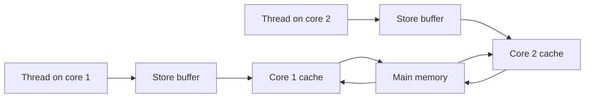
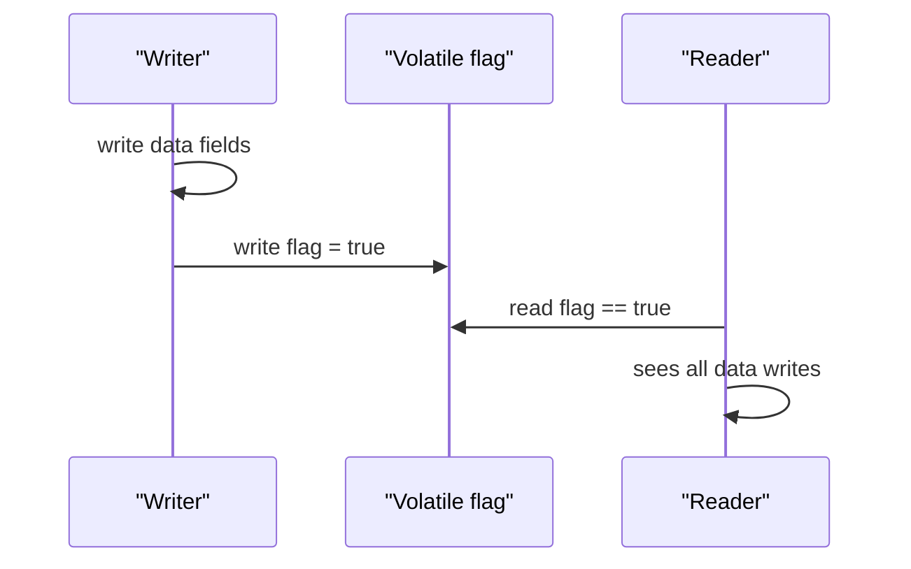

The Java Memory Model (JMM) defines when a write by one thread becomes visible to a read by another. Without it, "shared variable" would be a lie the hardware tells you. This is the deepest concurrency topic senior interviews probe.

## Why the JMM Exists

Your source code is not what runs. Three layers reorder and cache your memory operations, each for performance:

- **The compiler and JIT** reorder independent statements and hoist reads into registers.
- **The CPU** has **store buffers** — a write may sit in a buffer before reaching cache, invisible to other cores.
- **Per-core caches** mean two cores can hold different values for the same address until coherence catches up.

So a plain field written on core 1 is not guaranteed to be seen on core 2, and operations may appear to happen out of order. The JMM is the contract that tells you which reorderings are legal and what you must do to see a consistent view.



## Three Separate Problems

Candidates conflate these constantly. Keep them apart:

| Problem | Question it answers | Fixed by |
|---|---|---|
| **Visibility** | Does another thread ever see my write? | `volatile`, locks, `final` |
| **Atomicity** | Does a compound op happen all-or-nothing? | locks, atomics/CAS |
| **Ordering** | Can operations appear reordered? | `volatile`, locks, fences |

`volatile` fixes visibility and ordering but **not** atomicity of compound actions. A lock fixes all three. Getting this table straight is half the battle.

### The Classic Non-Terminating Loop

```java
class Spinner {
    private boolean stop = false;            // not volatile — bug
    void runUntilStopped() { while (!stop) { /* busy work */ } }
    void requestStop() { stop = true; }
}
```

A JIT may hoist `!stop` out of the loop into a register because nothing *in the loop* changes it, producing `while (true)`. The writer's `stop = true` never becomes visible. Marking `stop` **`volatile`** fixes it — every read goes to memory and the loop terminates.

## volatile Semantics

A `volatile` field guarantees that a **read always sees the most recent write**, and it prohibits reordering across the access — since Java 5 a volatile write acts as a **full fence in practice**, so writes *before* the volatile write are visible to any thread that later reads it. What `volatile` does **not** give you is atomicity of read-modify-write: `count++` on a volatile field is still three operations (read, add, write) and can lose updates under contention. Use it for flags and for the "publish" write in safe-publication patterns, not for counters.

> [!KEY]
> One-line summary to say out loud: *"volatile buys visibility and ordering, never atomicity of compound actions."* That distinction is the single most tested JMM idea.

## Happens-Before — The Core Rule

The JMM is defined by the **happens-before** relation. If action A *happens-before* B, then A's effects are visible to B. If two accesses to the same data are **not** ordered by happens-before and at least one is a write, you have a **data race** and the result is undefined. The rules you must be able to list:

1. **Program order** — within one thread, each action happens-before the next.
2. **Monitor lock** — unlocking a monitor happens-before any later lock of the *same* monitor.
3. **Volatile** — a write to a volatile field happens-before every later read of it.
4. **Thread start** — `Thread.start()` happens-before any action in the started thread.
5. **Thread join** — every action in a thread happens-before another thread returning from its `join()`.
6. **Final fields** — a `final` field's value is frozen at the end of the constructor and visible without synchronization (if `this` did not escape).
7. **Transitivity** — if A happens-before B and B happens-before C, then A happens-before C.

Transitivity is what makes it usable: writing normal fields, then a volatile flag, then reading that flag in another thread, publishes **all** the earlier writes.



## Safe Publication

To **publish** an object is to make it visible to other threads *fully constructed*. An improperly published object can be seen with default (zero/null) field values even after its constructor ran. The four safe ways:

1. Store the reference in a **`volatile`** field (or `AtomicReference`).
2. Store it into a **`final`** field, read after construction.
3. Store it while holding a **lock** that readers also acquire.
4. Store it in a data structure with **its own safe publication** (e.g. `ConcurrentHashMap`, `BlockingQueue`, static initializer).

## Double-Checked Locking

The infamous singleton optimization is **broken without `volatile`** because the write that publishes the instance can be reordered with the writes that initialize its fields, so another thread can see a non-null but half-built object.

```java
class Config {
    private static volatile Config instance;   // volatile is mandatory here
    static Config get() {
        Config local = instance;
        if (local == null) {
            synchronized (Config.class) {
                local = instance;
                if (local == null) instance = local = new Config();
            }
        }
        return local;
    }
}
```

Better answers exist. The **initialization-on-demand holder** idiom uses the JVM's guaranteed lazy, thread-safe class initialization:

```java
class Config {
    private Config() {}
    private static class Holder { static final Config INSTANCE = new Config(); }
    static Config get() { return Holder.INSTANCE; } // JVM guarantees safe, lazy init
}
```

And an **enum singleton** is the simplest correct answer, immune to reflection and serialization attacks.

> [!WARNING]
> Double-checked locking without `volatile` is a real bug, not a style nit. The other thread can observe a non-null reference whose fields are still zero. Interviewers who ask this expect you to name `volatile` as the fix and the holder idiom as the better design.

## final Fields and Leaking this

`final` fields have special JMM semantics: their correctly-constructed values are visible to any thread that reads the object through a reference obtained *after* the constructor finished — no synchronization required. This guarantee **evaporates if `this` escapes** during construction (registering a listener, starting a thread, storing `this` in a static) because another thread can then grab the reference before the freeze.

```java
class Service {
    private final int id;
    Service(EventBus bus) {
        bus.register(this); // BUG: leaks this before construction completes
        this.id = compute();
    }
}
```

## Word Tearing and long/double

The JMM allows a non-volatile 64-bit `long` or `double` write to be split into **two 32-bit writes** on a 32-bit JVM, so a concurrent reader can observe a **torn** value — the high half of one write and the low half of another. Declaring the field `volatile` makes 64-bit reads and writes atomic. (References and all other primitives are always atomic to read/write, though not visible without synchronization.)

## Atomics and Compare-and-Swap

`AtomicInteger`, `AtomicLong`, and `AtomicReference` provide lock-free atomic operations built on a hardware **compare-and-swap (CAS)**: "set to new value only if the current value still equals expected, else retry."

```java
AtomicInteger seq = new AtomicInteger();
int next = seq.incrementAndGet();          // atomic, no lock

AtomicReference<Node> head = new AtomicReference<>();
Node old, updated;
do {
    old = head.get();
    updated = new Node(value, old);
} while (!head.compareAndSet(old, updated)); // retry until CAS wins
```

### The ABA Problem

CAS only checks the value, not whether it *changed and changed back*. If a value goes A→B→A, a stale CAS succeeds even though the world moved. `AtomicStampedReference` attaches a version stamp so you detect the intervening change; use it for lock-free structures where reuse is possible.

### High-Contention Counters

Under heavy contention, `AtomicLong` CAS retries thrash a single cache line. `LongAdder` spreads the count across multiple cells and sums on read — far higher throughput when you write often and read rarely (metrics, counters).

## VarHandle and Memory Modes

`VarHandle` (Java 9) is the supported, safe replacement for `sun.misc.Unsafe`. It exposes access with explicit **memory modes** so you pay only for the ordering you need:

| Mode | Guarantee |
|---|---|
| **plain** | No ordering — like a normal field access |
| **opaque** | Atomic and per-variable ordering, no inter-variable ordering |
| **acquire/release** | Release write pairs with acquire read (cheaper one-way fence) |
| **volatile** | Full sequential-consistency fence |

Acquire/release is the workhorse for lock-free code: cheaper than full `volatile` while still giving the "publish then observe" guarantee.

## False Sharing and @Contended

Two independent variables that land on the **same 64-byte cache line** cause **false sharing**: a write to one invalidates the other's cache line on every core, silently serializing threads that share nothing logically. `jdk.internal.vm.annotation.@Contended` pads a field onto its own line (used internally by `LongAdder`), and manual padding achieves the same in application code.

## A Race and Its Fix

```java
// RACE: check-then-act on a plain field
class Once {
    private boolean done = false;
    void run(Runnable r) { if (!done) { r.run(); done = true; } } // two threads both run
}

// FIXED: atomic check-and-set
class OnceFixed {
    private final AtomicBoolean done = new AtomicBoolean();
    void run(Runnable r) { if (done.compareAndSet(false, true)) r.run(); }
}
```

## Cheat sheet

- The JMM exists because compilers, store buffers, and per-core caches reorder and hide writes.
- Visibility, atomicity, and ordering are three different problems — name the one you mean.
- `volatile` gives visibility and ordering, never atomicity of `x++`.
- Learn the happens-before rules; transitivity through a volatile flag publishes prior writes.
- Four safe publications: volatile, final, under a lock, or via a concurrent container.
- Double-checked locking needs `volatile`; prefer the holder idiom or an enum singleton.
- Don't leak `this` from a constructor — it breaks `final`-field guarantees.
- Non-volatile `long`/`double` can tear on 32-bit JVMs; make them volatile.
- CAS underlies atomics; watch for ABA (`AtomicStampedReference`) and contention (`LongAdder`).
- `VarHandle` acquire/release modes replace `Unsafe` for fine-grained lock-free code.

## Common mistakes

| Mistake | Fix |
|---|---|
| Using `volatile` for a counter | Use `AtomicInteger` or a lock for read-modify-write |
| Assuming a plain flag is seen by other threads | Make it `volatile` |
| Double-checked locking without `volatile` | Add `volatile` or use the holder idiom |
| Leaking `this` in a constructor | Publish only after construction completes |
| Sharing a plain `long` across threads on 32-bit | Declare it `volatile` |
| Trusting CAS against ABA reuse | Use `AtomicStampedReference` |
| One `AtomicLong` under heavy write contention | Use `LongAdder` |
| Hot fields on one cache line | Pad or use `@Contended` |

## Summary

The JMM is the contract that turns hardware chaos — reordering compilers, store buffers, incoherent caches — into predictable multi-threaded behavior. Its heart is the happens-before relation: order two accesses with it (via `volatile`, locks, `start`/`join`, or `final` fields) and one thread's writes become visible to another; leave them unordered with a write in play and you have an undefined data race. Keep visibility, atomicity, and ordering distinct, publish objects safely, and reach for atomics or `VarHandle` modes when you need lock-free speed. Master double-checked locking and the holder idiom, because they are asked constantly.

## Top Interview Questions

### Q1. What problem does the Java Memory Model solve?

The JMM defines the rules for when one thread's writes to shared memory become visible and in what order to other threads. It exists because your code does not execute literally: the compiler and JIT reorder independent operations and cache values in registers, CPUs buffer stores before they reach cache, and each core has its own cache that may temporarily disagree with others. Without a memory model, reasoning about concurrent programs would be impossible because "read the latest value" would have no defined meaning. The JMM specifies exactly which reorderings are legal and, through the happens-before relation, what synchronization you must add — `volatile`, locks, `final` fields — to guarantee a consistent, ordered view of shared data.

### Q2. Explain the difference between visibility, atomicity, and ordering.

They are three independent guarantees. **Visibility** is whether a write by one thread is ever seen by another — solved by `volatile`, locks, or `final`. **Atomicity** is whether a compound operation like `count++` happens all-or-nothing rather than as read-modify-write that can interleave — solved by locks or atomic/CAS operations. **Ordering** is whether operations can appear to execute in a different order than written — solved by `volatile`, locks, or explicit fences. The classic mistake is assuming `volatile` provides atomicity: it gives visibility and ordering, so a volatile boolean flag is fine, but a volatile counter still loses updates because increment is three operations, not one.

### Q3. Why can a loop reading a non-volatile flag never terminate?

If a thread loops on `while (!stop)` and nothing inside the loop modifies `stop`, the JIT is allowed to hoist the read out of the loop into a register once, effectively compiling it to `while (true)`. Meanwhile another thread's `stop = true` writes to memory, but the looping thread never re-reads memory, so it spins forever. This is legal precisely because, without `volatile` or another happens-before edge, there is no requirement for the writer's update to become visible to the reader. Declaring `stop` as `volatile` forces every read to go to memory and establishes the ordering that makes the write visible, so the loop exits.

### Q4. State the main happens-before rules.

Program order (each action in a thread happens-before the next in that thread); monitor lock (an unlock happens-before every subsequent lock of the same monitor); volatile (a write happens-before every later read of the same volatile field); thread start (`start()` happens-before everything the new thread does); thread join (everything a thread does happens-before another thread returning from `join()` on it); final fields (values are frozen at constructor end and visible without synchronization); and transitivity (A before B and B before C implies A before C). Transitivity is the practical one: write your data, then a volatile flag; a reader that sees the flag is guaranteed to see all the data writes that preceded it.

### Q5. Why is double-checked locking broken without volatile, and what is the fix?

`instance = new Config()` is not atomic: it allocates memory, runs the constructor, and assigns the reference — and the JMM permits the assignment to become visible **before** the constructor's field writes. So a second thread taking the fast path can read a non-null `instance` whose fields are still default values, and use a half-constructed object. Marking the field `volatile` inserts the ordering that forbids that reordering, so a non-null reference implies a fully constructed object. Even better, use the initialization-on-demand holder idiom, which relies on the JVM's guaranteed thread-safe, lazy class initialization and needs no explicit synchronization, or an enum singleton for the simplest correct implementation.

### Q6. What are the ways to safely publish an object, and why does it matter?

Safe publication means other threads see the object fully constructed, not with default field values. The four safe mechanisms are: assign the reference to a `volatile` field or `AtomicReference`; assign it to a `final` field read after construction; publish it while holding a lock that readers also acquire; or place it in a thread-safe container that provides its own publication guarantee, such as `ConcurrentHashMap`, a `BlockingQueue`, or a static initializer. It matters because a naively shared reference (a plain field, or one leaked mid-construction) can be seen by another thread with partially initialized state, producing bugs that are intermittent and nearly impossible to reproduce.

### Q7. What are final-field semantics and how does leaking this break them?

A `final` field is guaranteed to be visible with its constructed value to any thread that reads the object through a reference obtained after the constructor completes — no synchronization needed. This "freeze" at the end of construction is what lets immutable objects like `String` be shared safely. It breaks when `this` **escapes** during construction: if the constructor registers the object as a listener, starts a thread that captures `this`, or stores it in a shared field before finishing, another thread can obtain the reference before the freeze and observe uninitialized final fields. The rule is never publish `this` from inside a constructor; use a factory method or a separate `start()` call afterward.

### Q8. What is the ABA problem and how do you handle it?

Compare-and-swap succeeds if the current value equals the expected value, but it cannot tell whether the value changed to something else and back again. In a lock-free structure, a value may go from A to B and back to A while a thread was preparing its CAS; the CAS then succeeds on the stale assumption that nothing changed, which can corrupt the structure (for example, reusing a freed node). The fix is to attach a monotonically increasing stamp so equal values with different stamps are distinguished: `AtomicStampedReference` pairs a reference with an int stamp, and the CAS checks both. This matters mainly in low-level lock-free algorithms; ordinary counters do not hit ABA.

### Q9. When would you use LongAdder instead of AtomicLong?

Use `LongAdder` for **high-contention, write-heavy** counters where many threads increment far more often than anyone reads the total — request counters, metrics, statistics. `AtomicLong` funnels every increment through a CAS on one memory location, and under heavy contention those CAS operations repeatedly fail and retry while the cache line ping-pongs between cores, throttling throughput. `LongAdder` maintains an array of cells, spreads threads across them to reduce contention, and computes the sum only when you call `sum()`. The trade-off is that reads are more expensive and slightly less precise if updates race with the read, so prefer `AtomicLong` when you need an always-current value or reads are as frequent as writes.

### Q10. What is false sharing and how do you detect and fix it?

False sharing happens when two variables that are logically independent sit on the same 64-byte cache line, so a write to one invalidates the other's cache line across all cores; threads that touch different variables end up serializing as if they shared data. It shows up as unexplained scalability loss that worsens with core count. You detect it with CPU profilers or hardware counters showing high cache-line contention on hot fields. The fix is to pad the fields so each occupies its own cache line — manually with filler fields, or with `@Contended` (used internally by `LongAdder` and the striped counters). It is an advanced topic, but naming it signals real low-level understanding.

### Q11. Your service intermittently reads stale configuration after a hot reload, only under load. How do you reason about it?

This is a visibility bug: the reloading thread writes new config into a field, but reader threads keep seeing the old value because there is no happens-before edge between the write and the reads. Under low load the timing hides it; under load with more cores and cache pressure it surfaces. The fix is to establish ordering — store the config object in a `volatile` field (or `AtomicReference`), so the write publishes it and every read sees the latest fully constructed instance. Because references to an immutable config are read far more than written, `volatile` is ideal and cheap. I would also confirm the config object itself is safely published (immutable with final fields) so readers never see a half-updated instance.

### Q12. How does VarHandle improve on volatile and Unsafe for lock-free code?

`Unsafe` gave low-level atomic and fenced access but was unsupported, unsafe, and off-limits for application code. `VarHandle` (Java 9) is the supported replacement: it offers atomic operations (`compareAndSet`, `getAndAdd`) and, crucially, a spectrum of **memory-access modes** — plain, opaque, acquire/release, and volatile — so you request exactly the ordering you need instead of paying for a full fence everywhere. For most lock-free publish/consume patterns, acquire/release is enough and is cheaper than `volatile`'s full sequential-consistency fence, because it is a one-way barrier. This lets you write high-performance concurrent data structures with precise, portable memory semantics that the JMM defines, rather than relying on `Unsafe`'s implementation-specific behavior.
