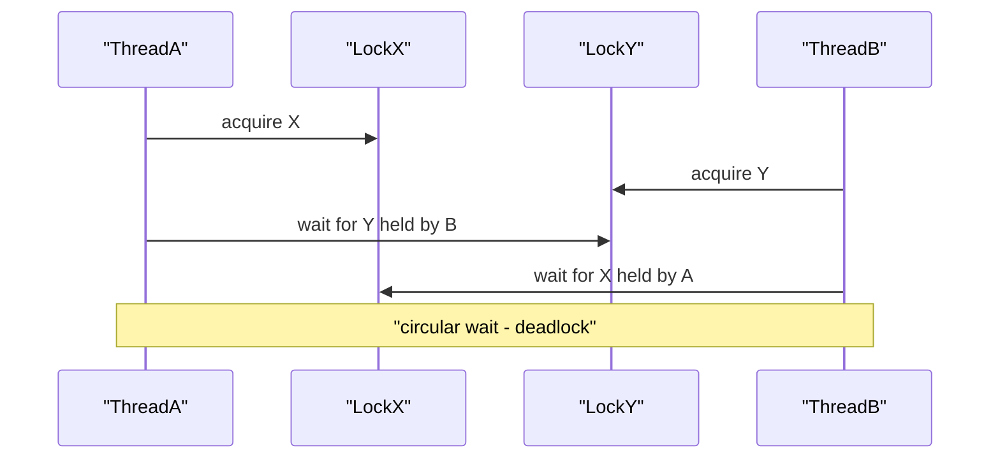

Locks and synchronizers coordinate threads that share state. Interviewers want to know when `synchronized` is enough, when `ReentrantLock` earns its complexity, and how to reason about deadlock — with a concrete example, not a definition.

## synchronized and Intrinsic Monitors

Every Java object has an **intrinsic monitor** (a lock). `synchronized` acquires it on entry and releases it on exit, even if the block throws. You can synchronize a whole method (locks `this`, or the `Class` for a static method) or a block (locks whatever object you name).

```java
synchronized void m() { /* locks this for the whole method */ }

void n() {
    synchronized (lock) { /* locks only this critical section */ }
}
```

Intrinsic locks are **reentrant**: a thread already holding a monitor can re-acquire it without deadlocking itself, which is what lets a synchronized method call another synchronized method on the same object.

### What Object You Lock On Matters

The single most common `synchronized` bug is locking on the **wrong object**:

- Locking on `this` exposes your lock to callers, who can lock your instance and stall you.
- Locking on a **`String` literal** or a boxed `Integer` is a real bug: literals are interned and small `Integer`s are cached, so unrelated code that locks `"lock"` or `Integer.valueOf(1)` shares your monitor.
- The safe pattern is a **private final lock object** nobody else can reach.

```java
private final Object lock = new Object(); // private, final, unshared — the safe choice
void update() { synchronized (lock) { /* ... */ } }
```

> [!DANGER]
> Never `synchronized` on a `String` literal, a boxed primitive, or a mutable field. Interned strings and cached boxes are shared JVM-wide, so two unrelated classes can silently share a lock — an intermittent, near-undebuggable stall.

## The Modern JVM Lock Story

Be ready to describe how intrinsic locks actually behave. Under low contention the JVM uses a **thin lock** — a cheap CAS on the object header. When threads contend, the lock **inflates** into a heavyweight OS monitor. The JVM also uses **adaptive spinning**: a thread briefly spins hoping the holder releases quickly, avoiding an expensive OS park for short critical sections. **Biased locking**, an old optimization for uncontended locks by a single thread, was **disabled and deprecated in JDK 15, then removed in later JDKs** because it hurt more than it helped on modern workloads. The honest senior answer: intrinsic locks are cheap when uncontended and JIT-optimized, so `synchronized` is a fine default until profiling shows contention.

## ReentrantLock — What It Buys

`ReentrantLock` implements the same mutual exclusion as `synchronized` but with capabilities the intrinsic monitor lacks. The cost is you **must unlock in a `finally`**.

```java
private final ReentrantLock lock = new ReentrantLock();
void transfer() {
    lock.lock();
    try {
        // critical section
    } finally {
        lock.unlock(); // mandatory — a thrown exception must not strand the lock
    }
}
```

| Feature | `synchronized` | `ReentrantLock` |
|---|---|---|
| Reentrant | ✅ | ✅ |
| Auto-release on exit | ✅ | ❌ (need `finally`) |
| Timed acquire (`tryLock(t)`) | ❌ | ✅ |
| Interruptible acquire | ❌ | ✅ (`lockInterruptibly`) |
| Fairness option | ❌ | ✅ |
| Multiple conditions | ❌ (one wait set) | ✅ (many `Condition`s) |

`tryLock(timeout)` lets you **give up rather than block forever** — the basis of deadlock-avoiding designs. `lockInterruptibly()` lets a blocked acquirer respond to interruption. **Fairness** (FIFO) prevents starvation but lowers throughput, so it is off by default. Multiple `Condition` objects let you signal producers and consumers separately.

## ReentrantReadWriteLock

A `ReentrantReadWriteLock` allows **many concurrent readers or one writer**, ideal for read-mostly data. Two hazards to name: **writer starvation** (a stream of readers never lets a writer in — fair mode mitigates it) and the rule that you can **downgrade** a write lock to a read lock (acquire read while holding write, then release write) but you **cannot upgrade** a read lock to a write lock (it deadlocks).

```java
private final ReentrantReadWriteLock rw = new ReentrantReadWriteLock();
V get(K k) { rw.readLock().lock(); try { return map.get(k); } finally { rw.readLock().unlock(); } }
void put(K k, V v) { rw.writeLock().lock(); try { map.put(k, v); } finally { rw.writeLock().unlock(); } }
```

## StampedLock and Optimistic Reads

`StampedLock` (Java 8) adds an **optimistic read**: you take a stamp, read the fields, then `validate(stamp)` — if no writer intervened, you never acquired a lock at all, so reads are extremely cheap. If validation fails, fall back to a real read lock.

```java
double distanceFromOrigin() {
    long stamp = sl.tryOptimisticRead();      // no lock taken yet
    double cx = x, cy = y;
    if (!sl.validate(stamp)) {                // a writer intervened — retry under a read lock
        stamp = sl.readLock();
        try { cx = x; cy = y; } finally { sl.unlockRead(stamp); }
    }
    return Math.sqrt(cx * cx + cy * cy);
}
```

> [!WARNING]
> `StampedLock` is **not reentrant** and does not support `Condition`. Re-acquiring it on the same thread deadlocks, and you must not use optimistic reads for values you will then act on without re-validating. It is a specialist tool, not a drop-in for `ReentrantReadWriteLock`.

## Condition vs wait/notify

A `Condition` (from `lock.newCondition()`) is the `Lock` world's `wait`/`notify`: `await()` releases the lock and parks, `signal()`/`signalAll()` wake waiters. The advantage over the intrinsic monitor is **multiple wait sets per lock**, so producers wait on `notFull` and consumers on `notEmpty`, and you signal precisely the right group — no more waking everyone with `notifyAll`. The same discipline applies: **always `await` in a `while` loop**.

## The java.util.concurrent Synchronizers

Higher-level coordination tools, all built on `AbstractQueuedSynchronizer`:

| Tool | Purpose | Reusable | Key method |
|---|---|---|---|
| `CountDownLatch` | Wait for N events to complete | ❌ one-shot | `await` / `countDown` |
| `CyclicBarrier` | N threads rendezvous, then all proceed | ✅ | `await`, optional barrier action |
| `Phaser` | Flexible multi-phase barrier with dynamic parties | ✅ | `arriveAndAwaitAdvance` |
| `Semaphore` | Limit concurrent access to N permits | ✅ | `acquire` / `release` |
| `Exchanger` | Two threads swap objects at a rendezvous | ✅ | `exchange` |

`CountDownLatch` counts **down to zero once** — perfect for "wait until all workers finish startup." `CyclicBarrier` resets and can run a **barrier action** when the last party arrives — perfect for iterative parallel algorithms. `Semaphore` is a permit counter — a `Semaphore(1)` is a mutex, `Semaphore(10)` caps concurrency (e.g., limiting calls to a fragile downstream). `Exchanger` hands off between exactly two threads.

```java
Semaphore permits = new Semaphore(10); // at most 10 concurrent downstream calls
void call() throws InterruptedException {
    permits.acquire();
    try { downstream(); } finally { permits.release(); }
}
```

## Deadlock — The Four Coffman Conditions

Deadlock needs **all four** conditions simultaneously; break any one and it cannot occur:

1. **Mutual exclusion** — a resource is held exclusively.
2. **Hold and wait** — a thread holds one lock while waiting for another.
3. **No preemption** — a lock cannot be forcibly taken away.
4. **Circular wait** — a cycle of threads each waiting on the next.

A concrete two-lock deadlock:

```java
// Thread A: transfer(x, y)  |  Thread B: transfer(y, x)
void transfer(Account from, Account to, long amount) {
    synchronized (from) {                  // A locks x, B locks y
        synchronized (to) {                // A waits for y, B waits for x -> deadlock
            from.debit(amount); to.credit(amount);
        }
    }
}
```



### Fixes

- **Global lock ordering** — always acquire locks in a fixed order (e.g., by account id). Breaks circular wait; the standard fix.
- **`tryLock` with timeout** — attempt both locks, back off and retry on failure. Breaks hold-and-wait.
- **Lock-free / single lock / concurrent data structures** — remove the second lock entirely.

```java
Account first = from.id() < to.id() ? from : to;   // consistent global order
Account second = first == from ? to : from;
synchronized (first) { synchronized (second) { /* safe: no cycle possible */ } }
```

## Livelock and Starvation

**Livelock**: threads keep responding to each other and change state but make no progress — two people stepping aside in a corridor forever. Randomized backoff breaks it. **Starvation**: a thread never gets the resource because others monopolize it — caused by unfair locks or priority skew; fair locks or bounded waits fix it. Both are "no progress" bugs that, unlike deadlock, still show threads as `RUNNABLE`.

## Detecting Deadlock from a Thread Dump

`jstack <pid>` (or `jcmd <pid> Thread.print`) explicitly prints **"Found one Java-level deadlock"** with the cycle: each thread, the lock it holds, and the lock it waits for. For live monitoring, `ThreadMXBean.findDeadlockedThreads()` returns the deadlocked thread ids programmatically. That is your go-to when a service hangs with CPU near zero.

## Lock Granularity and Contention

Lock **contention** is a scalability wall: if every request serializes on one lock, adding cores does nothing. The levers are **granularity** — a coarse lock is simple but serializes everything; **lock striping** splits custom state into independently locked stripes; and shrinking the **critical section** so the lock is held for the minimum time (never do I/O under a lock). Modern `ConcurrentHashMap` does not use the old segment striping design; since Java 8 it uses CAS plus bin-level locking. The trade-off: finer locking scales better but risks more deadlocks and complexity.

## Cheat sheet

- `synchronized` uses the object's intrinsic monitor, is reentrant, and auto-releases on exit.
- Lock on a `private final Object`, never on `this`, a `String` literal, or a boxed `Integer`.
- Biased locking is gone (JDK 15+); intrinsic locks are cheap when uncontended.
- `ReentrantLock` adds `tryLock`, timeouts, interruptible acquire, fairness, and multiple conditions — always unlock in `finally`.
- `ReentrantReadWriteLock` allows many readers or one writer; you can downgrade, never upgrade.
- `StampedLock` optimistic reads are cheapest but it is non-reentrant with no conditions.
- `CountDownLatch` is one-shot; `CyclicBarrier` is reusable with a barrier action; `Semaphore` caps concurrency.
- Deadlock needs all four Coffman conditions; global lock ordering is the standard fix.
- Livelock and starvation are progress bugs that still look `RUNNABLE`.
- Detect deadlock with `jstack` or `ThreadMXBean.findDeadlockedThreads()`.

## Common mistakes

| Mistake | Fix |
|---|---|
| `synchronized` on a `String` literal or boxed `Integer` | Use a private final lock object |
| Forgetting `unlock()` on an exception path | Put `unlock()` in a `finally` block |
| Acquiring two locks in inconsistent order | Impose a global lock ordering |
| Trying to upgrade a read lock to a write lock | Release the read lock first, or restructure |
| Doing I/O inside a critical section | Move I/O outside the lock; hold it briefly |
| Using `StampedLock` reentrantly | Use `ReentrantReadWriteLock` if you need reentrancy |
| Reusing a `CountDownLatch` | Use `CyclicBarrier` or `Phaser` for reuse |
| `await`/`wait` guarded by `if` | Loop on the condition |

## Summary

`synchronized` is the simple, reentrant default and is well-optimized on modern JVMs, so reach for `ReentrantLock` only when you need timed or interruptible acquisition, fairness, or multiple condition queues — and then always unlock in a `finally`. Read-mostly data suits `ReentrantReadWriteLock` or, for the cheapest reads, `StampedLock`'s optimistic mode with validation. The `java.util.concurrent` synchronizers — latches, barriers, semaphores — express common coordination patterns far more clearly than hand-rolled `wait`/`notify`. Deadlock requires all four Coffman conditions, so break one, usually with a consistent global lock order, and know how to spot the cycle in a `jstack` dump.

## Top Interview Questions

### Q1. What is the difference between synchronized and ReentrantLock?

Both provide mutually exclusive, reentrant locking, but `ReentrantLock` is an explicit lock with extra capabilities: `tryLock()` and `tryLock(timeout)` for non-blocking or timed acquisition, `lockInterruptibly()` so a waiting thread can be interrupted, an optional fairness policy, and multiple `Condition` objects for separate wait sets. The price is that you must release it manually in a `finally` block, whereas `synchronized` releases automatically at block exit even on exception. `synchronized` is simpler, harder to misuse, and heavily JIT-optimized, so it should be the default; choose `ReentrantLock` specifically when you need timeouts (to avoid or break deadlock), interruptibility, fairness, or more than one condition queue. Performance is essentially equal under low contention.

### Q2. Why is it dangerous to synchronize on a String literal or a boxed Integer?

Because both are shared far more widely than you think. String literals are **interned** — every `"lock"` in the entire JVM refers to the same object — and small `Integer` values (−128 to 127) are **cached** by `Integer.valueOf`, so `Integer.valueOf(1)` is one shared instance. If your class locks on such a value, any unrelated class that happens to lock on the same literal or boxed value shares your monitor, causing mysterious contention or deadlock between components that have nothing to do with each other. The bug is intermittent and extremely hard to trace. The rule is to lock on a `private final Object` that no other code can reference.

### Q3. Explain read-write locks, and why you can downgrade but not upgrade.

A `ReentrantReadWriteLock` separates a shared read lock (many holders concurrently) from an exclusive write lock (one holder, no readers). It shines for read-mostly data. **Downgrading** — holding the write lock, acquiring the read lock, then releasing the write lock — is safe because you already have exclusive access, so no one can slip in during the handover. **Upgrading** — holding a read lock and trying to acquire the write lock — deadlocks: the write lock needs all readers to release, but you are one of those readers and are blocked waiting, so it can never proceed, and if two readers both try it they deadlock each other. To "upgrade," you must release the read lock and re-acquire as a writer, re-checking state because it may have changed in the gap.

### Q4. What is a StampedLock and when would you use it?

`StampedLock` is a Java 8 lock offering three modes: write, read, and a very cheap **optimistic read**. Optimistic read returns a stamp without actually acquiring a lock; you read the fields, then call `validate(stamp)`, and if no writer intervened you paid almost nothing. If validation fails, you fall back to a real read lock and retry. It shines for read-heavy structures with short reads and infrequent writes, outperforming `ReentrantReadWriteLock`. The caveats are important: it is **not reentrant**, offers no `Condition` support, and you must copy fields into locals and validate before using them, never acting on optimistically read values without confirming. Misusing it — reentrantly, or trusting unvalidated reads — introduces subtle bugs, so it is a specialist tool.

### Q5. Compare CountDownLatch, CyclicBarrier, and Semaphore.

`CountDownLatch` is a **one-shot** gate initialized to N: threads `await()` until `countDown()` has been called N times, then all proceed; it cannot be reset. Use it for "wait until N tasks finish" or "hold workers until startup completes." `CyclicBarrier` is **reusable**: N threads each call `await()` and all are released together when the last arrives, optionally running a barrier action, then the barrier resets — ideal for iterative parallel algorithms where threads must synchronize at the end of each phase. `Semaphore` is a **permit counter** controlling how many threads may access a resource at once: `acquire()` takes a permit, `release()` returns one; a single-permit semaphore acts as a mutex, and larger counts throttle concurrency to a fragile downstream. The key axes are one-shot vs reusable and counting-down vs limiting-concurrency.

### Q6. What are the four conditions required for deadlock?

Deadlock requires all four **Coffman conditions** at once: **mutual exclusion** (resources are held exclusively), **hold and wait** (a thread holds resources while requesting more), **no preemption** (resources cannot be forcibly reclaimed), and **circular wait** (a cycle of threads each waiting for a resource the next one holds). Because all four are necessary, preventing any single one prevents deadlock. In practice the easiest to attack is circular wait, via a global lock-ordering discipline, or hold-and-wait, via `tryLock` with timeout and backoff so a thread never blocks indefinitely while holding a lock. Being able to map a specific fix to the specific condition it breaks is what senior interviewers look for.

### Q7. Show a concrete deadlock and how you would fix it.

The classic is two-account transfer: thread A calls `transfer(x, y)` and locks `x` then waits for `y`; thread B calls `transfer(y, x)` and locks `y` then waits for `x` — a circular wait, so both hang forever. The standard fix is **global lock ordering**: always acquire the two account locks in a consistent order, for example by ascending account id, so no cycle can form regardless of argument order. If a total order is impossible, use `tryLock` with a timeout on the second lock and, on failure, release the first and retry with backoff, which breaks hold-and-wait. The best fix of all is often to avoid the second lock entirely by using a single coarse lock for the transfer or an atomic/lock-free design.

### Q8. How do you detect a deadlock in production?

If a service hangs with CPU near zero, I take a thread dump with `jstack <pid>` or `jcmd <pid> Thread.print`; the JVM automatically detects Java-monitor deadlocks and prints "Found one Java-level deadlock" along with the exact cycle — which thread holds which lock and waits for which. That immediately identifies the two (or more) threads and the locks involved. For continuous monitoring I use `ThreadMXBean.findDeadlockedThreads()`, which returns the ids of deadlocked threads programmatically and can drive an alert or a self-diagnostic. Note that `jstack`'s automatic detection covers intrinsic monitors and `Lock` objects that implement the right interfaces, but a "deadlock" caused by a semaphore or a latch that is never signalled won't be flagged as such — for those you read the stacks and see threads stuck in `await`.

### Q9. What is the difference between deadlock, livelock, and starvation?

**Deadlock** is a permanent block: threads wait on each other in a cycle and none can proceed; they appear `BLOCKED` or `WAITING` and CPU is idle. **Livelock** is threads that are actively running and changing state in response to each other but making no forward progress — like two people repeatedly stepping the same way to pass in a hallway; CPU is busy but nothing completes, often caused by naive retry-and-back-off logic that is synchronized. **Starvation** is one thread perpetually denied a resource because others keep winning it — caused by unfair locks, thread-priority effects, or a steady stream of higher-priority work. Deadlock is fixed by lock ordering, livelock by randomized backoff, and starvation by fairness policies or bounded waiting. The tell is that only deadlock leaves threads blocked; the other two keep threads runnable.

### Q10. How does lock contention limit scalability, and what can you do about it?

If every operation must acquire the same lock, the lock serializes all threads and the program's throughput is capped no matter how many cores you add — this is Amdahl's law in action, where the locked section is the serial fraction. The remedies all reduce the time or breadth of serialization: shrink the **critical section** so the lock is held for the minimum work and never wraps I/O or blocking calls; use **lock striping** in your own structures so unrelated keys don't contend; rely on modern concurrent collections that use CAS and bin-level locking; switch to **read-write** or **optimistic** locks when reads dominate; or move to **lock-free** structures backed by CAS. The trade-off is that finer-grained locking scales better but adds complexity and more opportunities for deadlock, so you refine granularity only where profiling shows real contention.

### Q11. Why must you release an explicit lock in a finally block, and what happens if you don't?

Unlike `synchronized`, a `ReentrantLock` is not released automatically when control leaves the block, so if the critical section throws and you unlock only on the normal path, the lock stays held forever. Every other thread that needs it then blocks indefinitely — effectively a hang that looks like a deadlock in a dump, with one thread long gone and its lock still marked held. The correct idiom is `lock.lock();` immediately followed by `try { ... } finally { lock.unlock(); }`, and you acquire the lock **outside** the `try` so a failure in `lock()` itself doesn't trigger an unlock you never performed. This discipline is the single most important rule when moving from `synchronized` to explicit locks.

### Q12. When would you prefer Condition objects over wait/notify?

`Condition` objects, obtained from a `Lock`, are preferable when a single lock guards **multiple distinct wait conditions**, because one `Lock` can have many `Condition`s, each with its own wait queue. In a bounded buffer you create `notFull` and `notEmpty`: producers `await` on `notFull`, consumers `await` on `notEmpty`, and you `signal` exactly the group that can now make progress. With intrinsic `wait`/`notify` there is a single wait set per object, so you are forced to `notifyAll` and wake threads that immediately go back to waiting, wasting CPU and risking missed signals. `Condition` also composes with `ReentrantLock`'s timed and interruptible acquisition. The discipline is identical — always `await` inside a `while` loop that re-checks the predicate — but the ability to target signals makes `Condition` clearer and more efficient for multi-condition coordination.
