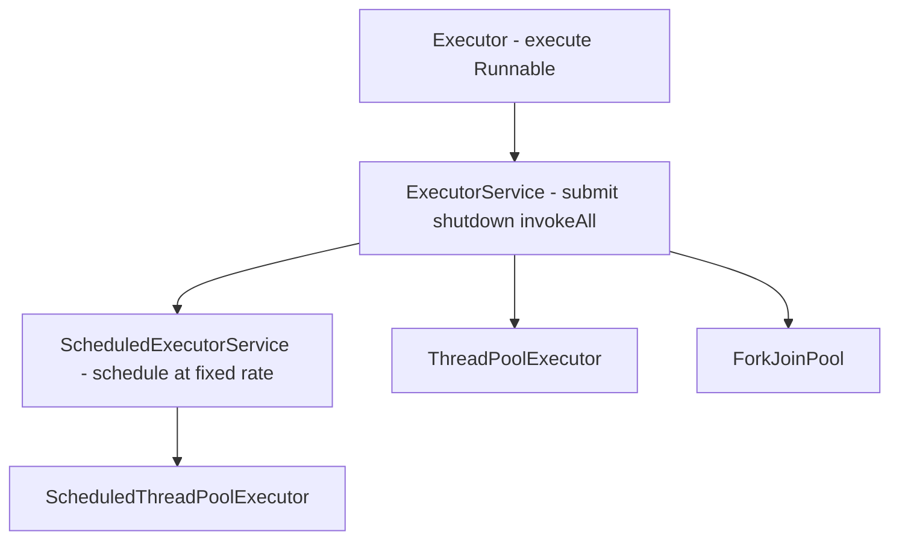
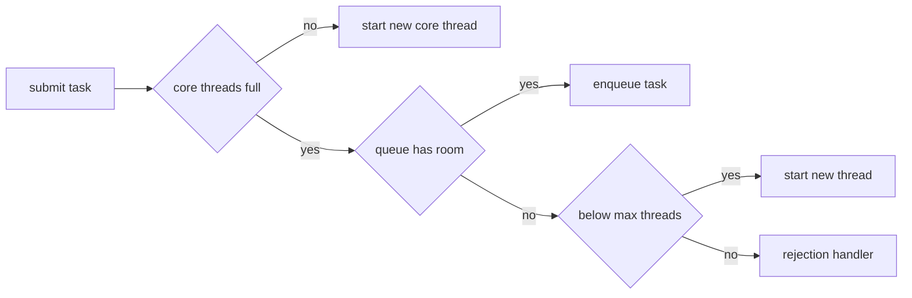

Thread pools decouple task submission from thread management so you reuse a bounded set of threads instead of paying creation cost per task. The details of how a pool grows and rejects work are where senior interviews live.

## Why Never new Thread(...).start() in a Server

Spawning a raw thread per request has no upper bound: a traffic spike creates thousands of threads, each ~1 MB of stack, and the JVM either thrashes on context switches or dies with `OutOfMemoryError: unable to create new native thread`. A pool gives you a **fixed ceiling**, thread reuse, a queue for backpressure, and a place to name threads and handle failures. The rule: in server code, submit to an `ExecutorService`; never call `new Thread(r).start()` in a request path.

## The Executor Hierarchy



- `Executor` — one method, `execute(Runnable)`.
- `ExecutorService` — adds `submit` (returns a `Future`), `invokeAll`, `invokeAny`, and lifecycle (`shutdown`).
- `ScheduledExecutorService` — adds delayed and periodic scheduling.
- `Future<T>` — a handle to a pending result; `get()` blocks until done.

## ThreadPoolExecutor Parameters, One by One

Every `Executors` factory is a preset `ThreadPoolExecutor`. Know its constructor:

```java
new ThreadPoolExecutor(
    corePoolSize,      // threads kept alive even when idle
    maximumPoolSize,   // hard ceiling on threads
    keepAliveTime,     // idle time before non-core threads die
    TimeUnit.SECONDS,
    workQueue,         // where tasks wait when all core threads are busy
    threadFactory,     // names threads, sets daemon, uncaught handler
    rejectionHandler); // what to do when the pool AND queue are full
```

| Parameter | Role |
|---|---|
| `corePoolSize` | Baseline threads that stay alive |
| `maximumPoolSize` | Upper bound on total threads |
| `keepAliveTime` | How long idle non-core threads live |
| `workQueue` | Holds tasks awaiting a thread |
| `threadFactory` | Creates and configures threads |
| `rejectionHandler` | Policy when saturated |

### The Non-Obvious Growth Rule

This is the question that separates people who have read the docs from people who haven't. A `ThreadPoolExecutor` grows in a specific order:

1. If fewer than `corePoolSize` threads exist, **start a new thread** for the task.
2. Else **try to queue** the task.
3. Only if the **queue is full** does the pool create threads up to `maximumPoolSize`.
4. If the queue is full **and** `maximumPoolSize` is reached, **reject**.

The trap: with an **unbounded queue** (`LinkedBlockingQueue` with no capacity), step 2 never fails, so **`maximumPoolSize` is never used** — the pool stays at `corePoolSize` and the queue grows without limit toward OOM.

> [!KEY]
> The pool only grows past `corePoolSize` **after the queue is full**. An unbounded queue therefore makes `maximumPoolSize` dead code and turns a spike into unbounded memory growth. This is the most-tested thread-pool fact.

## The Executors Factory Methods and Their Traps

| Factory | Underlying config | Risk |
|---|---|---|
| `newFixedThreadPool(n)` | n core = max, **unbounded** `LinkedBlockingQueue` | queue grows to OOM under overload |
| `newSingleThreadExecutor()` | 1 thread, **unbounded** queue | same OOM risk, serialized |
| `newCachedThreadPool()` | 0 core, `Integer.MAX_VALUE` max, `SynchronousQueue` | unbounded **thread** creation under load |
| `newScheduledThreadPool(n)` | delayed/periodic | unbounded queue |
| `newWorkStealingPool()` | `ForkJoinPool` | shared-pool semantics |

`newFixedThreadPool` and `newSingleThreadExecutor` bound threads but not the queue, so overload fills memory. `newCachedThreadPool` bounds the queue (`SynchronousQueue` holds nothing) but not threads, so overload spawns unlimited threads. This is exactly why many teams **construct `ThreadPoolExecutor` directly** with a **bounded** queue and an explicit rejection policy — you choose where the backpressure happens.

```java
ExecutorService pool = new ThreadPoolExecutor(
    8, 16, 60L, TimeUnit.SECONDS,
    new ArrayBlockingQueue<>(1000),                 // bounded — backpressure lives here
    new ThreadPoolExecutor.CallerRunsPolicy());     // slow the producer when saturated
```

## Rejection Policies

When the queue is full and the pool is at max, the `RejectedExecutionHandler` decides:

| Policy | Behavior |
|---|---|
| `AbortPolicy` (default) | Throws `RejectedExecutionException` |
| `CallerRunsPolicy` | Runs the task on the **submitting** thread |
| `DiscardPolicy` | Silently drops the new task |
| `DiscardOldestPolicy` | Drops the oldest queued task, retries |

`CallerRunsPolicy` gives **natural backpressure**: when the pool is saturated, the submitting thread runs the task itself, so it cannot submit more until it finishes — the producer is throttled to the pool's real capacity instead of piling work into memory. That makes it the pragmatic default for ingestion pipelines.

> [!WARNING]
> `DiscardPolicy` and `DiscardOldestPolicy` **lose work silently** — no exception, no log. Only use them when dropping tasks is genuinely acceptable (e.g., superseded UI refreshes), and even then add metrics so you know how often it happens.

## Sizing a Pool

Sizing depends on whether tasks are CPU-bound or I/O-bound:

- **CPU-bound**: threads ≈ **number of cores** (`Runtime.getRuntime().availableProcessors()`), sometimes `N+1`. More threads just add context-switch overhead because the CPUs are already full.
- **I/O-bound**: threads spend most time blocked, so you want more. **Little's law** gives `threads ≈ N * (1 + wait/service)`, where `wait/service` is the ratio of waiting time to compute time. A task that waits 90 ms and computes 10 ms wants roughly `N * 10` threads.

Measure the ratio; don't guess. Over-sizing a CPU pool wastes memory and slows everything; under-sizing an I/O pool leaves cores idle.

## submit vs execute — Where Exceptions Go

A subtle production trap: `execute(Runnable)` routes an uncaught exception to the thread's `UncaughtExceptionHandler` (so it's logged). `submit(...)` **captures the exception inside the returned `Future`** — it stays silent unless you call `Future.get()`, which rethrows it wrapped in `ExecutionException`.

```java
Future<?> f = pool.submit(() -> { throw new IllegalStateException("boom"); });
f.get(); // only HERE does the exception surface, as ExecutionException
```

If you `submit` fire-and-forget tasks and never call `get()`, failures vanish. Either call `get()`, use `execute`, or wrap the task body in try/catch-and-log.

## invokeAll and invokeAny

`invokeAll(tasks)` runs a collection of `Callable`s and returns a list of `Future`s when **all** complete (or a timeout expires). `invokeAny(tasks)` returns the result of the **first** to succeed and cancels the rest — handy for redundant requests to mirrored backends where you want the fastest answer.

## Graceful Shutdown

A pool holds non-daemon threads, so an un-shut-down pool keeps the JVM alive. Shut down in two phases:

```java
pool.shutdown();                                   // stop accepting new tasks, finish queued ones
if (!pool.awaitTermination(30, TimeUnit.SECONDS)) {
    List<Runnable> pending = pool.shutdownNow();    // interrupt running tasks, return unstarted ones
    log.warn("dropping {} pending tasks", pending.size());
}
```

`shutdown()` is graceful (drain the queue); `shutdownNow()` interrupts active tasks and **returns the tasks that never started**. Tasks must respond to interruption for `shutdownNow` to actually stop them.

## Scheduled Executors

`scheduleAtFixedRate` starts each run every `period` regardless of duration (runs can bunch up if they overrun); `scheduleWithFixedDelay` waits `delay` **after** each run finishes (never overlaps). The gotcha that bites everyone:

> [!DANGER]
> If a task scheduled with `scheduleAtFixedRate`/`WithFixedDelay` throws an **uncaught exception**, all future executions are **silently cancelled** — the schedule dies with no error. Always wrap the periodic task body in try/catch so one failure doesn't stop the timer forever.

## ForkJoinPool and Work Stealing

`ForkJoinPool` is built for divide-and-conquer: each worker has its own **deque**, and idle workers **steal** tasks from the tail of busy workers' deques, keeping all cores fed. You express work as a `RecursiveTask<V>` (returns a value) or `RecursiveAction` (no result).

```java
class SumTask extends RecursiveTask<Long> {
    private final long[] a; private final int lo, hi;
    SumTask(long[] a, int lo, int hi) { this.a = a; this.lo = lo; this.hi = hi; }
    protected Long compute() {
        if (hi - lo <= 1000) { long s = 0; for (int i = lo; i < hi; i++) s += a[i]; return s; }
        int mid = (lo + hi) >>> 1;
        SumTask left = new SumTask(a, lo, mid);
        left.fork();                                 // schedule left asynchronously
        SumTask right = new SumTask(a, mid, hi);
        return right.compute() + left.join();        // compute right inline, then join left
    }
}
```

The **common pool** (`ForkJoinPool.commonPool()`) backs parallel streams and is shared JVM-wide, sized to cores − 1. Never run **blocking** work on it — a blocked common-pool thread starves every parallel stream in the process.



## Pool Starvation from Nested Submissions

A subtle deadlock: if a task running in a **bounded** pool submits another task to the **same** pool and then blocks on its `Future.get()`, and all pool threads do this at once, every thread waits for work that can never be scheduled — the pool starves itself. Fixes: don't block on results of tasks submitted to your own pool, use separate pools for the two levels, or use `ForkJoinPool` whose managed blocking accounts for it.

## Monitoring

`ThreadPoolExecutor` exposes `getActiveCount()`, `getQueue().size()`, `getPoolSize()`, and `getCompletedTaskCount()`. Export **queue depth** and **active count** as metrics — a queue that keeps growing means you are under-provisioned or downstream is slow, and it is your earliest warning before an OOM or latency cliff.

## Cheat sheet

- Never `new Thread().start()` per request in a server — submit to a pool.
- The pool grows past `corePoolSize` only when the queue is **full**.
- An unbounded queue makes `maximumPoolSize` dead code and risks OOM.
- `newFixedThreadPool`/`newSingleThreadExecutor` risk unbounded **queues**; `newCachedThreadPool` risks unbounded **threads**.
- Prefer constructing `ThreadPoolExecutor` with a **bounded** queue and explicit rejection policy.
- `CallerRunsPolicy` gives natural backpressure; discard policies drop work silently.
- CPU-bound ≈ N cores; I/O-bound ≈ `N * (1 + wait/service)` (Little's law).
- `submit` hides exceptions in the `Future`; `execute` routes them to the uncaught handler.
- Shut down with `shutdown` + `awaitTermination`, then `shutdownNow` for the rest.
- A throwing periodic task silently cancels all future runs — wrap it in try/catch.
- Don't run blocking work on the ForkJoin common pool; it starves parallel streams.

## Common mistakes

| Mistake | Fix |
|---|---|
| `Executors.newFixedThreadPool` in production | Bounded queue via explicit `ThreadPoolExecutor` |
| Expecting `maximumPoolSize` to help with an unbounded queue | Use a bounded queue so the pool can grow |
| `submit`-ing fire-and-forget and never checking `Future` | Use `execute`, or `get()`, or try/catch in the task |
| Periodic task throws and the schedule dies | Wrap the task body in try/catch |
| Never shutting the pool down | `shutdown` + `awaitTermination` on exit |
| Blocking on the ForkJoin common pool | Use a dedicated pool for blocking work |
| Blocking on a `Future` from your own bounded pool | Separate pools per level |
| Sizing a CPU pool with hundreds of threads | Size to core count |

## Summary

A thread pool caps concurrency, reuses threads, and provides a queue for backpressure — which is why server code submits to an `ExecutorService` rather than spawning raw threads. The one rule to internalize is that a `ThreadPoolExecutor` only creates threads beyond `corePoolSize` once its queue is full, so an unbounded queue silently disables `maximumPoolSize` and invites OOM; prefer a bounded queue with a deliberate rejection policy such as `CallerRunsPolicy` for backpressure. Size CPU-bound pools to core count and I/O-bound pools by Little's law, remember that `submit` swallows exceptions into the `Future`, always shut pools down cleanly, and never run blocking work on the shared ForkJoin common pool.

## Top Interview Questions

### Q1. Walk through exactly how a ThreadPoolExecutor decides to queue versus create a thread.

On each `execute`, the pool checks in order: if the current thread count is below `corePoolSize`, it creates a new thread to run the task immediately, even if other threads are idle-ish. Otherwise it tries to add the task to the work queue; if the queue accepts it, the task waits there. Only if the queue is **full** does the pool create additional threads up to `maximumPoolSize`. If the queue is full and the pool is already at `maximumPoolSize`, the task is handed to the rejection handler. The counter-intuitive part is that queuing is preferred over growing beyond core size, so with an unbounded queue the pool never exceeds `corePoolSize` and `maximumPoolSize` is meaningless.

### Q2. Why can newFixedThreadPool cause an OutOfMemoryError?

`newFixedThreadPool(n)` sets both core and max size to `n` but uses an **unbounded** `LinkedBlockingQueue`. Because the pool only creates threads beyond core size when the queue is full, and this queue never fills, the pool is permanently capped at `n` threads while the queue can grow without limit. Under sustained overload — tasks arriving faster than `n` threads can process them — the queue accumulates millions of pending task objects (each holding references to its payload) until the heap is exhausted and the JVM throws `OutOfMemoryError`. The failure is worse than rejection because it takes the whole process down. The fix is to build a `ThreadPoolExecutor` with a bounded queue and a rejection policy so overload is handled deliberately.

### Q3. Compare the four rejection policies and when CallerRunsPolicy is useful.

`AbortPolicy` (the default) throws `RejectedExecutionException`, forcing the caller to handle overload explicitly. `CallerRunsPolicy` executes the rejected task on the thread that submitted it. `DiscardPolicy` silently drops the new task; `DiscardOldestPolicy` evicts the oldest queued task and tries again. `CallerRunsPolicy` is valuable because it creates **natural backpressure**: when the pool and queue are saturated, the producer thread is forced to run the task itself, so it stops pulling new work (from a socket, a file, a stream) until it finishes — automatically matching intake to processing capacity without dropping anything or exhausting memory. The discard policies should be used only when losing tasks is acceptable, and even then with metrics, because silent data loss is a nasty production surprise.

### Q4. How do you size a thread pool for CPU-bound versus I/O-bound work?

For **CPU-bound** work, the sweet spot is roughly the number of available cores (sometimes cores + 1 to cover the occasional page fault); adding more threads only increases context-switching overhead because the CPUs are already saturated. For **I/O-bound** work, threads spend most of their time blocked on network or disk, so you can profitably run many more; Little's law gives a target of `N * (1 + wait/service)`, where `wait/service` is the ratio of time spent waiting to time spent computing. For example, a task that waits 100 ms on I/O and uses 5 ms of CPU on 8 cores wants about `8 * (1 + 100/5) = 168` threads. The key is to **measure** the wait/service ratio in production rather than guessing, and to separate CPU-bound and I/O-bound work into different pools sized appropriately.

### Q5. What is the difference between submit and execute regarding exceptions?

`execute(Runnable)` has no return value, so an uncaught exception propagates to the worker thread's `UncaughtExceptionHandler` (or the default), where it is typically logged and the worker is replaced. `submit(...)` wraps the task in a `FutureTask` and **captures** any thrown exception inside the returned `Future` rather than propagating it; the exception only surfaces when you call `Future.get()`, which rethrows it wrapped in `ExecutionException`. The practical danger is fire-and-forget `submit` calls whose `Future` is ignored: the task can throw and fail completely silently, with no log and no crash, making the bug invisible. The fixes are to call `get()` to observe the outcome, use `execute` when you don't need a result, or wrap the task body in try/catch-and-log.

### Q6. What happens if a task scheduled with scheduleAtFixedRate throws an exception?

If the task throws any uncaught `Throwable`, the `ScheduledExecutorService` **suppresses it and cancels all future executions of that task** — the periodic schedule silently stops, with no exception surfaced anywhere unless you inspect the returned `ScheduledFuture`. This is a classic production incident: a nightly cleanup or heartbeat quietly stops running after a transient error, and nobody notices until something downstream breaks. The fix is to make the periodic task never throw: wrap its entire body in a try/catch that logs the error and returns normally, so a single failed run doesn't kill the timer. Optionally you also monitor by checking the future or by having the task update a liveness metric each run.

### Q7. Explain scheduleAtFixedRate versus scheduleWithFixedDelay.

`scheduleAtFixedRate(task, initial, period, unit)` aims to start each execution exactly `period` apart, measured from the **start** of the previous run. If a run takes longer than `period`, subsequent runs start immediately back-to-back (they don't overlap, but they bunch up), which can overwhelm the system if the task consistently overruns. `scheduleWithFixedDelay(task, initial, delay, unit)` measures the gap from the **end** of one run to the start of the next, so there is always a fixed idle `delay` between executions regardless of how long each takes, and runs never bunch. Use fixed-rate when you need a steady cadence (e.g., sampling every second) and can tolerate catch-up; use fixed-delay when each run should fully complete before the next is scheduled, which is safer for variable-duration work like polling a slow endpoint.

### Q8. How do you shut down an ExecutorService gracefully?

Call `shutdown()`, which stops accepting new tasks but lets already-submitted ones finish, then `awaitTermination(timeout)` to wait for the queue to drain. If it doesn't finish within the timeout, call `shutdownNow()`, which interrupts the currently running tasks and returns the list of tasks that were queued but never started, so you can log or persist them. Crucially, `shutdownNow` only stops running tasks if those tasks actually respond to interruption — a task ignoring `InterruptedException` will keep running. Because a pool's threads are non-daemon by default and keep the JVM alive, doing this in a shutdown hook or lifecycle callback is essential; forgetting it leaves the process hanging on exit.

### Q9. What is a ForkJoinPool and how does work stealing improve throughput?

`ForkJoinPool` is designed for recursive divide-and-conquer parallelism. Each worker thread owns a double-ended queue (deque) of subtasks; it processes its own tasks LIFO from the head, and when a worker runs out of work it **steals** a task from the tail of another busy worker's deque. This work-stealing keeps all cores busy even when the workload is uneven — some branches of a recursive split finish faster than others — without a central queue that would become a contention bottleneck. You submit `RecursiveTask` or `RecursiveAction` and use `fork()` to schedule a subtask and `join()` to await it. The `commonPool` backs parallel streams and `CompletableFuture` defaults. Work stealing is what makes it scale better than a fixed pool for fan-out-heavy, recursive computations.

### Q10. Why is running blocking calls on the ForkJoin common pool dangerous?

The common pool is a single JVM-wide `ForkJoinPool` sized to `availableProcessors() - 1` threads, and it backs **all** parallel streams and default `CompletableFuture.*Async` tasks in the process. Because it has so few threads, if you run blocking work on it — a network call, a database query, `Future.get()` — those threads sit parked instead of computing, and with only a handful of threads it takes very few blocked tasks to exhaust the pool. Once exhausted, every parallel stream and every `CompletableFuture` continuation across the whole application stalls, even in unrelated code, because they share this pool. The rule is to keep the common pool for short CPU-bound work only and pass your own dedicated `Executor` for anything that blocks.

### Q11. Describe a thread-pool starvation deadlock from nested task submission.

Suppose a bounded pool with, say, 10 threads runs tasks that each submit a **sub-task to the same pool** and then block on that sub-task's `Future.get()`. If 10 such parent tasks run concurrently, all 10 threads are occupied and blocked waiting for their children, but no thread is free to execute any child — the children sit in the queue forever, and the pool deadlocks itself despite no lock being involved. It is a resource-exhaustion deadlock caused by circular dependency on pool threads. Fixes: never block a pool thread on the result of a task submitted to the same pool; use two separate pools for the parent and child levels; or use `ForkJoinPool`, whose `join`/managed-blocking mechanism can compensate by spinning up or reassigning workers. The general lesson is to keep task dependency graphs from consuming their own executor.

### Q12. What thread-pool metrics would you monitor in production and why?

The most important is **queue depth** (`getQueue().size()`): a steadily growing queue is the earliest signal that intake exceeds capacity — either the pool is under-provisioned or a downstream dependency has slowed — and it precedes latency spikes and OOM. I also track **active count** (`getActiveCount()`) versus pool size to see utilization and whether threads are saturated, **completed task count** and throughput to spot regressions, and **rejection count** to know when the pool is shedding load. Rising queue depth with all threads active points to a real capacity problem; rising queue depth with idle threads points to a queuing/growth misconfiguration. Exporting these to your metrics system lets you alert before an incident rather than discovering the pool was the bottleneck during a postmortem.
