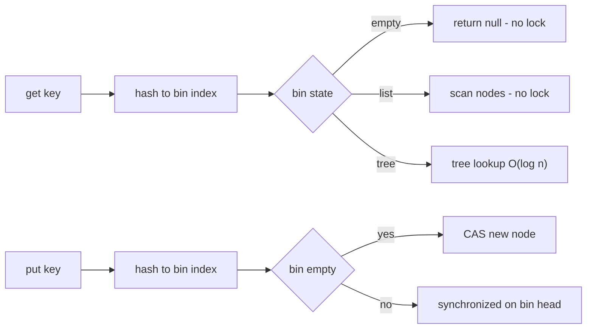
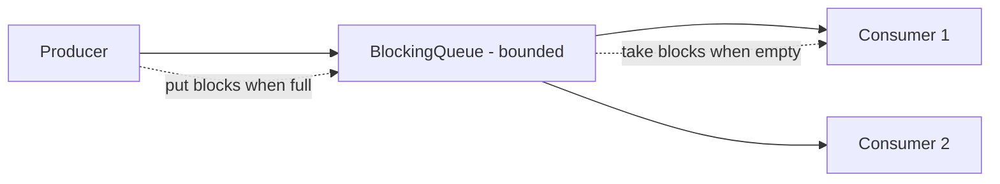

Concurrent collections replace hand-rolled locking with data structures designed for many threads. Knowing why `Collections.synchronizedList` and `Hashtable` fall short, and how `ConcurrentHashMap` actually works, is standard senior-interview territory.

## Why Synchronized Wrappers Are Not Enough

`Hashtable` and `Collections.synchronizedMap(...)` put a single lock around **every method**. That has two problems.

First, it **serializes everything** — even reads block each other, so the collection cannot scale across cores. Second, and more subtly, per-method locking does **not** make **compound actions** atomic. A "check then act" sequence still races:

```java
// RACE even with a synchronized map: two threads can both pass the check
if (!map.containsKey(k)) {   // thread A and B both see absent
    map.put(k, compute(k));  // both put — one overwrites the other
}
```

Each call is individually locked, but the gap **between** the calls is not, so both threads proceed. You would have to lock the whole sequence externally — which reintroduces the coarse locking you were trying to avoid. Concurrent collections solve this by offering **atomic compound operations** (`putIfAbsent`, `computeIfAbsent`) and fine-grained locking.

> [!KEY]
> Say this out loud: *"A synchronized wrapper makes each call atomic but not a sequence of calls, and it serializes everyone."* That single sentence justifies the entire `java.util.concurrent` collections package.

## ConcurrentHashMap Internals

`ConcurrentHashMap` (CHM) is the workhorse. The Java 8 rewrite replaced the old segment-based design with a **single bin array** (like `HashMap`) plus fine-grained concurrency:

- **Reads never lock.** `get` walks the bin using `volatile` reads; readers never block and see a consistent value.
- **Writes lock one bin.** On an empty bin, insertion uses a **CAS** with no lock at all. On a non-empty bin, the write **`synchronized`s on the bin's head node** — so contention is per-bin, not global.
- **Treeification.** A bin that grows past 8 entries (with table size ≥ 64) converts from a linked list to a **red-black tree**, bounding worst-case lookup at O(log n) instead of O(n).
- **Weakly consistent iterators.** Iterators reflect the state at some point during traversal, may or may not see concurrent updates, and **never throw `ConcurrentModificationException`**.
- **Approximate size.** `size()` and `mappingCount()` (prefer the latter, it returns `long`) are estimates because an exact count under concurrency would require a global lock.
- **No null keys or values** — a null return from `get` is unambiguously "absent."

### Atomic Compound Operations

CHM's real power is atomic methods that fix the check-then-act race:

```java
map.putIfAbsent(key, value);                 // insert only if absent, atomically
map.computeIfAbsent(key, k -> loadFrom(k));  // compute-and-cache, exactly once per key
map.merge(key, 1L, Long::sum);               // atomic counter increment
map.compute(key, (k, v) -> v == null ? 1 : v + 1);
```

> [!DANGER]
> Never call `computeIfAbsent`/`compute` on the **same map** from inside its own mapping function. The lambda runs while the bin is locked; a recursive update to the same key (or same bin) can **deadlock** or corrupt state. Java 9+ detects some self-recursion and throws, but not all cases — keep the mapping function side-effect free and self-contained.



## Sorted Concurrent Maps

When you need **ordering** (a sorted view, range queries, `firstKey`), `ConcurrentHashMap` won't do — use `ConcurrentSkipListMap` / `ConcurrentSkipListSet`. They are lock-free skip lists giving O(log n) operations with keys kept in sorted order, the concurrent analog of `TreeMap`/`TreeSet`.

## Copy-On-Write Collections

`CopyOnWriteArrayList` and `CopyOnWriteArraySet` make every **mutation copy the entire backing array**. Reads are lock-free and never see a partially updated array; writes are O(n) and serialized. This trade is perfect for **read-mostly, rarely-written** data — most classically a **listener/observer list** iterated on every event but changed only at startup or reconfiguration. Iterators operate on a stable snapshot and never throw `ConcurrentModificationException`, but they don't reflect later writes.

```java
private final List<Listener> listeners = new CopyOnWriteArrayList<>();
void addListener(Listener l) { listeners.add(l); }   // rare: copies the array
void fire(Event e) {
    for (Listener l : listeners) l.onEvent(e);       // hot path: lock-free, snapshot-stable
}
```

> [!WARNING]
> `CopyOnWriteArrayList` is a disaster for write-heavy use: every `add` copies the whole array, so N appends is O(N²) and floods the allocator. Use it only when reads vastly outnumber writes.

### Fail-Fast vs Weakly Consistent Iterators

Non-concurrent collections (`ArrayList`, `HashMap`) return **fail-fast** iterators: they track a modification count and throw `ConcurrentModificationException` the moment they detect the collection changed structurally during iteration — even from the **same** thread (removing while iterating with a for-each is the classic trigger). It is a best-effort bug detector, not a guarantee, and you must never depend on it firing.

Concurrent collections return **weakly consistent** iterators instead. They traverse without locking, tolerate concurrent modification, never throw `ConcurrentModificationException`, and reflect some — not necessarily all — updates made during iteration. `CopyOnWriteArrayList` goes further: its iterator is a **snapshot** of the array taken at creation, so it sees no later writes at all but is perfectly stable.

The practical rule: to mutate a plain collection while looping, use the iterator's own `remove()` or collect changes and apply them afterward; with a concurrent collection you just mutate freely and accept weak consistency.

## The BlockingQueue Family

`BlockingQueue` is the backbone of producer-consumer designs, offering four flavors of each operation:

| Operation | Throws | Special value | Blocks | Times out |
|---|---|---|---|---|
| Insert | `add` | `offer` | `put` | `offer(e, t, u)` |
| Remove | `remove` | `poll` | `take` | `poll(t, u)` |

Choosing the implementation:

| Queue | Bounded | Notes |
|---|---|---|
| `ArrayBlockingQueue` | ✅ fixed | Array-backed, single lock, optional fairness |
| `LinkedBlockingQueue` | optional | Separate put/take locks — higher throughput; unbounded by default |
| `SynchronousQueue` | 0 capacity | Each `put` waits for a `take` — a direct hand-off |
| `PriorityBlockingQueue` | unbounded | Orders by comparator; not FIFO |
| `DelayQueue` | unbounded | Elements become available only after their delay |
| `LinkedTransferQueue` | unbounded | `transfer` waits until an element is received |

**Bounded queues are the backpressure mechanism**: when full, `put` blocks the producer, naturally throttling it to the consumer's rate instead of piling work into memory. That is why an unbounded queue in a thread pool is dangerous — nothing pushes back.

```java
BlockingQueue<Task> q = new ArrayBlockingQueue<>(1000);
// Producer: put() blocks when full -> backpressure
q.put(task);
// Consumer: take() blocks when empty
Task t = q.take();
```

## Non-Blocking Queue

`ConcurrentLinkedQueue` is a **lock-free, unbounded** FIFO queue (Michael-Scott algorithm) for high-throughput hand-off where you don't need blocking semantics. It never blocks — `poll` returns `null` when empty — so you use it when producers and consumers are always both busy and you want to avoid lock overhead.

## Atomic Variables and Adders

For shared counters, skip the collection entirely: `AtomicInteger`/`AtomicLong` for low contention, and `LongAdder`/`LongAccumulator` for high-contention counters that are written far more than read (they stripe across cells and sum on demand). `LongAccumulator` generalizes `LongAdder` to any associative function (max, min, product), not just addition. A `ConcurrentHashMap<K, LongAdder>` is a common high-throughput per-key frequency counter, since the adder value can be mutated in place without replacing the map entry on every increment.

## Producer-Consumer with a Poison Pill

A `BlockingQueue` plus a **poison pill** (a sentinel that means "stop") is the clean shutdown idiom — no interruption flags, no extra signalling:

```java
static final Task POISON = new Task();

void producer(BlockingQueue<Task> q) throws InterruptedException {
    for (Task t : work) q.put(t);
    q.put(POISON);                     // one pill per consumer
}

void consumer(BlockingQueue<Task> q) throws InterruptedException {
    while (true) {
        Task t = q.take();
        if (t == POISON) { q.put(POISON); break; } // re-insert so siblings also stop
        process(t);
    }
}
```



## Sequential to Concurrent — The Replacement Table

The most useful cheat you can memorize: for every single-threaded collection, name the concurrent drop-in.

| Sequential type | Concurrent replacement |
|---|---|
| `HashMap` | `ConcurrentHashMap` |
| `TreeMap` | `ConcurrentSkipListMap` |
| `HashSet` | `ConcurrentHashMap.newKeySet()` |
| `TreeSet` | `ConcurrentSkipListSet` |
| `ArrayList` (read-mostly) | `CopyOnWriteArrayList` |
| `ArrayDeque` as a queue | `ConcurrentLinkedQueue` / `ArrayBlockingQueue` |
| `int`/`long` counter | `AtomicInteger` / `LongAdder` |
| `PriorityQueue` | `PriorityBlockingQueue` |

## Cheat sheet

- `Hashtable`/`synchronizedMap` serialize all access and don't make compound actions atomic.
- Use `putIfAbsent`/`computeIfAbsent`/`merge` for atomic check-then-act.
- CHM (Java 8+): lock-free reads, CAS on empty bins, `synchronized` on bin head, treeify past 8.
- CHM iterators are weakly consistent and never throw `ConcurrentModificationException`; `size()` is approximate.
- Don't recursively update the same CHM inside `computeIfAbsent`.
- `ConcurrentSkipListMap`/`Set` are the sorted concurrent option.
- `CopyOnWriteArrayList` is for read-mostly listener lists; writes are O(n).
- `BlockingQueue`: `put`/`take` block, `offer`/`poll` return/ time out, `add`/`remove` throw.
- Bounded queues provide backpressure; `ConcurrentLinkedQueue` is lock-free and unbounded.
- Use a poison pill on a `BlockingQueue` for clean consumer shutdown.

## Common mistakes

| Mistake | Fix |
|---|---|
| `if (!map.containsKey) map.put(...)` on a synchronized map | Use `putIfAbsent` or `computeIfAbsent` |
| Using `Hashtable`/`synchronizedMap` for scalability | Use `ConcurrentHashMap` |
| Expecting `size()` on CHM to be exact | Treat it as an estimate; use `mappingCount()` |
| Recursive `computeIfAbsent` on the same map | Keep the mapping function self-contained |
| `CopyOnWriteArrayList` for write-heavy data | Use a concurrent queue or a locked list |
| Putting nulls into a `ConcurrentHashMap` | CHM forbids null keys/values; redesign |
| Unbounded queue in a producer-consumer | Use a bounded queue for backpressure |
| Iterating a CHM and expecting a point-in-time snapshot | Accept weak consistency or copy first |

## Summary

Synchronized wrappers lock every call and still leave compound actions racy, which is why the concurrent collections exist. `ConcurrentHashMap` gives lock-free reads and per-bin write locking with atomic `computeIfAbsent`/`merge` for safe check-then-act, `ConcurrentSkipListMap` adds ordering, and `CopyOnWriteArrayList` handles read-mostly listener lists. Producer-consumer pipelines are built on a `BlockingQueue`, whose bounded variants provide the backpressure that keeps memory in check, with a poison pill for clean shutdown. Memorize the sequential-to-concurrent replacement table and the four operation flavors — throwing, special-value, blocking, and timed — because interviewers ask you to choose and justify a type on the spot.

## Top Interview Questions

### Q1. Why isn't Collections.synchronizedMap or Hashtable good enough for concurrent use?

Both wrap every method in a single lock, which causes two problems. Performance: all access — including reads — serializes on one lock, so the map cannot scale across cores; it is effectively single-threaded under contention. Correctness: per-method locking makes each individual call atomic but does not make a **sequence** of calls atomic, so a check-then-act like `if (!map.containsKey(k)) map.put(k, v)` still races — two threads can both see the key absent and both put. To make the sequence safe you'd have to hold an external lock around it, which serializes everything again. `ConcurrentHashMap` solves both: fine-grained per-bin locking for scalability, and atomic compound methods like `putIfAbsent` and `computeIfAbsent` so you never need the check-then-act pattern in the first place.

### Q2. How does ConcurrentHashMap work internally since Java 8?

The Java 8 rewrite dropped the old fixed 16-segment design for a single bin array like `HashMap`, with fine-grained concurrency per bin. Reads (`get`) take no lock, using volatile reads to walk the bin. Writes lock only the affected bin: inserting into an empty bin uses a lock-free CAS, while a non-empty bin is updated under `synchronized` on the bin's head node, so contention is limited to keys that hash to the same bin. When a bin exceeds 8 nodes and the table is at least 64 in size, it treeifies into a red-black tree to bound lookups at O(log n). Iterators are weakly consistent and never throw `ConcurrentModificationException`, and `size()`/`mappingCount()` are approximate because an exact count would need global coordination. Null keys and values are disallowed.

### Q3. What does "weakly consistent iterator" mean?

A weakly consistent iterator traverses the collection as it existed at some point during the iteration and may or may not reflect modifications made after the iterator was created — but it is guaranteed **never** to throw `ConcurrentModificationException` and never to produce a corrupted result. This contrasts with the **fail-fast** iterators of `ArrayList`/`HashMap`, which detect concurrent structural modification via a mod-count and throw immediately. Weak consistency is the deliberate trade concurrent collections make: you give up a strict point-in-time snapshot so that iteration doesn't require locking the whole structure, allowing readers and writers to proceed simultaneously. In practice it means you can iterate a `ConcurrentHashMap` while other threads mutate it, but you shouldn't assume you saw exactly the set of entries present at any single instant.

### Q4. Why is size() approximate on a ConcurrentHashMap, and what should you use?

Because maintaining an always-exact size under high concurrency would require a single shared counter updated on every put and remove — which would become a contention bottleneck and serialize writes, defeating the map's design. Instead, CHM maintains the count across striped counter cells (similar to `LongAdder`) that are summed on demand, so a `size()` call returns a value that is correct at some instant but may be stale by the time you read it if other threads are mutating concurrently. Prefer `mappingCount()`, which returns a `long` and so doesn't overflow for maps larger than `Integer.MAX_VALUE`. The practical guidance: treat the size as an estimate for monitoring or heuristics, and never rely on it for exact control flow in concurrent code.

### Q5. What is the deadlock risk with computeIfAbsent?

The mapping function passed to `computeIfAbsent` (or `compute`/`merge`) runs **while the bin is locked**. If that function tries to update the **same map** — especially the same key or a key in the same bin — it attempts to re-enter a lock it already holds in a way the structure doesn't support, which can deadlock or corrupt the map. A common real bug is a cache where loading one key's value recursively triggers loading another key in the same map from inside the lambda. Java 9+ added detection that throws `IllegalStateException` for direct same-key recursion, but it doesn't catch every indirect case. The rule is to keep the mapping function pure and self-contained: compute the value from inputs only, and never call back into the same `ConcurrentHashMap`.

### Q6. When would you use CopyOnWriteArrayList?

Use it for collections that are **read very often and written very rarely**, where you also want lock-free, snapshot-consistent iteration. The classic case is an observer/listener registry: it's iterated on every event (potentially thousands of times a second) but modified only at startup or during occasional reconfiguration. Because every mutation copies the entire backing array, reads never need a lock and iterators see a stable snapshot that never throws `ConcurrentModificationException`. The cost is that each write is O(n) and allocates a fresh array, so it is terrible for write-heavy workloads — appending N elements is O(N²). If writes are frequent, prefer a concurrent queue, a `ConcurrentHashMap.newKeySet()`, or an explicitly locked list. So: read-mostly, small, rarely-changed lists only.

### Q7. Compare the main BlockingQueue implementations.

`ArrayBlockingQueue` is bounded and array-backed with a single lock and optional fairness — predictable and memory-stable. `LinkedBlockingQueue` uses separate put and take locks so producers and consumers contend less, giving higher throughput, but is unbounded by default (a memory risk unless you set a capacity). `SynchronousQueue` has zero capacity: each `put` blocks until a `take` accepts it, a direct hand-off used by `newCachedThreadPool`. `PriorityBlockingQueue` orders elements by a comparator instead of FIFO and is unbounded. `DelayQueue` releases elements only after each element's delay expires, ideal for scheduled tasks and retries. `LinkedTransferQueue` adds `transfer`, where the producer blocks until a consumer actually receives the element. The choice hinges on bounded-vs-unbounded (backpressure), ordering needs, and whether you want direct hand-off or buffering.

### Q8. How do bounded queues provide backpressure?

A bounded `BlockingQueue` has a fixed capacity, and its `put` operation **blocks the producer when the queue is full** until a consumer removes an element. That blocking is the backpressure: a producer that outpaces consumers is automatically slowed to the consumers' throughput instead of accumulating unbounded work in memory. This keeps the system stable under overload — latency rises but memory stays bounded and the process doesn't OOM. An unbounded queue removes this safety valve: producers never block, so a burst or a slow consumer lets the queue grow until the heap is exhausted. This is exactly why constructing a `ThreadPoolExecutor` with a bounded queue (plus a rejection policy like `CallerRunsPolicy`) is the recommended pattern for server workloads — the bound is where you decide how the system behaves under stress.

### Q9. How would you implement a producer-consumer with clean shutdown?

Put a bounded `BlockingQueue` between producers and consumers: producers `put` tasks (blocking under backpressure), consumers `take` and process in a loop. For shutdown, use a **poison pill** — a unique sentinel object that means "stop." The producer enqueues one pill per consumer after the real work; each consumer, on taking the pill, re-inserts it (so sibling consumers also see it) and exits its loop. This drains all real work first and shuts every consumer down deterministically without relying on interrupt flags or checking a separate volatile boolean. It's clean because the stop signal travels through the same channel as the data, so there's no ordering ambiguity about work still in flight. Alternatively you interrupt the consumer threads and handle `InterruptedException`, but the poison pill guarantees queued work finishes first.

### Q10. What is ConcurrentLinkedQueue and when is it the right choice?

`ConcurrentLinkedQueue` is an unbounded, **lock-free** FIFO queue based on the Michael-Scott non-blocking algorithm, using CAS rather than locks for both enqueue and dequeue. It's the right choice when you need a high-throughput, thread-safe queue but **don't** need blocking semantics — that is, when consumers can poll and simply get `null` if the queue is momentarily empty, rather than needing to wait. Because it never blocks, it avoids lock and parking overhead and scales well under contention when producers and consumers are both consistently active. The trade-offs: it's unbounded (no backpressure, so watch memory), its `size()` is O(n) and only approximate, and if consumers would otherwise busy-wait polling an empty queue, a `BlockingQueue` with `take()` is more efficient. Use it for fast hand-off; use a `BlockingQueue` when you need blocking or bounding.

### Q11. Your service uses a ConcurrentHashMap as a cache and you see the same value computed twice under load. Why, and how do you fix it?

Almost certainly the code uses check-then-act — `if (map.get(k) == null) map.put(k, compute(k))` — which is not atomic even on a `ConcurrentHashMap`: two threads can both see `null` and both run the expensive `compute`. The fix is `computeIfAbsent(k, this::compute)`, which guarantees the mapping function runs **at most once per absent key**, with other threads for the same key blocking briefly until the value is present. That both eliminates the duplicate computation and removes the race. If `compute` is very expensive and you want to avoid holding the bin lock during it, a common pattern is to store a `Future`/`CompletableFuture` in the map via `computeIfAbsent` so the lock is held only long enough to install the future, and callers await the result — this is how memoizing caches avoid both duplication and long lock holds.

### Q12. How do you build a high-throughput concurrent counter, and why not just use AtomicLong or a synchronized map?

For a single counter under heavy contention, `AtomicLong` funnels every increment through a CAS on one memory location; under many threads those CAS operations repeatedly fail and retry while the cache line bounces between cores, capping throughput. `LongAdder` fixes this by spreading increments across multiple internal cells so threads rarely collide, summing them only when you read — dramatically faster for write-heavy counters that are read infrequently, at the cost of a more expensive, slightly-less-instantaneous read. For **per-key** counters (say, request counts per endpoint), a `ConcurrentHashMap<K, LongAdder>` populated via `computeIfAbsent(k, x -> new LongAdder())` and incremented with `.increment()` gives lock-free per-key counting that scales far better than a `synchronized` map with boxed `Long`s, which would serialize every update and churn objects. Choose `AtomicLong` for low contention or when reads are as frequent as writes, and `LongAdder` when writes dominate.
