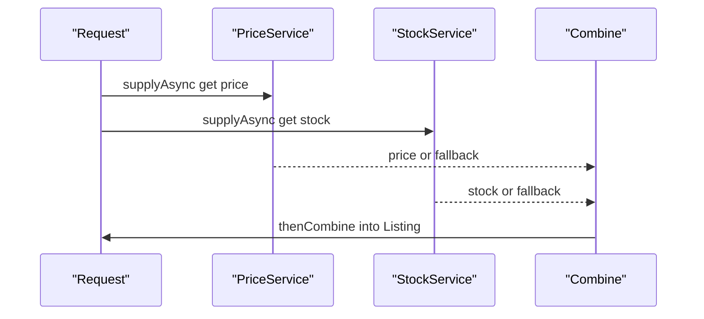

`CompletableFuture` turns callbacks and blocking `Future.get()` into a composable pipeline. It is how you orchestrate parallel service calls without a tangle of threads — and interviewers probe whether you understand its executor model and error semantics.

## The Limits of Future

A plain `Future` is a write-once result handle with three fatal limitations: `get()` **blocks** the calling thread, you **cannot compose** two futures or chain a transformation, and there is **no callback** for completion. So you end up dedicating a blocked thread to every outstanding call, which does not scale, and you cannot express "when A and B finish, do C" without manual coordination.

`CompletableFuture<T>` (Java 8) fixes all three: it is a `Future` you can **complete manually**, **chain** with transformations, **combine** with other futures, and attach **callbacks** to — all without blocking a thread until you actually need the value.

## Creating a CompletableFuture

```java
CompletableFuture<String> a = CompletableFuture.supplyAsync(() -> fetch(), pool); // runs on pool, returns a value
CompletableFuture<Void>   b = CompletableFuture.runAsync(() -> log(), pool);      // runs on pool, no result
CompletableFuture<String> c = CompletableFuture.completedFuture("cached");        // already-complete

CompletableFuture<String> d = new CompletableFuture<>();
d.complete("value");                          // complete manually from anywhere
d.completeExceptionally(new TimeoutException()); // or fail it
```

`supplyAsync`/`runAsync` without an explicit executor run on the **`ForkJoinPool.commonPool`** — the trap covered below. Manual completion (`complete`) is how you bridge a callback-based API (say, an async HTTP client) into the `CompletableFuture` world.

## The Composition API

The chaining methods are the heart of it. Two axes: what the callback receives/returns, and which executor runs it.

| Method | Input | Returns | Use for |
|---|---|---|---|
| `thenApply` | value | value | Transform the result (map) |
| `thenCompose` | value | `CompletableFuture` | Chain another async call (flatMap) |
| `thenCombine` | two values | value | Combine two independent futures |
| `thenAccept` | value | `Void` | Consume the result, no return |
| `thenRun` | nothing | `Void` | Run an action, ignore the result |

The critical distinction is **`thenApply` vs `thenCompose`**. Use `thenApply` when your function returns a plain value; use `thenCompose` when it returns **another `CompletableFuture`**, to avoid a nested `CompletableFuture<CompletableFuture<T>>`.

```java
// thenApply: function returns a value -> CompletableFuture<Integer>
cf.thenApply(user -> user.age());

// thenCompose: function returns a future -> flattened to CompletableFuture<Order>
cf.thenCompose(user -> loadOrdersAsync(user.id())); // NOT thenApply, or you get a nested future
```

Each method has an **`...Async`** variant. `thenApply` runs the callback on **whatever thread completed the previous stage**; `thenApplyAsync` runs it on the common pool (or an executor you pass). Pass an executor to control exactly where continuations run:

```java
cf.thenApplyAsync(this::transform, cpuPool)   // CPU work on a CPU pool
  .thenAcceptAsync(this::write, ioPool);       // I/O on an I/O pool
```

## allOf and anyOf

`allOf(cf1, cf2, ...)` completes when **all** complete; `anyOf(...)` completes when the **first** completes. `allOf` returns `CompletableFuture<Void>`, so the idiom to collect results is to `join` each future after it resolves:

```java
List<CompletableFuture<Quote>> futures = suppliers.stream()
    .map(s -> CompletableFuture.supplyAsync(() -> s.quote(req), pool))
    .toList();

CompletableFuture<List<Quote>> all = CompletableFuture
    .allOf(futures.toArray(CompletableFuture[]::new))
    .thenApply(v -> futures.stream()
        .map(CompletableFuture::join)   // safe: allOf guarantees each is already complete
        .toList());
```

## Racing and Cancellation

`applyToEither(other, fn)` and `acceptEither(other, fn)` act on whichever of **two** futures finishes first — a lightweight race useful for hedged requests to redundant backends where you want the fastest answer; `anyOf` generalizes it to many.

Cancellation is a common trap. `CompletableFuture.cancel(true)` completes the future with a `CancellationException`, but it does **not** interrupt the thread already running the underlying task — unlike `Future.cancel(true)` on a plain `FutureTask`. The computation may keep running and burning resources even though nobody awaits its result. So read `cancel` as "stop waiting," not "stop working." If you need real interruption, keep the executor's own `Future` and cancel that, or check a cancellation flag inside the task.

Cancellation (like any failure) propagates **forward**: downstream stages of a cancelled future complete exceptionally. It does **not** propagate **backward** — cancelling a derived stage does not cancel the upstream stages feeding it — which is one more reason structured concurrency (Java 21) is a cleaner model for cancelling an entire fan-out at once.

### Which Thread Runs Your Callback

A non-`Async` callback like `thenApply` runs on **whichever thread completed the previous stage** — a pool worker, or, if the stage was already complete when you attached the callback, possibly the **calling thread** itself. That is fine for cheap transformations but risky if the callback blocks or does heavy work, because it may run somewhere you didn't intend (including a latency-sensitive caller thread). When where-it-runs matters, use the `...Async` form with an explicit executor so the continuation always lands on a known pool. This is a frequent source of "why is my callback on the wrong thread" confusion.

## Error Handling

Exceptions propagate down the chain, wrapped in a **`CompletionException`**. Three handlers, each different:

| Method | Sees | Can recover | Runs on |
|---|---|---|---|
| `exceptionally` | throwable only | ✅ supplies a fallback value | only on failure |
| `handle` | result **and** throwable | ✅ transforms either outcome | always |
| `whenComplete` | result **and** throwable | ❌ side-effect only, re-raises | always |

```java
cf.thenApply(this::risky)
  .exceptionally(ex -> fallback())            // recover with a default on failure
  .whenComplete((result, ex) -> log(result, ex)); // observe both, cannot change outcome
```

`whenComplete` is for logging/metrics — it cannot swallow the exception, which continues downstream. `handle` can turn a failure into a value. Note the wrapping: the throwable you receive is usually a `CompletionException` whose `getCause()` is your real exception, so unwrap before inspecting the type.

> [!WARNING]
> `whenComplete` does **not** consume the exception — it observes and re-raises it. If you expect it to recover, use `handle` or `exceptionally`. Confusing the two is a common source of "my fallback never ran" bugs.

## Timeouts

Java 9 added timeout support so a hung dependency can't stall a stage forever:

```java
cf.orTimeout(2, TimeUnit.SECONDS)                  // fail with TimeoutException after 2s
  .completeOnTimeout(DEFAULT, 2, TimeUnit.SECONDS); // or complete with a default instead
```

## Why You Must Pass Your Own Executor

This is the single most important production point. `supplyAsync(fn)` and every `...Async` method **without an executor** run on `ForkJoinPool.commonPool()`, which is sized to **cores − 1** and is **shared JVM-wide** with parallel streams and every other default async task.

If you run a **blocking** call (a DB query, an HTTP request) on the common pool, you park those few threads. Enough blocked tasks exhaust the pool, and then **every parallel stream and every default `CompletableFuture` in the whole JVM stalls** — an outage that looks unrelated to your code.

```java
ExecutorService io = Executors.newFixedThreadPool(64, namedFactory("io"));
CompletableFuture.supplyAsync(this::blockingHttpCall, io); // always pass a dedicated executor
```

> [!DANGER]
> Never run blocking I/O on `ForkJoinPool.commonPool` (the default). Pass a dedicated, right-sized executor to every `supplyAsync` and `...Async` call. This is the most common `CompletableFuture` production incident.

## join vs get

`get()` throws **checked** `InterruptedException` and `ExecutionException`; `join()` throws the **unchecked** `CompletionException`. Inside lambdas and streams (like the `allOf` collector above), `join()` is far more convenient because it doesn't force checked-exception handling. Both block, so call them only at the edge where you truly need the value.

## Fan-Out / Fan-In

The bread-and-butter pattern: call several services in parallel, each with its own timeout and fallback, then combine.

```java
CompletableFuture<Price>   price = CompletableFuture
    .supplyAsync(() -> priceService.get(id), io)
    .orTimeout(500, TimeUnit.MILLISECONDS)
    .exceptionally(ex -> Price.UNKNOWN);         // per-call fallback

CompletableFuture<Stock>   stock = CompletableFuture
    .supplyAsync(() -> stockService.get(id), io)
    .orTimeout(500, TimeUnit.MILLISECONDS)
    .exceptionally(ex -> Stock.UNKNOWN);

CompletableFuture<Listing> listing = price.thenCombine(stock, Listing::new); // fan-in
```



## Propagating Context Across the Async Boundary

`ThreadLocal`-based context — an SLF4J `MDC` request id, a security principal, a trace span — **does not follow** work onto another thread. When a continuation runs on a pool thread, the `MDC` is empty, so logs lose their correlation id. Fix it by capturing the context at submission and restoring it inside the task, or by wrapping the executor:

```java
Map<String, String> ctx = MDC.getCopyOfContextMap();       // capture on caller thread
CompletableFuture.supplyAsync(() -> {
    MDC.setContextMap(ctx == null ? Map.of() : ctx);        // restore on worker thread
    try { return handle(req); } finally { MDC.clear(); }
}, io);
```

## When Something Else Is Better

`CompletableFuture` is great for bounded fan-out/fan-in. But for **streaming** data, complex operators, or backpressure across many stages, a reactive library like **Project Reactor** (`Mono`/`Flux`) is a better fit. And in **Java 21**, **virtual threads** often make plain blocking code the simplest correct answer — you can write straight-line `service.call()` on a virtual thread and delete the `CompletableFuture` chain entirely, because blocking a virtual thread is cheap.

## Cheat sheet

- `Future` blocks and can't compose; `CompletableFuture` chains, combines, and takes callbacks.
- `thenApply` maps a value; `thenCompose` flat-maps a future (avoids a nested future).
- `thenCombine` merges two independent futures; `thenAccept`/`thenRun` consume/finish.
- `...Async` variants and an explicit executor control where continuations run.
- `allOf(...).thenApply(v -> futures.stream().map(join).toList())` collects results.
- `exceptionally` recovers on failure; `handle` sees both outcomes; `whenComplete` only observes.
- Exceptions arrive wrapped in `CompletionException` — unwrap with `getCause()`.
- `orTimeout` fails on timeout; `completeOnTimeout` supplies a default.
- Always pass a dedicated executor; the default common pool is shared and tiny.
- `join()` is unchecked and lambda-friendly; `get()` throws checked exceptions.

## Common mistakes

| Mistake | Fix |
|---|---|
| Blocking I/O on the default common pool | Pass a dedicated, sized executor |
| `thenApply` on a function returning a future | Use `thenCompose` to flatten |
| Expecting `whenComplete` to recover | Use `handle` or `exceptionally` |
| Checking exception type without unwrapping | Inspect `CompletionException.getCause()` |
| Chaining with no timeout on a remote call | Add `orTimeout`/`completeOnTimeout` |
| Losing MDC/trace context across stages | Capture and restore context in the task |
| `get()` inside a stream lambda | Use `join()` to avoid checked exceptions |
| No per-call fallback in a fan-out | `exceptionally` on each future |

## Summary

`CompletableFuture` replaces blocking `Future.get()` and callback spaghetti with a composable pipeline: `thenApply`/`thenCompose` transform, `thenCombine`/`allOf`/`anyOf` fan in, and `exceptionally`/`handle`/`whenComplete` handle failure — with exceptions wrapped in `CompletionException`. The production-critical rule is to always pass your own executor, because the default `ForkJoinPool.commonPool` is small and shared, so blocking on it can freeze parallel streams across the whole JVM. Add timeouts to every remote stage, propagate `MDC`/trace context across thread boundaries explicitly, and remember that in Java 21 virtual threads may let you write simple blocking code instead of a chain at all.

## Top Interview Questions

### Q1. What does CompletableFuture add over a plain Future?

A plain `Future` only lets you poll `isDone()` or call `get()`, which **blocks** the calling thread; you cannot chain a transformation, combine two futures, or register a completion callback, and you cannot complete it yourself. `CompletableFuture` implements `Future` but adds three things: **composition** (`thenApply`, `thenCompose`, `thenCombine`) so you build a pipeline that runs when results arrive without blocking a thread; **callbacks** (`thenAccept`, `whenComplete`) that fire on completion; and **manual completion** (`complete`, `completeExceptionally`) so you can bridge callback-based APIs into the future world. It also has built-in error handling (`exceptionally`, `handle`) and timeouts (`orTimeout`). The net effect is you orchestrate many asynchronous operations without dedicating a blocked thread to each, which is what makes it scale.

### Q2. Explain the difference between thenApply and thenCompose.

Both chain work after a future completes, but they differ in what the function returns. `thenApply` takes a function returning a **plain value** and produces a `CompletableFuture` of that value — it's a `map`. `thenCompose` takes a function returning **another `CompletableFuture`** and flattens it — it's a `flatMap`. If your callback itself starts an async operation (e.g., `loadOrdersAsync(userId)` returns a `CompletableFuture<Order>`) and you use `thenApply`, you get a nested `CompletableFuture<CompletableFuture<Order>>`, which is awkward and forces a double-unwrap. `thenCompose` collapses that into a single `CompletableFuture<Order>`. The rule of thumb: if the function returns a future, use `thenCompose`; if it returns a value, use `thenApply`. This mirrors `map` vs `flatMap` in streams and `Optional`.

### Q3. How do exceptionally, handle, and whenComplete differ?

All three deal with completion, but with different powers. `exceptionally(fn)` runs **only on failure**, receives the throwable, and returns a **fallback value** to recover the pipeline. `handle(fn)` runs on **both** success and failure, receiving `(result, throwable)` — exactly one is non-null — and returns a new value, so it can transform a success or convert a failure into a value. `whenComplete(fn)` also runs on both outcomes and sees `(result, throwable)` but returns nothing and **cannot change the outcome**: it's for side effects like logging or metrics, and any exception continues to propagate downstream (it even re-raises the original). So use `exceptionally`/`handle` to recover, and `whenComplete` to observe. The common bug is expecting `whenComplete` to swallow an exception — it does not.

### Q4. Why must you pass your own executor rather than using the default?

Because every `supplyAsync`/`...Async` call without an explicit executor runs on `ForkJoinPool.commonPool()`, which is sized to roughly `availableProcessors() - 1` threads and is **shared across the entire JVM** — parallel streams, other libraries, and all default async stages use it. If you run **blocking** work (a network or database call) on it, those few threads park while blocked, and it takes only a handful of concurrent blocking tasks to exhaust the pool. Once exhausted, unrelated parallel streams and `CompletableFuture` chains everywhere in the process stall, producing a mysterious, application-wide slowdown. By passing a dedicated, appropriately sized `ExecutorService` for blocking work, you isolate it, size it to the I/O concurrency you need, and keep the common pool free for short CPU-bound tasks. This is the number-one `CompletableFuture` production pitfall.

### Q5. How do you run several service calls in parallel and combine their results?

Launch each call with `supplyAsync(..., executor)` so they start concurrently, then combine. For two, `thenCombine` merges their results with a bi-function. For many, collect them into a list of futures and use `allOf(...)`, which completes when all do; since `allOf` returns `Void`, follow it with `thenApply(v -> futures.stream().map(CompletableFuture::join).toList())` to gather the individual results — `join` is safe there because `allOf` guarantees each is already complete. I give each call its own `orTimeout` and an `exceptionally` fallback so one slow or failing dependency degrades gracefully instead of failing the whole aggregate. This fan-out/fan-in pattern turns N sequential calls taking the sum of their latencies into a parallel call taking roughly the slowest one.

### Q6. What is the difference between join and get?

Both block until the future completes and return its value, but they differ in exception handling. `get()` is declared to throw the **checked** exceptions `InterruptedException` and `ExecutionException`, so callers must catch or declare them — awkward inside lambdas and stream pipelines. `join()` throws the **unchecked** `CompletionException` (and `CancellationException`), so it needs no try/catch boilerplate and composes cleanly inside `map`/`stream` operations, which is why the `allOf` collection idiom uses `join`. In both cases the underlying cause is wrapped (`ExecutionException.getCause()` or `CompletionException.getCause()`). Functionally they're equivalent blocking calls; you choose `join` for lambda-friendliness and `get` when you specifically want to handle the checked exceptions or use the timed `get(timeout)` overload. Either way, call them only at the boundary where you actually need the value, not mid-pipeline.

### Q7. How does exception wrapping work in a CompletableFuture chain?

When a stage throws, the future completes exceptionally, and the throwable that flows to downstream handlers and to `join()`/`get()` is typically a **`CompletionException`** (for `join` and internal propagation) or an **`ExecutionException`** (for `get`) that **wraps** your original exception as its cause. So if your code throws `IllegalStateException`, a downstream `exceptionally(ex -> ...)` receives a `CompletionException` whose `getCause()` is the `IllegalStateException`. This bites people who write `if (ex instanceof MyException)` and find it never matches, because `ex` is the wrapper. The fix is to unwrap: inspect `ex.getCause()` (looping if necessary, since wrapping can nest) before checking the type. Within a single chain, one thrown exception short-circuits all subsequent transformation stages and jumps to the first error handler, similar to how an exception skips to a catch block.

### Q8. How do you add timeouts to asynchronous operations?

Since Java 9, `CompletableFuture` has two built-in timeout methods. `orTimeout(duration, unit)` completes the future **exceptionally** with a `TimeoutException` if it hasn't completed by the deadline, which you then handle with `exceptionally`/`handle`. `completeOnTimeout(value, duration, unit)` instead completes it **normally** with a supplied default value on timeout — useful when a sensible fallback exists. Before Java 9 you'd combine the future with a scheduled timeout future via `acceptEither` or use `get(timeout, unit)` (which only times out the caller's wait, not the underlying task). In a fan-out I attach `orTimeout` to each call so a single hung dependency can't stall the aggregate, usually followed by an `exceptionally` that returns a degraded result. Note that the timeout cancels the future's completion path but doesn't necessarily stop the underlying blocking work, so you still want real socket/read timeouts on the client.

### Q9. Your async logs lost their correlation ID after moving work to a CompletableFuture. Why, and how do you fix it?

Correlation IDs are usually stored in SLF4J's `MDC`, which is backed by a `ThreadLocal`. When a stage runs on a different thread — a `supplyAsync` worker or an `...Async` continuation on the pool — that thread has its own empty `ThreadLocal`, so the `MDC` is blank and logs on that thread lose the ID. The fix is to **propagate the context across the boundary explicitly**: capture `MDC.getCopyOfContextMap()` on the submitting thread, and inside the async task call `MDC.setContextMap(...)` at the start and `MDC.clear()` in a `finally`. To avoid doing this at every call site, wrap the `Executor` (or use a decorator like a `TaskDecorator` in Spring) that captures and restores context automatically for every submitted task. The same technique applies to security principals and tracing spans — any `ThreadLocal`-based context must be carried over manually because threads don't share it.

### Q10. When would you choose Project Reactor or virtual threads over CompletableFuture?

`CompletableFuture` is ideal for **bounded** fan-out/fan-in of a handful of async calls. Reach for **Project Reactor (`Mono`/`Flux`)** when you have **streams** of data, need rich operators (buffering, windowing, retry with backoff, rate limiting), or need **backpressure** propagated across many pipeline stages — things `CompletableFuture` doesn't model, since it represents a single eventual value. Reach for **virtual threads (Java 21)** when the async complexity exists only to avoid blocking platform threads: on a virtual thread, blocking is cheap, so you can write simple straight-line `a(); b(); c();` blocking code that reads like synchronous logic and delete the `CompletableFuture` chain and its executor-management burden entirely. The decision is: single value → `CompletableFuture`; stream with operators/backpressure → Reactor; "I only went async to save threads" → virtual threads.

### Q11. What happens to threads while a CompletableFuture chain is pending, and why does that matter for scalability?

When a stage is waiting on an async result, **no thread is blocked** on that chain — the continuation is registered as a callback and the pool threads are free to do other work; a thread is only used when a stage actually executes. This is the scalability advantage over `Future.get()`, where each pending result pins a blocked thread. It matters because it lets a small pool service thousands of in-flight operations, provided the operations themselves are **non-blocking** (async I/O clients). The catch is that if a stage does **blocking** work, it holds its pool thread for the whole duration, and you lose the benefit — which is exactly why blocking on the tiny common pool is catastrophic. So the model scales only when the actual work is asynchronous or you've isolated blocking work onto a dedicated, adequately sized executor.

### Q12. In a fan-out to three services, one is slow and occasionally fails. How do you keep the endpoint responsive?

I isolate each call so one dependency can't sink the request. Each service call is a separate `supplyAsync` on a dedicated I/O executor so they run in parallel, and I attach a per-call `orTimeout` (say 300–500 ms) so the slow service is bounded, plus an `exceptionally` that returns a **degraded fallback** (a cached value, a default, or an "unavailable" marker) so a failure or timeout becomes a usable result instead of an exception. Then I fan in with `thenCombine`/`allOf`, so the endpoint's latency is roughly the slowest **non-timed-out** call, not the sum, and it always returns something. I'd also add circuit breaking (e.g., Resilience4j) around the flaky service so repeated failures stop hitting it, and emit metrics on timeout/fallback rates so degradation is visible. The principle is graceful degradation: bound every dependency and always have a fallback.
