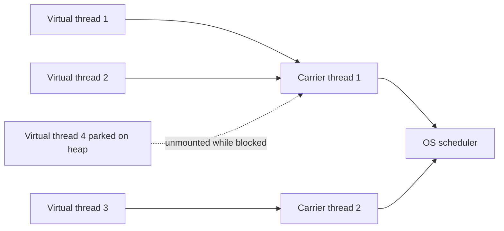

Virtual threads (Project Loom, JEP 444, final in **Java 21**) let you write simple blocking, thread-per-request code that scales to millions of concurrent tasks. Understanding how they work, where they pin, and what they don't fix is a hot senior-interview topic.

## The Problem They Solve

A platform thread maps 1:1 to an OS thread, costing **~1 MB of stack** and a kernel context switch to schedule. That caps a server at a few thousand concurrent **blocking** requests before memory and scheduling overhead dominate — long before the CPU or network is saturated.

The industry's workaround was **asynchronous, non-blocking** code (`CompletableFuture`, reactive streams, callbacks). It scales, but it pays the **"coloured function" tax**: async methods return `CompletableFuture`/`Mono` and can only be called from other async methods, so the async-ness spreads through the whole codebase, stack traces become useless, and debugging is painful. Loom's goal is to get the scalability of async with the simplicity of blocking code.

## What a Virtual Thread Is

A **virtual thread** is a `java.lang.Thread` scheduled by the **JVM**, not the OS. Many virtual threads run on a small pool of **carrier** platform threads (by default a `ForkJoinPool` sized to the core count):

- When a virtual thread hits a **blocking** call (I/O, `sleep`, a lock), the JVM **parks the continuation on the heap** and **unmounts** it from its carrier, freeing that carrier to run another virtual thread.
- When the blocking operation completes, the continuation is **remounted** on some carrier and resumes.

So a blocked virtual thread costs a few hundred bytes of heap, not a 1 MB OS stack, and blocking no longer wastes an OS thread. You can have **millions** of them.



## Thread-Per-Request Is Fine Again

The payoff: you can go back to **one thread per request**, blocking freely, and let the JVM handle the scaling. That means you can **delete `CompletableFuture` chains** and write straight-line code that reads like the business logic it implements.

```java
try (var executor = Executors.newVirtualThreadPerTaskExecutor()) {
    for (Request req : requests) {
        executor.submit(() -> {
            var user = userService.fetch(req.id());   // blocks — but only parks the vthread
            var orders = orderService.fetch(user);    // straight-line, no chaining
            return render(user, orders);
        });
    }
} // close() waits for all tasks
```

## Platform vs Virtual Threads

| Dimension | Platform thread | Virtual thread |
|---|---|---|
| Backing | 1:1 OS thread | JVM continuation on a carrier |
| Creation cost | microseconds + syscall | negligible, ~nanoseconds |
| Stack | ~1 MB reserved | small, grows on heap |
| Scheduler | OS | JVM (`ForkJoinPool`) |
| Practical count | thousands | millions |
| Pooling | pool them (expensive) | never pool (cheap, disposable) |
| `ThreadLocal` | fine | works but discouraged at scale |
| Best for | CPU-bound, long-lived | blocking I/O-bound tasks |

## Creating Virtual Threads

```java
Thread t = Thread.ofVirtual().start(() -> work());   // builder form, named/configured
Thread u = Thread.startVirtualThread(() -> work());   // shorthand

ExecutorService ex = Executors.newVirtualThreadPerTaskExecutor(); // one vthread per task
```

> [!KEY]
> **Never pool virtual threads.** Pooling exists to amortize the cost of creating platform threads — but virtual threads are almost free to create and are meant to be one-per-task and thrown away. `newVirtualThreadPerTaskExecutor()` creates a fresh virtual thread per task by design.

## Pinning — The Big Gotcha

A virtual thread normally unmounts when it blocks. It **cannot unmount — it is pinned — in two cases**:

1. It is inside a **`synchronized`** block or method when it blocks.
2. It is executing a **native frame** (a JNI call).

While pinned, the carrier platform thread is **stuck** and can't run other virtual threads. Enough simultaneous pins exhaust the carrier pool and throughput collapses — the very problem virtual threads were meant to solve.

The fix for `synchronized` pinning is to migrate hot, blocking `synchronized` sections to **`ReentrantLock`**, which is Loom-aware and lets the virtual thread unmount:

```java
// Before: blocks while pinned to its carrier
synchronized (lock) { blockingIo(); }

// After: ReentrantLock lets the virtual thread unmount while blocked
lock.lock();
try { blockingIo(); } finally { lock.unlock(); }
```

Diagnose pinning with `-Djdk.tracePinnedThreads=full`, which prints a stack trace whenever a virtual thread pins on a blocking operation.

> [!WARNING]
> In **JDK 24 (JEP 491)** the JVM was changed so that `synchronized` no longer pins in the common blocking cases, largely removing this problem. But on Java 21 LTS — what most shops run — `synchronized`-around-blocking pinning is real, so audit hot paths and prefer `ReentrantLock`. Native/JNI frames still pin on every version.

## Pools and Semaphores Change Role

With platform threads, the thread pool **was** your concurrency limiter — a 50-thread pool meant at most 50 concurrent downstream calls. With virtual threads you don't pool, so the pool no longer limits anything. If you still need to cap pressure on a fragile downstream (a database with 20 connections, a rate-limited API), you make that limit **explicit** with a `Semaphore` or a bounded queue:

```java
Semaphore db = new Semaphore(20); // cap concurrent DB calls regardless of vthread count
void query() throws InterruptedException {
    db.acquire();
    try { database.run(); } finally { db.release(); }
}
```

## ThreadLocal and Scoped Values

`ThreadLocal` still works on virtual threads, but with millions of them each carrying their own copies, the memory adds up and the mutable, unstructured model fits poorly. The replacement is **`ScopedValue`** (preview in Java 21), an **immutable**, bounded-lifetime binding shared efficiently across a call tree — no leaks, no `remove()`, cheaper at scale.

```java
static final ScopedValue<User> CURRENT = ScopedValue.newInstance();

ScopedValue.where(CURRENT, user).run(() -> {
    handle();               // CURRENT.get() is visible to everything called here, then unbound
});
```

## Structured Concurrency

**Structured concurrency** (`StructuredTaskScope`, preview in Java 21) treats a group of concurrent subtasks as **one unit** with a defined lifetime, so a failure or cancellation propagates correctly and you never leak a running task. It makes fan-out cancellation correct by construction:

```java
try (var scope = new StructuredTaskScope.ShutdownOnFailure()) {
    Subtask<User>  user  = scope.fork(() -> userService.fetch(id));   // child vthreads
    Subtask<Order> order = scope.fork(() -> orderService.fetch(id));
    scope.join();               // wait for both
    scope.throwIfFailed();      // if either failed, cancel the other and throw
    return new Page(user.get(), order.get());
}
```

`ShutdownOnFailure` cancels the siblings as soon as one fails (fail-fast fan-out); `ShutdownOnSuccess` returns the first success and cancels the rest (fastest-wins). Either way, all children are guaranteed finished when the block exits — no orphaned threads.

## Observability

Because there can be millions of them, virtual threads **do not appear in a normal `jstack`** dump by default — dumping millions of stacks would be unusable. Instead, take a thread dump that groups virtual threads with:

```
jcmd <pid> Thread.dump_to_file -format=json threads.json
```

This new-format dump includes virtual threads and, when using structured concurrency, shows their parent-child grouping — a big debuggability win over anonymous async callbacks.

## Spring Boot Switch

Spring Boot **3.2+** exposes a one-line switch to run request handling on virtual threads:

```properties
spring.threads.virtual.enabled=true
```

This makes Tomcat serve each request on a virtual thread, so your existing blocking controllers scale without a rewrite — one of the clearest real-world wins.

## Honest Limits

Virtual threads are not magic:

- **CPU-bound work gains nothing.** If tasks are compute-heavy, you're still limited by cores; virtual threads help only when threads spend time **blocked**. Use a normal pool sized to cores for CPU work.
- **Native/JNI frames still pin** on every JDK version.
- **They don't reduce total work or memory of live tasks** — a million in-flight requests still hold a million requests' worth of objects.
- **Throughput of blocking downstreams is still bounded** by those downstreams; you need semaphores/backpressure, which virtual threads don't provide for free.

### Tuning the Scheduler

The carrier pool defaults to a `ForkJoinPool` whose parallelism equals the core count; you can change it with `-Djdk.virtualThreadScheduler.parallelism`. In practice you rarely should, and raising it doesn't help when the bottleneck is a blocking downstream rather than CPU. The carrier count bounds how many virtual threads run **truly in parallel** at any instant, but not how many can **exist** or sit **parked** — those scale into the millions independently of the number of carriers.

## Cheat sheet

- Virtual threads are JVM-scheduled continuations mounted on a few carrier platform threads.
- Blocking parks the continuation on the heap and unmounts the carrier — cheap, millions possible.
- Thread-per-request blocking code is viable again; you can delete `CompletableFuture` chains.
- Create with `Thread.ofVirtual()`, `startVirtualThread`, or `newVirtualThreadPerTaskExecutor()`.
- Never pool virtual threads — one per task, disposable.
- Pinning: a `synchronized` block or native frame prevents unmounting; migrate hot ones to `ReentrantLock`.
- JDK 24 (JEP 491) largely removed `synchronized` pinning; Java 21 LTS still has it.
- The pool no longer limits concurrency — use a `Semaphore` or bounded queue for downstream backpressure.
- Prefer `ScopedValue` over `ThreadLocal`; use `StructuredTaskScope` for correct fan-out cancellation.
- Virtual threads need `jcmd Thread.dump_to_file`; they're not in default `jstack`.
- CPU-bound work and JNI frames gain nothing.

## Common mistakes

| Mistake | Fix |
|---|---|
| Pooling virtual threads | Use `newVirtualThreadPerTaskExecutor`, one per task |
| Blocking inside `synchronized` on a hot path | Switch to `ReentrantLock` to allow unmounting |
| Assuming CPU-bound work scales | Use a platform-thread pool sized to cores |
| Removing the pool but not the concurrency limit | Add a `Semaphore`/bounded queue for downstream |
| Heavy `ThreadLocal` use with millions of vthreads | Use `ScopedValue` (preview) |
| Orphaned subtasks on failure | Use `StructuredTaskScope` for scoped cancellation |
| Expecting `jstack` to show them | Use `jcmd Thread.dump_to_file -format=json` |
| Ignoring native/JNI pinning | Keep blocking JNI off hot virtual-thread paths |

## Summary

Virtual threads make thread-per-request blocking code scale to millions of concurrent tasks by scheduling lightweight continuations on a small carrier pool and parking them on the heap when they block — recovering async-level scalability without the coloured-function complexity. The main hazards are **pinning** (a `synchronized` block or native frame that prevents unmounting, largely fixed for `synchronized` in JDK 24 but real on Java 21 LTS) and the fact that the thread pool no longer limits concurrency, so you use a `Semaphore` or bounded queue for downstream backpressure. Pair them with `ScopedValue` and `StructuredTaskScope` for clean context and cancellation. Just remember they help only blocking, I/O-bound work — CPU-bound tasks and JNI frames gain nothing.

## Top Interview Questions

### Q1. What problem do virtual threads solve, and how do they differ from platform threads?

Platform threads map 1:1 to OS threads, each costing about 1 MB of stack and a kernel context switch, which caps a server at a few thousand concurrent **blocking** requests — well before CPU or network limits. The old workaround, asynchronous/reactive code, scales but spreads `CompletableFuture`/`Mono` return types through the whole codebase (the "coloured function" tax) and wrecks stack traces and debuggability. Virtual threads are `Thread`s scheduled by the **JVM** rather than the OS: many run on a small pool of carrier platform threads, and when one blocks, the JVM unmounts it and parks its continuation on the heap (a few hundred bytes) instead of holding an OS thread. This lets you run millions of them and write simple blocking, thread-per-request code that scales like async — the best of both models.

### Q2. What exactly happens when a virtual thread blocks?

When a virtual thread performs a blocking operation that Loom has instrumented — most JDK I/O, `Thread.sleep`, `java.util.concurrent` locks and queues — the JVM captures its **continuation** (its stack state) and moves it to the heap, then **unmounts** it from the carrier platform thread it was running on. That carrier is now free to mount and run a different virtual thread, so no OS thread is wasted waiting. When the blocking operation completes (data arrives, the sleep expires, the lock is granted), the scheduler **remounts** the continuation onto some available carrier and it resumes exactly where it left off. The key insight is that blocking a virtual thread is cheap because it frees the underlying OS thread, whereas blocking a platform thread wastes the whole OS thread and its ~1 MB stack for the duration.

### Q3. What is pinning and how do you avoid it?

Pinning is when a virtual thread **cannot unmount** from its carrier even though it's blocked, so it holds the OS thread hostage. It happens in two situations: when the thread blocks while inside a **`synchronized`** block or method, and when it's running a **native (JNI)** frame. If many virtual threads pin at once, they exhaust the small carrier pool and throughput collapses — reintroducing the exact scaling limit virtual threads were meant to remove. You avoid `synchronized` pinning by migrating hot, blocking-inside-lock sections to **`ReentrantLock`**, which is Loom-aware and permits unmounting. You detect pinning with `-Djdk.tracePinnedThreads=full`, which logs a stack trace on each pin. Note that **JDK 24 (JEP 491)** reworked the JVM so `synchronized` no longer pins in the common cases, but on Java 21 LTS it still does, and native-frame pinning remains on all versions.

### Q4. Why should you never pool virtual threads?

Thread pools exist to **amortize the high cost of creating and destroying platform threads** — creating an OS thread is a syscall and reserves ~1 MB of stack, so you keep a set of them alive and reuse them. Virtual threads invert that economics: creating one is nearly free (no syscall, tiny heap footprint), so there's nothing to amortize, and they're designed to be created one-per-task and discarded. Pooling them would add contention and defeat the model — you'd be queuing tasks onto a limited set of virtual threads instead of just spawning a fresh virtual thread per task. The idiom is `Executors.newVirtualThreadPerTaskExecutor()`, which creates a brand-new virtual thread for every submitted task. If you find yourself wanting a pool to **limit concurrency**, that's a separate concern solved with a `Semaphore`, not by pooling the threads.

### Q5. If you remove the thread pool, how do you limit load on a downstream system?

With platform threads the pool size doubled as the concurrency limit — a 20-thread pool meant at most 20 simultaneous downstream calls. With virtual threads you don't pool, so nothing implicitly caps concurrency, and you could accidentally fire ten thousand simultaneous queries at a database that has 20 connections. You restore the limit **explicitly** with a `Semaphore` initialized to the safe concurrency (e.g., `new Semaphore(20)`): each task `acquire()`s before the downstream call and `release()`s after, so no more than 20 run at once regardless of how many virtual threads exist. A bounded `BlockingQueue` in front of a worker stage achieves the same via backpressure. The mental shift is that concurrency limiting becomes a **deliberate, separate decision** about protecting downstream resources, rather than an accidental side effect of pool sizing.

### Q6. What are scoped values and why are they preferred over ThreadLocal with virtual threads?

`ScopedValue` (preview in Java 21) is an **immutable**, bounded-lifetime alternative to `ThreadLocal` for sharing context (a user, a request id, a transaction) down a call tree. You bind it with `ScopedValue.where(KEY, value).run(() -> ...)`, and inside that block any code — including forked child threads in a structured scope — can read `KEY.get()`; when the block exits, the binding is automatically unbound. It's preferred with virtual threads for three reasons: with potentially millions of threads, `ThreadLocal`'s per-thread mutable copies add up in memory; `ThreadLocal` is easy to leak (you must remember `remove()`), whereas `ScopedValue` has an enforced lifetime; and its immutability plus structured inheritance makes context sharing across forked subtasks safe and cheap. It's essentially `ThreadLocal` redesigned for the structured-concurrency, massively-multithreaded world.

### Q7. What is structured concurrency and what does StructuredTaskScope give you?

Structured concurrency treats a set of concurrently running subtasks as a **single unit of work with a well-defined lifetime**, so their creation and completion are bounded by a syntactic block — no subtask outlives the scope, and errors and cancellation propagate correctly. `StructuredTaskScope` (preview in Java 21) implements this: you `fork` subtasks (each on its own virtual thread), `join` to await them, and the try-with-resources block guarantees all children are done before it exits. Two policies cover common needs: `ShutdownOnFailure` cancels all siblings the moment one fails and lets you `throwIfFailed()` (fail-fast fan-out), and `ShutdownOnSuccess` returns the first success and cancels the rest (fastest-wins). This replaces the error-prone manual `CompletableFuture.allOf` plus cancellation bookkeeping with a construct that makes leaks and forgotten cancellations impossible by design, and it keeps the parent-child relationship visible in thread dumps.

### Q8. How do you observe virtual threads in production, since jstack doesn't show them?

By default `jstack` (and `jcmd Thread.print`) only lists **platform** threads, because dumping millions of virtual-thread stacks would be unusable and expensive. Instead you take the new-format dump: `jcmd <pid> Thread.dump_to_file -format=json <file>`, which produces a JSON thread dump that **includes virtual threads** and, when you use `StructuredTaskScope`, groups them by their parent scope so you can see the concurrency structure. This is actually a debuggability improvement over reactive/async code, where the logical flow was scattered across anonymous callbacks with no coherent stack. For deeper analysis you can also use JFR (Java Flight Recorder) events for virtual-thread mounting, unmounting, and pinning. The interview point is to know that the observability tooling changed — you don't reach for plain `jstack` for virtual threads — and that structured concurrency restores meaningful, hierarchical stack information.

### Q9. What kinds of workloads gain nothing from virtual threads?

Virtual threads help **only** when threads spend significant time **blocked**, typically on I/O — network calls, database queries, file access. They give you back the OS thread during that wait so other work proceeds. **CPU-bound** work gains nothing: if your tasks are pure computation, they never block to unmount, so a million virtual threads still contend for the same handful of cores, and you're better served by a platform-thread pool sized to the core count, which avoids scheduling overhead. Likewise, work dominated by **native/JNI** calls pins the carrier and doesn't benefit. And virtual threads don't reduce the memory of live in-flight work — a million concurrent requests still hold a million requests' worth of objects — nor do they raise the throughput ceiling of a slow downstream. So the honest framing is: virtual threads are a **blocking-I/O concurrency** tool, not a general performance accelerator.

### Q10. How does Spring Boot make it easy to adopt virtual threads, and what should you check before flipping it on?

Spring Boot **3.2+** adds the property `spring.threads.virtual.enabled=true`, which switches the embedded server (e.g., Tomcat) to handle each incoming request on a **virtual thread** instead of a pooled platform thread, and routes other managed executors to virtual threads too. Because your controllers are already blocking, straight-line code, they scale to far more concurrent requests with no rewrite — one of the most compelling real-world wins. Before enabling it, audit for **pinning**: any hot path that blocks inside a `synchronized` block (common in older libraries, connection pools, or logging frameworks) will pin carriers and hurt throughput, so run with `-Djdk.tracePinnedThreads` under load and migrate offenders to `ReentrantLock`. Also verify you still bound pressure on limited downstreams with semaphores, since the request thread pool no longer caps concurrency, and confirm any `ThreadLocal`-heavy code won't balloon memory at high thread counts.

### Q11. A team turned on virtual threads and throughput got worse under load. What would you investigate?

The prime suspect is **pinning**. If hot request paths block while holding a `synchronized` monitor — common in legacy code, some JDBC drivers, connection pools, or logging — each such block pins its carrier, and with only core-count carriers you quickly starve the scheduler, so throughput drops below the old platform-thread setup. I'd run with `-Djdk.tracePinnedThreads=full` (or JFR pinning events) under load to find the offending stacks and migrate them to `ReentrantLock`, and on Java 21 check whether upgrading toward JDK 24 (JEP 491) is an option. Second, I'd check whether the workload is actually **CPU-bound**, in which case virtual threads add overhead without benefit and a sized platform pool is better. Third, I'd look for a **removed concurrency limit**: without the pool capping calls, the app may now overwhelm a downstream (DB connections, an external API) causing timeouts and retries that reduce throughput — fixed by adding a `Semaphore`. Finally, unbounded task creation can pressure memory/GC.

### Q12. Do virtual threads make CompletableFuture and reactive programming obsolete?

Not obsolete, but they change the default. For the very common case — orchestrating blocking service calls per request — virtual threads let you write simple straight-line blocking code and drop the `CompletableFuture` chains and their executor management, which is a big readability and debuggability win, so that's now the preferred approach for thread-per-request servers. However, `CompletableFuture` and especially reactive libraries (Project Reactor) still matter where you need capabilities virtual threads don't provide: rich **stream** processing with operators (windowing, buffering, retry/backoff), **backpressure** propagated across many asynchronous stages, or event-driven pipelines handling continuous data flows rather than discrete request/response. Structured concurrency (`StructuredTaskScope`) covers most fan-out/fan-in that people used `allOf` for, more safely. So the rule of thumb: use virtual threads + structured concurrency for request-scoped blocking orchestration, and reach for reactive when you genuinely have streaming data and backpressure requirements.
