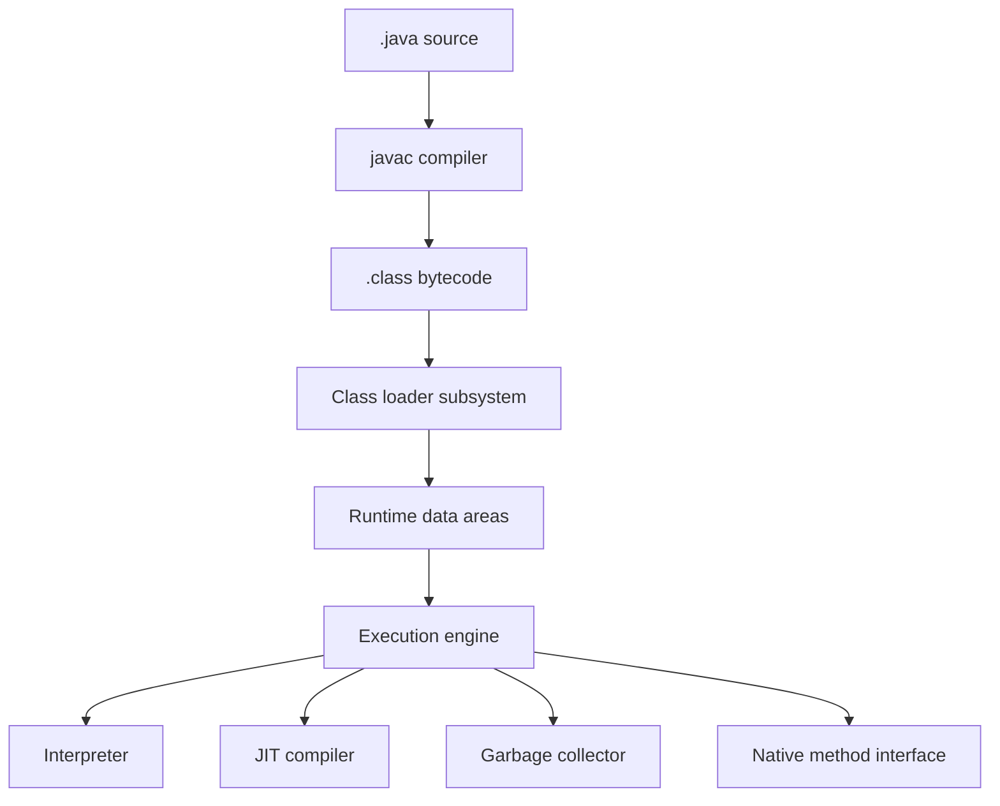
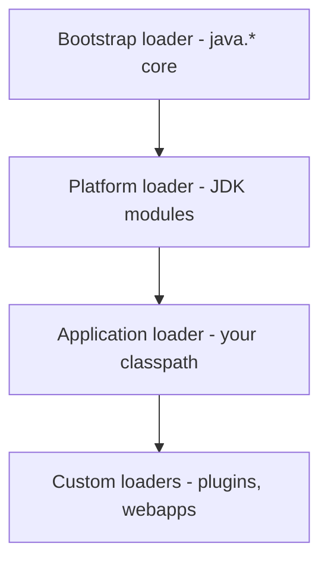

The JVM is the runtime that turns portable bytecode into running machine code. Interviewers use this topic to check that you understand what happens between `javac` and a live object, and that you can reason about class loaders when a framework misbehaves. Baseline here is Java 17.

## The three subsystems

A JVM is three cooperating parts: the **class loader subsystem** finds and loads `.class` bytes, the **runtime data areas** hold everything the program uses at runtime, and the **execution engine** actually runs the bytecode (interpreting it, then compiling hot paths with the JIT).



> [!KEY]
> `javac` does **not** produce machine code. It produces portable bytecode; the JVM is what turns that into native instructions at runtime. "Write once, run anywhere" lives in this gap.

### JDK vs JRE vs JVM

These three terms are asked constantly, and mixing them up sounds junior.

| Term | What it is | Contains |
|---|---|---|
| JVM | The abstract runtime specification and its implementation that executes bytecode | Class loader, memory areas, execution engine |
| JRE | The runtime environment needed to *run* a Java app | JVM + core class libraries |
| JDK | The developer kit needed to *build* a Java app | JRE + `javac`, `javap`, `jar`, `jlink`, `jdeps` |

Since Java 11 there is no separately shipped JRE download from Oracle — you build a slim runtime yourself with `jlink`.

## From source to bytecode

`javac` compiles each type into a `.class` file with a fixed layout: a magic number `0xCAFEBABE`, major/minor version, the **constant pool** (a table of symbolic references — class names, method names, string literals), access flags, fields, methods and attributes. You rarely read the raw bytes; you use `javap`.

The version bytes matter in practice: a class compiled for a newer Java release won't load on an older JVM, producing `UnsupportedClassVersionError` — one of the most common "works on my machine" failures when build and runtime JDKs differ. The constant pool is the reason bytecode is compact and relocatable: instructions refer to entries by index rather than embedding names or literals inline, and those symbolic references are only turned into concrete ones during resolution at runtime.

```bash
javac Point.java
javap -c -p Point.class   # -c disassembles bytecode, -p shows private members
javap -verbose Point.class # constant pool, version, stack map frames
```

Reading `javap -c` output is a genuinely useful senior skill: it shows you that `String` concatenation became `invokedynamic`, or that an enhanced `for` loop became an iterator call, or that a constant was inlined at compile time.

## The class-loading pipeline

Loading a class is three phases. The subtlety interviewers want is the difference between **loaded** and **initialised**.


- **Loading** — read the bytes, create the `Class` object.
- **Linking → Verification** — check the bytecode is well-formed and type-safe (this is what stops hand-crafted malicious bytecode).
- **Linking → Preparation** — allocate static fields and set them to *default* values (`0`, `null`, `false`), not their source values yet.
- **Linking → Resolution** — replace symbolic references in the constant pool with direct references (can be lazy).
- **Initialisation** — run static initialisers and static field assignments, top to bottom. This is where `static { ... }` blocks execute.

A class is **initialised lazily**, only on first *active use*: creating an instance, reading or writing a non-constant static member, invoking a static method, or reflective `Class.forName(name)`. Merely referencing a `Class` object, or reading a `static final` compile-time constant, does **not** trigger initialisation because the constant was inlined by `javac`.

```java
class Config {
    static final String NAME = "svc";      // compile-time constant, inlined
    static final long START = System.nanoTime(); // NOT constant -> triggers init
    static { System.out.println("Config initialised"); }
}
// Reading Config.NAME never prints; reading Config.START prints the message.
```

> [!WARNING]
> If a `static` initialiser throws, the JVM wraps it in an `ExceptionInInitializerError` and marks the class **erroneous**. Every later attempt to use that class throws `NoClassDefFoundError`, not the original cause — so the real stack trace is only visible on the *first* failure. Log it.

### Three "not found" errors that differ

| Error | When | Meaning |
|---|---|---|
| `ClassNotFoundException` | Checked exception at load time | Reflective lookup (`Class.forName`) could not find the class on the classpath |
| `NoClassDefFoundError` | Error at link/use time | Class was present at compile time but is missing or failed to initialise at runtime |
| `ExceptionInInitializerError` | Error during initialisation | A static initialiser or static field assignment threw |

## The delegation hierarchy

Class loaders form a parent-first chain. When asked to load a class, a loader first delegates *up* to its parent, and only loads the class itself if every ancestor fails.



Parent-first delegation is a **security** property: because the bootstrap loader owns `java.lang`, a malicious `java.lang.String` dropped onto your classpath is never loaded — the request is answered by the trusted bootstrap loader before your loader ever sees it. Class identity is `(fully-qualified name, defining loader)`, so the same bytes loaded by two loaders are two incompatible types — the source of confusing `ClassCastException: cannot cast X to X` messages.

There is one deliberate exception worth knowing: some frameworks need to load *application* classes from *library* code that sits above them in the hierarchy — JDBC drivers and JNDI are the classic cases. The workaround is the **thread context class loader**, a per-thread loader you can set and retrieve so parent code can reach down to a child loader when strict parent-first delegation would otherwise fail. Interviewers who work on frameworks or app servers often probe this as a follow-up to the delegation question.

### Custom class loaders

You subclass `ClassLoader` (or `URLClassLoader`) and override `findClass` to supply bytes from anywhere — a database, a network, an encrypted jar.

```java
class PluginLoader extends ClassLoader {
    @Override
    protected Class<?> findClass(String name) throws ClassNotFoundException {
        byte[] bytes = loadPluginBytes(name); // from disk, DB, network...
        if (bytes == null) throw new ClassNotFoundException(name);
        return defineClass(name, bytes, 0, bytes.length);
    }
}
```

Real uses: application servers isolating each deployed WAR, plugin systems, hot-reload/dev tools, and Spring Boot's `LaunchedURLClassLoader`, which reads classes straight out of the nested `BOOT-INF/lib/*.jar` inside a fat jar without unpacking it. Overriding `findClass` rather than `loadClass` is the correct pattern because it preserves parent-first delegation — you only supply bytes for classes the parents couldn't find, keeping the security guarantee intact while still isolating your plugin or webapp classes from each other.

> [!DANGER]
> Class unloading only happens when a loader **and all its classes and instances** become unreachable. App servers that redeploy without releasing the old loader leak the entire old class graph into **metaspace**, producing the classic `OutOfMemoryError: Metaspace` after a dozen redeploys. A lingering static reference or an un-deregistered JDBC driver is usually the culprit.

## The module system in practice

Java 9 added the Java Platform Module System (JPMS). A `module-info.java` declares what a module needs and what it exposes.

```java
module com.acme.billing {
    requires com.acme.core;          // dependency
    exports com.acme.billing.api;    // public to other modules
    opens com.acme.billing.model;    // reflective access allowed (e.g. for frameworks)
}
```

Modules give **strong encapsulation**: a package that is not `exports`ed is invisible even by reflection. From Java 16–17 the JDK enforces this on its own internals — the old "illegal reflective access" warning became a hard error. That is why real upgrades from Java 8 hit code (and libraries like older Hibernate or Spring) that poked at `sun.*` internals, and why you add flags:

```bash
java --add-opens java.base/java.lang=ALL-UNNAMED -jar app.jar
jlink --add-modules com.acme.billing --output runtime   # slim custom runtime
jdeps --module-path libs app.jar                         # find module dependencies
```

`jdeps` analyses dependencies and flags internal-API usage; `jlink` builds a minimal runtime image containing only the modules you need. Reflection (`Class.forName`, `getDeclaredMethod`, `setAccessible`) powers frameworks but costs more than direct calls and defeats some JIT optimisation, so hot paths should cache `Method`/`Field` handles or avoid reflection entirely. Native code entered through JNI runs in native frames outside the JVM stack model and is invisible to the Java debugger.

## Cheat sheet

- Three subsystems: class loader, runtime data areas, execution engine (interpreter + JIT + GC).
- JDK = JRE + tools; JRE = JVM + libraries; JVM runs the bytecode.
- Class-loading order: load → verify → prepare → resolve → initialise.
- A class is *initialised* lazily on first active use, not merely when referenced.
- `static final` compile-time constants are inlined and never trigger initialisation.
- `ClassNotFoundException` is reflective and checked; `NoClassDefFoundError` is a runtime link failure.
- Parent-first delegation blocks a fake `java.lang.String` and defines class identity as name + loader.
- Redeploy metaspace leaks come from a class loader that never becomes unreachable.
- `--add-opens` is the flag you use when a framework needs reflective access to a closed package.

## Common mistakes

| Mistake | Fix |
|---|---|
| Saying `javac` emits machine code | It emits portable bytecode; the JIT emits machine code at runtime |
| Confusing `ClassNotFoundException` and `NoClassDefFoundError` | First is a reflective lookup miss; second is a runtime link/init failure |
| Expecting a static block to run when you reference the class | Initialisation is lazy — only first active use triggers it |
| Assuming two copies of a class are the same type | Identity is name + defining loader; different loaders give incompatible types |
| Ignoring the first `ExceptionInInitializerError` | Only the first occurrence shows the real cause; later ones are `NoClassDefFoundError` |
| Treating `--add-opens` as insecure by default | It is the supported upgrade path for reflective access to closed packages |

## Summary

The JVM splits into a class loader subsystem, runtime data areas and an execution engine, and the interesting interview material sits in the class loader. Classes move through loading, linking (verify, prepare, resolve) and lazy initialisation, and knowing exactly when initialisation fires explains static-block behaviour and the three "not found" errors. Parent-first delegation gives both security and class identity, custom loaders power servers and plugins, and unreleased loaders cause metaspace leaks. The module system adds strong encapsulation, which is the real reason Java 8-to-17 upgrades need `--add-opens`.

## Top Interview Questions

### Q1. Walk me through what happens between `javac Foo.java` and a running `Foo` object.

`javac` compiles the source into a `Foo.class` file of portable bytecode with a constant pool of symbolic references. At runtime the class loader subsystem loads the bytes and creates a `Class` object, then linking verifies the bytecode is type-safe, prepares static fields to default values, and resolves symbolic references to direct ones. On first active use the class is initialised — static blocks and static assignments run top to bottom. Only then can you allocate a `Foo`, at which point the object goes on the heap and the execution engine interprets the constructor bytecode, JIT-compiling it if it gets hot. The key point: `javac` never emits machine code; the JIT does, lazily, at runtime.

### Q2. What is the difference between a class being loaded and being initialised?

Loading means the bytes have been read and a `Class` object exists; linking may have verified and prepared it. Initialisation is a separate, later step that runs the static initialisers and static field assignments, and it happens **lazily** on first active use: creating an instance, calling a static method, reading or writing a non-constant static field, or `Class.forName`. Merely holding a `Class` reference, or reading a `static final` compile-time constant (which `javac` inlines), does not initialise the class. This distinction explains why a `static {}` block sometimes appears not to run — nothing has actively used the class yet.

### Q3. Explain `ClassNotFoundException` versus `NoClassDefFoundError`.

`ClassNotFoundException` is a checked exception thrown when reflective loading (`Class.forName`, `loadClass`) can't find a class on the classpath — you typically see it in code that loads names dynamically. `NoClassDefFoundError` is an `Error` thrown when a class was present at compile time but is missing or failed to load at runtime, or when its initialisation previously failed. A classic trap: a static initialiser throws once, producing `ExceptionInInitializerError` with the real cause, and every subsequent use throws `NoClassDefFoundError` with no useful stack trace. So `NoClassDefFoundError` often means "this class failed to initialise earlier," not "the jar is missing."

### Q4. How does parent-first delegation work and why does it matter for security?

When a class loader is asked to load a class, it first asks its parent, recursively up to the bootstrap loader, and only defines the class itself if all ancestors fail. Security follows directly: core packages like `java.lang` are owned by the trusted bootstrap loader, so a malicious `java.lang.String` placed on the application classpath is never loaded — the bootstrap loader answers first. It also defines class identity as the pair (fully-qualified name, defining loader), which is why the same bytes loaded by two different loaders are two incompatible types and can throw a confusing `ClassCastException` between seemingly identical classes.

### Q5. When would you write a custom class loader?

When you need to control *where* class bytes come from or *how they are isolated*. Application servers give each deployed WAR its own loader so two apps can use different versions of the same library. Plugin systems load extensions from external jars at runtime. Hot-reload tools throw away a loader and create a new one to pick up recompiled classes. Spring Boot's `LaunchedURLClassLoader` reads classes from nested jars inside a fat jar. You subclass `ClassLoader`, override `findClass`, obtain the bytes from disk, a database or the network, and call `defineClass`. The trade-off is isolation and flexibility versus the risk of leaking loaders into metaspace.

### Q6. A production app server throws `OutOfMemoryError: Metaspace` after several redeploys. What's happening?

Each redeploy creates a new class loader for the new version of the app, and the old classes can only be unloaded when their loader and every instance become unreachable. If anything still references the old loader — a static field holding a cached object, a running thread from the old deployment, a registered JDBC driver or a thread-local that was never cleaned up — the entire old class graph stays pinned in metaspace. After enough redeploys metaspace fills. I'd take a heap dump, use Eclipse MAT to find what keeps the old `WebappClassLoader` alive via the dominator/GC-root path, and fix the leaking reference; capping `-XX:MaxMetaspaceSize` only makes it fail faster, not go away.

### Q7. What does the module system change, and why do Java 8-to-17 upgrades need `--add-opens`?

JPMS (Java 9) adds strong encapsulation: a package not listed in `exports` is invisible to other modules, and one not listed in `opens` cannot be reached by reflection. Java 16–17 turned the old "illegal reflective access" warning into a hard failure for JDK internals. Many older libraries reached into `sun.*` or `java.lang` internals via `setAccessible(true)`, so upgrading breaks them with `InaccessibleObjectException`. The supported fix is `--add-opens module/package=ALL-UNNAMED`, which reopens a specific package for deep reflection. Long term you upgrade the offending library; short term `--add-opens` unblocks the migration without weakening encapsulation everywhere.

### Q8. What is the constant pool and why is `javap` useful?

The constant pool is a per-class table of symbolic references — class and interface names, field and method names and descriptors, and literal constants — that the bytecode refers to by index instead of embedding directly. Resolution turns these symbolic references into direct ones at runtime. `javap -c` disassembles the bytecode and `javap -verbose` prints the constant pool and version. It's useful for seeing what the compiler actually generated: that string concatenation compiled to `invokedynamic`, that a `switch` became a `tableswitch`, or that a `static final` was inlined so a dependent class no longer needs the constant's owner at runtime — which explains some surprising binary-compatibility bugs.

### Q9. Why is `setAccessible(true)` and heavy reflection discouraged on hot paths?

Reflection resolves members by name at runtime, skips some compile-time checks, and blocks certain JIT optimisations like inlining, so a reflective call is materially slower than a direct one and allocates more (boxed arguments, `Object[]`). It also breaks module encapsulation, which is why it needs `opens`/`--add-opens`. For frameworks that reflect once at startup this is fine, but in a per-request hot loop it shows up in profiles. The mitigations are to cache the resolved `Method`/`Field` objects, switch to `MethodHandle`/`invokedynamic` or `VarHandle`, or generate code at build time so the hot path uses direct calls.

### Q10. What do `jlink` and `jdeps` do, and when would you reach for them?

`jdeps` is a static analysis tool that reports a jar's or module's dependencies and flags any use of internal/unsupported JDK APIs — I run it before a major upgrade to find what will break. `jlink` assembles a custom, minimal runtime image containing only the modules an application actually needs, producing a much smaller footprint than shipping a full JDK — valuable for containers where image size and startup matter. Together they support the modular workflow: use `jdeps` to discover the real module set, declare it, then use `jlink` to build a slim runtime. This is a common answer when interviewers ask how you'd shrink a Java container image.
