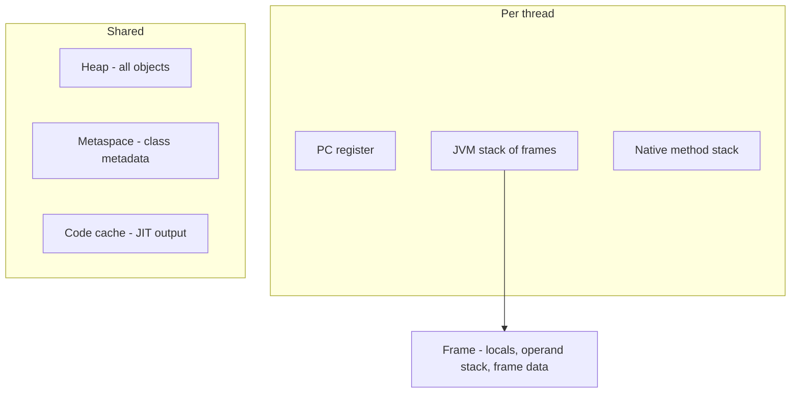
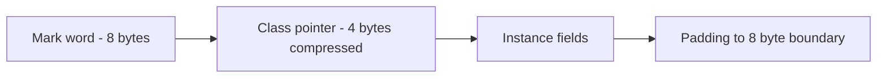
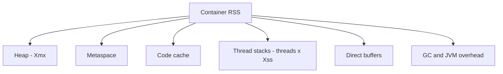

To reason about `OutOfMemoryError`, sizing and container limits you need a concrete map of JVM memory. This page covers the runtime data areas, how a single object is laid out byte by byte, and why your container needs far more than `-Xmx`. Baseline is Java 17.

## The runtime data areas

Memory splits into **per-thread** areas and **shared** areas. Each thread gets a program counter, a JVM stack of frames and a native method stack. All threads share the heap and metaspace.



- **PC register** — the address of the current bytecode instruction for that thread.
- **JVM stack** — one frame per method call; each frame holds a **local variable array**, an **operand stack** and frame data (constant-pool reference, return address). Primitives and object *references* live here.
- **Native method stack** — state for `native`/JNI calls.
- **Heap** — every object and array. Shared, garbage-collected.
- **Metaspace** — class metadata, in **native memory** since Java 8.
- **Code cache** — machine code produced by the JIT.

### Stack errors versus heap errors

| Symptom | Area | Cause | Flag |
|---|---|---|---|
| `StackOverflowError` | Thread stack | Deep or infinite recursion; too many frames | `-Xss` (per-thread stack size) |
| `OutOfMemoryError: Java heap space` | Heap | Too many live objects or a leak | `-Xmx` (max heap) |
| `OutOfMemoryError: Metaspace` | Metaspace | Too many classes, class loader leak | `-XX:MaxMetaspaceSize` |
| `OutOfMemoryError: unable to create native thread` | Native | Thread count × stack size exhausted native memory | fewer threads / smaller `-Xss` |

> [!KEY]
> A `StackOverflowError` is about **call depth**, not object count, and is fixed with `-Xss` or by removing recursion. An `OutOfMemoryError: Java heap space` is about **live objects** and is fixed with `-Xmx` or by fixing a leak. Naming the right area is half the answer.

Since Java 8, **PermGen is gone**; class metadata moved to metaspace, which grows in native memory and is bounded only if you set `-XX:MaxMetaspaceSize`. Left unbounded, a class loader leak eats native memory until the OS kills the process.

## How an object is laid out

An object on a 64-bit HotSpot heap is: a **mark word** (hashcode, GC age, lock state), a **class pointer** (which class this is), the instance **fields**, then **padding** so the whole thing is a multiple of 8 bytes.



The header is 12 bytes with compressed class pointers, and alignment rounds objects to 8 bytes. That has real consequences people underestimate:

The mark word deserves a mention because it does double duty: it stores the identity hash code once computed, the GC age used for promotion decisions, and the object's lock state — biased, thin (a pointer to a stack lock record) or fat (inflated to a monitor). That's why calling `System.identityHashCode` or synchronising on an object is not free of memory semantics, and why the header can't simply be omitted.

| Thing | Approx. size | Why |
|---|---|---|
| `int` | 4 bytes | Primitive, lives inline (stack or field) |
| `Integer` | 16 bytes | 12-byte header + 4-byte int, no padding needed |
| bare `Object` | 16 bytes | 12-byte header + 4 padding |
| reference | 4 bytes (compressed) | A pointer, not the object |
| empty `ArrayList` | ~40+ bytes | List object header + fields + a backing `Object[]` |

So boxing a hot `int[]` into an `Integer[]` roughly quadruples memory and adds a pointer indirection per element. An "empty" `ArrayList` is not free — it is the list object *plus* its backing array.

> [!TIP]
> When asked "how big is an `Integer`?" say **16 bytes** (12-byte header + 4-byte payload) versus **4 bytes for an `int`**, and mention it's a heap object reached through a 4-byte reference. That precision reads as senior.

### Compressed oops and the 32 GB cliff

With heaps up to ~32 GB the JVM stores object references as 32-bit **compressed ordinary object pointers (oops)**, halving reference size and improving cache use. Cross 32 GB and the JVM must switch to 64-bit references, so a 33 GB heap can hold *fewer* objects than a 31 GB one. Prefer a heap just under 32 GB, or go much larger only when you truly need it.

```bash
java -Xmx31g -XX:+UseCompressedOops -jar app.jar   # stay under the 32 GB cliff
java -Xlog:gc+heap+coops=info -version              # confirm compressed oops are on
```

### Objects don't always live on the heap

"Every object is on the heap" is the textbook answer, but **escape analysis** lets the JIT prove an object never escapes a method and apply **scalar replacement** — exploding it into local primitives that live in registers or the stack, so no allocation happens at all. This is invisible but real, and it's why allocation-heavy code can still be fast once the JIT warms up.

## Arrays, strings and off-heap

An **array of objects is an array of references**, not of inlined objects. `Order[10]` is ten 4-byte pointers to `Order` objects scattered across the heap, so iterating it chases pointers and thrashes the CPU cache. An `int[10]` is ten contiguous integers — far better locality. This is a common reason primitive arrays beat object collections in hot loops.

The **string pool** moved from PermGen to the **heap** in Java 7, so interned strings are now collectable. `String.intern()` returns a canonical shared instance; overusing it on high-cardinality data bloats the pool and slows lookups. `-XX:StringTableSize` sizes the pool's hash table.

```java
String a = new String("hi");          // new heap object
String b = a.intern();                 // canonical pooled instance
// b == "hi" is true; a == "hi" is false
```

**Direct/off-heap memory** via `ByteBuffer.allocateDirect(n)` lives outside the heap in native memory. It avoids a copy for I/O and isn't scanned by the GC, but it's freed only when the buffer is collected (or via a `Cleaner`), and it does *not* count against `-Xmx` — so it can OOM-kill a container while the heap looks healthy. This is why high-throughput I/O libraries like Netty pool direct buffers explicitly: allocating and freeing native memory is comparatively expensive, and relying on GC to reclaim it is unpredictable, so they manage a reusable pool instead.

### Reference strengths

| Reference | Collected when | Real use |
|---|---|---|
| Strong | Never while reachable | Normal references |
| Soft | Only under memory pressure | Memory-sensitive caches |
| Weak | At the next GC if only weakly reachable | Canonical maps, `WeakHashMap` keys, listeners |
| Phantom | After finalisation, enqueued for cleanup | Managing off-heap/native resources via `Cleaner` |

## Sizing a container correctly

The single most-missed point: heap is **not** the whole footprint. Total resident memory is:

```
heap  +  metaspace  +  code cache  +  thread stacks  +  direct buffers  +  GC structures
```



> [!DANGER]
> Setting `-Xmx` equal to the container memory limit is a classic cause of OOM-kills. Metaspace, thread stacks, code cache and direct buffers all live *outside* the heap, so the process exceeds the cgroup limit and the kernel kills it — you never even get a heap dump. Leave headroom, or better, use `-XX:MaxRAMPercentage`.

```bash
# Bad: heap == limit, no room for everything else
java -Xmx2g -jar app.jar            # in a 2g container -> OOM-killed

# Good: let the JVM size the heap as a fraction of the cgroup limit
java -XX:MaxRAMPercentage=70 -XX:InitialRAMPercentage=70 -jar app.jar
```

Modern JVMs are container-aware and read the cgroup limit, so `MaxRAMPercentage` sizes the heap to a fraction (e.g. 70%) and leaves the rest for off-heap needs.

This container-awareness is relatively recent: JVMs before the 8u191/10 era ignored cgroup limits entirely and sized the heap from the *host* machine's memory, so a container capped at 512 MB on a 64 GB host would try to grab a multi-gigabyte heap and get killed instantly. If you ever see a container OOM-killed the moment it starts, check the JDK version and whether `-XX:MaxRAMPercentage` (or an explicit `-Xmx`) is set — an ancient JVM plus no explicit sizing is the classic cause.

## Measuring memory

Reach for these before guessing:

```bash
jcmd <pid> GC.heap_info          # generation sizes and usage, live
jcmd <pid> VM.native_memory summary  # off-heap breakdown (needs NativeMemoryTracking)
jmap -histo:live <pid> | head     # top classes by retained count/bytes
jmap -dump:live,format=b,file=heap.hprof <pid>  # full heap dump for MAT
```

`jcmd GC.heap_info` shows generation usage cheaply; `jmap -histo` gives a quick class histogram; a full heap dump opened in Eclipse MAT shows the dominator tree and the exact retention path of a leak.

## Cheat sheet

- Per-thread: PC register, JVM stack (frames), native stack. Shared: heap, metaspace, code cache.
- `StackOverflowError` = call depth (`-Xss`); heap OOM = live objects (`-Xmx`).
- PermGen is gone since Java 8; class metadata is in native-memory metaspace.
- Object = mark word + class pointer + fields + padding to 8 bytes; header is 12 bytes.
- `Integer` is 16 bytes; `int` is 4; a reference is 4 bytes with compressed oops.
- Keep the heap under 32 GB to keep compressed oops and dodge the reference-size cliff.
- Escape analysis + scalar replacement mean some objects never hit the heap.
- Object arrays are arrays of references — worse cache locality than primitive arrays.
- Container RSS = heap + metaspace + code cache + stacks + direct buffers + GC; size with `MaxRAMPercentage`.

## Common mistakes

| Mistake | Fix |
|---|---|
| Fixing `StackOverflowError` with `-Xmx` | Use `-Xss` or remove the deep/infinite recursion |
| Setting `-Xmx` equal to the container limit | Leave headroom or use `-XX:MaxRAMPercentage` |
| Assuming interned strings can't be collected | Since Java 7 the pool is on the heap and is collectable |
| Thinking every object is always on the heap | Escape analysis can scalar-replace non-escaping objects |
| Treating direct `ByteBuffer` memory as part of `-Xmx` | It is native memory and can OOM-kill the container separately |
| Using `Integer[]` in a hot numeric loop | Use `int[]` for locality and to avoid boxing overhead |

## Summary

JVM memory is per-thread stacks plus a shared heap, metaspace and code cache, and matching each `OutOfMemoryError` to its area is the fastest way to sound competent. A single object carries a 12-byte header and 8-byte alignment, which is why an `Integer` costs 16 bytes and object arrays hurt cache locality. Compressed oops make the 32 GB boundary meaningful, and escape analysis complicates the "always on the heap" rule. Above all, a container's footprint is heap *plus* metaspace, stacks, code cache and direct buffers — so size with `MaxRAMPercentage`, not by pinning `-Xmx` to the limit.

## Top Interview Questions

### Q1. What are the JVM runtime data areas, and which are per-thread versus shared?

Per-thread areas are the program counter (address of the current bytecode), the JVM stack (one frame per method call, each holding a local variable array, an operand stack and frame data), and the native method stack for JNI calls. Shared areas are the heap, where all objects and arrays live and where the garbage collector works, plus metaspace, which holds class metadata in native memory, and the code cache holding JIT-compiled machine code. Primitives and references live in stack frames; the objects they point to live on the heap. Knowing this split lets you map any `OutOfMemoryError` or `StackOverflowError` to the exact area responsible.

### Q2. Explain `StackOverflowError` versus `OutOfMemoryError`.

`StackOverflowError` happens on a single thread's stack when call depth exceeds the stack size — usually unbounded or overly deep recursion. It's about the number of nested frames, not object count, and you address it with `-Xss` or by converting recursion to iteration. `OutOfMemoryError: Java heap space` happens when the heap can't fit the live object set, from genuine demand or a leak, and you address it with `-Xmx` or by finding the leak with a heap dump. There are other OOM flavours too — `Metaspace` for class metadata and `unable to create native thread` when threads exhaust native memory. Naming the correct area first is what distinguishes a strong answer.

### Q3. How is an object laid out in memory, and how big is an `Integer` versus an `int`?

On 64-bit HotSpot an object has a mark word (identity hashcode, GC age, lock bits), a class pointer, the instance fields, then padding to an 8-byte boundary. With compressed class pointers the header is 12 bytes. So a bare `Object` is 16 bytes, and an `Integer` is 16 bytes — 12-byte header plus a 4-byte `int` payload — reached through a 4-byte reference. A primitive `int` is just 4 bytes stored inline in a stack frame or as a field, with no header and no separate allocation. That roughly 4× overhead is why boxing in hot numeric code is a real cost, both in memory and in pointer-chasing.

### Q4. What are compressed oops and what's special about a 32 GB heap?

Compressed ordinary object pointers store 64-bit heap references as 32-bit values by exploiting 8-byte object alignment, which halves reference size, shrinks objects and improves cache utilisation. They work for heaps up to roughly 32 GB. Above that boundary the JVM must use full 64-bit references, so every reference grows and objects take more space — meaning a 33 GB heap can actually hold fewer objects than a 31 GB one. The practical guidance is to keep the heap just under 32 GB where possible; only exceed it when you genuinely need a much larger heap, and expect a per-reference memory tax when you do.

### Q5. Is it true that every Java object lives on the heap?

As a first approximation yes — `new` normally allocates on the heap and the GC manages it. But the JIT performs escape analysis: if it can prove an object never escapes the method that created it, it can apply scalar replacement and represent the object's fields as plain locals in registers or on the stack, so no heap allocation happens at all. Lock elision similarly removes synchronisation on non-escaping objects. This is why allocation-heavy but short-lived object code can still be fast after warm-up. So the precise answer is "logically on the heap, but the JIT may optimise non-escaping objects away entirely."

### Q6. Why does an object array often perform worse than a primitive array in a hot loop?

An array of objects is an array of *references*: `Order[10]` is ten pointers, and the actual `Order` objects are scattered wherever the allocator placed them. Iterating it dereferences a pointer per element, so the CPU cache is constantly missing as it jumps around the heap. A primitive `int[10]` stores ten integers contiguously, so a cache line brings in several elements at once and the prefetcher works well. In allocation- or throughput-sensitive code this locality difference can be several times faster, which is why numeric hot paths favour primitive arrays or specialised primitive collections over `List<Integer>`.

### Q7. A container with `-Xmx2g` in a 2 GB limit keeps getting OOM-killed with no heap dump. Why?

Because heap is only part of the process footprint. Resident memory is heap plus metaspace, the code cache, every thread's stack (`threads × -Xss`), direct/off-heap `ByteBuffer` memory, and GC bookkeeping. If `-Xmx` equals the cgroup limit, the moment those off-heap areas grow the process exceeds the limit and the kernel's OOM killer terminates it — that's an external SIGKILL, so the JVM never runs its heap-dump-on-OOM handler. The fix is to leave headroom: either set `-Xmx` well below the limit or, better, use `-XX:MaxRAMPercentage=70` so the container-aware JVM sizes the heap as a fraction of the limit and reserves the rest for everything else.

### Q8. How did string storage change, and when is `intern()` a problem?

Before Java 7 the string pool lived in PermGen; in Java 7 it moved to the heap, so interned strings became collectable and PermGen pressure from strings disappeared. `String.intern()` returns a single canonical instance for equal strings, which can save memory when you have many duplicates of a small set of values. The trap is calling it on high-cardinality data: you fill the pool's hash table with millions of unique strings that are effectively permanent, hurting both memory and lookup speed. `-XX:StringTableSize` tunes the table, but the real fix is to intern only low-cardinality, frequently-duplicated strings, not arbitrary input.

### Q9. When would you use soft, weak and phantom references?

Strong references are the default and keep objects alive. Soft references are collected only under memory pressure, so they suit memory-sensitive caches you'd like to keep but can afford to lose. Weak references are collected at the next GC once nothing strongly reachable holds them, which is ideal for canonical maps and metadata keyed by objects — `WeakHashMap` uses weak keys so entries vanish when the key is otherwise unreferenced, avoiding a leak. Phantom references are enqueued after the object is finalised and are used with a `ReferenceQueue` to run deterministic cleanup of native/off-heap resources, which is exactly what `Cleaner` builds on as a safer replacement for `finalize()`.

### Q10. How would you investigate suspected excessive memory use in a running service?

I'd start non-invasively with `jcmd <pid> GC.heap_info` to see generation sizes and whether the old gen is filling, and `jcmd <pid> VM.native_memory summary` (with Native Memory Tracking on) to see off-heap usage like thread stacks and direct buffers. `jmap -histo:live` gives a quick histogram of which classes dominate. If it looks like a leak rather than legitimate demand, I take a heap dump with `jmap -dump:live` and open it in Eclipse MAT, using the dominator tree and "path to GC roots" to find what retains the growing objects. Only after locating the retaining reference do I decide whether it's a code fix or a genuine sizing problem needing more `-Xmx` or `MaxRAMPercentage`.
