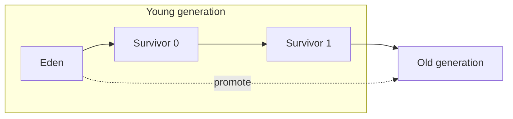
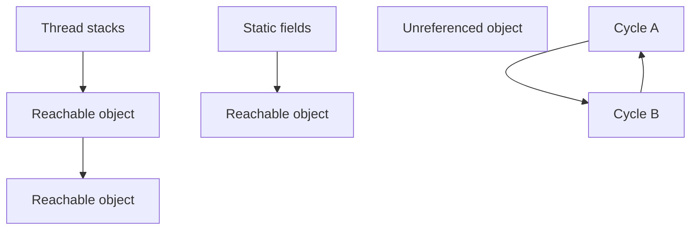
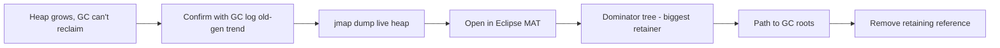

Garbage collection is the JVM feature interviewers probe hardest, because it connects theory (reachability, generations) to production pain (pauses, leaks, OOM). This page builds the model, compares the modern collectors, and walks the leak-diagnosis workflow. Baseline is Java 17.

## The generational hypothesis

Empirically, **most objects die young** — a request builds temporary objects that are garbage almost immediately — while the few that survive tend to live a long time. The **weak generational hypothesis** turns this into a design: split the heap into a **young generation** for new objects and an **old (tenured) generation** for survivors, and collect the young generation often and cheaply.



New objects allocate in **Eden**. A **minor GC** copies the survivors into a survivor space; each survival increments an object's **age**, and once it passes the **tenuring threshold** it is **promoted** to the old generation. A **major/full GC** collects the old generation and is far more expensive.

| GC type | Collects | Cost | Trigger |
|---|---|---|---|
| Minor GC | Young generation only | Cheap, frequent | Eden full |
| Major GC | Old generation | Expensive | Old generation pressure |
| Full GC | Whole heap + metaspace | Most expensive, stop-the-world | Allocation failure, `System.gc()` |

> [!WARNING]
> **Premature promotion** — objects promoted to old before they die because survivor spaces are too small — fills the old generation with short-lived garbage and forces frequent expensive old collections. An undersized young generation is a common, non-obvious cause of GC pain.

## Collection algorithms

Three core algorithms underlie every collector:

- **Mark-sweep** — mark reachable objects, sweep the rest. Simple but fragments the heap.
- **Mark-compact** — mark, then slide survivors together to remove fragmentation. Used for the old generation.
- **Copying** — copy survivors to a fresh space and discard the old one wholesale. Fast for the young generation where few objects survive.

### GC roots and reachability

The collector keeps whatever is reachable from a set of **GC roots**: live thread stacks and local variables, static fields, JNI references and monitors. Anything not reachable from a root is garbage.



Crucially, **cycles are collected** — reachability, not reference counting, decides liveness, so two objects pointing only at each other are still garbage. That is why a "memory leak in Java" is never a missing free; it is an **unintended strong reference** from a root (a static collection, a cache, a listener list) that keeps objects alive forever.

> [!KEY]
> In Java a leak means *reachable but never used again*. The fix is always to remove the retaining reference — clear the cache entry, deregister the listener, close the resource — not to "free" memory manually.

## Stop-the-world and safepoints

Most GC work needs a consistent heap snapshot, so the JVM brings every application thread to a **safepoint** and pauses them — a **stop-the-world (STW)** pause. The often-missed subtlety is **time-to-safepoint**: a thread in a tight counted loop or long native call may take a while to *reach* a safepoint, and the whole GC waits for the slowest thread. So a pause can be long even when the collector itself is fast, and this "hidden pause" hides in `-Xlog:safepoint` output, not the GC time.

## Comparing the collectors

| Collector | Model | Concurrency | Typical pause | Heap range | Choose when |
|---|---|---|---|---|---|
| Serial | Single-threaded young + old | None | 10s–100s ms | small (< 100 MB) | Tiny heaps, single CPU, containers with 1 core |
| Parallel | Multi-threaded, throughput-first | STW only | 100s ms | small–large | Batch jobs where throughput beats latency |
| G1 (default) | Region-based, incremental | Concurrent mark | ~10–200 ms | medium–large | General default, balanced latency/throughput |
| ZGC | Region-based, concurrent | Almost fully concurrent | < 1 ms | large–huge (TBs) | Low, predictable latency on big heaps |
| Shenandoah | Region-based, concurrent | Almost fully concurrent | < 10 ms | medium–huge | Low pauses without huge heaps |

G1 has been the default since Java 9. ZGC and Shenandoah are the low-pause options; Parallel maximises raw throughput at the cost of pause length.

### G1 in detail

G1 divides the heap into equal **regions** (typically 1–32 MB) that are dynamically tagged as Eden, survivor or old. It does **concurrent marking** to find live data, then does **evacuation** pauses that copy live objects out of the most-garbage regions first — "garbage first". **Mixed collections** clean young plus a few old regions per cycle so old-gen work is spread out instead of one giant full GC. Objects larger than half a region are **humongous** and allocated straight into contiguous old regions, which can waste space and trigger extra collections.

`-XX:MaxGCPauseMillis` is a **goal, not a guarantee** — G1 sizes the young generation and picks how many regions to collect to *try* to hit it, but a too-aggressive goal just shrinks the young gen and raises GC frequency. If G1 can't reclaim space fast enough it suffers an **evacuation failure** (to-space exhausted) and falls back to a slow full GC.

### ZGC and Shenandoah

These are **concurrent** collectors that do almost all work while the application runs, keeping pauses sub-millisecond (ZGC) or single-digit-millisecond (Shenandoah) regardless of heap size. They rely on **load/read barriers** to relocate objects concurrently without stopping the application: ZGC uses coloured pointers (metadata bits in references), while Shenandoah uses forwarding metadata and barriers rather than the same pointer-colouring scheme. The trade-off is a **throughput cost** — the barriers add per-access overhead — and slightly higher CPU and memory use. **Generational ZGC** (JDK 21) restores the young/old split to ZGC, dramatically cutting its CPU and allocation-stall cost for typical workloads.

```bash
java -XX:+UseG1GC        -Xms4g -Xmx4g -jar app.jar     # default, balanced
java -XX:+UseZGC -XX:+ZGenerational -Xmx16g -jar app.jar # low pause, big heap
java -XX:+UseParallelGC  -Xmx4g -jar app.jar            # throughput batch job
```

## Flags and reading GC logs

The flags that actually matter day to day:

```bash
-Xms4g -Xmx4g                 # equal min/max avoids heap resizing pauses
-XX:MaxRAMPercentage=70       # size heap from the container limit
-XX:+UseG1GC                  # explicit collector choice
-XX:MaxGCPauseMillis=200      # pause goal for G1
-Xlog:gc*:file=gc.log:time,uptime,level,tags  # unified GC logging
```

When you read a GC log, ask three questions: **allocation rate** (how fast is Eden filling — high rate means minor GCs are frequent), **live-set size** (how much survives after old collection — this is your real working set and floor for `-Xmx`), and **pause distribution** (are pauses within the goal, and is p99 acceptable). Setting `-Xms` equal to `-Xmx` removes the resizing pauses that otherwise appear as sporadic long GCs.

> [!TIP]
> Say the three GC-log questions out loud in an interview: allocation rate, live-set size, pause distribution. It shows you tune from evidence, not by flipping flags.

## Diagnosing a memory leak end to end



The tell-tale sign is old-generation occupancy that climbs after every full GC instead of returning to a baseline. Take a live heap dump (`jmap -dump:live,format=b,file=heap.hprof <pid>`), open it in Eclipse MAT, use the **dominator tree** to find the object retaining the most memory, then follow the **path to GC roots** to see *why* it's still reachable — nearly always a static map, an unbounded cache or an un-removed listener. Fix the reference and the leak is gone.

## Finalizers are the wrong tool

`finalize()` is **deprecated** — it runs at an unpredictable time on a single finalizer thread, can resurrect objects, delays their collection, and may never run at all. The modern answers are **try-with-resources** for anything `AutoCloseable`, and `java.lang.ref.Cleaner` for native/off-heap cleanup, which uses phantom references and runs cleanup deterministically when the object becomes unreachable.

> [!DANGER]
> Calling `System.gc()` is a code smell. It's only a *hint*, it usually forces an expensive full GC that hurts latency, and it hides the real problem — an under-sized heap or a leak. Let the collector schedule itself; if you feel you need `System.gc()`, tune the heap or fix the retention instead.

## Cheat sheet

- Generational hypothesis: most objects die young; collect the young gen cheaply and often.
- Young = Eden + two survivors; promotion happens past the tenuring threshold.
- Minor GC is cheap; full GC scans the whole heap and is stop-the-world.
- Copying collects young, mark-compact collects old, mark-sweep fragments.
- A Java leak is an unintended strong reference from a GC root, not a missing free.
- G1 is the default since Java 9; ZGC/Shenandoah give sub-10 ms pauses via barriers.
- `-XX:MaxGCPauseMillis` is a goal, not a guarantee; too low just raises GC frequency.
- Set `-Xms` = `-Xmx` to avoid resize pauses; size with `MaxRAMPercentage` in containers.
- Diagnose leaks with a heap dump + MAT dominator tree + path to GC roots.
- Prefer try-with-resources and `Cleaner` over deprecated `finalize()`; avoid `System.gc()`.

## Common mistakes

| Mistake | Fix |
|---|---|
| Calling `System.gc()` to "free memory" | Remove it; tune heap size or fix the retention instead |
| Believing reference cycles leak in Java | Reachability collects cycles; leaks are roots holding references |
| Setting `MaxGCPauseMillis` very low | It just shrinks the young gen and raises GC frequency; set a realistic goal |
| Using `finalize()` for cleanup | Use try-with-resources or `Cleaner` |
| Ignoring premature promotion | Size the young gen/survivors so short-lived objects die young |
| Leaving `-Xms` far below `-Xmx` | Set them equal to avoid heap-resizing pauses |

## Summary

Generational GC exploits the fact that most objects die young: allocate in Eden, promote survivors past the tenuring threshold, and collect the young generation cheaply while old collections stay rare. Collectors trade throughput for latency — Parallel maximises throughput, G1 balances (and is the default), and ZGC and Shenandoah use barriers and coloured pointers for sub-millisecond pauses, with generational ZGC in JDK 21 cutting their cost. Leaks are unintended strong references, diagnosed with a heap dump and MAT's dominator tree. Tune from GC-log evidence — allocation rate, live-set size, pause distribution — not by reflexively adding flags or calling `System.gc()`.

## Top Interview Questions

### Q1. Explain the generational hypothesis and how the heap is structured around it.

The weak generational hypothesis observes that most objects die very young while the few that survive tend to live a long time. The JVM exploits this by splitting the heap into a young generation — Eden plus two survivor spaces — and an old generation. New objects go into Eden; a minor GC copies the few survivors into a survivor space and increments their age; once an object's age passes the tenuring threshold it is promoted to the old generation. This lets the JVM run cheap, frequent minor collections over the young generation (where almost everything is already dead) and reserve expensive full collections for the old generation, which is collected far less often.

### Q2. What's the difference between minor, major and full GC?

A minor GC collects only the young generation; it's frequent and cheap because most young objects are already dead, so copying the survivors is fast. A major GC collects the old generation, which holds long-lived objects, and is significantly more expensive. A full GC collects the entire heap — young plus old — and often metaspace too, and is the most expensive, typically a long stop-the-world pause. Full GCs are triggered by allocation failure, old-gen exhaustion, an explicit `System.gc()`, or a collector falling back after failing to keep up. A healthy service runs many minor GCs and very few full GCs; frequent full GCs signal an under-sized heap or a leak.

### Q3. What does "memory leak" mean in a garbage-collected language, and how do you find one?

Because the collector reclaims anything unreachable, including cycles, a leak isn't a forgotten `free` — it's an object that stays *reachable* from a GC root but is never used again, so the GC is correctly forbidden from collecting it. Typical causes are static or singleton collections that only grow, caches without eviction, `ThreadLocal`s that aren't cleared, and listeners that are registered but never removed. The tell-tale is old-gen occupancy climbing after every full GC. To find it I take a live heap dump with `jmap`, open it in Eclipse MAT, use the dominator tree to find the biggest retainer, and follow the path to GC roots to see the exact reference chain keeping it alive, then remove that reference.

### Q4. Compare G1, ZGC and Parallel and say when you'd pick each.

Parallel GC is throughput-first: multiple threads, stop-the-world, longest pauses, best raw throughput — good for batch jobs where total work matters more than latency. G1 is the default since Java 9: it divides the heap into regions, marks concurrently, and does incremental evacuation to hit a pause goal, giving a balanced ~10–200 ms latency suitable for most services. ZGC (and Shenandoah) are concurrent collectors that keep pauses sub-millisecond regardless of heap size by using load/read barriers and coloured pointers, at some throughput and CPU cost — you choose them for large heaps or strict tail-latency SLAs. Rule of thumb: G1 by default, ZGC when p99 pause time is a hard requirement, Parallel for throughput-only batch.

### Q5. How does G1 work, and is `MaxGCPauseMillis` a guarantee?

G1 splits the heap into equal-sized regions dynamically labelled Eden, survivor or old. It marks live data concurrently, then runs evacuation pauses that copy live objects out of the regions with the most garbage first — hence "garbage first" — and mixed collections clean young plus a few old regions each cycle so old-gen work is amortised instead of one giant full GC. Objects bigger than half a region are "humongous" and allocated directly into old regions. `-XX:MaxGCPauseMillis` is a *goal*, not a guarantee: G1 adjusts the young-generation size and the number of regions collected to try to hit it, but setting it too low just shrinks the young gen and increases GC frequency. If G1 can't evacuate fast enough it hits an evacuation failure and falls back to a slow full GC.

### Q6. How do ZGC and Shenandoah achieve sub-millisecond pauses, and what's the cost?

They do nearly all their work — marking and relocation — concurrently with the application, so the stop-the-world portion is tiny and roughly constant regardless of heap size. The enabling trick is barriers on reference access: ZGC combines load barriers with coloured pointers, while Shenandoah uses read/load barriers plus forwarding metadata to fix references to moved objects transparently. The cost is throughput: those barriers add per-access overhead, and the collectors use more CPU and some extra memory. ZGC historically was single-generation, which raised its CPU cost; generational ZGC in JDK 21 adds the young/old split back, greatly reducing that overhead for typical allocation-heavy workloads while keeping the ultra-low pauses.

### Q7. What is a safepoint, and how can a GC pause be long even when the collector is fast?

A safepoint is a point where a thread's state is consistent enough for the JVM to inspect and move objects; GC and other operations require every application thread to reach one and stop — a stop-the-world pause. The subtlety is time-to-safepoint: the total pause is "time for the slowest thread to reach a safepoint" plus "time doing the GC work". A thread stuck in a long counted loop without a safepoint poll, or in a lengthy native call, can delay reaching the safepoint, so the whole application waits even though the collector itself finishes quickly. This hidden latency shows up in `-Xlog:safepoint` rather than the GC-pause number, and it's a favourite senior follow-up.

### Q8. Which GC flags actually matter, and how do you read a GC log?

The high-value flags are the collector choice (`-XX:+UseG1GC` or `-XX:+UseZGC`), heap sizing (`-Xms` equal to `-Xmx` to avoid resize pauses, or `-XX:MaxRAMPercentage` in containers), the pause goal (`-XX:MaxGCPauseMillis` for G1), and unified logging (`-Xlog:gc*`). Reading the log, I ask three questions: what's the allocation rate (how fast Eden fills, which drives minor-GC frequency), what's the live-set size (occupancy right after a full/old collection, which is the real working set and the floor for `-Xmx`), and what's the pause distribution (are pauses within goal, and is p99 acceptable). Those three answers tell me whether to grow the heap, resize the young gen, or switch collectors — decisions made from evidence, not guesswork.

### Q9. Why is `finalize()` discouraged and what replaces it?

`finalize()` runs on a single, low-priority finalizer thread at an unpredictable time, or possibly never; it delays reclamation of the object (and everything it references) by at least one extra GC cycle, can accidentally resurrect objects, and swallows exceptions. That makes it useless for timely resource cleanup and a source of subtle leaks and latency. The replacements are try-with-resources for any `AutoCloseable`, which closes deterministically at the end of a scope, and `java.lang.ref.Cleaner` for native or off-heap cleanup, which registers a cleanup action tied to a phantom reference and runs it when the object becomes unreachable — without the resurrection and ordering hazards of finalization.

### Q10. A service shows p99 latency spikes every few minutes though average latency is fine. How do you investigate?

Periodic p99 spikes with a healthy average strongly suggest GC pauses or a related stop-the-world event. I'd turn on `-Xlog:gc*` and correlate the spike timestamps with full or long mixed collections, and check `-Xlog:safepoint` for time-to-safepoint outliers. In the GC log I look at old-gen growth (leak or under-sized heap forcing full GCs), allocation rate (bursty allocation triggering frequent collections), and whether pauses exceed the goal. Fixes depend on the cause: enlarge or equalise the heap (`-Xms`=`-Xmx`), resize the young generation to stop premature promotion, or switch to a low-pause collector like ZGC if the SLA demands sub-millisecond pauses. I'd also profile allocation to cut garbage in the hot path, since less garbage means fewer pauses.

### Q11. What is premature promotion and why does it hurt?

Premature promotion is when short-lived objects get moved into the old generation before they die, usually because the young generation or survivor spaces are too small, or the tenuring threshold is too low, so objects survive a minor GC and are promoted even though they'd have died moments later. The harm is that the old generation fills with garbage that only an expensive major or full GC can reclaim, so you get more frequent, longer pauses and higher heap pressure than the workload warrants. The fix is to size the young generation and survivor spaces so the vast majority of objects die in young collections, keeping the old generation for genuinely long-lived data — often a bigger win than switching collectors.

### Q12. Why is calling `System.gc()` considered a code smell?

`System.gc()` is only a hint — the JVM may ignore it — but when honoured it typically triggers a full stop-the-world collection that pauses every thread, which is exactly the expensive event you want to minimise, so sprinkling it in code creates latency spikes. It also masks the real issue: if you feel you need it, the actual problem is usually an under-sized heap, a leak, or premature promotion, and forcing collections just delays diagnosing that. Some frameworks even disable it with `-XX:+DisableExplicitGC`. The senior stance is to let the collector schedule itself, tune heap and generation sizes from GC-log evidence, and fix retention rather than manually poking the GC.
