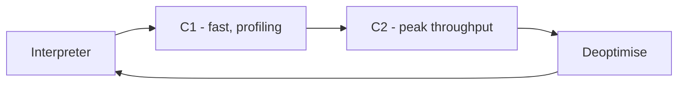
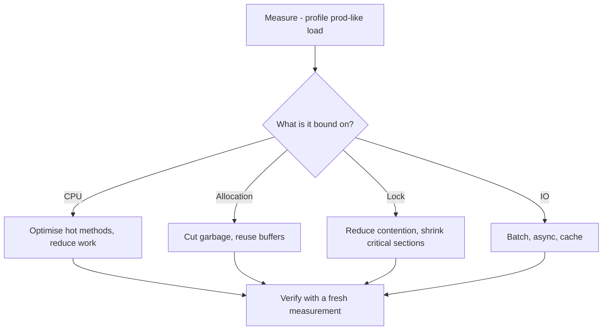

Java starts by interpreting bytecode and only compiles hot code to native at runtime, which is why warm-up matters and why naive benchmarks lie. This page covers tiered compilation, the optimisations the JIT applies, and a measurement-first tuning workflow. Baseline is Java 17.

## Interpreter plus tiered compilation

Every method starts **interpreted**. The JVM counts invocations and loop iterations, and once a method is "hot" it compiles it. HotSpot uses **tiered compilation**: **C1** (client) compiles quickly and adds profiling instrumentation for fast warm-up; **C2** (server) uses that profile to produce heavily optimised code for peak throughput. Compiled code lives in the **code cache**.



Two features surprise people. **On-stack replacement (OSR)** compiles a method *while a long-running loop is still executing*, swapping the interpreted frame for compiled code mid-flight — so a single long loop gets optimised without waiting for the next call. **Deoptimisation** is the reverse: C2 makes *speculative* assumptions from the profile (for example "this call site only ever sees one type"), and if reality later violates the assumption the JVM throws the compiled code away and falls back to the interpreter, then may recompile with the new information.

> [!KEY]
> The JIT optimises based on *observed* behaviour, then can undo it. That's why performance is a runtime property, not a compile-time one, and why the first thousand requests behave differently from the millionth.

## Optimisations you can name

Naming these signals depth in an interview:

| Optimisation | What it does |
|---|---|
| Method inlining | Replaces a call with the callee's body, removing call overhead and enabling further optimisation |
| Escape analysis | Proves an object never escapes a method |
| Scalar replacement | Explodes a non-escaping object into locals, eliminating the allocation |
| Lock elision / coarsening | Removes locks on non-escaping objects; merges adjacent locks |
| Loop unrolling | Reduces loop-control overhead and enables vectorisation |
| Dead-code elimination | Removes code whose result is never used |
| Intrinsics | Swaps known methods (`Math.sqrt`, `System.arraycopy`) for hand-tuned native code |

**Inlining** is the most important because it unlocks the rest; `-XX:MaxInlineSize` and `-XX:FreqInlineSize` bound how large a method can be and still be inlined, so very large hot methods can silently miss inlining.

This is a concrete reason to keep hot methods small: once a method is inlined into its caller, the JIT can see across the old call boundary and apply escape analysis, constant propagation and dead-code elimination to the combined code, often cascading into far more optimisation than the inlining itself. A giant hot method that exceeds the inline-size threshold blocks that cascade, which is why "extract the hot path into a small method" sometimes speeds code up rather than slowing it down.

### Call-site shape

The JIT optimises virtual calls based on how many concrete types it observes:

- **Monomorphic** — one type ever. Fully inlined, fastest.
- **Bimorphic** — two types. Still cheaply dispatched with a type check.
- **Megamorphic** — many types. Falls back to a slow virtual lookup and blocks inlining.

So an interface called with one implementation in production runs as fast as a direct call; the same interface hit with dozens of implementations in a hot path is measurably slower.

## Warm-up and why it matters

Because compilation is triggered by usage, the **first thousand or so requests are slow** — interpreted, then C1, before C2 kicks in. This shapes real decisions:

- **Benchmarks** that don't warm up measure the interpreter, not steady state.
- **Canaries and load balancers** should ramp traffic to a freshly started instance, or it will time out under a cold-start burst.
- **Autoscaling** that adds an instance during a spike gets a cold instance exactly when latency matters most — pre-warm it or use AOT.

> [!WARNING]
> A new JVM instance is slow until the JIT warms up. Routing full production traffic to a just-started pod causes latency spikes and failed health checks that look like a bug but are just cold code.

## Why you must use JMH

A microbenchmark you write by hand almost always lies, because the JIT is *designed* to delete work whose result you ignore.

```java
// WRONG: the JIT can delete this loop entirely
long start = System.nanoTime();
for (int i = 0; i < 1_000_000; i++) {
    Math.log(i);            // result unused -> dead-code eliminated
}
System.out.println(System.nanoTime() - start); // measures almost nothing
```

The ways a naive benchmark deceives you:

| Trap | What happens |
|---|---|
| Dead-code elimination | Result unused, the whole computation is removed |
| Constant folding | Constant inputs computed once at compile time |
| No warm-up | You time the interpreter, not compiled code |
| GC noise | Allocation during timing adds random pauses |

**JMH** (Java Microbenchmark Harness) handles warm-up iterations, forks fresh JVMs, and provides `Blackhole` and `@State` to consume results so the compiler can't optimise them away. If someone quotes a hand-rolled `System.nanoTime()` microbenchmark, the correct senior response is "rerun it in JMH."

## Ahead-of-time options

```bash
java -Xshare:dump                                  # build the default CDS archive
java -XX:ArchiveClassesAtExit=app.jsa -jar app.jar # record AppCDS from a run
java -XX:SharedArchiveFile=app.jsa -jar app.jar    # reuse it to speed startup
```

**Class Data Sharing (CDS/AppCDS)** memory-maps pre-parsed class metadata so multiple JVMs share it and start faster. **GraalVM native image** compiles the whole app ahead of time into a native binary with near-instant startup and low memory — ideal for serverless and CLIs — but it uses closed-world analysis, so reflection, dynamic proxies and resource loading must be declared in configuration, and peak throughput can be lower than a warmed-up JIT. Name the trade-off: AOT trades peak throughput and dynamism for fast, predictable startup.

## A tuning workflow

Measure first. Then classify the bottleneck before touching anything.



| Tool | Use |
|---|---|
| async-profiler | Low-overhead CPU/alloc/lock flame graphs |
| JFR + JDK Mission Control | Always-on, low-overhead event recording |
| `jcmd` | Trigger dumps, flight recordings, diagnostics |
| `jstack` | Thread dumps for deadlocks and stuck threads |
| `jstat` | Live GC and class-loading counters |
| `jmap` | Heap histograms and dumps |
| Micrometer | App-level metrics, latency percentiles |

Common real-world wins, roughly in order of payoff: **reduce allocation in hot loops** (less garbage → fewer GC pauses), **right-size the thread pool** (too many threads means context-switch and contention overhead), **cache an expensive call**, **batch I/O** instead of per-item round trips, **avoid boxing** in numeric hot paths, **hoist `Pattern.compile`** out of per-call code, and use **`StringBuilder`** instead of `+` in loops.

## Latency versus throughput

Throughput is work per second; latency is time per request — and they diverge under load. **Tail latency (p99, p999) is usually dominated by GC pauses and queueing**, not the median code path. A service can have a 2 ms median and a 300 ms p99 purely from stop-the-world pauses and requests waiting behind a full thread pool. So optimising the average does little for the tail; to fix p99 you attack pauses (collector choice, less allocation) and queueing (pool sizing, backpressure).

> [!TIP]
> When asked to "make it faster", ask "latency or throughput, and at which percentile?" first. They need different fixes, and naming that distinction is what a senior does before optimising.

## A short war story

Here's the shape of a strong JFR answer: *"A service's p99 tripled after a release. JFR showed the allocation rate had jumped and G1 was running mixed collections constantly. An async-profiler allocation flame graph pointed at one endpoint building a `new ObjectMapper()` per request — each one is expensive and allocates heavily. We made it a shared, reused singleton, allocation dropped by an order of magnitude, GC frequency fell, and p99 returned to baseline. No config change, just one allocation removed from the hot path."* That structure — symptom, tool, root cause, one targeted fix, verified result — is exactly what interviewers want.

## Cheat sheet

- Code starts interpreted; C1 warms up fast with profiling, C2 optimises for peak throughput.
- OSR compiles a hot loop mid-execution; deoptimisation undoes speculative compiles.
- Inlining is the key optimisation; huge hot methods can miss it (`MaxInlineSize`).
- Monomorphic call sites inline and fly; megamorphic ones fall back to slow dispatch.
- The first ~1000 requests are slow — pre-warm canaries and cold autoscaled pods.
- Always benchmark with JMH; hand-rolled timers fall to dead-code elimination and no warm-up.
- CDS/AppCDS speeds startup; GraalVM native image trades throughput and dynamism for fast start.
- Measure, classify (CPU / allocation / lock / I/O), fix one thing, re-measure.
- p99 is dominated by GC pauses and queueing, not the median path.
- Biggest wins: cut allocation, right-size pools, cache, batch I/O, avoid boxing and per-call regex compile.

## Common mistakes

| Mistake | Fix |
|---|---|
| Trusting a hand-written `nanoTime` microbenchmark | Use JMH with warm-up, forks and `Blackhole` |
| Optimising before profiling | Measure under prod-like load and classify the bottleneck first |
| Routing full traffic to a cold JVM | Warm up or ramp traffic; the JIT needs time |
| Compiling `Pattern` on every call | Compile once and reuse the `Pattern` instance |
| Chasing median latency to fix p99 | Attack GC pauses and queueing, which dominate the tail |
| Expecting GraalVM native image to just work with reflection | Provide reachability config for reflection, proxies and resources |

## Summary

The JVM interprets first and compiles hot code with tiered C1/C2 JITs, using runtime profiles to inline, elide locks, scalar-replace objects and specialise call sites — and it deoptimises when a speculative assumption breaks. That runtime nature is why warm-up matters for benchmarks, canaries and autoscaling, and why you must use JMH instead of hand-timed loops the compiler can delete. Tuning is a disciplined loop: measure under realistic load, classify the bottleneck as CPU, allocation, lock or I/O, apply one targeted fix, and re-measure. Remember that tail latency is driven by GC pauses and queueing, so p99 and throughput need different remedies.

## Top Interview Questions

### Q1. Explain tiered compilation and how the JIT decides what to compile.

Every method starts interpreted, and the JVM counts method invocations and loop back-edges. When a method crosses a threshold it's compiled. Tiered compilation uses two compilers: C1 compiles quickly and inserts profiling counters, giving fast warm-up and early speedup, while C2 later uses that collected profile to produce aggressively optimised native code for peak throughput. The compiled output lives in the code cache. The JIT also does on-stack replacement to compile a long-running loop while it's still executing, and it can deoptimise back to the interpreter if a speculative assumption made from the profile turns out to be wrong. So compilation is demand-driven and profile-guided, which is why steady-state performance differs from cold-start.

### Q2. What is deoptimisation and why does it exist?

C2 makes speculative optimisations based on the runtime profile — for instance, assuming a call site is monomorphic (always one concrete type), or that a branch is never taken, or that a class is never overridden. These assumptions let it inline aggressively and remove checks, producing very fast code. But if reality later violates an assumption — a new subclass loads, or the "impossible" branch executes — the compiled code is unsafe, so the JVM deoptimises: it discards that native code, resumes execution in the interpreter from a safe point, and typically recompiles later with the updated profile. Deoptimisation is what makes speculative optimisation safe; without it the JIT couldn't gamble on profiles, and those gambles are where much of Java's peak speed comes from.

### Q3. Why must you use JMH instead of timing a loop with `System.nanoTime()`?

Because the JIT is specifically designed to eliminate work whose result you don't use, and hand-rolled benchmarks fall into that trap. If the loop body's result is unused it gets dead-code-eliminated and you measure nothing; if inputs are constants they get constant-folded and computed once; if you don't warm up you time the interpreter rather than compiled code; and allocation during the timed region adds GC noise. JMH fixes all of this: it runs warm-up iterations, forks fresh JVMs to avoid profile pollution, and provides `Blackhole`/`@State` so results are actually consumed and can't be optimised away. The senior reflex when shown a raw `nanoTime` benchmark is "rerun it in JMH before we believe the number."

### Q4. What's the difference between monomorphic, bimorphic and megamorphic call sites?

It's about how many concrete types the JIT observes at a virtual call site. Monomorphic means only one type ever occurs, so the JIT can inline the target directly with a single cheap type guard — as fast as a static call. Bimorphic means two types, still handled cheaply with a couple of type checks. Megamorphic means many types, where the JIT gives up on inlining and falls back to a full virtual method table lookup, which is slower and blocks the downstream optimisations inlining would have enabled. Practically, an interface with a single implementation in a hot path is essentially free, while the same interface called with dozens of implementations costs real time — a reason to keep hot polymorphic dispatch narrow.

### Q5. Why are the first requests to a freshly started JVM slow, and what do you do about it?

Because compilation is triggered by usage: a new JVM runs everything interpreted, then C1-compiled with profiling, and only after enough invocations does C2 produce peak-throughput code. So the first hundreds-to-thousands of requests are materially slower and allocate differently. In production this matters in three places: benchmarks must warm up or they measure the interpreter; canaries and load balancers should ramp traffic to a new instance rather than hitting it at full rate, or health checks time out; and autoscaling adds a cold instance exactly during a spike. Mitigations are traffic ramping, keeping warm spare capacity, replaying warm-up traffic on startup, using AppCDS to speed class loading, or GraalVM native image where cold start must be near-instant.

### Q6. How would you approach "this service is too slow" in production?

I'd resist changing code until I've measured. First reproduce under production-like load and profile with a low-overhead tool like async-profiler or JFR to see where time and allocation actually go. Then classify the bottleneck: CPU-bound (hot methods burning cycles), allocation-bound (high GC frequency from garbage), lock-bound (threads blocked on contention, visible in a `jstack` dump), or I/O-bound (waiting on network/disk). Each has a different fix — reduce work or improve the algorithm for CPU, cut allocation for GC, shrink critical sections for locks, batch or async for I/O. I apply one targeted change and re-measure to confirm it helped and didn't move the bottleneck elsewhere. The discipline is measure, classify, one fix, verify.

### Q7. Which JIT optimisations matter most, and how can you accidentally defeat inlining?

Inlining is the keystone: replacing a call with the callee's body removes call overhead and, more importantly, exposes the inlined code to escape analysis, scalar replacement, lock elision, loop unrolling and dead-code elimination. You can defeat it in a few ways: a hot method too large to inline (bounded by `-XX:MaxInlineSize` and `-XX:FreqInlineSize`), a megamorphic call site with too many receiver types, or excessive virtual dispatch. Escape analysis and scalar replacement can even remove allocations of non-escaping objects entirely, and intrinsics swap known methods like `Math.sqrt` for hand-tuned native code. Practically, keeping hot methods small and their call sites monomorphic gives the JIT the best chance to inline and optimise aggressively.

### Q8. When would you choose GraalVM native image or CDS over the normal JIT?

I'd choose GraalVM native image when startup time and memory footprint dominate and peak sustained throughput is secondary — serverless functions, CLI tools, and scale-to-zero workloads benefit hugely from near-instant startup and low memory. The cost is a closed-world, ahead-of-time build: reflection, dynamic proxies, JNI and resource loading must be declared in reachability configuration, builds are slower, and peak throughput can trail a fully warmed-up JIT because there's no runtime profiling. CDS/AppCDS is a lighter option that keeps the normal JIT but memory-maps pre-parsed class metadata to cut startup time and share memory across JVMs — a low-risk win for ordinary services. So: native image for extreme cold-start needs, AppCDS for modest startup gains without giving up the JIT.

### Q9. Why is tail latency (p99) often dominated by GC and queueing rather than code speed?

The median request usually runs entirely on warm, compiled code with no interference, so it reflects raw code speed. The tail captures the unlucky requests: one that happens to run during a stop-the-world GC pause pays the whole pause, and one that arrives when the thread pool is saturated waits in a queue behind others. Both effects are independent of how fast your code is — a 2 ms median can sit under a 300 ms p99 purely from pauses and queueing. That's why optimising the average does little for the tail. To move p99 you reduce and shorten GC pauses (less allocation, a low-pause collector like ZGC) and control queueing (right-size pools, add backpressure, shed load) rather than micro-optimising the happy path.

### Q10. Walk through a real performance problem you diagnosed and fixed.

A service's p99 tripled right after a release while the median barely moved, which pointed at GC or queueing rather than code. I turned on JFR and saw the allocation rate had jumped and G1 was running near-constant mixed collections. An async-profiler allocation flame graph localised it to one endpoint constructing a `new ObjectMapper()` on every request — an expensive, allocation-heavy object meant to be created once and reused. We hoisted it to a shared singleton. Allocation dropped by roughly an order of magnitude, GC frequency fell, and p99 returned to baseline with no config or hardware change. The lesson I'd emphasise is the method: symptom, low-overhead profiling to find the true root cause, one surgical fix in the hot path, then verification that the metric actually recovered.
