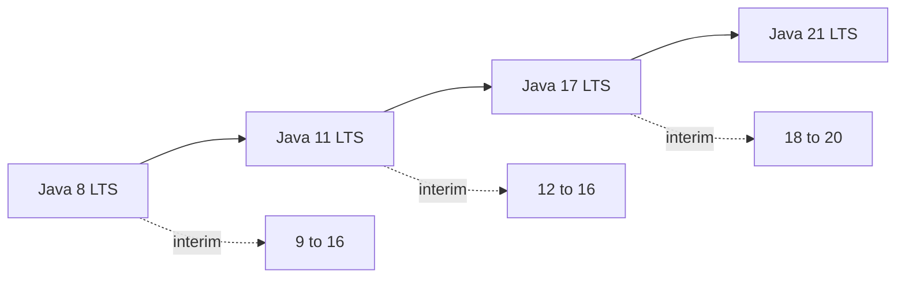

Interviewers use this topic to check you've kept current and can lead a version upgrade. You don't need every JEP — you need the features that changed how people write Java, plus what breaks on the way from 8 to 17 or 21. Baseline here is Java 17.

## The LTS cadence

Since Java 9, a new version ships every six months, but only some are **Long-Term Support (LTS)** releases that companies actually standardise on: **8, 11, 17, 21**. Most shops run an LTS and skip the interim releases, so "we're on 8, planning to move to 17 or 21" is the common real-world story. The interim releases still matter because that's where features *preview* and mature — records previewed in 14, went final in 16, and only reached an LTS in 17 — so knowing the cadence explains why a feature you associate with 21 may have been usable earlier behind `--enable-preview`.



> [!KEY]
> The interview-relevant versions are the LTS ones — 8, 11, 17, 21. Know what each *added* and what upgrading *breaks*, not every six-month release.

## What each release added

The features worth naming, grouped by release:

| Version | Headline features |
|---|---|
| 8 | Lambdas, Streams, `Optional`, default methods, `java.time`, `CompletableFuture`, metaspace replaces PermGen |
| 9 | Modules (JPMS), `List.of`/`Map.of` factories, private interface methods, `Stream.takeWhile`/`dropWhile`/`ofNullable`, G1 default, JShell |
| 10 | `var` local variable type inference |
| 11 (LTS) | HTTP client, `String.strip`/`isBlank`/`repeat`/`lines`, `Files.readString`, single-file source launch, `Collection.toArray(IntFunction)`, ZGC experimental, JFR open-sourced |
| 12–13 | Switch expressions (preview), text blocks (preview) |
| 14 | Records (preview), helpful `NullPointerException`s, pattern matching for `instanceof` (preview) |
| 15 | Sealed classes (preview), text blocks final |
| 16 | Records final, `instanceof` pattern matching final, `Stream.toList`, `Stream.mapMulti` |
| 17 (LTS) | Sealed classes final, pseudo-random generator interfaces, strong encapsulation of JDK internals |
| 18–20 | Simple web server, UTF-8 by default, virtual threads + structured concurrency (preview) |
| 21 (LTS) | Virtual threads, record patterns, pattern matching for `switch`, sequenced collections, generational ZGC; string templates and scoped values (preview) |

### Java 8 — the big bang

Java 8 is still the most-quizzed release because it changed the language's style. Lambdas and the `Stream` API brought functional pipelines; `Optional` gave a type-level "maybe"; **default methods** let interfaces evolve without breaking implementers; `java.time` finally replaced the broken `Date`/`Calendar`; and `CompletableFuture` made async composition possible.

The two things interviewers dig into here are stream laziness and `Optional` discipline. Streams are lazy: intermediate operations like `filter` and `map` build up a pipeline and nothing runs until a terminal operation (`collect`, `toList`, `forEach`, `reduce`) pulls elements through, which is what lets streams short-circuit and process elements one at a time rather than materialising intermediate collections. `Optional` is meant as a **return type** signalling "may be absent" — using it as a field or method parameter, or calling `.get()` without checking, are the anti-patterns a senior candidate flags. `java.time` matters because `Date`/`Calendar` were mutable and not thread-safe, and its immutable `Instant`, `LocalDate` and `Duration` types remove a whole class of bugs.

```java
List<String> names = users.stream()
    .filter(u -> u.active())
    .map(User::name)
    .sorted()
    .toList();                      // Stream.toList since Java 16
```

### Java 9–11 — modules, var, and a real stdlib boost

Java 9 added JPMS and immutable collection factories. Java 10 added `var`. Java 11 — the first LTS after 8 — is a genuinely attractive upgrade target: a built-in HTTP client, many `String` helpers, single-file execution (`java Hello.java` with no compile step), and ZGC.

Java 11 is where many teams jumped from 8 because it delivers real ergonomic wins without the language upheaval of later releases. The `HttpClient` replaces the ancient `HttpURLConnection` with a modern, fluent, async-capable API supporting HTTP/2, so projects could drop a third-party HTTP dependency. The `String` additions (`strip` which is Unicode-aware unlike `trim`, `isBlank`, `repeat`, `lines`) and `Files.readString`/`writeString` remove common boilerplate. Single-file source launch made Java viable for quick scripts. The immutable `List.of`/`Map.of`/`Set.of` factories from Java 9 are worth calling out too: they return compact, unmodifiable collections and throw on null elements, so they're a concise safe default for constants.

```java
var client = HttpClient.newHttpClient();      // var + Java 11 HTTP client
var req = HttpRequest.newBuilder(uri).build();
var res = client.send(req, BodyHandlers.ofString());
System.out.println("  hi  ".strip());         // Java 11
```

### Java 12–17 — the pattern-matching era

A cluster of features previewed and became final across 12–17: switch expressions in **14**, text blocks in **15**, records and `instanceof` pattern matching in **16**, and sealed classes in **17**. Together they make Java far more expressive for modelling data, and Java 17 is the LTS where the whole set is available without preview flags.

Two smaller Java 14 additions pay off daily. **Helpful NullPointerExceptions** now tell you exactly which variable was null in a chained expression (`a.b().c` says whether `a` or `b()` was null), turning a guessing game into a one-line fix. **Text blocks** (final in 15) let you write multi-line strings — SQL, JSON, HTML — without escaping newlines or concatenating, which removes a real source of errors in embedded queries.

```java
String kind = switch (day) {                  // switch expression, arrow, yields a value
    case SAT, SUN -> "weekend";
    default -> "weekday";
};
```

### Java 21 — virtual threads and pattern matching for switch

The current LTS. **Virtual threads** make blocking code scale to millions of concurrent tasks cheaply. **Pattern matching for `switch`** and **record patterns** enable exhaustive, deconstructing switches over sealed hierarchies. **Sequenced collections** add a common interface with `getFirst`/`getLast`/`reversed`.

Virtual threads are the headline because they change how you write concurrent server code. A traditional platform thread maps 1:1 to an OS thread and costs around a megabyte of stack, so you can only have a few thousand; a virtual thread is scheduled by the JVM onto a small pool of carrier threads and costs almost nothing, so you can run millions. Crucially, when a virtual thread blocks on I/O the JVM unmounts it and reuses the carrier, so ordinary blocking, imperative code — `var body = httpClient.send(...)` — scales like async code without callbacks or reactive frameworks. The senior caveat: virtual threads help I/O-bound workloads, not CPU-bound ones, and you should avoid pinning them by holding locks across blocking calls.

```java
sealed interface Shape permits Circle, Square {}
record Circle(double r) implements Shape {}
record Square(double s) implements Shape {}

double area = switch (shape) {                 // exhaustive, no default needed (Java 21)
    case Circle(double r) -> Math.PI * r * r;  // record pattern deconstructs
    case Square(double s) -> s * s;
};
```

> [!TIP]
> When asked "what's new in modern Java", lead with the *theme* per era: 8 = functional style, 11 = better stdlib + HTTP, 17 = data modelling (records/sealed/switch), 21 = concurrency (virtual threads) + pattern matching. That framing beats reciting JEP numbers.

## What actually breaks upgrading from 8

This is the senior question — not the feature list, but the migration pain.

| Break | Cause | Fix |
|---|---|---|
| `ClassNotFoundException` for `javax.xml.bind`, `java.xml.ws` | Java EE modules removed in Java 11 | Add the artifacts (JAXB, JAX-WS) as explicit dependencies |
| `InaccessibleObjectException` | Strong encapsulation of JDK internals (17) | `--add-opens module/package=ALL-UNNAMED`, or upgrade the library |
| Reflective-access warnings become errors | Illegal reflective access locked down | Update reflection-heavy libs (old Hibernate, Spring, Mockito) |
| CMS collector flags fail to start | CMS removed in Java 14 | Move to G1 (default) or ZGC |
| Nashorn scripts stop working | JavaScript engine removed in Java 15 | Migrate to GraalVM JS or remove |
| `SecurityManager` warnings | Deprecated for removal (17) | Stop relying on it; it's on the way out |

```bash
# Typical flags carried through a Java 8 -> 17 migration
java --add-opens java.base/java.lang=ALL-UNNAMED \
     --add-opens java.base/java.util=ALL-UNNAMED \
     -jar legacy-app.jar
```

> [!WARNING]
> Most "our app won't start on 17" failures aren't language changes — they're **removed `javax` modules** and **illegal reflective access** in old dependency versions. The real work of an 8→17 upgrade is bumping libraries and adding `--add-opens`, not rewriting your code.

> [!DANGER]
> Don't paper over every `InaccessibleObjectException` with more `--add-opens` and move on. Each one is a library reaching into JDK internals that a future release may close entirely. Treat `--add-opens` as a temporary bridge while you upgrade the offending dependency.

## Cheat sheet

- LTS releases are 8, 11, 17, 21 — those are the ones companies run and interviews target.
- Java 8: lambdas, streams, `Optional`, default methods, `java.time`, `CompletableFuture`.
- Java 9: modules, `List.of`/`Map.of`, `takeWhile`/`dropWhile`; Java 10: `var`.
- Java 11: HTTP client, `String` helpers, single-file source launch, ZGC.
- Java 17: sealed classes final, strong encapsulation; records and `instanceof` patterns are already final and available in this LTS.
- Java 21: virtual threads, pattern matching for `switch`, record patterns, sequenced collections.
- `Stream.toList()` (16) is shorter than `collect(Collectors.toList())` and returns an unmodifiable list.
- Upgrading 8→17 mostly breaks on removed `javax` modules and illegal reflective access.
- `--add-opens` is the migration bridge; fixing the dependency is the real fix.
- CMS, Nashorn and `SecurityManager` are gone or going — don't depend on them.

## Common mistakes

| Mistake | Fix |
|---|---|
| Listing random JEP numbers when asked "what's new" | Give the theme per LTS era: functional, stdlib, data modelling, concurrency |
| Assuming an 8→17 upgrade needs code rewrites | It's mostly dependency bumps plus `--add-opens` |
| Treating `--add-opens` as a permanent fix | Use it as a bridge; upgrade the library that reflects into internals |
| Expecting `javax.xml.bind` to exist on Java 11+ | Add JAXB/JAX-WS as explicit dependencies |
| Keeping CMS GC flags after Java 14 | Remove them; use G1 or ZGC |
| Thinking `var` makes Java dynamically typed | `var` is compile-time inference; the type is still static and fixed |

## Summary

Modern Java splits neatly by LTS era: 8 introduced the functional style, 11 modernised the standard library and added an HTTP client, 17 made the records, sealed classes and `instanceof` pattern-matching era available on an LTS, and 21 brought virtual threads plus pattern matching for `switch`. For interviews, know the theme of each release rather than every JEP. The genuinely senior part is the upgrade story — moving from 8 to 17 or 21 mainly breaks on removed `javax` modules and locked-down reflective access, which you bridge with explicit dependencies and `--add-opens` while upgrading the libraries that caused it.

## Top Interview Questions

### Q1. What are the LTS versions of Java and why do they matter?

Since Java 9 a release ships every six months, but only Long-Term Support versions — 8, 11, 17 and 21 — receive years of updates, so those are what companies standardise on and skip the interim releases. It matters because production teams don't chase every six-month drop; they run an LTS and plan occasional jumps between them, which is why interview questions and real migrations centre on "8 to 17" or "17 to 21". Knowing the cadence signals you understand how Java is actually operated: pick an LTS, get security patches for years, and upgrade deliberately rather than continuously. Naming 8/11/17/21 correctly is a quick credibility check.

### Q2. What were the headline features of Java 8 and why was it such a big deal?

Java 8 changed the language's idiom. Lambdas and method references brought first-class functions; the Stream API enabled declarative, pipelined collection processing; `Optional` gave a type-level way to express "value may be absent" instead of returning null; default methods let interfaces gain new methods without breaking every implementer (which is how `Collection` got `stream()`); `java.time` finally replaced the error-prone, mutable `Date`/`Calendar`; and `CompletableFuture` made composable asynchronous code possible. It also replaced PermGen with metaspace. It's still the most-quizzed release because so much modern Java style — functional pipelines, `Optional`, immutable date/time — originates there.

### Q3. What does `var` do, and what doesn't it do?

`var` (Java 10) is local-variable type inference: the compiler infers the static type from the initializer, so `var list = new ArrayList<String>()` is exactly `ArrayList<String> list = ...`. It reduces boilerplate for long generic types and is handy with the Java 11 HTTP client. What it does *not* do is make Java dynamically typed — the type is fixed at compile time and can never change, unlike JavaScript's `var`. It only works for local variables with an initializer (not fields, method parameters, or `null` initialisers), and overusing it can hurt readability when the inferred type isn't obvious from the right-hand side. The senior point: it's purely syntactic inference, not runtime dynamism.

### Q4. Which features arrived across Java 12–17 and what problem do they solve together?

Switch expressions, text blocks, records, `instanceof` pattern matching and sealed classes matured across the releases leading to Java 17: switch expressions became final in 14, text blocks in 15, records and `instanceof` patterns in 16, and sealed classes in 17. Together they make Java much better at modelling and processing data. Records remove boilerplate for immutable value carriers; sealed classes let you declare a closed set of subtypes; pattern matching for `instanceof` removes the redundant cast after a type check; switch expressions return values concisely; and text blocks make multi-line strings readable. Combined — a sealed interface of records, deconstructed in a switch — they give Java lightweight algebraic data types. So the theme of the 12–17 era is expressive, safe data modelling, which is exactly what the Java 21 record patterns and switch patterns build on.

### Q5. What are the flagship additions in Java 21?

Java 21 is an LTS whose headline is virtual threads: lightweight, JVM-scheduled threads that let straightforward blocking code scale to millions of concurrent tasks, largely removing the need for reactive contortions for I/O-bound work. It also finalises pattern matching for `switch` and adds record patterns, enabling exhaustive, deconstructing switches over sealed hierarchies with no `default` branch, plus guarded patterns with `when`. Sequenced collections add a uniform interface with `getFirst`, `getLast` and `reversed`. Generational ZGC lands for lower-overhead low-pause GC. String templates and scoped values arrive as previews. The two themes to name are concurrency (virtual threads) and pattern matching, which mark 21 as the biggest language step since 8.

### Q6. You're asked to lead an upgrade from Java 8 to 17. What actually breaks?

Most breakage isn't language changes — it's the platform tightening. Removed Java EE modules mean `javax.xml.bind` (JAXB) and `java.xml.ws` (JAX-WS) vanish, so anything using them fails with `ClassNotFoundException` until you add them as explicit dependencies. Strong encapsulation of JDK internals turns illegal reflective access into hard `InaccessibleObjectException` failures, hitting older versions of Hibernate, Spring, Mockito and similar, which you fix by upgrading those libraries or adding `--add-opens`. Removed collectors (CMS, gone in 14) break old GC flags. Nashorn's removal breaks embedded JavaScript. So the plan is: bump dependencies first, catalogue reflective-access failures and bridge them with `--add-opens`, replace dead GC flags with G1/ZGC, and only then look at code — which usually needs little change.

### Q7. What is `--add-opens` and when do you use it?

`--add-opens module/package=target` reopens a specific package of a module for deep reflection at runtime, granting access that Java 16+ strong encapsulation otherwise denies. You use it during migrations when a framework or library calls `setAccessible(true)` on JDK internals (commonly `java.base/java.lang` or `java.util`) and now throws `InaccessibleObjectException`. It's the supported bridge to keep an app running while you upgrade the offending dependency to a version that no longer reflects into internals. The caution to voice: it's a temporary escape hatch, not a fix — each `--add-opens` marks a dependency reaching into internals that a future JDK may close entirely, so track and retire them rather than accumulating them forever.

### Q8. What's the difference between `Stream.collect(Collectors.toList())` and `Stream.toList()`?

`Stream.toList()` arrived in Java 16 as a concise terminal operation. Beyond being shorter, it returns an **unmodifiable** list, whereas `collect(Collectors.toList())` historically returns a mutable `ArrayList` (though that's an implementation detail you shouldn't rely on). So `toList()` is the better default when you want an immutable result and don't need to specify the concrete collection type, and it reads more cleanly in a pipeline. Use `collect(Collectors.toCollection(...))` when you genuinely need a specific mutable collection type. It's a small but frequently-asked distinction because people get caught trying to mutate a `toList()` result and hitting `UnsupportedOperationException`.

### Q9. Why were sealed classes and records added, and how do they work together?

Records give you concise immutable value carriers — the compiler generates the fields, constructor, accessors, `equals`, `hashCode` and `toString`. Sealed classes let a type declare exactly which classes may extend or implement it via `permits`, closing the hierarchy. Individually useful, together they model algebraic data types: a sealed interface plus a fixed set of record implementations describes a closed set of shapes — like a payment result being exactly `Approved`, `Declined` or `Pending`. Because the set is closed, a `switch` over it in Java 21 can be checked for exhaustiveness by the compiler, so you don't need a `default` and adding a new case forces you to update every switch. That compiler-enforced completeness is the payoff, and it's why 17 and 21 pair these features.

### Q10. Your app runs on Java 8 and won't start on 17 with an `InaccessibleObjectException`. How do you handle it?

First I'd read the exception to see which module and package are being reflected into and which library is doing it — the stack trace usually names the framework. The immediate unblock is to add the matching `--add-opens module/package=ALL-UNNAMED` so the app starts, but I treat that as temporary. The real fix is to upgrade the offending dependency to a version built for the module system, since maintained releases of Spring, Hibernate, Mockito and others stopped reaching into internals. I'd audit all such failures at once, add the minimum `--add-opens` set to get green, then track each one as tech debt to remove as dependencies are upgraded — because a future JDK may close those packages entirely and the flag will stop working.
