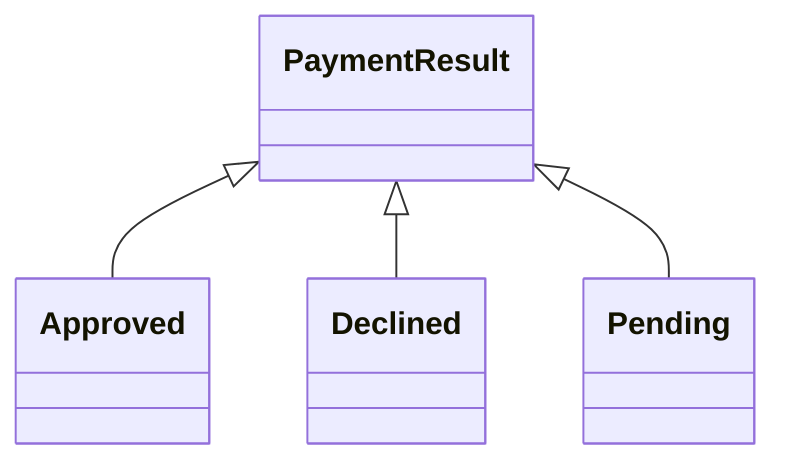

Records, sealed types and pattern matching are the features that make Java 17–21 feel modern. Interviewers use them to check you can model data cleanly and know when the new style beats classic inheritance. Baseline is Java 17, with Java 21 features called out explicitly.

The through-line is that these three features are designed to work together: records model the *data*, sealed types close the *set of shapes*, and pattern matching *consumes* that closed set safely. Learn them as a trio and you can answer the "how would you model X" design questions cleanly.

## Records

A `record` is a transparent carrier for immutable data. From one line, the compiler generates **private final fields**, a **canonical constructor**, **accessors named after the components** (`name()`, not `getName()`), and value-based `equals`, `hashCode` and `toString`.

The word "transparent" is the key idea: a record's API is exactly its state, so there's nothing hidden to get out of sync. That's why records eliminate the most tedious and bug-prone boilerplate in Java — hand-written `equals`/`hashCode` that drift when a field is added, and `toString` that forgets a field. Records are **shallowly** immutable: their component fields are final, but a mutable component like `List` can still be changed unless you defensively copy it. When the components are immutable or copied, records are safe to share across threads and to use as map keys.

```java
record Point(int x, int y) {}
// The compiler generates: private final fields x, y;
// Point(int x, int y); int x(); int y(); equals; hashCode; toString.
var p = new Point(3, 4);
p.x();                       // accessor is x(), not getX()
new Point(3, 4).equals(p);   // true — value equality, not identity
```

### Compact constructors and validation

A **compact constructor** validates or normalises without re-listing the parameters. You can also add static factories and implement interfaces.

```java
record Money(BigDecimal amount, String currency) implements Comparable<Money> {
    Money {                                           // compact constructor
        if (amount.signum() < 0) throw new IllegalArgumentException("negative");
        amount = amount.stripTrailingZeros();         // normalise before assignment
    }
    static Money zero(String ccy) { return new Money(BigDecimal.ZERO, ccy); }
    public int compareTo(Money o) { return amount.compareTo(o.amount); }
}
```

### Restrictions and when not to use a record

Records are **implicitly final**, cannot extend another class (they already extend `Record`), and cannot declare extra **instance** fields beyond the components — though static fields and methods are fine. They serialise based on their components.

| Use a record for | Avoid a record for |
|---|---|
| DTOs and API request/response bodies | JPA entities that need mutability and a no-arg constructor |
| Value objects (`Money`, `Point`, coordinates) | Objects with identity or lifecycle beyond their data |
| Immutable map keys and multi-value returns | Anything a framework must mutate via setters |
| Carriers in a sealed hierarchy | Deep inheritance hierarchies |

> [!WARNING]
> Records make poor JPA entities: JPA needs a no-arg constructor and mutable fields for lazy loading and dirty tracking, both of which records forbid. Use records for DTOs and projections, keep entities as ordinary mutable classes.

## Sealed types

A `sealed` interface or class names exactly which types may extend it via `permits`. Every permitted subtype must itself be `final`, `sealed`, or `non-sealed`, and must live in the same module (or same package for the unnamed module).

```java
sealed interface PaymentResult permits Approved, Declined, Pending {}
record Approved(String txnId) implements PaymentResult {}
record Declined(String reason) implements PaymentResult {}
record Pending(String ref) implements PaymentResult {}
```

The payoff is a **closed set** the compiler knows in full. That enables **exhaustiveness checking**: a switch over `PaymentResult` that handles all three cases needs no `default`, and adding a fourth subtype makes every such switch fail to compile until you handle it — the compiler becomes your checklist.

Sealing also documents intent in a way an open interface can't. An ordinary interface says "anyone may implement this"; a sealed interface says "these are the only implementations that will ever exist," which is exactly the guarantee you want for a domain concept like a payment outcome or an order state. The `permits` clause can be omitted when all subtypes live in the same file, and each subtype still has to opt into how it continues the hierarchy — `final` to stop it, `sealed` to keep it closed one level deeper, or `non-sealed` to deliberately reopen it to arbitrary extension.



## Algebraic data types in Java

A sealed interface plus records is the idiomatic way to model a **closed hierarchy** — the functional world calls this a sum type. It's perfect for a payment result, a parse outcome, a UI state, or an expression tree.

```java
sealed interface Expr permits Num, Add, Mul {}
record Num(double v) implements Expr {}
record Add(Expr left, Expr right) implements Expr {}
record Mul(Expr left, Expr right) implements Expr {}
```

Each variant carries only its own data, and the sealing guarantees you've enumerated them all. That closed set is exactly what pattern matching consumes.

The practical value shows up in code review and refactoring. Because the compiler knows the complete list of variants, it can prove a `switch` is exhaustive, so you can delete the defensive `default: throw new IllegalStateException(...)` branches that used to guard `instanceof` chains and enum switches. More importantly, when a teammate later adds a `Sub` variant to the `Expr` hierarchy, every switch that doesn't yet handle `Sub` becomes a compile error, pointing them at exactly the code that needs updating. This turns "did I remember to update all the places?" from a manual, error-prone audit into a guarantee the compiler enforces — which is the single biggest reason to model closed domains this way.

## Pattern matching

### For `instanceof`

Pattern matching for `instanceof` (final in 16) binds the cast result to a variable, removing the redundant cast.

```java
// Before
if (obj instanceof String) { String s = (String) obj; return s.length(); }
// After
if (obj instanceof String s) return s.length();   // s is in scope and typed
```

### For `switch` (Java 21)

Pattern matching for `switch` matches on **type patterns**, supports **guarded patterns** with `when`, handles `null` explicitly, and is **exhaustiveness-checked** over sealed types so you can drop `default`.

A couple of subtleties are worth stating out loud in an interview. Case order matters: a more specific or guarded case must come before a broader one that would also match, or the compiler rejects it as dominated. And `null` handling changed — a traditional `switch` throws `NullPointerException` on a null selector, but a pattern `switch` lets you write an explicit `case null` (optionally combined as `case null, default`), so null becomes a handled branch rather than a crash. That explicitness is safer than the old implicit throw, but only if you remember to include it.

```java
String describe(PaymentResult r) {
    return switch (r) {                              // Java 21
        case Approved a -> "ok " + a.txnId();
        case Declined d when d.reason().isBlank() -> "declined";
        case Declined d -> "declined: " + d.reason(); // guarded case first
        case Pending p -> "pending " + p.ref();
        case null -> "no result";                    // null handled in-switch
    };                                               // no default: compiler proves completeness
}
```

> [!KEY]
> Sealed + records + switch give compiler-checked exhaustiveness. Add a new subtype and every switch that forgot it stops compiling — the completeness guarantee is the whole point, and it's why you omit `default`.

### Record patterns and nested deconstruction

**Record patterns** (Java 21) deconstruct a record directly in the pattern, and they nest.

```java
double eval(Expr e) {
    return switch (e) {
        case Num(double v) -> v;
        case Add(Expr l, Expr r) -> eval(l) + eval(r);   // deconstructs Add
        case Mul(Expr l, Expr r) -> eval(l) * eval(r);
    };
}
// Nested: case Add(Num(var a), Num(var b)) -> a + b;  matches Add of two Nums
```

## Before and after — killing an instanceof chain

The classic refactor an interviewer loves: an `instanceof` ladder or a verbose visitor becomes a compact, exhaustive switch. The old visitor pattern existed largely to work around Java's lack of pattern matching — it added a `visit` method per type and forced every operation into a separate visitor class. Record patterns and sealed switches make most visitors obsolete: the operation lives in one readable method, and exhaustiveness is checked without the boilerplate.

```java
// Before: fragile, no exhaustiveness, easy to forget a type
String render(Shape s) {
    if (s instanceof Circle) { Circle c = (Circle) s; return "circle " + c.r(); }
    else if (s instanceof Square) { Square sq = (Square) s; return "square " + sq.side(); }
    else throw new IllegalStateException("unknown shape"); // runtime failure if a type is added
}

// After: exhaustive, deconstructing, checked at compile time
String render(Shape s) {
    return switch (s) {
        case Circle(double r) -> "circle " + r;
        case Square(double side) -> "square " + side;
    };
}
```

Text blocks pair naturally with this style when a case builds multi-line output:

```java
String json = """
    {
      "type": "circle",
      "r": %s
    }""".formatted(r);          // Java 15 text block, no escaped newlines
```

## When old-school polymorphism is still better

Pattern matching is not always the right answer.

> [!TIP]
> Prefer a `switch` when behaviour lives *outside* the types (serialisers, mappers, one-off transformations) and you want the compiler to force you to handle every case. Prefer classic polymorphism — a method overridden per subtype — when behaviour lives *with* the data, when the hierarchy is **open** to third-party extension, or when the same operation is called from many places. A `switch` you'd have to duplicate across the codebase is a sign the logic belongs in the type as a method.

> [!DANGER]
> Don't reach for pattern-matching `switch` on a hierarchy that third parties are meant to extend. Sealing closes it deliberately; if extensibility is the goal, an open interface with polymorphic methods is the correct design, and forcing a switch fights the language.

## Cheat sheet

- A `record` generates fields, canonical constructor, component accessors, `equals`, `hashCode`, `toString`.
- Accessors are `x()`, not `getX()`; equality is value-based.
- Compact constructors validate and normalise; static factories and interfaces are allowed.
- Records are implicitly final, can't extend, and can't add instance fields — bad JPA entities.
- `sealed ... permits` closes a hierarchy; subtypes must be `final`, `sealed`, or `non-sealed`.
- Sealed interface + records = algebraic data type (sum type) for closed hierarchies.
- `instanceof` patterns remove the cast; `switch` patterns (21) add `when` guards and `null` cases.
- Sealed + switch gives compiler-checked exhaustiveness, so you can omit `default`.
- Record patterns deconstruct records and nest, replacing instanceof chains and visitors.
- Keep polymorphic methods when the hierarchy is open or behaviour belongs with the data.

## Common mistakes

| Mistake | Fix |
|---|---|
| Using a record as a JPA entity | Records forbid the no-arg constructor and mutability JPA needs — use a class |
| Calling `getX()` on a record | Component accessors are named `x()`, matching the component |
| Adding a `default` to an exhaustive sealed switch | Omit it so adding a subtype forces a compile error |
| Trying to extend a record or add instance fields | Records are final and fixed to their components; use composition |
| Sealing a hierarchy meant for third-party extension | Use an open interface with polymorphic methods instead |
| Forgetting the `null` case in a pattern switch | Handle `case null` explicitly or the switch throws `NullPointerException` |

## Summary

Records give concise, shallowly immutable value carriers with generated equality and accessors; sealed types close a hierarchy so the compiler knows every subtype; and pattern matching consumes that closed set with type patterns, guards, `null` handling and record deconstruction. Combined, a sealed interface of records switched over exhaustively is Java's take on algebraic data types, and it replaces fragile `instanceof` ladders and boilerplate visitors with compiler-checked completeness. The judgement call an interviewer wants is knowing the limits: records aren't JPA entities, record components may still need defensive copies, and pattern-matching `switch` is wrong for open hierarchies where polymorphic methods and extensibility still win.

## Top Interview Questions

### Q1. What does the compiler generate for a record, and how is it different from a normal class?

For `record Point(int x, int y)` the compiler generates two private final fields, a canonical constructor taking all components, an accessor per component named exactly after it (`x()`, `y()`), and value-based `equals`, `hashCode` and `toString`. So two records with equal components are `equals` and share a hash, unlike a normal class whose default equality is identity. A record is implicitly final, implicitly extends `java.lang.Record`, and can't declare extra instance fields. The intent is a transparent, immutable data carrier: you describe the data once and get the boilerplate for free, whereas a normal class leaves you to write and maintain all of that by hand, which is where bugs in `equals`/`hashCode` usually creep in.

### Q2. What is a compact constructor and when do you use it?

A compact constructor is a record's canonical constructor written without the parameter list — you just write the record name followed by a body. Inside it you validate and normalise the incoming components before they're assigned to the fields; assigning to a parameter (e.g. `amount = amount.stripTrailingZeros()`) updates what gets stored. It's the idiomatic place to enforce invariants — reject a negative amount, trim a string, defensively copy a mutable component — without repeating the full parameter list or the field assignments. You use it whenever a record needs more than "store exactly what was passed", which is common for value objects like `Money` or a validated `EmailAddress`. It keeps the guarantee that a constructed record is always valid.

### Q3. When is a record the wrong choice?

When the object isn't an immutable value. The clearest case is JPA entities: an entity needs a no-arg constructor, mutable fields for setters, and often non-final fields so the ORM can proxy and lazily load — records forbid all of that. Records are also wrong for objects with identity or a lifecycle beyond their data, for anything a framework mutates via setters, and for deep inheritance hierarchies since records can't extend a class. And a record's transparency (public accessors for every component) is a downside if you need to hide internal representation. The rule of thumb: records for DTOs, projections, value objects and multi-value returns; ordinary classes for entities, mutable domain objects, and anything needing encapsulated or evolving state.

### Q4. What are sealed classes and what constraint do they place on subtypes?

A sealed class or interface uses `permits` to declare the exact, finite set of types allowed to extend or implement it. Each permitted subtype must be declared `final` (no further extension), `sealed` (continues a controlled hierarchy), or `non-sealed` (deliberately reopened), and must reside in the same module — or same package in the unnamed module — so the compiler can see the whole hierarchy. The effect is a closed type: the compiler knows every possible subtype. That unlocks exhaustiveness checking in a `switch`, and it documents intent — "these are the only payment results that exist." It's the opposite of an open interface; you use it precisely when you want to forbid arbitrary extension and reason about a complete set of cases.

### Q5. How do records and sealed types combine to model data, and why is that useful?

Together they give algebraic data types — specifically sum types. A sealed interface enumerates the closed set of variants, and each variant is a record carrying just its own data: `sealed interface PaymentResult permits Approved, Declined, Pending`, with each a record. This models "a value that is exactly one of these shapes" precisely, which fits payment outcomes, parse results, UI states and expression trees. The usefulness is twofold: the data is self-documenting and immutable, and because the set is closed the compiler can verify a `switch` handles every case. Add a new variant and every exhaustive switch stops compiling until updated, so the compiler enforces that you handle the new case everywhere — turning a class of runtime bugs into compile errors.

### Q6. How does pattern matching for `switch` improve on an `instanceof` chain?

An `instanceof` chain is verbose and unsafe: each branch tests a type, casts, and binds a variable by hand, and there's no check that you covered every type, so a forgotten case fails at runtime. Pattern matching for `switch` (Java 21) collapses this into type-pattern cases that bind the variable automatically (`case Circle c ->`), supports guards with `when` for conditional matching, handles `null` explicitly, and — over a sealed hierarchy — is checked for exhaustiveness so no `default` is needed. The result is shorter, safer, and self-maintaining: adding a subtype forces the compiler to flag every switch that hasn't handled it. It converts a runtime "unknown type" failure into a compile-time error, which is exactly the safety senior engineers want.

### Q7. What are record patterns and how do they help?

Record patterns (Java 21) let a `switch` or `instanceof` deconstruct a record directly in the pattern, binding its components to variables in one step: `case Add(Expr l, Expr r) ->` matches an `Add` and pulls out `l` and `r` without calling accessors. They nest, so `case Add(Num(var a), Num(var b))` matches an `Add` of two `Num`s and binds their inner values, which is powerful for walking tree structures like expressions or ASTs. This removes the accessor boilerplate you'd otherwise write after matching a type and makes recursive processing read almost like the data's shape. Combined with sealed hierarchies and exhaustiveness checking, record patterns are what make pattern matching a genuine alternative to the visitor pattern in Java.

### Q8. When is classic OO polymorphism still the better choice over a pattern-matching switch?

When behaviour naturally belongs with the data and the hierarchy should stay open. If each subtype has its own implementation of an operation that's called from many places — `render()`, `area()`, `validate()` — putting it as an overridden method keeps related code together and lets you add a new subtype without touching call sites. It's also required when third parties are meant to extend the type: you can't seal it, so exhaustiveness checking doesn't apply and a switch would silently miss new types. Pattern-matching switches shine when the behaviour lives *outside* the types — serialisation, mapping, a one-off transformation — and you want the compiler to force handling of every case. If you'd duplicate the same switch in many files, that logic probably belongs as a method on the type.

### Q9. You have a `Shape` interface with an `instanceof` chain that keeps breaking when someone adds a shape. How would you make it safe?

The problem is the open hierarchy plus the manual chain gives no compile-time guarantee that every shape is handled, so a new shape slips through to the runtime `else` and fails in production. I'd seal the hierarchy — `sealed interface Shape permits Circle, Square, ...` with each shape a record — so the compiler knows the complete set. Then I'd replace the `instanceof` chain with a pattern-matching `switch` using record patterns and no `default`. Now the compiler enforces exhaustiveness: the moment someone adds `Triangle` to `permits`, every switch that doesn't handle it fails to compile, pointing them straight at the code to update. The fragile runtime failure becomes an unmissable compile error, and the code is shorter and deconstructs each shape's data inline.

### Q10. How does a record behave with serialisation, and what should you watch for?

Records have well-defined serialisation based on their components: the canonical constructor is invoked on deserialisation, so the same validation and normalisation in your compact constructor runs, meaning you can't deserialise a record into an invalid state the way you can bypass constructors with normal `Serializable` classes. That's a genuine safety improvement. With JSON libraries like Jackson, modern versions map records cleanly using the component names, though very old versions needed the parameter-names module or explicit annotations because there are no setters. The things to watch: components must themselves be serialisable, defensively copy mutable components in the compact constructor so the record stays effectively immutable, and remember accessors are `name()` not `getName()`, which some older framework configurations expect.
