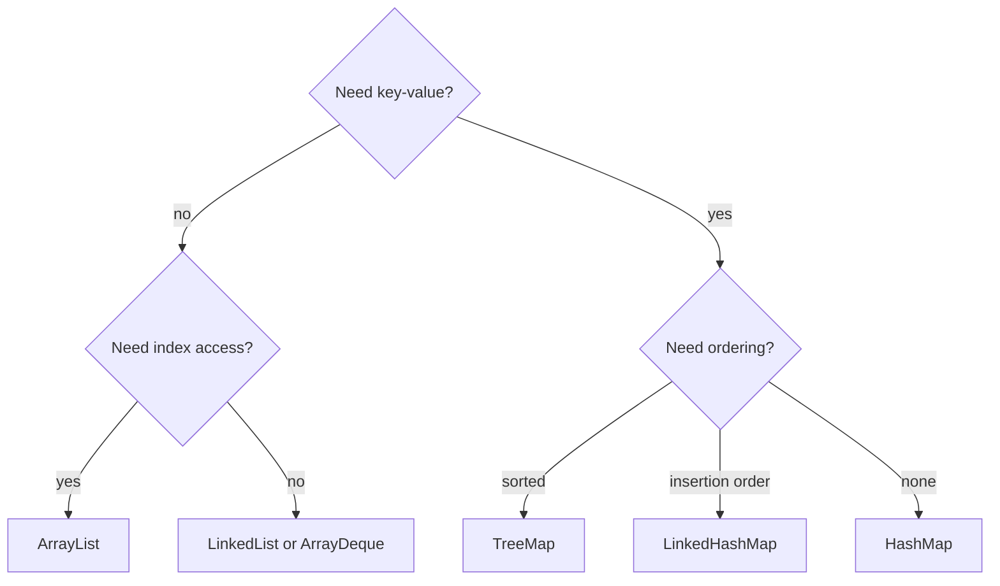
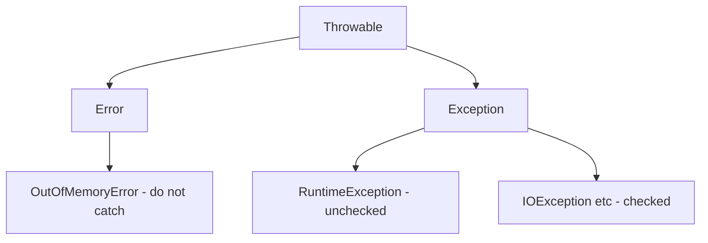

This is a revision page, not an essay — the short, high-frequency "what's the difference between X and Y" questions that open almost every Java interview. Answers are one to three sentences; each row also names the deep-dive the interviewer usually asks next. Baseline is Java 17.

Use it as a flashcard deck: cover the right column, read the question, and say your answer out loud before checking. The goal is recall speed — these questions are scored on whether you answer instantly and correctly, not on depth, and hesitating on `==` versus `equals` sets a poor tone for the rest of the interview.

## Language basics

These are the warm-up questions almost every interview opens with. Answer in one crisp sentence and stop — over-explaining a trivial distinction reads as nervous.

| Question | Short answer |
|---|---|
| `==` vs `equals` | `==` compares references (or primitive values); `equals` compares logical content. Override `equals` (and `hashCode`) for value equality. |
| `final` vs `finally` vs `finalize` | `final` = unchangeable variable/method/class; `finally` = block that always runs; `finalize` = deprecated pre-GC hook. Unrelated despite the names. |
| Overloading vs overriding | Overloading = same name, different parameters, resolved at compile time. Overriding = subclass redefines a superclass method, resolved at runtime. |
| `this` vs `super` | `this` refers to the current instance; `super` refers to the parent class's members and constructor. |
| `static` vs instance | `static` belongs to the class and is shared; instance members belong to each object. Static methods can't access instance state. |
| `throw` vs `throws` | `throw` actually raises an exception; `throws` declares in the signature that a method may propagate one. |

> [!KEY]
> The single most common trap: overriding `equals` without overriding `hashCode`. Equal objects must have equal hash codes, or `HashMap`/`HashSet` will lose them.

## Strings and immutability

Immutability and wrapper caching produce a surprising number of subtle bugs, so interviewers probe here to see if you understand object identity versus value.

| Question | Short answer |
|---|---|
| `String` vs `StringBuilder` vs `StringBuffer` | `String` is immutable; `StringBuilder` is mutable and not thread-safe; `StringBuffer` is mutable and synchronised (slower). |
| `int` vs `Integer` | `int` is a 4-byte primitive; `Integer` is a heap object wrapper (16 bytes) that can be null and is cached for values −128..127. |
| String pool and `intern()` | String literals are pooled and shared; `intern()` returns the canonical pooled instance. Since Java 7 the pool lives on the heap. |

```java
Integer a = 127, b = 127;      // from the cache
Integer c = 128, d = 128;      // new objects
System.out.println(a == b);    // true  (cached)
System.out.println(c == d);    // false (different objects) -> use .equals
```

> [!WARNING]
> `Integer` autoboxing caches −128 to 127, so `==` accidentally "works" for small values and breaks for large ones. Always compare wrappers with `.equals`, never `==`.

## OOP and types

These test whether you choose the right abstraction. The recurring theme is "state and identity versus pure behaviour", which decides most of these calls.

| Question | Short answer |
|---|---|
| Abstract class vs interface | Abstract class: single inheritance, can hold state and constructors. Interface: multiple inheritance of type, `default`/`static` methods, no instance state. |
| `record` vs class vs Lombok `@Data` | `record` = built-in immutable carrier with generated members. `@Data` = Lombok-generated boilerplate on a mutable class. Prefer records for value objects. |
| interface `default` vs `static` methods | `default` methods are inherited and overridable by implementers; `static` interface methods belong to the interface and aren't inherited. |
| Shallow vs deep copy | Shallow copy duplicates the top object but shares referenced objects; deep copy recursively clones the whole graph. |

## Collections

Collections are the densest area of rapid-fire questions because picking the wrong one is a common real-world performance bug. Know the ordering, thread-safety and complexity of each family cold.

| Question | Short answer |
|---|---|
| `ArrayList` vs `LinkedList` | `ArrayList` = array-backed, O(1) random access, cache-friendly. `LinkedList` = node-based, O(1) ends but O(n) indexing; rarely worth it. |
| `HashMap` vs `TreeMap` vs `LinkedHashMap` | `HashMap` = O(1), unordered. `TreeMap` = sorted, O(log n), red-black tree. `LinkedHashMap` = insertion (or access) order. |
| `HashMap` vs `Hashtable` vs `ConcurrentHashMap` | `HashMap` = not thread-safe, allows null. `Hashtable` = legacy, fully synchronised. `ConcurrentHashMap` = concurrent, segment/bucket-level locking, no null keys/values. |
| Fail-fast vs fail-safe iterators | Fail-fast (`ArrayList`, `HashMap`) throw `ConcurrentModificationException` on structural change. Fail-safe (`CopyOnWriteArrayList`, `ConcurrentHashMap`) iterate a snapshot/view. |
| `Comparable` vs `Comparator` | `Comparable` = natural ordering via `compareTo` inside the class. `Comparator` = external, multiple orderings, `compare(a,b)`. |
| `Stream` vs `Collection` | A `Collection` stores data; a `Stream` is a lazy, one-shot pipeline of operations over a source. Streams don't store elements. |



> [!TIP]
> When asked "`ArrayList` or `LinkedList`?", say `ArrayList` almost always — array locality beats pointer-chasing, and `ArrayDeque` beats `LinkedList` even for queue/stack use. `LinkedList`'s theoretical O(1) inserts rarely matter in practice.

## Streams and Optional

The trap in this group is eager versus lazy evaluation. Naming which method defers work — and why that matters for cost — is what separates a rehearsed answer from a real understanding.

| Question | Short answer |
|---|---|
| `map` vs `flatMap` | `map` transforms each element 1-to-1; `flatMap` transforms each element into a stream and flattens, so 1-to-many or unwrapping nested structures. |
| `orElse` vs `orElseGet` | `orElse(x)` always evaluates `x`; `orElseGet(supplier)` evaluates the supplier only when the value is absent. Use `orElseGet` for expensive defaults. |
| `Optional.of` vs `ofNullable` | `of(x)` throws if `x` is null; `ofNullable(x)` yields an empty `Optional` for null. Use `of` only when non-null is guaranteed. |

```java
// orElse eagerly calls expensiveDefault() even when value is present:
config.orElse(expensiveDefault());
// orElseGet defers it until actually needed:
config.orElseGet(() -> expensiveDefault());
```

## Exceptions

Exception questions check API-design judgement as much as syntax: when to force a caller to handle a failure, and how a class survives versioning during serialisation.

| Question | Short answer |
|---|---|
| Checked vs unchecked | Checked (`extends Exception`) must be caught or declared — recoverable conditions. Unchecked (`extends RuntimeException`) need not be — programming errors. |
| `throw` vs `throws` | `throw` raises an exception instance; `throws` declares the exception type in the method signature. |
| serialisation, `transient`, `serialVersionUID` | `Serializable` marks a class serialisable; `transient` fields are skipped; `serialVersionUID` versions the class so deserialisation can detect incompatibility. |



## Concurrency

Concurrency rapid-fire questions almost always hinge on the difference between *visibility* and *atomicity*. Keep those two words straight and most of these answer themselves.

| Question | Short answer |
|---|---|
| `volatile` vs `synchronized` vs `Atomic` | `volatile` = visibility only, no atomicity. `synchronized` = mutual exclusion + visibility. `Atomic*` = lock-free atomic ops via CAS. |
| `wait` vs `sleep` | `wait` releases the monitor lock and waits for `notify`; `sleep` holds all locks and just pauses the thread. `wait` needs a `synchronized` block. |
| `Runnable` vs `Callable` | `Runnable.run()` returns void and can't throw checked exceptions; `Callable.call()` returns a value and can throw. |
| `sleep` vs `yield` vs `join` | `sleep` pauses for a duration; `yield` hints the scheduler to let others run; `join` waits for another thread to finish. |

> [!DANGER]
> `volatile` gives visibility but **not** atomicity. `volatile int counter; counter++;` is still a race because `++` is read-modify-write. Use `AtomicInteger` or `synchronized` for compound actions.

## Frameworks and persistence

This group blends core runtime concepts with everyday framework usage. The pass-by-value question in particular is a favourite because so many candidates get the wording wrong.

| Question | Short answer |
|---|---|
| JDK vs JRE vs JVM | JVM runs bytecode; JRE = JVM + core libraries (to run apps); JDK = JRE + tools like `javac` (to build apps). |
| heap vs stack | Heap holds objects, shared and GC-managed. Stack holds per-thread frames with locals and references; freed when the method returns. |
| pass by value vs reference | Java is always pass by value. For objects the *reference* is passed by value, so you can mutate the object but not reseat the caller's variable. |
| `@Transactional` vs manual transactions | `@Transactional` declaratively wraps a method in a Spring-managed transaction; manual = explicit `begin`/`commit`/`rollback`. Declarative is cleaner but proxy-based. |

## The `equals`/`hashCode` contract

Three rules to recite: if two objects are `equals`, they must have the same `hashCode`; equal hash codes do **not** imply equality (collisions are allowed); and both must be consistent over the object's lifetime. Break the first rule and hash-based collections silently lose entries.

| Situation | Requirement |
|---|---|
| `a.equals(b)` is true | `a.hashCode() == b.hashCode()` must hold |
| `a.hashCode() == b.hashCode()` | `a.equals(b)` may be true or false |
| Object used as a `HashMap` key | Override both, and keep the fields immutable |

## Cheat sheet

- `==` compares references; `equals` compares content — override `hashCode` alongside `equals`.
- Compare `Integer`s with `.equals`; the −128..127 cache makes `==` a trap.
- `String` immutable, `StringBuilder` fast/unsafe, `StringBuffer` synchronised/slow.
- `ArrayList` over `LinkedList`; `ArrayDeque` over `LinkedList` for stacks/queues.
- `HashMap` unordered, `TreeMap` sorted, `LinkedHashMap` insertion order.
- `ConcurrentHashMap` for concurrency; `Hashtable` is legacy; `HashMap` isn't thread-safe.
- `volatile` = visibility, `synchronized` = mutual exclusion, `Atomic` = lock-free CAS.
- `wait` releases the lock and needs `synchronized`; `sleep` keeps the lock.
- `orElseGet`/`ofNullable` for laziness/null-safety; Java is always pass by value.
- Checked = recoverable and declared; unchecked = programming errors.

## Common mistakes

| Mistake | Fix |
|---|---|
| Overriding `equals` but not `hashCode` | Override both; equal objects must share a hash code |
| Comparing `Integer` with `==` | Use `.equals`; only −128..127 are cached |
| Saying Java is pass by reference | It's pass by value; the reference itself is copied |
| Using `volatile` for a counter | Use `AtomicInteger` or `synchronized` — `++` isn't atomic |
| Reaching for `LinkedList` by default | Use `ArrayList`/`ArrayDeque`; better locality |
| Using `Hashtable` or `synchronizedMap` for concurrency | Use `ConcurrentHashMap` for better scalability |

## Summary

This page is a rapid-fire lookup for the comparison questions that open Java interviews: reference versus value equality, the string trio, wrapper caching, the collection families, stream operations, exception categories, and the concurrency primitives. The pattern behind good answers is the same — state the distinction in one sentence, give the practical default, and be ready for the deep dive (why `hashCode` matters, why `volatile` isn't atomic, why Java is pass by value). Memorise the tables, then practise saying each answer out loud in under fifteen seconds so it's automatic under pressure.

## Top Interview Questions

### Q1. What is the difference between `==` and `equals`, and why must you override `hashCode` with `equals`?

`==` compares primitive values or object references — whether two variables point to the same object — while `equals` compares logical content, which is why `String` and wrapper classes override it. When you override `equals` to define value equality, you must also override `hashCode` because the collections contract requires equal objects to return equal hash codes. Hash-based structures like `HashMap` and `HashSet` first bucket by hash code and only then call `equals`; if two "equal" objects hash to different buckets, the map stores duplicates or fails to find a key you know is present. So the follow-up an interviewer asks is exactly this consistency requirement, and the safe practice is to derive both from the same immutable fields.

### Q2. Explain `String` vs `StringBuilder` vs `StringBuffer` and when to use each.

`String` is immutable, so every concatenation creates a new object — fine for a few joins, wasteful in a loop. `StringBuilder` is a mutable, resizable character buffer that's *not* synchronised, making it the default choice for building strings, especially inside loops. `StringBuffer` is the older, synchronised version: thread-safe but slower due to locking, and rarely needed because string building is almost always local to one thread. The practical rule: use `String` for fixed text, `StringBuilder` when you assemble text (particularly in loops, to avoid O(n²) allocation), and reach for `StringBuffer` only in the unusual case where one buffer is genuinely shared across threads — usually a redesign is better.

### Q3. Why is comparing `Integer` objects with `==` dangerous?

`Integer` is an object wrapper, so `==` compares references, not numeric value. Java caches boxed `Integer` instances for −128 to 127, so `Integer a = 100, b = 100; a == b` is `true` because both point at the same cached object — but `Integer a = 1000, b = 1000; a == b` is `false` because they're distinct objects. This means `==` appears to work in testing with small numbers and breaks in production with larger ones, a classic hard-to-spot bug. The fix is to always use `.equals()` (or unbox to `int` first) when comparing wrapper values. The deeper lesson is to be deliberate about autoboxing generally, since it also hides allocation and `NullPointerException` risk when unboxing a null wrapper.

### Q4. Compare `HashMap`, `TreeMap` and `LinkedHashMap`.

All three implement `Map`, but differ in ordering and performance. `HashMap` offers average O(1) `get`/`put` with no ordering guarantee — the default when you just need a map. `TreeMap` is backed by a red-black tree, keeps keys sorted by natural order or a `Comparator`, and gives O(log n) operations plus navigation methods like `floorKey`/`ceilingKey` — use it when you need sorted iteration or range queries. `LinkedHashMap` is a `HashMap` that also maintains a linked list of entries, preserving insertion order (or access order, which makes it a simple LRU cache building block) at a small memory cost. So the choice is driven by whether you need no order, sorted order, or predictable iteration order.

### Q5. What's the difference between `HashMap`, `Hashtable` and `ConcurrentHashMap`?

`HashMap` is not thread-safe and allows one null key and null values — the single-threaded default. `Hashtable` is a legacy class that synchronises every method on the whole map, so it's thread-safe but a bottleneck under contention and it forbids nulls; it's effectively obsolete. `ConcurrentHashMap` is the modern concurrent map: it allows high concurrency by locking only individual bins (and using CAS for updates) rather than the whole map, so many threads read and write in parallel, and it also disallows null keys/values so that `get` returning null unambiguously means "absent". For concurrent code you always choose `ConcurrentHashMap` over `Hashtable` or `Collections.synchronizedMap`, because it scales far better while still being safe.

### Q6. What is the difference between `volatile`, `synchronized` and atomic classes?

`volatile` guarantees visibility — a write is seen by other threads immediately and reads aren't cached in registers — and prevents certain reorderings, but it gives no atomicity, so compound operations like `x++` are still races. `synchronized` provides mutual exclusion *and* visibility: only one thread holds the monitor at a time, and it establishes happens-before ordering, but it can block threads and add contention. Atomic classes like `AtomicInteger` use compare-and-swap (CAS) to perform lock-free atomic updates such as `incrementAndGet`, offering better throughput than locking under moderate contention. The rule: `volatile` for a simple flag read/written by different threads, `Atomic*` for lock-free counters and accumulators, and `synchronized` (or explicit locks) when you must make several actions atomic together.

### Q7. Explain checked versus unchecked exceptions and when you'd use each.

Checked exceptions extend `Exception` (but not `RuntimeException`) and the compiler forces you to catch or declare them; they model recoverable, expected conditions outside your control, like `IOException` on a network failure. Unchecked exceptions extend `RuntimeException` and don't have to be declared; they model programming errors such as `NullPointerException`, `IllegalArgumentException` or `IndexOutOfBoundsException` that generally shouldn't be caught and swallowed but fixed. In API design you'd use a checked exception when the caller can reasonably recover and you want to force them to think about it, and unchecked when the failure indicates a bug or a violated precondition. Many modern frameworks (Spring, Hibernate) favour unchecked exceptions to avoid boilerplate `throws` clauses, wrapping checked ones — a common follow-up point.

### Q8. Is Java pass by value or pass by reference?

Java is always pass by value. For primitives, the value itself is copied, so changes inside a method don't affect the caller. For objects, the *reference* is passed by value — the method gets a copy of the pointer, not the variable itself. That's why you can mutate the object through that copied reference (calling a setter changes the shared object the caller also sees), but reassigning the parameter to a new object inside the method has no effect on the caller's variable, because you only changed the local copy of the reference. The precise phrasing "Java passes references by value" is what interviewers want; claiming "pass by reference" is a classic mistake they'll immediately challenge with a swap-method example.

### Q9. What's the difference between `orElse` and `orElseGet` on `Optional`, and why does it matter?

`orElse(value)` takes an already-computed default, and crucially that argument is evaluated *eagerly* — even when the `Optional` contains a value, the expression you pass has already run. `orElseGet(supplier)` takes a `Supplier` and only invokes it when the `Optional` is empty. When the default is cheap (a constant), either is fine. But when the default is expensive or has side effects — a database call, an object construction, a remote fetch — `orElse` silently does that work on every call regardless of presence, which is a real performance bug. So the rule is: use `orElseGet` for any non-trivial default. The same eager-versus-lazy distinction applies between `Optional.of` (throws on null) and `ofNullable` (tolerates null), which is the natural follow-up.

### Q10. Explain `wait` versus `sleep` and the common pitfalls.

Both pause a thread, but they behave very differently. `Object.wait()` must be called inside a `synchronized` block, releases the monitor lock so other threads can proceed, and blocks until another thread calls `notify()`/`notifyAll()` on the same monitor (or a timeout elapses). `Thread.sleep()` is a static method that pauses the current thread for a fixed duration while *holding* any locks it already owns, and involves no monitor at all. The pitfalls: calling `wait` outside `synchronized` throws `IllegalMonitorStateException`; you should always `wait` in a loop that rechecks the condition to guard against spurious wakeups; and using `sleep` for coordination is a bug because it doesn't release locks and just guesses at timing. For real coordination, prefer higher-level tools like `BlockingQueue`, `CountDownLatch` or `Condition`.

### Q11. What is the `equals`/`hashCode` contract, and what breaks if you violate it?

The contract has three parts: equal objects must return equal hash codes; unequal objects *may* share a hash code (collisions are legal); and both results must be consistent as long as the relevant fields don't change. The critical direction is the first — if two objects are `equals` but return different hash codes, hash-based collections break: a `HashMap` may store what should be the same key twice, or fail to find a value because it looks in the wrong bucket. The typical violation is overriding `equals` and forgetting `hashCode`, or computing them from different fields. The safe recipe is to derive both from the same set of immutable fields (e.g. `Objects.equals`/`Objects.hash`) and never mutate those fields while the object is a key in a hash structure.

### Q12. When would you choose an abstract class over an interface?

Choose an abstract class when subtypes share common *state* or a partial *implementation*: abstract classes can declare instance fields, constructors, and non-public members, and they enforce an "is-a" relationship with single inheritance. Choose an interface when you're defining a capability or contract that unrelated types can implement, when you need multiple inheritance of type, or when you want to expose only behaviour — interfaces can now carry `default` and `static` methods but still hold no instance state. In practice modern design leans on interfaces for flexibility (a class can implement many) and uses abstract classes when there's genuine shared implementation to inherit. The follow-up is usually "can an interface have state?" — no instance state, only constants and default methods, which is the deciding factor.
