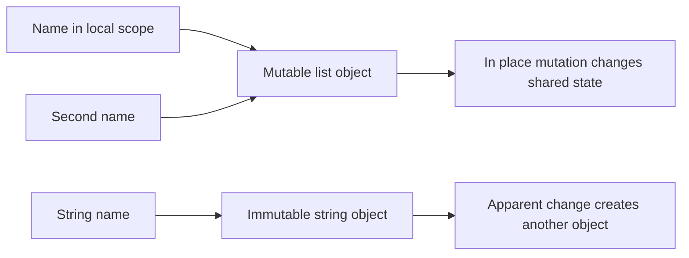
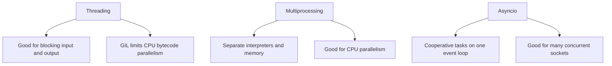

Python interviews often look simple until the follow-up asks what actually happens to objects, names, threads, and cleanup. A strong answer treats Python as a language with precise protocols and a dominant implementation, CPython, whose details matter for performance and concurrency conversations.

## Object model and mutability

Python source is compiled to bytecode and executed by a Python virtual machine. In everyday interview language it is interpreted, but the careful answer is that execution goes through compilation to bytecode first, and CPython implementation details such as reference counting and the Global Interpreter Lock only describe CPython unless the interviewer says otherwise.

Everything in Python is an object: numbers, strings, functions, classes, modules, and exceptions. A name does not store the object inline. Assignment binds a name to an object reference, so two names can observe the same mutable object.

```python
items = [1, 2, 3]
alias = items
alias.append(4)

print(items)      # [1, 2, 3, 4]
print(items is alias)  # True
```

| Concept | Meaning | Interview implication |
|---|---|---|
| Identity | The specific object, visible through `id(obj)` | `is` checks this and is correct for `None` |
| Type | The object's behavior and supported operations | Dynamic typing still has real runtime types |
| Value | The object's current state | `==` usually compares this |
| Reference | A name or container slot pointing at an object | Rebinding differs from mutation |

Mutability decides whether an object can change in place. Lists, dictionaries, sets, bytearrays, and most class instances are mutable. Integers, floats, booleans, strings, bytes, tuples, ranges, and frozensets are immutable. A tuple is immutable only in its outer structure; it may still contain a mutable object.

```python
record = ([1, 2], "fixed")
record[0].append(3)
print(record)  # ([1, 2, 3], "fixed")
```

> [!KEY]
> Python passes object references by assignment. Rebinding a parameter is local, while mutating a shared mutable object is visible to the caller.



The classic default argument trap comes from definition-time evaluation. The default list below is created once, so every call without an explicit argument shares it.

```python
def add_item(value, bucket=[]):
    bucket.append(value)
    return bucket

print(add_item("a"))  # ["a"]
print(add_item("b"))  # ["a", "b"]

def safe_add_item(value, bucket=None):
    bucket = [] if bucket is None else bucket
    bucket.append(value)
    return bucket
```

Truthiness is another interview staple. Empty containers, numeric zero, `None`, and `False` are falsy; most other objects are truthy unless `__bool__` or `__len__` says otherwise. Avoid writing `if value:` when zero, empty string, and missing value mean different things.

## Functions, scope, closures, and decorators

Python resolves names using LEGB: Local, Enclosing, Global, then Built-in. A closure is a function that remembers variables from an enclosing scope after that outer function has returned. `nonlocal` lets an inner function rebind an enclosing variable, while `global` targets the module-level binding.

```python
def make_counter():
    count = 0

    def increment():
        nonlocal count
        count += 1
        return count

    return increment

next_id = make_counter()
print(next_id(), next_id())  # 1 2
```

| Feature | What it does | Senior answer cue |
|---|---|---|
| `*args` | Captures extra positional arguments as a tuple | Useful for wrappers and forwarding |
| `**kwargs` | Captures extra keyword arguments as a dict | Powerful but can hide API contracts |
| `global` | Rebinds a module-level name | Usually avoid in application logic |
| `nonlocal` | Rebinds an enclosing function's name | Common in closures and factories |

Decorators are callable transformers. `@decorator` is syntax for `function = decorator(function)`, and most production decorators should use `functools.wraps` so debugging, introspection, and test tooling still see the original function metadata.

```python
from functools import wraps
from time import perf_counter

def timed(func):
    @wraps(func)
    def wrapper(*args, **kwargs):
        start = perf_counter()
        try:
            return func(*args, **kwargs)
        finally:
            print(f"{func.__name__} took {perf_counter() - start:.4f}s")

    return wrapper

@timed
def compute_total(values):
    return sum(x * x for x in values)
```

> [!TIP]
> A senior decorator answer mentions metadata preservation, exception safety in the wrapper, and that decorator factories close over configuration such as retry counts.

Late binding in closures often surprises candidates. Lambdas created in a loop capture the variable, not a snapshot of its value. Use a default argument or a helper factory when you need the current value captured.

## Iteration, generators, and comprehensions

An iterable can produce an iterator with `iter(obj)`. An iterator implements `__iter__()` and `__next__()`, returning the next value until it raises `StopIteration`. A generator is a convenient iterator created by a function containing `yield`; it preserves local state between calls.

```python
def countdown(start):
    current = start
    while current > 0:
        yield current
        current -= 1

for value in countdown(3):
    print(value)
```

| Term | Required behavior | Example |
|---|---|---|
| Iterable | Can return an iterator | `list`, `dict`, file object |
| Iterator | Has `__next__()` and returns itself from `__iter__()` | Result of `iter([1, 2])` |
| Generator | Iterator produced by `yield` | Streaming rows from a file |
| Generator expression | Lazy expression using parentheses | `sum(x*x for x in nums)` |

Comprehensions are idiomatic for simple transformations and filters. They become a liability when nested business logic hides intent. List, dict, and set comprehensions are eager. Generator expressions are lazy and often better for pipelines because they avoid materializing intermediate lists.

```python
squares = [x * x for x in range(6)]
index = {ch: i for i, ch in enumerate("python")}
evens = {x for x in range(10) if x % 2 == 0}
total = sum(x * x for x in range(1_000_000) if x % 2 == 0)
```

Generators are not always the answer. They are one-shot, so a second loop over the same generator resumes where the first left off. Use a list when you need random access, multiple passes, or a stable snapshot of data.

## Context managers and exceptions

Context managers guarantee paired setup and cleanup. The `with` statement calls `__enter__`, executes the block, then calls `__exit__` even when an exception occurs. Files, locks, sockets, database transactions, temporary state changes, and metrics spans are natural context manager use cases.

```python
class ManagedResource:
    def __enter__(self):
        print("acquire")
        return self

    def __exit__(self, exc_type, exc, tb):
        print("release")
        return False

with ManagedResource() as resource:
    print("using resource")
```

`__exit__` receives the exception type, value, and traceback. Returning `True` suppresses the exception, so the safer default is `False`. For function-style managers, `contextlib.contextmanager` can express the same pattern with a generator and a `try` or `finally` block.

```python
from contextlib import contextmanager

@contextmanager
def opened(path):
    handle = open(path, encoding="utf-8")
    try:
        yield handle
    finally:
        handle.close()
```

Python exception syntax has one subtle feature that interviewers like: `else` runs only if the `try` block completed without raising, while `finally` runs whether an exception happened or not. Use `else` for code that depends on success but should not accidentally catch exceptions from later processing.

| Clause | Runs when | Typical use |
|---|---|---|
| `try` | Always entered first | Code that may fail |
| `except` | Matching exception raised | Recovery, translation, logging |
| `else` | No exception from `try` | Success-only follow-up |
| `finally` | Always before exit | Cleanup and releasing resources |

> [!WARNING]
> Do not catch broad `Exception` just to continue. In production code, catch the failure you can handle and let unexpected bugs surface with context.

## Concurrency, the GIL, and async choices

The Global Interpreter Lock is a CPython mutex that allows only one thread at a time to execute Python bytecode within a process. It does not make Python code race-free, it does not protect external systems, and it does not make threading useless. It mainly limits CPU-bound pure-Python threads from using multiple cores effectively.



Threading works well when time is spent waiting on files, sockets, DNS, database drivers, or C extensions that release the GIL. Multiprocessing uses separate processes, so it can run CPU-bound Python on multiple cores at the cost of serialization, memory overhead, and interprocess coordination. `asyncio` is best when a high number of concurrent operations can be expressed through non-blocking libraries.

| Workload | Better starting point | Reason |
|---|---|---|
| Many HTTP calls | `asyncio` or threads | Most time is waiting |
| CPU-heavy Python loop | `multiprocessing` | Separate processes bypass one GIL |
| NumPy computation | Library dependent | Native code may release the GIL |
| Shared mutable state | Careful threading or actors | The GIL is not a data-race design |

The senior answer is a decision, not a slogan. Pick threads for simple blocking I/O, `asyncio` for high-concurrency non-blocking I/O with compatible libraries, processes for CPU-bound work, and native or vectorized libraries when Python itself is not the right execution engine.

## Typing, dataclasses, and memory management

Type hints are optional runtime metadata used by tools, editors, and reviewers. They improve contracts without changing Python into a statically enforced language at runtime. Modern annotations make data shapes and callback signatures explicit, but runtime validation still requires libraries or manual checks.

```python
from dataclasses import dataclass

@dataclass(frozen=True)
class User:
    id: int
    email: str
    active: bool = True

def active_emails(users: list[User]) -> list[str]:
    return [user.email for user in users if user.active]
```

Dataclasses generate boilerplate such as `__init__`, `__repr__`, and equality. `frozen=True` communicates value-object intent but does not make nested mutable fields magically immutable. Use dataclasses for plain data carriers; use richer classes when invariants, behavior, or controlled construction matter.

CPython memory management combines reference counting with a cyclic garbage collector. When an object's reference count drops to zero, it is usually reclaimed immediately. Cycles, such as two objects pointing at each other, need the cycle collector because their reference counts may never reach zero.

```python
import gc

data = [1, 2, 3]
alias = data
del data

print(alias)   # the object is still alive
gc.collect()   # rarely needed in normal application code
```

CPython also uses specialized allocators and may keep arenas for reuse rather than returning memory to the operating system immediately. That explains why process memory may not fall right after objects are freed. `del name` removes a binding, not necessarily the underlying object.

## Cheat sheet

- Python names are references to objects, not boxes containing values.
- Use `is` for identity and singletons such as `None`; use `==` for value equality.
- Mutable defaults are evaluated once at function definition time.
- LEGB explains name lookup and closures explain remembered enclosing state.
- A generator is an iterator built with `yield`; it is lazy and usually one-shot.
- Use context managers for deterministic cleanup around resources.
- `try` `else` means success path; `finally` means always run cleanup.
- The CPython GIL limits CPU-bound threads but does not remove race conditions.
- Choose threads, processes, or `asyncio` based on waiting, CPU work, and library support.
- Type hints help tools and humans; they are not runtime enforcement by default.
- CPython frees most objects by reference counting and uses a collector for cycles.

## Common mistakes

| Mistake | Fix |
|---|---|
| Writing `def f(items=[]):` for accumulating data | Use `None` and create a new list inside the function |
| Comparing strings or numbers with `is` | Use `==` except for singletons like `None` |
| Assuming a tuple is deeply immutable | Remember nested mutable objects can still change |
| Turning every loop into a dense comprehension | Use a named loop when readability or debugging improves |
| Expecting Python threads to speed up CPU-bound bytecode | Use multiprocessing, native extensions, or a different compute path |
| Catching broad exceptions and continuing silently | Catch specific exceptions and preserve context |

## Summary

Python's interview depth comes from its object model, not from exotic syntax. Names bind to objects, mutability controls aliasing risk, and common features such as decorators, generators, comprehensions, and context managers are protocol-driven. CPython details such as reference counting and the GIL matter, but only when stated with their limits. A credible senior answer chooses the right abstraction and explains the trade-off behind it.

## Top Interview Questions

### Q1. Is Python pass by value or pass by reference?

Python is best described as call by sharing, or passing object references by assignment. The function receives references to the same objects the caller passed, but the parameter name is a local binding. If the function reassigns that name, the caller's binding is unchanged. If the function mutates a shared mutable object, such as appending to a list or updating a dict, the caller sees the mutation because both bindings point at the same object. This is why immutable values like strings feel value-like, while mutable containers expose aliasing. In interviews, avoid forcing Python into C++ terminology. Say that names bind to objects, arguments create local bindings to those objects, and mutability determines whether side effects are visible.

### Q2. Why is a mutable default argument dangerous?

Default arguments are evaluated once, when the function object is created, not each time the function is called. If the default is mutable, every call that omits the argument shares the same object. That creates hidden cross-call state, which is especially dangerous in services, tests, and helper functions that appear stateless. The usual bug is `def add(x, items=[]): items.append(x); return items`, where the second call includes data from the first call. The standard fix is to use `None` as the default and allocate inside the function. This pattern also communicates intent clearly: `None` means the caller did not provide a collection, so the function creates a fresh one.

### Q3. How do LEGB, closures, and `nonlocal` fit together?

LEGB is Python's name lookup order: Local, Enclosing, Global, then Built-in. A closure appears when an inner function refers to names from an enclosing function and outlives that outer call. Python keeps the referenced cells alive so the inner function can continue using them. Reading an enclosing variable works directly, but rebinding it inside the inner function requires `nonlocal`; otherwise Python treats the name as local to the inner function. `global` is different because it targets the module namespace. A good example is a counter factory where `count` lives in the enclosing scope and the returned function uses `nonlocal count` to increment it safely within that closure.

### Q4. What is a decorator and what makes one production ready?

A decorator is a callable that receives a function or class and returns a replacement, usually a wrapper with added behavior. `@timed` above a function is equivalent to assigning `func = timed(func)`. Decorators are common for logging, authorization, retries, caching, metrics, validation, and framework registration. A production-ready function decorator preserves metadata with `functools.wraps`, forwards `*args` and `**kwargs`, handles exceptions intentionally, and avoids changing the original contract unexpectedly. If it needs parameters, use a decorator factory such as `retry(times=3)` that returns the real decorator. In interviews, mention that decorators often rely on closures because the wrapper remembers the original function and any configuration.

### Q5. What is the difference between an iterable, an iterator, and a generator?

An iterable is any object that can produce an iterator, usually by implementing `__iter__`. A list, dict, string, file object, and many custom classes are iterables. An iterator is the object that actually produces values one at a time through `__next__`, raising `StopIteration` when finished; it also returns itself from `__iter__`. A generator is a convenient kind of iterator created by a function that uses `yield`, or by a generator expression. Generators are lazy and preserve local state between values. The important trade-off is that a generator usually supports one forward pass, while a list is eager, reusable, and supports indexing at the cost of memory.

### Q6. Why are context managers preferred for files, locks, and transactions?

Context managers pair acquisition with cleanup in a way that remains correct when exceptions occur. The `with` statement calls `__enter__`, runs the block, and then calls `__exit__` with exception details if the block failed. This is better than manual open and close because cleanup is deterministic and local to the code that owns the resource. Files get closed, locks get released, and transactions can commit or roll back in one visible structure. Returning `True` from `__exit__` suppresses the exception, so most context managers return `False` unless suppression is the explicit design. A senior answer connects context managers to RAII-like resource safety and readable error handling.

### Q7. How do `else` and `finally` behave in Python exception handling?

In a `try` statement, `except` handles matching failures from the `try` block. The `else` block runs only when the `try` block completed without raising an exception. That makes it useful for success-only work that should not be included in the protected section. The `finally` block runs regardless of whether an exception occurred, whether it was handled, or whether the function is returning. It is the right place for cleanup that must happen, such as releasing a resource or restoring state. The common mistake is putting too much code in the `try`, which can accidentally catch errors from logic that should fail loudly. Keep the risky operation narrow.

### Q8. What exactly does the GIL do and what does it not prevent?

In CPython, the Global Interpreter Lock ensures that only one thread executes Python bytecode in a process at a time. It simplifies parts of CPython's memory management, especially reference counting, but it limits CPU-bound pure-Python multithreading. The GIL does not make operations across multiple lines atomic, does not protect your application invariants, and does not remove the need for locks around shared mutable state. Threads can still help when they spend time waiting for I/O, because the GIL may be released while waiting on operating system calls or native extensions. CPU-bound Python work usually needs multiprocessing, vectorized native libraries, or another runtime strategy.

### Q9. When should you choose threading, multiprocessing, or `asyncio`?

Choose threading when you have blocking I/O and libraries with synchronous APIs, such as many file, database, or network clients. Threads are straightforward, share memory, and can improve throughput while work waits outside Python bytecode. Choose multiprocessing for CPU-bound Python because separate processes have separate interpreters and can run on multiple cores, but expect higher memory use and serialization costs. Choose `asyncio` when you need many concurrent I/O operations and your libraries support non-blocking APIs. It provides cooperative multitasking on an event loop, not CPU parallelism. The senior answer also mentions operational complexity: debugging, cancellation, timeouts, backpressure, and shared-state design often matter more than raw concurrency labels.

### Q10. How does CPython memory management work at a high level?

CPython primarily uses reference counting. Each object tracks how many references point to it, and when that count reaches zero, the object can usually be destroyed immediately. Reference counting alone cannot reclaim cycles, such as two objects referencing each other, so CPython also has a cyclic garbage collector that periodically finds unreachable reference cycles. `del x` removes a name binding; it does not guarantee the object is freed if other references still exist. CPython's allocator may keep memory arenas for reuse, so process memory may not drop immediately after objects disappear. In interviews, separate language guarantees from CPython details and mention that finalizers and cycles require extra care.
