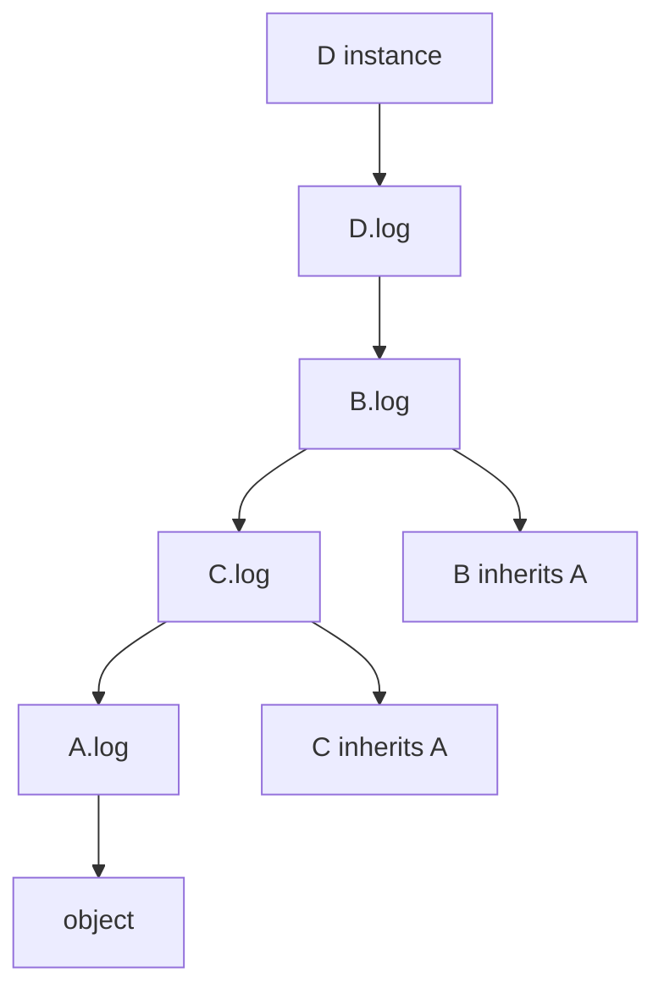

Python object-oriented interviews are rarely about drawing class hierarchies. They test whether you understand Python's data model, method binding, protocol methods, collection trade-offs, and the places where dynamic behavior can help or hurt maintainability.

## Classes, construction, and method binding

A class is itself an object, and calling it normally creates an instance, initializes it, and returns it. `__new__` allocates or returns the instance; `__init__` initializes an instance that already exists. Most application classes only need `__init__`, while `__new__` appears in immutable types, singletons, metaprogramming, or classes that control instance creation.

```python
class Employee:
    company = "Insta Notes"

    def __init__(self, name, level):
        self.name = name
        self.level = level

    def summary(self):
        return f"{self.name} ({self.level})"

person = Employee("Asha", "Senior")
print(person.summary())
```

`self` is a convention, not a keyword. When a function stored on a class is accessed through an instance, Python's descriptor protocol creates a bound method that passes the instance as the first argument. This is why `person.summary()` calls the function with `person` automatically.

| Item | Lives where | Typical use |
|---|---|---|
| Instance attribute | Usually the instance `__dict__` | Per-object state |
| Class attribute | The class object | Shared constants or defaults |
| Instance method | Function on the class, bound on access | Behavior using object state |
| Class method | Function bound to `cls` | Alternate constructors and class behavior |
| Static method | Function without automatic first argument | Namespaced utility |

The most common class attribute bug is accidentally sharing mutable state.

```python
class BadTeam:
    members = []

    def add(self, name):
        self.members.append(name)

class GoodTeam:
    def __init__(self):
        self.members = []
```

> [!WARNING]
> Class attributes are shared until an instance shadows them. Use immutable class constants freely, but create mutable per-instance containers in `__init__`.

## The data model and dunder methods

Dunder methods connect user-defined objects to Python protocols. They are not decoration; they are how `len(obj)`, iteration, arithmetic, comparison, `with`, indexing, membership, and callable objects become possible. Implement the protocol your type truly supports and avoid clever overloads that make code surprising.

```python
class Money:
    def __init__(self, amount, currency="INR"):
        self.amount = amount
        self.currency = currency

    def __repr__(self):
        return f"Money(amount={self.amount}, currency={self.currency!r})"

    def __add__(self, other):
        if self.currency != other.currency:
            raise ValueError("Currency mismatch")
        return Money(self.amount + other.amount, self.currency)

    def __eq__(self, other):
        if not isinstance(other, Money):
            return NotImplemented
        return (self.amount, self.currency) == (other.amount, other.currency)
```

| Method | Protocol | Interview point |
|---|---|---|
| `__repr__` | Developer representation | Should help debugging |
| `__str__` | User-facing text | Optional if `repr` is enough |
| `__len__` | `len(obj)` and truthiness fallback | Keep it cheap and deterministic |
| `__iter__` | Iteration | Return an iterator |
| `__contains__` | `x in obj` | Can avoid slow iteration |
| `__enter__`, `__exit__` | Context manager | Resource safety |
| `__call__` | Callable instance | Useful for strategies and configured functions |

Equality and hashing are tightly coupled. If two objects compare equal, they must have the same hash for sets and dict keys to work. Mutable objects should usually not be hashable because changing fields after insertion can make them unreachable in a hash table. Dataclasses follow this rule by default: mutable dataclasses are not hashable unless you opt in.

Properties and descriptors are part of the same data model. A `property` exposes method-backed access with attribute syntax. A descriptor is any object implementing `__get__`, `__set__`, or `__delete__`; functions, properties, class methods, static methods, and many ORM fields rely on this mechanism.

```python
class User:
    domain = "example.com"

    def __init__(self, username):
        self._username = username

    @property
    def email(self):
        return f"{self._username}@{self.domain}"

    @classmethod
    def from_email(cls, email):
        username, _ = email.split("@", 1)
        return cls(username)

    @staticmethod
    def is_valid_username(value):
        return value.isidentifier()
```

Use `@property` for cheap, unsurprising, attribute-like logic. Use a method when work is expensive, has side effects, performs I/O, or needs parameters.

## Inheritance, MRO, and abstractions

Python supports inheritance, but idiomatic design often prefers composition and duck typing. Inheritance works best when subclasses genuinely follow the base contract or when small mixins add orthogonal behavior. It becomes fragile when a deep business hierarchy shares mutable state and each layer expects initialization in a different order.

The method resolution order, or MRO, is Python's deterministic lookup order for classes. With multiple inheritance, `super()` does not simply mean "call my parent"; it delegates to the next class in the MRO. Cooperative hierarchies call `super()` consistently so every class participates once.

```python
class A:
    def log(self):
        print("A")

class B(A):
    def log(self):
        print("B")
        super().log()

class C(A):
    def log(self):
        print("C")
        super().log()

class D(B, C):
    def log(self):
        print("D")
        super().log()
```

For `D().log()`, the MRO is `D`, `B`, `C`, `A`, `object`.



> [!KEY]
> The interview-safe sentence is that `super()` delegates to the next implementation in the MRO, which is why cooperative multiple inheritance must use it consistently.

Abstract base classes document required behavior when structural duck typing is not enough. They are useful at boundaries where plugins, framework hooks, or multiple implementations must share a visible contract.

```python
from abc import ABC, abstractmethod

class Notifier(ABC):
    @abstractmethod
    def send(self, recipient, message):
        raise NotImplementedError

class EmailNotifier(Notifier):
    def send(self, recipient, message):
        return f"sent to {recipient}"
```

## Memory layout, `__slots__`, equality, and copying

Normal Python instances store attributes in a per-instance dictionary. That flexibility allows adding attributes dynamically but costs memory per object. `__slots__` declares a fixed set of instance attributes and can remove the instance `__dict__`, reducing memory for large numbers of small objects and preventing accidental attribute creation.

```python
class Point:
    __slots__ = ("x", "y")

    def __init__(self, x, y):
        self.x = x
        self.y = y
```

`__slots__` is not a universal optimization. It complicates inheritance, weak references, dynamic attributes, and some serialization or mocking techniques. Use it when measurement shows many instances and memory pressure matter, not because it looks more advanced.

| Tool | Helps with | Trade-off |
|---|---|---|
| Regular class | Flexible objects with behavior | Per-instance dictionary overhead |
| `dataclass` | Boilerplate for data carriers | Invariants still need explicit design |
| `frozen dataclass` | Value-object intent | Nested mutables can still mutate |
| `__slots__` | Memory reduction and fixed attributes | Less dynamic and trickier inheritance |
| `namedtuple` | Compact immutable records | Tuple behavior can be too positional |

Copying also tests whether you understand references. Assignment does not copy at all. A shallow copy creates a new outer container but reuses nested objects. A deep copy recursively copies nested objects, with special handling to avoid infinite recursion in cycles.

```python
from copy import copy, deepcopy

original = [1, ["x", "y"], 3]
shallow = copy(original)
deep = deepcopy(original)

original[1].append("z")
print(shallow[1])  # ["x", "y", "z"]
print(deep[1])     # ["x", "y"]
```

Use copying sparingly for large graphs. Immutable data, explicit constructors, and clear ownership are often better designs than defensive deep copies everywhere.

## Built-in containers and complexity

Python's built-in containers are optimized and should be the default before custom data structures. The interview skill is choosing by semantics first and then naming realistic complexity.

| Type | Ordering | Duplicates | Membership average | Best use |
|---|---|---|---|---|
| `list` | Ordered by index | Allowed | `O(n)` | Mutable sequence and random access |
| `tuple` | Ordered by index | Allowed | `O(n)` | Fixed record or hashable composite key |
| `set` | Unordered | Unique only | `O(1)` | Membership tests and deduplication |
| `dict` | Insertion ordered | Keys unique | `O(1)` key lookup | Keyed lookup and structured records |
| `deque` | Ordered at both ends | Allowed | `O(n)` search | Queues and sliding windows |

Lists are dynamic arrays. `append` is amortized `O(1)`, indexing is `O(1)`, and inserting or deleting near the front is `O(n)` because elements shift. Dicts and sets are hash-table based with average `O(1)` operations, but worst cases exist and keys must be hashable. Dict insertion order is a language guarantee in modern Python, but order does not mean sorted.

Sorting uses Timsort, a stable adaptive sort with `O(n log n)` worst-case complexity and excellent performance on partially ordered data. Prefer `key=` over comparator-style code because the key is computed once per element and is easier to reason about.

```python
users = [
    {"name": "Asha", "score": 92},
    {"name": "Ben", "score": 92},
    {"name": "Chen", "score": 88},
]

ranked = sorted(users, key=lambda user: (-user["score"], user["name"]))
```

> [!TIP]
> In collection answers, say both the semantic reason and the complexity reason. For example, choose a set because uniqueness is the model and membership is average `O(1)`.

## The `collections` module in practice

The `collections` module provides focused containers that reduce boilerplate and communicate intent. They are especially useful in coding interviews because the right choice shortens code without hiding the algorithm.

```python
from collections import Counter, defaultdict, deque, namedtuple

counts = Counter("mississippi")
print(counts.most_common(2))

groups = defaultdict(list)
for team, member in [("api", "A"), ("api", "B"), ("web", "C")]:
    groups[team].append(member)

queue = deque([1, 2, 3])
queue.appendleft(0)
queue.append(4)

Point = namedtuple("Point", ["x", "y"])
point = Point(3, 4)
```

| Container | Use when | Avoid when |
|---|---|---|
| `Counter` | Counting frequencies and top-k candidates | Counts are not the domain model |
| `defaultdict` | Missing keys should create empty accumulators | Missing keys should be exceptional |
| `deque` | Fast append and pop on both ends | You need fast random indexing |
| `namedtuple` | Lightweight immutable records with names | You need validation or rich methods |
| `OrderedDict` | Reordering APIs such as `move_to_end` | Plain insertion order is enough |

`defaultdict` is a common adjacency-list and grouping tool, but it can hide accidental missing keys because reading a key creates it. `Counter` supports arithmetic-like operations and `most_common`, which makes frequency code clearer than manual `dict.get` increments. `deque.popleft()` is `O(1)`, while `list.pop(0)` is `O(n)`.

## Cheat sheet

- `__init__` initializes an instance; `__new__` creates or returns one.
- Methods are descriptors that bind `self` when accessed through an instance.
- Keep mutable per-instance state out of class attributes.
- Implement dunder methods only when your object truly supports the protocol.
- If `a == b`, then `hash(a)` must equal `hash(b)` whenever objects are hashable.
- `super()` follows the MRO, not a hard-coded parent class.
- Use ABCs for explicit contracts and duck typing for lightweight behavioral compatibility.
- `__slots__` is a measured memory optimization, not a default class style.
- `list` is not a queue when frequent left pops are required.
- Prefer `key=` sorting and remember Python sorting is stable.
- `Counter`, `defaultdict`, and `deque` communicate intent and reduce boilerplate.

## Common mistakes

| Mistake | Fix |
|---|---|
| Putting mutable defaults on the class and expecting per-instance state | Initialize mutable instance state in `__init__` |
| Explaining `super()` as only the parent call | Explain MRO delegation and cooperative inheritance |
| Implementing `__eq__` without considering `__hash__` | Keep equal objects hash-compatible or make them unhashable |
| Using `@property` for expensive or surprising work | Use an explicit method for I/O, heavy computation, or side effects |
| Replacing every small record with `namedtuple` | Use dataclasses when validation, defaults, or richer behavior matter |
| Using a list for BFS queue left pops | Use `collections.deque` for `popleft()` |

## Summary

Python OOP is protocol-oriented as much as class-oriented. Classes, descriptors, dunder methods, inheritance, and containers all participate in the same object model, so the strongest answers connect syntax to behavior. Choose collections by semantics first, then complexity. Be explicit about mutability, equality, hashing, copying, and ownership of state because those are where real Python bugs usually live.

## Top Interview Questions

### Q1. What is the difference between `__new__` and `__init__`?

`__new__` is responsible for creating or returning an instance, while `__init__` initializes the instance that was returned. Most classes only implement `__init__` because normal object creation is enough. `__new__` is useful when the class must control construction, such as immutable types, instance caching, singleton-like patterns, or subclassing built-ins where the value must be set before initialization. `__init__` should usually return `None`; it mutates the newly created object by assigning attributes and enforcing invariants. A concise interview answer is that `__new__` is the constructor in the allocation sense, and `__init__` is the initializer most application code needs.

### Q2. Why is `self` explicit in Python methods?

Python keeps method binding visible instead of hiding it behind special syntax. A method defined on a class is a function, and when it is accessed through an instance, the descriptor protocol returns a bound method that will pass the instance as the first argument. The name `self` is only a convention, but using it is expected because it makes code readable to every Python developer. This model also explains why `Class.method(instance)` and `instance.method()` can call the same function. The practical benefit in interviews is clarity: methods are functions with explicit instance context, and Python's object model does the binding when attributes are accessed.

### Q3. How should `__repr__` and `__str__` differ?

`__repr__` is developer-facing and should be unambiguous enough to help debugging, logging, and tests. When practical, it resembles a constructor call or includes field names, such as `Money(amount=10, currency='INR')`. `__str__` is user-facing and can be friendlier or more concise. If `__str__` is absent, Python may fall back to `__repr__`, so implementing only `__repr__` is often acceptable for internal domain objects. Avoid hiding important state in `repr`, because production logs and failing assertions often depend on it. The interview answer should emphasize audience: `repr` is for engineers and diagnostics, while `str` is for human display.

### Q4. What is the MRO and why does `super()` depend on it?

The method resolution order is the linear order Python uses to search for attributes and methods across a class hierarchy. It matters most with multiple inheritance, especially diamond-shaped graphs where two parents share a common ancestor. Python uses C3 linearization to produce a deterministic order that preserves local precedence and avoids calling the same class twice in cooperative chains. `super()` delegates to the next class in that MRO, not necessarily to a specific parent. That is why cooperative classes call `super()` consistently and accept compatible arguments. A good answer names both the problem, ambiguous lookup, and the solution, deterministic MRO-based delegation.

### Q5. When is multiple inheritance acceptable in Python?

Multiple inheritance is acceptable when the parent classes are small, orthogonal, and cooperative. Mixins are the classic example: one class might add logging behavior, another serialization behavior, and neither owns conflicting state. It becomes risky when multiple parents define overlapping attributes, incompatible `__init__` signatures, or competing business meanings. In those cases, composition is clearer and easier to test. If multiple inheritance is used, each class in the hierarchy should call `super()` consistently, avoid hard-coding parent names, and document the expected method contracts. The senior answer does not say multiple inheritance is always bad; it says it is powerful but needs narrow, disciplined use.

### Q6. What are descriptors and how are they related to properties?

A descriptor is an object that defines `__get__`, `__set__`, or `__delete__` and controls attribute access when stored on a class. A `property` is a descriptor that lets method logic appear as attribute access. Functions are descriptors too, which is why accessing a function through an instance creates a bound method. Descriptors power class methods, static methods, many validation libraries, ORMs, and framework fields. The key interview point is that Python attribute lookup is programmable, not just dictionary access. Use this power carefully: a property should be cheap and unsurprising, while heavier operations should remain explicit methods so callers understand the cost and side effects.

### Q7. What problem does `__slots__` solve and when should you avoid it?

`__slots__` declares a fixed set of attributes for instances and can remove the per-instance `__dict__`. This can reduce memory significantly when creating many small objects and can catch accidental misspelled attributes. It may also slightly speed attribute access in some cases, though memory is the main reason to use it. Avoid treating it as a default style because it reduces flexibility, complicates inheritance, affects weak references unless configured, and can surprise tooling that expects dynamic attributes. Use it when you have measured many instances and memory pressure, such as millions of small points or parsed records. For normal business objects, readability usually matters more.

### Q8. How do Python lists, tuples, sets, and dicts differ in complexity and use?

A list is an ordered dynamic array with `O(1)` indexing, amortized `O(1)` append, and `O(n)` membership or front deletion. A tuple is ordered and immutable, so it is useful for fixed records and can be hashable if its contents are hashable. A set stores unique hashable values and gives average `O(1)` membership, making it ideal for deduplication and seen checks. A dict maps unique hashable keys to values, preserves insertion order in modern Python, and gives average `O(1)` key lookup. The senior answer starts with semantics, not complexity alone: choose the type that models the data correctly, then mention the performance profile.

### Q9. When should you use `Counter`, `defaultdict`, or `deque`?

Use `Counter` when the core operation is counting: word frequencies, character counts, votes, top-k candidates, or multiset-like arithmetic. Use `defaultdict` when missing keys should naturally create an empty accumulator, such as grouping users by team or building an adjacency list. Avoid it when a missing key indicates a bug, because reading the key mutates the dictionary. Use `deque` when you need efficient operations at both ends, such as BFS queues, sliding windows, or producer-consumer buffers. `list.pop(0)` shifts elements and is `O(n)`, while `deque.popleft()` is `O(1)`. These containers make intent clear and reduce error-prone boilerplate.

### Q10. What is the equality and hashing contract?

The core contract is that if two objects compare equal with `==`, they must produce the same hash value for as long as they are used in a set or as dict keys. If this contract is broken, hash tables can lose track of objects even though they are present internally. Mutable objects are usually unhashable because fields involved in equality could change after insertion. If you implement `__eq__`, think about whether hashing should be disabled, inherited, or explicitly implemented from immutable fields. A strong answer also mentions returning `NotImplemented` when comparing unsupported types so Python can try the reflected operation or decide the comparison is false.

### Q11. What is the difference between shallow copy and deep copy?

Assignment does not copy; it creates another reference to the same object. A shallow copy creates a new outer container but reuses references to nested objects. If the nested object is mutable, changes through one copy are visible through the other. A deep copy recursively copies nested objects so the result is more independent, while tracking already-copied objects to handle cycles. Use shallow copies when you only need a new outer list or dict and shared nested values are fine. Use deep copies carefully because they can be expensive and may copy more of an object graph than intended. Often, explicit construction or immutable data is clearer.
