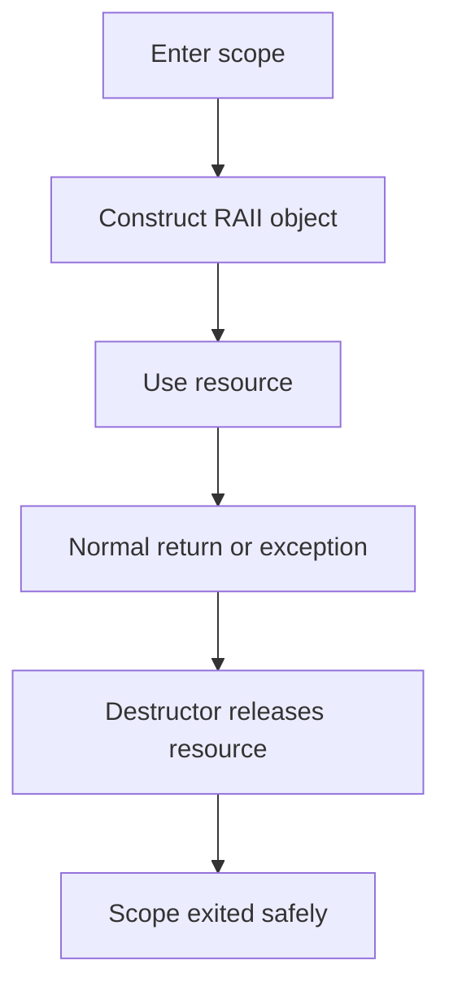
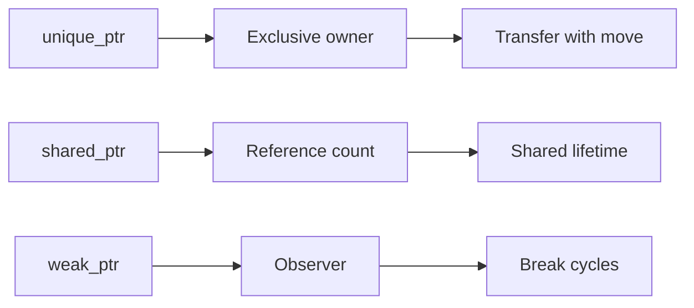

C++ interviews reward candidates who can talk about lifetime and ownership before syntax. The modern answer is not manual `new` and `delete`; it is RAII, value types, standard containers, smart pointers, and knowing when low-level control creates undefined behavior.

## Memory, lifetime, and RAII

C++ gives deterministic object lifetime. Objects with automatic storage duration are destroyed when their scope exits, including during exception unwinding. Dynamic objects live until their owner releases them, which is why modern C++ encodes ownership in objects rather than comments.

```cpp
#include <fstream>
#include <string>

std::string read_first_line(const std::string& path) {
    std::ifstream file(path);
    std::string line;
    std::getline(file, line);
    return line;
} // file closes here even if an exception is thrown
```

RAII means Resource Acquisition Is Initialization. A resource is acquired in a constructor or factory and released in a destructor. The resource can be memory, a file descriptor, a lock, a socket, a transaction, or any handle that must be paired with cleanup.

| Storage or resource | Lifetime owner | Typical risk | Modern approach |
|---|---|---|---|
| Stack object | Scope | Returning references to dead objects | Prefer values and references with clear lifetime |
| Heap object | Owning object or smart pointer | Leak, double delete, use after free | `std::unique_ptr` or containers |
| File or socket | RAII wrapper | Forgotten close on exception | Wrapper destructor closes handle |
| Lock | Lock guard object | Deadlock or missing unlock | `std::lock_guard` or `std::unique_lock` |



> [!KEY]
> The default C++ memory-management answer is RAII. If cleanup depends on a manual `delete` path, exception safety and early returns become bugs waiting to happen.

Manual `new` and `delete` still exist, but using them directly in application code is usually a smell. Standard containers own sequences, strings own text, and smart pointers own dynamic objects. Raw pointers can remain useful as non-owning observers or interoperability handles, but ownership should be visible in the type.

## Smart pointers and ownership

`std::unique_ptr` represents exclusive ownership. It is move-only, cheap, and the right default when an object needs dynamic lifetime. `std::shared_ptr` represents shared ownership with reference counting, which is more expensive and should be used only when multiple owners genuinely extend the same lifetime. `std::weak_ptr` observes a `shared_ptr` managed object without increasing the reference count.

```cpp
#include <memory>
#include <string>

class User {
public:
    explicit User(std::string name) : name_(std::move(name)) {}
    void login();
private:
    std::string name_;
};

auto user = std::make_unique<User>("alice");
user->login();
```

| Pointer type | Ownership meaning | Can be null | Common use |
|---|---|---|---|
| Raw pointer | Usually non-owning in modern code | Yes | Optional reference, C API, array view |
| Reference | Non-null alias | No | Required parameter or alias |
| `std::unique_ptr` | Exclusive owning pointer | Yes | Default heap ownership |
| `std::shared_ptr` | Shared owning pointer | Yes | Truly shared lifetime |
| `std::weak_ptr` | Non-owning observer | Yes after `lock()` fails | Break shared ownership cycles |



`make_unique` and `make_shared` are preferred because they are concise and exception-safe. `make_shared` can allocate the object and control block together, but that also means weak observers may keep the combined allocation alive until the last `weak_ptr` disappears.

> [!WARNING]
> `shared_ptr` is not a substitute for ownership design. If everyone owns something, nobody clearly owns the invariant or shutdown order.

Cycles are the classic `shared_ptr` trap. If a parent and child hold `shared_ptr` to each other, their reference counts never reach zero. Make one direction non-owning with `weak_ptr` and call `lock()` before use because the object may already be gone.

## Special members and move semantics

C++ classes can define special member functions for construction, destruction, copying, and moving. Modern C++ starts with the rule of zero: design classes from standard-library members that manage themselves, so the compiler-generated special members are correct.

| Rule | Meaning | Best interview framing |
|---|---|---|
| Rule of zero | Do not manually define special members | Prefer RAII members such as `std::vector` |
| Rule of three | Destructor, copy constructor, copy assignment are linked | Old resource-owning classes need all three |
| Rule of five | Add move constructor and move assignment | Modern resource owners need move support |

If a class manually owns a raw resource, it must define copying, moving, and destruction carefully or disable operations that do not make sense. A better design is often to put the resource in `unique_ptr`, `vector`, `string`, or a focused RAII wrapper.

Move semantics let objects transfer resources instead of copying them. An rvalue reference uses `T&&`. `std::move(x)` does not move by itself; it casts `x` to an rvalue so a move constructor or move assignment operator can be selected.

```cpp
#include <utility>
#include <vector>

std::vector<int> build_data() {
    std::vector<int> values = {1, 2, 3, 4};
    return values;
}

std::vector<int> source = build_data();
std::vector<int> target = std::move(source);
```

After a move, the moved-from object must remain valid but its value is unspecified unless the type documents more. You can destroy it, assign a new value, or call operations that have no precondition on the old value. Do not assume a moved-from string is empty or a moved-from vector has a specific size.

> [!TIP]
> A strong move-semantics answer says that move is a performance and ownership-transfer mechanism, and that `std::move` is only a cast.

## Type system essentials

References and pointers are both indirection tools, but they communicate different contracts. Use references when the argument is required and non-null. Use pointers for optional relationships, reseating, dynamic polymorphism, C APIs, or when null has semantic meaning.

```cpp
void rename(User& user, const std::string& name);   // user required
void maybe_log(const User* user);                   // user may be null
```

`const` correctness makes APIs easier to reason about. A `const` reference avoids copying while promising not to modify the referred object. A `const` member function promises not to modify the observable state of the object and can be called on const instances.

| Form | Meaning |
|---|---|
| `const int value` | The integer value cannot be modified |
| `const T* ptr` | Pointer to const `T` |
| `T* const ptr` | Const pointer to mutable `T` |
| `const T* const ptr` | Const pointer to const `T` |
| `double balance() const` | Method does not mutate observable object state |

```cpp
class Account {
public:
    double balance() const { return balance_; }
    void deposit(double amount) { balance_ += amount; }
private:
    double balance_ = 0.0;
};
```

`auto` asks the compiler to deduce a type. It is helpful for verbose iterator and template types, but can hide value versus reference or constness if overused. Use `auto&`, `const auto&`, and `auto&&` deliberately when reference behavior matters.

Templates provide compile-time generic programming. They enable zero-overhead abstractions because the compiler instantiates concrete code for used types, but they can increase compile times and produce noisy diagnostics.

```cpp
template <typename T>
T max_value(const T& a, const T& b) {
    return b < a ? a : b;
}
```

## Polymorphism and the vtable

C++ supports runtime polymorphism through virtual functions. A base class with virtual methods can be called through a pointer or reference, and the most-derived override runs. Many implementations use a vtable, a table of function pointers, plus a hidden pointer in each polymorphic object. The standard does not require that layout, but interviewers use the term as shorthand for virtual dispatch machinery.

```cpp
class Shape {
public:
    virtual double area() const = 0;
    virtual ~Shape() = default;
};

class Circle : public Shape {
public:
    explicit Circle(double radius) : radius_(radius) {}

    double area() const override {
        return 3.14159 * radius_ * radius_;
    }
private:
    double radius_;
};
```

| Feature | Purpose | Pitfall |
|---|---|---|
| `virtual` | Enable dynamic dispatch | Small indirection and optimization cost |
| `override` | Ask compiler to verify overriding | Missing it can hide signature mistakes |
| Pure virtual `= 0` | Make an abstract interface | Destructors still need definitions |
| Virtual destructor | Safe deletion through base pointer | Missing one can be undefined behavior |

If a class is meant to be deleted polymorphically, the base destructor should be virtual. Deleting a derived object through a base pointer without a virtual destructor is undefined behavior because the derived destructor may not run.

Multiple inheritance is legal, but interface-style multiple inheritance is safer than inheriting state from several parents. Diamond inheritance and ambiguous members require deliberate design, and virtual inheritance should be understood before being used.

## STL containers and undefined behavior

The STL provides containers and algorithms with predictable complexity. Prefer `std::vector` by default for sequences because contiguous memory is cache-friendly and simple. Choose maps, sets, unordered containers, deques, or lists only when their semantics justify the trade-off.

| Container | Typical structure | Lookup | Insert and erase | Best use |
|---|---|---|---|---|
| `std::vector` | Dynamic array | Index `O(1)` | End append amortized `O(1)`, middle `O(n)` | Cache-friendly sequence |
| `std::deque` | Segmented array | Index `O(1)` | Ends `O(1)` | Queue with both ends |
| `std::map` | Balanced tree | `O(log n)` | `O(log n)` | Ordered key-value data |
| `std::unordered_map` | Hash table | Average `O(1)` | Average `O(1)` | Fast average lookup |
| `std::list` | Linked list | `O(n)` | Known position `O(1)` | Stable iterators with splicing |

Iterator invalidation is a common follow-up. `vector` reallocation invalidates all iterators and references; inserting in the middle invalidates from the insertion point onward. Node-based containers such as `map` keep most iterators stable except erased elements. Know the broad rule and check the exact container when writing production code.

Undefined behavior means the C++ standard imposes no requirements on the program. The compiler may optimize under the assumption that UB never happens, so symptoms can appear unrelated to the bug.

| Trap | Why it is dangerous |
|---|---|
| Use after free | Accesses an object whose lifetime ended |
| Returning reference to local variable | The referred object is destroyed at scope exit |
| Signed integer overflow | Undefined by the standard |
| Out-of-bounds access | May corrupt memory or appear to work |
| Data race on non-atomic object | Undefined in the memory model |
| Deleting through non-virtual base destructor | Derived cleanup may not run |

Undefined behavior is not the same as an exception or a defined error value. Sanitizers, warnings, static analysis, RAII, bounds-checked abstractions, and tests help, but the design goal is to make invalid states hard to express.

## Cheat sheet

- Start memory answers with RAII and deterministic destructors.
- Prefer values, standard containers, and smart pointers over naked owning pointers.
- Use `unique_ptr` by default for dynamic exclusive ownership.
- Use `shared_ptr` only for true shared lifetime and `weak_ptr` to break cycles.
- The rule of zero is the modern default; rule of five applies to manual resource owners.
- `std::move` is a cast that enables move operations; it does not move by itself.
- Use references for required non-null aliases and pointers for nullable or reseatable relationships.
- `const` is an API contract and should apply to methods, parameters, and local bindings.
- Virtual dispatch usually uses a vtable, and polymorphic bases need virtual destructors.
- Prefer `vector` for sequences unless another container's semantics are needed.
- Undefined behavior means the program has no reliable meaning under the standard.

## Common mistakes

| Mistake | Fix |
|---|---|
| Writing manual `new` and `delete` in normal application code | Use containers, RAII wrappers, and smart pointers |
| Choosing `shared_ptr` because it feels safer | Start with `unique_ptr` and design ownership explicitly |
| Returning a reference or pointer to a local variable | Return by value or make ownership and lifetime explicit |
| Forgetting a virtual destructor in a polymorphic base | Add `virtual ~Base() = default` |
| Assuming moved-from objects have a specific value | Only rely on validity and documented operations |
| Ignoring iterator invalidation after container mutation | Know the container rule or reacquire iterators |
| Treating undefined behavior as a runtime exception | Prevent it with types, RAII, sanitizers, and reviews |

## Summary

Modern C++ is a language of explicit lifetime and zero-overhead abstractions. The strongest interview answers talk first about ownership, then about the type system and runtime dispatch. RAII, rule of zero, move semantics, smart pointers, const correctness, templates, and STL complexity form the core vocabulary. Undefined behavior is the boundary where C++ stops protecting you, so design should make that boundary hard to cross.

## Top Interview Questions

### Q1. What does RAII mean and why is it central to modern C++?

RAII means Resource Acquisition Is Initialization. The idea is to tie a resource to an object's lifetime: acquire it during construction or factory creation, and release it in the destructor. Because destructors run automatically when scope exits, including during exception unwinding, RAII gives deterministic cleanup without manual cleanup paths. It applies to memory, files, locks, sockets, transactions, and handles. This is central to modern C++ because it converts resource safety into type design. Instead of asking every caller to remember `delete`, `close`, or `unlock`, the owner object enforces cleanup. A strong interview answer contrasts RAII with manual resource management and explains why it improves exception safety.

### Q2. What are the rule of zero, rule of three, and rule of five?

The rule of zero says that most classes should not manually define destructors, copy constructors, copy assignment, move constructors, or move assignment. Instead, they should use members such as `std::string`, `std::vector`, and smart pointers that already manage resources correctly. The rule of three says that if a class defines a destructor, copy constructor, or copy assignment operator, it probably manages a resource and needs all three. The rule of five extends that idea to move constructor and move assignment in modern C++. The best interview framing is that rule of zero is the goal, while rule of five is for carefully designed resource-owning types that cannot delegate ownership to standard components.

### Q3. What does `std::move` actually do?

`std::move` does not move data by itself. It casts its argument to an rvalue expression, allowing overload resolution to choose a move constructor or move assignment operator if one exists. The actual transfer is implemented by the target type's move operation. For a vector or string, that often means transferring an internal buffer pointer instead of copying all elements. After moving, the source object remains valid but has an unspecified value unless the type documents more. You may destroy it or assign a new value, but you should not rely on its previous contents. This distinction matters because sprinkling `std::move` blindly can make code harder to reason about.

### Q4. When should you use `unique_ptr`, `shared_ptr`, and `weak_ptr`?

Use `unique_ptr` for exclusive ownership and make it the default smart pointer for dynamic objects. It is move-only, cheap, and communicates a single owner clearly. Use `shared_ptr` only when multiple independent owners must extend the same object's lifetime, such as shared graph nodes or asynchronous callbacks that need ownership. It has reference-count overhead and can hide shutdown order. Use `weak_ptr` as a non-owning observer of a `shared_ptr` object, especially to break cycles. Before using the observed object, call `lock()` and handle failure because the object may have been destroyed. A senior answer emphasizes ownership semantics rather than memorizing pointer names.

### Q5. How do references and pointers differ in API design?

A reference is an alias for an existing object. It must be initialized and cannot be reseated, so it communicates a required non-null relationship. A pointer stores an address, can be null, can be reseated, and often communicates optionality, low-level interoperation, array-like traversal, or dynamic polymorphism. In modern C++, raw pointers should usually be non-owning; ownership should be expressed with values, containers, or smart pointers. For function parameters, use `const T&` to avoid copying large required inputs, `T&` for required mutation, and `T*` when null is meaningful. This answer shows that the choice is about contracts, not only syntax.

### Q6. What is const correctness and why does it matter?

Const correctness means using `const` to express and enforce non-mutating intent. A `const T&` parameter avoids copying while promising not to modify the object. A `const` member function promises not to modify the object's observable state and can be called on const objects. Pointers add two dimensions: pointer to const object, const pointer, or both. Const correctness matters because it documents API contracts, enables safer reuse, catches accidental mutation at compile time, and allows code to work with const values passed from other layers. A senior answer also notes that `mutable` should be rare and reserved for logically invisible state such as caches or synchronization primitives.

### Q7. How does virtual dispatch work and what is a vtable?

Virtual dispatch lets C++ call the most-derived override through a base pointer or reference. Many implementations support this with a vtable, a table of function pointers for a polymorphic type, and a hidden vptr in each object pointing to the right table. A call such as `shape->area()` loads the vtable entry and jumps to the correct override. The C++ standard does not mandate this exact layout, but it is the common implementation model. The overhead is usually an extra indirection and sometimes reduced inlining opportunities. If a base class is used polymorphically and objects may be deleted through it, its destructor should be virtual.

### Q8. What are templates good for and what trade-offs do they bring?

Templates provide compile-time generic programming. They let one definition work for many types while still producing type-specific optimized code. Standard containers and algorithms depend heavily on templates, and templates enable zero-overhead abstractions because the compiler can inline and specialize concrete instantiations. The trade-offs are longer compile times, larger binaries in some cases, and complex diagnostics when constraints are not clear. Modern C++ improves this with concepts, which express requirements more directly. A good answer contrasts templates with runtime polymorphism: templates choose behavior at compile time and can be faster, while virtual interfaces choose behavior at runtime and can reduce code duplication boundaries.

### Q9. Which STL containers should you choose in common interview scenarios?

Use `std::vector` by default for sequences because it is contiguous, cache-friendly, supports `O(1)` indexing, and has amortized `O(1)` append. Use `std::deque` when you need efficient operations at both ends. Use `std::map` or `std::set` when sorted order and logarithmic operations matter. Use `std::unordered_map` or `std::unordered_set` when average `O(1)` lookup matters more than ordering. Use `std::list` rarely, mainly when stable iterators and splicing are central; it often performs worse than expected due to poor cache locality. A senior answer also mentions iterator invalidation because mutating containers can invalidate references, pointers, and iterators differently.

### Q10. What is undefined behavior and why is it dangerous?

Undefined behavior means the C++ standard places no requirements on what the program does after that operation. The compiler may assume UB never happens and optimize based on that assumption, so the observed failure might be a crash, silent corruption, security vulnerability, or seemingly correct behavior that changes under optimization. Common examples are out-of-bounds access, use after free, signed integer overflow, data races on non-atomic objects, returning references to locals, and deleting through a base pointer without a virtual destructor. The fix is not catching an exception; UB is not a defined runtime error. Prevent it with RAII, safe abstractions, warnings, sanitizers, reviews, and precise ownership design.
