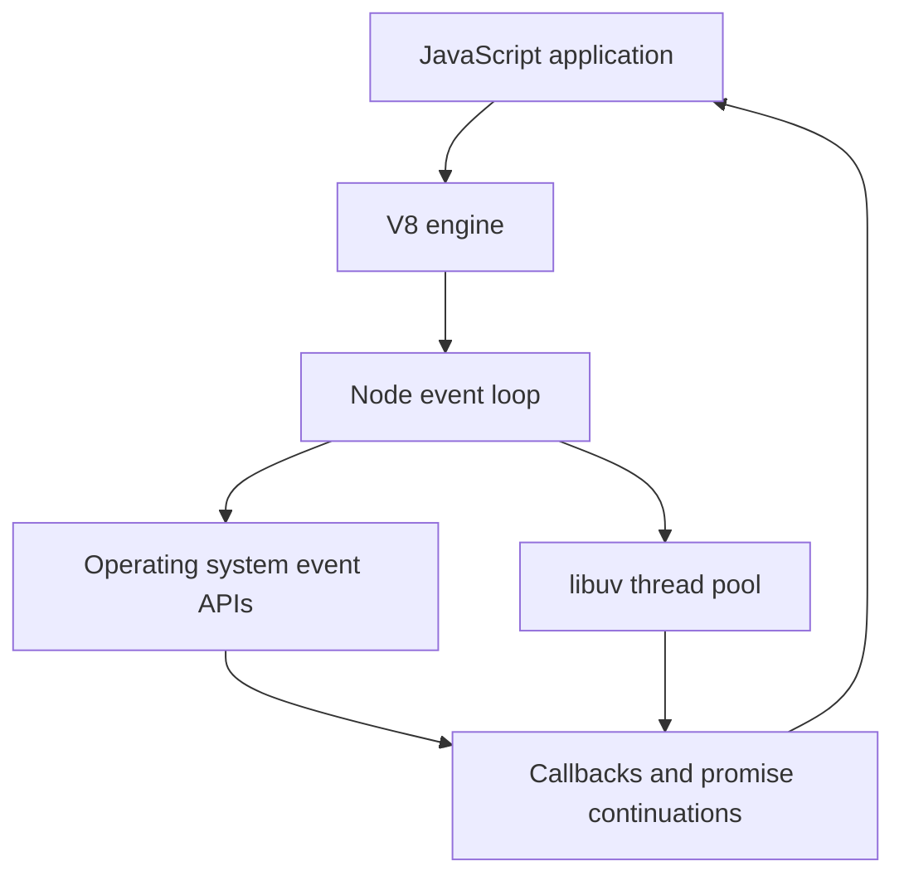
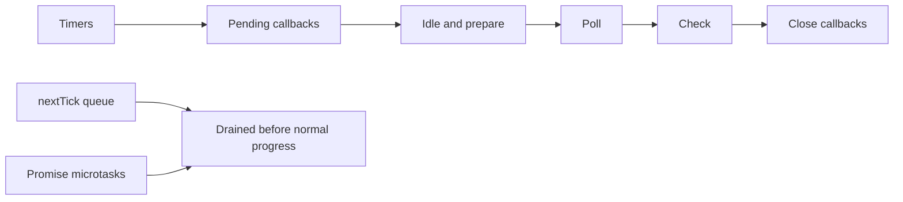

Node.js interviews test whether you understand the runtime, not whether you can write one more route handler. The strongest answers explain how single-threaded JavaScript cooperates with libuv, the operating system, streams, modules, and production shutdown behavior.

## Runtime model and libuv

Node.js is a JavaScript runtime built on V8. V8 compiles and executes JavaScript, while Node adds APIs for files, networking, processes, streams, modules, and the event loop. The common phrase "Node is single-threaded" is incomplete: JavaScript execution for one event loop is single-threaded, but the runtime uses the operating system and libuv to coordinate asynchronous work.



libuv provides the event loop, cross-platform asynchronous I/O abstractions, timers, and a thread pool. Network sockets are usually handled by the operating system's event notification facilities. Some work uses the libuv pool, including many file-system operations, `dns.lookup`, compression, and crypto APIs.

| Part | Responsibility | Interview nuance |
|---|---|---|
| V8 | Executes JavaScript and manages the JS heap | Not the whole Node runtime |
| Node core | Exposes `fs`, `http`, `stream`, `process`, modules | Adds server-side APIs |
| libuv | Event loop, timers, async I/O abstraction, thread pool | Not every async operation uses a thread |
| Operating system | Sockets, file descriptors, scheduling | Network I/O can be evented |
| Addons | Native extensions | May run outside JavaScript execution |

> [!KEY]
> Say "single-threaded JavaScript with multi-threaded runtime support." It is precise and prevents the common mistake of thinking Node never uses threads.

The default libuv thread pool size is 4 threads and can be changed with the `UV_THREADPOOL_SIZE` environment variable before process start. Increasing it can help workloads dominated by pool-backed operations, but it will not make CPU-bound JavaScript on the main thread or network I/O faster.

## Event loop phases and task ordering

The Node event loop has named phases. Each phase has a queue of callbacks, and the loop advances while there is work to process. Microtasks are not a phase; Node drains them between callback boundaries, with `process.nextTick` having especially high priority.



| Phase or queue | What runs there | Common API |
|---|---|---|
| Timers | Expired timer callbacks | `setTimeout`, `setInterval` |
| Pending callbacks | Deferred system callbacks | Some TCP errors |
| Poll | Incoming I/O and waiting for events | Sockets and many I/O callbacks |
| Check | Check-phase callbacks | `setImmediate` |
| Close callbacks | Resource close events | Socket close handlers |
| Microtasks | High-priority continuations | Promises and `process.nextTick` |

Node differs from the browser in important ways. Browsers integrate the event loop with rendering, DOM events, user interaction, and web APIs. Node has no rendering step, has libuv phases, exposes `process.nextTick`, supports `setImmediate`, and delegates different categories of server-side work to libuv and the operating system. A browser question about repaint timing is not the same as a Node question about the poll and check phases.

`setTimeout(fn, 0)` and `setImmediate(fn)` can run in different orders depending on where they are scheduled. From inside an I/O callback, `setImmediate` usually runs before a zero-delay timer because it is queued for the check phase after poll.

> [!WARNING]
> Excessive `process.nextTick` recursion can starve I/O because the nextTick queue runs before the event loop continues to normal phases.

## Async patterns and error handling

Node has evolved from error-first callbacks to promises and `async` or `await`. The underlying problem is the same: asynchronous failures must be observed and routed to the correct owner. Throwing inside an asynchronous callback does not behave like throwing in the caller's stack.

```javascript
const fs = require("fs/promises");

async function loadConfig(path) {
  try {
    const data = await fs.readFile(path, "utf8");
    return JSON.parse(data);
  } catch (err) {
    err.message = `failed to load config: ${err.message}`;
    throw err;
  }
}
```

| Style | Strength | Risk |
|---|---|---|
| Error-first callback | Simple and traditional for one operation | Nesting and missed `return` after errors |
| Promise chain | Composable with `all`, `race`, and `allSettled` | Forgotten `.catch()` becomes unhandled |
| `async` and `await` | Reads like sequential code | Accidental serialization of independent work |
| EventEmitter | Natural for streams and long-lived events | Missing `error` listener can crash |

Use `Promise.all` for independent operations that can run concurrently, and use sequential `await` when each step depends on the previous result or when rate limiting matters.

```javascript
async function loadBoth(userStore, invoiceStore, id) {
  const [user, invoices] = await Promise.all([
    userStore.findById(id),
    invoiceStore.findByUser(id),
  ]);

  return { user, invoices };
}
```

Production code needs a policy for unhandled rejections and uncaught exceptions. An unhandled rejection often means a request path lost ownership of a failure. An uncaught exception means process state may be corrupted, so the usual production response is to log, stop accepting new work, drain if possible, and let a supervisor restart the process.

## Streams, buffers, and backpressure

Streams let Node process data incrementally instead of loading it all into memory. They are essential for large files, uploads, downloads, compression, proxies, logs, and continuous data. Buffers represent raw binary data outside normal JavaScript strings and are common at stream boundaries.

| Stream type | Direction | Example |
|---|---|---|
| Readable | Source to application | File read stream, HTTP request |
| Writable | Application to destination | File write stream, HTTP response |
| Duplex | Both directions | TCP socket |
| Transform | Reads, transforms, then writes | Compression or parsing stream |

Backpressure is the signal that the consumer cannot keep up with the producer. If a writable stream's `write()` returns `false`, the producer should pause until the `drain` event. The safer high-level API is `pipeline`, which wires errors and backpressure across streams.

```javascript
const { createReadStream, createWriteStream } = require("fs");
const { Transform } = require("stream");
const { pipeline } = require("stream/promises");

const upper = new Transform({
  transform(chunk, encoding, callback) {
    callback(null, chunk.toString().toUpperCase());
  },
});

async function convertFile(input, output) {
  await pipeline(
    createReadStream(input),
    upper,
    createWriteStream(output)
  );
}
```

Manual `data` event handlers are easy to get wrong because they can switch a stream into flowing mode and ignore backpressure. In interviews, connect streams to architecture: reading a multi-gigabyte file with `readFile` is a memory-risk design, not only a code-style issue.

> [!TIP]
> A senior streams answer uses the word backpressure and names `pipeline` as the standard way to compose streams safely.

## Scaling with processes and workers

One Node event loop should not be responsible for CPU-heavy work. A tight loop blocks timers, socket callbacks, promise continuations, and health checks. Node gives several ways to scale or isolate work, each with different costs.

| Tool | Parallelism model | Best use | Trade-off |
|---|---|---|---|
| `cluster` | Multiple processes sharing server load | Use multiple CPU cores for HTTP workers | Process memory per worker |
| `worker_threads` | Multiple JS threads with separate event loops | CPU-heavy JavaScript tasks | Message passing and data transfer design |
| `child_process` | Separate process running another program | Isolation or external commands | Serialization and process management |
| Horizontal replicas | Many processes or containers | Production scaling and resilience | Needs load balancing and shared state design |

`cluster` starts a primary process that manages worker processes. Each worker has its own event loop and memory space, so one blocked worker does not block another. Modern deployments often use a process manager, container orchestration, or platform load balancer instead of relying only on in-process clustering.

Worker threads are better for CPU-heavy JavaScript when you want parallel computation within one process boundary. They do not share the same JavaScript heap by default. Communicate through messages, transferable objects, or shared memory primitives only when necessary.

```javascript
const { Worker } = require("worker_threads");

function runJob(payload) {
  return new Promise((resolve, reject) => {
    const worker = new Worker("./worker.js", { workerData: payload });
    worker.once("message", resolve);
    worker.once("error", reject);
    worker.once("exit", (code) => {
      if (code !== 0) reject(new Error(`worker stopped with code ${code}`));
    });
  });
}
```

Node is the wrong first choice for long CPU-bound loops, heavy numerical computing, low-latency real-time systems with strict scheduling, or workloads dominated by native libraries better served elsewhere. It is excellent for I/O-heavy APIs, streaming, gateways, CLIs, orchestration services, and real-time connection coordination.

## Modules and production readiness

Node supports CommonJS and ECMAScript modules. CommonJS uses `require` and `module.exports`, loads synchronously, and remains common in older packages. ESM uses `import` and `export`, supports static analysis, and is the standard JavaScript module system. A package can opt into ESM with `"type": "module"`, and file extensions can also signal module type.

| Topic | CommonJS | ESM |
|---|---|---|
| Import syntax | `const x = require("x")` | `import x from "x"` |
| Export syntax | `module.exports = value` | `export default value` or named exports |
| Loading | Synchronous style | Asynchronous-capable module graph |
| Analysis | More dynamic | More statically analyzable |
| Top-level await | Not native in ordinary files | Supported in ESM |

Interop exists but can be awkward, especially around default exports, named exports, and package configuration. For interviews, say that greenfield code often prefers ESM, while many production Node systems still contain CommonJS due to ecosystem history.

Production Node services must stop gracefully. On a termination signal, stop accepting new connections, let in-flight requests finish within a deadline, close resources, and then exit. Also monitor event loop lag, heap growth, open handles, unhandled rejections, and synchronous blocking calls.

```javascript
const http = require("http");

const server = http.createServer((req, res) => {
  res.end("ok");
});

server.listen(3000);

process.on("SIGTERM", () => {
  server.close((err) => {
    process.exit(err ? 1 : 0);
  });

  setTimeout(() => process.exit(1), 10_000).unref();
});
```

Memory leaks often come from unbounded caches, forgotten timers, accumulating event listeners, retained request objects, or queues without backpressure. Blocking the loop often comes from synchronous file APIs, large JSON parsing, expensive regular expressions, compression, crypto, or CPU loops on the main thread.

## Cheat sheet

- Node is single-threaded for JavaScript execution, not for the entire runtime.
- libuv provides the event loop, async abstractions, timers, and a thread pool.
- Network I/O is often OS-evented; file, crypto, `dns.lookup`, and compression may use the pool.
- The default libuv thread pool size is 4; `UV_THREADPOOL_SIZE` only helps pool-backed work, not CPU-bound JS or ordinary network sockets.
- Node event loop phases include timers, poll, check, and close callbacks.
- Microtasks and `process.nextTick` run with higher priority than normal phase progression.
- `async` and `await` use promises; they do not make blocking code non-blocking.
- Use `Promise.all` for independent async work and sequential awaits for dependencies.
- Streams protect memory only when backpressure is respected.
- Use worker threads or processes for CPU-bound JavaScript.
- CommonJS and ESM differ in loading model, syntax, and ecosystem history.
- Graceful shutdown and unhandled failure policy are production requirements.

## Common mistakes

| Mistake | Fix |
|---|---|
| Saying Node never uses threads | Explain single-threaded JavaScript plus libuv and worker support |
| Using `readFile` for huge files or uploads | Use streams and `pipeline` with backpressure |
| Awaiting independent operations one after another | Use `Promise.all` with timeouts and cancellation policy |
| Missing `error` listeners on streams or emitters | Centralize error handling and test failure paths |
| Doing CPU-heavy loops on the main event loop | Move work to workers, processes, native services, or another runtime |
| Treating unhandled rejections as harmless warnings | Log context, stop safely if state is uncertain, and fix ownership |
| Forgetting graceful shutdown | Stop accepting traffic, drain in-flight work, close resources, then exit |

## Summary

Node.js is strongest when JavaScript coordinates many I/O operations without blocking the event loop. Senior-level confidence comes from explaining libuv, event loop phases, microtasks, streams, backpressure, module systems, and the production lifecycle. Scaling Node means choosing the right boundary: more processes for throughput, workers for CPU-heavy JavaScript, and sometimes a different runtime for the workload. The wrong answer is any explanation that treats non-blocking I/O as magic.

## Top Interview Questions

### Q1. Is Node.js single-threaded?

Node is single-threaded only in the sense that JavaScript for one event loop runs on one main thread at a time. The runtime is not purely single-threaded. libuv maintains an event loop and a thread pool for selected operations, the operating system handles many network events asynchronously, and Node can create worker threads or child processes. This distinction matters because a CPU-heavy JavaScript loop blocks the main event loop even though some I/O work can complete elsewhere. A precise interview answer is "single-threaded JavaScript with multi-threaded runtime support." That explains why Node handles many concurrent I/O requests well but still needs workers, processes, or another service for CPU-bound work.

### Q2. What are the main Node event loop phases?

The commonly discussed phases are timers, pending callbacks, idle and prepare, poll, check, and close callbacks. Timers run callbacks from `setTimeout` and `setInterval` whose delay has elapsed. Poll handles incoming I/O events and can wait for new events. Check runs `setImmediate` callbacks. Close callbacks handle resource close events, such as sockets closing. Microtasks, including promise continuations and `process.nextTick`, are not normal phases; Node drains them around callback boundaries before continuing ordinary loop progress. A strong answer does not memorize the phases only as a list. It connects them to practical behavior, such as why `setImmediate` and a zero-delay timer can differ.

### Q3. How does Node's event loop differ from the browser event loop?

Both environments run JavaScript with a call stack, task queues, and microtasks, but their host responsibilities differ. Browsers integrate the loop with rendering, DOM events, user input, layout, paint, and web APIs. Node integrates with libuv, server-side I/O, the file system, sockets, timers, child processes, and the libuv thread pool. Node also exposes `process.nextTick` and `setImmediate`, which do not map directly to ordinary browser behavior. Browser performance conversations often include frame budgets and repaint timing. Node performance conversations focus on event loop lag, poll and check behavior, backpressure, and avoiding synchronous work on the server's main JavaScript thread.

### Q4. What does libuv do?

libuv is the C library that gives Node its cross-platform event loop and asynchronous I/O foundation. It abstracts operating system differences for timers, polling, networking, file-system operations, child processes, and a thread pool. Not every asynchronous Node API means a thread is doing the work. Network sockets are often handled through OS event notification, while file-system calls, `dns.lookup`, crypto, and compression commonly use the libuv thread pool. In interviews, mention that the pool has a limited size and can become a bottleneck for pool-backed workloads. Increasing the pool can help some workloads, but it does not fix CPU-heavy JavaScript blocking the main event loop.

### Q5. How do `process.nextTick`, promises, `setTimeout`, and `setImmediate` differ?

`process.nextTick` schedules work to run before the event loop continues to normal phases, so excessive use can starve I/O. Promise handlers are microtasks and also run with higher priority than normal macrotasks, though Node treats the nextTick queue specially. `setTimeout` schedules a callback for the timers phase after at least the requested delay has elapsed; zero does not mean immediate execution. `setImmediate` schedules a callback for the check phase, which often runs after the poll phase. From inside an I/O callback, `setImmediate` usually runs before a zero-delay timer. The practical advice is to avoid depending on subtle ordering unless the phase matters.

### Q6. How should errors be handled in asynchronous Node code?

Errors must be handled in the abstraction that owns the async work. In callback APIs, follow the error-first convention and return after handling the error to avoid continuing accidentally. In promises, attach `.catch()` or await inside `try` and `catch`. With `async` functions, remember that thrown errors become rejected promises. Streams and other EventEmitters need `error` listeners, or failures may crash the process. At process level, unhandled rejections and uncaught exceptions should be logged with context and treated seriously. For uncaught exceptions, the process may be in an unknown state, so production systems usually stop accepting new work, drain briefly, and restart under supervision.

### Q7. What is stream backpressure and why does it matter?

Backpressure is the mechanism that prevents a fast producer from overwhelming a slower consumer. In Node streams, a writable stream returning `false` from `write()` signals that the producer should pause until `drain`. If code ignores that signal, memory can grow without bound because chunks accumulate faster than they are processed. The high-level `pipeline` API is preferred because it connects readable, transform, and writable streams while propagating errors and respecting backpressure. This matters architecturally for large files, uploads, proxies, logs, and compression. A senior answer frames streams as a scalability tool: process data incrementally, keep memory bounded, and handle slow destinations explicitly.

### Q8. When would you use `cluster`, worker threads, or child processes?

Use `cluster` or multiple processes when you want several Node event loops to serve traffic and use multiple CPU cores. Each process has separate memory, which improves isolation but costs memory per worker. Use worker threads for CPU-heavy JavaScript tasks where parallel computation is needed without starting a fully separate process for each job. Workers communicate by messages, transferable objects, or shared memory when deliberately designed. Use child processes to run external commands, isolate risky work, or separate services with different lifecycles. Modern production systems often scale Node with multiple containers or processes behind a load balancer, using workers only for specific CPU-heavy tasks.

### Q9. What is the difference between CommonJS and ESM in Node?

CommonJS uses `require` and `module.exports`, loads in a synchronous style, and is common in older Node packages. ECMAScript modules use `import` and `export`, support more static analysis, and are the standard JavaScript module system across environments. Node decides module type through file extensions and package configuration such as `"type": "module"`. ESM supports top-level await and an asynchronous-capable module graph, while CommonJS is more dynamic and historically easier for conditional loading. Interoperability exists, but default exports, named exports, and package boundaries can surprise teams. A practical answer says greenfield code often favors ESM, while many production systems still contain CommonJS.

### Q10. When is Node.js the wrong choice for a workload?

Node is a poor first choice when the main work is CPU-bound JavaScript, heavy numerical computation, strict real-time scheduling, or long synchronous processing that would block the event loop. It can still participate by orchestrating requests and delegating compute to workers, native libraries, separate services, or specialized runtimes, but making the main event loop perform heavy compute defeats its strength. Node is also risky when teams ignore backpressure, rely on unbounded in-memory state, or need hard isolation between workloads. It shines for I/O-heavy APIs, streaming, gateways, CLIs, collaboration systems, and services that coordinate many concurrent operations while doing little CPU work per request.
