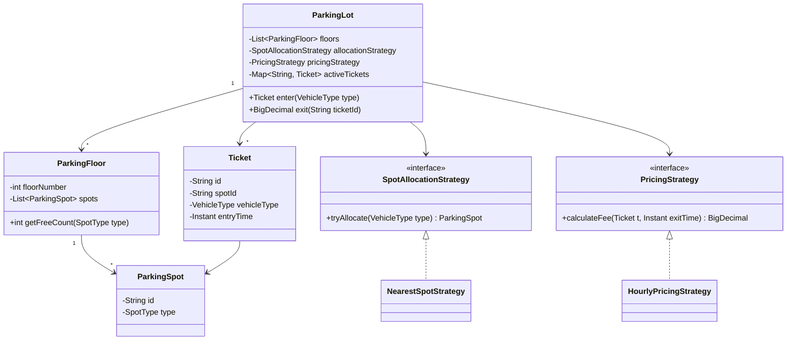

A parking lot is the classic low-level design warm-up: it looks trivial but hides a real type hierarchy, a pluggable pricing engine, and a genuine race condition the moment two cars go for the last free spot at once.

## Requirements

### Functional

- Support multiple vehicle types (motorcycle, car, truck/bus) and matching spot types.
- On entry, automatically find and assign a compatible spot and issue a ticket recording spot, vehicle type and entry time.
- On exit, validate the ticket, compute the fee from time parked, free the spot, and invalidate the ticket.
- Reject entry when no compatible spot is free; reject exit on an unknown, expired or already-used ticket.
- Support multiple floors, and a display board showing free-spot counts per type per floor.

### Non-functional and assumptions

- Payment processing and physical gate hardware are out of scope — assume they call into this system as a black box.
- Peak load means many simultaneous entries at multiple gates; spot assignment must not double-book a spot.
- Pricing must be configurable per vehicle type and, later, per time-of-day, without touching the core allocation logic.
- Single-process, in-memory design for the interview; the strategy boundaries should make sharding across processes later a config change, not a rewrite.

### Clarifying questions to ask

- Which vehicle types and spot types do we need — is a car allowed to occupy a truck spot?
- Is pricing flat, hourly, or does it vary by vehicle type or duration?
- Do we need multi-floor support and a live display board in scope?
- What happens on a lost ticket — is there a manual override/admin flow?
- Is payment part of this design, or do we just return a fee amount?
- How many entry/exit gates operate concurrently, and do they share one in-memory instance?

## Core objects

| Class | Responsibility | Key fields/methods |
|---|---|---|
| `Vehicle` | Represents the car/bike/truck requesting a spot | `licensePlate`, `type` |
| `ParkingSpot` | A single physical spot | `id`, `spotType`, `floorId` |
| `ParkingFloor` | Groups spots, tracks per-type free counts | `spots`, `getFreeCount(type)` |
| `Ticket` | Proof of parking, links vehicle to spot | `id`, `spotId`, `vehicleType`, `entryTime` |
| `SpotAllocationStrategy` | Picks a spot for a vehicle | `tryAllocate(vehicleType) -> ParkingSpot` |
| `PricingStrategy` | Computes the fee for a ticket | `calculateFee(ticket, exitTime) -> BigDecimal` |
| `ParkingLot` | Facade orchestrating entry/exit | `enter(vehicleType)`, `exit(ticketId)` |
| `DisplayBoard` | Read-only view of availability | `refresh()`, `getAvailability()` |

## Class design

The entities and how they relate — a vehicle enters, claims a spot, and receives a ticket that is the single source of truth until it exits:




An earlier whiteboard pass at the same model, before the strategy interfaces were pulled out:


## Key design decisions

### 1. Spot allocation as a Strategy, not an `if/else` chain

`ParkingLot` never scans spots itself; it delegates to `SpotAllocationStrategy`. This is the single decision interviewers probe hardest, because the naive answer hardcodes "loop through spots, return first match" inside the lot class.

| Strategy | Behaviour | When you'd pick it |
|---|---|---|
| `NearestSpotStrategy` | First free spot on the nearest floor to the entrance | Small lots, simple UX |
| `MostFreeFloorStrategy` | Balances occupancy across floors | Large garages, load spreading |
| `PreferredZoneStrategy` | EV/accessible spots first, by vehicle attribute | Regulatory or accessibility requirements |

> [!KEY]
> Rejected alternative: hardcoding the search loop inside `ParkingLot.enter`. It works for one lot but forces a code change — and a redeploy — every time the business wants a different allocation policy.

### 2. Pricing as a Strategy, not a fee formula in the lot class

`PricingStrategy.calculateFee(ticket, exitTime)` isolates money math from spot bookkeeping. `HourlyPricingStrategy` rounds up to the hour; a later `VehicleTypePricingStrategy` or `SurgePricingStrategy` can plug in without touching `enter`/`exit`.

> [!TIP]
> Naming both "Strategy" out loud, and stating that they share the shape "pure function of (state) -> value with no side effects," signals you understand *why* the pattern applies, not just that it exists.

### 3. Occupancy is derived, never duplicated

A tempting first draft puts an `occupied` boolean directly on `ParkingSpot` **and** tracks active tickets in a map. That is two sources of truth that can drift apart under a crash between the two writes.

| Approach | Risk | Fix |
|---|---|---|
| Boolean flag on spot + separate ticket map | Can desync if one write fails | ❌ Rejected |
| Spot occupancy derived from `activeTickets` (one map, keyed by spot id) | Single source of truth | ✅ Used here |


## Implementation

The flow through `exit`, sketched before it was turned into the version below:


```java
public interface SpotAllocationStrategy {
    Optional<ParkingSpot> tryAllocate(List<ParkingSpot> spots, VehicleType type);
}

public interface PricingStrategy {
    BigDecimal calculateFee(Ticket ticket, Instant exitTime);
}

public class HourlyPricingStrategy implements PricingStrategy {
    private final BigDecimal rate;

    public HourlyPricingStrategy(BigDecimal hourlyRate) {
        this.rate = hourlyRate;
    }

    @Override
    public BigDecimal calculateFee(Ticket ticket, Instant exitTime) {
        Duration parked = Duration.between(ticket.getEntryTime(), exitTime);
        long hours = Math.max(1, (long) Math.ceil(parked.toMinutes() / 60.0));
        return rate.multiply(BigDecimal.valueOf(hours));
    }
}
```

```java
public class ParkingLot {
    private final ConcurrentMap<String, Ticket> activeTicketsBySpotId = new ConcurrentHashMap<>();
    private final List<ParkingSpot> allSpots;
    private final SpotAllocationStrategy allocation;
    private final PricingStrategy pricing;

    public Ticket enter(VehicleType type) {
        List<ParkingSpot> free = allSpots.stream()
            .filter(s -> !activeTicketsBySpotId.containsKey(s.getId()))
            .collect(Collectors.toList());
        ParkingSpot spot = allocation.tryAllocate(free, type)
            .orElseThrow(() -> new IllegalStateException("Lot full for this vehicle type"));

        Ticket ticket = new Ticket(UUID.randomUUID().toString(), spot.getId(), type, Instant.now());

        // Atomic claim: the active ticket itself is the occupancy record for the spot.
        if (activeTicketsBySpotId.putIfAbsent(spot.getId(), ticket) != null)
            return enter(type); // retry — spot lost the race

        return ticket;
    }

    public BigDecimal exit(String ticketId) {
        Map.Entry<String, Ticket> entry = activeTicketsBySpotId.entrySet().stream()
            .filter(e -> e.getValue().getId().equals(ticketId))
            .findFirst()
            .orElseThrow(() -> new IllegalStateException("Invalid or already-used ticket"));

        Ticket ticket = entry.getValue();
        BigDecimal fee = pricing.calculateFee(ticket, Instant.now());
        activeTicketsBySpotId.remove(ticket.getSpotId(), ticket);
        return fee;
    }
}
```

Worked example: a car enters at 10:00 and is assigned spot `B`, receiving ticket `T123`. It exits at 12:30 — 2.5 hours parked, rounded up to 3 billable hours; at 500 cents/hour that's a 1,500-cent fee, the ticket for spot `B` is removed from `activeTicketsBySpotId`, so the spot becomes free and the same ticket can never be replayed for a second refund or a second exit.

## Concurrency and thread safety

The real interview test is what happens when two gates call `enter(CAR)` in the same millisecond for the last free car spot:


Three viable designs, in increasing order of scalability:

1. **Single lock around `enter`/`exit`.** Simple and correct, but every gate serializes on one lock — fine for a small lot, a bottleneck for a stadium garage.
2. **`ConcurrentHashMap.putIfAbsent` as an atomic claim** (used above): read the candidate spot list without a lock, then atomically claim it; on failure, retry with the next candidate. No coarse lock, contention only on the actual spot.
3. **Per-floor `ReentrantReadWriteLock`**: many concurrent readers scanning for a free spot, a short write lock only to flip occupancy. Best when reads (searching) vastly outnumber writes (claiming):

```java
private final ReentrantReadWriteLock rwLock = new ReentrantReadWriteLock();

private Optional<ParkingSpot> findAvailableSpot(VehicleType type) {
    rwLock.readLock().lock();
    try {
        return allSpots.stream()
            .filter(s -> s.getType() == type && !activeTicketsBySpotId.containsKey(s.getId()))
            .findFirst();
    } finally {
        rwLock.readLock().unlock();
    }
}

public Ticket enter(VehicleType type) {
    while (true) {
        ParkingSpot spot = findAvailableSpot(type)
            .orElseThrow(() -> new IllegalStateException("No available spots"));
        rwLock.writeLock().lock();
        try {
            Ticket ticket = new Ticket(UUID.randomUUID().toString(), spot.getId(), type, Instant.now());
            if (activeTicketsBySpotId.putIfAbsent(spot.getId(), ticket) == null)
                return ticket; // succeeded under the write lock
        } finally {
            rwLock.writeLock().unlock();
        }
        // Someone else claimed it between the read and the write lock — retry.
    }
}
```

> [!WARNING]
> `putIfAbsent`-and-retry only works if the retry re-reads the free list — if you cache "the chosen spot" before the atomic claim and never re-check, you'll throw a false "lot full" error under contention instead of finding the next candidate.

## Extending the design

| New requirement | Where it plugs in | Why the design allows it |
|---|---|---|
| Reservations / pre-booking | New `ReservationService` calling `ParkingSpot.reserve()` before `enter` | Spot state is already abstracted behind the allocation strategy |
| Multi-floor garage | `ParkingFloor` composite already groups spots | `ParkingLot` iterates floors via the same strategy interface |
| Surge/dynamic pricing | New `PricingStrategy` implementation | `exit` never knows which strategy is injected |
| Motorcycle overflow into car spots | New `OverflowAllocationStrategy` wrapping the default | Strategy composition, no change to `ParkingLot` |
| Live display board | `DisplayBoard` reads `ParkingFloor.getFreeCount` | Read path is already separated from the write (claim) path |
| Lost ticket recovery | An admin `reissueTicket(spotId)` endpoint that looks up the active ticket by spot id and prints a duplicate | Occupancy is already keyed by spot id, so the original ticket's data is still recoverable without touching allocation or pricing |

## Cheat sheet

- Model vehicle and spot types as parallel enums or hierarchies — don't conflate them.
- Allocation and pricing are the two axes of change → both become Strategy interfaces.
- Never store occupancy in two places; derive it from the active-ticket map.
- Round pricing up to the next unit unless told otherwise, and say so out loud.
- The concurrency question is always coming — have an atomic-claim answer ready before you're asked.
- A ticket ID should be single-use: remove it from the active map on exit, don't just flag it "used".
- Multi-floor is composition (`ParkingLot` has `ParkingFloor`s has `ParkingSpot`s), not a bigger flat list.

## Common mistakes

| Mistake | Fix |
|---|---|
| Hardcoding the spot search loop inside `ParkingLot` | Extract `SpotAllocationStrategy` from the first draft |
| Boolean `occupied` flag plus a separate ticket map | Derive occupancy from one map, keyed by spot id |
| Locking the whole lot for every entry | Use atomic per-spot claims or per-floor read/write locks |
| Forgetting to invalidate the ticket on exit | Remove (not just flag) the ticket from the active map |
| Pricing logic embedded in `exit` | Extract `PricingStrategy`, inject it |
| Ignoring the "lot full" and "invalid ticket" error paths | Call them out explicitly as functional requirements |

## Summary

A parking lot design earns its interview slot because it forces two independent axes of change — how a spot is chosen, and how a fee is computed — into two Strategy interfaces, keeping `ParkingLot` itself thin. The one true trap is treating spot occupancy as two mutable flags instead of one derived source of truth, which is exactly what breaks under concurrent entry. Get the strategies and the atomic claim right, and multi-floor, reservations and dynamic pricing all become additive changes rather than rewrites.

## Top Interview Questions

### Q1. Why use the Strategy pattern for both spot allocation and pricing instead of one configurable `ParkingLot` class?

Because they vary independently and for different reasons — allocation policy changes based on garage layout and traffic patterns, pricing changes based on business rules and time. Bundling both into `ParkingLot` with flags or switches violates the Open/Closed Principle: every new policy means editing and redeploying the core class. With two interfaces, `ParkingLot` depends only on the abstractions, new policies are new classes, and you can unit test allocation and pricing in complete isolation from each other and from the concurrency logic.

### Q2. How do you prevent two vehicles from being assigned the same spot under concurrent entry?

Read the candidate spot list without a lock (cheap, happens constantly), then perform a single atomic operation — `ConcurrentHashMap.putIfAbsent(spotId, ...)` or a compare-and-swap — to claim it. If the claim fails, another thread won the race for that spot, so retry with the next candidate rather than failing outright. This avoids a lot-wide lock while still guaranteeing exactly one ticket per spot; the atomicity lives at the level of the individual resource being contended, not the whole system.

### Q3. Why should occupancy be derived from active tickets rather than stored as a flag on `ParkingSpot`?

Two independent pieces of mutable state that must always agree are a bug waiting for a crash at the wrong moment — if you set the flag but fail to record the ticket (or vice versa), the system silently corrupts itself. Deriving occupancy from "does an active ticket reference this spot id" means there is exactly one place that can be wrong, and it fails safe: a missing ticket means the spot reads as free, which is the safer default to debug.

### Q4. How would you support a motorcycle parking in a car spot when all motorcycle spots are full?

Add an `OverflowAllocationStrategy` that wraps the default exact-match strategy. It first asks for a motorcycle spot; if none is free, it retries with the next compatible larger type, such as a car spot, and only then reports the lot full. Keep the compatibility ranking (`MOTORCYCLE -> COMPACT -> LARGE`, or whatever the business allows) inside the strategy, not inside `ParkingLot.enter`. That preserves Open/Closed: the lot still calls one `tryAllocate(vehicleType)` method, while the policy can later change to prefer overflow only on certain floors, reserve accessible spots, or charge a different price. Also make the choice explicit in reporting/display boards, because using a larger spot reduces capacity for cars and can surprise operations teams if it is hidden.

### Q5. How do you calculate the parking fee, and what edge cases matter?

Take `exitTime - entryTime`, convert to hours, and round up (a car parked for 61 minutes owes two hours, not 1.0166). Edge cases: a ticket presented twice (must be single-use — remove it from the active map on first exit), a negative duration from clock skew across gate machines (clamp to a minimum, log it, and prefer a monotonic or server-side clock over each gate's local clock), and free grace periods (e.g., under 5 minutes) if the business specifies one.

### Q6. How would you extend this design to a multi-floor garage with a live availability display?

Introduce `ParkingFloor` as a composite that owns a list of spots and can report free counts per type; `ParkingLot` becomes a list of floors instead of a flat spot list, and the allocation strategy iterates floors using the same interface (nearest floor first, or most-free floor, are just different strategy implementations). The `DisplayBoard` only needs read access to `ParkingFloor.getFreeCount`, which is naturally decoupled from the write path (claiming a spot), so refreshing the board never contends with entry/exit traffic.

### Q7. What happens if the process crashes between claiming a spot and issuing the ticket?

In the in-memory design shown, both happen inside `enter` before returning, so a crash mid-call loses the whole request — the caller gets no ticket, and a supervising process should treat that spot claim as provisional until a heartbeat or reconciliation job confirms a ticket exists for it. In a persistent design, you'd wrap the claim and ticket insert in a single transaction (or use an outbox pattern) so the two either both commit or neither does — this is worth naming even if it is out of scope for the toy version, because it shows you think past the happy path.

### Q8. Why prefer a per-spot atomic claim over a single lock around the whole `Enter` method?

A single lock serializes every entry attempt across the entire lot, even when they target completely unrelated spots — throughput collapses under load from many simultaneous gates. A per-spot atomic claim only creates contention when two threads genuinely want the *same* spot, which is rare once the free-spot list is reasonably large. The trade-off is code complexity: you need a retry loop and must reason carefully about the read-then-claim window, whereas a single lock is trivially easy to reason about. For an interview, name both and justify picking the finer-grained one under expected load.

### Q9. How is this parking lot design similar to (or different from) a database connection pool?

Both are "acquire one resource from a fixed pool, use it, release it" problems, and both need the acquire step to be atomic to avoid double-allocation. The difference is lifecycle: a parking ticket is tied to a specific spot for the whole session and released explicitly by an external event (the driver exiting), whereas a pooled connection is typically returned automatically (via try-with-resources / `close()`) as soon as the caller is done. Drawing this parallel out loud is a good way to show you recognize the underlying resource-pool pattern rather than treating parking as a one-off problem.

### Q10. How would you unit test the allocation and pricing strategies in isolation?

Test each `SpotAllocationStrategy` implementation directly against a hand-built list of `ParkingSpot` objects, asserting which spot id comes back for a given vehicle type and occupancy pattern — no `ParkingLot` involved. Test each `PricingStrategy` against a fixed `(entryTime, exitTime)` pair, asserting the fee, including boundary cases like exactly on the hour versus one minute over. Then a smaller set of integration tests exercises `ParkingLot.enter`/`exit` end to end with a fake/no-op strategy to confirm the orchestration (ticket issuance, occupancy bookkeeping, error paths) is correct independent of which real strategy is plugged in.

### Q11. What's the difference between rejecting an entry and blocking until a spot frees up?

Rejecting is a synchronous, stateless decision — "no spot available, return an error now" — and is what a physical gate needs, since a car can't be told to wait indefinitely in a queue that blocks other traffic. Blocking would require a request queue and a notification mechanism (e.g., a semaphore per spot type, or a message when a spot frees), which is a legitimate extension for a valet or reservation system but adds real complexity: you need timeouts, cancellation, and fairness between waiting requests. State clearly which one the requirements call for before building it — this is a good clarifying question in itself.

### Q12. How would this design change if you needed to run it across multiple servers instead of a single process?

The atomic claim (`ConcurrentHashMap.putIfAbsent`) has to move from in-memory to something that gives the same atomicity across processes — a database row with a unique constraint on spot id plus a status column, or a distributed lock/compare-and-swap in Redis. The Strategy interfaces don't need to change at all; only the storage behind `ParkingSpot`/`Ticket` state does. This is exactly why keeping allocation and pricing behind interfaces instead of baking them into `ParkingLot` pays off — the scaling change is localized to the persistence layer.
