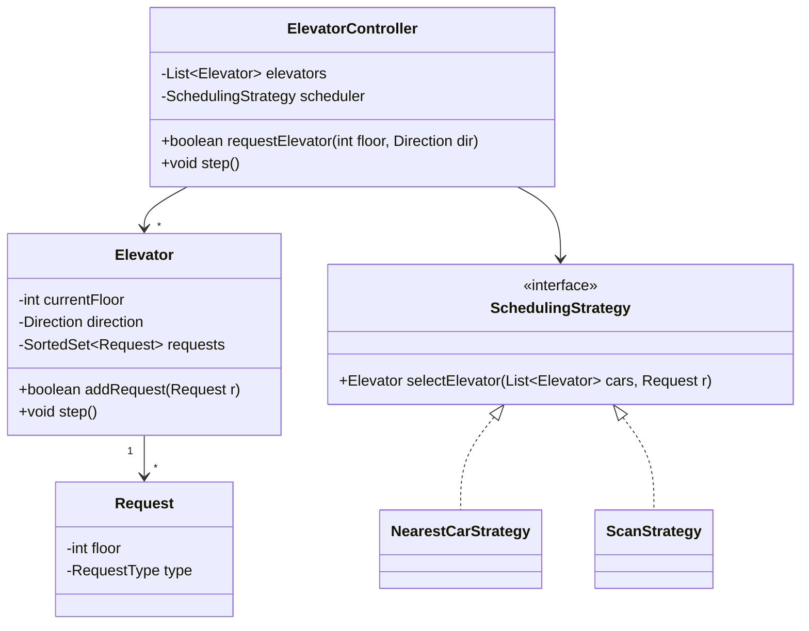
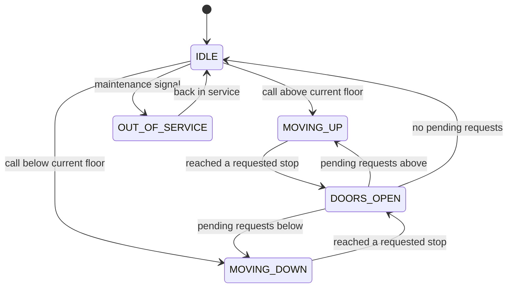

An elevator system is a scheduling problem wearing a state-machine costume. Moving one car up and down is trivial; the interview-worthy part is deciding which of several cars answers a hall call, and how a car reorders its stops without starving a request forever.

## Requirements

### Functional

- Accept **external hall calls**: a floor button press with a direction (UP or DOWN), before anyone is inside a car.
- Accept **internal car calls**: a destination floor pressed from inside a car, with no direction.
- Given multiple elevators, decide which one answers each hall call.
- Advance all elevators through discrete time steps (`step()`/`tick()`), each servicing its own queue of stops.
- Reject invalid floor numbers; treat a call for the current floor as already served.
- Support taking a car out of service (maintenance/emergency) and reassigning its pending calls.

### Non-functional and assumptions

- Floor count and elevator count are configuration, not hardcoded constants.
- Door timing, weight limits and sensor hardware are abstracted away — assume the controller is told "car arrived" and "call placed" as discrete events.
- No request should starve: a car committed to a direction should not reverse until it has serviced every stop in that direction.
- The dispatch algorithm must be swappable without touching how a single elevator manages its own queue.

### Clarifying questions to ask

- How many floors and elevators, and are they fixed or configurable at runtime?
- Are hall calls directional (separate UP/DOWN buttons), or just "an elevator is wanted here"?
- Is this a tick-based simulation, or should it react to real asynchronous events?
- Is capacity/weight limiting in scope, or can we assume unlimited capacity?
- Do we need express elevators, floor restrictions, or VIP priority calls?
- What should happen to an elevator's pending requests if it goes out of service mid-trip?

## Core objects

| Class | Responsibility | Key fields/methods |
|---|---|---|
| `Elevator` | Owns one car's queue and physical state | `currentFloor`, `direction`, `requests`, `step()`, `addRequest(r)` |
| `Request` | A hall call or car call, value-equal by floor+type | `floor`, `type` (PICKUP_UP/PICKUP_DOWN/DESTINATION) |
| `SchedulingStrategy` | Chooses which elevator answers a hall call | `selectElevator(cars, request) -> Elevator` |
| `ElevatorController` | Dispatcher/orchestrator, owns the fleet | `requestElevator(floor, dir)`, `step()` |
| `ElevatorState` (enum) | IDLE / MOVING_UP / MOVING_DOWN / OUT_OF_SERVICE | used by both `Elevator` and dispatch filtering |

## Class design



### Elevator state machine



Earlier whiteboard passes toward this same model:


## Key design decisions

### 1. Scheduling as a pluggable Strategy

The dispatcher (`ElevatorController`) never hardcodes "pick the closest car" — it delegates to `SchedulingStrategy`, because this is the part real systems tune constantly.

| Strategy | Behaviour | Trade-off |
|---|---|---|
| FCFS | Serve hall calls in arrival order, any free car | Simple, but ignores car position — poor average wait |
| Nearest-car | Pick the idle/compatible car closest to the call | Good for light traffic, can starve far requests under load |
| SCAN / LOOK | A car sweeps in one direction, serving all calls on the way, reverses only when nothing is left ahead | Best throughput and fairness; the industry-standard baseline |

> [!KEY]
> Rejected alternative: baking "closest idle elevator" logic directly into `ElevatorController.requestElevator`. It ties the dispatcher to one policy — swapping in SCAN later means editing the orchestrator instead of adding a class.

> [!WARNING]
> "Closest car already moving toward the call" is not, by itself, a correct filter. A car can be moving toward the requested floor right now but already have a stop queued *before* it that will flip its direction early — for example a car at floor 3 heading up with a destination call for floor 4 will turn around at 4 and never reach a hall call at floor 7. The strategy must also confirm the car has a request at or beyond the target floor in its current direction before treating it as "committed" — otherwise you dispatch a car that reverses just short of the passenger.

### 2. Elevator movement as an explicit state machine

Each `Elevator` tracks its `direction` (`IDLE`/`UP`/`DOWN`) as real state, not a derived value recomputed ad hoc. This makes the "don't reverse while requests remain ahead" rule a single guard clause instead of scattered conditionals, and makes the system trivially testable one tick at a time.

> [!TIP]
> Saying "the elevator's direction is state, and I only flip it when there is nothing left to serve ahead of me" is the sentence that proves you understand SCAN, not just that you've heard the word.

### 3. Requests are value objects, deduplicated by floor + type

A `new Request(5, RequestType.PICKUP_UP)` pressed twice should not queue two stops — `Request` overrides equality on `(floor, type)` and is stored in a `HashSet`/`SortedSet`, so re-pressing a button is a no-op rather than a duplicate stop.

| Design | Problem |
|---|---|
| Requests as a plain list, no equality | Duplicate presses queue duplicate stops |
| Requests as value-equal objects in a set | ✅ Idempotent — re-pressing is free |

### 4. Dispatcher and car are separate objects with separate responsibilities

`ElevatorController` only decides *which* car takes a call; `Elevator` only decides *when* to stop and *which way* to move next. This split means the SCAN logic inside `Elevator.step()` is unaffected if you rewrite dispatch from nearest-car to a zone-based strategy for 100 elevators — a natural Single Responsibility split.

## Implementation

```java
public interface SchedulingStrategy {
    Optional<Elevator> selectElevator(List<Elevator> cars, Request request);
}

public class NearestCarStrategy implements SchedulingStrategy {
    @Override
    public Optional<Elevator> selectElevator(List<Elevator> cars, Request request) {
        List<Elevator> inService = cars.stream()
            .filter(c -> c.getState() != ElevatorState.OUT_OF_SERVICE)
            .collect(Collectors.toList());

        // Hall calls only ever carry PICKUP_UP/PICKUP_DOWN; map to a travel direction.
        Direction callDirection = request.getType() == RequestType.PICKUP_UP
            ? Direction.UP : Direction.DOWN;

        // Tier 1: already moving toward the call, not past it, and committed to a
        // stop at or beyond it — so it won't reverse before it gets there.
        Optional<Elevator> committed = inService.stream()
            .filter(c -> c.getDirection() == callDirection)
            .filter(c -> callDirection == Direction.UP
                ? c.getCurrentFloor() <= request.getFloor()
                : c.getCurrentFloor() >= request.getFloor())
            .filter(c -> c.hasRequestAtOrBeyond(request.getFloor(), callDirection))
            .min(Comparator.comparingInt(c -> Math.abs(c.getCurrentFloor() - request.getFloor())));
        if (committed.isPresent()) return committed;

        // Tier 2: nearest idle car.
        Optional<Elevator> idle = inService.stream()
            .filter(c -> c.getDirection() == Direction.IDLE)
            .min(Comparator.comparingInt(c -> Math.abs(c.getCurrentFloor() - request.getFloor())));
        if (idle.isPresent()) return idle;

        // Tier 3: nearest car of any kind, as a last resort.
        return inService.stream()
            .min(Comparator.comparingInt(c -> Math.abs(c.getCurrentFloor() - request.getFloor())));
    }
}
```

```java
public class Elevator {
    private int currentFloor;
    private Direction direction = Direction.IDLE;
    private final SortedSet<Request> requests = new TreeSet<>(new RequestComparator());

    public int getCurrentFloor() {
        return currentFloor;
    }

    public Direction getDirection() {
        return direction;
    }

    public boolean addRequest(Request r) {
        if (r.getFloor() == currentFloor) return true; // already here, no-op
        return requests.add(r);
    }

    // Used by the scheduler to confirm this car won't reverse before reaching floor.
    public boolean hasRequestAtOrBeyond(int floor, Direction dir) {
        return dir == Direction.UP
            ? requests.stream().anyMatch(r -> r.getFloor() >= floor)
            : requests.stream().anyMatch(r -> r.getFloor() <= floor);
    }

    public void step() {
        if (requests.isEmpty()) {
            direction = Direction.IDLE;
            return;
        }

        if (direction == Direction.IDLE)
            direction = requests.first().getFloor() > currentFloor ? Direction.UP : Direction.DOWN;

        if (requests.stream().anyMatch(r -> r.getFloor() == currentFloor)) {
            requests.removeIf(r -> r.getFloor() == currentFloor);
            return; // doors open this tick, don't move
        }

        boolean moreAhead = direction == Direction.UP
            ? requests.stream().anyMatch(r -> r.getFloor() > currentFloor)
            : requests.stream().anyMatch(r -> r.getFloor() < currentFloor);

        if (!moreAhead) {
            direction = direction == Direction.UP ? Direction.DOWN : Direction.UP;
            return;
        }
        currentFloor += direction == Direction.UP ? 1 : -1;
    }
}
```

```java
public class ElevatorController {
    private final List<Elevator> elevators;
    private final SchedulingStrategy scheduler;

    public boolean requestElevator(int floor, RequestType type) {
        Request request = new Request(floor, type);
        return scheduler.selectElevator(elevators, request)
            .map(best -> best.addRequest(request))
            .orElse(false);
    }

    public void step() {
        for (Elevator e : elevators) e.step();
    }
}
```

## Concurrency and thread safety

Hall calls arrive from independent floor panels and can hit `requestElevator` at the exact same instant from different threads, while a background loop calls `step()` on a timer. Two safe designs:

1. **Lock-free ingestion queue**: `requestElevator` enqueues onto a thread-safe `ConcurrentLinkedQueue<Request>`; the single-threaded `step()` loop drains the queue at the start of each tick before moving any car. This avoids any lock around the actual scheduling/movement logic, which stays single-threaded and easy to reason about.
2. **Coarse lock around the fleet**: a single lock guards both `requestElevator` and `step()`. Simple, correct, but every call submission blocks every other — acceptable for a building, not for a simulation processing thousands of calls a second.

> [!WARNING]
> If elevators are stepped in parallel (one thread per car) to save CPU, each `Elevator` needs its own lock around its `requests` set — but the dispatcher's read of `currentFloor`/`direction` across cars during `selectElevator` must then tolerate slightly stale data, or you need a lock ordering discipline to avoid deadlock between dispatch and per-car steps.

## Extending the design

| New requirement | Where it plugs in | Why the design allows it |
|---|---|---|
| Express elevator serving only floors {0, 20, 40} | New `Elevator` subtype/flag checked in `addRequest` | Validation lives at the point requests enter the car, not in the dispatcher |
| VIP/priority call | `Request` gains a priority field; scheduler sorts by it | Scheduling policy is already isolated behind `SchedulingStrategy` |
| Capacity/weight limits | `Elevator.addRequest` rejects boarding above a threshold | Same single entry point already validates requests |
| 100 elevators, 1000 floors | Replace `NearestCarStrategy` with a zone-based/ETA strategy that pre-filters candidates | Dispatcher only depends on the interface, not the algorithm |
| Cancel a floor request | `requests.remove(request)` | Requests are already a set, not an opaque queue |

## Cheat sheet

- Two request kinds: hall call (has direction) and car call (destination only) — never conflate them.
- Direction is state on the elevator, not a value recomputed from nothing each tick.
- SCAN/LOOK beats FCFS and nearest-car on fairness under load — name it and say why.
- Dispatcher picks *which* car; the car itself decides *when* to stop and *which way* next — keep those separate.
- Requests must be value-equal and deduplicated, or repeated button presses queue duplicate stops.
- Never reverse direction while requests remain ahead in the current direction — that's the starvation bug.
- Model out-of-service as a state, not a null elevator, so pending requests can be reassigned cleanly.

## Common mistakes

| Mistake | Fix |
|---|---|
| Hardcoding "nearest idle car" inside the controller | Extract `SchedulingStrategy`, inject the policy |
| Recomputing direction from scratch every tick | Store `direction` as elevator state, mutate it explicitly |
| Reversing direction as soon as the elevator is momentarily idle at a floor | Only reverse when no requests remain ahead in the current direction |
| Treating hall calls and destination calls identically | Hall calls carry direction and affect dispatch; destinations don't |
| Storing requests in a plain list | Duplicate button presses queue duplicate stops — use a set with equality |
| One global lock around every operation | Prefer a drain-queue-then-single-threaded-step design for throughput |

## Summary

The elevator problem rewards separating three concerns that are easy to tangle: which car answers a call (dispatch strategy), how a car orders its own stops (SCAN-style state machine), and how calls are safely ingested under concurrency. Keep `ElevatorController` and `Elevator` responsibilities distinct, make direction real state instead of a derived guess, and dedupe requests by value. Do that, and express elevators, VIP calls, capacity limits and fleets of a hundred cars are all additive changes to the strategy layer, not rewrites of the core.

## Top Interview Questions

### Q1. What is the difference between a hall call and a car call, and why does it matter for design?

A hall call is placed from a floor before boarding and carries a direction (UP or DOWN) — it means "I want to go up/down from here" and is what the dispatcher uses to decide which elevator to send. A car call is placed from inside an elevator after boarding and is just a destination floor with no direction, since the car is already committed to serving that passenger. The distinction matters because only hall calls participate in the fleet-wide dispatch decision; car calls only affect the queue of the elevator the passenger is already in. Conflating them breaks SCAN-style scheduling, because you'd be trying to "dispatch" a request that is already bound to a specific car.

### Q2. Explain the SCAN (elevator) algorithm and why it's preferred over FCFS.

SCAN has each elevator sweep in one direction, serving every pending stop along the way, and only reverses direction once nothing remains ahead of it in the current direction — much like a disk arm sweeping across cylinders. FCFS serves requests strictly in arrival order regardless of the car's position, which produces wasted travel (going up, then down, then up again for requests that arrived out of physical order) and worse average wait time under load. SCAN's guarantee — no reversal while requests remain ahead — is also what prevents starvation: a request at floor 1 while the car is at floor 9 heading down will always eventually be served on the current sweep, not indefinitely deferred.

### Q3. How would you decide which elevator answers a hall call among several?

Filter to elevators not out of service, then score candidates: cars already moving toward the call in the matching direction and not yet past it are strong candidates (they can pick it up "for free" on their current sweep); idle cars are next-best, scored by distance; cars moving away are worst-case fallbacks. This is exactly the kind of policy that should live behind a `SchedulingStrategy` interface so it can be swapped for a fleet-aware or ETA-based algorithm without touching how any individual elevator manages its own stops.

### Q4. How do you model an elevator's direction, and why does a naive implementation reverse too eagerly?

Direction should be persistent state (`IDLE`/`UP`/`DOWN`) on the `Elevator`, updated only by an explicit rule: pick a direction when transitioning from idle, and only flip it once there are no remaining requests ahead in the current direction. A naive implementation that recomputes "which way should I go" from scratch every tick based on the *nearest* remaining request will reverse as soon as the nearest pending stop happens to be behind the car — even if there are stops ahead too — causing thrashing and violating the fairness guarantee that SCAN is supposed to provide.

### Q5. How would you prevent request starvation in this system?

Starvation is prevented structurally by the "don't reverse while requests remain ahead" rule: any request in the car's current direction of travel is guaranteed service before the car turns around, so the worst case for any single request is one full sweep of the building. You can further bound worst-case wait by adding an aging mechanism — if a hall call has waited beyond a threshold, boost its effective priority in the scheduler so an idle-adjacent car is dispatched to it even if a "better" candidate exists elsewhere, trading a small efficiency loss for a hard latency bound.

### Q6. How would you extend the design to support an express elevator that only stops at floors 0, 20 and 40?

Add a floor-restriction check at the single place requests already enter the car — `Elevator.addRequest` — so a destination or hall call for a non-express floor is rejected by that elevator without touching the rest of the movement logic. On the dispatch side, the `SchedulingStrategy` should also skip express cars for non-express-floor hall calls, or you'll assign a call to a car that will immediately reject it. Because both checks reuse the existing entry points (`addRequest`, `selectElevator`), this is a small, additive change rather than new machinery.

### Q7. What data structure would you use to store an elevator's pending requests, and why?

A sorted set (e.g., `SortedSet<Request>` with a comparer on floor, or two separate sorted structures for up-requests and down-requests) gives you O(log n) insert/remove and O(1) access to the minimum/maximum floor, which is exactly what's needed to find "the next stop in the current direction" quickly. Crucially, `Request` must have value equality on `(floor, type)` so the set naturally deduplicates repeated button presses — storing requests in a plain list would let the same floor be queued twice and complicate the "have I served this stop" check.

### Q8. Two hall calls arrive at the same instant for the same floor from two threads. How do you avoid double-dispatch?

Serialize request ingestion through a single-writer path: either a lock around `requestElevator`, or (preferred for throughput) a thread-safe queue that a single-threaded tick loop drains before any dispatch decision is made. Because `Request` equality already dedupes identical (floor, type) pairs at the `Elevator.addRequest` level, even if the dispatcher briefly considers the same request twice, the second `addRequest` call is a harmless no-op rather than a duplicate stop — a good example of value-equality doubling as a concurrency safety net.

### Q9. How would this design change to support 100 elevators across 1000 floors?

The per-elevator state machine (`step()`) doesn't need to change at all — it already operates on one car's own queue. What must change is the dispatch strategy: scanning all 100 elevators for every hall call is wasteful, so you'd partition elevators into zones (by floor range) or maintain a lightweight index of each car's position/direction, and have the scheduler pre-filter to a small candidate set before scoring. This is the same lesson as the parking lot at scale — put scaling concerns in the orchestration/dispatch layer, keep the core unit's behavior unchanged.

### Q10. How do you handle an elevator going out of service mid-trip?

Transition the elevator to an `OUT_OF_SERVICE` state (visible in the state machine), stop accepting new requests via `addRequest`, and reassign its currently pending requests to other elevators through the same `ElevatorController.requestElevator` path used for fresh hall calls — car calls from passengers already inside are the harder case, since those passengers need to be notified to disembark at the next reachable floor. This is a good moment to mention that real systems also fire an alert/maintenance ticket, which is outside the core algorithm but worth naming to show production awareness.

### Q11. How would you unit test the scheduling strategy independently of the elevator movement logic?

Construct a list of `Elevator` fakes/stubs with fixed `currentFloor` and `direction` values (no real `step()` calls needed), feed a `Request` into `SchedulingStrategy.selectElevator`, and assert which elevator comes back for a range of scenarios — an elevator already moving toward the call, all elevators idle, all elevators moving away. Separately, test `Elevator.step()` in isolation by asserting the floor/direction sequence over several ticks given a fixed set of requests, with no controller involved. Because the two responsibilities never share state, they can be tested completely independently, which is the practical payoff of the design split.

### Q12. What would you log or monitor in production for this system?

Average and p99 wait time per hall call (time from press to elevator arrival), average and p99 travel time per car call, per-elevator utilization (percentage of ticks spent moving vs idle vs out of service), and a starvation alarm — any single request whose wait time exceeds a threshold, which should never happen if the SCAN invariant holds and would indicate a bug in the reversal logic. Logging which strategy selected which elevator for each call also makes it possible to A/B test a new `SchedulingStrategy` against production traffic before fully cutting over.
