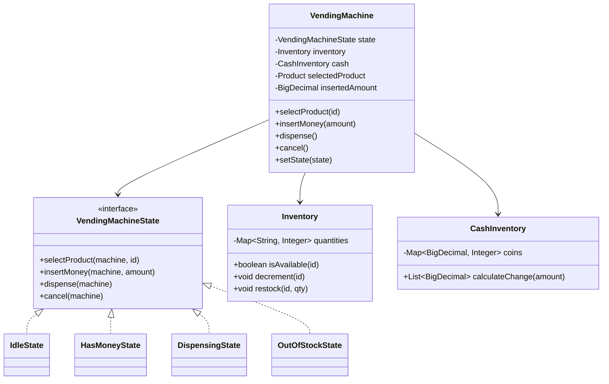
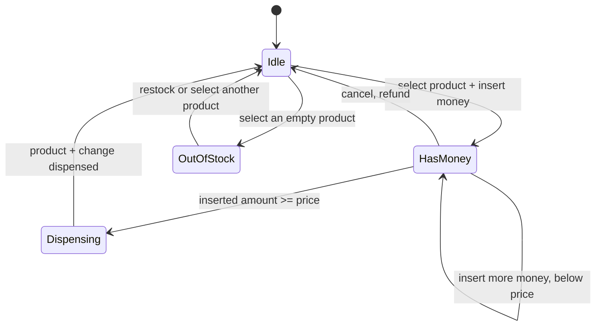

A vending machine is the textbook case for the State pattern: the same button press means something different depending on whether the machine is idle, holding money, or mid-dispense, and a hand-rolled switch statement tracking that combination rots fast.

## Requirements

### Functional

- Let a user select a product, then insert money (coins and notes) toward its price.
- Dispense the product and any change once the inserted amount covers the price.
- Support cancelling mid-transaction with a full refund of inserted money.
- Reject selection of an out-of-stock product and surface that clearly.
- Support an admin restock operation that adds inventory without disrupting an active transaction.

### Non-functional and assumptions

- One physical transaction is active at a time — the machine serializes the whole select→insert→dispense flow.
- The machine holds a bank of coins for change and must refuse to dispense if it cannot make correct change.
- Restocking can happen concurrently (an admin refilling a live machine) and must not corrupt inventory counts mid-vend.
- Payment is coins/notes for this design; card/contactless should be addable without touching the state machine.

### Clarifying questions to ask

- What payment methods are in scope — coins and notes only, or card too?
- Can the user insert money before selecting a product, or only after?
- What happens if the machine cannot make exact change for the selected product?
- Should cancelling refund exact inserted coins, or just the total value?
- Is admin restock part of this design, or assumed to happen offline?
- Do we need to support multiple simultaneous machines sharing one inventory backend?

## Core objects

| Class | Responsibility | Key fields/methods |
|---|---|---|
| `Product` | A vendable item and its price | `id`, `name`, `price` |
| `Inventory` | Tracks stock per product, atomic decrement | `isAvailable(id)`, `decrement(id)`, `restock(id, qty)` |
| `CashInventory` | Holds coin/note stock, computes change | `calculateChange(amount)`, `add(money)` |
| `VendingMachineState` | One state's behaviour for every action | `selectProduct`, `insertMoney`, `dispense`, `cancel` |
| `IdleState` / `HasMoneyState` / `DispensingState` / `OutOfStockState` | Concrete states | implement `VendingMachineState` |
| `VendingMachine` | Context holding current state and transaction data | `selectedProduct`, `insertedAmount`, `setState(s)` |

## Class design



### State machine



For a multi-product machine, an empty slot is usually a rejected selection that leaves the machine in `Idle`; `OutOfStock` is only a machine-wide state when no product can be sold.

## Key design decisions

### 1. State pattern instead of a switch statement plus boolean flags

The naive first draft tracks `hasSelectedProduct`, `hasEnoughMoney`, `isDispensing` as booleans and gates every method with nested `if`s. That combinatorial flag-checking is exactly what the State pattern replaces.

| Approach | What goes wrong |
|---|---|
| Booleans + one big switch per action | Every new state adds a flag and multiplies the `if` combinations across every method — `insertMoney` has to know about states it shouldn't care about |
| One class per state, common interface | Each state only implements the transitions valid *from itself*; invalid actions (e.g. `dispense()` while `Idle`) throw naturally because that state's method says so |

> [!KEY]
> Rejected alternative: a single `VendingMachine` class with a `TransactionStatus` enum and a giant switch in every public method. It works for four states; it becomes unreadable the moment you add "card payment pending" or "dispensing jammed" as states, because every existing switch statement needs a new case.

### 2. Inventory decrement is atomic, never "check-then-decrement" in two steps

`Inventory.decrement(id)` must be the same operation that verifies availability, not a `isAvailable()` check followed by a separate decrement call — otherwise a restock racing with a vend (or two vend attempts in a networked multi-machine setup) can decrement below zero or double-sell the last unit.

> [!WARNING]
> `if (inventory.isAvailable(id)) inventory.decrement(id)` is a classic time-of-check-to-time-of-use bug. Make `decrement` itself return `false` if it would go negative, and treat that as the source of truth.

### 3. Change calculation as a bounded greedy algorithm, not full optimality

`CashInventory.calculateChange` greedily takes the largest denomination it has stock of that fits the remaining amount, denomination by denomination. This is not always the minimum-coin-count solution (that would need dynamic programming), but a vending machine's denomination set (quarters, dimes, nickels, ones) makes greedy optimal in practice, and the machine must refuse the sale rather than dispense wrong change if greedy runs out of a denomination.

| Approach | Verdict |
|---|---|
| Greedy, largest-first, fail if it can't zero out the remainder | ✅ Simple, matches real hardware, correct for canonical currency denominations |
| DP for guaranteed minimum coin count | ❌ Overkill — no realistic denomination set where greedy and optimal diverge, and it hides the "can't make change" case behind more code |

> [!NOTE]
> A real coin mechanism can usually only dispense coins, not notes, as change. Model that by tagging each denomination in `CashInventory` (coin vs. note) and having `calculateChange` skip note-only denominations when building change — a filter on the existing greedy loop, not a parallel type hierarchy for money.

## Implementation

```java
public interface VendingMachineState {
    void selectProduct(VendingMachine m, String productId);
    void insertMoney(VendingMachine m, BigDecimal amount);
    void dispense(VendingMachine m);
    void cancel(VendingMachine m);
}
```

```java
public class IdleState implements VendingMachineState {
    @Override
    public void selectProduct(VendingMachine m, String productId) {
        if (!m.getInventory().isAvailable(productId)) {
            throw new IllegalStateException("Product out of stock");
        }
        m.setSelectedProduct(m.getInventory().getProduct(productId));
        m.setState(new HasMoneyState());
    }

    @Override
    public void insertMoney(VendingMachine m, BigDecimal a) {
        throw new IllegalStateException("Select a product first");
    }

    @Override
    public void dispense(VendingMachine m) {
        throw new IllegalStateException("Nothing selected");
    }

    @Override
    public void cancel(VendingMachine m) { }
}

public class HasMoneyState implements VendingMachineState {
    @Override
    public void selectProduct(VendingMachine m, String productId) {
        throw new IllegalStateException("Transaction in progress");
    }

    @Override
    public void insertMoney(VendingMachine m, BigDecimal amount) {
        m.setInsertedAmount(m.getInsertedAmount().add(amount));
        if (m.getInsertedAmount().compareTo(m.getSelectedProduct().getPrice()) >= 0)
            m.setState(new DispensingState());
    }

    @Override
    public void dispense(VendingMachine m) {
        throw new IllegalStateException("Insufficient funds");
    }

    @Override
    public void cancel(VendingMachine m) {
        m.refundInserted();
        m.setState(new IdleState());
    }
}
```

```java
public List<BigDecimal> calculateChange(BigDecimal amount) {
    List<BigDecimal> change = new ArrayList<>();
    Map<BigDecimal, Integer> plannedCounts = new HashMap<>();
    BigDecimal remaining = amount;

    List<BigDecimal> denominations = coins.keySet().stream()
        .sorted(Comparator.reverseOrder())
        .collect(Collectors.toList());

    for (BigDecimal denom : denominations) {
        int available = coins.get(denom);
        while (remaining.compareTo(denom) >= 0 && plannedCounts.getOrDefault(denom, 0) < available) {
            change.add(denom);
            plannedCounts.merge(denom, 1, Integer::sum);
            remaining = remaining.subtract(denom);
        }
    }
    if (remaining.compareTo(BigDecimal.ZERO) > 0)
        throw new IllegalStateException("Cannot make exact change");

    plannedCounts.forEach((denom, count) -> coins.put(denom, coins.get(denom) - count));
    return change;
}
```

Worked example: a Coke costs 35 and the user inserts a 50 note; `calculateChange(15)` walks denominations largest-first — two 5s and a 5 (or a 10 and a 5, depending on stock) — building a tentative change plan, committing the coin decrements only after the remainder reaches zero, and only after this succeeds does `DispensingState` decrement inventory and hand back both the product and the change.

## Concurrency and thread safety

A single physical machine has one transaction at a time, so the entry points (`selectProduct`, `insertMoney`, `dispense`, `cancel`) should share one lock inside `VendingMachine` — the state transitions themselves are cheap, so coarse locking here costs nothing in practice and avoids two coin insertions interleaving into a corrupted `insertedAmount`.

Restocking is the interesting case: an admin can restock while a customer transaction is mid-flight. `Inventory` needs its own lock (or a `ConcurrentHashMap` with atomic increment/decrement) independent of the transaction lock, so a restock never blocks on — or corrupts — an in-progress vend. `CashInventory` needs the same treatment: adding inserted coins to the bank and calculating change from it must not race with a concurrent restock of the coin bank.

> [!TIP]
> Say out loud: "the transaction state machine and the inventory counters are two different concurrency domains with two different locks" — that's the sentence that shows you're not just going to wrap the whole class in one `synchronized (this)` and call it done.

## Extending the design

| New requirement | Where it plugs in | Why the design allows it |
|---|---|---|
| Card/contactless payment | New `PaymentMethod` abstraction behind `insertMoney` | State classes call an abstraction, not "coins" directly |
| Multiple slots mapping to one product code | `Inventory` keyed by slot, `Product` looked up by code | Slot-to-product is already a lookup, not identity |
| Low-stock telemetry/alerts | Observer on `Inventory.decrement` | Decrement is already the single choke point for stock changes |
| Multi-currency support | `CashInventory` parameterized by currency, `Product`'s price becomes currency-aware | Change calculation is already isolated in one class |
| Promo codes / loyalty discounts | A decorator/strategy applied to `Product.getPrice()` before `HasMoneyState` compares it | Price comparison is already centralized in one state transition |
| Admin cash collection/refill | `CashInventory.collectAll()` drains the coin bank under its own lock | Cash bank is already isolated from the transaction lock, so collection never blocks a live sale |

### The coffee machine variant

Interviewers often ask for a **coffee machine** instead. It is the same state machine with one change that is worth naming explicitly: a vending machine's inventory is a count of finished goods, while a coffee machine's inventory is a set of **ingredients** consumed in different quantities per recipe. That single substitution is the whole problem.

| Concern | Vending machine | Coffee machine |
|---|---|---|
| Stock unit | One `Product`, decremented by one | Several ingredients, decremented by recipe quantity |
| Availability check | `count > 0` | Every ingredient in the recipe has enough left |
| "Out of stock" scope | Per slot | Per beverage, derived from shared ingredients |
| Dispense step | Drop the item | Run a sequence of timed steps, any of which can fail mid-way |

```java
public record Recipe(String name, Money price, Map<Ingredient, Integer> requirements) {}

public boolean canMake(Recipe recipe) {
    return recipe.requirements().entrySet().stream()
        .allMatch(e -> inventory.available(e.getKey()) >= e.getValue());
}
```

> [!WARNING]
> Ingredients are **shared** across beverages, so availability is a derived property, not stored state. Caching "is this drink available" and forgetting to invalidate it when a different drink consumes the last of the milk is the classic bug. Recompute it, or invalidate on every ingredient decrement.

> [!TIP]
> The follow-up is almost always "what if the machine runs out of milk halfway through brewing?". The senior answer is that the dispense step must reserve all ingredients atomically before brewing starts, and that a mid-brew hardware failure needs a defined recovery state rather than silently returning to Idle with the customer's money gone.

## Cheat sheet

- Four core states: Idle, HasMoney, Dispensing, OutOfStock — model each as a class, not a flag combination.
- Every state implements the same interface; invalid actions in a state throw from that state's own method.
- Inventory decrement must be atomic with the availability check — never split into two calls.
- Change calculation is greedy by denomination and must fail loudly if it can't zero out the remainder.
- Cancel must fully refund `insertedAmount` and reset to Idle — don't leave partial state behind.
- Transaction state and inventory/cash counters are separate concurrency domains — lock them independently.
- Restock must work while a transaction is live, without corrupting or blocking either side.

## Common mistakes

| Mistake | Fix |
|---|---|
| Boolean flags (`hasSelected`, `hasEnoughMoney`) instead of state classes | Extract one class per state implementing a shared interface |
| `isAvailable()` check followed by a separate `decrement()` call | Make decrement itself atomic and return success/failure |
| Dispensing without verifying change can be made | Run `calculateChange` before committing to dispense; refuse the sale if it fails |
| One lock around the entire machine including inventory | Separate the transaction lock from the inventory/cash locks |
| Cancel that doesn't reset `insertedAmount` to zero | Always refund and clear transaction fields on cancel |
| Hardcoding coin/note logic inside `VendingMachine` | Isolate it in `CashInventory` so payment methods can be swapped |

## Summary

A vending machine's value as an interview problem is almost entirely about the State pattern: four states, one shared interface, and each state only knows the transitions valid from itself, which eliminates the flag-combination mess a naive design produces. Layer atomic inventory decrement and a greedy-with-fallback change calculator on top, keep the transaction lock separate from the inventory lock, and the design extends cleanly to card payments, multi-slot inventory and promotions without touching the state machine itself.

## Top Interview Questions

### Q1. Why is the State pattern a better fit here than a set of boolean flags?

Boolean flags (`hasSelectedProduct`, `hasEnoughMoney`, `isDispensing`) force every method to reason about every combination of flags that could be true at once, and adding a new state means auditing every existing method for a missed case. The State pattern instead gives each state its own class implementing a shared interface, so `HasMoneyState.selectProduct()` can simply throw "transaction in progress" without needing to know anything about `DispensingState` or `OutOfStockState`. Adding a new state is now an additive change — one new class — instead of an edit to every existing method.

### Q2. Walk through what happens, state by state, when a user selects a product, inserts insufficient money, then cancels.

Starting in `Idle`, `selectProduct` checks `Inventory.isAvailable`, finds stock, sets `selectedProduct`, and transitions to `HasMoneyState`. The user calls `insertMoney` with an amount less than the price; `HasMoneyState.insertMoney` adds it to `insertedAmount` but the total is still below `selectedProduct.getPrice()`, so the state remains `HasMoneyState`. The user then calls `cancel`; `HasMoneyState.cancel` invokes `refundInserted()` to return the full `insertedAmount`, clears the transaction fields, and transitions back to `IdleState`. No inventory was ever decremented, because decrement only happens on a successful dispense.

### Q3. How do you prevent selling the last unit of a product to two near-simultaneous requests?

Make `Inventory.decrement(productId)` a single atomic operation that both checks and mutates — for example, guarded by a lock or implemented with a `ConcurrentHashMap` and a compare-and-swap loop — rather than calling `isAvailable()` and then `decrement()` as two separate steps. If the check and the mutation are separate, two threads can both pass the check before either decrements, resulting in a negative or oversold count. The atomic version returns `false` from `decrement` itself if stock would go negative, and the caller treats that as "sold out," even if `isAvailable` said yes a moment earlier.

### Q4. How does the change calculation work, and what should happen if exact change isn't possible?

`CashInventory.calculateChange` walks denominations from largest to smallest, greedily taking as many of each as it has in stock and as fit into the remaining amount, decrementing the coin bank as it goes. If, after exhausting all denominations, the remaining amount is still above zero, the machine must refuse to dispense — reverting any tentative coin bank changes — rather than shortchange the customer or dispense the product without full change. This should be checked *before* committing to `DispensingState`, so a failed change calculation can fall back to a refund instead of a broken transaction.

### Q5. Why is greedy sufficient for change-making here, when the general coin-change problem needs dynamic programming?

Greedy fails to find the optimal (fewest-coin) solution only for denomination sets that aren't "canonical" — for example, {1, 3, 4} where making 6 greedily gives 4+1+1 (three coins) instead of the optimal 3+3 (two coins). Real currency denominations (quarters, dimes, nickels, pennies; or bills like 20/10/5/1) are canonical, meaning greedy always finds the minimum number of coins. A vending machine only ever deals with real currency, so greedy is both correct and far simpler to reason about and debug than a DP table, and it maps directly onto how a physical coin dispenser mechanism actually works.

### Q6. How would you add support for card payments without rewriting the state machine?

Introduce a `PaymentMethod` abstraction (e.g., `CashPayment`, `CardPayment`) that both produce an "amount authorized" signal consumed by the same `HasMoneyState.insertMoney`-equivalent transition. The state machine's job is only to compare `insertedAmount` (or `authorizedAmount`) against `selectedProduct.getPrice()` and transition accordingly — it never needs to know whether the money came from coins or a card. Card payments add complexity around authorization holds and capture/void semantics, but that complexity lives entirely inside the payment abstraction, not in the state classes.

### Q7. What happens to inventory and cash if the machine loses power mid-dispense?

This is the machine's equivalent of the ATM's "failure mid-dispense" problem: if `Inventory.decrement` already committed but the physical dispense mechanism jammed, the machine now thinks it sold an item it didn't deliver. The fix is the same pattern used elsewhere — don't treat "decrement inventory" and "physically dispense" as one atomic step; log an intent ("dispensing product X, transaction Y") before actuating the mechanism, and on restart, reconcile: if the intent log shows a dispense started but never confirmed complete, flag that transaction for manual review rather than silently trusting the inventory count.

### Q8. How would you unit test the state machine without a real vending machine?

Instantiate `VendingMachine` with fake `Inventory` and `CashInventory` implementations (or a real in-memory version pre-seeded with known stock), then drive it through a sequence of calls — `selectProduct`, `insertMoney`, `dispense`/`cancel` — asserting both the resulting state (via a testable `getCurrentStateName()` or by asserting which action would throw next) and side effects (inventory decremented, cash bank updated, correct change returned). Because each state class only implements the interface methods valid for it, you can also unit test each state in isolation by calling its methods directly with a mock `VendingMachine`, asserting it throws for invalid actions and transitions correctly for valid ones.

### Q9. How would you support an admin restocking a machine while a customer transaction is in progress?

Give `Inventory` and `CashInventory` their own internal locks (or concurrent collections), independent of whatever lock guards the transaction state machine in `VendingMachine`. A restock call only needs to safely add to the quantity/coin counts; it never touches `selectedProduct` or `insertedAmount`, which belong to the transaction lock's domain. As long as the two locks never nest in a way that risks deadlock (restock never waits on the transaction lock and vice versa), the two operations can proceed fully in parallel without corrupting either counter.

### Q10. What's the difference between "out of stock" as a global machine state versus a per-product condition?

Modeling `OutOfStockState` as a state the whole `VendingMachine` enters is subtly wrong if the machine stocks multiple products — one empty slot shouldn't block purchases of a different, in-stock product. The better design treats "out of stock" as a per-product check inside `IdleState.selectProduct` (reject that specific selection, stay in `Idle`) and reserves a machine-wide `OutOfStockState` only for the degenerate case where every slot is empty. This is a good example of a state diagram looking clean on a whiteboard but needing a second look once you ask "does this apply to the whole machine or just one row?"

### Q11. How would you extend this design to support promotional discounts or loyalty pricing?

Wrap `Product.getPrice()` behind a pricing step evaluated once, at selection time — a `PricingPolicy.getPrice(product, customerContext)` call inside (or just before) `HasMoneyState`'s comparison — rather than scattering discount `if`s across `insertMoney`. This mirrors the Strategy pattern used for parking and elevator pricing/scheduling: the state machine still only ever compares "inserted amount" to "current price," it just no longer assumes price is a static field lookup.

### Q12. Why put the change calculation inside `CashInventory` rather than inside `DispensingState`?

`CashInventory` owns the coin bank's data (which denominations, how many of each), so the logic that reasons about that data — greedy selection, decrementing counts, detecting an unmakeable amount — belongs with the data it mutates, following encapsulation rather than reaching into another object's internals. `DispensingState` should only orchestrate: ask `CashInventory` for change, and either proceed to dispense-and-transition-to-Idle on success, or fall back to a refund path on failure. This separation also means `CashInventory` can be unit tested purely on coin-counting logic, with zero dependency on the state machine at all.
