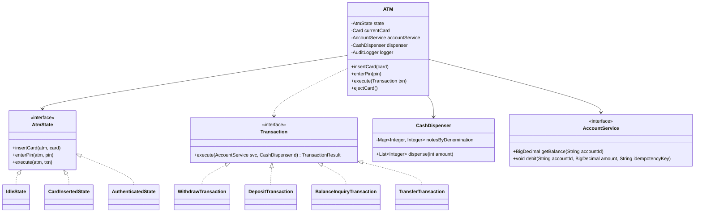
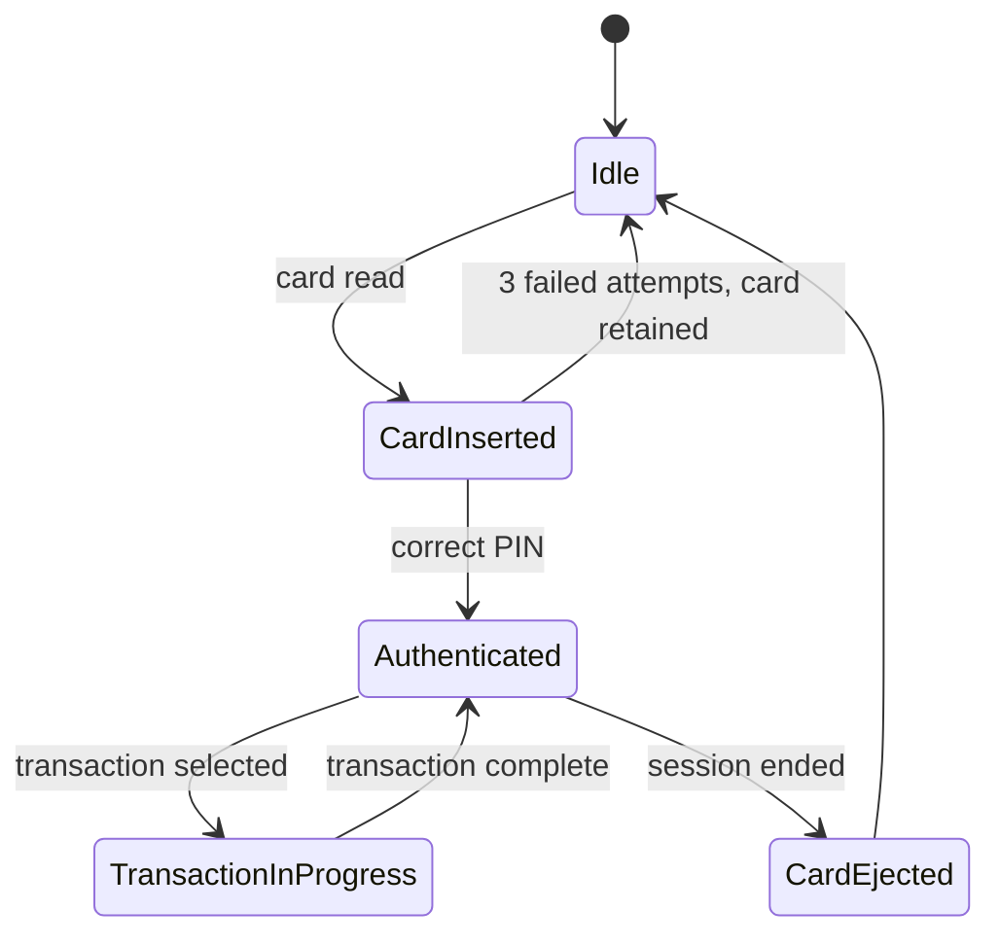

An ATM combines three patterns in one machine: a State pattern for the session lifecycle from card insert to card eject, a Command pattern for transaction types, and a hard boundary to an external account service that must never be trusted to always succeed.

## Requirements

### Functional

- Authenticate a card via PIN, locking/retaining the card after a fixed number of failed attempts.
- Support withdraw, deposit, balance inquiry and transfer as distinct transaction types.
- Dispense cash using available denominations, refusing the withdrawal if it cannot be made exactly.
- Call out to an external account/core-banking service to check balance and post debits/credits.
- Log every transaction attempt and outcome for audit and dispute resolution.
- Abstract hardware (card reader, cash dispenser, receipt printer) behind interfaces for simulation and testing.

### Non-functional and assumptions

- A single physical machine serves one card session at a time; there is no concurrent multi-card session to reason about locally.
- The core-banking call may be slow, time out, or fail independently of whether cash was dispensed — every call must be idempotent via a transaction/idempotency key.
- Physical cash inventory per denomination is finite and must be tracked precisely; running low on one denomination should not block withdrawals that another mix of notes could satisfy.
- A crash or jam mid-dispense must never leave the customer's account debited with no cash delivered, or vice versa.

### Clarifying questions to ask

- Which transaction types are in scope — withdraw, deposit, balance inquiry, transfer, all of them?
- Is card + PIN authentication part of this design, or can we assume the card arrives pre-authenticated?
- Is account balance stored locally, or fetched from an external core-banking service we must treat as untrusted?
- How should the machine behave when it's low on a specific note denomination?
- What's the required behaviour if cash dispensing fails after the account has already been debited?
- Is a printed receipt and an audit trail required?

## Core objects

| Class | Responsibility | Key fields/methods |
|---|---|---|
| `Card` | Represents the inserted card | `cardNumber`, `accountId` |
| `AtmState` | Session-lifecycle behaviour for the current step | `insertCard`, `enterPin`, `execute`, `ejectCard` |
| `IdleState` / `CardInsertedState` / `AuthenticatedState` | Concrete session states | implement `AtmState` |
| `Transaction` | One transaction type, encapsulated as a command | `execute(accountService, dispenser) -> TransactionResult` |
| `WithdrawTransaction` / `DepositTransaction` / `BalanceInquiryTransaction` / `TransferTransaction` | Concrete transactions | implement `Transaction` |
| `CashDispenser` | Physical note inventory and dispensing logic | `dispense(amount) -> List<Integer>` |
| `AccountService` | External, untrusted core-banking boundary | `getBalance`, `debit(accountId, amount, idempotencyKey)` |
| `AuditLogger` | Records every attempt and outcome | `log(event)` |

## Class design



## Key design decisions

### 1. State pattern for the session lifecycle



Each state only implements the actions valid from itself — `IdleState.enterPin` throws "insert a card first" instead of the whole `ATM` class needing a nested `if (cardInserted && !authenticated)` check before every action.

> [!KEY]
> Rejected alternative: a `SessionStatus` enum plus `if` guards scattered across every public `ATM` method. It's the same trap as the vending machine — every new step in the flow (say, "select language") means re-auditing every existing method.

### 2. Transaction types as Commands, not a switch statement

Each transaction — withdraw, deposit, balance inquiry, transfer — implements `Transaction.execute(accountService, dispenser)`. `ATM.execute(Transaction txn)` doesn't know or care which one it received.

| Approach | Problem |
|---|---|
| `ATM.processTransaction(type, amount)` with a `switch` on an enum | Adding "mini statement" or "bill payment" means editing the switch and re-testing every existing case |
| `Transaction` command objects | New transaction = new class; `ATM` and the state machine are untouched |

> [!TIP]
> The Command pattern also buys you free replay/logging: because each transaction is an object, you can log it, queue it, or retry it as a value — you can't retry "a switch case that already ran."

### 3. Cash dispensing: greedy first, bounded fallback second

Unlike a vending machine's arbitrary change, an ATM withdrawal amount is usually a multiple of the smallest note, but denomination stock can be uneven — plenty of $20s, no $50s. Greedy (largest-first) is tried first; if it gets stuck (needs a $50 it doesn't have) with cash remaining, a bounded fallback search tries alternate combinations from the remaining stock before failing outright.

| Approach | When it's used |
|---|---|
| Greedy, largest-denomination-first | Default — fast, correct almost all the time |
| Bounded backtracking over remaining denominations | Fallback only when greedy leaves a nonzero remainder and stock permits a combination |
| Reject the withdrawal | Both above fail — tell the customer to pick a different amount |

### 4. The account service is an untrusted external boundary, not an inline call

`AccountService` is the only thing `Transaction` implementations talk to for money movement, and every mutating call carries an idempotency key derived from the transaction. This is the part interviewers listen for hardest.

> [!DANGER]
> Calling the bank's debit API directly inline, without an idempotency key, means a network timeout followed by an automatic client retry can debit the customer's account twice for one withdrawal. The key must be generated once per logical transaction and the bank service must dedupe on it.

## Implementation

```java
public interface Transaction {
    TransactionResult execute(AccountService accountService, CashDispenser dispenser);
}

public class WithdrawTransaction implements Transaction {
    private final String accountId;
    private final int amount;
    private final String idempotencyKey;

    public WithdrawTransaction(String accountId, int amount, String idempotencyKey) {
        this.accountId = accountId;
        this.amount = amount;
        this.idempotencyKey = idempotencyKey;
    }

    @Override
    public TransactionResult execute(AccountService accountService, CashDispenser dispenser) {
        accountService.debit(accountId, BigDecimal.valueOf(amount), idempotencyKey); // idempotent — safe to retry
        try {
            List<Integer> notes = dispenser.dispense(amount);
            return TransactionResult.success(notes);
        } catch (CashJamException e) {
            accountService.credit(accountId, BigDecimal.valueOf(amount), idempotencyKey + ":reversal");
            return TransactionResult.failed("Dispense failed, funds reversed");
        }
    }
}
```

```java
public List<Integer> dispense(int amount) {
    List<Integer> plan = new ArrayList<>();
    int remaining = amount;
    List<Integer> denominations = notesByDenomination.keySet().stream()
        .sorted(Comparator.reverseOrder())
        .collect(Collectors.toList());
    for (int note : denominations) {
        int available = notesByDenomination.get(note);
        int take = Math.min(remaining / note, available);
        remaining -= take * note;
        for (int i = 0; i < take; i++) plan.add(note);
    }
    if (remaining > 0) {
        plan = tryFallbackCombination(amount)
            .orElseThrow(() -> new IllegalStateException("Cannot dispense exact amount with current stock"));
    }

    for (int note : plan) {
        notesByDenomination.put(note, notesByDenomination.get(note) - 1);
    }
    return plan;
}
```

## Concurrency and thread safety

Locally, one card slot means one active session — the `ATM`'s state transitions don't need heavy locking beyond serializing input events (card insert, PIN entry, button press) through a single queue. The real concurrency problem lives at the account service: the same account can be debited from an ATM, a mobile app and a card swipe at the same moment, and that is the core-banking system's job to serialize (row locks or optimistic version checks on the account balance), not the ATM's.

What the ATM *is* responsible for is never submitting the same withdrawal twice without an idempotency key, and reconciling a session that ends abnormally (power loss, network partition) by checking, on restart, whether a transaction it started was ever confirmed by the bank before deciding whether to dispense or reverse.

> [!WARNING]
> If the ATM retries a debit call after a timeout without reusing the same idempotency key, the bank has no way to tell "the first call actually succeeded and this is a duplicate" from "the first call genuinely failed" — this is the single most common root cause of a customer being charged twice.

## Extending the design

| New requirement | Where it plugs in | Why the design allows it |
|---|---|---|
| Multi-currency ATM | `CashDispenser` parameterized by currency, `Transaction` carries currency | Denomination logic already isolated in one class |
| Cardless / mobile-initiated withdrawal | New `insertCard`-equivalent entry point that skips straight to `AuthenticatedState` | Session states are already an interface, not a fixed sequence |
| Transaction limits / fraud rules | A decorator around `Transaction.execute` that checks limits before delegating | Command objects can be wrapped without changing `ATM` |
| Deposit with cheque imaging | New `DepositTransaction` variant calling an `ImagingService` | New transaction type = new class, same interface |
| Multiple accounts per card | `AuthenticatedState` offers an account-selection sub-step before `execute` | State behaviour is already isolated per session step |

## Cheat sheet

- Session lifecycle → State pattern; transaction types → Command pattern. Different axes of change, different patterns.
- Every call to the account service carries an idempotency key — no exceptions, no "just this once."
- Try greedy denomination selection first; fall back to bounded search only if greedy leaves a remainder.
- Never treat "debit account" and "dispense cash" as a single atomic step — plan for one succeeding and the other failing.
- Card retention after N failed PIN attempts is session state, not a side-effect bolted onto authentication.
- Reconciliation on restart is a first-class requirement, not an afterthought — check pending transactions before resuming.
- Hardware (reader, dispenser, printer) sits behind interfaces so the whole flow is testable without real machines.

## Common mistakes

| Mistake | Fix |
|---|---|
| Calling the bank API inline without an idempotency key | Generate one key per logical transaction, pass it through every retry |
| Treating debit + dispense as one atomic operation | Debit first (idempotent), dispense second, compensate with a reversal on dispense failure |
| A single `enum TransactionType` with a switch in `ATM` | Extract `Transaction` implementations, dispatch via `execute` |
| Session flags (`cardInserted`, `authenticated`) with nested `if`s | Extract `AtmState` implementations |
| Greedy-only cash dispensing with no fallback | Add a bounded fallback search before rejecting the withdrawal |
| No reconciliation path after a crash mid-transaction | Log transaction intent before acting, check it on restart |

## Summary

An ATM is really three well-known patterns wired together: State for the card session, Command for transaction types, and a hardened external-service boundary for anything that touches money. The single highest-value thing to get right is treating the account service as untrustworthy — idempotency keys on every mutating call, and an explicit reconciliation story for the moment cash dispensing and the account debit disagree about what happened. Everything else — new transaction types, multi-currency, cardless auth — is an additive change once those three foundations are in place.

## Top Interview Questions

### Q1. Why use both the State pattern and the Command pattern in one ATM design instead of just one?

They govern two independent axes of change. The State pattern controls *when* an action is valid — you can't enter a PIN before inserting a card, can't run a transaction before authenticating — and that sequence rarely changes. The Command pattern controls *what* an authenticated session can do — withdraw, deposit, transfer — and that set grows constantly as the bank adds products. Merging them into one class means every new transaction type risks touching session-sequencing logic, and every new session step risks touching transaction logic. Keeping them separate means a new transaction type is a new `Transaction` class with zero changes to `AtmState`, and vice versa.

### Q2. How do you guarantee a withdrawal never double-debits a customer's account?

Every mutating call to `AccountService` — specifically `debit` — carries an idempotency key unique to that logical transaction attempt, generated once when the transaction is created, not regenerated on retry. The bank service is expected to store recently-seen idempotency keys and, if it sees the same key twice, return the original result instead of applying the debit again. This means the ATM (or its caller) can safely retry a timed-out call without knowing whether the first attempt actually succeeded on the bank's side — the bank, not the ATM, is the source of truth for "did this happen already."

### Q3. Cash dispensing fails partway through — the account was already debited but the machine jams after dispensing some notes. What do you do?

First, the dispenser tracks exactly which notes it successfully dispensed before the jam, so the shortfall is known precisely, not assumed to be the full amount. Then the transaction issues a compensating credit back to the account for the amount not dispensed, using a new idempotency key derived from the original (e.g., `key + ":reversal"`) so the reversal itself is also safely retryable. Finally, the event is logged with enough detail (transaction id, amount debited, amount dispensed, shortfall) for manual reconciliation, because a jam is also a physical-hardware fault that needs a technician, not just a software fix.

### Q4. Explain the difference between greedy and optimal denomination selection, and why greedy usually works for an ATM.

Greedy always picks as many of the largest available denomination as fit into the remaining amount before moving to the next-smaller one; it's fast (`O(number of denominations)`) but is only guaranteed optimal (fewest notes) for "canonical" denomination sets like standard currency. The failure mode isn't optimality for an ATM, though — it's *feasibility*: if the machine is out of $50s, greedy might leave a remainder it can't fill with $20s and $10s even though a different combination (skip a $50 slot, use more $20s) would have worked. That's why a real design tries greedy first, then falls back to a bounded search over the remaining stock, before finally rejecting the withdrawal amount.

### Q5. How would you design the account service boundary so it doesn't leak banking complexity into the ATM?

`AccountService` should expose a small, intention-revealing interface — `getBalance`, `debit`, `credit`, each taking an idempotency key — and nothing about how the bank actually stores balances, replicates them, or handles distributed transactions across branches. This is effectively an anti-corruption layer: the ATM's `Transaction` implementations depend only on this interface, so the actual core-banking integration (SOAP, REST, a message queue, whatever the bank runs) can change entirely without touching a single line of ATM logic. It also makes the ATM trivially testable with an in-memory fake implementing the same interface.

### Q6. How do you handle three consecutive failed PIN attempts?

This belongs entirely inside `CardInsertedState`: it tracks attempt count as part of its own state (or delegates to the `Card`/session object), and on the third failure transitions to a terminal "card retained" outcome rather than back to `Idle` with the card ejected. This is a good example of why states shouldn't be stateless singletons if they need to carry per-session data like attempt count — either the state instance is created fresh per session, or the counter lives on the `ATM`/session context and the state just reads it. Either way, `IdleState` and `AuthenticatedState` never need to know this rule exists.

### Q7. How would you extend this design to support a transfer between two accounts, one of which might be at a different bank?

`TransferTransaction` implements the same `Transaction` interface, but internally it may need to call `AccountService.debit` on the source account and a separate, possibly slower, inter-bank transfer API for the destination — which turns it into a two-phase operation with its own partial-failure story: debit source succeeds, credit destination fails or times out. The safe pattern is the same one used for cash dispensing — debit first (idempotent, reversible), attempt the credit, and if the credit fails, issue a compensating credit back to the source using a derived idempotency key, logging the discrepancy for reconciliation rather than silently losing track of the money.

### Q8. Why should the ATM log every transaction attempt, not just successful ones?

Failed attempts are exactly the data needed to diagnose fraud attempts (repeated PIN failures), hardware issues (repeated dispense failures on one denomination), and disputes (a customer claims they were charged but got no cash — the audit log is the tie-breaker showing debit succeeded but dispense failed, and whether a reversal was issued). Logging only successes means the system has no record of *why* a customer's card was retained, or *why* a withdrawal was declined, which is unacceptable for a regulated financial system where every attempt needs to be explainable after the fact.

### Q9. How is this ATM's `Transaction` different from a generic "Command pattern with undo"?

A classic Command pattern often pairs `execute` with an `undo` method for client-side reversibility (e.g., text editor operations). Here, "undo" isn't a clean inverse operation the ATM can just call — reversing a withdrawal after cash has physically left the building isn't possible, and reversing a debit is a compensating transaction with its own idempotency and audit requirements, not a symmetric `undo()`. So this design uses Command purely for polymorphic dispatch and encapsulation of transaction logic, and handles failure recovery explicitly per transaction type rather than via a generic undo mechanism.

### Q10. How would you test the cash dispenser's fallback logic without a physical machine?

Seed a `CashDispenser` with a specific, deliberately awkward denomination stock (e.g., zero $50s, plenty of $20s and $10s) and assert that a withdrawal amount that would fail under pure greedy (say $150 with no $50s) succeeds via the fallback combination search, while an amount genuinely impossible with the given stock (e.g., $15 with only $20 notes available) throws the "cannot dispense" exception. Because `CashDispenser` has no dependency on the state machine, account service, or hardware, this is a pure unit test — feed denominations and an amount in, assert the returned note list sums correctly and matches the actual remaining stock afterward.

### Q11. What would you monitor in production for this ATM design?

Debit-succeeded-but-dispense-failed rate (should be near zero, and every occurrence should have a matching reversal logged), denomination stock levels per machine to trigger refill alerts before a fallback search starts failing, PIN failure rate per card (fraud signal), and idempotency key collision/dedupe rate on the account service side (a spike suggests retries are happening more than expected, which could indicate a network or timeout problem upstream). Time-to-reconciliation after a crash — how long between a machine coming back online and every in-flight transaction being resolved one way or the other — is also a key operational metric for a regulated cash-handling system.

### Q12. How would this design change if the ATM needed to work fully offline for a short period and sync later?

You'd need to relax the idempotency-key-and-immediate-debit model into a locally-queued transaction log: the ATM records "debit $200 from account X, dispense confirmed" locally with a durable, unique transaction id, dispenses against a locally-tracked balance cache (with a conservative daily withdrawal cap to bound risk), and replays the queued debits to `AccountService` once connectivity returns — still keyed by the same transaction id for idempotency. This is a substantial change to the account-service boundary (it becomes asynchronous and eventually-consistent) but doesn't touch `Transaction`'s interface or the session state machine at all, which is exactly the kind of localized blast radius the layering is designed to produce.
