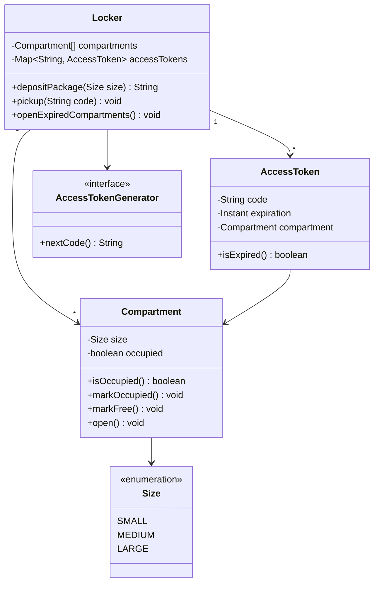

A package locker is a self-service pickup system: a carrier deposits a parcel into a free compartment, the system mints a one-time access code, and the customer later keys that code in to reclaim it. It looks trivial until you have to reason about expiry, staff overrides and two drivers racing for the last medium slot at the same instant.


## Requirements

### Functional

- A carrier deposits a package by declaring a size (small, medium, large); the system finds a free compartment of that size, opens it, and returns a single-use access code, or a clear error if none is free.
- A customer retrieves a package by presenting the access code; the system validates it, opens the matching compartment, and invalidates the code so it cannot be reused.
- Access codes expire after a fixed window (7 days). An expired code must be rejected with a specific, distinct error — not treated the same as an unknown code.
- Staff can trigger a sweep that opens every compartment whose code has expired, so they can manually remove and return stale packages to the sender.
- Every rejection path — wrong code, already-used code, expired code, no compartment of the requested size — surfaces a distinct, actionable error message.

### Non-functional and assumptions

- Delivery logistics (how the package physically arrives) and notification delivery (SMS/email of the code to the customer) are out of scope — assume external systems call into this one.
- Single locker bank, single process, in-memory state for the interview; nothing in the design should prevent adding more banks later.
- Compartments are a scarce physical resource: two carriers depositing at the same instant must never be handed the same compartment.
- Repeated-attempt lockout, payment, pricing and a UI layer are explicitly out of scope for this pass.

### Clarifying questions to ask

> [!TIP]
> Ask "can a small package use a larger compartment once small slots are full?" before writing `getAvailableCompartment`. The answer decides whether selection is a single exact-match lookup or a small ranked fallback, and asking it up front reads as senior instinct rather than an afterthought.

- Is there a size fallback — can a small item occupy a medium or large slot when its own size is exhausted?
- Do compartments ever go out of service (broken door, maintenance), and how should that affect selection?
- Does the code expire on a fixed clock from deposit, or does it reset on failed pickup attempts?
- Is deposit a single atomic call, or does the driver need a "reserve, then confirm once the door closes" flow?
- How many locker banks or stations are in scope — one, or many sharing this same engine?

## Core objects

| Class | Responsibility | Key fields/methods |
|---|---|---|
| `Locker` | Facade orchestrating deposit, pickup and the staff sweep | `compartments`, `depositPackage(size)`, `pickup(code)`, `openExpiredCompartments()` |
| `Compartment` | One physical slot; tracks its own size and occupancy | `size`, `isOccupied()`, `markOccupied()`, `markFree()`, `open()` |
| `AccessToken` | Single-use proof tying a code to a compartment, with expiry | `code`, `expiration`, `compartment`, `isExpired()` |
| `AccessTokenGenerator` | Produces the human-facing code | `nextCode() -> String` |
| `Size` | Compartment/package size enum | `SMALL`, `MEDIUM`, `LARGE` |

## Class design




## Key design decisions

### 1. Tokens live in one registry, not scattered across compartments

`Locker` keeps a single `Map<code, AccessToken>` as the only place a code is ever looked up. The rejected alternative is storing the code as a field directly on `Compartment` and linear-scanning every compartment at pickup time to find a match — that is O(n) on every pickup and gives no clean way to say "this code was already used" without extra bookkeeping.

> [!KEY]
> One lookup structure, one source of truth: pickup is `accessTokens.get(code)`, full stop. Removing the entry on successful pickup is what makes a code single-use — you don't need a separate "used" flag to go stale.

### 2. `Locker` as a Facade, not a bag of public setters

Callers never touch `Compartment.markOccupied()` or mint an `AccessToken` themselves — `Locker.depositPackage` and `Locker.pickup` are the only entry points, and they own the sequencing (find compartment → open it → mark occupied → mint token → store it). The rejected alternative pushes that sequencing into the caller or into `Compartment` itself, which spreads business rules across classes and makes the staff-only "open all expired" sweep hard to implement consistently.

### 3. Expiry is a lazy check, not a scheduled sweep

`AccessToken.isExpired()` compares "now" against a stored timestamp on read — there is no background timer proactively flipping tokens to an "EXPIRED" state. The rejected alternative, a job that walks every token every minute, does strictly more work for no benefit: `openExpiredCompartments()` already exists as an explicit staff-triggered sweep, so a second automatic mechanism would just be redundant polling.

### 4. `AccessToken` is immutable; `Compartment` is the only mutable state

Once minted, a token's code, expiry and compartment reference never change — only `Compartment.occupied` mutates. The rejected alternative (allowing a token's expiry to be extended, or its compartment reassigned) makes revocation and auditing much harder to reason about: you'd need to ask "which version of this token is live" instead of just "does it still exist in the map".

## Implementation

```java
public interface AccessTokenGenerator {
    String nextCode();
}

public class RandomCodeGenerator implements AccessTokenGenerator {
    private final Random random = new Random();

    @Override
    public String nextCode() {
        return String.format("%06d", random.nextInt(1_000_000));
    }
}

public enum Size { SMALL, MEDIUM, LARGE }
```

```java
public class Compartment {
    private final Size size;
    private boolean occupied;

    public Compartment(Size size) {
        this.size = size;
    }

    public Size getSize() {
        return size;
    }

    public boolean isOccupied() {
        return occupied;
    }

    public void markOccupied() {
        occupied = true;
    }

    public void markFree() {
        occupied = false;
    }

    public void open() { /* hardware unlock */ }
}

public class AccessToken {
    private final String code;
    private final Instant expiration;
    private final Compartment compartment;

    public AccessToken(String code, Instant expiration, Compartment compartment) {
        this.code = code;
        this.expiration = expiration;
        this.compartment = compartment;
    }

    public String getCode() {
        return code;
    }

    public Compartment getCompartment() {
        return compartment;
    }

    public boolean isExpired() {
        return !Instant.now().isBefore(expiration);
    }
}
```

```java
public class Locker {
    private final ConcurrentMap<String, AccessToken> tokens = new ConcurrentHashMap<>();
    private final List<Compartment> compartments;
    private final AccessTokenGenerator codeGen;

    public Locker(List<Compartment> compartments, AccessTokenGenerator codeGen) {
        this.compartments = compartments;
        this.codeGen = codeGen;
    }

    public String depositPackage(Size size) {
        Compartment compartment = compartments.stream()
            .filter(c -> c.getSize() == size && !c.isOccupied())
            .findFirst()
            .orElseThrow(() -> new IllegalStateException("No available compartment of size " + size));

        // Atomic claim: putIfAbsent fails if the compartment lost the race for this size.
        compartment.markOccupied();
        compartment.open();

        AccessToken token = new AccessToken(codeGen.nextCode(), Instant.now().plus(Duration.ofDays(7)), compartment);
        if (tokens.putIfAbsent(token.getCode(), token) != null)
            throw new IllegalStateException("Code collision, retry deposit");

        return token.getCode();
    }

    public void pickup(String code) {
        AccessToken token = tokens.remove(code);
        if (token == null)
            throw new IllegalStateException("Invalid access code");

        if (token.isExpired())
            throw new IllegalStateException("Access code has expired");

        token.getCompartment().open();
        token.getCompartment().markFree();
    }

    public void openExpiredCompartments() {
        tokens.values().stream()
            .filter(AccessToken::isExpired)
            .forEach(t -> t.getCompartment().open());
    }
}
```

## Concurrency and thread safety

Two failure modes matter here: two carriers depositing into the same compartment, and a staff sweep running while a customer is mid-pickup.

- **Compartment claim.** The naive read-then-write (`find a free compartment`, then `markOccupied()`) has a window where two threads can both pick the same compartment. In production, guard the claim with a per-compartment atomic flag (`AtomicInteger.compareAndSet` on a status int) or wrap the find-and-claim pair in a short lock scoped to that one compartment, then retry against the next candidate on failure — the same shape as the parking-lot spot claim.
- **Token map.** `ConcurrentHashMap<String, AccessToken>` makes `putIfAbsent`/`remove` atomic, so a pickup racing a staff sweep either sees the token or doesn't — never a half-removed state.

> [!WARNING]
> If pickup checks expiry *before* removing the token from the map, a customer can race the staff sweep: both read "not yet expired," both proceed, and the compartment gets opened twice for the same package. Remove the token first (an atomic claim on the code), then check expiry on the removed copy — exactly what `remove` followed by `isExpired()` does above.

## Extending the design

| New requirement | Where it plugs in | Why the design allows it |
|---|---|---|
| Size fallback (small item into a larger free slot) | New selection routine tried after the exact-size lookup fails | `depositPackage` already isolates "find a compartment" from "claim and mint a token" |
| Out-of-service compartments | `Compartment` status enum (`AVAILABLE`, `OCCUPIED`, `OUT_OF_SERVICE`) instead of a boolean | Selection already filters on a single occupancy check; adding a state is a one-line change to that filter |
| Two-phase deposit (reserve door, confirm once closed) | `reserveCompartment()` / `confirmDeposit(reservationId)` replacing the single atomic call | `Locker` already owns the full sequencing, so splitting one call into two is additive, not a rewrite |
| Multiple locker stations | A `LockerStation` aggregate holding many `Locker` instances, routed by location | `Locker` has no knowledge of "where" it is — it is already a self-contained unit |
| SMS/email delivery of the code | An observer notified from `depositPackage` after the token is minted | Token generation is already a single, well-defined point to hook into |

## Cheat sheet

- One dictionary keyed by access code is the only place validity is decided — never duplicate that state on `Compartment`.
- Removing a token on pickup makes it single-use for free; you don't need a separate "used" boolean.
- Expiry is a computed comparison, not a background job — cheaper and just as correct here.
- `Locker` is the only class with public mutating methods; `Compartment` and `AccessToken` are manipulated only through it.
- Compartment claims need the same atomic-claim discipline as a parking spot — read-then-write races are the classic bug here.
- Model size as an enum with an explicit ordering if you need fallback (`SMALL < MEDIUM < LARGE`), not by comparing size names as text.
- Staff-only operations (`openExpiredCompartments`) are a separate method, not a side effect of a customer-facing call.

## Common mistakes

| Mistake | Fix |
|---|---|
| Storing the code on `Compartment` and scanning for a match at pickup | Keep one `code -> AccessToken` map on `Locker` |
| Checking expiry before removing the token from the map | Remove (claim) first, then inspect the removed copy |
| A background job that proactively expires tokens | Compute expiry lazily; keep the staff sweep as the only proactive path |
| Treating "invalid code" and "expired code" as the same error | Two distinct errors — customers and support need to tell them apart |
| Reusing `Random` per call instead of one instance | Seed once, reuse the instance, or use crypto-random if codes must be unguessable |
| No plan for compartment claim races | Wrap claim-and-mark in an atomic operation, retry on failure |

## Summary

A package locker earns its interview slot by hiding two subtle races behind an apparently simple flow: claiming a scarce physical compartment, and invalidating a one-time code exactly once. Keep the access-token map as the single source of truth, make `Locker` the only class that mutates anything, and treat expiry as a cheap lazy check rather than a background job. Once that skeleton is solid, size fallback, out-of-service compartments and a two-phase deposit flow are all additive extensions rather than redesigns.

## Top Interview Questions

### Q1. Why keep access tokens in one dictionary instead of storing the code directly on each compartment?

A single `code -> AccessToken` map makes both lookups constant time and gives you one obvious place to enforce single-use: removing the entry on pickup means the code is gone, period. Storing the code on `Compartment` instead forces a linear scan over every compartment to find a match at pickup, and needs an extra "used" flag to distinguish a fresh compartment from one whose code was already redeemed — two pieces of state that can drift apart. One registry, one truth, is the same lesson as deriving a parking spot's occupancy from the active-ticket map rather than a separate boolean.

### Q2. How do you prevent two carriers from being assigned the same compartment at the same time?

Read-then-write races are the risk: both threads see the same "free" compartment before either claims it. Guard the claim atomically — an `AtomicInteger.compareAndSet` on a per-compartment status flag, or a short lock scoped to just that compartment — and retry against the next candidate if the claim fails. The important property is that the atomic unit is the single compartment being contended, not the whole locker bank, so unrelated deposits never block each other.

### Q3. Why is expiry computed lazily instead of updated by a background job?

Because nothing consumes an "EXPIRED" state proactively — the only thing that acts on expired tokens is the staff sweep, `openExpiredCompartments()`, which is already explicitly triggered. A background job that walks every token every minute to flip a status field would do real work (CPU, lock contention) purely to maintain a flag nobody reads until the sweep runs anyway. Comparing `Instant.now()` against a stored expiry at the moment it's asked is correct, cheap, and needs no extra infrastructure.

### Q4. Walk through what happens on a pickup with an expired code.

`pickup` first attempts to remove the code from the token map — if it's not present at all, that's "invalid code," a distinct error from expiry. If the removal succeeds, it checks `isExpired()` on the token it just pulled out; if true, it throws "access code has expired" and, importantly, the compartment stays occupied (the token was removed, but nothing reopened the door). The physical package still needs the staff sweep to be recovered — a customer with an expired code cannot self-serve their way back in, which is the intended business rule.

### Q5. How would you support a small package using a medium or large compartment when small slots are full?

Extend compartment selection into a small ranked fallback: try the exact size first, and if none is free, retry against the next size up, in order. This is naturally a Strategy-shaped extension — the "find a compartment" step is already isolated from "claim it and mint a token" inside `depositPackage`, so swapping in a fallback-aware selector changes nothing about token minting, expiry, or pickup. The one design question worth asking the interviewer: does a fallback assignment still count against that larger size's capacity for someone who actually needs it later?

### Q6. How would you model a compartment that's broken or under maintenance?

Replace the boolean `occupied` flag with a small status enum — `AVAILABLE`, `OCCUPIED`, `OUT_OF_SERVICE` — and update the one place that filters candidate compartments to check for `AVAILABLE` specifically instead of `!occupied`. Nothing else in `Locker`, `AccessToken`, or the pickup flow needs to change, because none of them inspect compartment state directly; they only ever go through the same selection method. This is a good example of a requirement that looks like it touches "everything" but actually touches one filter condition, because state was never duplicated.

### Q7. Why remove the token from the map on pickup instead of marking it "used" and leaving it there?

Because leaving used tokens around means the map grows forever and every future lookup — including the staff sweep — has to filter out entries that no longer matter. Removing on pickup keeps the map's size proportional to actually-active tokens, and makes "does this code exist" and "is this code still valid" the same question, rather than two separate checks (existence, then a used-flag). It also sidesteps any risk of a stale reference to a compartment being reused by a later deposit.

### Q8. How would you turn the single `depositPackage` call into a two-phase reserve-then-confirm flow, and why would you need to?

Split it into `reserveCompartment(size)` — which opens the door and marks the compartment `RESERVED` (not yet `OCCUPIED`) — and `confirmDeposit(reservationId)`, called once the driver has actually closed the door and the system can verify a weight or a door-closed sensor fired. This matters if you want the token to only be minted after the package is genuinely inside, not just after the compartment door was opened; otherwise a driver who opens a compartment and walks away for a different reason leaves a phantom "occupied" slot with no package in it.

### Q9. What would you change to run this design across multiple locker stations at different physical locations?

Introduce a `LockerStation` that owns a `Locker` instance (or a `Locker` per bank) and routes a deposit or pickup request to the right one by location — `Locker` itself needs no change, since it was already self-contained and had no notion of "where" it physically sits. The interesting design question becomes whether access codes need to be globally unique across stations (if a customer might describe just the code without saying which station) or only unique within a station — that decides whether code generation coordinates across instances or stays purely local.

### Q10. How would you notify the customer of their access code without coupling that into the deposit flow?

Treat notification as an observer of the "token minted" event: `Locker.depositPackage` publishes a lightweight event (code, expiry, maybe a customer contact reference passed in by the caller) after the token is stored, and a `Notifier` implementation (SMS, email, push) subscribes independently. This keeps delivery mechanics — which is explicitly out of scope for the core design — from ever touching `Locker`'s internals, and lets you add a second notification channel later without redeploying the locker logic itself.
