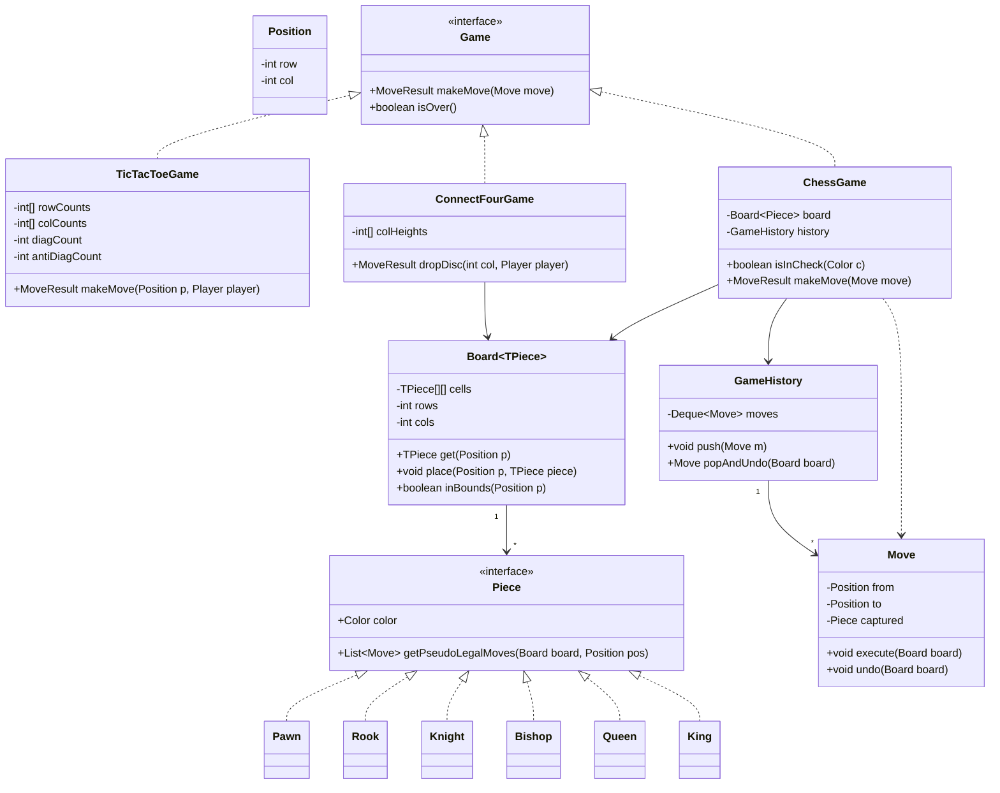

Board games are the classic "start simple, then generalize" interview arc: design Tic-Tac-Toe cleanly enough — a generic board, pluggable win/move rules — and the follow-ups "now make it Chess" and "now make it Connect Four" become extension exercises instead of rewrites.

## Requirements

### Functional

- A generic board of configurable dimensions that every game shares.
- **Tic-Tac-Toe:** two players alternate placing X/O on a 3×3 grid; detect a win (row, column or diagonal) or a draw after every move, in O(1) per move rather than rescanning the board.
- **Chess:** 8×8 board, full piece hierarchy (Pawn, Rook, Knight, Bishop, Queen, King) each with its own movement rule; alternating turns; detect check, checkmate and stalemate; support undoing the last move.
- **Connect Four:** 7-column, 6-row grid; players drop discs that fall to the lowest empty row in the chosen column (gravity) instead of placing on any empty cell; detect four in a row (horizontal, vertical or diagonal) or a full-board draw.
- Reject illegal moves in every game: occupied cell (or full column, for Connect Four), wrong turn, out-of-bounds, moving after the game is over, or (for Chess) a move that leaves the mover's own king in check.

### Non-functional and assumptions

- Single local two-player game per instance; no networking or matchmaking in this scope.
- Chess legality is computed as "pseudo-legal moves per piece rule, filtered to those that don't leave your own king in check" — full FIDE rules (castling, en passant, threefold repetition) are treated as extensions, not core scope, unless the interviewer says otherwise.
- Undo must be efficient — it should not require a full board copy on every single move for a game with a long history.

### Clarifying questions to ask

- Is board size fixed (3×3 / 8×8 / 7×6) or should the design generalize to arbitrary rows and columns?
- For chess, is the full V1 rule set in scope (castling, en passant, promotion), or a simplified subset first?
- Do we need an AI opponent, or is this always two human players making moves through the same interface?
- Is move history / replay / PGN-style export required?
- Do we need to support multiple concurrent games in one process (a server hosting many matches), or just one game at a time?
- Is a game clock (timed moves) in scope?

## Core objects

| Class | Responsibility | Key fields/methods |
|---|---|---|
| `Board<TPiece>` | Generic grid storage, bounds checking | `cells`, `get(pos)`, `place(pos, piece)` |
| `Position` | A row/column coordinate, value-equal | `row`, `col` |
| `Game` | Turn loop and win/draw detection contract | `makeMove(move) -> MoveResult`, `isOver()` |
| `TicTacToeGame` | Concrete game; O(1) win check via line counters | `lineCounters`, `makeMove(pos, player)` |
| `ConnectFourGame` | Concrete game; gravity drop, bounded local win check | `dropDisc(col, player)`, `checkWinFrom(pos)` |
| `Piece` / piece hierarchy | Chess piece identity and movement rule | `color`, `getPseudoLegalMoves(board, pos)` |
| `MovementStrategy` | Movement pattern shared or overridden per piece | `getMoves(board, position)` |
| `ChessGame` | Concrete game; legality filter, check detection | `isInCheck(color)`, `makeMove(move)` |
| `Move` (Command) | An executed move, storing what it captured | `execute(board)`, `undo(board)` |
| `GameHistory` | Stack of executed moves for undo | `push(move)`, `popAndUndo()` |

## Class design



## Key design decisions

### 1. One generic `Board<TPiece>`, not two board implementations

`Board<TPiece>` handles dimensions, bounds checking and cell storage for both games — Tic-Tac-Toe instantiates it as `Board<Mark>`, Chess as `Board<Piece>`. Both games' win/legality logic sits above this shared layer, not duplicated inside it.

> [!KEY]
> Rejected alternative: a `TicTacToeBoard` and a `ChessBoard` as unrelated classes. It looks fine until you need Connect Four (another grid with its own win rule) and realize you're copy-pasting bounds-checking code a third time instead of reusing one generic class.

### 2. Win detection: O(1) incremental counters, not a full-board rescan

| Approach | Cost per move | Notes |
|---|---|---|
| Rescan the whole board for 3-in-a-row after every move | O(n²) | Simple, but wasteful — most cells didn't just change |
| Maintain a counter per row, column, and both diagonals; `+1` for X, `-1` for O; a counter hitting `±N` means a win | O(1) | Only the four counters touched by the new move need updating |

For an N×N board, a move at `(r, c)` updates `rowCounts[r]`, `colCounts[c]`, and, only if `r == c` or `r + c == N - 1`, the corresponding diagonal counter. A counter reaching `+N` or `-N` is an immediate win — no scanning required.

### 3. Chess piece movement as a Strategy per piece type

Each piece implements `Piece.getPseudoLegalMoves(board, position)` according to its own rule — a `Bishop` walks diagonals until blocked, a `Knight` jumps in an L-shape ignoring blocking pieces along the way. `ChessGame` calls this same method regardless of which piece occupies the square.

> [!TIP]
> Saying "pseudo-legal, then filtered for check" out loud is the phrase that separates a candidate who has actually implemented chess move validation from one who hasn't: movement rules and check-legality are two separate passes, not one combined rule per piece.

| Approach | Problem |
|---|---|
| One `Board.isValidMove(from, to)` method with a switch on piece type | Every new piece type (or variant like Chess960) means editing one growing method |
| `Piece.getPseudoLegalMoves` per piece, `ChessGame` filters for check afterward | New piece type = new class; check-filtering logic never duplicated per piece |

### 4. Undo via invertible Move commands, not full-board Memento snapshots

Each `Move` records what it captured (if anything) and any special-move metadata, and knows how to `undo(board)` itself — this is a Command pattern with built-in inverse, pushed onto a `GameHistory` stack.

| Approach | Trade-off |
|---|---|
| Memento: snapshot the entire board before every move | Simple to reason about, but O(board size) memory per move — expensive over a long game, and awkward to extend for partial state like "can still castle" |
| Command: each `Move` stores just what it changed and reverses itself | O(1) space per move; naturally extends to store promotion/castling-rights deltas |

> [!WARNING]
> A common bug: `Move.undo` restores the moved piece but forgets to restore a captured piece to the destination square, silently "deleting" it from the game on undo. The captured piece must be part of the `Move` object, not looked up again after the fact — it may no longer be findable once the move executed.

### 5. Connect Four: gravity changes the move, not the win-check philosophy

Connect Four reuses `Board<TPiece>` unchanged (`Board<Disc>`, 7 columns × 6 rows) and keeps the same "no full-board rescan" philosophy as Tic-Tac-Toe — but the O(1) *mechanism* has to change, because Tic-Tac-Toe's trick only works when the win length equals the board dimension.

| Game | Win length vs. board size | O(1) technique |
|---|---|---|
| Tic-Tac-Toe | Win length (3) == board dimension (3) | Global running counter per row/column/diagonal; a counter reaching ±N is an immediate win |
| Connect Four | Win length (4) < board dimensions (7×6) | A row/column counter would need to reach ±7 or ±6 to fire — it never will, since a win only needs 4. Instead, walk outward from the just-placed disc in each of the 4 directions (horizontal, vertical, both diagonals), counting matching discs until a mismatch or the edge; the move wins if any direction's total (new disc included) reaches 4 |

Both approaches are O(1) per move — the walk is bounded by the fixed win length (at most 3 cells outward in each direction), never by board size — but Connect Four's check is a *local* scan anchored at the last move rather than a *global* running sum.

> [!KEY]
> Rejected alternative: reusing Tic-Tac-Toe's row/column/diagonal sum counters as-is for Connect Four. They only detect "this entire line is one color," which never fires once a line is longer than the win condition. The generic *shape* of the optimization survives (O(1), no rescan) but the specific counters do not transfer between the two games.

The other new mechanic is gravity: a move isn't "place at any empty cell" but "drop into a column, land on the lowest empty row." Tracking `colHeights[col]` incrementally makes this O(1) too — the landing row is `rows - 1 - colHeights[col]`, and a full column (`colHeights[col] == rows`) rejects the move with no per-move scan of the column.

Author's original board and win-check sketches for this problem:


## Implementation

```java
public class TicTacToeGame implements Game {
    private final int[] rowCounts, colCounts;
    private int diag, antiDiag;
    private final int n;

    public MoveResult makeMove(Position p, int playerSign) { // +1 = X, -1 = O
        rowCounts[p.getRow()] += playerSign;
        colCounts[p.getCol()] += playerSign;
        if (p.getRow() == p.getCol()) diag += playerSign;
        if (p.getRow() + p.getCol() == n - 1) antiDiag += playerSign;

        boolean won = Math.abs(rowCounts[p.getRow()]) == n || Math.abs(colCounts[p.getCol()]) == n
                || Math.abs(diag) == n || Math.abs(antiDiag) == n;
        return won ? MoveResult.WIN : MoveResult.CONTINUE;
    }
}
```

```java
public class ConnectFourGame implements Game {
    private static final int ROWS = 6, COLS = 7, WIN_LENGTH = 4;
    private final Disc[][] grid = new Disc[ROWS][COLS];
    private final int[] colHeights = new int[COLS];
    private static final int[][] DIRECTIONS = { {0, 1}, {1, 0}, {1, 1}, {1, -1} };

    public MoveResult dropDisc(int col, Disc color) {
        if (colHeights[col] >= ROWS) return MoveResult.INVALID; // column full

        int row = ROWS - 1 - colHeights[col]; // gravity: lowest empty row
        grid[row][col] = color;
        colHeights[col]++;

        return checkWinFrom(row, col, color) ? MoveResult.WIN : MoveResult.CONTINUE;
    }

    private boolean checkWinFrom(int row, int col, Disc color) {
        for (int[] dir : DIRECTIONS) {
            int count = 1 + countDirection(row, col, dir[0], dir[1], color)
                          + countDirection(row, col, -dir[0], -dir[1], color);
            if (count >= WIN_LENGTH) return true;
        }
        return false;
    }

    private int countDirection(int row, int col, int dr, int dc, Disc color) {
        int count = 0;
        int r = row + dr;
        int c = col + dc;
        while (r >= 0 && r < ROWS && c >= 0 && c < COLS && grid[r][c] == color) {
            count++;
            r += dr;
            c += dc;
        }
        return count;
    }
}
```

```java
public class Bishop implements Piece {
    private final Color color;
    private static final int[][] DIRECTIONS = { {1, 1}, {1, -1}, {-1, 1}, {-1, -1} };

    public Bishop(Color color) {
        this.color = color;
    }

    @Override
    public Color getColor() {
        return color;
    }

    @Override
    public List<Move> getPseudoLegalMoves(Board<Piece> board, Position from) {
        List<Move> moves = new ArrayList<>();
        for (int[] dir : DIRECTIONS) {
            Position pos = new Position(from.getRow() + dir[0], from.getCol() + dir[1]);
            while (board.inBounds(pos) && (board.get(pos) == null || board.get(pos).getColor() != color)) {
                moves.add(new Move(from, pos, board.get(pos)));
                if (board.get(pos) != null) break; // captured a piece, stop this direction
                pos = new Position(pos.getRow() + dir[0], pos.getCol() + dir[1]);
            }
        }
        return moves;
    }
}
```

```java
public boolean isInCheck(Color color, Board<Piece> board) {
    Position kingPos = board.findKing(color);
    return board.allPieces(color.opposite()).stream()
        .anyMatch(p -> p.getPiece().getPseudoLegalMoves(board, p.getPosition()).stream()
            .anyMatch(m -> m.getTo().equals(kingPos)));
}
```

## Concurrency and thread safety

A single local game is inherently sequential — one player moves, then the other — so `Game` implementations need no internal locking for that case. The concurrency question shows up the moment you host many games in one process (an online server): each `ChessGame`/`TicTacToeGame` instance should own its own lock (or be pinned to a single-threaded actor/queue) so that a move submission and, say, a resignation/timeout event for the *same* game never interleave into a corrupted board.

Across games, no shared mutable state exists if each game owns its own `Board` and `GameHistory` — the only shared thing is typically a game registry (`Map<GameId, Game>`), which needs its own concurrent collection, independent of any single game's internal lock.

> [!NOTE]
> A subtle race: a player submits move #12 while a timeout handler is simultaneously declaring the game lost on time. Attach a monotonically increasing move/turn sequence number to submissions, and reject any move whose sequence number doesn't match the game's current expected turn — this makes "which happened first" unambiguous instead of relying on lock timing alone.

## Extending the design

| New requirement | Where it plugs in | Why the design allows it |
|---|---|---|
| Pop-out / gravity-reversal Connect Four variant | New drop/removal method on `ConnectFourGame`, same `checkWinFrom` scan | Win detection is already anchored at whichever cell just changed, not a global rescan |
| Chess960 / castling / en passant | Extra fields on `Move` (rights deltas) and special-case entries in `King`/`Pawn`'s `getPseudoLegalMoves` | Movement is already isolated per piece type |
| AI opponent | A `MoveSelector` (minimax/alpha-beta) consuming `getPseudoLegalMoves` + `isInCheck`, or exhaustive search over `dropDisc` for Connect Four | Move generation and legality are already exposed as reusable methods |
| Game clocks / timed moves | A `Clock` wrapping `Game.makeMove`, no change inside the game logic | Turn boundaries are already a single well-defined method call |
| Move history / PGN export | `GameHistory` already stores every `Move` in order | Undo stack doubles as a replay log with no extra bookkeeping |

## Cheat sheet

- One generic `Board<TPiece>` shared by every game; win/legality rules live above it, not inside it.
- Tic-Tac-Toe win check: four counters (rows, cols, 2 diagonals), updated in O(1) per move — never rescan.
- Connect Four win check: bounded local walk in 4 directions from the just-dropped disc, not a global counter — the counter trick only works when win length equals board dimension.
- Chess legality is two passes: pseudo-legal (piece's own rule) then filtered for "does this leave my king in check."
- Movement per piece type is a Strategy — one class per piece, no switch statement in the board.
- Undo is a Command with a built-in inverse (`execute`/`undo`), not a full board snapshot per move.
- A captured piece must be stored on the `Move` itself so undo can restore it exactly.
- Design the board and move representation first — Tic-Tac-Toe, Chess and Connect Four differ only in the win/legality/placement rules layered on top of it.

## Common mistakes

| Mistake | Fix |
|---|---|
| Rescanning the whole board for a win after every move | Maintain row/col/diagonal counters, check in O(1) |
| Separate, duplicated board classes per game | One generic `Board<TPiece>` shared by all games |
| Reusing Tic-Tac-Toe's global row/column counters for Connect Four unchanged | Switch to a bounded local walk from the last move — win length is smaller than the board dimension |
| A switch statement on piece type inside the board's move validation | `Piece.getPseudoLegalMoves` per piece class |
| Treating "pseudo-legal" and "doesn't leave king in check" as one rule | Two explicit passes — generate, then filter |
| Full board snapshot (Memento) for every move's undo | Command-style `Move` with `execute`/`undo` and O(1) stored state |
| Losing a captured piece on undo | Store the captured piece reference on the `Move`, restore it in `undo` |

## Summary

The interview payoff of this problem is the generalization step: a generic `Board<TPiece>` plus a `Game` interface lets Tic-Tac-Toe's O(1) line-counter win check, Connect Four's gravity-drop with a bounded local win scan, and Chess's per-piece movement Strategy all coexist as implementations of the same shape rather than three unrelated systems. Chess adds one genuinely new idea — legality as pseudo-legal-moves-filtered-by-check — and an efficient Command-based undo instead of a heavyweight board snapshot; Connect Four's only new idea is that gravity constrains where a move can land, and that win detection has to be a bounded local scan rather than a global counter once win length is smaller than the board. Once those pieces are in place, Chess960 and an AI opponent are extensions layered on top, not redesigns.

## Top Interview Questions

### Q1. How do you check for a win in Tic-Tac-Toe in O(1) instead of scanning the board?

Maintain four running counters: one per row, one per column, and two for the diagonals. Represent each player's mark as `+1` or `-1`; when a move is placed at `(r, c)`, add the player's value to `rowCounts[r]` and `colCounts[c]`, and additionally to the main diagonal counter if `r == c`, or the anti-diagonal counter if `r + c == n - 1`. After updating, check whether any of the (at most four) touched counters has reached magnitude `n` — if so, that player just won. This turns win detection into constant-time bookkeeping per move instead of an O(n²) rescan, and generalizes cleanly to any N×N board.

### Q2. What is the difference between a "pseudo-legal" move and a "legal" move in chess, and why separate them?

A pseudo-legal move follows the movement pattern of the piece alone — a bishop moves diagonally, a knight jumps in an L — without checking whether making that move would leave the mover's own king under attack. A legal move is a pseudo-legal move that additionally passes that check. Separating them keeps each `Piece` implementation simple (it only ever needs to know its own movement geometry) and puts the more expensive, board-wide "would my king be in check afterward" computation in exactly one place (`ChessGame`), run once per candidate move rather than duplicated inside every piece class.

### Q3. How would you detect checkmate versus stalemate?

Both start from the same computation: does the player to move have *any* legal move at all? If `isInCheck(currentPlayer)` is true and no legal move exists, it's checkmate. If `isInCheck(currentPlayer)` is false and no legal move exists, it's stalemate (a draw). Computing "any legal move exists" means generating every piece's pseudo-legal moves for the side to move, filtering each by whether it leaves that side's own king in check, and short-circuiting as soon as one legal move survives the filter — you don't need to enumerate all of them, just confirm at least one exists.

### Q4. Why model piece movement as a Strategy (one class per piece type) instead of one method with a switch on piece type?

Chess has six distinct movement rules, several with genuine complexity (a pawn's forward move, diagonal capture, double-step from its starting rank, and en passant are all different cases). A single `getMoves(pieceType, position)` method with a switch grows into an unreadable block mixing six unrelated algorithms, and adding a chess variant with a new piece (like Chess960's or fairy-chess pieces) means editing that shared method. One class per piece type, each implementing the same interface, means each piece's logic is independently testable and a new piece type is purely additive.

### Q5. How do you implement undo efficiently for a long chess game?

Model each executed move as a Command object storing exactly what it needs to reverse itself — the origin and destination squares, any captured piece (so it can be restored, not just left off the board), and any special-move metadata like "this move waived castling rights" or "this was an en passant capture." Push each `Move` onto a stack (`GameHistory`) as it executes; undo pops the stack and calls `Move.undo(board)`. This is O(1) extra state per move, versus a full board copy (Memento) which costs O(board size) per move and gets awkward once you need to track auxiliary state like castling rights alongside the raw piece positions.

### Q6. What's a design mistake candidates commonly make when implementing chess `Undo`?

Forgetting that a captured piece must be restored, not just re-derived. If `undo` only moves the piece back from `to` to `from` but doesn't also place the captured piece back on `to`, that piece silently vanishes from the game. The fix is that the `Move` object itself must carry a reference to whatever piece (if any) it captured, captured *before* the move executes, so `undo` has everything it needs without trying to reconstruct history it no longer has access to.

### Q7. Why can't Tic-Tac-Toe's global row/column/diagonal counter trick be reused unchanged for Connect Four?

The counter trick relies on a specific coincidence in Tic-Tac-Toe: the win length (3) equals the board dimension (3), so a counter summing an entire row or diagonal naturally reaches its winning magnitude exactly when that line is fully claimed by one player. Connect Four breaks that coincidence — the win length (4) is smaller than the board's rows (6) and columns (7), so a full-row or full-column counter would need to reach ±7 or ±6, which never happens for a 4-in-a-row win. The fix is to replace the global running sum with a bounded local scan anchored at the just-placed disc: walk outward up to 3 cells in each of 4 directions (and their opposites), counting consecutive same-color discs, and declare a win if any direction's total reaches 4. Both techniques are O(1) per move, but one sums whole lines globally and the other inspects a small neighborhood around the last move — recognizing which one a given win condition requires is the actual test here, not memorizing either implementation.

### Q8. How would you add an AI opponent to this design?

Introduce a `MoveSelector` (or similar) that, given the current `Board` and player-to-move, evaluates candidate moves using `getPseudoLegalMoves` (filtered to legal moves via the same `isInCheck` check) and picks one via minimax with alpha-beta pruning (or, for Tic-Tac-Toe, an exhaustive search since the state space is tiny). Neither the board representation nor the move-generation/legality code needs to change at all — the AI is purely a consumer of the same public surface a human player's UI would call, which is a strong signal that the move-generation layer was designed at the right level of abstraction.

### Q9. How would you support a game clock (timed moves) without touching the core game logic?

Wrap `Game.makeMove` with a decorator or a thin orchestrating layer that starts a per-player timer when it becomes their turn, stops it when they submit a move, and declares a loss-on-time if the timer expires before a move arrives — none of which requires the `TicTacToeGame`/`ChessGame` classes to know timers exist. This works because "make a move" is already a single, well-defined entry point; the clock is purely an external policy layered on top of that entry point, following the same "wrap, don't modify" principle used for adding transaction limits to the ATM's Command objects.

### Q10. Two players submit conflicting move requests for the same game at nearly the same time (e.g., a stale client resubmits an old move after a timeout). How do you handle it?

Attach a monotonically increasing turn/sequence number to the game state, and require every submitted move to include the sequence number it believes is current; reject (as a stale/conflicting request) any submission whose sequence number doesn't match. Combine this with per-game serialization (a lock, or pinning the game to a single-threaded actor/queue) so that "check sequence number, apply move, increment sequence number" happens as one atomic unit — this prevents a delayed retransmission of an old move from being silently replayed against a board state it was never intended for.

### Q11. How would you unit test move generation and check detection independent of a full game?

Construct a `Board<Piece>` directly with a small, hand-placed set of pieces (no `ChessGame` needed), and assert `piece.getPseudoLegalMoves(board, position)` returns exactly the expected set of destination squares for a range of scenarios — blocked paths, edge-of-board positions, available captures. Separately, test `isInCheck` by constructing boards where a king is and isn't attacked by a specific piece, asserting the boolean result directly. Because movement rules and check detection are decoupled from turn management and undo history, both can be tested with minimal, targeted board setups rather than playing out a full game.

### Q12. What's the biggest structural risk in this design if requirements later demand full FIDE rules (castling, en passant, threefold repetition, fifty-move rule)?

The pieces most at risk are `Move`'s stored metadata and `GameHistory`: castling rights and en passant eligibility are *history-dependent* state (a rook that has moved can never castle again, even if it later returns to its original square), so `Move` needs to record rights-deltas, not just board positions, and `isInCheck`/legality filtering needs to account for "the king can't castle through a square that's under attack." Threefold repetition and the fifty-move rule require comparing board states or move counts across the whole history, which is straightforward once `GameHistory` already stores every move in order, but it's a good idea to flag these as known extensions up front rather than let them surface as surprises mid-implementation.
