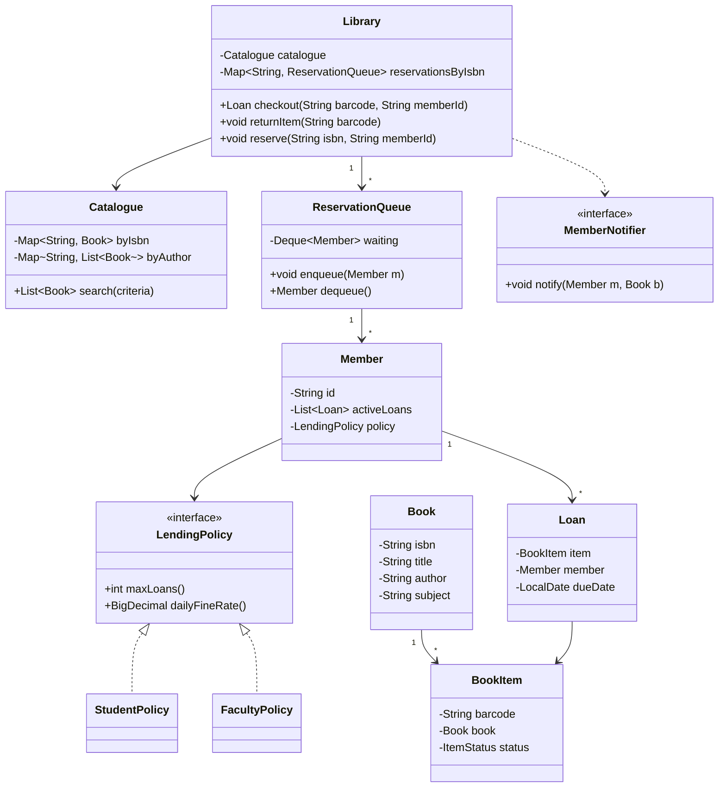

A library system's whole interview value hinges on one distinction candidates routinely miss: a `Book` is a catalogue entry — title, author, ISBN — while a `BookItem` is one physical, barcoded copy of it. Conflate the two and checkout, reservations and per-copy state all break.

## Requirements

### Functional

- Search the catalogue by title, author, ISBN or subject.
- Track member accounts, each with a lending limit and a list of active loans.
- Check out and return a specific physical copy, tracking due dates and accruing fines on late return.
- Queue reservations when every copy of a title is checked out, and notify the next member in line when a copy becomes available.
- Support looking up a copy by barcode/ISBN, and admin operations to add new titles or retire damaged copies.

### Non-functional and assumptions

- Single branch for the core design; the catalogue-vs-copy split should make multi-branch an additive change, not a rewrite.
- Two members must never be able to check out the same physical copy at once.
- Fines accrue daily past the due date, typically capped at some maximum — flat-rate schemes should also be supportable without redesigning the loan model.
- Notification (email/SMS/push) is abstracted behind an interface; the actual delivery channel is out of scope.

### Clarifying questions to ask

- Is this a single branch, or multiple branches sharing one catalogue with independent inventories?
- Do lending limits and fine rates vary by member type (student vs faculty vs guest)?
- Should reservations be strict FIFO, or can priority holds exist (e.g., faculty jump the queue)?
- Is full-text search in scope, or exact/prefix matching on title, author and ISBN sufficient?
- Are e-books / digital lending part of this design, or physical copies only?
- Is payment for fines part of scope, or do we just track the balance owed?

## Core objects

| Class | Responsibility | Key fields/methods |
|---|---|---|
| `Book` | Catalogue entry — the *idea* of a title | `isbn`, `title`, `author`, `subject` |
| `BookItem` | One physical, barcoded copy of a `Book` | `barcode`, `status`, `book` reference |
| `Member` | Borrower account with a lending policy | `activeLoans`, `policy`, `fineBalance` |
| `LendingPolicy` | Per member-type rules | `maxLoans`, `dailyFineRate` |
| `Loan` | One active checkout record | `item`, `member`, `dueDate` |
| `Catalogue` | Multi-field search index | `search(criteria) -> List<Book>` |
| `ReservationQueue` | Per-title FIFO wait list | `enqueue(member)`, `dequeue()` |
| `MemberNotifier` | Observer notified when a hold is ready | `notify(member, book)` |
| `Library` | Facade orchestrating checkout/return/reserve | `checkout`, `returnItem`, `reserve` |

## Class design



## Key design decisions

### 1. `Book` (catalogue entry) vs `BookItem` (physical copy) — the headline decision

The single biggest failure mode in a first draft is one `Book` class with a `copiesAvailable: int` field. That collapses per-copy state — which specific copy is checked out, to whom, which one is damaged and pulled from circulation — into a count that can't answer any of those questions.

| Approach | What breaks |
|---|---|
| One `Book` with a `copyCount` integer | Can't track *which* copy is where, can't flag a specific copy as lost/damaged, checkout has nothing concrete to reference |
| `Book` (catalogue metadata) + `BookItem` (one copy, one barcode, one status) | ✅ Checkout operates on a specific `BookItem`; the catalogue entry is untouched by circulation state |

> [!KEY]
> Say this distinction out loud early: "a `Book` is the metadata, a `BookItem` is a physical thing with a barcode and a status." It's the one sentence that heads off nearly every follow-up bug in this design.

### 2. Reservation fulfillment via Observer, not member-side polling

When a `BookItem` is returned and a `ReservationQueue` for that title is non-empty, `Library.returnItem` dequeues the next waiting member and calls `MemberNotifier.notify(member, book)` — the member is pushed a notification rather than having to poll "is it back yet?"

| Approach | Trade-off |
|---|---|
| Members poll the catalogue for availability | Wasted reads, and no fairness guarantee about who gets it first |
| `ReservationQueue` + `MemberNotifier` triggered on return | ✅ Push-based, and the FIFO queue itself enforces fairness |

### 3. Multi-field search as parallel indexes, not a linear scan

`Catalogue` maintains separate maps — by ISBN (exact, O(1)), by author and by title (prefix or exact match) — rather than scanning every `Book` for each query. A later requirement for full-text search slots in as one more index behind the same `search(criteria)` method.

> [!TIP]
> A senior answer names the trade-off explicitly: "exact-match indexes are O(1) lookups but need a rebuild or careful update on every catalogue change; a linear scan needs no index maintenance but is O(n) per search." For a catalogue of any real size, the indexed version wins easily.

### 4. Lending rules as a Strategy per member type

`LendingPolicy` (max loans, daily fine rate) is injected per `Member` rather than branched on inside `Library.checkout`. A `StudentPolicy` might allow 5 books and a lower fine rate; a `FacultyPolicy` might allow 20 and waive fines entirely.

> [!WARNING]
> Rejected alternative: `if (member.getType() == MemberType.FACULTY) maxLoans = 20; else maxLoans = 5;` inside `checkout`. It works for two member types and breaks the moment a third (guest, alumni) is added — every branch point in the checkout logic needs a new case.

## Implementation

```java
public class Catalogue {
    private final Map<String, Book> byIsbn = new HashMap<>();
    private final Map<String, List<Book>> byAuthor = new HashMap<>();

    public List<Book> searchByAuthor(String author) {
        return byAuthor.getOrDefault(author, new ArrayList<>());
    }

    public Optional<Book> findByIsbn(String isbn) {
        return Optional.ofNullable(byIsbn.get(isbn));
    }
}
```

```java
public class Library {
    private final ConcurrentMap<String, BookItem> itemsByBarcode = new ConcurrentHashMap<>();
    private final ConcurrentMap<String, ReservationQueue> reservations = new ConcurrentHashMap<>();
    private final MemberNotifier notifier;

    public Loan checkout(String barcode, Member member) {
        BookItem item = itemsByBarcode.get(barcode);
        if (!item.tryClaim()) // atomic: false if already checked out
            throw new IllegalStateException("Item not available");

        if (member.getActiveLoans().size() >= member.getPolicy().maxLoans()) {
            item.release();
            throw new IllegalStateException("Lending limit reached");
        }

        Loan loan = new Loan(item, member, LocalDate.now().plusDays(14));
        member.getActiveLoans().add(loan);
        return loan;
    }

    public void returnItem(BookItem item) {
        item.release();
        ReservationQueue queue = reservations.get(item.getBook().getIsbn());
        if (queue != null) {
            queue.tryDequeue().ifPresent(nextMember -> notifier.notify(nextMember, item.getBook()));
        }
    }
}
```

## Concurrency and thread safety

Checkout is the same "atomic claim" problem as the parking lot: two members must never both succeed in checking out the same `BookItem`. `BookItem.tryClaim()` should be a single atomic compare-and-swap on its status (e.g., `AtomicInteger.compareAndSet` on an int-backed enum, or a per-item lock), not a separate "check status" followed by "set status" pair of calls.

The reservation queue introduces a second race: a book is returned and the queue is checked for waiting members at nearly the same instant a new reservation request arrives. `returnItem` and `reserve` for the same ISBN should be serialized (a lock per `ReservationQueue`, or a thread-safe queue implementation) so a returning copy is never simultaneously handed to the dequeued member *and* claimed by a fresh reservation that snuck in between the check and the notify.

> [!DANGER]
> If `checkout` checks item status and sets it to "borrowed" as two separate steps instead of one atomic operation, two members racing for the last copy can both read "available" before either writes "borrowed" — both walk out thinking they have the book.

## Extending the design

| New requirement | Where it plugs in | Why the design allows it |
|---|---|---|
| E-books / digital lending | New `DigitalBookItem` with no physical claim, DRM check instead of `tryClaim` | `Book` (catalogue) is already separate from the copy representation |
| Multi-branch library | `BookItem` gains a `branchId`; `Catalogue` becomes shared, inventory per branch | Catalogue and copy were already split — copies just need a location field |
| Priority holds (faculty skip the queue) | `ReservationQueue` becomes a priority queue keyed by member type | Queue is already an abstraction, not inline logic in `Library` |
| Self-checkout kiosk | New UI calling the same `Library.checkout(barcode, memberId)` | Checkout logic is already a single, hardware-agnostic entry point |
| Fine payment integration | A `PaymentService` consumed when clearing a `Member`'s `fineBalance` | Fine accrual is already isolated in `LendingPolicy` |

## Cheat sheet

- `Book` = catalogue metadata. `BookItem` = one physical, barcoded, stateful copy. Never merge them.
- Checkout claims a specific `BookItem` atomically — never a two-step "check then set."
- Reservations are push (Observer notifies on return), not poll.
- Search uses parallel indexes (by ISBN, author, title) for O(1)/O(log n) lookups, not a linear scan.
- Lending limits and fine rates are a Strategy per member type, not `if/else` on a type enum.
- Fine calculation and lending limits live in `LendingPolicy`, decoupled from checkout orchestration.
- Multi-branch, e-books and priority holds are all additive once `Book`/`BookItem` are properly split.

## Common mistakes

| Mistake | Fix |
|---|---|
| One `Book` class with a `copiesAvailable` count | Split into `Book` (catalogue) and `BookItem` (physical copy) |
| Checkout as "read status, then set status" in two calls | Make `BookItem.tryClaim()` a single atomic operation |
| Members polling for availability | `ReservationQueue` + `MemberNotifier`, pushed on return |
| `if/else` on member type for lending limits | Inject `LendingPolicy` per member |
| Linear scan across all books for every search | Maintain indexed maps by ISBN/author/title |
| Treating fine calculation as part of `checkout` | Isolate it in `LendingPolicy`, invoked from `returnItem` |

## Summary

The library system rewards precision on one modeling decision — catalogue entry versus physical copy — more than any clever algorithm. Get `Book` and `BookItem` right, make checkout an atomic per-item claim, push reservation notifications through an Observer instead of polling, and index the catalogue by the fields you actually search on. Do that, and multi-branch inventory, e-books and priority holds are all extensions layered on an already-correct foundation rather than structural rewrites.

## Top Interview Questions

### Q1. Why separate `Book` and `BookItem` instead of one class with a copy count?

A `Book` represents catalogue metadata shared by every copy — title, author, ISBN, subject — that never changes based on which physical copy you're holding. A `BookItem` represents one specific, barcoded object that has its own lifecycle: checked out, available, lost, or being repaired. If you collapse them into a single class with a `copiesAvailable: int`, you lose the ability to answer "which specific copy did member X borrow," "which copy is damaged," or "where is copy #4 located in a multi-branch system" — all of which are core library operations, not edge cases. The split is a direct application of separating identity/metadata from individual, stateful instances.

### Q2. How do you prevent two members from checking out the same physical copy at the same time?

Make the claim operation on `BookItem` a single atomic step — `tryClaim()` internally does a compare-and-swap on the item's status from "available" to "borrowed," returning false if it wasn't available. This must not be split into a "check status" call followed by a separate "set status" call, because two threads can both pass the check before either performs the set, resulting in the same copy being lent to two people. The same principle applies here as in the parking lot's spot allocation and the ATM's cash dispensing: any shared, exclusively-owned resource needs one atomic claim operation, not a check-then-act pair.

### Q3. Walk through what happens when a book is returned and members are waiting for it.

`Library.returnItem` first releases the `BookItem` (flips its status back to available, or directly to "reserved-for-next-member" if a queue exists), then checks the `ReservationQueue` for that book's ISBN. If a member is waiting, it dequeues the first one (FIFO) and calls `MemberNotifier.notify(member, book)`, which pushes a notification through whatever channel is configured (email, SMS, app push) rather than requiring the member to poll the catalogue. Critically, this dequeue-and-notify step must be atomic with respect to `returnItem` and `reserve` both touching the same queue, or a race could let a brand-new reservation "jump" a member who was already waiting.

### Q4. Why model lending limits and fine rates as a `LendingPolicy` Strategy instead of a `switch` on member type?

Because the number of member types and the rules attached to them grow independently over time — students, faculty, alumni, guests, each potentially with different limits, fine rates, and grace periods. A `switch (member.getType())` inside `checkout` means every new member type requires editing that method and re-verifying every existing case still behaves correctly. Injecting a `LendingPolicy` per member means `checkout` only ever calls `member.getPolicy().maxLoans()` — it doesn't know or care how many member types exist, and adding one is a new class, not a new branch in shared logic.

### Q5. How would you design the catalogue search to support lookup by title, author, and ISBN efficiently?

Maintain separate index structures inside `Catalogue`: a `Map<String, Book>` keyed by ISBN for O(1) exact lookup (ISBNs are unique), and `Map<String, List<Book>>` keyed by normalized author name and by title (or title prefix, for typeahead-style search) for O(1) average lookup by those fields. Every catalogue mutation (adding a new title) must update all relevant indexes together — this is a good moment to mention that you'd wrap index updates in a single method on `Catalogue` rather than let callers update the maps directly, to avoid one index drifting out of sync with another.

### Q6. What happens if a member tries to check out a book but has already hit their lending limit?

`checkout` should check `member.getActiveLoans().size() >= member.getPolicy().maxLoans()` *after* it has atomically claimed the `BookItem`, and if the limit is exceeded, it must release the claimed item back to available before throwing — otherwise the item is stuck in a "claimed but not actually loaned to anyone" limbo, effectively removed from circulation for no reason. This is a good illustration of why the claim-then-validate order matters: you want to avoid two members racing for the last copy while you're still checking the *other* member's lending limit, so claim first (to serialize access to that specific copy), then validate business rules, releasing on failure.

### Q7. How would you extend this design to support e-books alongside physical copies?

Introduce a `DigitalBookItem` (or a more abstract `Lendable` that both `BookItem` and `DigitalBookItem` implement) where "claiming" isn't about a single physical object but a licensed concurrent-access count (many libraries license "3 simultaneous e-book checkouts" per title) enforced via the same atomic-claim pattern applied to a counter instead of a single boolean status. The catalogue side barely changes — `Book` already represents the title-level metadata independent of format — which is exactly the payoff of having split `Book` from the copy representation in the first place.

### Q8. How is the reservation queue different from a simple "notify me" flag on the book?

A flag only tells you *that* someone wants to know, not *who's first* — with multiple members waiting for a popular title, you need an ordered structure (a FIFO queue, or a priority queue if some members should jump ahead) to guarantee fairness about who gets the next available copy. The queue also needs to support removal (a member cancels their hold) and must be safely accessed concurrently with `returnItem` dequeuing from the front, which a single boolean flag has no way to model correctly once more than one person can be waiting.

### Q9. How would you calculate and cap fines for an overdue book?

`LendingPolicy` exposes a `dailyFineRate`, and on `returnItem` (or on a periodic sweep for books not yet returned), the system computes `max(0, daysOverdue) * dailyFineRate`, typically clamped to a policy-defined maximum so a book kept for a year doesn't generate an absurd fine. Keeping this calculation inside the policy object (rather than inline in `returnItem`) means a `FacultyPolicy` can waive fines entirely by returning zero, and a promotional "fine amnesty" period can be modeled as a temporary policy override, without touching the checkout/return orchestration code at all.

### Q10. How would you support a multi-branch library where each branch has its own physical inventory but shares one catalogue?

`Book` stays exactly as it is — a single, shared catalogue entry across all branches. `BookItem` gains a `branchId` (or a `location` field), and `Catalogue.search` can optionally filter or annotate results with per-branch availability. `Library.checkout` needs to know which branch's copy it's claiming, but the atomic-claim logic on `BookItem` doesn't change at all. This is the direct payoff of the `Book`/`BookItem` split: a requirement that sounds like a big structural change (multi-branch) turns out to only need one new field on the copy-level class.

### Q11. How would you unit test the checkout and reservation flow without a real notification service?

Inject a fake `MemberNotifier` that just records calls (member, book) into an in-memory list instead of sending real emails/SMS, and a real (in-memory) `ReservationQueue` and `BookItem` implementations. Then drive scenarios directly: check out the only copy of a book, have a second member reserve it, return the copy, and assert the fake notifier recorded exactly one call to the second member for that book. Because notification is behind an interface and claiming is a pure atomic operation on an in-memory object, none of this requires a database, a real queue, or a real message channel — it's a fully deterministic unit test.

### Q12. What would you monitor in production for a library system like this?

Reservation queue length per title (a consistently long queue signals demand for more copies), average time-to-fulfillment from reservation to notification, fine accrual totals and collection rate, and — importantly — a consistency check that the count of `BookItem`s marked "borrowed" always equals the count of currently active `Loan` records, since any drift between those two would indicate the atomic-claim invariant has been violated somewhere (a bug that would otherwise surface as "the book is marked available but someone has it").
