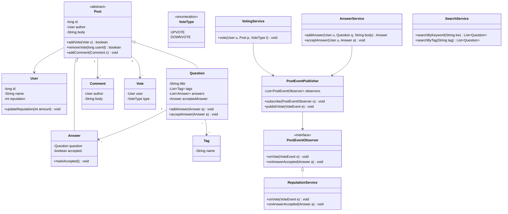

A question-and-answer site needs a content model for questions, answers and comments, a fair voting and reputation system, and search over all of it — the real design work is keeping voting, reputation and search each isolated so tightening one rule never risks breaking another.

## Requirements

### Functional

- Users post questions (with tags), post answers to questions, and comment on both questions and answers.
- Users vote (upvote/downvote) on questions and answers; a user cannot vote on their own post, and each user gets exactly one active vote per post.
- The question's author can mark exactly one answer as accepted.
- Users search by keyword (title/body), by tag, or by author.
- Reputation is a derived score, updated automatically from vote outcomes and accepted answers — never set directly by a caller.

### Non-functional and assumptions

- Single process, in-memory storage for the interview; the design should not preclude swapping any one piece (search, storage) later.
- Many users vote and post concurrently — the system must never double-count a vote or lose a comment under concurrent writes.
- Reputation changes are a side effect of voting/acceptance, not a separate API surface a client calls directly.
- Moderation, edit history, spam detection and notification delivery are out of scope for this pass.

### Clarifying questions to ask

> [!TIP]
> Ask "can a user change or retract a vote?" early — it decides whether votes are an append-only log or a keyed, replaceable map, which changes both the data structure and the reputation math (a retraction has to reverse the exact delta it applied).

- Can a vote be changed (up to down) or withdrawn, and does that reverse the reputation delta?
- Is there a reputation floor (can a heavily downvoted user go negative), or does it clamp at zero?
- Can more than one answer ever be marked accepted, or does accepting a new one un-accept the old one?
- Is search ranked by relevance/popularity, or is "return all matches" acceptable for this pass?
- Does reputation vary by post type (answer upvote worth more than a question upvote), and by how much?

## Core objects

| Class | Responsibility | Key fields/methods |
|---|---|---|
| `Post` (abstract) | Shared voting/commenting behaviour for questions and answers | `votes`, `comments`, `addVote(vote)`, `addComment(comment)` |
| `Question` | A post with a title, tags and its answers | `title`, `tags`, `answers`, `acceptedAnswer`, `acceptAnswer(answer)` |
| `Answer` | A post that responds to a question | `question`, `accepted`, `markAccepted()` |
| `Comment` | A short remark on a post | `author`, `body`, `createdAt` |
| `Tag` | A topic label on a question | `name` |
| `VotingService` | Enforces vote rules, publishes vote events | `vote(user, post, type)` |
| `AnswerService` | Adds answers, enforces accept rules | `addAnswer(...)`, `acceptAnswer(user, answer)` |
| `SearchService` | Indexed lookup by keyword/tag/author | `searchByKeyword`, `searchByTag`, `searchByUser` |
| `PostEventPublisher` | Fan-out for vote/accept events | `subscribe(observer)`, `publishVote(event)` |
| `ReputationService` | Observer that turns events into score changes | `onVote(event)`, `onAnswerAccepted(answer)` |

## Class design



## Key design decisions

### 1. Reputation reacts to events instead of being called directly

`VotingService` and `AnswerService` never call `ReputationService` — they publish a `VoteEvent`/accept event through `PostEventPublisher`, and `ReputationService` subscribes as a `PostEventObserver`. Pattern: **Observer**.

> [!KEY]
> Rejected alternative: `VotingService.vote()` calling `user.updateReputation()` inline. It works until a second consumer shows up — notifications, analytics, an activity feed — and each one means another edit to `VotingService`. The observer list grows without touching the class that raises the event.

### 2. `Post` is an abstract base, not two unrelated classes

`Question` and `Answer` both need voting and commenting; putting that behaviour once on an abstract `Post` means it's implemented and tested once. The rejected alternative — separate `Question` and `Answer` classes each re-implementing `addVote`/`addComment` — invites drift the moment one gets a bug fix the other doesn't.

### 3. Votes are keyed by voter, not appended to a list

`Post` stores votes in a `ConcurrentHashMap<userId, Vote>`, not a `List<Vote>`. This makes "one vote per user" a property of the data structure (`putIfAbsent` returns the existing entry for a second vote) rather than a check-then-append race waiting to happen under concurrent requests.

| Approach | One-vote-per-user guarantee | Concurrency safety |
|---|---|---|
| `List<Vote>` + "already voted?" scan before appending | Only if the scan-then-append is atomic | ❌ Race window between check and append |
| `ConcurrentHashMap<userId, Vote>` | Structural — a second `putIfAbsent` for the same key returns the existing value | ✅ Single atomic operation |

### 4. Reputation math lives in `ReputationService`, not on `User`

`User.updateReputation(amount)` only applies a delta; deciding *what* delta a given vote or acceptance is worth lives entirely in `ReputationService`. The rejected alternative — `User.upvoteQuestion()`/`User.upvoteAnswer()` methods baked into the entity — means every time the business retunes scoring (say, answer upvotes go from +10 to +8), you're editing the core identity class instead of one policy class.

## Implementation

```java
public interface PostEventObserver {
    void onVote(VoteEvent voteEvent);
    void onAnswerAccepted(Answer answer);
}

public abstract class Post {
    private final User author;
    private final ConcurrentMap<Long, Vote> votes = new ConcurrentHashMap<>();
    protected final Object syncLock = new Object();

    protected Post(User author) {
        this.author = author;
    }

    public User getAuthor() {
        return author;
    }

    public boolean addVote(Vote vote) {
        return votes.putIfAbsent(vote.getUser().getId(), vote) == null;
    }

    public boolean removeVote(long userId) {
        return votes.remove(userId) != null;
    }
}
```

```java
public class VotingService {
    private final PostEventPublisher publisher;

    public VotingService(PostEventPublisher publisher) {
        this.publisher = publisher;
    }

    public void vote(User user, Post post, VoteType type) {
        if (post.getAuthor().getId() == user.getId())
            throw new IllegalStateException("Cannot vote on your own post.");

        if (!post.addVote(new Vote(user, type)))
            throw new IllegalStateException("User has already voted.");

        publisher.publishVote(new VoteEvent(post, user, type));
    }
}

public class ReputationService implements PostEventObserver {
    @Override
    public void onVote(VoteEvent e) {
        int change;
        if (e.getPost() instanceof Question) {
            change = e.getVoteType() == VoteType.UPVOTE ? 5 : -2;
        } else if (e.getPost() instanceof Answer) {
            change = e.getVoteType() == VoteType.UPVOTE ? 10 : -2;
        } else {
            change = 0;
        }
        e.getPost().getAuthor().updateReputation(change);
    }

    @Override
    public void onAnswerAccepted(Answer answer) {
        answer.getAuthor().updateReputation(15);
    }
}
```

```java
public class User {
    private final long id;
    private final AtomicInteger reputation = new AtomicInteger();

    public User(long id) {
        this.id = id;
    }

    public long getId() {
        return id;
    }

    public int getReputation() {
        return reputation.get();
    }

    public void updateReputation(int amount) {
        reputation.addAndGet(amount);
    }
}
```

## Concurrency and thread safety

Three different primitives are doing three different jobs here, deliberately:

- **Votes**: `ConcurrentHashMap<userId, Vote>` gives lock-free, atomic "insert if absent" semantics — exactly the one-vote-per-user rule the requirements demand, with no explicit lock.
- **Reputation**: an `AtomicInteger` mutated only through `addAndGet`, read through `get` — safe without a lock because it's a single scalar with one operation (add a delta).
- **Ordered collections** (a question's list of answers, a post's list of comments): a `synchronized` block around mutation and around the read-and-copy, because list order and "don't lose an insert" can't be expressed as a single atomic primitive the way a map or a counter can.

> [!WARNING]
> Accepting an answer and voting on it can race: a vote event and an accept event might both fire close together and both try to update the same user's reputation. Because reputation updates are `AtomicInteger.addAndGet` deltas rather than read-modify-write assignments, both apply correctly regardless of order — this is exactly why deltas, not absolute values, are the safe shape for concurrently-applied state.

## Extending the design

| New requirement | Where it plugs in | Why the design allows it |
|---|---|---|
| Vote retraction / change | `removeVote` already exists on `Post`; add a matching reputation-reversal event | Votes are keyed by user, so "did they already vote" and "what did they vote" are both O(1) |
| Reputation floor (never below zero) | Clamp inside `ReputationService.onVote` before calling `updateReputation` | Scoring policy is isolated in one class, not scattered across vote/accept call sites |
| Real search engine (Elasticsearch) | New implementation behind the same `SearchService` interface | Callers depend on the interface, not the in-memory index internals |
| Notify a user when their answer is accepted | Another `PostEventObserver` subscribing to `publishAnswerAccepted` | Observer list grows without touching `AnswerService` |
| Only allow voting above a reputation threshold | A guard clause added inside `VotingService.vote` | Voting is already funneled through one method, not scattered call sites |

## Cheat sheet

- `Post` as an abstract base for `Question`/`Answer` avoids duplicating vote/comment logic.
- Vote storage keyed by user id turns "one vote per user" into a structural guarantee, not a runtime check.
- Reputation is always a delta applied via `AtomicInteger.addAndGet`/observer, never a value set directly by a caller.
- Vote and accept events flow through one publisher — new consumers subscribe, they never touch the publishers.
- Search is a separate service behind an interface from day one, so the in-memory index is swappable later.
- Only one accepted answer per question — enforce it inside `Question.acceptAnswer`, not in the caller.
- Self-voting is rejected inside `VotingService`, not left to the UI to prevent.

## Common mistakes

| Mistake | Fix |
|---|---|
| `VotingService` calling `ReputationService` directly | Publish an event; let `ReputationService` subscribe as an observer |
| `List<Vote>` with a manual "already voted" scan | `ConcurrentHashMap<userId, Vote>` — atomic by construction |
| Reputation stored/set as an absolute value | Always apply as an `AtomicInteger.addAndGet` delta |
| Duplicating vote/comment logic in `Question` and `Answer` separately | Shared abstract `Post` base class |
| No guard against self-voting | Explicit check inside `VotingService.vote`, not left to callers |
| Search coupled directly to the in-memory `Map` | `SearchService` as its own class behind a stable method signature |

## Summary

A Q&A platform is a content-modeling exercise wrapped around one real concurrency problem: many users voting and posting at once must never corrupt a vote count or a reputation score. Sharing voting and commenting behaviour through an abstract `Post`, keying votes by user id, and routing every score change through an observer rather than a direct call keeps the three concerns — content, scoring, search — genuinely independent. Once that separation holds, retractable votes, a reputation floor, and a real search backend are all additive changes.

## Top Interview Questions

### Q1. Why should `Question` and `Answer` share an abstract `Post` base class rather than being independent classes?

Both need identical voting and commenting behaviour — one vote per user, a list of comments, the same `addVote`/`addComment` contract. Implementing that twice risks the two copies drifting apart the first time either gets a bug fix or a new rule (say, a cooldown before voting again). An abstract base class means the behaviour is written and tested once, and `Question` and `Answer` each add only what's genuinely different about them — tags and answers for one, an "is accepted" flag for the other.

### Q2. How do you guarantee a user can cast at most one vote per post under concurrent requests?

Store votes in a `ConcurrentHashMap<userId, Vote>` on the post rather than a list. `putIfAbsent` is an atomic "insert only if the key is absent" operation, so if two requests for the same user's vote race, exactly one inserts and the other's `putIfAbsent` returns the already-present vote (making `addVote` return false), which the service surfaces as "already voted." A `List<Vote>` with a manual "does a vote already exist for this user?" scan followed by an append has a race window between the check and the append that a keyed structure closes by construction.

### Q3. Why publish a vote event instead of having `VotingService` update reputation directly?

Because reputation is one of potentially several consumers of "a vote happened" — notifications, an activity feed, and analytics are equally plausible listeners, and none of them should require editing `VotingService`. Routing the event through a publisher that `PostEventObserver` implementations subscribe to means `VotingService`'s only job is enforcing vote rules and announcing the outcome; it has zero knowledge of what happens next. This is the Observer pattern earning its keep: the set of subscribers can grow without the publisher's code changing at all.

### Q4. Why is reputation stored and updated as a delta (`AtomicInteger.addAndGet`) rather than a value set directly?

Multiple events can affect the same user's reputation concurrently — a vote on one post and an accepted answer on another can land at nearly the same instant. If reputation were set as an absolute value ("set my score to X"), the two updates could race and the loser's effect would be silently lost. Applying each change as `reputation.addAndGet(delta)` makes updates commutative and order-independent: regardless of which one runs first, both deltas apply correctly, because addition doesn't need to know the prior value to be correct.

### Q5. How would you enforce that a question can have only one accepted answer at a time?

Put the check inside `Question.acceptAnswer`, guarded by the same lock that protects the question's answer list: verify the candidate answer actually belongs to this question, verify no answer is already accepted (or, if re-accepting is allowed, un-accept the previous one first), then set `acceptedAnswer` and call `markAccepted()` on the answer. Keeping this rule inside the aggregate root (`Question`) rather than in `AnswerService` or a caller means there is exactly one code path that can ever set an accepted answer, so the invariant can't be bypassed by a different caller forgetting the check.

### Q6. How would you support retracting or changing a vote?

`Post` already exposes `removeVote(userId)`, which is the retraction primitive. Changing a vote from up to down is a remove-then-add of the opposite type; the harder part is reputation — retracting or changing a vote needs to publish a compensating event (the exact negative of the original delta) rather than just "undo whatever the current reputation happens to be," because other events may have landed in between. This is why keeping reputation changes as discrete, independently-applied deltas (rather than derived from current vote state) pays off: reversing one is just applying its inverse.

### Q7. Where would you plug in a full-text search engine like Elasticsearch instead of the in-memory index?

Behind `SearchService`'s existing interface — `searchByKeyword`, `searchByTag`, `searchByUser` — with zero changes to any caller. The in-memory implementation builds an inverted index from a `Map`; an Elasticsearch-backed implementation would index documents on write and query the cluster on read, but as long as it implements the same method signatures, `AnswerService`, `VotingService` and the top-level facade never know the difference. This is the same "hide the volatile part behind an interface" principle used for pricing and matching strategies in other LLD problems.

### Q8. How would you prevent a user from voting on their own post, and where does that check belong?

Inside `VotingService.vote`, before any mutation happens: compare `post.getAuthor().getId() == user.getId()` and reject immediately if true. It has to live in the service layer, not in `Post.addVote` itself, because `Post` doesn't necessarily know who is "currently acting" versus who authored it — the caller identity is a request-scoped concept that belongs to the layer orchestrating the action, not the entity being acted upon. Centralizing it in one method also means there's exactly one place to test and one place that can never be bypassed by a different entry point.

### Q9. What happens if two vote requests for the same user on the same post arrive at nearly the same time?

Both call `post.addVote(new Vote(user, type))`, which internally does `votes.putIfAbsent(vote.getUser().getId(), vote)` on a `ConcurrentHashMap`. Exactly one `putIfAbsent` inserts — the map guarantees only one entry can exist per key — and the loser's call returns the existing vote (so `addVote` returns false), which `VotingService` turns into an "already voted" exception for that caller. No lock is needed because the map's own atomicity is sufficient for this single-operation check-and-insert; this is a cheaper and more scalable answer than wrapping the whole method in a coarse lock.

### Q10. How would you scale reputation calculation if the scoring rules become significantly more complex (streaks, decay over time, category-specific weighting)?

Because scoring already lives entirely inside `ReputationService.onVote`/`onAnswerAccepted` and nowhere else, you can replace the simple `if`/`instanceof` chain with a full `ReputationPolicy` strategy without touching `VotingService`, `AnswerService`, or the entities themselves — they only know "an event was published," not how it's scored. This is the payoff of routing scoring through an observer in the first place: the policy is a leaf dependency that can be swapped, versioned, or A/B tested independently of the rest of the system.
