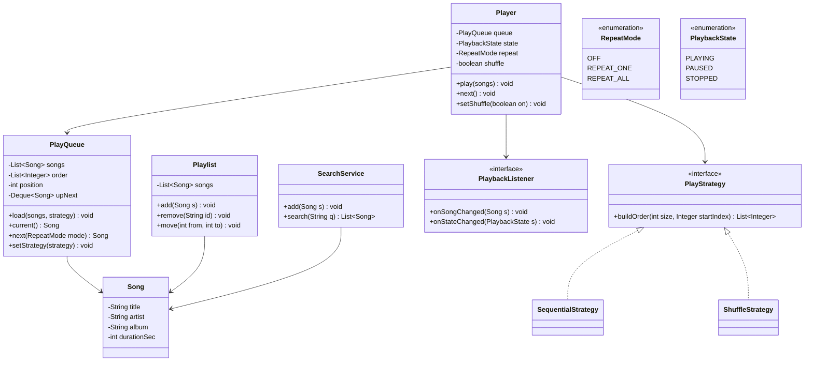

A music streaming design is really two smaller problems wearing one trenchcoat: a catalog/playlist content model, and a playback engine whose queue must support shuffle, repeat and "play next" without turning into a wall of conditionals. The state-management version — no actual audio bytes — is what interviewers ask, and the queue/player split is the whole game.

## Requirements

### Functional

- A catalog of songs (title, artist, album, duration); search by title, artist or album, case-insensitive substring match.
- Users create playlists: add, remove, and reorder songs.
- Player operations: play (a playlist, album, or single song), pause, resume, next, previous, seek, stop.
- Shuffle on/off — a new random order each pass, without interrupting the currently playing song.
- Repeat modes: `OFF` (stop at the end), `REPEAT_ONE`, `REPEAT_ALL`.
- "Play next" inserts a song ahead of the normal queue, consumed before the queue resumes.
- Playback state changes (song changed, state changed) notify subscribers — UI, scrobbler, history — without the player knowing who they are.
- Track recently played songs per user.

### Non-functional and assumptions

- This is a state-management design — audio decoding, streaming, and buffering are explicitly out of scope.
- One active playback session per user for this pass; multi-device sync is discussed as an extension.
- Recommendations, radio, offline downloads and DRM are out of scope.
- The catalog can be large; search must not scan every song per keystroke.

### Clarifying questions to ask

> [!TIP]
> Ask "does shuffle reshuffle every loop, or shuffle once and repeat that order?" before writing `PlayQueue`. The answer decides whether `REPEAT_ALL` re-invokes the shuffle strategy at the wrap-around point or just resets a position counter — a small but easy-to-miss branch that a wrong assumption silently breaks.

- Is playback of real audio in scope, or purely state management (queue position, play/pause)?
- Can a user queue a song ahead of the current playlist ("play next"), and does it survive a shuffle toggle?
- Does shuffle reshuffle on every loop through `REPEAT_ALL`, or keep the same shuffled order?
- Do we need free-tier restrictions (forced shuffle, ads) in scope, or just discussed as an extension?
- Is one active session per user assumed, or must multiple devices stay in sync?

## Core objects

| Class | Responsibility | Key fields/methods |
|---|---|---|
| `Song` / `Playlist` | Catalog value objects; an ordered, mutable list of songs | `title`, `artist`, `album`; `add`, `remove`, `move` |
| `PlayQueue` | Owns *ordering*: the source list, the shuffled/sequential index order, and the "play next" overrides | `load`, `current()`, `next(repeat)`, `previous()`, `addNext(song)` |
| `Player` | Owns *state*: playing/paused/stopped, position, repeat/shuffle flags | `play`, `pause`, `resume`, `next`, `previous`, `seek` |
| `PlayStrategy` | Builds a play order from a song count and an optional "keep this song first" index | `buildOrder(size, startIndex) -> List<Integer>` |
| `PlaybackListener` | Observer notified of song/state changes | `onSongChanged(song)`, `onStateChanged(state)` |
| `SearchService` | Inverted-index lookup over the catalog | `add(song)`, `search(query)` |

## Class design



## Key design decisions

### 1. The queue owns ordering; the player owns state

`PlayQueue` never knows whether it is "playing" — it only answers "what's current, what's next." `Player` never sorts or shuffles anything — it only tracks `PlaybackState`, position, and delegates every "what song is this" question to the queue.

> [!KEY]
> Rejected alternative: one `Player` class holding the song list, the shuffle flag, and play/pause state together. Toggling shuffle then means reaching into playback state to avoid disrupting the current song — exactly the kind of tangled conditional this split avoids.

### 2. Shuffle vs sequential as a Strategy, not a branch

`PlayStrategy.buildOrder(size, startIndex)` is the only thing that changes between shuffle and sequential playback; `PlayQueue` calls it the same way regardless of which is active. Pattern: **Strategy**. Rejected alternative: `if (shuffle) { ...fisher-yates inline... } else { ...identity order... }` scattered through `next()`/`previous()` — every future ordering mode (smart shuffle, least-recently-played-first) would mean editing the queue's core logic again.

### 3. Shuffle reorders an index array, never the song list

`PlayQueue.order` is a list of indices into the original `songs` list, not a physically reshuffled copy. Toggling shuffle off simply switches back to the identity strategy; the playlist itself is never mutated by playback, so two different sessions playing the same playlist never see each other's shuffle state bleed through.

| Approach | Toggling shuffle off | Playlist mutation risk |
|---|---|---|
| Physically shuffle the song list in place | Original order is lost, must be reconstructed | ❌ Playback logic mutates shared data |
| Shuffle an index array over an untouched song list | Instant — switch strategies, rebuild order | ✅ Playlist is read-only from the queue's perspective |

### 4. State changes are Observer events, not direct calls into consumers

`Player` calls `notifySong`/`notifyState`, which fan out to every subscribed `PlaybackListener` — history, scrobbling, analytics. Pattern: **Observer**. Rejected alternative: `Player` holding direct references to a `HistoryService` and a `ScrobblerService` and calling them by name — every new consumer (royalty tracking, live "now playing" widgets) would require editing the playback engine itself.

## Implementation

```java
public interface PlayStrategy {
    List<Integer> buildOrder(int size, Integer startIndex);
}

public class ShuffleStrategy implements PlayStrategy {
    private final Random random;

    public ShuffleStrategy(Random random) {
        this.random = random;
    }

    @Override
    public List<Integer> buildOrder(int size, Integer startIndex) {
        List<Integer> indices = new ArrayList<>();
        for (int i = 0; i < size; i++) indices.add(i);
        for (int i = size - 1; i > 0; i--) {               // Fisher-Yates
            int j = random.nextInt(i + 1);
            Collections.swap(indices, i, j);
        }
        if (startIndex != null) {
            int pos = indices.indexOf(startIndex);
            Collections.swap(indices, 0, pos);             // keep current song first
        }
        return indices;
    }
}
```

```java
public class PlayQueue {
    private List<Song> songs = new ArrayList<>();
    private List<Integer> order = new ArrayList<>();
    private final Deque<Song> upNext = new ArrayDeque<>();
    private PlayStrategy strategy = new SequentialStrategy();
    private int position;

    public void load(List<Song> songs, PlayStrategy strategy) {
        this.songs = new ArrayList<>(songs);
        this.strategy = strategy;
        this.order = strategy.buildOrder(this.songs.size(), null);
        this.position = 0;
    }

    public Song current() {
        return order.isEmpty() ? null : songs.get(order.get(position));
    }

    public Song next(RepeatMode repeat) {
        if (!upNext.isEmpty()) {
            return upNext.pollFirst();
        }
        if (repeat == RepeatMode.REPEAT_ONE) return current();
        if (position + 1 < order.size()) {
            position++;
            return current();
        }
        if (repeat == RepeatMode.REPEAT_ALL) {
            order = strategy.buildOrder(songs.size(), null);
            position = 0;
            return current();
        }
        return null;
    }

    public void setStrategy(PlayStrategy strategy) {
        Integer playing = order.isEmpty() ? null : order.get(position);
        this.order = strategy.buildOrder(songs.size(), playing);
        this.position = playing != null ? order.indexOf(playing) : 0;
        this.strategy = strategy;
    }
}
```

```java
public class Player {
    private final PlayQueue queue = new PlayQueue();
    private final List<PlaybackListener> listeners = new ArrayList<>();
    private PlaybackState state = PlaybackState.STOPPED;
    private RepeatMode repeat = RepeatMode.OFF;

    public PlaybackState getState() {
        return state;
    }

    public void setRepeat(RepeatMode repeat) {
        this.repeat = repeat;
    }

    public void play(List<Song> songs, PlayStrategy strategy) {
        queue.load(songs, strategy);
        state = PlaybackState.PLAYING;
        listeners.forEach(l -> l.onSongChanged(queue.current()));
    }

    public void next() {
        Song song = queue.next(repeat);
        if (song == null) {
            state = PlaybackState.STOPPED;
            return;
        }
        listeners.forEach(l -> l.onSongChanged(song));
    }
}
```

## Concurrency and thread safety

With one active session per user, most playback state (`Player`'s position, `PlayQueue`'s order/position) needs no locking at all in the base design — a single user's requests are serialized by definition. Two places still need care:

- **`Playlist` mutation while playing.** A user reordering a playlist that is simultaneously being played needs the edit (`add`/`remove`/`move`) to be visible-or-not atomically to the queue reading `songs` — copy-on-write (edits build a new list and swap a reference) avoids the reader ever seeing a half-updated list without needing a lock on every `current()` call.
- **`SearchService` index writes vs reads.** Adding songs to the catalog mutates the inverted index while searches read it; a `ReentrantReadWriteLock` (many concurrent searches, occasional catalog writes) fits better than a single lock, since reads vastly outnumber writes for a music catalog.

> [!WARNING]
> The subtlest correctness requirement in this whole design is that `setStrategy` (toggling shuffle) must not interrupt the currently playing song. Skipping the "keep this song first" step in `buildOrder` — even though it looks like an optional nicety — means every shuffle toggle silently jumps to a random song, which is exactly the kind of bug that only shows up in a live demo.

## Extending the design

| New requirement | Where it plugs in | Why the design allows it |
|---|---|---|
| Radio mode that never ends | `PlayQueue` pulls from a `SongSource` instead of a fixed list once `order` nears exhaustion | `Player` only calls `next()`; it never assumes the queue is finite |
| Free tier: forced shuffle, periodic ads | A `FreeTierPlayer` decorator wrapping `Player`, rejecting `setShuffle(false)` and injecting ads on `next()` | Entitlement rules stay out of the core playback logic entirely |
| Two devices, one account, kept in sync | Move `Player` state server-side per user; devices become clients sending commands and receiving `PlaybackListener` events | The listener interface is already the exact shape of a push channel |
| Royalty tracking | Another `PlaybackListener` firing a play-counted event past a 30-second threshold | Observers compose; adding one never touches `Player` |
| Collaborative playlists | `Playlist` mutations become versioned operations (add/remove/move + version number) broadcast to collaborators | `Playlist` already isolates its mutation methods from playback |

## Cheat sheet

- Split "what plays next" (`PlayQueue`) from "am I playing" (`Player`) — this single decision prevents almost every other tangle in this design.
- Shuffle is an index permutation over an untouched song list, never a destructive reorder of the playlist itself.
- `setStrategy` must preserve the currently playing song — pass its index as `startIndex` into `buildOrder`.
- `REPEAT_ONE` replays `current()` without advancing position; `REPEAT_ALL` reshuffles (if shuffling) and resets to position 0 at the wrap-around.
- "Play next" is a small deque consumed before the main order resumes, and is unaffected by shuffle toggles.
- State broadcasts (`onSongChanged`/`onStateChanged`) go through Observer — the player never names its consumers.
- Search is an inverted index (token → song ids) with prefix matching, not a per-keystroke linear scan.

## Common mistakes

| Mistake | Fix |
|---|---|
| One `Player` class owning both ordering and playback state | Split into `PlayQueue` (ordering) and `Player` (state) |
| Physically shuffling the playlist's song list | Shuffle an index array; leave the playlist untouched |
| Losing the current song on a shuffle toggle | Pass the currently playing index as `startIndex` into the new strategy's `buildOrder` |
| `if (shuffle) {...} else {...}` inline in `next()` | Extract `PlayStrategy`; `next()` stays ordering-agnostic |
| `Player` calling `HistoryService`/`Scrobbler` directly | Route through `PlaybackListener` subscribers instead |
| Reshuffling on every `next()` call instead of once per pass | Only rebuild `order` at the `REPEAT_ALL` wrap-around |

## Summary

The music streaming interview question rewards separating "what plays next" from "am I currently playing," because that split is what makes shuffle, repeat and "play next" each a small, local change instead of a knot of conditionals. Ordering lives in `PlayQueue` as a permuted index array over an untouched song list; state lives in `Player`; the two Strategy implementations swap ordering policy without either class knowing the other exists; and Observer keeps every downstream consumer — history, scrobbling, royalties — decoupled from the playback engine itself. Radio mode, free-tier restrictions and multi-device sync all attach at the seams this design already has.

## Top Interview Questions

### Q1. Why split the queue (ordering) and the player (state) into two separate classes instead of one `Player` class?

Because they change for different reasons and at different rates: ordering policy (shuffle vs sequential, and future modes like smart shuffle) is a pure function of a song count and a starting point, while playback state (playing/paused/stopped, current position) is about the live session. Bundling both into one class means every ordering change risks touching state-transition code and vice versa — exactly the coupling that made toggling shuffle without interrupting the current song error-prone in early drafts. Two classes with a narrow contract between them (`current()`, `next(repeat)`) keep each concern independently testable.

### Q2. How do you toggle shuffle on without interrupting the currently playing song?

Capture the index of the song currently playing (`order.get(position)`) before building the new order, pass it into the strategy as `startIndex`, and have the strategy guarantee that index appears first in the new order. Then set `position = 0` (or `order.indexOf(playingIndex)` if the strategy doesn't literally put it first) so `current()` still resolves to the same song. Skipping this step is the single most common bug in this design — it looks like an edge case, but it's actually a core requirement disguised as one.

### Q3. Walk through what `REPEAT_ONE` and `REPEAT_ALL` each do at the end of a playlist.

`REPEAT_ONE` never advances position at all — every call to `next()` returns `current()` unchanged, replaying the same song indefinitely, and shuffle/order don't even come into play. `REPEAT_ALL` behaves like normal advancement until `position + 1` would exceed the order's length; at that wrap-around point, it calls the active strategy's `buildOrder` again (producing a fresh shuffle if shuffling is on, or the same sequential order if not) and resets `position` to 0. `OFF` simply returns `null` past the end, which the player interprets as "stop playback."

### Q4. Why represent shuffle as a list of indices into the song list rather than physically reordering the songs?

Physically reordering destroys the original order — you'd need to snapshot it separately to restore sequential playback, and any other reader of the playlist (a "view this playlist" screen) would see the shuffled order too, which is wrong; a playlist's canonical order shouldn't depend on someone else's playback state. An index array is a thin, disposable view: the playlist stays exactly as authored, and switching strategies is just building a new list of integers, an O(n) operation with no risk of corrupting shared data.

### Q5. How would "play next" interact with shuffle and repeat?

"Play next" is a small deque (`upNext`) checked before anything else in `next()` — if it has an entry, that song plays regardless of repeat mode or shuffle state, and it's consumed (removed) so it plays exactly once. This is deliberately orthogonal to the main `order` array: a user queuing a song ahead of the playlist shouldn't force a reshuffle or reset the main queue's position, and toggling shuffle afterward shouldn't discard a pending "play next" entry, since it lives in a completely separate structure.

### Q6. How would you scale the search index for a catalog with millions of songs?

The in-process inverted index (token → set of song ids) works for a moderate catalog but degrades for prefix search at scale — a linear scan over index keys for "starts with" matching is the first thing to replace, ideally with a trie for O(prefix length) lookups instead of O(keys). Beyond a single process, delegate to a dedicated search engine (Elasticsearch/OpenSearch) behind the same `SearchService` interface, which also naturally supports ranking by popularity — something a hand-rolled index needs to bolt on separately.

### Q7. How would you design a "radio" mode that plays indefinitely once a playlist ends?

Give `PlayQueue` an optional `SongSource` it can pull from once `order` is close to exhausted, rather than assuming every queue is backed by a fixed, finite song list. `Player.next()` doesn't change at all — it just keeps calling `current()`/`next(repeat)` on the queue, unaware that the queue is now infinite. The interesting design question is what the source recommends: similar-genre songs, songs by the same artist, or a collaborative-filtering service — but that's a pluggable detail behind `SongSource`, not a change to the playback engine.

### Q8. How would you model a free tier that forces shuffle-only playback and injects periodic ads?

Wrap `Player` in a decorator — `FreeTierPlayer` — that intercepts `setShuffle(false)` (reject or silently ignore it) and counts calls to `next()`, injecting an ad play every N songs. The decorator delegates everything else straight through to the wrapped `Player`. This keeps entitlement logic entirely separate from playback mechanics: `Player` itself has no concept of "free" or "premium," so a policy change (ads every 4 songs vs every 6) never touches the playback engine's tests.

### Q9. How do you keep two devices logged into the same account showing consistent playback state?

Move `Player`'s state out of each device and into a server-side session keyed by user id; devices become thin clients that send commands (play, pause, next) to that session and receive `PlaybackListener`-shaped events back (song changed, state changed) to render locally. Exactly one device holds an "active" flag at a time, and a transfer command flips which device is authoritative. The existing observer interface is precisely the push channel this needs — no new abstraction, just a different transport (a socket/push service instead of an in-process call).

### Q10. Why route playback notifications through a `PlaybackListener` interface instead of calling `HistoryService` and `ScrobblerService` directly from `Player`?

Because the list of things that care "a song started playing" grows over the product's life — recently-played history, third-party scrobbling, royalty accounting, live "now playing" widgets — and none of that is `Player`'s concern. If `Player` called each consumer by name, every new consumer would mean editing and redeploying the playback engine; with Observer, new consumers just implement the interface and subscribe. It also makes `Player` trivially testable in isolation: a test double listener can assert exactly which events fired without any of the real consumers being instantiated.

### Q11. What would you change to support a "smart shuffle" that avoids repeating an artist back-to-back?

Add a new `PlayStrategy` implementation whose `buildOrder` runs the same Fisher-Yates shuffle and then post-processes the result with a constraint-satisfaction pass — swapping adjacent entries where two consecutive songs share an artist, bounded by a few retries to avoid infinite loops on artist-heavy playlists. `PlayQueue` needs zero changes: it already treats the strategy as an opaque order-producer. This is exactly the kind of requirement the Strategy split was built to absorb without touching queue or player internals.

### Q12. How would you unit test `PlayQueue.next()` behavior across shuffle and repeat combinations without involving real randomness?

Inject a fake `PlayStrategy` whose `buildOrder` returns a fixed, known order regardless of input, then assert `next()`'s behavior deterministically: that `REPEAT_ONE` never advances position, that `REPEAT_ALL` calls `buildOrder` again exactly once per wrap-around, and that `upNext` entries are always returned first regardless of repeat mode. Testing `ShuffleStrategy` itself separately just needs a statistical check (every index 0..n-1 appears exactly once) rather than asserting a specific order, since true randomness is the point.
