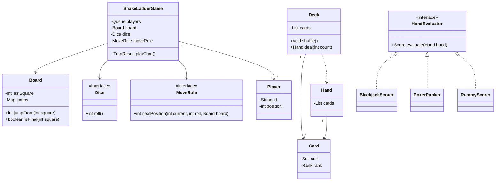

Snake and Ladder and Deck of Cards look unrelated, but interviewers use them to test the same instinct: keep the loop simple and push variation into small objects. A board game changes by swapping dice and movement rules; a card game changes by swapping hand evaluation rules.

## Requirements

### Functional

- **Snake and Ladder:** support `N` players, a numbered board, snakes and ladders as jumps, a dice abstraction, a queue-based turn order, and a win condition when a player reaches the last square.
- Configure classic follow-ups without rewriting the loop: two dice, loaded dice for tests, exact landing on square 100, moving snakes, and any number of players.
- **Deck of Cards:** model `Suit`, `Rank`, immutable `Card`, a shuffleable `Deck`, and `Hand`s dealt from that deck.
- Support Blackjack, Poker and Rummy by plugging in scoring or ranking strategies, not by putting a `GameType` switch inside `Deck`.
- Keep both designs deterministic under tests by injecting randomness instead of calling `new Random()` deep inside the core logic.

### Non-functional and assumptions

- A single game instance is sequential; if hosted online, one game should serialize its own moves.
- Card identity is value-based: ace of spades is the same card regardless of where it appears.
- Money, betting, leaderboards and UI rendering are out of scope.
- `Deck` represents a physical deck by default, so a card dealt once cannot be dealt again until the deck is reset or reshuffled.

### Clarifying questions to ask

- Is the Snake and Ladder board fixed at 100 squares, or configurable?
- Must a player land exactly on the final square, or can they overshoot and still win?
- Are snakes and ladders static, or can they move after turns?
- Is the card deck one standard 52-card deck, or multiple decks with jokers?
- For card games, are we only modelling deck operations, or also scoring and turn rules?
- Should shuffling be cryptographically secure, or is normal pseudorandom shuffling enough?

## Core objects

| Class | Responsibility | Key fields or methods |
|---|---|---|
| `SnakeLadderGame` | Owns the turn loop and win detection | `players`, `board`, `dice`, `moveRule`, `playTurn()` |
| `Board` | Knows board size and jump destinations | `lastSquare`, `jumpFrom(square)` |
| `Jump` | Value object for a snake or ladder | `from`, `to` |
| `Dice` | Roll abstraction for random or test dice | `roll()` |
| `MoveRule` | Applies exact-landing or overshoot policy | `nextPosition(current, roll, board)` |
| `Player` | Tracks a participant and current square | `id`, `name`, `position` |
| `Card` | Immutable value object | `Suit suit`, `Rank rank` |
| `Deck` | Owns undealt cards, shuffle and deal | `shuffle()`, `deal(count)` |
| `Hand` | Cards held by one player | `cards`, `add(card)` |
| `HandEvaluator` | Game-specific scoring or ranking | `evaluate(hand)` |

## Class design



## Snake and Ladder design

The most important modelling choice is that snakes and ladders are not subclasses of `Square`. The board is simply numbered positions plus a jump map: `Map<Integer, Integer>` where `4 -> 14` is a ladder and `97 -> 78` is a snake. The game loop does not care why a jump exists; it asks the board for the final square after movement.

| Variation | Where it belongs | What stays unchanged |
|---|---|---|
| Two dice | `Dice` implementation that sums two rolls | `SnakeLadderGame.playTurn()` |
| Loaded dice for tests | Deterministic `Dice` returning scripted values | Board and player classes |
| Exact landing required | `MoveRule` implementation | Dice, jump map and player queue |
| Moving snakes | `Board` or `JumpProvider` updates jump map between turns | Turn loop |
| N players | Initial queue contents | Board and movement rules |

> [!KEY]
> Treat the board as data and the dice as a dependency. If `playTurn` says "roll, apply move rule, apply jump, rotate queue", every classic follow-up changes one small collaborator instead of the game loop.

The queue is the turn-order source of truth. `playTurn()` peeks the current player, rolls the dice, computes the destination, applies any jump, updates the player, then either returns a win result or moves that player to the back of the queue. A player wins only when their stored position equals the board's final square. With the exact-landing rule, a roll from square 98 by five squares leaves the player on 98; with the loose rule, the same roll wins immediately.

```java
public final class SnakeLadderGame {
    private final Deque<Player> players;
    private final Board board;
    private final Dice dice;
    private final MoveRule moveRule;

    public TurnResult playTurn() {
        Player current = players.removeFirst();
        int rolled = dice.roll();
        int candidate = moveRule.nextPosition(current.position(), rolled, board);
        int landed = board.jumpFrom(candidate);
        current.moveTo(landed);

        if (board.isFinal(landed)) {
            return TurnResult.winner(current, rolled, landed);
        }
        players.addLast(current);
        return TurnResult.continueGame(current, rolled, landed);
    }
}
```

> [!WARNING]
> Do not special-case "if square has snake" and "if square has ladder" in the game loop. Both are jumps. A negative jump, a positive jump and a temporary portal all share the same board contract.

## Deck of Cards design

Cards are value objects. In Java 17, a record is a good fit because it is immutable, value-equal and compact. `Suit` and `Rank` are enums because their sets are closed for a standard deck, and `Rank` can carry a face value for simple games while still letting Poker or Rummy evaluate richer meaning through a strategy.

```java
public enum Suit { CLUBS, DIAMONDS, HEARTS, SPADES }

public enum Rank {
    TWO(2), THREE(3), FOUR(4), FIVE(5), SIX(6), SEVEN(7),
    EIGHT(8), NINE(9), TEN(10), JACK(10), QUEEN(10), KING(10), ACE(11);

    private final int blackjackValue;
    Rank(int blackjackValue) { this.blackjackValue = blackjackValue; }
    public int blackjackValue() { return blackjackValue; }
}

public record Card(Suit suit, Rank rank) { }
```

`Deck` owns the mutable pile of undealt cards. Shuffling should use Fisher-Yates, the algorithm that swaps each position with a randomly chosen position at or before it, because it produces an unbiased permutation when the random number generator is uniform. In production Java, `Collections.shuffle(list, random)` is the right default because it implements that algorithm, is well tested, and accepts an injected `Random` for repeatable tests.

```java
public final class Deck {
    private final List<Card> cards;
    private final Random random;

    public Deck(List<Card> cards, Random random) {
        this.cards = new ArrayList<>(cards);
        this.random = random;
    }

    public void shuffle() {
        Collections.shuffle(cards, random);
    }

    public Hand deal(int count) {
        if (count < 0 || count > cards.size()) throw new IllegalArgumentException("Not enough cards");
        List<Card> dealt = new ArrayList<>(cards.subList(0, count));
        cards.subList(0, count).clear();
        return new Hand(dealt);
    }
}
```

| Design choice | Preferred answer | Why |
|---|---|---|
| Card mutability | Immutable `record Card` | A card's rank and suit never change, and value equality is natural |
| Shuffle | `Collections.shuffle(cards, random)` | Fisher-Yates, tested library code, injectable randomness |
| Deal | Remove from the undealt deck | Prevents duplicate physical cards |
| Game-specific scoring | `HandEvaluator` or `HandRanker` | Blackjack, Poker and Rummy do not agree on what a good hand means |

> [!TIP]
> The senior answer is not "I will add `if gameType == BLACKJACK` inside `Deck`". A deck knows cards, order and dealing; a game rules object knows whether aces are soft, whether a flush beats a straight, or whether a run is a valid meld.

## Shared extension point

Both problems are really about the same refactoring pressure. The core loop should be boring and stable; the volatile rule should be a collaborator. Snake and Ladder varies dice, movement and jumps. Card games vary scoring, ranking and sometimes dealing rules. In each case, the core object should delegate the policy rather than branch on every possible game variant.

```java
public interface HandEvaluator {
    Score evaluate(Hand hand);
}

public final class BlackjackScorer implements HandEvaluator {
    @Override
    public Score evaluate(Hand hand) {
        int total = hand.cards().stream().mapToInt(c -> c.rank().blackjackValue()).sum();
        long aces = hand.cards().stream().filter(c -> c.rank() == Rank.ACE).count();
        while (total > 21 && aces-- > 0) total -= 10;
        return new Score(total, total <= 21);
    }
}
```

Poker would implement a `HandRanker` returning categories such as pair, flush or full house plus tie-breaker ranks. Rummy would implement a meld strategy that partitions cards into sets and runs, then returns deadwood points. Those objects can use the same `Card`, `Deck` and `Hand` without changing their code.

| Follow-up | Strategy or value type to add |
|---|---|
| Multiple physical card decks | `DeckFactory` that emits repeated `Card` values with copy identity if needed |
| Jokers | Add `JOKER` as a special card type or model `Card` as rank optional, depending on scope |
| Blackjack split and double down | `BlackjackGame` turn rules, not `Deck` |
| Poker hand comparison | `PokerRanker` with category and kicker comparison |
| Rummy meld validation | `MeldStrategy` over a `Hand` |
| Snake and Ladder bonus turn on six | `TurnPolicy` deciding whether to rotate the queue |

## Concurrency and testing

Single-table board and card games are sequential by nature, but server hosting introduces races. A game instance should process moves through one lock or one actor queue so two clients cannot both submit the "current" turn. For cards, dealing must be atomic against the deck: two concurrent `deal(5)` calls must not receive overlapping cards. A coarse per-game lock is usually acceptable because moves are short and independent games run in parallel.

Testing is straightforward when randomness is injected. A scripted dice can return `4, 3, 6` to verify ladder, snake and exact-landing behaviour. A seeded `Random` can make shuffle tests repeatable, but avoid asserting a complete shuffled order unless the seed and platform are part of the contract; stronger tests assert invariants such as "same cards, no duplicates, size unchanged before deal".

> [!NOTE]
> If the interviewer asks about fairness, separate algorithm fairness from operational fairness. Fisher-Yates gives unbiased permutations, but you still need logging or seed control if a real-money game must prove no one tampered with the shuffle.

## Cheat sheet

- Snake and Ladder board = final square plus jump map. Snakes and ladders are the same abstraction.
- `Dice` is an interface so one die, two dice, loaded dice and deterministic tests are plug-ins.
- Turn order belongs in a queue; after a non-winning move, rotate the current player to the back.
- Exact landing is a movement rule, not a hardcoded `if` buried in the game loop.
- `Card` should be immutable and value-equal; Java 17 records are ideal.
- `Deck` owns mutable undealt cards and removes cards when dealing.
- Use Fisher-Yates through `Collections.shuffle(cards, random)` unless there is a specific reason not to.
- Blackjack, Poker and Rummy share cards and decks but not scoring. Put scoring in strategies.
- The shared lesson: keep the loop stable, push variability into strategies and value objects.

## Common mistakes

| Mistake | Fix |
|---|---|
| Modelling every square as a subclass | Use numbered squares plus a jump map |
| Hardcoding `Random` inside `playTurn()` | Inject `Dice` so tests can control rolls |
| Treating snakes and ladders as separate branches | Make both entries in `Map<Integer, Integer>` |
| Forgetting to rotate the player queue after a non-winning turn | Queue removal and reinsert should happen in exactly one place |
| Making `Card` mutable | Use an immutable value object or record |
| Putting Blackjack and Poker `if` branches inside `Deck` | Introduce scoring or ranking strategies |
| Shuffling by repeatedly picking random cards into a new list | Use Fisher-Yates via `Collections.shuffle` |
| Dealing without removing from the deck | Remove dealt cards so the same physical card cannot appear twice |

## Summary

Snake and Ladder teaches that a game loop becomes easy once board jumps, dice and movement policies are separate collaborators. Deck of Cards teaches the same lesson with value objects and ranking strategies: a deck only shuffles and deals, while Blackjack, Poker and Rummy decide what a hand means. In both designs, the best interview answer is a stable core loop surrounded by small interchangeable policies.

## Top Interview Questions

### Q1. Why model Snake and Ladder with a jump map instead of `SnakeSquare` and `LadderSquare` classes?

A jump map keeps the board simple: each square is just an integer, and a `Map<Integer, Integer>` says where a player should end up after landing there. A ladder from 4 to 14 and a snake from 97 to 78 differ only in whether the destination is higher or lower. If the game loop branches on `SnakeSquare` versus `LadderSquare`, every future board effect becomes another special case. With a jump map, `playTurn` only asks `board.jumpFrom(candidate)` and uses the returned square. That also makes tests compact, because a custom board can be built with a few map entries rather than a hierarchy of square subclasses.

### Q2. How does the dice abstraction help beyond unit testing?

Testing is the obvious benefit, because a scripted `Dice` can force a player to land on a ladder, snake or exact-landing edge case. The design benefit is broader: every dice-related rule becomes a configuration change instead of a game-loop rewrite. One standard die returns 1 to 6. Two dice can sum two rolls. A loaded die can bias probabilities. A remote dice service could be wrapped by the same interface for an online game. The turn loop still says only `int rolled = dice.roll()`, which is exactly the kind of small seam interviewers want to see. It separates "how a random number is produced" from "how a turn is applied."

### Q3. How do you support the rule that a player must land exactly on square 100?

Make exact landing a `MoveRule`, not an `if` scattered through `playTurn`. The rule receives the current position, roll and board. If `current + roll` is greater than the final square, it returns the current position unchanged; otherwise it returns the candidate square. A looser rule can instead clamp to the final square or declare a win on overshoot. The game loop does not change because it already delegates movement policy before applying jumps. This is a good example of Strategy in a small problem: there may be only two policies today, but pulling the policy out makes the follow-up a one-class addition instead of an edit to the core algorithm.

### Q4. How would you handle a bonus turn when a player rolls a six?

Introduce a `TurnPolicy` that decides whether the current player should be reinserted at the front of the queue, moved to the back, or possibly skipped because of a penalty. The main loop can compute a `TurnResult` containing the roll, player and win status, then ask `turnPolicy.placeNext(players, current, result)` if the game continues. Do not bury the bonus rule inside player rotation logic with a hardcoded `if (roll == 6)`. That works for the first follow-up but becomes messy when another rule arrives, such as three consecutive sixes causing a turn loss or a card game-like "reverse direction" variant.

### Q5. Why is `Card` a value object, and why is immutability important?

A card has no meaningful lifecycle of its own in this design. The ace of spades is identified entirely by its rank and suit, and those fields never change after creation. That makes it a value object: equality should compare the fields, not object identity. Immutability prevents accidental corruption such as a card's rank changing while it is already in a hand, a discard pile or a scoring calculation. In Java 17, `record Card(Suit suit, Rank rank)` expresses those choices directly: final fields, generated equality, generated hash code and a compact constructor. Mutable card objects add risk without adding useful behaviour.

### Q6. Why is `Collections.shuffle` usually the right default for shuffling?

`Collections.shuffle(list, random)` implements the Fisher-Yates shuffle, which produces an unbiased permutation when the random number generator supplies uniform choices. It is library code, widely used and less error-prone than hand-rolled shuffling. Many naive shuffles are biased because they repeatedly pick random elements incorrectly or swap each position with any position in the full list rather than the remaining prefix or suffix. Passing an injected `Random` keeps tests repeatable and avoids hiding randomness inside the deck. Only choose something else if the problem explicitly requires cryptographic randomness or auditable real-money fairness, in which case the random source changes more than the deck API.

### Q7. How can the same deck support Blackjack, Poker and Rummy without a `GameType` switch?

Keep `Deck`, `Card` and `Hand` game-agnostic, then plug in a scoring or ranking strategy. Blackjack needs a scorer that treats face cards as ten and aces as one or eleven. Poker needs a ranker that detects categories such as flush, straight and full house, then compares kickers. Rummy needs a meld evaluator that finds sets and runs and computes deadwood points. None of that belongs in `Deck`, because a physical deck does not know what game is being played. The deck shuffles and deals; the game-specific object interprets the hand. That separation is open for extension and easy to unit test.

### Q8. What should happen if two threads deal cards from the same deck at the same time?

The deal operation must be atomic with respect to the deck's mutable list of undealt cards. If two threads both see the same initial size and both remove from the front without coordination, they can return overlapping cards or corrupt the list. For a single game instance, a simple per-game lock around `shuffle` and `deal` is usually enough because these operations are short. If the system hosts many games, each game or deck has its own lock so different tables still run in parallel. The important point is the lock is scoped to one deck, not global across every game in the service.

### Q9. How do you test Snake and Ladder deterministically?

Inject deterministic collaborators. Use a `ScriptedDice` that returns a known sequence such as 3, 4 and 6, then build a board with specific jump entries like `4 -> 14` and `17 -> 7`. Drive `playTurn()` and assert the player's position, the returned `TurnResult`, and queue rotation after each call. Test exact landing by placing a player near the final square and returning an overshooting roll. Because the board is a jump map and the dice is an interface, these tests do not depend on randomness, sleep, UI events or a 100-square fixture. They exercise the same loop production uses, just with controlled inputs.

### Q10. What is the shared design lesson between Snake and Ladder and Deck of Cards?

Both problems are small versions of the same larger LLD lesson: stable core objects should own stable responsibilities, and volatile rules should sit behind explicit seams. In Snake and Ladder, the stable loop is roll, move, jump, check win, rotate turn; the volatile parts are dice, exact-landing policy, bonus turns and dynamic jumps. In card games, the stable deck operations are create, shuffle and deal; the volatile part is what a hand means in Blackjack, Poker or Rummy. If those variations are expressed as strategies and immutable value types, follow-up requirements add classes rather than forcing edits to a central switch statement.
