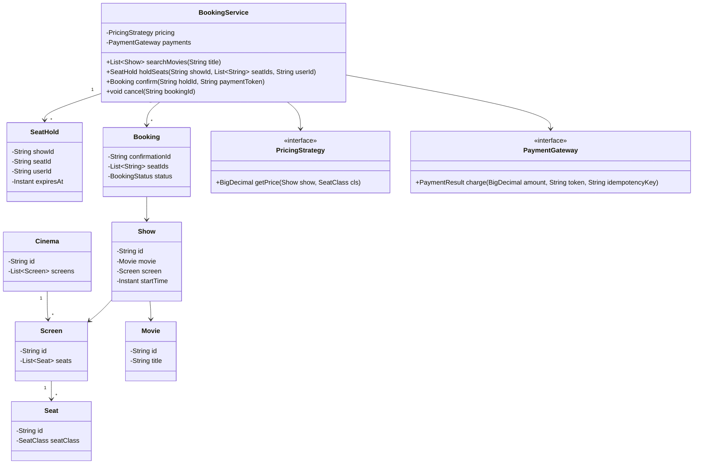
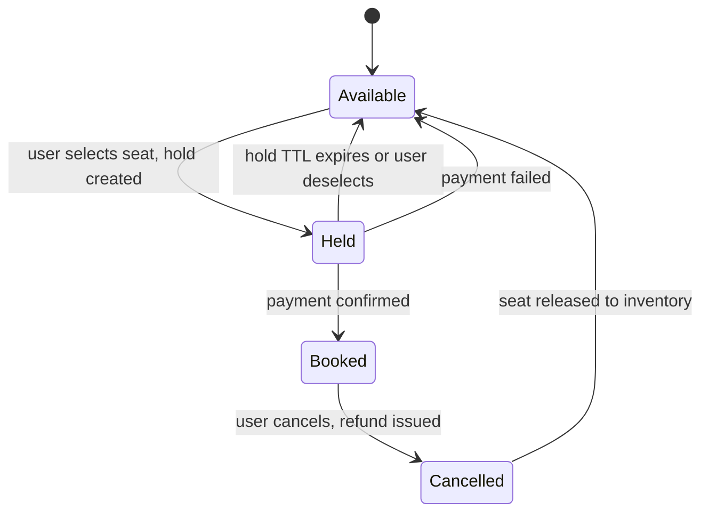

Movie ticket booking is the interview problem where concurrency isn't a bonus round — it's the whole point. Everything else in the design (catalogue browsing, pricing, cancellation) exists in service of answering one question: how do you stop two people from paying for the same seat.

## Requirements

### Functional

- Model Cinema → Screen → Show (a movie at a specific time on a specific screen) → Seat.
- Let users search for movies by title (simple substring match) and browse shows by movie, cinema or time, viewing a seat map for a chosen show.
- Let a user select seats and place a temporary hold on them while completing payment.
- Confirm the booking on successful payment; release held seats back to available on payment failure or hold expiry.
- Support cancelling a confirmed booking with a refund, releasing the seats.
- Price seats by class (standard, premium, recliner) and potentially by showtime.

### Non-functional and assumptions

- Exactly one booking may succeed per seat per show, even under many simultaneous attempts.
- A seat hold is short-lived (5–10 minutes) and must auto-expire back to available if payment never completes.
- Payment is an external, untrusted boundary — it can succeed, fail, or time out independently of seat state.
- Contention on one popular show must not slow down bookings for unrelated shows.

### Clarifying questions to ask

- Do users pick specific seats, or does the system auto-assign best-available?
- Is movie search full-text/fuzzy, or is simple substring matching on title enough?
- How long should a seat hold last before it expires back to available?
- Does every seat in a show cost the same, or does price vary by seat class and/or showtime?
- Is payment processing in scope, or can we assume it always succeeds?
- Are cancellation and refunds part of this design?
- Is this a single cinema, or a multi-cinema platform where many shows are booked concurrently?

## Core objects

| Class | Responsibility | Key fields/methods |
|---|---|---|
| `Cinema` / `Screen` | Physical location hierarchy | `screens`, `seats` |
| `Movie` | Searchable catalogue entry | `id`, `title` |
| `Show` | A movie at a specific time on a specific screen | `movie`, `screen`, `startTime` |
| `Seat` | One physical seat in a screen | `id`, `seatClass` |
| `SeatHold` | A temporary, expiring claim on a seat for one show | `showId`, `seatId`, `userId`, `expiresAt` |
| `Booking` | A confirmed reservation | `confirmationId`, `seatIds`, `status` |
| `PricingStrategy` | Price for a seat class on a given show | `getPrice(show, seatClass)` |
| `PaymentGateway` | External, untrusted payment boundary | `charge(amount, token, idempotencyKey)` |
| `BookingService` | Orchestrates search, hold → payment → confirm | `searchMovies(title)`, `holdSeats`, `confirm`, `cancel` |

## Class design

The core entities and how they reference each other — a show belongs to a theater and a movie, and a booking always routes back to the show it was made against:




Earlier whiteboard passes toward this same class model:


### Seat/booking state machine



## Key design decisions

### 1. A short-lived seat hold, not a long checkout transaction

Rather than locking a seat the instant a user opens the seat map, a `SeatHold` with a TTL is created only when the user actively selects a seat, and it auto-expires if payment doesn't complete in time. This bounds the worst case ("user abandoned the tab mid-payment") without needing a human to manually release the seat.

> [!KEY]
> Rejected alternative: lock the seat for the entire session with no expiry, released only by explicit user action. A dropped connection or abandoned tab would permanently strand that seat as unavailable until manual intervention — unacceptable for a system selling a finite, time-boxed resource.

### 2. Choosing a concurrency control strategy for seat holds

This is the design decision interviewers spend the most time on, so it's worth a dedicated comparison before the implementation.

| Strategy | How it works | Trade-off |
|---|---|---|
| Pessimistic lock | `SELECT ... FOR UPDATE` on the seat row during hold creation | Guarantees no race, but serializes access to hot shows and risks lock contention/deadlocks when holding multiple seats in one transaction |
| Optimistic (version column) | `UPDATE seats SET status='held', version=version+1 WHERE id=? AND version=?`; 0 rows affected means conflict | Scales well, no held locks, but needs explicit retry logic on conflict |
| Distributed lock (e.g., Redis `SET NX PX`) | A lock key per seat with a TTL, held for the hold duration | TTL gives expiry for free; needs care around lock renewal for long flows and split-brain risk without a proper consensus scheme (e.g., Redlock) |

> [!TIP]
> The strong answer names all three, picks one with a stated reason, and mentions the fallback: "optimistic concurrency at the database as the source of truth, with a Redis hold key as a fast-path first line of defense so the DB isn't hit for every seat-map click."

### 3. Pricing per seat class and showtime as a Strategy

`PricingStrategy.getPrice(show, seatClass)` isolates "how much does this seat cost" from the booking orchestration entirely — a recliner at a Friday-night premiere and a standard seat at a Tuesday matinee can differ without `BookingService` knowing anything about pricing rules.

| Approach | Problem |
|---|---|
| Flat price per ticket | Can't express premium seat classes or time-based pricing |
| `PricingStrategy` per seat class + show context | ✅ Composable — dynamic/surge pricing later is a new implementation, not a rewrite |

### 4. Payment as an external, untrusted boundary — same pattern as the ATM

`PaymentGateway.charge` takes an idempotency key derived from the hold, so a network timeout followed by a client retry cannot double-charge the user. `BookingService.confirm` only transitions a hold to `Booked` after a successful, idempotent charge — never before.

## Implementation

```java
public class BookingService {
    // key: showId:seatId
    private final ConcurrentMap<String, SeatStatus> seatStatus = new ConcurrentHashMap<>();
    private final ConcurrentMap<String, SeatHold> holds = new ConcurrentHashMap<>();
    private final PaymentGateway payments;
    private final PricingStrategy pricing;

    public BookingService(PaymentGateway payments, PricingStrategy pricing) {
        this.payments = payments;
        this.pricing = pricing;
    }

    public SeatHold holdSeats(String showId, List<String> seatIds, String userId) {
        List<String> claimed = new ArrayList<>();
        for (String seatId : seatIds) {
            String key = showId + ":" + seatId;
            // Atomic claim: fails if the seat isn't currently AVAILABLE.
            if (!seatStatus.replace(key, SeatStatus.AVAILABLE, SeatStatus.HELD)) {
                for (String c : claimed) {
                    seatStatus.replace(showId + ":" + c, SeatStatus.HELD, SeatStatus.AVAILABLE);
                }
                throw new IllegalStateException("Seat " + seatId + " unavailable");
            }
            claimed.add(seatId);
        }

        SeatHold hold = new SeatHold(showId, claimed, userId, Instant.now().plus(Duration.ofMinutes(8)));
        holds.put(hold.getId(), hold);
        return hold;
    }

    public Booking confirm(String holdId, String paymentToken) {
        SeatHold hold = holds.get(holdId);
        if (hold.getExpiresAt().isBefore(Instant.now())) {
            throw new IllegalStateException("Hold expired");
        }

        BigDecimal amount = hold.getSeatIds().stream()
            .map(s -> pricing.getPrice(hold.getShowId(), s))
            .reduce(BigDecimal.ZERO, BigDecimal::add);
        PaymentResult result = payments.charge(amount, paymentToken, holdId); // idempotencyKey = holdId
        if (!result.success()) {
            releaseHold(hold);
            throw new IllegalStateException("Payment failed");
        }

        for (String seatId : hold.getSeatIds()) {
            seatStatus.put(hold.getShowId() + ":" + seatId, SeatStatus.BOOKED);
        }

        return new Booking(UUID.randomUUID().toString(), hold.getSeatIds(), BookingStatus.CONFIRMED);
    }
}
```

## Concurrency and thread safety

The deep-dive question is always "two users select the same seat at the same instant — what happens?" Walk through the layered answer:

1. **Fast path (optional):** a distributed lock/hold key in a cache (Redis `SET seat:{showId}:{seatId} NX PX 480000`) rejects the second user's selection near-instantly, without touching the database, for the overwhelming majority of contention on hot shows.
2. **Source of truth:** the database enforces the real guarantee via optimistic concurrency — an `UPDATE ... WHERE status = 'available' AND version = ?` that atomically flips status and increments a version counter. Zero rows affected means someone else won the race; the caller retries against a different seat or fails cleanly.
3. **Expiry sweep:** a background job (or a lazy check on next access) scans for holds past their `ExpiresAt` and releases those seats back to `Available` — this is what turns an abandoned checkout into inventory again without a human involved.

> [!WARNING]
> If the cache-based fast-path lock and the database's authoritative status ever disagree (cache says held, DB says available, or vice versa, after a crash), the database must always win — the cache is an optimization, not the source of truth. Treat any mismatch as "trust the DB, repair the cache."

> [!TIP]
> `holdSeats` above claims seats one at a time and rolls back on the first failure, which sidesteps deadlock entirely because no seat is ever locked while waiting on another. If you instead implement seat claiming with real per-seat mutexes (rather than lock-free compare-and-swap), always acquire them in a fixed order — sort the requested seat ids before locking — so that a booking for seats {A5, A6} and a concurrent booking for {A6, A5} can never deadlock waiting on each other's lock.

## Extending the design

| New requirement | Where it plugs in | Why the design allows it |
|---|---|---|
| Dynamic/surge pricing | New `PricingStrategy` implementation | Pricing is already isolated from booking orchestration |
| Waitlist for a sold-out show | A queue observed the same way as the library's reservation queue, notified on cancellation | `Cancel` already transitions a seat back to available — the same event Observer-style consumers can subscribe to |
| Group booking discount | A discount step applied to the summed price in `Confirm` | Price computation is already a single, isolated call |
| Multi-city cinema chain | `Cinema`/`Screen` already model the location hierarchy | Show and seat inventory were never assumed to be single-location |
| Food/combo add-ons at checkout | Extra line items summed alongside seat prices before `Charge` | Payment amount is already computed as a sum, not hardcoded to seats only |
| Admins adding/removing movies and shows at runtime | New `addShow`/`removeShow` methods maintaining the same movie/show indexes `searchMovies` reads from | Catalogue lookups are already index-based, not a fixed list computed once at startup |

## Cheat sheet

- The whole design exists to answer: "how do exactly one of two concurrent seat requests succeed."
- Seat hold = short TTL, not an indefinite lock — abandoned checkouts must self-heal.
- Three concurrency options: pessimistic DB lock, optimistic version column, distributed cache lock — know the trade-offs of each.
- The database is always the source of truth; a cache-based fast-path lock is an optimization layered on top, never a replacement.
- Payment charges carry an idempotency key derived from the hold — never charge twice for one confirm.
- Pricing varies by seat class and showtime — isolate it behind a Strategy, never hardcode a flat price.
- Cancellation must release the seat and, if a waitlist exists, notify the next interested user.
- If seat claiming ever uses real per-seat locks instead of lock-free CAS, sort seat ids before locking to avoid deadlock on multi-seat bookings.

## Common mistakes

| Mistake | Fix |
|---|---|
| Locking a seat indefinitely with no expiry | Use a bounded TTL hold that auto-releases |
| Check-then-set seat status as two separate calls | One atomic compare-and-swap / conditional update |
| Trusting a cache lock as the source of truth | Database (or authoritative store) always wins on conflict |
| Charging payment before confirming the hold is still valid | Check `ExpiresAt` before charging, not after |
| No idempotency key on the payment charge | Derive one from the hold id, reuse it on retries |
| Flat pricing hardcoded into booking logic | Extract `PricingStrategy` by seat class and showtime |
| Per-seat locks acquired in request order for multi-seat bookings | Acquire in a fixed sorted order to avoid cross-booking deadlock |

## Summary

Movie ticket booking is fundamentally a resource-contention problem dressed up as a browsing-and-checkout flow: the seat map, pricing and cinema hierarchy are straightforward, but the design lives or dies on how seat holds are claimed, expired and confirmed under concurrency. A short-TTL hold, an atomic (optimistic or pessimistic) claim at the database, and an idempotent payment confirmation together guarantee exactly one booking per seat — everything else, from dynamic pricing to waitlists to multi-city chains, is a straightforward extension once that core guarantee is solid.

## Top Interview Questions

### Q1. Two users click "book" on the same seat within milliseconds of each other. Walk through exactly what happens.

Both requests attempt to create a `SeatHold` for the same `(showId, seatId)`. Whichever storage layer is authoritative performs an atomic conditional update — for example, `UPDATE seats SET status='held', version=version+1 WHERE id=? AND status='available' AND version=?`. Exactly one of the two `UPDATE` statements affects a row; the other affects zero rows because by the time it runs, `status` is no longer `'available'` (or the version has already advanced). The service issuing the failed update catches the zero-rows-affected result and returns "seat no longer available" to that user immediately, while the winning user proceeds to the payment step with a valid hold.

### Q2. Compare pessimistic locking, optimistic concurrency, and a distributed lock for this problem. Which would you pick and why?

Pessimistic locking (`SELECT ... FOR UPDATE`) guarantees correctness by physically blocking other transactions from touching the row until the lock is released, but it holds a lock for the duration of the transaction, which is dangerous if that transaction includes anything slow (never let it span an external payment call). Optimistic concurrency (a version column checked in the `UPDATE`'s `WHERE` clause) never holds a lock at all — it just detects conflicts after the fact and asks the loser to retry or fail — which scales much better under high contention on popular shows. A distributed lock (Redis with TTL) is useful as a fast, cheap first line of defense in front of the database, especially when seat availability is served from a cache for read-heavy seat-map views, but it should never be the sole guarantee — the database remains authoritative. My default: optimistic concurrency at the database, with an optional Redis fast-path for read-heavy traffic.

### Q3. Why does the seat hold need a TTL, and how do you enforce it?

Without a TTL, a user who selects seats and then abandons the browser tab mid-payment would strand those seats as permanently unavailable, since nothing ever triggers their release. A TTL (say, 8 minutes) bounds that worst case automatically. Enforcement can be either active (a background sweeper job periodically scanning for holds past `ExpiresAt` and flipping them back to available) or lazy (checking `ExpiresAt` at the moment any subsequent operation touches that hold, and treating an expired hold as if it never existed) — a lazy check is cheaper for low-traffic systems, an active sweep gives a tighter, more predictable release time for popular shows where every second of stale unavailability matters.

### Q4. How do you make the payment confirmation step safe against network retries?

Every call to `PaymentGateway.charge` includes an idempotency key derived deterministically from the hold (e.g., the hold's own id), and the payment gateway is contracted to deduplicate on that key — if it sees the same key twice, it returns the result of the first attempt rather than charging again. This means the booking service can safely retry a timed-out `charge` call without any risk of double-charging the customer, because "did this already happen" is answered by the payment provider, not inferred by the caller.

### Q5. What should happen if a payment succeeds but the system crashes before the booking is marked confirmed?

This is the exact analog of the ATM's "debit succeeded but dispense failed" problem: on restart, the system needs a reconciliation step that checks, for any hold whose payment charge was initiated, whether the payment gateway's idempotency key shows a completed charge that was never reflected in a `Booked` seat status — and if so, completes the booking rather than leaving the customer charged with no ticket. This is why the idempotency key should also be stored locally against the hold before the charge is even attempted, so recovery has something to look up.

### Q6. How would you design a "seat map" read that shows real-time availability without contending with the write path?

Reads (rendering the seat map) should query a read-optimized view — a cache or a read replica — that reflects seat status without acquiring any lock, since seat-map views vastly outnumber actual booking attempts and must never block on write-path contention. It's acceptable for this view to be briefly stale (a seat shown as available might get claimed a second later, discovered when the user's own hold attempt fails) — that's a normal, expected race in any high-concurrency booking system, not a bug, as long as the hold-creation step itself remains strictly correct.

### Q7. How would you extend this design to support a waitlist for a sold-out show?

Add a `WaitlistQueue` per show, analogous to the library's `ReservationQueue`: when a seat becomes available again (a hold expires without confirming, or a booking is cancelled), the release path checks the waitlist and, if non-empty, offers the freed seat to the next waiting user — typically via a short, separate hold with its own TTL so that user has a bounded window to complete payment before the seat is offered to the next person in line. This reuses the exact same "atomic release, then notify" pattern already used for expired holds, just with a different trigger.

### Q8. Why should pricing be a Strategy rather than a field on `Seat`?

A price is a function of at least two things that change independently — the seat's class (standard/premium/recliner) and the specific show (a weekend premiere vs. a weekday matinee of the same movie in the same seat) — so storing a single static price on `Seat` can't express "this recliner costs more for tonight's premiere than for Tuesday's afternoon showing." An `PricingStrategy.getPrice(show, seatClass)` call captures both dimensions and lets you swap in dynamic/surge pricing later as a new implementation, without touching `Seat`, `Show`, or the booking orchestration at all.

### Q9. How do you prevent a user from holding more seats than they intend to pay for, tying up inventory?

Cap the number of seats a single hold can claim (a reasonable business rule, e.g., 10 per transaction), and enforce the TTL strictly regardless of how many seats are in the hold — a larger hold isn't allowed a longer expiry window. You could also rate-limit hold creation per user/IP to prevent a script from repeatedly holding and abandoning large blocks of seats to grief other customers (a scalping/denial-of-service concern worth naming even if full mitigation is out of scope for the core design).

### Q10. How would this design change for a cinema chain selling tickets across hundreds of cities simultaneously?

The core hold/confirm logic per seat doesn't change — the change is in partitioning and scale: shard seat inventory by show (since contention is always within one show, never across shows), so a hot premiere in one city doesn't create lock contention affecting bookings in another city entirely. The optimistic-concurrency database writes and any distributed cache locks should be partitioned the same way, and the pricing/payment services should be stateless and horizontally scalable, since they don't hold any of the contended state — the seat/hold layer is the only part that needs careful partitioning.

### Q11. How would you test the concurrent-booking guarantee without relying on real network timing?

Write a test that spins up N concurrent tasks/threads, each attempting to hold the *same* single seat for the same show, and asserts that exactly one succeeds and the other N-1 all receive the "unavailable" failure — this directly exercises the atomic claim logic (`replace`/conditional `UPDATE`) under real thread contention rather than trusting it by inspection. A second test seeds a hold with an already-past `ExpiresAt` and asserts that a subsequent hold attempt on the same seat succeeds, verifying the expiry path independent of any background sweeper's timing.

### Q12. What would you monitor in production for this system?

Hold-to-confirm conversion rate (a low rate might mean the TTL is too short, or the payment flow is broken), average and p99 time from hold creation to payment confirmation, expired-hold rate per show (a spike could indicate a UI bug leaving users stuck), and — critically — a zero-tolerance alert on any detected double-booking (two confirmed `Booking` records referencing the same seat and show), since that represents a correctness failure in the core guarantee the entire design exists to provide.
