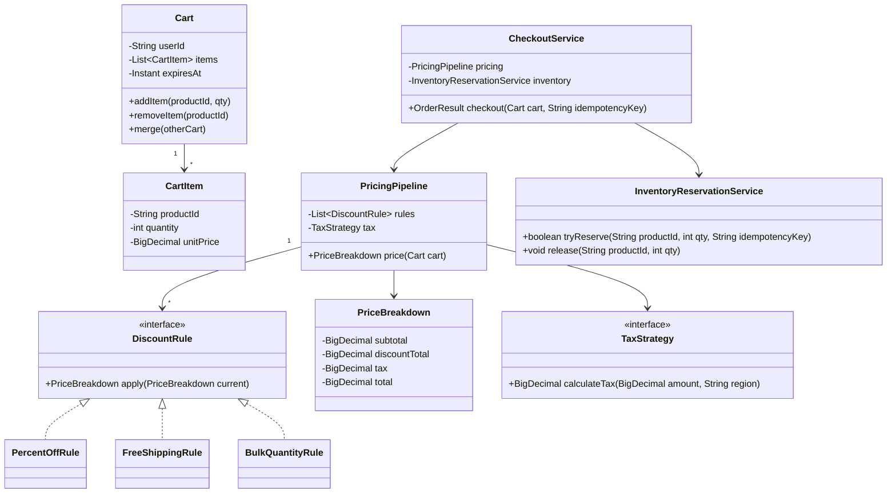
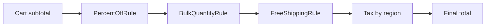

A shopping cart looks like CRUD on a list until the pricing pipeline shows up: stacking discounts, tax and currency all have to compose predictably, inventory can't be reserved too early or too late, and checkout has to survive a double-click or a network retry without charging twice.

## Requirements

### Functional

- Add, remove and update the quantity of line items in a cart.
- Compute a price via a pipeline: subtotal → discounts → tax → total.
- Support multiple discount rules with a defined precedence for stacking vs. mutual exclusion.
- Reserve inventory at checkout time, not the moment an item is added to the cart.
- Merge a guest cart into a logged-in user's cart on login.
- Persist the cart with an expiry so abandoned carts are cleaned up.
- Make checkout idempotent — a retried checkout request must never double-charge or double-reserve stock.

### Non-functional and assumptions

- Currency and tax rules vary by region and must be pluggable, not hardcoded.
- The same cart may be edited from multiple devices/tabs for one user; concurrent edits should not silently drop an item.
- Checkout calls external payment and inventory services that must be treated as untrusted boundaries, exactly like the ATM's account service.
- Cart data has a TTL — an abandoned cart is not kept forever.

### Clarifying questions to ask

- Can discounts stack (e.g., 10% off *and* free shipping), or are some mutually exclusive?
- Is inventory reserved when an item is added to the cart, or only at checkout?
- Do we need guest-cart support with merge-on-login?
- What's the expected TTL / abandoned-cart cleanup behaviour?
- Is multi-currency and region-based tax in scope?
- What does "idempotent checkout" mean operationally — same request id twice returns the same order, not a second charge?

## Core objects

| Class | Responsibility | Key fields/methods |
|---|---|---|
| `Cart` | Holds line items for a user or guest session | `items`, `expiresAt`, `addItem`, `merge` |
| `CartItem` | One product line in the cart | `productId`, `quantity`, `unitPrice` |
| `DiscountRule` | One composable pricing adjustment | `apply(PriceBreakdown current) -> PriceBreakdown` |
| `PricingPipeline` | Chains discount rules, then applies tax | `price(cart) -> PriceBreakdown` |
| `TaxStrategy` | Region-specific tax calculation | `calculateTax(amount, region)` |
| `PriceBreakdown` | Running/result totals through the pipeline | `subtotal`, `discountTotal`, `tax`, `total` |
| `InventoryReservationService` | Atomic stock reservation at checkout | `tryReserve(productId, qty, idempotencyKey)`, `release(productId, qty)` |
| `CheckoutService` | Orchestrates pricing, reservation, payment | `checkout(cart, idempotencyKey) -> OrderResult` |

## Class design



### Pricing pipeline as a chain



A worked example makes the ordering concrete: a $1,000 cart with an item-level 20%-off electronics coupon (capped at $200), a $50 flat cart coupon, free shipping above $500, and 18% tax.

| Stage | Amount | Running total |
|---|---|---|
| Subtotal | — | 1000 |
| Item discount (20% off, capped) | -200 | 800 |
| Cart discount (flat coupon) | -50 | 750 |
| Shipping (free over 500) | +0 | 750 |
| Tax (18% of discounted total) | +135 | 885 |

Tax is always computed on the post-discount amount, never the original subtotal — taxing the pre-discount amount overcharges the customer and is one of the most common bugs in cart implementations.

## Key design decisions

### 1. Pricing as Strategy rules composed via Chain of Responsibility

Each discount is its own `DiscountRule` implementing `apply(PriceBreakdown) -> PriceBreakdown`; `PricingPipeline` runs an ordered list of them, each rule reading and returning an updated running total, then hands the result to `TaxStrategy`.

| Approach | What goes wrong |
|---|---|
| One `calculateTotal` method with nested `if`s for every promo combination | Adding a new promotion means editing a method that already has to know about every other promotion — combinatorial complexity |
| `DiscountRule` per promotion, chained in a `PricingPipeline` | ✅ New promotion = new class appended to (or inserted into) the chain; existing rules are untouched |

> [!KEY]
> Rejected alternative: a `switch` on `PromotionType` inside `Cart.getTotal()`. It's the same trap as the vending machine and library policy examples — one growing method instead of independently testable, composable units.

### 2. Explicit precedence and stacking rules for the chain

Order matters: a percentage-off rule applied before a flat-amount rule gives a different total than the reverse. `PricingPipeline` runs rules in a defined, documented order, and each rule can be marked `Stackable` or `ExclusiveGroup` so mutually-exclusive promotions ("use the better of these two, not both") don't silently combine.

| Rule type | Stacking behaviour |
|---|---|
| Percent-off + free shipping | Stack — independent effects |
| Two competing "20% off" vs "$10 off" coupons | Exclusive — pipeline picks the one yielding the lower total for the customer, others are skipped |
| Bulk-quantity discount | Stacks with coupons, but is evaluated first so later percentage rules apply to the already-reduced price |

### 3. Inventory reservation at checkout, not at add-to-cart

Adding an item to a cart never touches inventory — reservation only happens when `CheckoutService.checkout` runs, using the same atomic-claim pattern as the parking lot and movie booking (`tryReserve`, succeed or fail per unit, roll back partial reservations on any failure).

> [!WARNING]
> Reserving stock the moment an item is added to a cart looks safer but isn't: abandoned carts (the majority of carts, in practice) would lock up real inventory indefinitely unless paired with the same short-TTL-hold machinery used for seat booking — and even then, you've just rebuilt the seat-hold problem for every product in the catalogue for no benefit.

### 4. Idempotent checkout via a caller-supplied idempotency key

`Checkout(cart, idempotencyKey)` — the same key resubmitted (due to a client retry or a double-click) returns the original order result rather than creating a second order, charging payment twice, or double-reserving stock.

> [!DANGER]
> Rejected alternative: relying on the client to "just not click twice." Network retries happen below the user's control (a proxy timeout retrying a POST, a mobile app resubmitting after a dropped connection) — idempotency has to be enforced server-side by deduplicating on a key, not by trusting client behaviour.

## Implementation

```java
public interface DiscountRule {
    PriceBreakdown apply(PriceBreakdown current);
}

public final class PercentOffRule implements DiscountRule {
    private final BigDecimal percent;

    public PercentOffRule(BigDecimal percent) {
        this.percent = percent;
    }

    @Override
    public PriceBreakdown apply(PriceBreakdown current) {
        BigDecimal discount = current.subtotal().multiply(percent).movePointLeft(2); // subtotal * percent / 100
        return current.addDiscount(discount); // record "wither" returns a new immutable breakdown
    }
}
```

```java
public class PricingPipeline {
    private final List<DiscountRule> rules;
    private final TaxStrategy tax;

    public PricingPipeline(List<DiscountRule> rules, TaxStrategy tax) {
        this.rules = rules;
        this.tax = tax;
    }

    public PriceBreakdown price(Cart cart, String region) {
        BigDecimal subtotal = cart.getItems().stream()
            .map(i -> i.unitPrice().multiply(BigDecimal.valueOf(i.quantity())))
            .reduce(BigDecimal.ZERO, BigDecimal::add);

        PriceBreakdown breakdown = PriceBreakdown.of(subtotal);
        for (DiscountRule rule : rules) {
            breakdown = rule.apply(breakdown);
        }

        BigDecimal taxable = breakdown.subtotal().subtract(breakdown.discountTotal());
        BigDecimal taxAmount = tax.calculateTax(taxable, region);
        return breakdown.withTax(taxAmount).withTotal(taxable.add(taxAmount));
    }
}
```

```java
public class CheckoutService {
    private final ConcurrentMap<String, OrderResult> completedByKey = new ConcurrentHashMap<>();
    private final InventoryReservationService inventory;
    private final PricingPipeline pricing;
    private final PaymentGateway payments;

    public CheckoutService(InventoryReservationService inventory, PricingPipeline pricing, PaymentGateway payments) {
        this.inventory = inventory;
        this.pricing = pricing;
        this.payments = payments;
    }

    public OrderResult checkout(Cart cart, String idempotencyKey, String region) {
        return completedByKey.computeIfAbsent(idempotencyKey,
            key -> performCheckout(cart, key, region));
    }

    private OrderResult performCheckout(Cart cart, String idempotencyKey, String region) {
        // Reserve every line, rolling back everything reserved so far on the first failure —
        // a partial reservation must never survive a failed checkout attempt.
        List<CartItem> reserved = new ArrayList<>();
        try {
            for (CartItem item : cart.getItems()) {
                if (!inventory.tryReserve(item.productId(), item.quantity(), idempotencyKey)) {
                    throw new IllegalStateException("Out of stock: " + item.productId());
                }
                reserved.add(item);
            }

            PriceBreakdown price = pricing.price(cart, region);
            PaymentResult payment = payments.charge(price.total(), idempotencyKey);
            if (!payment.success()) {
                throw new IllegalStateException("Payment failed");
            }

            OrderResult result = new OrderResult(UUID.randomUUID().toString(), price, payment.success());
            cart.clear();
            return result;
        } catch (RuntimeException e) {
            for (CartItem item : reserved) {
                inventory.release(item.productId(), item.quantity());
            }
            throw e;
        }
    }
}
```

## Concurrency and thread safety

Cart edits from multiple devices for the same user are the everyday case — a user adds an item on mobile, then opens the desktop site. A simple, honest approach is last-write-wins per line item with an optimistic version on the whole cart: each update includes the version it read, and a stale write either merges (increment quantity) or is rejected and retried against the latest version, rather than silently overwriting a concurrent addition.

Checkout concurrency is where correctness really matters, and it reuses two patterns already established elsewhere in this series: `InventoryReservationService.tryReserve` must be an atomic per-unit claim (never check-then-decrement in two steps), and `CheckoutService` must dedupe atomically on the idempotency key *before* doing anything with side effects — reservation and payment both — so two concurrent retries cannot both pass an initial cache check and re-execute.

`tryReserve` is typically one conditional update at the storage layer rather than a read followed by a write, so two simultaneous checkouts for the last unit can't both succeed:

```sql
UPDATE stock SET qty = qty - :n WHERE product_id = :id AND qty >= :n;
-- zero rows affected => out of stock, treat as a reservation failure
```

An optimistic version column on the stock row works just as well and is easier to combine with an audit trail; row-level pessimistic locks are simpler to reason about but reduce throughput on hot SKUs during a flash sale.

> [!TIP]
> Guest-to-user cart merge has its own race: a user adds items to a guest cart in one tab while logging in (triggering a merge) in another. Make the merge itself a single transactional operation reading both carts' current versions and writing the merged result atomically, so an in-flight guest-cart addition isn't silently lost mid-merge.

## Extending the design

| New requirement | Where it plugs in | Why the design allows it |
|---|---|---|
| Multi-currency support | `TaxStrategy` and `CartItem.unitPrice` become currency-aware | Tax and pricing were already isolated behind interfaces |
| B2B bulk pricing tiers | New `DiscountRule` keyed on account type | Discounts are already composable, pluggable units |
| Saved-for-later list | A second list on `Cart` with its own lifecycle, no pricing pipeline changes | Pricing only ever operates on active `items`, not on the cart's full structure |
| Bundle pricing (buy A+B, get a bundled price) | A `BundleDiscountRule` inspecting multiple line items at once | Rules already receive the whole `PriceBreakdown`/cart context, not just one item |
| Abandoned-cart email trigger | A listener on cart TTL expiry, independent of pricing/checkout | Cart persistence and expiry are already a separate concern from pricing |

## Cheat sheet

- Pricing is a pipeline: subtotal → discount rules (Strategy, chained) → tax → total. Never one big method.
- Give the chain explicit ordering and stacking rules — "which discounts combine" is a business decision, not an accident of code order.
- Reserve inventory at checkout, not at add-to-cart — carts are abandoned far more often than they convert.
- Checkout must be idempotent: dedupe on a caller-supplied key before touching payment or inventory, not after.
- Cart concurrency: optimistic version per cart, last-write-wins per line item, explicit conflict handling on merge.
- Guest-to-user cart merge is itself a concurrency-sensitive operation — treat it as one atomic step, not two.
- Tax and currency live behind their own strategy interfaces so region rules don't leak into pricing logic.

## Common mistakes

| Mistake | Fix |
|---|---|
| One method with nested `if`s for every promotion combination | `DiscountRule` per promotion, chained through `PricingPipeline` |
| Reserving inventory the moment an item is added to the cart | Reserve only at checkout, using an atomic claim |
| Trusting the client not to double-submit checkout | Server-side idempotency key deduplication |
| Silent last-write-wins overwriting a concurrent cart edit with no conflict signal | Optimistic versioning with explicit merge/retry on conflict |
| Hardcoding tax rate inline in the total calculation | Extract `TaxStrategy` per region |
| Computing tax on the pre-discount subtotal | Tax the amount left *after* discounts, always |
| Treating guest-cart merge as "just append the lists" | Make merge one atomic, version-checked operation |
| Leaving earlier reservations in place when a later line item in the same checkout fails | Track what has been reserved so far and release it all on any failure |

## Summary

A shopping cart's difficulty is almost entirely about composition and safety, not the cart data structure itself: discounts need to combine predictably (Strategy rules chained through a pipeline, with explicit stacking rules), inventory must not be reserved before a customer is actually committing to buy, and checkout must be safe to retry without financial or stock consequences. Get the pricing pipeline, the reservation timing, and the idempotency key right, and multi-currency, bundle pricing and B2B tiers all slot in as new rules rather than rewrites of the checkout path.

## Top Interview Questions

### Q1. Why use Strategy plus Chain of Responsibility for pricing instead of one method that computes the final total?

Discounts are independently defined business rules that need to combine in a specific, sometimes changing order — a single method with nested conditionals for every combination of active promotions becomes unmaintainable the moment a third or fourth promotion exists, since every new rule has to be reasoned about against every existing one. Modeling each discount as a `DiscountRule` (Strategy) and running them through an ordered `PricingPipeline` (Chain of Responsibility) means each rule only implements its own effect on a running total, new rules are purely additive, and the order/stacking policy is an explicit, inspectable list rather than implicit in nested `if` branches.

### Q2. How do you decide whether two discounts should stack or be mutually exclusive?

This is fundamentally a business/product decision, not a technical one, but the pipeline needs a mechanism to express it: tag rules with a stacking category (e.g., `Stackable` vs. belonging to an `ExclusiveGroup`), and have the pipeline, when evaluating an exclusive group, compute the result of each competing rule independently and keep only the one that benefits the customer most (or whichever the business rule specifies — sometimes it's "first applicable," sometimes "best for the customer"). The key design point is that this policy lives in the pipeline's orchestration logic, not scattered as ad hoc checks inside individual rule implementations, which would make the interaction between any two rules something you'd have to trace through both classes to understand.

### Q3. Why should inventory be reserved at checkout rather than when an item is added to the cart?

The overwhelming majority of shopping carts are abandoned, not converted — reserving real stock the instant something is added would lock up inventory for potentially unlimited time against sales that never happen, effectively making "add to cart" indistinguishable from "buy," which is not what the feature is for. Reserving only at checkout, backed by an atomic claim, means inventory is only taken out of the sellable pool for the short, bounded duration of an active checkout attempt — the same reasoning that justifies short-TTL seat holds in the movie booking system, just without needing an expiry TTL here since checkout is typically a single, short synchronous flow rather than a multi-minute payment wait.

### Q4. How do you guarantee checkout is idempotent under client retries?

The client supplies (or the server generates and returns to the client for reuse) an idempotency key unique to one checkout attempt. `CheckoutService.checkout` checks a store of completed results keyed by that value *before* doing anything else — before reserving inventory, before charging payment — and if a match exists, simply returns the previously computed `OrderResult` without re-executing any side effect. This must be checked first, atomically, relative to the side-effecting operations, or a race between two near-simultaneous retries could still slip both past the check before either commits its result.

### Q5. A user adds an item to their cart on their phone while simultaneously removing a different item on their laptop. How do you avoid losing one of these changes?

Treat the cart as a versioned object: each read returns the current version number alongside the items, and each write includes the version it was based on. If both devices read version 5 and both attempt to write version 6, only the first write to arrive succeeds in advancing the version; the second is rejected as a conflict and either automatically retried by re-reading the now-current cart and reapplying its specific line-item change (add X / remove Y are commutative operations that can usually be replayed safely), or surfaced to the client to refresh and reapply. Naive last-write-wins on the whole cart object would silently discard one device's change entirely, which is the bug this versioning avoids.

### Q6. How would you merge a guest cart into a user's existing cart on login, and what could go wrong?

Merging should be a single atomic operation: read both carts' current versions, compute the merged item list (typically summing quantities for shared products), and write the result while checking that neither source cart changed since it was read — if either did (e.g., the user added something to the guest cart in a race with the login/merge itself), retry the merge with fresh data rather than silently dropping the newly added item. The most common bug is treating merge as "read guest cart, read user cart, write combined list" as three separate, non-transactional steps, which loses any edit that happens to land in between them.

### Q7. Why isolate tax calculation behind a `TaxStrategy` instead of computing it inline in the pricing pipeline?

Tax rules vary by region, by product category in some jurisdictions, and change independently of promotional pricing logic — baking a specific region's tax formula directly into the pricing pipeline couples unrelated concerns and makes supporting a second region or a tax-exemption rule require editing code that has nothing to do with tax. `TaxStrategy.calculateTax(amount, region)` keeps that variability behind one seam, so `PricingPipeline` only needs to know "apply tax to the post-discount amount," not the specifics of any jurisdiction's rules.

### Q8. How would you add a "buy one get one free" or bundle discount to this pipeline?

Introduce a `BundleDiscountRule` implementing the same `DiscountRule` interface, but unlike a simple percent-off rule, it needs visibility into the cart's individual line items (not just the running subtotal) to detect qualifying combinations — so either `DiscountRule.apply` is given the cart's items alongside the running `PriceBreakdown`, or bundle-style rules are given a slightly richer context object. This is a good moment to note a real design trade-off: if most rules only need the running total but a few need line-item detail, you either widen the interface for everyone or introduce a second, more specific rule interface for line-item-aware discounts — worth discussing both options with an interviewer rather than picking silently.

### Q9. What's the risk of computing the checkout total once on the client and trusting it at payment time?

Never trust a client-supplied total — prices, discounts and tax must always be recomputed server-side from the authoritative `PricingPipeline` at the moment of checkout, using current prices and currently valid promotions, because a client-supplied amount can be tampered with (browser dev tools, a modified mobile app request) to pay less than the real total. The server should treat the client's cart as *which items and quantities*, and always independently derive the price to charge — this is a basic but frequently-missed integrity requirement in e-commerce systems.

### Q10. How would you handle an item's price changing while it sits in a customer's cart?

Decide and document a policy: either the cart always reflects the current catalogue price at checkout time (simpler, and what most retailers actually do — the price shown in the cart is a preview, not a lock), or the cart "locks in" the price at add-to-cart time for some bounded duration (more customer-friendly, more complex to reconcile with inventory and promotions that may have also changed). Whichever is chosen, `PricingPipeline.price` should make the source of the unit price explicit — either always reading `Product.currentPrice` fresh, or reading a `CartItem.lockedPrice` if one was captured — rather than leaving it ambiguous which one `CartItem.unitPrice` actually represents.

### Q11. How would you test the discount pipeline in isolation from checkout and inventory?

Construct a `PricingPipeline` with a fixed, known list of `DiscountRule` instances (including simple test doubles that apply a fixed, predictable adjustment) and a stub `TaxStrategy`, then call `price(cart, region)` against hand-built carts, asserting the exact `subtotal`, `discountTotal`, `tax` and `total` values for each scenario — no discount stacking, full stacking, an exclusive-group conflict between two rules, a bulk-quantity threshold boundary. Because the pipeline has no dependency on inventory or payment, every pricing edge case (including negative-total protection, e.g., a discount that would exceed the subtotal) can be tested purely as arithmetic assertions.

### Q12. What would you monitor in production for a shopping cart and checkout system?

Cart abandonment rate and average time-to-abandon (informs TTL tuning), checkout success rate and the specific failure reason breakdown (payment declined vs. inventory unavailable vs. idempotency replay), average pricing pipeline latency (a chain with too many rules or an expensive tax lookup can slow down every checkout), and a correctness alarm for any detected double-charge or double-reservation for the same idempotency key — the last one should be a page-worthy incident, since it indicates the core idempotency guarantee has failed.
