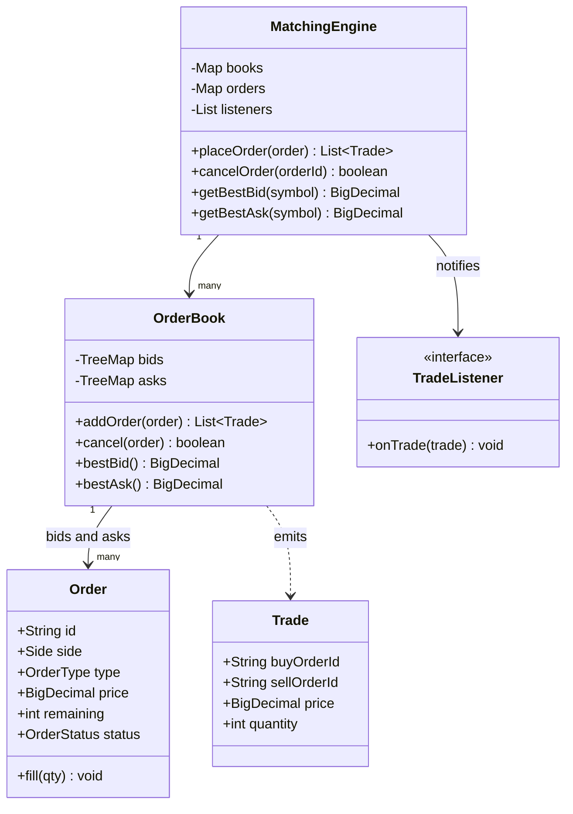

An order matching engine question is really a data-structure question wearing a finance costume — the entire design lives or dies on choosing the right structure for "give me the best price, in arrival order, fast" under heavy concurrent load.

## Requirements

### Functional

- `placeOrder(order)` supports `LIMIT` and `MARKET`, `BUY` and `SELL`, for a given symbol.
- Each symbol has its own independent order book with separate buy (bid) and sell (ask) sides.
- Matching uses **price-time priority**: best price first, ties broken by earliest arrival (FIFO).
- A `BUY` matches a resting `SELL` when `buyPrice >= sellPrice`; the execution price is the resting (maker) order's price, not the incoming (taker) order's price.
- Partial fills are supported — an unfilled remainder of a `LIMIT` order rests in the book; an unfilled `MARKET` order remainder is cancelled, never rests.
- `cancelOrder(orderId)` removes a resting order; every match publishes a `Trade` to subscribers.
- Modifying an order (price or quantity) is implemented as cancel-then-replace, not an in-place update — the replacement order gets a new timestamp and forfeits the original's time priority.

### Non-functional and assumptions

- Many symbols, each with an independent book — AAPL and TSLA orders must never contend for the same lock.
- Matching must be deterministic and reproducible for the same sequence of inputs (important for audit and replay).
- Settlement, clearing, margin, and network/FIX protocol are explicitly out of scope.
- Cancellation should ideally be O(1); with real order flow, cancels vastly outnumber fills.

### Clarifying questions to ask

> [!TIP]
> Ask about the threading model early — "one thread per symbol, or shared locking?" — because the answer changes the entire concurrency section and is one of the most senior-signalling questions you can ask in this problem.

- Are stop orders, iceberg orders, or time-in-force flags (IOC/FOK/GTC) in scope, or purely LIMIT/MARKET for now?
- Does a market order need to fully fill or partially fill-and-cancel the remainder?
- Is determinism/replayability a hard requirement (as in a real exchange), or is best-effort concurrency acceptable?
- How many symbols and how much order volume per symbol — does a single thread per symbol actually scale?
- Do we need to expose incremental book updates (market data feed) or only trade executions?

## Core objects

| Class | Responsibility | Key fields/methods |
|---|---|---|
| `MatchingEngine` | Orchestrator, routes an order to the right symbol's book | `books`, `placeOrder(order)`, `cancelOrder(id)` |
| `OrderBook` | One symbol's bids and asks with matching logic | `bids`, `asks`, `addOrder(order) -> List<Trade>` |
| `Order` | Identity plus mutable remaining quantity | `side`, `type`, `price`, `remaining`, `fill(qty)` |
| `Trade` | Result of one match | `buyOrderId`, `sellOrderId`, `price`, `quantity` |
| `TradeListener` | Observer for executions (market data, risk, persistence) | `onTrade(trade)` |
| `OrderStatus` | Lifecycle enum | `NEW, PARTIALLY_FILLED, FILLED, CANCELLED, REJECTED` |

## Class design



## Key design decisions

### Sorted price levels plus a FIFO queue per level, not a single sorted list of orders

`OrderBook` uses a `TreeMap<BigDecimal, Deque<Order>>` for each side — the map gives O(log n) access to the best price level, and the FIFO queue inside each level gives O(1) access to the earliest order at that price. Because `TreeMap` orders and de-duplicates keys with `compareTo` (never `equals`), price levels merge correctly — `150.50` and `150.5` resolve to the same level, which a `HashMap` keyed on `BigDecimal` (whose `equals` is scale-sensitive) would wrongly split into two. The rejected alternative — one flat sorted list of all orders — would need O(n) or O(log n + k) work just to find "all orders at the best price, in arrival order", conflating two different priorities (price, then time) into one structure.

```text
              ASKS                              BIDS
   price      queue (FIFO)             price      queue (FIFO)
   151.00  -> [o7, o9]                 150.00  -> [o2, o5]     <- best bid
   150.50  -> [o3]        <- best ask   149.50  -> [o1]

   spread = bestAsk - bestBid = 150.50 - 150.00 = 0.50
```

### Maker's price, not taker's price, as the execution price

When an incoming order crosses the spread, the trade executes at the **resting** order's price — the maker set the price by resting in the book; the taker (the incoming order) accepts that price to get immediate execution. The rejected alternative — executing at the taker's price — would let an aggressive buyer effectively overpay the seller's ask by their own bid price, which is neither how real exchanges work nor fair to the resting order that provided liquidity first.

A worked example makes this concrete. The book above shows `o3` resting at ask 150.50 x 100. An incoming `BUY LIMIT 150.50 x 150` arrives:

| Step | Result |
|---|---|
| Crosses? | `150.50 >= 150.50` → yes |
| Match | 100 @ 150.50 → `Trade(o3, incoming, 150.50, 100)`; `o3` is now `Filled` |
| Ask level | Empty, removed from `_asks` |
| Remainder | 50 units, `LIMIT` → rests as a new bid at 150.50 |
| Outcome | 1 trade published; book now shows best bid 150.50 x 50, no asks |

The trade prints at 150.50 — `o3`'s price — even though the incoming order was willing to pay up to 150.50 too; if the book's best ask had been 150.25, the trade would still print at 150.25, the maker's price, not the taker's limit.

| Concern | Choice | Reason |
|---|---|---|
| Price ordering | `TreeMap<BigDecimal, Deque<Order>>` | O(log n) best price, ordered walk for multi-level sweeps |
| Time priority | FIFO queue per level | O(1) head access, fairness at equal price |
| Execution price | Resting (maker) order's price | Matches real exchange semantics; rewards liquidity providers |

### Single-writer-per-symbol, not shared locking across the whole book

Each symbol's `OrderBook` is owned and mutated by exactly one thread (or one single-threaded event loop fed by a lock-free ring buffer), so matching for AAPL never contends with matching for TSLA, and — critically — matching within one symbol never needs a lock at all. The rejected alternative — a shared lock protecting one giant multi-symbol book, or even one lock per `OrderBook` accessed by many threads — adds synchronization overhead to the hottest possible code path and risks non-deterministic fill ordering if two threads' operations interleave differently on different runs.

## Implementation

```java
public enum Side { BUY, SELL }
public enum OrderType { LIMIT, MARKET }

public class Order {
    private final String id;
    private final Side side;
    private final OrderType type;
    private final BigDecimal price;
    private int remaining;

    public Order(String id, Side side, OrderType type, BigDecimal price, int quantity) {
        this.id = id;
        this.side = side;
        this.type = type;
        this.price = price;
        this.remaining = quantity;
    }

    public void fill(int qty) { remaining -= qty; }
    public boolean isFilled() { return remaining == 0; }

    public String getId() { return id; }
    public Side getSide() { return side; }
    public OrderType getType() { return type; }
    public BigDecimal getPrice() { return price; }
    public int getRemaining() { return remaining; }
}

public record Trade(String buyOrderId, String sellOrderId, BigDecimal price, int quantity) { }

public class OrderBook {
    // Bids sorted high-to-low so firstEntry() is the best (highest) bid; asks natural low-to-high.
    private final NavigableMap<BigDecimal, Deque<Order>> bids = new TreeMap<>(Comparator.reverseOrder());
    private final NavigableMap<BigDecimal, Deque<Order>> asks = new TreeMap<>();

    public List<Trade> addOrder(Order order) {
        List<Trade> trades = new ArrayList<>();
        NavigableMap<BigDecimal, Deque<Order>> opposite = order.getSide() == Side.BUY ? asks : bids;

        while (order.getRemaining() > 0 && !opposite.isEmpty()) {
            Map.Entry<BigDecimal, Deque<Order>> best = opposite.firstEntry(); // asks ascending, bids descending
            BigDecimal bestPrice = best.getKey();
            if (!crosses(order, bestPrice)) break;

            Deque<Order> queue = best.getValue();
            while (order.getRemaining() > 0 && !queue.isEmpty()) {
                Order resting = queue.peekFirst();
                int qty = Math.min(order.getRemaining(), resting.getRemaining());
                order.fill(qty);
                resting.fill(qty);

                String buyId = order.getSide() == Side.BUY ? order.getId() : resting.getId();
                String sellId = order.getSide() == Side.BUY ? resting.getId() : order.getId();
                trades.add(new Trade(buyId, sellId, bestPrice, qty)); // maker's price

                if (resting.isFilled()) queue.pollFirst();
            }
            if (queue.isEmpty()) opposite.pollFirstEntry();
        }

        if (order.getRemaining() > 0 && order.getType() == OrderType.LIMIT) addToBook(order);
        // MARKET orders never rest; any unfilled remainder is simply dropped
        return trades;
    }

    private static boolean crosses(Order order, BigDecimal bestOppositePrice) {
        if (order.getType() == OrderType.MARKET) return true;
        // BigDecimal comparison must use compareTo, never equals.
        return order.getSide() == Side.BUY
            ? order.getPrice().compareTo(bestOppositePrice) >= 0
            : order.getPrice().compareTo(bestOppositePrice) <= 0;
    }

    private void addToBook(Order order) {
        NavigableMap<BigDecimal, Deque<Order>> book = order.getSide() == Side.BUY ? bids : asks;
        book.computeIfAbsent(order.getPrice(), p -> new ArrayDeque<>()).addLast(order); // append preserves time priority
    }
}
```

## Concurrency and thread safety

> [!DANGER]
> Locking a shared order book from multiple threads is a classic wrong answer here. It is not just slower — it is a **correctness** risk: if two threads' order submissions can interleave in different orders on different runs, the resulting sequence of fills is non-deterministic, which is unacceptable for an exchange that must be able to replay and audit exactly what happened.

The standard production shape (used by real exchanges, e.g. the LMAX Disruptor architecture) is:

- **Single-writer per symbol** — one dedicated thread (or single-threaded event loop) owns each `OrderBook` and is the only thread that ever mutates it, consuming incoming orders from a lock-free ring buffer or queue.
- **No locks inside the matching loop** — because only one thread ever touches a given book, `addOrder` needs zero synchronization internally; this removes lock overhead from the hottest path in the entire system.
- **Different symbols scale horizontally** — AAPL's thread and TSLA's thread never share state, so throughput scales by adding more symbol-owning threads/cores, not by fighting over one lock.
- **Determinism for free** — a single writer processing orders in a fixed sequence guarantees the exact same input sequence always produces the exact same fills, which is what makes replay and audit possible.

Cancellation today is O(n) within a price level (`queue` search-and-remove); production systems store a `Map<String, OrderNode>` pointing at each order's node in an intrusive doubly-linked list per level, so a cancel is an O(1) unlink — worth naming since cancels typically outnumber fills by a wide margin in real markets.

## Extending the design

| New requirement | Where it plugs in | Why the design allows it |
|---|---|---|
| Order modification | Implemented as `cancel(orderId)` followed by `placeOrder(newOrder)` with a fresh timestamp | Reuses the two existing operations instead of an in-place mutation that would need to reorder a queue mid-level |
| Stop-loss orders | Separate `TreeMap<BigDecimal, List<Order>>` keyed on trigger price; check the last traded price after each trade and convert triggered stops into `MARKET`/`LIMIT` orders | Keeps triggering logic out of the hot matching loop entirely |
| Iceberg orders (only part of quantity visible) | `Order` gains a `displayQuantity`; the book only shows/matches the visible slice, refreshing from the hidden remainder after each fill | `addOrder`'s fill loop already operates on `remaining`; only the visible slice changes |
| IOC / FOK time-in-force | Add a `TimeInForce` field checked at the end of `addOrder` — IOC cancels the remainder instead of resting; FOK pre-scans for sufficient liquidity before executing anything | The existing "unfilled remainder" branch is exactly where these rules plug in |
| O(1) cancellation | Store a `Map<String, OrderNode>` per book; cancel unlinks the node directly | Today's `Deque<Order>` per level swaps in for an intrusive doubly-linked list holding node handles |
| Market data / book depth feed | A second `TradeListener`-style hook emitting incremental price-level deltas, not just trades | Trade publication is already an Observer hook; deltas are the same mechanism applied to book state |

> [!NOTE]
> "How do you make this thread safe" and "how do you add stop orders" are the two most common follow-ups. Both answers reduce to the same principle: keep the matching loop itself untouched and add the new behaviour as a layer around it (a separate trigger structure for stops, a dedicated single-writer thread for concurrency) rather than complicating `addOrder` directly.

## Cheat sheet

- `TreeMap<BigDecimal, Deque<Order>>` gives price priority from the map, time priority from the FIFO queue — one structure, two priorities.
- Execution price is always the **resting (maker)** order's price, never the incoming (taker) order's price.
- `MARKET` orders never rest in the book — any unfilled remainder is cancelled outright.
- `LIMIT` orders rest for their unfilled remainder after matching what they can.
- Price-time priority: sweep price levels best-first; within a level, FIFO by arrival.
- Single-writer-per-symbol is the standard concurrency model — no locks in the matching loop, deterministic replay, symbols scale independently.
- Cancellation should be O(1) via a stored node handle — cancels outnumber fills in real markets.
- Stop orders and iceberg orders are both handled *around* the matching loop, not inside it.

## Common mistakes

| Mistake | Fix |
|---|---|
| Executing at the taker's (incoming) price instead of the maker's | Trade price is always the resting order's price |
| Letting a `MARKET` order rest in the book when partially unfilled | Market orders always cancel their remainder, never rest |
| One flat sorted list of all orders regardless of price level | Use price levels (map) + FIFO queue per level for O(1) time-priority access |
| A global lock across all symbols | Isolate each symbol's book — single-writer or per-symbol lock, never shared |
| O(n) cancellation accepted as "good enough" | Store a node handle per order for O(1) removal |
| Ignoring determinism when discussing concurrency | Say explicitly why single-writer gives reproducible fills for audit/replay |

## Summary

An order matching engine's design is really its data structure: a `TreeMap` of price levels, each holding a FIFO queue, gives price-time priority in one structure with O(log n) best-price access and O(1) time-priority access within a level. Matching always executes at the resting order's price, market orders never rest, and stop/iceberg/time-in-force features are additions layered around the core loop rather than changes to it. The concurrency model that real exchanges use — single-writer per symbol, no locks in the matching loop — is not just a performance optimisation; it is what makes fills deterministic and therefore auditable and replayable, which a shared-lock design cannot guarantee.

## Top Interview Questions

### Q1. Why use a sorted map of price levels with a FIFO queue per level, instead of one big sorted list of individual orders?

Matching needs two independent priorities at once: price (best price first) and time (earliest arrival first, among orders at the same price). A `TreeMap<BigDecimal, Deque<Order>>` gives O(log n) access to the best price level directly from the map's ordering, and O(1) access to the earliest order at that price from the queue's head — a flat sorted list of all individual orders would need to encode both price and arrival time in one comparison key, and even then would not give O(1) access to "all the orders at this exact price, in order" the way a dedicated queue per level does.

### Q2. Why does a trade execute at the resting order's price rather than the incoming order's price?

The resting order is the one that already committed to a price by sitting in the book, providing liquidity for others to trade against — this is the "maker". The incoming order that crosses the spread to match against it is the "taker", accepting the maker's already-published price in exchange for immediate execution rather than waiting in the book itself. If trades executed at the taker's price instead, an aggressive buyer with a high limit price could effectively force a seller to sell at a worse (higher, to the seller's benefit, but not what the seller resting at a lower price actually asked for) or arbitrary price — maker-price execution is both the real-world convention and what keeps the resting order's stated intent (the price it was willing to trade at) honoured.

### Q3. What happens to a market order that cannot be fully filled by the available liquidity?

Whatever quantity the market order was able to match against resting limit orders is filled and generates trades as normal; any remaining unfilled quantity is simply cancelled — it never rests in the book waiting for future liquidity, because a market order's entire premise is "execute immediately at whatever price is available", not "wait for a better moment". This is a deliberate asymmetry from limit orders: a limit order's unfilled remainder rests because the trader specified a price they are willing to wait for, while a market order's trader specified no such price, so waiting is not a meaningful option for it.

### Q4. Why is single-writer-per-symbol the standard concurrency model for exchange matching engines, rather than locking a shared order book?

A shared lock does solve mutual exclusion, but it introduces two problems that matter specifically for an exchange: it adds synchronization overhead to the single hottest code path in the whole system (every order touches the lock), and it makes fill ordering non-deterministic across runs if the operating system happens to schedule threads differently — two submissions arriving at "the same time" from different threads can interleave in different orders on different executions. Giving each symbol's book to exactly one dedicated thread (fed by a queue or lock-free ring buffer) means the matching loop itself needs zero internal synchronization, is provably deterministic for a given input sequence (essential for audit and replay), and lets throughput scale by adding more symbol-owning threads rather than fighting over a shared lock.

### Q5. How would you make order cancellation O(1) instead of the O(n) queue scan shown in the base implementation?

Maintain a `Map<String, OrderNode>` alongside each price level's order collection, using an intrusive doubly-linked list instead of a plain `ArrayDeque<Order>` for the level itself. When an order is placed and rests in the book, store the node reference created when it was linked in; `cancel(orderId)` then looks up that node directly and unlinks it in O(1), rather than scanning the level's queue looking for a matching order ID. This matters in practice because real order flow sees far more cancellations than fills — many trading strategies place and cancel orders continuously to probe the book or adjust position, so cancellation performance is at least as important as match performance.

### Q6. How would you add stop-loss orders without complicating the core matching loop?

A stop order is fundamentally different from a resting limit/market order — it is a *trigger*, not a standing offer to trade, so it does not belong in the bid/ask price-level structure at all. Keep stop orders in a separate structure (e.g. `TreeMap<BigDecimal, List<Order>>` keyed on trigger price), and after every trade executes, check whether the last traded price has crossed any stop order's trigger price; any triggered stop is then converted into a regular `MARKET` (or `LIMIT`) order and submitted through the normal `addOrder` path. This keeps the hot matching loop completely unaware that stop orders exist — the triggering check is an additional step that runs after a trade, not a modification to how trades themselves are computed.

### Q7. What is the difference between IOC, FOK and GTC time-in-force, and where do they plug into the design?

GTC (good-til-cancelled) is the default behaviour already implemented — an unfilled limit order remainder simply rests in the book. IOC (immediate-or-cancel) fills whatever it can immediately and cancels the remainder instead of resting, essentially applying the market order's "never rest" rule to a limit order. FOK (fill-or-kill) is stricter still — it requires the *entire* order to be fillable immediately, or none of it executes at all, which requires a pre-scan of available opposite-side liquidity before committing to any matches (unlike IOC, which can partially fill and then cancel the rest). All three plug into the same place: the check at the end of `addOrder` that currently decides whether an unfilled limit order remainder rests — a `TimeInForce` field on the order changes what happens at that decision point, and FOK additionally requires a liquidity check before the matching loop begins mutating anything.

### Q8. Two orders arrive at what looks like "the same instant" from different network connections. How does price-time priority resolve which one matches first, and why does this require care in a concurrent system?

Price-time priority is defined in terms of the order in which the matching engine actually *processes* the two orders, not the wall-clock instant they were sent from the client's perspective — network latency, jitter, and even which server-side thread happens to pick each one up first can all affect which one is considered to have "arrived" first. This is precisely why the single-writer-per-symbol model matters: once both orders reach the one thread responsible for that symbol's book, they are processed strictly sequentially in whatever order that thread's input queue delivered them, giving a well-defined, reproducible answer to "which arrived first" — a shared-lock model with multiple threads racing to acquire it would make this ordering effectively arbitrary and non-reproducible across runs.

### Q9. How would you publish market data (order book depth, not just executed trades) efficiently?

Use the same Observer mechanism already in place for trade publication, but add a second stream for book-state changes: rather than sending a full snapshot of the entire book on every single order, publish incremental deltas (a price level's quantity increased/decreased/disappeared) as they happen, alongside periodic full snapshots (e.g. once a second, or on subscriber connect). Subscribers reconstruct the current book state by applying deltas on top of the most recent snapshot they have, which is dramatically cheaper in bandwidth and CPU than serializing and transmitting the entire book on every change — this snapshot-plus-deltas pattern is standard for any high-frequency state that many subscribers need to stay current on.

### Q10. Why does determinism matter for an order matching engine, and what would break if the design were only "probably correct most of the time"?

Financial regulators and exchange operators need to be able to reconstruct exactly what happened during any trading session — given the same sequence of order submissions, replaying them must produce the exact same sequence of trades and fills, both for auditing disputed trades and for testing/debugging the engine itself against historical data. A design where concurrent access to a shared book could interleave differently across runs (even if each individual run is "correct" in isolation) would make two replays of supposedly the same input produce different trade histories, which is not just an engineering inconvenience but a serious compliance and trust problem for a real exchange — this is the deeper reason single-writer-per-symbol is the industry standard, beyond pure performance.

### Q11. How would you validate risk (buying power, position limits) without slowing down the matching loop?

Perform pre-trade risk checks in `MatchingEngine.placeOrder`, *before* the order is handed to `OrderBook.addOrder` — checking the trader's available buying power, existing position limits, and price collars (rejecting orders priced unreasonably far from the last traded price) as a fast, separate validation step. This keeps the matching loop itself focused purely on price-time priority matching with no business-rule branching inside it, and means a rejected order due to a risk check never even reaches the book — it is turned away before it could affect price levels, queue ordering, or any other resting order's state.

### Q12. How would iceberg orders (only a portion of the total quantity visible in the book) change the `addOrder` implementation?

An iceberg order adds a `displayQuantity` alongside its total `remaining` quantity; only `displayQuantity` worth is actually placed as a visible resting order in the book's queue at any given time, matching normally against incoming orders like any other resting order. When the visible slice is fully filled, instead of removing the order entirely, the book refreshes it with the next slice from the hidden remainder (typically going to the *back* of the time-priority queue at that price level, since it is functionally a new arrival) until the entire hidden quantity is exhausted. The core `addOrder` fill loop does not need to change at all — it already operates on `Order`'s `remaining` quantity and calls `fill(qty)` — the change is entirely in what "resting in the book" means for this order type and in an extra refresh step triggered when the visible slice hits zero.
