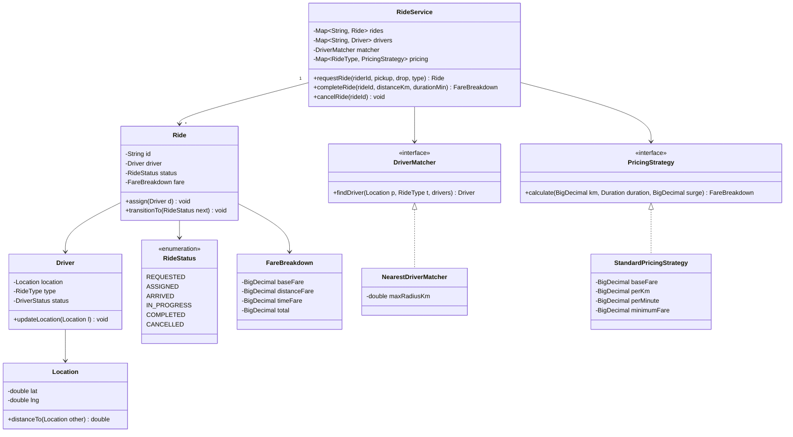

A ride-hailing system chains three orderly problems: match a rider to a nearby available driver, walk that ride through a strict lifecycle, and price it. The same "find the nearest available resource, hand it a payload, track it to completion" machinery underneath generalizes well past rides — the local-delivery variant at the end of this page reuses it almost unchanged.

## Requirements

### Functional

- A rider requests a ride with `(riderId, pickup, drop, rideType)`; the system matches the nearest **available** driver of that ride type within a max radius.
- If no driver is found within radius, the request fails with a clear, specific reason.
- Ride lifecycle: `REQUESTED -> ASSIGNED -> ARRIVED -> IN_PROGRESS -> COMPLETED`; any pre-start state can move to `CANCELLED`.
- Invalid transitions are rejected outright — you cannot complete a ride that never started, or re-assign a completed one.
- Fare = `base + perKm * distance + perMinute * duration`, floored at a minimum fare, then multiplied by a surge factor; each ride type has its own pricing configuration.
- A driver becomes available again the instant a ride completes or is cancelled.

### Non-functional and assumptions

- Single process, in-memory design for the interview; straight-line distance is an acceptable stand-in for real routing/ETA.
- Payment gateway integration, driver ratings, and a real pooling algorithm are explicitly out of scope — fare calculation only.
- Assume single-threaded matching as a starting point, then be ready to defend it under concurrent load.
- Persistence and distributed matching across regions are named as future work, not built here.

### Clarifying questions to ask

> [!TIP]
> Ask "how do we find nearby drivers — a real geo index or simple distance?" early. Answering "simple straight-line distance for now" is the correct scope-setting move for an interview — it lets you build a clean `DriverMatcher` abstraction first and discuss the geo-index swap as a named follow-up, rather than over-engineering from the start.

- Is this single-city and in-memory, or does it need to reason about distributed matching across regions?
- How many ride types exist, and does each need a genuinely different pricing formula, or just different constants?
- Who can cancel, and up to which state — only before the ride starts, or any time before completion?
- Does an external service push driver location updates, or does this system simulate movement itself?
- Do we need to handle two riders matching to the same driver concurrently, or is that explicitly out of scope for a first pass?

## Core objects

| Class | Responsibility | Key fields/methods |
|---|---|---|
| `RideService` | Orchestrator — the only API surface callers touch | `requestRide`, `driverArrived`, `startRide`, `completeRide`, `cancelRide` |
| `Ride` | Aggregate root; owns lifecycle state and its validity | `status`, `driver`, `fare`, `transitionTo(status)` |
| `Driver` | An actor with location and availability | `location`, `type`, `status` (AVAILABLE/ON_TRIP/OFFLINE) |
| `Location` | Value object; distance between two points | `lat`, `lng`, `distanceTo(other)` |
| `DriverMatcher` | Strategy — how a driver is selected | `findDriver(pickup, type, drivers) -> Driver` |
| `PricingStrategy` | Strategy — how a ride type is priced | `calculate(distanceKm, durationMin, surge) -> FareBreakdown` |
| `FareBreakdown` | Result object of a pricing calculation | `baseFare`, `distanceFare`, `timeFare`, `total` |

## Class design



**State transition table**

| From | Allowed to |
|---|---|
| `REQUESTED` | `ASSIGNED`, `CANCELLED` |
| `ASSIGNED` | `ARRIVED`, `CANCELLED` |
| `ARRIVED` | `IN_PROGRESS`, `CANCELLED` |
| `IN_PROGRESS` | `COMPLETED` |
| `COMPLETED` | — |
| `CANCELLED` | — |

## Key design decisions

### 1. The ride lifecycle is an explicit state machine, not scattered flags

`Ride.transitionTo(next)` checks a single `ALLOWED.get(status)` lookup table before mutating `status` — there is exactly one place a transition can be accepted or rejected.

> [!KEY]
> Rejected alternative: independent booleans (`isAssigned`, `hasArrived`, `isStarted`, `isCompleted`) checked ad hoc wherever a status question comes up. Booleans like these can represent impossible combinations (`isCompleted && !isStarted`) that a transition table structurally forbids.

### 2. Fare formula behind a Strategy, keyed by ride type

`PricingStrategy.calculate(distanceKm, duration, surge)` isolates money math entirely from ride orchestration; `RideService` just looks up the strategy for the ride's type in a `Map`. Pattern: **Strategy**. Rejected alternative: an `if/else` or `switch` on ride type inline inside `completeRide` — every new ride type or pricing tweak means editing the orchestrator, and a bug in one ride type's formula risks a merge conflict with another's.

### 3. Driver selection behind a Strategy, not a hardcoded scan

`DriverMatcher.findDriver` is the only thing `RideService.requestRide` calls to pick a driver — today a linear nearest-in-radius scan, tomorrow a geo-indexed lookup. Rejected alternative: the scan logic written directly inside `requestRide`; swapping in a geo index later would mean touching the orchestrator instead of adding one new class.

| Concern | Pattern | Why |
|---|---|---|
| Fare per ride type | Strategy | New ride type = new class, zero edits elsewhere |
| Driver selection | Strategy | Nearest scan today, geo-indexed lookup tomorrow, same interface |
| Ride lifecycle | State machine | Transitions are rule-heavy; a table beats a `switch` |
| Status notifications | Observer | Rider/driver notified without `RideService` naming its consumers |

### 4. Status changes are announced, not hand-delivered

`Ride` (or `RideService`) raises a status-changed event on every transition; push notifications, SMS, and analytics each subscribe independently. Rejected alternative: `RideService` calling a `NotificationService` by name inside every lifecycle method — that couples the orchestrator to every current and future notification channel.

## Implementation

```java
public interface DriverMatcher {
    Driver findDriver(Location pickup, RideType type, Collection<Driver> drivers);
}

public interface PricingStrategy {
    FareBreakdown calculate(BigDecimal distanceKm, Duration duration, BigDecimal surgeMultiplier);
}

public enum RideStatus { REQUESTED, ASSIGNED, ARRIVED, IN_PROGRESS, COMPLETED, CANCELLED }
```

```java
public class Ride {
    private static final Map<RideStatus, Set<RideStatus>> ALLOWED = new EnumMap<>(Map.of(
        RideStatus.REQUESTED,   EnumSet.of(RideStatus.ASSIGNED, RideStatus.CANCELLED),
        RideStatus.ASSIGNED,    EnumSet.of(RideStatus.ARRIVED, RideStatus.CANCELLED),
        RideStatus.ARRIVED,     EnumSet.of(RideStatus.IN_PROGRESS, RideStatus.CANCELLED),
        RideStatus.IN_PROGRESS, EnumSet.of(RideStatus.COMPLETED),
        RideStatus.COMPLETED,   EnumSet.noneOf(RideStatus.class),
        RideStatus.CANCELLED,   EnumSet.noneOf(RideStatus.class)
    ));

    private final String id = UUID.randomUUID().toString();
    private final RideType type;
    private Driver driver;
    private RideStatus status = RideStatus.REQUESTED;
    private FareBreakdown fare;

    public Ride(RideType type) {
        this.type = type;
    }

    public void assign(Driver driver) {
        transitionTo(RideStatus.ASSIGNED);
        this.driver = driver;
    }

    public void setFare(FareBreakdown fare) { this.fare = fare; }

    public void transitionTo(RideStatus next) {
        if (!ALLOWED.get(status).contains(next)) {
            throw new IllegalStateException("Cannot move ride from " + status + " to " + next);
        }
        status = next;
    }

    public String getId() { return id; }
    public RideType getType() { return type; }
    public Driver getDriver() { return driver; }
    public RideStatus getStatus() { return status; }
    public FareBreakdown getFare() { return fare; }
}
```

```java
public class RideService {
    private final Map<String, Ride> rides = new HashMap<>();
    private final DriverMatcher matcher;
    private final Map<RideType, PricingStrategy> pricing;

    public RideService(DriverMatcher matcher, Map<RideType, PricingStrategy> pricing) {
        this.matcher = matcher;
        this.pricing = pricing;
    }

    public Ride requestRide(String riderId, Location pickup, Location drop, RideType type, Collection<Driver> drivers) {
        Driver driver = matcher.findDriver(pickup, type, drivers);
        if (driver == null) {
            throw new IllegalStateException("No driver available nearby");
        }

        Ride ride = new Ride(type);
        ride.assign(driver);
        driver.setStatus(DriverStatus.ON_TRIP);
        rides.put(ride.getId(), ride);
        return ride;
    }

    public FareBreakdown completeRide(String rideId, BigDecimal distanceKm, Duration duration, BigDecimal surge) {
        Ride ride = rides.get(rideId);
        ride.transitionTo(RideStatus.COMPLETED);
        FareBreakdown fare = pricing.get(ride.getType()).calculate(distanceKm, duration, surge);
        ride.setFare(fare);
        ride.getDriver().setStatus(DriverStatus.AVAILABLE);
        return fare;
    }
}
```

## Concurrency and thread safety

The interview's real question is: two riders request at nearly the same moment, both matching to the same nearest driver — how do you avoid double-assigning them?

1. **Coarse lock around match-and-flip.** Wrap "find driver" and "set driver to `ON_TRIP`" in a single lock inside `RideService`. Simple, correct, but every request in the system serializes on one lock.
2. **Per-driver atomic claim.** Scan for candidates without a lock, then claim the winner with a `compareAndSet` on an `AtomicReference<DriverStatus>` for that driver (or a `ConcurrentHashMap`-backed reservation). If the claim fails, another request won — retry against the next-nearest candidate.
3. **Geo-cell partitioning.** Partition drivers by geohash cell and lock only the cell being searched, so requests in different parts of the city never contend at all.

> [!WARNING]
> Find-and-reserve must be a single atomic step. If you read "driver is available," return control to the caller, and only *then* flip the status, two concurrent requests can both observe "available" and both proceed — the classic check-then-act race. The claim itself, not just the search, has to be atomic.

A linear scan across all drivers also stops scaling well past a few thousand drivers; the fix is entirely inside `DriverMatcher` — swap the scan for a geohash/QuadTree/S2-cell index that only examines drivers in nearby cells. `RideService` and everything else is untouched, because it only ever calls the interface.

## Extending the design

| New requirement | Where it plugs in | Why the design allows it |
|---|---|---|
| A new ride type (e.g. UberBlack) | Register another `PricingStrategy` implementation, keyed by the new enum value | `RideService` never branches on ride type itself |
| Real surge pricing | Promote a `Function<Location, Double>` to a `SurgeProvider` interface, snapshotted onto the ride at request time | Pricing already takes a surge multiplier as an input, not a hardcoded constant |
| Driver never arrives | A per-state timeout keyed by ride id; on expiry, auto-cancel with a specific reason and re-run matching excluding that driver | Cancellation and re-matching are already first-class, independently callable operations |
| Millions of drivers | Replace the linear scan inside `NearestDriverMatcher` with a geohash/QuadTree index | Matching is already isolated behind `DriverMatcher` |
| Notify rider/driver on every status change | `Ride` raises a status-changed event; push/SMS/analytics subscribe independently | Status transitions already funnel through one method (`transitionTo`) |
| Dispatch a payload other than a person (described next) | Reuse `DriverMatcher`/lifecycle shape with a different aggregate and payload | The matching-and-lifecycle skeleton doesn't know it's moving a rider specifically |

### Same dispatch machinery, different payload: a local delivery service

A Gopuff-style local delivery service — rapid delivery of convenience-store goods from 500+ micro distribution centers (DCs) — solves the identical shape of problem with a different payload: instead of matching a rider to a driver, you match an **order** to the nearest **distribution center that has the item in stock**, then dispatch a courier to deliver it.


The API surface mirrors `RideService` one-for-one: query availability, then place an order.


**Querying availability** replaces `DriverMatcher.findDriver` with a matcher over DCs and their `Inventory`, rather than drivers and their location:


**Placing an order** needs the same "claim atomically" discipline this page already covers for driver matching — reserving inventory across two data stores with a distributed lock is the tempting-but-risky answer (it can deadlock or drift inconsistent); a single DB transaction covering the inventory decrement and the order insert is the safer one:


**Making the match traffic-aware** is the delivery-specific deep dive: naive straight-line distance (as used for ride matching) ignores real drive time, and estimating travel time across *every* DC doesn't scale — the workable middle ground is travel-time estimation scoped to only the nearby candidate DCs, the same "don't scan everything, scan the relevant subset" principle behind swapping a linear driver scan for a geo index:


**Scaling the lookup** follows the same playbook as scaling driver matching: push inventory counts into Redis for fast reads instead of hitting the primary DB per query, and partition/replicate the underlying database once a single instance can't keep up with write volume:


> [!NOTE]
> The reusable insight: `DriverMatcher` and `Ride`'s lifecycle state machine don't actually know anything about people. Anywhere you need "find the nearest available resource that satisfies a constraint, reserve it atomically, and track a request through a fixed lifecycle to completion," this same skeleton applies — only the resource type (driver vs. DC), the constraint (ride type vs. item availability), and the payload (a person vs. an order) change.

## Cheat sheet

- Model the ride lifecycle as a state machine with an explicit allowed-transitions table — never independent booleans.
- Fare formula and driver selection are the two axes of change; both become Strategy interfaces.
- Find-and-reserve for a driver must be one atomic step, not a check followed by a separate write.
- A linear driver scan is fine to start with — say so, and name the geo-index swap as the scaling answer.
- Snapshot the surge multiplier onto the ride at request time so the rider is charged what they were quoted.
- Status notifications are Observer, not direct calls from the orchestrator into notification code.
- The same matcher-plus-lifecycle skeleton generalizes to non-ride dispatch problems (delivery, freight, field service).

## Common mistakes

| Mistake | Fix |
|---|---|
| Independent booleans for ride state instead of an enum + transition table | Single `RideStatus` enum, single `Allowed` lookup |
| Pricing formula branching inline on ride type inside the orchestrator | Extract `PricingStrategy`, key by ride type |
| Driver search-and-claim as two separate steps | Make the claim atomic (CAS or a locked scope around both) |
| Treating "no driver found" as an exception thrown deep in matching logic | Surface a clear, specific failure from `requestRide` itself |
| Charging the surge multiplier at completion time, not request time | Snapshot surge onto the ride when it's requested |
| Assuming a linear driver scan is "the design" rather than "the starting point" | Name the geo-index swap explicitly as the scaling story |

## Summary

Ride hailing rewards treating driver selection and fare calculation as two independent Strategy interfaces, and the ride's lifecycle as an explicit state machine rather than a pile of booleans — those three decisions are what keep `RideService` thin and let new ride types, real surge pricing, and a geo-indexed matcher all become additive changes. The concurrency question — atomically claiming a driver so two riders never win the same match — is the one interviewers push hardest on, and the honest answer is a claim, not a lock around everything. The payoff of keeping matching and lifecycle generic is that the exact same skeleton dispatches a delivery order to a distribution center instead of a rider to a driver, with only the payload changing.

## Top Interview Questions

### Q1. Why model the ride lifecycle as an explicit state machine instead of a set of boolean flags?

Boolean flags like `isAssigned`, `hasArrived`, and `isCompleted` can independently be set into combinations that make no physical sense — `isCompleted == true` while `isStarted == false`, for instance — and nothing stops a caller from creating that state by setting the wrong flag at the wrong time. A single `RideStatus` enum plus an explicit `ALLOWED.get(status)` transition table makes illegal transitions a one-line check (`!ALLOWED.get(status).contains(next)`) instead of a set of conditions that have to be kept consistent by convention across every call site that touches ride state.

### Q2. How do you prevent two riders from being matched to the same driver at the same time?

The search for a candidate driver can run without a lock — it's a read. The moment you select a winner, claiming that driver (flipping their status to `ON_TRIP`) has to be a single atomic operation: a compare-and-swap on the driver's status field, or a `ConcurrentHashMap`-based reservation keyed by driver id. If the claim fails because another request already won, retry against the next-nearest candidate rather than failing the whole request outright. The bug to avoid is treating "check available" and "mark unavailable" as two separate steps with a window in between.

### Q3. Why should fare calculation and driver matching each be a Strategy interface instead of methods on `RideService`?

Because they vary independently, for different business reasons — pricing changes when finance adjusts rates or launches a new ride tier, matching changes when the platform adopts a better geo-index or ranking model. If both lived as branching logic inside `RideService`, every pricing tweak would risk touching matching code and vice versa, and every new ride type would mean editing and redeploying the orchestrator. With two interfaces, `RideService` only depends on the abstractions, and each strategy can be unit tested — and swapped — completely independently.

### Q4. How would you extend this design to support surge pricing correctly?

Introduce a `SurgeProvider` with something like `getMultiplier(location, time)`, backed by a formula like active-requests-over-available-drivers per geo-cell, capped to avoid runaway multipliers. The subtle requirement is *when* you read it: snapshot the multiplier onto the ride at request time and store it there, rather than reading a live multiplier again at completion — otherwise a rider could be quoted one surge level and charged a different one if demand shifted mid-ride, which is both a bad experience and, in some jurisdictions, a compliance problem.

### Q5. What happens if a driver never arrives after being assigned?

This needs an explicit timeout mechanism, not silence: schedule a per-ride timer keyed by ride id when a ride enters `ASSIGNED`. If `ARRIVED` hasn't been reached by the deadline, auto-cancel the ride with a specific reason (`DRIVER_TIMEOUT`), release the driver back to `AVAILABLE`, and re-run matching for the rider excluding that driver from candidates. Both cancellation and re-matching already exist as independent operations in this design, so the timeout handler is just composing existing pieces rather than inventing new state-transition logic.

### Q6. Why is "no driver found" surfaced as a specific failure from `requestRide`, rather than a generic exception?

Because the caller (a mobile app, ultimately a human waiting for a ride) needs to distinguish "there is genuinely no supply near you right now" from a system error, and each deserves different UX — one suggests waiting or widening the radius, the other suggests retrying or an apology. Baking this into the matcher's contract (`findDriver` returns `null` on no match, and `requestRide` translates that into a specific, named exception/result) keeps the failure mode explicit and testable, rather than being an incidental side effect of however the search happened to fail.

### Q7. How would a linear driver scan break down at scale, and what replaces it?

A linear scan over every driver, checking distance and availability for each, is O(n) per match request; at a few thousand drivers per city this is fine, but at tens of thousands with requests arriving every second, it becomes the dominant cost. The fix is a spatial index — geohash buckets, a QuadTree, or S2 cells — so a match only examines drivers in the geographic cells actually near the pickup point, turning an O(n) scan into something closer to O(candidates in nearby cells). Critically, this change is entirely internal to `NearestDriverMatcher` (or its replacement); `RideService` and every other class are untouched because they only ever call `DriverMatcher.findDriver`.

### Q8. How would you notify the rider and driver of every ride status change without coupling `RideService` to a specific notification channel?

Have `Ride` (or the transition method itself) raise a status-changed event — `onRideStatusChanged(rideId, from, to)` — through a publisher that any number of `RideStatusObserver` implementations can subscribe to: push notifications, SMS, analytics, a live map update. `RideService` and `Ride` never need to know these consumers exist. This is the same Observer principle used across many of these designs precisely because "who needs to react to this event" is a business decision that changes far more often than "how does the event get raised."

### Q9. How does this design generalize to a local delivery service that dispatches orders instead of rides?

The shape of the problem is identical: find the nearest available resource that satisfies a constraint (a driver with the right ride type vs. a distribution center with the item in stock), reserve it atomically, and track a request through a fixed lifecycle to completion. `DriverMatcher` becomes a matcher over distribution centers and their inventory; `Ride`'s state machine becomes an order's placed-to-delivered lifecycle. The genuinely new problem in the delivery variant is making the match traffic-aware — estimating real drive time to nearby candidates rather than assuming straight-line distance — which is a refinement of the matcher, not a redesign of the dispatch skeleton.

### Q10. Why is reserving inventory across two data stores with a distributed lock the wrong answer, and what's better?

Coordinating a write across two independent data stores with a distributed lock is exposed to partial failure: if the process crashes or the lock expires between the two writes, you can end up with inventory decremented but no order recorded (or the reverse), and recovering from that inconsistently is exactly the kind of bug that surfaces as "sold" items that don't exist. A single database transaction covering both the inventory decrement and the order insert gives you atomicity for free from the database engine, without needing a custom distributed-lock protocol to reason about — simpler and strictly safer for this access pattern.

### Q11. How would you support ride cancellation fees or minimum charges for very short trips?

Extend `PricingStrategy` (or add a sibling `CancellationPolicy`) that inspects how far the ride progressed before cancellation — nothing charged for a cancellation in `REQUESTED`, a small fee once a driver is `ASSIGNED` and has started traveling, a larger one if they've already `ARRIVED`. This slots in cleanly because cancellation is already a distinct, explicit transition (`cancelRide`) rather than being folded into `completeRide` — you can attach fee logic at the exact transition point where the business rule differs, without touching the completion-fare code path at all.

### Q12. What would you change about this design to make ride matching and fare calculation independently testable?

Both are already isolated behind interfaces (`DriverMatcher`, `PricingStrategy`), so unit tests can exercise each directly: feed `NearestDriverMatcher` a hand-built list of drivers and assert which one comes back for a given pickup and radius, with no `RideService` involved; feed `StandardPricingStrategy` fixed `(distanceKm, duration, surge)` tuples and assert the resulting `FareBreakdown`, including boundary cases like exactly-at-minimum-fare. A smaller set of integration tests then exercises `RideService` end to end with fake strategies, to confirm the orchestration itself — not the policies — is correct.
