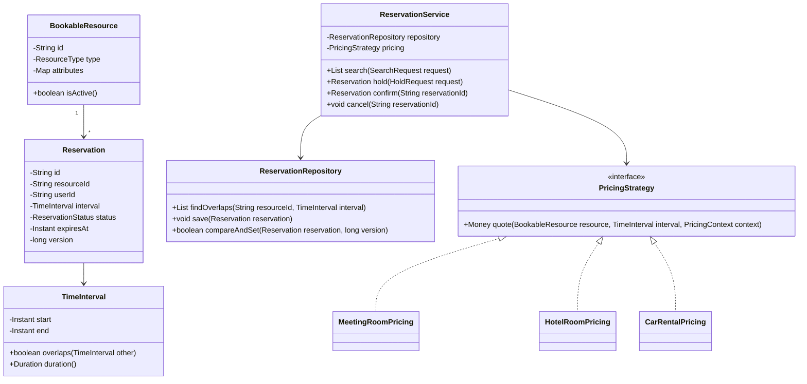
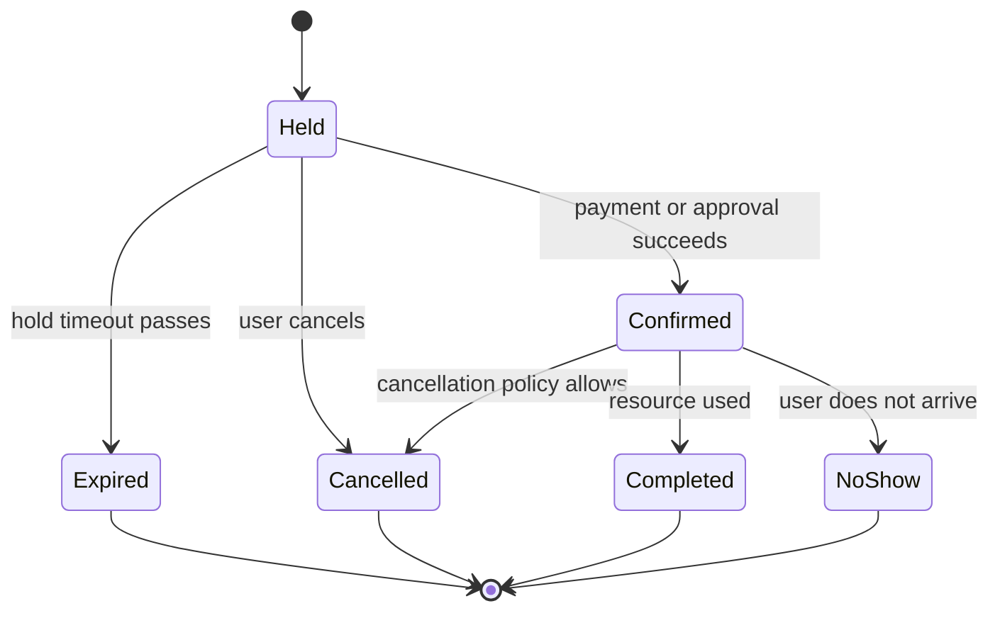

A meeting room booking tool, a hotel reservation engine and a car rental system all reduce to the same core problem: reserve a resource for a time interval without selling the same capacity twice. The domain names differ, but the model is a resource, an interval, a reservation lifecycle and a pricing policy.

## Requirements

### Functional

- Search available resources for a requested interval and optional attributes.
- Place a short-lived hold while the user reviews price or completes payment.
- Confirm a hold, cancel a reservation, expire stale holds, and mark usage as completed or no-show.
- Prevent overlapping confirmed or held reservations for the same exclusive resource.
- Instantiate the same model for meeting rooms, hotel rooms and car rentals through resource attributes and pricing strategies.
- Support recurring bookings as a set of concrete occurrences, each checked for conflicts.

### Non-functional and assumptions

- Intervals are half-open: `[start, end)`, so a booking ending at 10:00 and another starting at 10:00 do not overlap.
- Timestamps are stored as `Instant` in UTC; venue time zone is used for display and local business rules.
- A resource is exclusive by default. Overbooking is possible only when business rules explicitly allow it.
- The persistent store, not only in-memory code, must enforce the no-double-booking guarantee.
- Payment integration is out of scope except for the hold-then-confirm transition.

### Clarifying questions to ask

- Is each resource exclusive, or can capacity be shared among several reservations?
- How long should a hold live before expiring?
- Are recurring bookings in scope, and if so how far ahead should occurrences be materialized?
- What cancellation cutoffs, no-show fees and refund policies apply?
- Do we need overbooking, waitlists or manual admin overrides?
- Which time zone defines "business day" for pricing and cancellation rules?

## Core objects

| Class | Responsibility | Key fields or methods |
|---|---|---|
| `BookableResource` | Entity that can be reserved | `id`, `type`, `attributes`, `active` |
| `ResourceAttribute` | Searchable feature or metadata | `key`, `value` |
| `TimeInterval` | Immutable half-open interval | `start`, `end`, `overlaps(other)` |
| `Reservation` | Entity with lifecycle and interval | `id`, `resourceId`, `userId`, `interval`, `status`, `expiresAt`, `version` |
| `ReservationService` | Orchestrates search, hold, confirm and cancel | `search`, `hold`, `confirm`, `cancel` |
| `ReservationRepository` | Queries and persists reservations | `findOverlaps`, `save`, `compareAndSet` |
| `PricingStrategy` | Domain-specific price calculation | `quote(resource, interval, context)` |
| `AvailabilityPolicy` | Decides whether an overlap blocks booking | `canReserve(resource, interval)` |

## Class design





## One model, three domains

The interview trap is to design three different systems because the nouns are different. Resist that. A hotel room, meeting room and rental car are all bookable resources with attributes, availability windows and pricing rules. The generalized model only needs a resource type and an attribute map or typed metadata object.

| Domain | Resource attributes | Interval meaning | Pricing strategy |
|---|---|---|---|
| Meeting room | Capacity, floor, equipment, location | Start and end times within a day | Hourly rate, minimum duration, after-hours surcharge |
| Hotel room | Room type, bed count, view, occupancy | Check-in date to check-out date | Nightly rate, seasonal multiplier, taxes and fees |
| Car rental | Vehicle class, fuel type, pickup branch, mileage tier | Pickup instant to return instant | Daily rate, mileage charge, insurance add-ons |

> [!KEY]
> Say the generalization explicitly: "the domain-specific part is attributes and pricing; the correctness-critical part is the same interval reservation engine."

This split also keeps search clean. `SearchRequest` contains a `TimeInterval` and filters such as minimum capacity, room type or car class. The search service first filters resources by attributes, then removes any resource with a blocking overlap. Ranking and price display are layered after correctness: it is fine to sort by cheapest or nearest only after the system knows the resource is actually available.

## The double-booking problem

The overlap predicate is the heart of the page and the one line candidates often get wrong. For half-open intervals, a new interval overlaps an existing interval when:

```java
public record TimeInterval(Instant start, Instant end) {
    public TimeInterval {
        if (!start.isBefore(end)) throw new IllegalArgumentException("start must be before end");
    }

    public boolean overlaps(TimeInterval other) {
        return start.isBefore(other.end) && end.isAfter(other.start);
    }
}
```

The predicate `newStart < existingEnd && newEnd > existingStart` catches partial overlap, containment in either direction and identical intervals. It also allows exact adjacency: 09:00-10:00 and 10:00-11:00 do not overlap because the first end is not after the second start.

| Existing interval | New interval | Overlap? | Reason |
|---|---|---|---|
| 09:00-10:00 | 10:00-11:00 | No | Adjacent half-open intervals |
| 09:00-11:00 | 10:00-12:00 | Yes | New start is before existing end |
| 09:00-12:00 | 10:00-11:00 | Yes | New interval is contained |
| 10:00-11:00 | 09:00-12:00 | Yes | Existing interval is contained |
| 09:00-10:00 | 08:00-09:00 | No | New end equals existing start |

> [!WARNING]
> The broken predicate is "new start is between existing start and end". It misses the case where the new interval fully covers an existing booking.

## Enforcing correctness under concurrency

Availability search is a read model; it cannot be the final guarantee. Two users can both search, both see a resource free, and both click reserve. The reservation write path must check overlap and insert the hold atomically.

```java
public Reservation hold(HoldRequest request) {
    TimeInterval interval = request.interval();
    return repository.inTransaction(() -> {
        repository.lockResourceRow(request.resourceId());
        boolean blocked = repository.findOverlaps(request.resourceId(), interval).stream()
            .anyMatch(r -> r.status().blocksAvailability() && r.interval().overlaps(interval));
        if (blocked) throw new IllegalStateException("Resource is no longer available");

        Reservation hold = Reservation.held(
            request.resourceId(), request.userId(), interval, clock.instant().plus(HOLD_TTL));
        repository.save(hold);
        return hold;
    });
}
```

| Enforcement option | How it works | Trade-off |
|---|---|---|
| Pessimistic row lock | Lock the resource or its reservation range while checking and inserting | Simple and safe, but hot resources serialize |
| Optimistic version check | Write only if resource or calendar version is unchanged | Higher throughput, but callers must retry conflicts |
| Database exclusion or unique constraint | Store rejects overlapping intervals for the same resource | Strongest guarantee because every writer is covered |
| In-memory lock only | JVM lock around reservation code | Useful in one process, unsafe once there are multiple app instances |

> [!DANGER]
> A lock in application memory is not a real booking guarantee for a production service with multiple servers. The database must participate, either through row locks, version checks or a constraint that rejects the conflicting write.

For hotels and cars, the "resource" sometimes means a pool rather than one named item. If the hotel sells ten identical deluxe rooms, the availability rule becomes capacity-based: count overlapping confirmed or held reservations for that room type and allow the new booking only if the count stays below capacity. That is still the same overlap problem, but the blocking condition is `overlapCount < capacity` instead of "no overlaps at all".

## Hold, confirm and expiry flow

The hold-then-confirm flow prevents abandoned payment sessions from blocking resources forever. A hold has a short `expiresAt` timestamp, often five to fifteen minutes. Confirming a reservation first verifies that the hold is still active and owned by the caller, then moves it to `Confirmed`. A background job marks expired holds as `Expired`, and the availability query ignores expired or cancelled rows.

```java
public Reservation confirm(String reservationId, String userId) {
    Reservation reservation = repository.findById(reservationId);
    if (!reservation.userId().equals(userId)) throw new SecurityException("wrong user");
    if (reservation.status() != ReservationStatus.HELD) throw new IllegalStateException("not held");
    if (clock.instant().isAfter(reservation.expiresAt())) {
        repository.markExpired(reservationId);
        throw new IllegalStateException("hold expired");
    }
    return repository.updateStatus(reservationId, ReservationStatus.CONFIRMED, reservation.version());
}
```

Cancellation and no-show are policy decisions, not storage decisions. The reservation entity records status and timestamps; a `CancellationPolicy` decides whether the caller gets a full refund, partial refund or no refund. A `NoShowPolicy` can charge a fee or release the resource after a grace period. Overbooking belongs in an explicit `AvailabilityPolicy`, never as an accidental race. Airlines and hotels sometimes overbook because historical no-show rates make it profitable, but that is a deliberate business rule with reporting and customer recovery paths.

## Recurrence, time zones and pricing

Recurring bookings should be expanded into concrete intervals before conflict checking. "Every Monday at 10 for eight weeks" becomes eight `TimeInterval`s, and the hold succeeds only if every occurrence can be reserved. For large or infinite recurrences, materialize a bounded window such as the next six months and require a renewal job. One parent `RecurringReservation` can point to child reservations so cancellation can target one occurrence or the whole series.

Time zones need explicit handling. Store instants in UTC so overlap comparisons are unambiguous. Also store the resource's venue time zone because "9 AM local", "after-hours surcharge" and "free cancellation until 6 PM yesterday" are local business concepts. Daylight saving transitions are a trap: a local time may be skipped or repeated. Convert local requests to instants at the boundary of the system, reject nonexistent local times clearly, and preserve the original local intent for recurring meetings.

> [!TIP]
> A strong production answer names both representations: `Instant` for conflict checks, venue `ZoneId` for user intent and policies.

Pricing stays pluggable. The reservation service asks `PricingStrategy.quote(resource, interval, context)` after it has a candidate resource and before confirmation. Meeting rooms price by hours, hotels by nights and occupancy, cars by days, mileage and add-ons. The reservation engine should not know those formulas; it only stores the quoted amount and policy metadata used at confirmation time.

## Cheat sheet

- Model the core as `BookableResource`, `TimeInterval`, `Reservation` and `ReservationService`.
- Use half-open intervals `[start, end)` so back-to-back bookings do not overlap.
- Correct overlap predicate: `newStart < existingEnd && newEnd > existingStart`.
- Availability search is advisory; the hold write path must recheck conflicts atomically.
- Production correctness needs database participation: row locks, optimistic versions or exclusion constraints.
- Holds need `expiresAt`; expired and cancelled reservations do not block availability.
- Recurring bookings are concrete occurrences plus a parent series object.
- Store UTC instants for comparison and venue time zone for display and business rules.
- Overbooking is a named policy, not a bug hidden in a race condition.
- Pricing is a strategy: hourly meeting room, nightly hotel and daily car rental formulas share one reservation core.

## Common mistakes

| Mistake | Fix |
|---|---|
| Checking only whether the new start lies inside an existing booking | Use `newStart < existingEnd && newEnd > existingStart` |
| Trusting search results as a guarantee | Recheck and insert the hold inside one transaction |
| Using only an in-memory lock in a multi-server deployment | Add database row locks, optimistic versions or exclusion constraints |
| Treating hotel rooms, cars and meeting rooms as unrelated systems | Keep one resource and reservation model with attributes and pricing strategies |
| Letting holds live forever | Add `expiresAt` and an expiry job |
| Comparing local date-times from different time zones | Convert to `Instant` for overlap checks and store `ZoneId` separately |
| Implementing recurring bookings as one giant interval | Materialize each occurrence and conflict-check each one |
| Overbooking accidentally due to race conditions | Make overbooking an explicit `AvailabilityPolicy` with limits and audit trail |

## Summary

A resource-reservation system is an interval-conflict engine with a domain-specific wrapper. Meeting rooms, hotel rooms and rental cars share the same reservation lifecycle, overlap predicate, hold expiry and concurrency problem; only attributes and pricing change. The design succeeds when the database-backed hold path is the source of truth, while search, recurrence, cancellation, no-show and overbooking policies plug into that core without weakening the no-double-booking guarantee.

## Top Interview Questions

### Q1. What is the correct interval-overlap predicate for reservations?

For half-open intervals `[start, end)`, a new reservation overlaps an existing one when `newStart < existingEnd && newEnd > existingStart`. This single predicate handles every real overlap shape: partial overlap at the beginning, partial overlap at the end, one interval containing the other, and identical intervals. It also correctly allows back-to-back bookings, because if one reservation ends exactly when another starts, `newEnd > existingStart` or `newStart < existingEnd` fails at the boundary. The common wrong answer checks only whether the new start lies inside an existing booking, which misses the case where the new booking fully covers an existing booking.

### Q2. Why is availability search not enough to prevent double booking?

Search is only a snapshot. Two users can query at the same time, both see the same meeting room free, and both click reserve. If the write path simply trusts the earlier search result, both reservations can be inserted. The reservation creation path must repeat the overlap check inside the same transaction that creates the hold or confirmed reservation. That transaction must use a real concurrency control mechanism such as a row lock, optimistic version check or database constraint. Search is useful for user experience and narrowing candidates, but the hold insertion is the source of truth. A strong answer says "search is advisory; reserve is authoritative."

### Q3. How would you enforce no overlapping bookings under high concurrency?

I would enforce it at the storage boundary, not only in application code. The simple version is a transaction that locks the resource row, queries overlapping held or confirmed reservations, and inserts the new hold only if none block. An optimistic version approach stores a calendar or resource version and retries if another writer changed it first. The strongest option, where the database supports it, is an exclusion constraint or equivalent that rejects overlapping intervals for the same resource regardless of which application server issued the write. In-memory locks can reduce duplicate work in one process, but they are not sufficient once multiple app instances or manual writes exist.

### Q4. How does the hold-then-confirm flow work, and why is it needed?

A hold reserves availability for a short, bounded period while the user reviews details or completes payment. The hold stores `expiresAt` and blocks other bookings only while its status is active. Confirmation verifies the hold still exists, belongs to the user and has not expired, then moves it to `Confirmed`. A background expiry job marks stale holds as `Expired`, and availability queries ignore expired and cancelled records. Without holds, users can lose a resource between selecting it and paying. Without expiry, abandoned checkouts block real inventory forever. The lifecycle solves both problems by making temporary ownership explicit and time-bounded.

### Q5. How would you generalize the design across meeting rooms, hotels and car rentals?

Use one `BookableResource` entity with a type and searchable attributes, one `TimeInterval` value object, one `Reservation` lifecycle and one `ReservationService`. Domain differences move into attributes and policies. A meeting room has capacity and equipment and prices by hour. A hotel room has room type, occupancy and seasonal nightly rates. A rental car has vehicle class, pickup branch, mileage and insurance add-ons. The overlap check, hold expiry, confirmation and cancellation flow do not change. This is the key interview move: identify the shared model first, then show how domain-specific pricing and filtering plug in without duplicating the reservation engine.

### Q6. How do recurring reservations change the design?

A recurring request should be expanded into concrete occurrences before conflict checking. For example, "every Monday from 10 to 11 for eight weeks" becomes eight `TimeInterval`s, and the system attempts to reserve all eight. The booking should fail or return conflicts if any occurrence is unavailable, unless the product explicitly supports partial success. A parent series object can group the child reservations so users can cancel one occurrence or the entire series. Infinite recurrence should be bounded by a materialization window, such as six months, with renewal later. Treating recurrence as one giant interval is wrong because it blocks every gap between actual meetings.

### Q7. What are the time-zone and daylight-saving pitfalls in reservation systems?

Overlap checks should use `Instant` values in UTC, because instants are globally ordered and unambiguous. User intent and policies, however, are often local: a meeting at 9 AM in the office time zone, hotel check-in date, or cancellation until 6 PM local time. Store the venue `ZoneId` alongside the reservation and convert local input to instants at the boundary. Daylight saving time creates nonexistent local times during spring-forward and repeated local times during fall-back, so the system must reject or disambiguate those cases explicitly. The senior answer is to name both representations and explain which one is used for comparison versus display.

### Q8. How would you handle overbooking?

Overbooking should be an explicit business policy, not an accidental consequence of weak locking. For an exclusive meeting room, the normal capacity is one and any active overlap blocks a new booking. For a hotel room type or rental fleet, capacity may be greater than one, and the policy may intentionally allow reservations above physical capacity by a small percentage based on expected cancellations or no-shows. That policy should live in `AvailabilityPolicy`, be auditable, and have operational recovery paths such as upgrades, refunds or manual reassignment. The data model still records every reservation and interval; only the rule deciding whether an overlap blocks changes.

### Q9. Where does pricing belong in this design?

Pricing belongs behind a `PricingStrategy` or policy interface, not inside the reservation overlap logic. The reservation service can call `quote(resource, interval, context)` after it has a candidate resource and before confirmation, then store the quoted amount and policy version. Meeting rooms may price hourly with after-hours surcharges, hotels nightly with seasonality and occupancy taxes, and rental cars daily with mileage or insurance add-ons. If those formulas are hardcoded into `ReservationService`, every domain change risks breaking the no-double-booking path. Keeping pricing separate preserves a small, trustworthy reservation core and makes new pricing rules additive.

### Q10. What would you monitor in production for a reservation system?

Monitor conflict rates, hold-to-confirm conversion, expired holds, cancellation and no-show rates, and any database constraint violations for overlapping reservations. Constraint violations are especially useful: occasional ones may simply show concurrent users racing for the same resource, while a spike can reveal a bug or abuse pattern. Track hold duration and payment latency to tune the hold TTL. For hotels or cars, monitor capacity utilization and overbooking exposure by resource type and date. Also alert on reservations stuck in `Held` past expiry or in inconsistent states after payment callbacks. These metrics connect correctness, customer experience and revenue risk.
