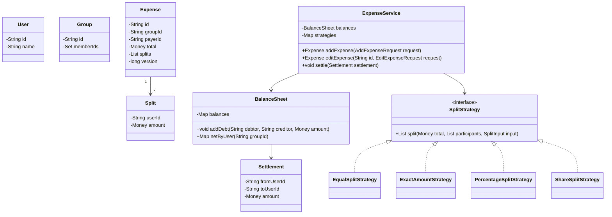

Splitwise-style expense splitting is not hard because of the UI; it is hard because money movement must stay correct after rounding, edits, deletes, settlements and concurrent updates. A good design separates expense validation from balance updates and keeps debt simplification as a view over reliable balances.

## Requirements

### Functional

- Create users and groups.
- Add an expense paid by one user on behalf of several users.
- Support equal, exact amount, percentage and share-based split strategies.
- Validate that splits sum to the expense total after rounding.
- Maintain balances showing who owes whom without recomputing the full expense history on every read.
- Record settlements, simplify debts for a group, and support expense edit and delete.
- Keep multi-currency balances separate unless an explicit conversion policy is supplied.

### Non-functional and assumptions

- Money is represented as integer minor units such as cents, or as `BigDecimal` with fixed scale. Never use `double`.
- Balance updates for one expense are atomic: either every participant's balance changes or none do.
- A settlement is auditable and does not erase the original expense.
- Debt simplification is an optimization for suggested payments, not a rewrite of historical expenses.
- A group can have many expenses, so read paths should use stored balances rather than scanning the ledger every time.

### Clarifying questions to ask

- Is an expense paid by one user only, or can multiple people pay parts of it?
- Which split types are required: equal, exact, percentage, shares or custom?
- Do balances need to be per group, across all groups, or both?
- Are multiple currencies allowed, and if yes, who supplies the exchange rate?
- Can users edit or delete an expense after settlements have happened?
- Should suggested settlements minimize transactions exactly or just produce a good practical simplification?

## Core objects

| Class | Responsibility | Key fields or methods |
|---|---|---|
| `User` | Participant in expenses and balances | `id`, `name` |
| `Group` | Collection of users and expenses | `id`, `memberIds` |
| `Expense` | Paid item and split metadata | `id`, `groupId`, `payerId`, `total`, `splits`, `version` |
| `Split` | One user's owed share | `userId`, `amount` |
| `SplitStrategy` | Computes and validates splits | `split(total, participants, input)` |
| `BalanceSheet` | Stores pairwise debts | `addDebt(debtor, creditor, amount)`, `netByUser(groupId)` |
| `Settlement` | Audited payment between users | `fromUserId`, `toUserId`, `amount`, `currency` |
| `ExpenseService` | Orchestrates add, edit, delete and settle | `addExpense`, `editExpense`, `deleteExpense`, `settle` |
| `Money` | Currency-aware value object | `currency`, `minorUnits` |

## Class design



## Split strategies and validation

Each split type is a strategy because the inputs and validation rules differ. Equal split needs only participants. Exact split needs one amount per participant. Percentage split needs percentages summing to 100. Share split needs integer weights, then divides the total proportionally. All strategies return concrete `Split` objects whose amounts must sum to the expense total in the same currency.

| Split type | Input | Validation |
|---|---|---|
| Equal | Participant list | Every participant gets a share; rounding remainder is assigned deterministically |
| Exact amount | Amount per participant | Sum of amounts equals total |
| Percentage | Percentage per participant | Percentages sum to 100 and computed amounts sum after rounding |
| Shares | Integer share count per participant | Shares are positive and total shares are greater than zero |

> [!KEY]
> Do not let the service "mostly trust" split input. Every strategy must produce amounts that exactly sum to the expense total before balances are touched.

Equal split demonstrates the money rule. If 100 cents is split among three users, the base share is 33 cents and one remainder cent must go somewhere. Assign it deterministically, such as by the participant order captured on the request or sorted user ID, so retries produce the same balances.

```java
public final class EqualSplitStrategy implements SplitStrategy {
    @Override
    public List<Split> split(Money total, List<String> userIds, SplitInput input) {
        if (userIds.isEmpty()) throw new IllegalArgumentException("participants required");
        long base = total.minorUnits() / userIds.size();
        long remainder = total.minorUnits() % userIds.size();

        List<Split> splits = new ArrayList<>();
        for (int i = 0; i < userIds.size(); i++) {
            long extra = i < remainder ? 1 : 0;
            splits.add(new Split(userIds.get(i), total.withMinorUnits(base + extra)));
        }
        return splits;
    }
}
```

> [!WARNING]
> `double` is a bug in money code. Binary floating point cannot exactly represent decimal amounts like 0.1, and tiny errors become visible when many expenses and settlements accumulate.

## Balance sheet design

Recomputing balances by scanning all expenses on every read is simple but does not scale and becomes awkward after edits and settlements. Store pairwise balances as the write model: for each group and currency, `A owes B 2500 cents` is one row or map entry. Adding an expense updates the balances touched by that expense. Reading "who owes whom" is then a small query over current balances.

For a single-payer expense, each non-payer split creates debt from that participant to the payer. If Priya pays 90 dollars for Priya, Omar and Li, and the equal split assigns 30 dollars each, Omar owes Priya 30 and Li owes Priya 30. Priya's own split does not create debt because she already paid her share.

| Event | Balance update |
|---|---|
| Add expense | For each split where participant is not payer, add debt participant -> payer |
| Delete expense | Reverse the original debt deltas in one transaction |
| Edit expense | Reverse old deltas, validate new splits, apply new deltas atomically |
| Settlement | Reduce debt from payer of settlement to receiver, or create opposite debt if overpaid |

`BalanceKey` should include group ID, currency and a canonical pair of users. A common convention stores users in sorted order and a signed amount: positive means the first user owes the second, negative means the second owes the first. Another convention stores directed debtor and creditor rows and normalizes when signs flip. Either works if every update uses one convention consistently.

> [!TIP]
> Store current balances for fast reads, but keep expenses and settlements as the audit ledger. Balances are derived state that can be rebuilt if a bug is found.

## Debt simplification

Pairwise balances answer "who currently owes whom". Debt simplification answers a different question: "what small set of payments would settle the group?" First compute each user's net position. If a user owes more than they are owed, their net is negative. If they are owed more than they owe, their net is positive. Then greedily match the largest debtor with the largest creditor.

```java
public record SettlementSuggestion(String fromUserId, String toUserId, long minorUnits) { }
record Entry(String userId, long amount) { }

public static List<SettlementSuggestion> simplify(Map<String, Long> netByUser) {
    PriorityQueue<Entry> creditors =
        new PriorityQueue<>((a, b) -> Long.compare(b.amount(), a.amount()));
    PriorityQueue<Entry> debtors =
        new PriorityQueue<>((a, b) -> Long.compare(b.amount(), a.amount()));

    for (var entry : netByUser.entrySet()) {
        long amount = entry.getValue();
        if (amount > 0) creditors.add(new Entry(entry.getKey(), amount));
        if (amount < 0) debtors.add(new Entry(entry.getKey(), -amount));
    }

    List<SettlementSuggestion> result = new ArrayList<>();
    while (!creditors.isEmpty() && !debtors.isEmpty()) {
        Entry creditor = creditors.poll();
        Entry debtor = debtors.poll();
        long paid = Math.min(creditor.amount(), debtor.amount());
        result.add(new SettlementSuggestion(debtor.userId(), creditor.userId(), paid));
        if (creditor.amount() > paid) creditors.add(new Entry(creditor.userId(), creditor.amount() - paid));
        if (debtor.amount() > paid) debtors.add(new Entry(debtor.userId(), debtor.amount() - paid));
    }
    return result;
}
```

The complexity is `O(n log n + t log n)`, where `n` is the number of users with non-zero net balances and `t` is the number of suggestions emitted. In practice `t` is at most about `n - 1` when totals balance cleanly. The honest caveat: finding the absolute minimum number of transactions under all constraints is NP-hard when you frame it as choosing subsets of balances that cancel to zero. The greedy heap algorithm is the standard practical heuristic because it is simple, fast and produces a small, understandable settlement list.

## Edits, deletes, settlements and currency

Expense edit and delete must be based on deltas, not on recalculating from whatever the current request says. Store the original splits and payer on the expense. Deleting an expense applies the inverse of those original debt deltas and marks the expense deleted. Editing applies the inverse of the old deltas, validates the new strategy output, then applies the new deltas, all in one transaction. If a concurrent edit changes the expense version, reject or retry rather than applying an inverse to stale data.

Settlements are first-class records. If Omar pays Priya 30 dollars, create a `Settlement` row and update balances to reduce Omar's debt to Priya. Do not delete the expenses that created the debt; users need audit history and the ability to explain why a settlement was suggested.

Multi-currency should be explicit. The safest design keeps separate balances per currency and never nets dollars against euros. If the product requires conversion, introduce an `ExchangeRateProvider` and store the rate, timestamp and source used for each converted expense or settlement. Without that audit trail, later exchange-rate changes make old balances impossible to explain.

> [!NOTE]
> A production Splitwise clone is a ledger system. Current balances are a projection; expenses and settlements are the facts.

## Concurrency and atomicity

Balance updates are small but correctness-sensitive. Two users can add expenses to the same group at the same time, or one user can edit an expense while another records a settlement. The service should wrap expense persistence and balance updates in one transaction and lock the affected balance rows in a stable order to avoid deadlocks. Optimistic versioning on `Expense` protects edit and delete from stale clients.

Idempotency matters for mobile retries. `AddExpenseRequest` should carry a client request ID; if the same request is received twice, the service returns the original expense rather than applying the balance delta again. The same rule applies to settlements. A duplicate settlement is worse than a duplicate notification because it changes money owed.

| Race | Safe handling |
|---|---|
| Two expenses added at once | Transactionally increment different balance rows, row locks in stable order |
| Edit races with delete | Check expense version and status before applying inverse deltas |
| Settlement races with expense add | Lock affected pairwise balance rows and commit one ordered transaction |
| Client retries add expense | Idempotency key returns the existing expense and skips deltas |

## Cheat sheet

- Model `Expense` as payer, total money, split strategy, concrete validated splits and version.
- Equal, exact, percentage and share splits are strategies with different validation rules.
- Splits must sum exactly to the total before any balance update happens.
- Use integer minor units or `BigDecimal`; never use `double` for money.
- Assign rounding remainder deterministically so retries are stable.
- Store pairwise balances for fast reads, but keep expenses and settlements as the audit ledger.
- Edit = reverse old deltas then apply new deltas inside one transaction.
- Delete = reverse original deltas and mark deleted, not hard-remove history.
- Debt simplification uses max-heaps of creditors and debtors; it is a practical heuristic, not an exact minimum guarantee.
- Keep balances per currency unless an explicit, auditable FX conversion policy is supplied.

## Common mistakes

| Mistake | Fix |
|---|---|
| Using `double` for money | Use integer minor units or fixed-scale `BigDecimal` |
| Recomputing balances from all expenses on every read | Maintain pairwise balances as a projection updated on writes |
| Forgetting the rounding remainder in equal split | Assign remainder cents deterministically |
| Trusting exact or percentage split input without validation | Verify concrete split amounts sum to total |
| Editing an expense by applying only the new delta | Reverse old deltas, then apply new deltas atomically |
| Deleting expense history after settlement | Keep audit records and mark status deleted |
| Netting different currencies together silently | Store balances per currency or record an explicit exchange rate |
| Claiming greedy settlement always minimizes transaction count | State the NP-hard caveat and present greedy as the practical heuristic |

## Summary

Expense splitting is a ledger problem with strategy-based validation at the edge. Splits produce exact money amounts, balance updates store pairwise debt for fast reads, and expenses plus settlements remain the audit trail that explains every number. Greedy debt simplification is valuable, but it should be presented honestly as a fast suggestion algorithm layered on top of correct balances, not as the source of truth.

## Top Interview Questions

### Q1. Why should split calculation be a Strategy family?

Equal, exact, percentage and share-based splits have different inputs and validation rules. Equal split divides the total and handles a rounding remainder. Exact split validates that user-provided amounts sum to the total. Percentage split validates percentages sum to 100 and then handles rounding. Share split validates positive integer weights and divides proportionally. If all of this sits inside one `addExpense` method as a switch, that method becomes the owner of every rule and every future split type. A `SplitStrategy` interface keeps each rule independently testable and makes adding a new split type, such as adjusted shares or itemized splits, an additive change.

### Q2. How do you handle rounding when an amount does not divide evenly?

Use integer minor units, such as cents, and assign the remainder deterministically. For 100 cents split among three people, the base share is 33 cents and the remainder is one cent. Give the extra cent to the first participant in a stable order, such as request order or sorted user ID, producing 34, 33 and 33. The important properties are that the split amounts sum exactly to the total and that the same request produces the same result on retry. Randomly assigning the remainder or dropping it creates balance drift and makes later audit explanations impossible.

### Q3. Why store pairwise balances instead of recomputing from all expense history?

Recomputing from history is simple for a toy group but expensive for a real one with thousands of expenses and settlements. Most reads ask for current balances, not a full ledger replay, so storing pairwise balances gives fast reads and straightforward "who owes whom" views. The ledger still matters: expenses and settlements remain the facts, and balances are a projection that can be rebuilt if needed. This is the same trade-off used in many financial systems: write carefully, maintain a current summary, and keep immutable audit records. The key is making balance updates transactional with the expense or settlement that caused them.

### Q4. How does adding an expense update balances?

After the split strategy returns validated concrete splits, compare each split to the payer. For every participant other than the payer, add debt from that participant to the payer for the split amount. If Priya pays 90 dollars for Priya, Omar and Li equally, Omar owes Priya 30 and Li owes Priya 30; Priya's own share creates no debt because she already paid it. These updates should happen in the same transaction that stores the expense. If any balance update fails, the expense should not be committed, because an expense without its corresponding balance projection makes reads incorrect.

### Q5. How do edit and delete affect balances?

Store the original payer and splits on the expense. To delete, apply the inverse of the original debt deltas and mark the expense deleted. To edit, apply the inverse of the old deltas, compute and validate the new splits, then apply the new deltas, all inside one transaction. Protect the expense with a version so two clients cannot both edit stale data and each reverse or apply the wrong amounts. Do not simply overwrite the expense and apply only the new deltas; that leaves the old balances behind. Also avoid hard-deleting history, because settlements and audits need to explain past balances.

### Q6. How does the greedy debt simplification algorithm work?

First compute each user's net position: positive means the user should receive money, negative means the user owes money. Put creditors in a max-heap by amount and debtors in another max-heap by amount owed. Repeatedly pop the largest creditor and largest debtor, create a settlement for the smaller of the two amounts, subtract that amount, and reinsert whoever still has a remaining balance. The algorithm is fast, usually `O(n log n)` plus emitted transactions, and produces intuitive suggestions. It does not change the ledger; it only suggests payments that would settle the current net balances if users make them.

### Q7. Does greedy simplification minimize the number of settlement transactions?

Not always. The exact problem of minimizing transaction count can be formulated as finding subsets of balances that cancel to zero, and that version is NP-hard. Greedy matching the largest debtor with the largest creditor is the practical answer because it is simple, efficient and produces a small number of understandable transactions for normal group sizes. In an interview, be honest: do not claim exact optimality unless you are prepared to discuss the exponential search or dynamic programming variants used for small `n`. The production value is usually clarity and speed, not proving the mathematically minimal number of payments.

### Q8. How should multi-currency expenses be handled?

The safest default is to keep balances per currency. If Alice owes Bob 10 dollars and Bob owes Alice 8 euros, those are two separate balances until someone supplies a conversion rule. Silently netting them is wrong because exchange rates move and users may disagree about the rate. If the product requires conversion, introduce an `ExchangeRateProvider` and store the rate, timestamp and source used for the conversion on the expense or settlement. That makes later audit possible even if today's rate differs. Also avoid mixing minor-unit scales incorrectly, because currencies do not all have two decimal places.

### Q9. What concurrency issues exist in expense splitting?

The core race is applying money deltas more than once or applying them to stale state. Two users can add expenses to the same group simultaneously, which is fine if balance rows are incremented transactionally. More dangerous cases are edit racing with delete, settlement racing with an expense update, and mobile retry duplicating an add or settle request. Use a transaction that stores the expense or settlement and updates affected balance rows together, lock rows in a stable order, add optimistic versions to editable expenses, and use idempotency keys for client retries. Money operations must be atomic and replay-safe.

### Q10. What would you monitor in production for an expense-splitting system?

Monitor failed split validations, idempotency replays, balance update conflicts, settlement failures, and any invariant violation where group net balances do not sum to zero per currency. Track edit and delete rates because those paths are more error-prone than simple adds. Run periodic reconciliation jobs that rebuild balances from the ledger and compare them with stored pairwise balances; any mismatch should alert because it means the projection drifted. For multi-currency, monitor missing exchange-rate data and conversion failures. Operationally, also track notification delivery, but correctness alerts around money and ledger consistency are the ones that should page engineers.
