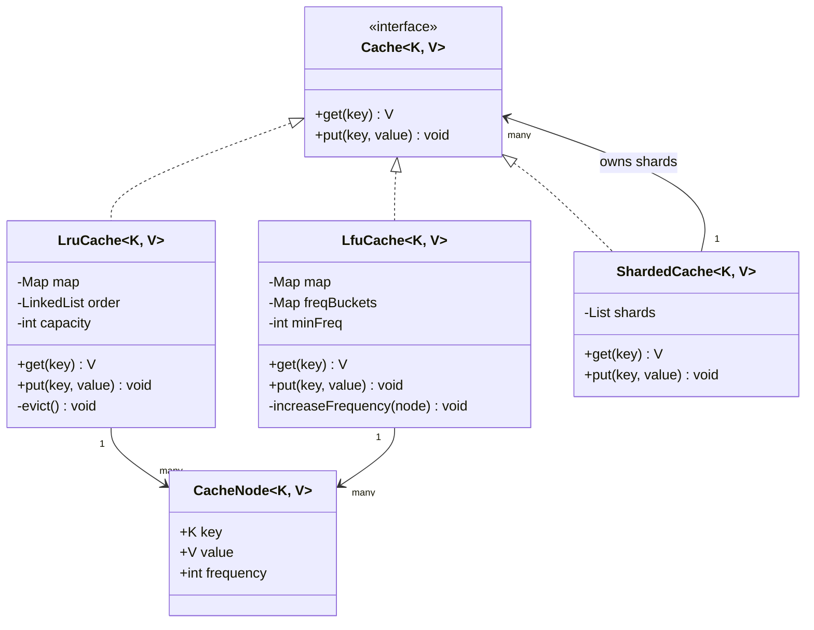

An LRU cache is the single most common data-structure design question because it forces you to combine two structures to beat the O(n) cost of either one alone. LFU is the natural follow-up that tests whether you can generalise the same skeleton to a different eviction rule.

## Requirements

### Functional

- `get(key)` returns the value or a miss signal, and counts as a "use" of that key.
- `put(key, value)` inserts or updates; if the cache is full, evict according to policy before inserting.
- Both operations must be O(1) average time.
- LRU evicts the **least recently used** key; LFU evicts the **least frequently used** key, breaking ties by recency.

### Non-functional and assumptions

- Fixed capacity, set at construction, does not grow dynamically.
- Single process, in-memory — no persistence, no cross-node replication in the base design.
- Reads and writes may come from multiple threads; correctness under concurrency is a first-class requirement, not an afterthought.
- Values are reasonably small; we are bounding by **entry count** first, with memory-size bounding as a named extension.

### Clarifying questions to ask

> [!TIP]
> Asking these up front is what separates a candidate who "knows LRU" from one who can design a cache. It also lets you scope the 30 minutes you have.

- Is the eviction policy fixed, or should it be swappable (LRU vs LFU vs TTL) without rewriting the cache?
- Do entries need to expire on a timer (TTL) independent of eviction?
- Is thread safety required, and what is the concurrency level — light contention or a hot path from hundreds of threads?
- Should capacity be counted in **number of entries** or **bytes of memory**?
- Is this cache local to one process, or does it need to behave consistently across a fleet of nodes?

## Core objects

| Class | Responsibility | Key fields/methods |
|---|---|---|
| `Cache<K,V>` | Public contract, independent of eviction policy | `get(key)`, `put(key, value)` |
| `LruCache<K,V>` | O(1) LRU via hash map + doubly linked list | `map`, `order` (linked list), `get`, `put` |
| `LfuCache<K,V>` | O(1) LFU via frequency buckets | `map`, `freqBuckets`, `minFreq`, `get`, `put` |
| `CacheNode<K,V>` | One entry; carries key, value, frequency | `key`, `value`, `frequency` |
| `ExpiringCacheDecorator` | Adds TTL on top of any `Cache` | `ttl`, `expiryMap`, wraps `get`/`put` |
| `ShardedCache<K,V>` | Thread-safe variant, striped locking | `shards`, `shardFor(key)` |

## Class design



## Eviction policies compared

| Policy | Evicts | Data structure | Get/Put | Good for |
|---|---|---|---|---|
| LRU | Least recently used | Hash map + doubly linked list | O(1) | Recency-biased access (web sessions, recently viewed) |
| LFU | Least frequently used | Hash map + frequency buckets | O(1) | Stable "hot set" that repeats often (popular product pages) |
| FIFO | Oldest inserted | Hash map + queue | O(1) | Simplicity, when access pattern is uniform |
| Random | Any entry | Hash map + array | O(1) | Cheap approximation at very large scale (Redis default) |

> [!KEY]
> Both LRU and LFU solve the same underlying problem: a hash map gives O(1) lookup but no ordering, and a list/queue gives ordering but O(n) lookup. The trick in every eviction policy is to store a **pointer from the map directly into the ordered structure** so both operations stay O(1).

LFU's extra trick is the **frequency bucket list**: instead of a heap (O(log n) per update), keep one doubly linked list per frequency count, plus a `minFrequency` pointer. Incrementing a key's frequency is an O(1) unlink-from-bucket-N / link-into-bucket-N+1, and eviction always pops from the bucket at `minFrequency`.

## Key design decisions

### Strategy pattern for eviction policy, not an `if/else` on a policy enum

`Cache<K,V>` is the strategy interface; `LruCache` and `LfuCache` are interchangeable implementations. The rejected alternative is one monolithic cache class with an `EvictionPolicy` enum and branching logic in `put` — that couples unrelated eviction algorithms into one class and makes adding TTL-based eviction a merge conflict waiting to happen.

### Sentinel head/tail nodes instead of null-checked links

The linked list uses dummy head and tail nodes so `addFirst`/`removeLast` never check for null neighbours. The alternative — a real head/tail with null checks scattered through every insert/remove — is where most LRU cache bugs during interviews come from (off-by-one on the last remaining node).

### Frequency buckets instead of a heap for LFU

| Approach | Update on access | Evict | Notes |
|---|---|---|---|
| Min-heap keyed by frequency | O(log n) | O(log n) | Simple to reason about, still passes most interviews |
| Frequency-bucket lists (chosen) | O(1) | O(1) | Needs the `minFrequency` invariant maintained carefully |

The bucket approach is the "hard mode" answer that shows mastery; leading with the heap and mentioning the O(1) upgrade is a perfectly good sequence to narrate live.

### Striped (sharded) locking instead of one global lock

A single `synchronized` block (or a `ReentrantLock`) around `get`/`put` is correct but serialises every request through one mutex. Splitting the key space into N shards, each with its own cache and lock, lets unrelated keys proceed in parallel. The rejected alternative — a single `ConcurrentHashMap` — does not work by itself because moving a node to the front of the LRU list is not an atomic operation the collection understands.

## Implementation

```java
public interface Cache<K, V> {
    V get(K key);              // returns null on a miss
    void put(K key, V value);
}

public class LruCache<K, V> implements Cache<K, V> {
    private static final class Node<K, V> {
        K key;
        V value;
        Node<K, V> prev, next;
    }

    private final int capacity;
    private final Map<K, Node<K, V>> map = new HashMap<>();
    private final Node<K, V> head = new Node<>(); // sentinels
    private final Node<K, V> tail = new Node<>();

    public LruCache(int capacity) {
        if (capacity <= 0) throw new IllegalArgumentException("capacity must be positive");
        this.capacity = capacity;
        head.next = tail;
        tail.prev = head;
    }

    @Override
    public synchronized V get(K key) {
        Node<K, V> node = map.get(key);
        if (node == null) return null;
        moveToFront(node);
        return node.value;
    }

    @Override
    public synchronized void put(K key, V value) {
        Node<K, V> existing = map.get(key);
        if (existing != null) {
            existing.value = value;
            moveToFront(existing);
            return;
        }

        if (map.size() >= capacity) {
            Node<K, V> lru = tail.prev;
            unlink(lru);
            map.remove(lru.key);
        }

        Node<K, V> node = new Node<>();
        node.key = key;
        node.value = value;
        map.put(key, node);
        addFirst(node);
    }

    private void moveToFront(Node<K, V> node) {
        unlink(node);
        addFirst(node);
    }

    private void addFirst(Node<K, V> node) {
        node.next = head.next;
        node.prev = head;
        head.next.prev = node;
        head.next = node;
    }

    private void unlink(Node<K, V> node) {
        node.prev.next = node.next;
        node.next.prev = node.prev;
    }
}
```

The LFU cache reuses `map` for O(1) lookup but replaces the single linked list with a `Map<Integer, LinkedHashSet<Node>>` keyed by frequency, plus a `minFrequency` field: `get` moves a node from bucket `f` to bucket `f+1`, bumping `minFrequency` only when bucket `f` becomes empty **and** `f == minFrequency`. Eviction always removes the eldest entry of `freqBuckets.get(minFrequency)` — never a scan. A `LinkedHashSet` preserves insertion order, so its eldest element is the least-recently-used key at that frequency, which is exactly the LFU tie-break. The LFU cache moves the same `Node` object between buckets — a node removed from bucket `f`'s set is re-inserted into bucket `f+1`'s set — so `put`/`get` allocate nothing on the hot path.

> [!TIP]
> The LRU cache can skip the hand-rolled `Node`/pointer-surgery class entirely by extending `LinkedHashMap` with `accessOrder = true` and overriding `removeEldestEntry` to evict once size exceeds capacity — `get`/`put` reordering and eviction then come for free, all O(1). It is a faster way to produce working code in an interview, at the cost of not demonstrating that you understand the pointer manipulation `LinkedHashMap` does for you. Note that `LinkedHashMap` is **not** thread-safe: wrap it with `Collections.synchronizedMap` or guard it with a `ReentrantLock` before sharing it across threads — narrate both and pick based on how much time is left.

## Concurrency and thread safety

> [!WARNING]
> `ConcurrentHashMap<K, Node>` alone does **not** make an LRU cache thread-safe. Lookup is thread-safe, but "move this node to the front of the list" touches shared list pointers that need their own synchronization — a torn linked list under concurrent `moveToFront` calls is a classic interview trap.

The simplest correct approach is one `synchronized` block (or a `ReentrantLock`) around the whole `get`/`put` body, guarding both the map and the list together. For higher throughput, shard by key hash:

```java
public class ShardedCache<K, V> implements Cache<K, V> {
    private final List<Cache<K, V>> shards;
    private final int shardCount;

    public ShardedCache(int shardCount, IntFunction<Cache<K, V>> factory) {
        this.shardCount = shardCount;
        this.shards = new ArrayList<>(shardCount);
        for (int i = 0; i < shardCount; i++) {
            shards.add(factory.apply(i));
        }
    }

    private Cache<K, V> shardFor(K key) {
        return shards.get((key.hashCode() & 0x7fffffff) % shardCount);
    }

    @Override
    public V get(K key) {
        return shardFor(key).get(key);
    }

    @Override
    public synchronized void put(K key, V value) {
        shardFor(key).put(key, value);
    }
}
```

Each shard has its own capacity (`totalCapacity / shardCount`) and its own lock, so two threads touching keys that hash to different shards never contend. The trade-off: global "least recently used across the whole cache" is only approximate — a shard can evict its own LRU entry while a globally colder entry sits untouched in another shard. That is an acceptable, well-known trade-off and worth naming out loud.

## Extending the design

| New requirement | Where it plugs in | Why the design allows it |
|---|---|---|
| TTL expiry | Wrap any `Cache` in an `ExpiringCacheDecorator` that checks an expiry map before delegating `get` | Decorator composes over the `Cache` interface without touching eviction logic |
| Capacity by memory, not count | Replace the `int capacity` check with a running byte-size counter updated on `put`/evict | Eviction trigger is already isolated to one comparison; only the counter changes |
| New eviction policy (e.g. MRU, ARC) | Add a class implementing `Cache<K,V>` | Strategy pattern means the rest of the system only depends on the interface |
| Distributed cache | Replace `ShardedCache`'s in-process shards with client stubs to remote nodes (consistent hashing to pick the node) | The shard-routing logic (`shardFor`) already isolates "which owner" from "how eviction works" |
| Write-through to a database | Add a `WriteThroughCache` decorator that calls the DB inside `put` before delegating | Same decorator seam as TTL |

> [!NOTE]
> This is exactly how Redis and Memcached scale in practice: a single node runs approximate LRU (sampling, not a perfect global list) for speed, and the cluster layer routes keys to nodes by consistent hashing — the same shard-then-approximate trade-off as `ShardedCache` above, just across machines instead of across in-process partitions.

## Cheat sheet

- LRU = hash map (O(1) lookup) + doubly linked list (O(1) reorder) with sentinel head/tail nodes.
- LFU = hash map + one linked list **per frequency count**, plus a `minFrequency` pointer — O(1), not a heap's O(log n).
- Always ask: bound by count or by memory? Fixed policy or swappable? Single-process or distributed?
- `ConcurrentHashMap` does not give you a thread-safe LRU by itself — the list mutation needs its own lock.
- Striped/sharded locking trades a small accuracy loss (per-shard LRU, not global) for much higher concurrency.
- TTL and write-through are best added as decorators over `Cache`, not baked into the eviction class.
- State Big-O for both `Get` and `Put`, and say "amortised" only if it truly is (list operations here are worst-case O(1), not amortised).
- Real caches (Redis) approximate LRU by sampling — perfect global recency ordering is rarely worth the cost at scale.

## Common mistakes

| Mistake | Fix |
|---|---|
| Using `List<T>` for the order structure | Removal from the middle is O(n); use a doubly linked list |
| Forgetting to move a node to front on `get` | LRU means *reads* also count as "used"; a miss on this is a common bug |
| Off-by-one at list boundaries | Use sentinel head/tail nodes to avoid null checks entirely |
| Evicting before checking if the key already exists | An update to an existing key should never trigger eviction |
| Assuming `ConcurrentHashMap` alone is enough for thread safety | Wrap both map and list mutation in one lock, or shard |
| Building LFU with a heap and calling it O(1) | A heap is O(log n); only bucketed frequency lists are O(1) |

## Summary

Both LRU and LFU come down to pairing a hash map with the right ordered structure so both `get` and `put` stay O(1): a doubly linked list for recency, a set of frequency buckets for frequency. The eviction rule itself is best expressed as a Strategy behind a common `Cache` interface, which is what makes TTL, write-through, sharding and distribution all pluggable as decorators or alternate implementations rather than rewrites. Thread safety is the part interviewers probe hardest — know exactly why a `ConcurrentHashMap` is not sufficient on its own, and be ready to trade a little global accuracy for sharded throughput.

## Top Interview Questions

### Q1. Why do you need both a hash map and a linked list for an O(1) LRU cache?

A hash map alone gives O(1) lookup by key but no notion of order, so finding the least recently used entry would require an O(n) scan. A linked list alone gives O(1) reordering (move a node to the front) but O(n) lookup by key. Combining them — map values point directly to list nodes — gives O(1) lookup **and** O(1) reordering: `get` uses the map to jump straight to the node, then the list to move it to the front in constant time with no scanning.

### Q2. Why use sentinel (dummy) head and tail nodes instead of tracking head/tail references directly?

Without sentinels, every insert/remove has to special-case "is this the first node" or "is this the last node", which is where most bugs creep in — forgetting to update `head` when removing the only node, for example. Sentinel nodes are permanent, non-data nodes that always exist, so `addFirst` always has a real `head.next` to link before, and `removeLast` always has a real `tail.prev` to unlink. Every operation becomes unconditional pointer surgery with no null checks.

### Q3. How does LFU achieve O(1) get and put, and why is a heap not good enough?

A min-heap keyed by frequency gives O(log n) update and eviction, which is correct but not optimal. The O(1) approach keeps a `Map<Integer, LinkedHashSet<Node>>` mapping each frequency value to an insertion-ordered set of nodes with that frequency, plus a `minFrequency` counter. Accessing a key removes its node from bucket `f` and appends it to bucket `f+1` — both O(1) set operations — and updates `minFrequency` only in the rare case the vacated bucket was the minimum and is now empty. Eviction always removes the eldest entry from `buckets.get(minFrequency)`, so there is never a scan.

### Q4. What happens to `minFrequency` when the bucket at that frequency becomes empty?

You increment `minFrequency` by exactly 1, never search for the new minimum. This works because every access increases a key's frequency by exactly one step, so if the current minimum bucket empties out, the next-lowest possible frequency any surviving key can have is `minFrequency + 1` — there is no smaller value to search for. This invariant is what keeps the operation O(1) instead of O(number of distinct frequencies).

### Q5. Is `ConcurrentHashMap<K, Node>` enough to make an LRU cache thread-safe?

No. `ConcurrentHashMap` makes individual map operations atomic, but an LRU cache's core behaviour — unlinking a node and re-linking it at the front on every access — touches shared `prev`/`next` pointers on the doubly linked list, which `ConcurrentHashMap` knows nothing about. Two threads calling `get` concurrently can interleave their pointer updates and corrupt the list (a node pointing to itself, or a node reachable from two places at once). You need an explicit lock around the combined map-and-list mutation, or a design that avoids shared mutable list state altogether (e.g. sharding).

### Q6. How would you make an LRU cache scale to many concurrent threads without one global lock?

Shard the key space: split the cache into N independent `LruCache` instances, each with `capacity / N` and its own lock, and route each key to a shard by `hash(key) % N`. Two threads operating on keys in different shards never contend. The cost is that eviction becomes "least recently used within this shard" rather than globally — a shard can evict an entry that is actually more recently used than one sitting untouched in another shard. This is the same trade-off caches like Redis Cluster make at the network level, just applied in-process.

### Q7. How would you add TTL (time-to-live) expiry without rewriting the eviction logic?

Wrap the existing cache in a decorator that implements the same `Cache` interface: `ExpiringCacheDecorator` keeps a separate `Map<K, Instant>` of expiry times, checks it before delegating `get` to the inner cache (treating an expired key as a miss and evicting it lazily), and records a fresh expiry time on every `put`. This keeps TTL orthogonal to whether the inner cache is LRU or LFU — you get expiry "for free" on both without touching either eviction algorithm.

### Q8. How would you support bounding the cache by memory size instead of entry count?

Replace the `map.size() >= capacity` check with a running total of estimated byte size, updated whenever an entry is added (`+= estimateSize(value)`) or evicted (`-= estimateSize(evicted.value)`). The eviction loop then becomes "keep evicting the LRU/LFU tail while `currentBytes > maxBytes`" instead of a single-entry check, because one large `put` might need to evict several small entries to fit. The ordering data structures do not change at all — only the trigger condition for eviction does.

### Q9. Design walkthrough: a client calls `Get` on a key that does not exist, then `Put`s a new value when the cache is full. Walk through both paths.

`get("x")`: hash to the map, miss, return "not found" — no mutation happens, so no reordering either. `put("y", v)` when full: check the map first (not present, so this is a true insert, not an update); since `map.size() >= capacity`, take `tail.prev` (the sentinel-adjacent real LRU node), unlink it from the list, remove its key from the map; then create the new node, insert it into the map, and `addFirst` it into the list. Both branches are O(1) because every step is a direct pointer operation or map lookup, never a scan.

### Q10. In production, would you build your own LRU cache or use a library, and why?

For anything beyond a coding exercise, use a battle-tested library (Caffeine or Guava's `Cache` for in-process caching, or an external cache like Redis for shared state) rather than hand-rolling one — they handle memory pressure eviction, thread safety, and expiry correctly, and have been fuzz-tested for the edge cases that are easy to get subtly wrong (like the sentinel-node bugs above). The interview exercise exists to test whether you understand the underlying mechanics well enough to reason about performance and correctness trade-offs, not because production code should reimplement it.

### Q11. Why is FIFO sometimes preferred over LRU despite being a "worse" heuristic on paper?

FIFO needs no reordering on `Get` at all — only insertion order matters — so reads never touch the ordering structure, which removes an entire class of write contention on the hot read path. For access patterns that are closer to uniform (no strong recency bias), the extra bookkeeping of LRU buys little accuracy for a real cost in lock contention and cache-line writes on every read. This is why some CDN and OS page-cache implementations default to FIFO or CLOCK (an approximation) at very high throughput.

### Q12. What is the CLOCK algorithm and why do real systems use it instead of exact LRU?

CLOCK approximates LRU without maintaining an exact ordered list: entries sit in a circular buffer, each with a single "recently used" bit set on access. A clock hand sweeps the buffer looking for a victim; if the current entry's bit is set, it clears the bit and moves on (giving it a "second chance"), and evicts the first entry it finds with the bit unset. This needs only a single bit per entry and no pointer rewiring on every read, trading a little eviction precision for far less synchronization overhead — the same reason operating system page replacement algorithms almost always use CLOCK-family approximations rather than exact LRU.
