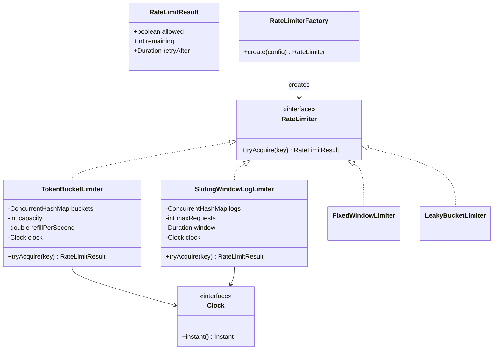

A rate limiter question is really two questions in one interview: can you name and implement the classic throttling algorithms, and can you design a class around them that stays clean when a sixth algorithm shows up next sprint.

## Requirements

### Functional

- `tryAcquire(key)` returns whether a request for `key` (e.g. a client ID or API key) is allowed right now.
- Support at least token bucket, leaky bucket, fixed window and sliding window algorithms, selectable per endpoint.
- Return enough information to build a `429` response: allowed/denied, remaining quota, and a retry-after hint.
- Each key (client, endpoint, or client+endpoint pair) is limited independently.
- Configuration (which algorithm and its parameters, per endpoint) is loaded once at startup; an endpoint with no explicit entry falls back to a default limiter rather than being rejected outright.

### Non-functional and assumptions

- Single process, in-memory state, loaded from configuration at startup — no external coordination service in the base design.
- Must be thread-safe: many request-handling threads call `tryAcquire` concurrently.
- Memory must not grow unbounded as new client keys appear; idle keys need to be reclaimed.
- Must be testable without real wall-clock sleeps, which means the clock is a dependency, not a static call.

### Clarifying questions to ask

> [!TIP]
> A senior answer starts here, not with code: rate limiting has at least four well-known algorithms with different trade-offs, and picking one before understanding the burst tolerance requirement is a mistake worth avoiding out loud.

- Is bursty traffic acceptable (token bucket) or must the rate be perfectly smooth (leaky bucket)?
- Is the limit per client, per endpoint, or the combination of both?
- What should happen for a key with no explicit configuration — reject, or fall back to a default?
- Is this single-process, or does it eventually need to hold across a fleet of servers?
- Is exact precision required, or is "approximately N per second" acceptable in exchange for O(1) memory (fixed window vs sliding log)?

## Core objects

| Class | Responsibility | Key fields/methods |
|---|---|---|
| `RateLimiter` | Strategy contract every algorithm implements | `tryAcquire(key) -> RateLimitResult` |
| `RateLimitResult` | Structured outcome for the caller | `allowed`, `remaining`, `retryAfter` |
| `TokenBucketLimiter` | Allows bursts up to capacity, refills over time | `buckets`, `capacity`, `refillPerSecond` |
| `SlidingWindowLogLimiter` | Exact count of requests in the trailing window | `logs`, `maxRequests`, `windowSize` |
| `FixedWindowLimiter` | Cheapest approximation, resets on window boundary | `counters`, `windowStart` |
| `LeakyBucketLimiter` | Smooths bursts into a constant output rate | `queues`, `leakRatePerSecond` |
| `Clock` | Injectable time source | `instant()` |
| `RateLimiterFactory` | Builds a limiter from configuration | `create(config) -> RateLimiter` |
| `IdleKeyReaper` | Background sweep evicting stale per-key state | `sweep()`, `idleThreshold` |

Deriving these responsibilities directly from the requirements is a useful habit to narrate out loud in an interview — each functional requirement maps to something a concrete class must own:


## Class design



## Key design decisions

### Strategy pattern over the four algorithms, not a switch statement

`RateLimiter` is the single method every algorithm implements, and `RateLimiterFactory` picks a concrete class from configuration. The rejected alternative is one monolithic limiter class with an `algorithm` enum and branching inside `tryAcquire` — every new algorithm would touch a shared method, and unit-testing one algorithm in isolation becomes harder because its state is tangled with the others'.

| Approach | New algorithm cost | Testability | Chosen |
|---|---|---|---|
| Strategy + Factory | Add one class, one factory branch | Each algorithm tested alone | ✅ |
| Single class with enum + branches | Edit a shared method, risk regressions | Must exercise the whole class | ❌ |

### Injected clock instead of `Instant.now()` calls scattered in the algorithm

Every limiter takes a `Clock` in its constructor. The rejected alternative — calling `Instant.now()` directly — makes token-refill and window-expiry logic untestable without real sleeps; a test verifying "10 tokens refill after 1 second" would need an actual second to elapse or become flaky.

### Per-key locks instead of one global lock across all clients

Token and window state lives in a `ConcurrentHashMap<String, State>`, and the read-modify-write inside each bucket is protected by a `synchronized` block on the bucket object itself, not a shared lock. The rejected alternative — a single lock around all of `tryAcquire` — serialises every client through one mutex, defeating the purpose of an API gateway meant to handle thousands of concurrent clients.

### Background reaper instead of per-request cleanup

An `IdleKeyReaper` runs on a timer and removes entries whose `lastSeen` exceeds an idle threshold. The rejected alternative — checking for staleness inline on every `tryAcquire` — adds a branch to the hot path for a concern (memory growth) that only matters occasionally; a periodic sweep keeps the hot path lean.

## Implementation

```java
public interface RateLimiter {
    RateLimitResult tryAcquire(String key);
}

public record RateLimitResult(boolean allowed, int remaining, Duration retryAfter) { }

public interface Clock {
    Instant instant();
}

public final class SystemClock implements Clock {
    @Override
    public Instant instant() { return Instant.now(); }
}

public class TokenBucketLimiter implements RateLimiter {
    private static final class Bucket {
        double tokens;
        Instant lastRefill;
    }

    private final int capacity;
    private final double refillPerSecond;
    private final Clock clock;
    private final ConcurrentMap<String, Bucket> buckets = new ConcurrentHashMap<>();

    public TokenBucketLimiter(int capacity, double refillPerSecond, Clock clock) {
        this.capacity = capacity;
        this.refillPerSecond = refillPerSecond;
        this.clock = clock;
    }

    @Override
    public RateLimitResult tryAcquire(String key) {
        Bucket bucket = buckets.computeIfAbsent(key, k -> {
            Bucket b = new Bucket();
            b.tokens = capacity;
            b.lastRefill = clock.instant();
            return b;
        });

        synchronized (bucket) {
            Instant now = clock.instant();
            double elapsed = Duration.between(bucket.lastRefill, now).toNanos() / 1_000_000_000.0;
            bucket.tokens = Math.min(capacity, bucket.tokens + elapsed * refillPerSecond);
            bucket.lastRefill = now;

            if (bucket.tokens >= 1) {
                bucket.tokens -= 1;
                return new RateLimitResult(true, (int) bucket.tokens, null);
            }

            Duration retryAfter = Duration.ofNanos(Math.round((1 - bucket.tokens) / refillPerSecond * 1_000_000_000.0));
            return new RateLimitResult(false, 0, retryAfter);
        }
    }
}

public class SlidingWindowLogLimiter implements RateLimiter {
    private final int maxRequests;
    private final Duration window;
    private final Clock clock;
    private final ConcurrentMap<String, Deque<Instant>> logs = new ConcurrentHashMap<>();

    public SlidingWindowLogLimiter(int maxRequests, Duration window, Clock clock) {
        this.maxRequests = maxRequests;
        this.window = window;
        this.clock = clock;
    }

    @Override
    public RateLimitResult tryAcquire(String key) {
        Deque<Instant> log = logs.computeIfAbsent(key, k -> new ArrayDeque<>());

        synchronized (log) {
            Instant now = clock.instant();
            Instant cutoff = now.minus(window);
            while (!log.isEmpty() && log.peekFirst().isBefore(cutoff)) {
                log.pollFirst();
            }

            if (log.size() < maxRequests) {
                log.addLast(now);
                return new RateLimitResult(true, maxRequests - log.size(), null);
            }

            Duration retryAfter = Duration.between(now, log.peekFirst().plus(window));
            return new RateLimitResult(false, 0, retryAfter);
        }
    }
}
```

Fixed window is the same shape as the sliding log but stores only a counter plus a window-start timestamp — O(1) memory per key instead of O(requests-in-window), at the cost of allowing up to 2x the limit across a window boundary. Leaky bucket stores a queue (or a virtual "water level" double, refilled negatively at a fixed leak rate) and rejects new requests when the queue is full, producing a perfectly smooth output rate rather than token bucket's bursty one.


## Concurrency and thread safety

> [!WARNING]
> `ConcurrentHashMap.computeIfAbsent` guarantees the map itself is not corrupted, but it does **not** make the read-modify-write inside the bucket atomic. Two threads can both read the same `tokens` value before either writes it back, double-spending a token. The `synchronized` block must wrap the refill-and-decrement sequence, not just the map lookup.

Two viable locking strategies, in order of preference for this problem:

| Strategy | Mechanism | Trade-off |
|---|---|---|
| Lock per key (chosen) | `synchronized (bucket)` around refill + decrement | Only contention between requests for the *same* key |
| `AtomicLong` on a packed value | Pack tokens + timestamp into a single `long`, CAS-loop to update | Lock-free, faster under extreme contention, harder to get right and to extend |
| Single global lock | One `synchronized` block around all of `tryAcquire` | Simple, but serialises unrelated clients — avoid at gateway scale |

A `ConcurrentHashMap<String, Bucket>` combined with a `synchronized` block on each `Bucket` object individually gives the best balance: uncontended map reads, and lock scope limited to one client's state, so client A never waits on client B.

## Extending the design

| New requirement | Where it plugs in | Why the design allows it |
|---|---|---|
| A fifth algorithm (e.g. GCRA) | New class implementing `RateLimiter`, one branch in `RateLimiterFactory` | Strategy interface is the only contract callers depend on |
| Composite limits (per-client **and** per-endpoint) | Wrap two `RateLimiter`s in a `CompositeLimiter` that requires both to allow | `RateLimiter` composes naturally since it takes only a key and returns a result |
| Distributed rate limiting across servers | Swap the in-memory `ConcurrentHashMap` for a Redis-backed store using `INCR`/Lua scripts for atomicity | The algorithm math (refill, window math) is identical; only where the counter lives changes |
| Dynamic configuration reload | `RateLimiterFactory` rebuilds limiters and the orchestrator swaps a reference atomically | Immutable snapshot swap needs no lock on the read path |
| Per-tier limits (free vs paid) | Route the key as `tier + ":" + clientId` before calling `tryAcquire` | Key composition is external to the limiter; no algorithm change needed |

> [!NOTE]
> The distributed extension is the most commonly asked follow-up. The honest answer is that token bucket and sliding window log both translate to Redis directly — a Lua script does the refill-and-decrement (or log-trim-and-count) atomically server-side, which is exactly the same critical section as the in-process lock, just moved into the data store.

## Cheat sheet

- `RateLimiter.tryAcquire(key)` is the entire public contract — everything else is an implementation detail behind it.
- Token bucket allows bursts up to capacity; leaky bucket smooths to a constant rate; fixed window is cheap but allows edge bursts; sliding window log is exact but O(requests) memory per key.
- Inject a `Clock` — never call `Instant.now()` inside limiter logic directly, or you cannot unit test refill timing.
- Lock scope must cover the refill/decrement together, not just the dictionary lookup — `ConcurrentHashMap` alone is not enough.
- Reap idle keys on a background timer, not inline on every request.
- Distributed rate limiting is the same math with the counter moved to Redis via an atomic Lua script.
- State which algorithm you'd default to and why: token bucket is the most common real-world default because APIs want to tolerate bursts.

## Common mistakes

| Mistake | Fix |
|---|---|
| Branching on algorithm inside one big class | Extract each algorithm behind `RateLimiter`, use a factory |
| Calling `Instant.now()` directly in limiter code | Inject a `Clock` so tests control time deterministically |
| Locking only the dictionary access, not the bucket update | Lock (or CAS) the whole refill-and-decrement sequence |
| Never evicting per-key state | Add a background reaper keyed on last-seen time |
| Assuming fixed window is "good enough" without saying why | Name the edge-burst weakness (2x limit at window boundary) explicitly |
| Forgetting to return `retryAfter` | Callers need it to set the `Retry-After` HTTP header |

## Summary

A rate limiter is best modelled as a Strategy: one `RateLimiter` interface, four interchangeable algorithms with different burst/smoothness/memory trade-offs, and a factory that builds the right one from configuration. The engineering rigor is in the details — an injected clock for testability, lock scope that covers the full read-modify-write, and a background reaper so idle clients do not leak memory forever. The distributed extension reuses the exact same algorithm logic, moved behind an atomic Redis script instead of an in-process lock.

## Top Interview Questions

### Q1. Compare token bucket, leaky bucket, fixed window and sliding window log.

Token bucket refills tokens at a fixed rate up to a capacity and allows bursts up to that capacity — good when occasional spikes are fine as long as the average rate holds. Leaky bucket processes requests (or "drips") at a strictly constant rate regardless of how bursty the input is, smoothing traffic at the cost of adding latency to bursts. Fixed window counts requests in discrete time buckets (e.g. per-minute) — O(1) memory, but a client can send 2x the limit by timing requests around a window boundary. Sliding window log keeps an exact timestamp per request in the trailing window — perfectly precise, but memory grows with request volume within the window. Sliding window *counter* (a weighted average of the current and previous fixed window) is the practical middle ground used by most production gateways.

### Q2. Why is a lock around only `ConcurrentHashMap.computeIfAbsent` not sufficient for thread safety?

`computeIfAbsent` guarantees the map's internal structure is not corrupted and that only one bucket object is created per key, but it says nothing about what happens after you get the bucket back. Refilling tokens and decrementing by one is a read-modify-write on the bucket's fields; if two threads both read `tokens = 1.0` before either writes back `tokens = 0.0`, both will believe they successfully acquired a token, oversubscribing the limit. The `synchronized` block (or an atomic CAS loop) must wrap the entire refill-then-decrement sequence, using the bucket object itself as the lock target so unrelated keys are never contended.

### Q3. Why inject a `Clock` instead of calling `Instant.now()` directly?

Token refill and window expiry are entirely time-driven, so tests need to simulate "1 second passed" without an actual `Thread.sleep(1000)`, which would make the suite slow and occasionally flaky under CI load. Injecting a `Clock` lets a test use a `FakeClock` whose `instant()` is advanced manually, making refill and expiry assertions instant and deterministic. This is a general pattern for any time-dependent logic, not specific to rate limiting — it is the same reason schedulers and caches with TTL also take a clock dependency.

### Q4. How would you extend this design to limit per client AND per endpoint simultaneously?

Compose two independent `RateLimiter` instances — one keyed by `clientId`, one keyed by `endpoint` — inside a `CompositeLimiter` that calls `tryAcquire` on both and only allows the request if both return allowed. If either denies, return the more restrictive `retryAfter`. This works because `RateLimiter` only depends on an opaque string key, so "what the key represents" (client, endpoint, or a compound key like `client:endpoint`) is a decision made by the caller, not the algorithm.

### Q5. How would you extend a single-process rate limiter to work across a fleet of API gateway instances?

Move the shared counter state out of process, typically to Redis, and make the refill-and-decrement (or window-trim-and-count) an atomic Lua script executed server-side — this preserves the same critical section semantics as the in-process lock but makes it visible to every gateway instance. The algorithm's math does not change at all; only where the mutable state lives does. The trade-off is added latency per check (a network round trip instead of an in-memory lock) and a new failure mode: what to do if Redis is briefly unreachable (fail-open vs fail-closed is a decision to state explicitly).

### Q6. A client complains their requests are throttled even though they are "well under the limit" — how do you debug it?

First check which algorithm is in play: fixed window can throttle a client that sent, say, 60 requests just before a minute boundary and another 60 just after — 120 requests in a rolling minute, but each half-window individually under a 100/minute cap, yet the *client* perceives being throttled unfairly at the boundary. Second, check for key collisions — if the limiter keys by IP behind a shared NAT or load balancer, multiple distinct clients can be sharing one bucket. Third, verify the clock source and refill math with a unit test using a fake clock to rule out a refill-rate miscalculation.

### Q7. Why prefer per-key locking over a single global lock, and when would a global lock actually be fine?

Per-key locking means client A's request never waits on client B's lock, which matters at gateway scale where thousands of distinct clients are calling concurrently — a global lock would serialise all of them through one critical section regardless of how unrelated their keys are. A global lock is acceptable only when the total request volume is low enough that lock contention is not actually a bottleneck, or during an early prototype where correctness and simplicity matter more than throughput; it should be treated as a stepping stone, not the final design.

### Q8. How do you prevent unbounded memory growth from tracking every client that has ever made a request?

Run a background reaper on a timer (e.g. every minute) that walks the per-key state store and removes entries whose "last seen" timestamp is older than an idle threshold (say, 10x the window size). This is deliberately kept off the hot request path — checking staleness inline on every `tryAcquire` would add a branch and a clock read to every single request for a concern that only matters periodically. An alternative for very high cardinality keys is an LRU-bounded map that caps the number of tracked keys outright and evicts the coldest.

### Q9. What should `tryAcquire` return, and why not just a boolean?

A boolean tells the caller whether to proceed, but a production HTTP layer also needs to build a proper `429 Too Many Requests` response: how many requests remain in the current window (for a `X-RateLimit-Remaining` header) and how long to wait before retrying (for `Retry-After`). Returning a structured `RateLimitResult` with `allowed`, `remaining`, and `retryAfter` lets the calling layer construct a helpful response without the limiter needing to know anything about HTTP.

### Q10. How would you unit test the token bucket limiter's refill behaviour without flaky timing?

Inject a `FakeClock` that starts at a fixed `instant()` and exposes an `advance(Duration)` method. Construct the limiter with capacity 10 and a refill rate of 5/second, consume all 10 tokens, assert the 11th call is denied, then call `clock.advance(Duration.ofSeconds(1))` and assert exactly 5 more tokens are now available. Because the limiter never calls `Instant.now()` directly, the entire test runs in microseconds with no real waiting and no flakiness from scheduler jitter.

### Q11. What is the "thundering herd at the window boundary" problem in fixed window limiters, and how does sliding window counter fix it?

In a fixed window, all counters reset simultaneously at the boundary (e.g. the top of every minute), so if a limiter is under heavy load, many clients that were throttled can all succeed again at the exact same instant, causing a burst at the downstream service. Sliding window counter avoids this by computing an estimated count as a weighted average of the current window's count and the previous window's count, weighted by how far into the current window we are — this smooths the transition so there is no hard reset instant, at the cost of being an approximation rather than an exact count.

### Q12. In production, would you fail open or fail closed if the rate limiter's backing store (e.g. Redis) is unreachable?

It depends on what is being protected: for a public API gateway protecting against abuse or DDoS, fail closed (deny requests) is usually safer because the downstream system may not survive an unthrottled flood. For an internal service where the rate limiter protects a non-critical resource and availability matters more than strict enforcement, fail open (allow requests, log the failure) avoids an outage caused by the limiter itself. The senior answer names this explicitly as a business decision, backed by a circuit breaker around the store call so a persistent outage does not add latency to every single request while it decides.
