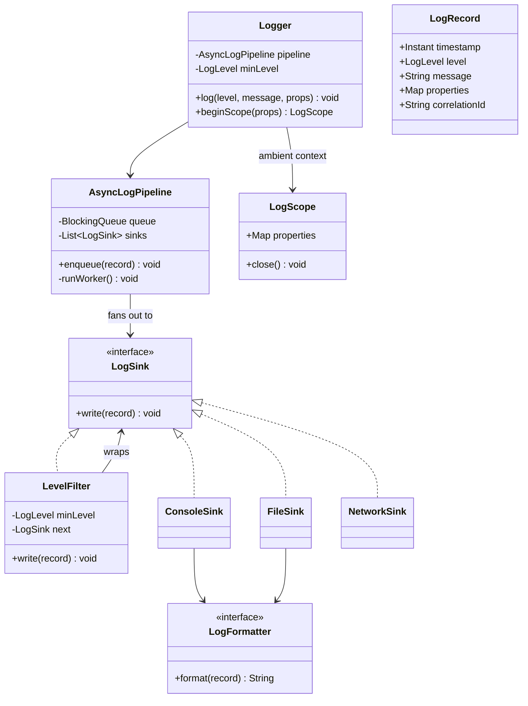
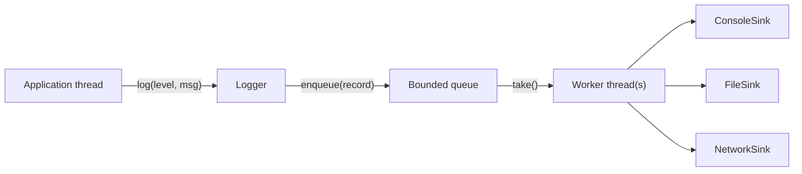

Every backend engineer has used a logging framework, which makes this LLD question deceptively easy to start and easy to get shallow on — the interesting parts are async delivery, backpressure, and what happens when a sink goes down. In the Java ecosystem you would reach for SLF4J as the façade over Logback or Log4j2 in production; this exercise builds a miniature of the same machinery — appenders, an async appender, MDC and level filters — from scratch.

## Requirements

### Functional

- `Logger.log(level, message, properties)` records a structured entry with a timestamp, level, message and key-value properties.
- Multiple output sinks simultaneously: console, file, network (e.g. shipping to a log aggregator).
- A configurable minimum level per logger or per sink (e.g. console at `INFO`, file at `DEBUG`).
- Structured logging: attach arbitrary properties, plus ambient context (correlation ID, request scope) that flows automatically without being repeated at every call site.

### Non-functional and assumptions

- Logging must never block the calling thread on I/O — the hot path is `log()` returning immediately.
- Thread-safe: many application threads log concurrently.
- Bounded memory: a burst of log volume must not grow the process's memory without limit.
- Must degrade gracefully if a sink is slow or unavailable — one broken sink must not stop others or crash the app.
- Extensible to new sinks and formats without changing the core `Logger` class.

### Clarifying questions to ask

> [!TIP]
> Naming the producer-consumer shape early — "logging is a producer-consumer problem, the app thread produces, a background thread consumes and writes" — signals you already know where this design is going.

- Should sinks share one minimum level, or can each sink have its own threshold?
- Is exactly-once delivery required, or is "best effort, may drop under extreme load" acceptable?
- Do we need structured properties (key-value) or is a plain message string enough?
- Should logs from a single request be correlated (trace/correlation ID) across services?
- What should happen when the internal queue is full — block the caller, drop the oldest, or drop the newest?

## Core objects

| Class | Responsibility | Key fields/methods |
|---|---|---|
| `LogLevel` | Ordered severity enum | `DEBUG < INFO < WARNING < ERROR < FATAL` |
| `LogRecord` | One structured log entry | `timestamp`, `level`, `message`, `properties`, `correlationId` |
| `Logger` | Public API, applies filtering, enqueues records | `log(level, message, props)`, `beginScope(props)` |
| `LogSink` | Strategy for "where logs go" (an appender) | `write(record)` |
| `ConsoleSink` / `FileSink` / `NetworkSink` | Concrete destinations | `write(record)` |
| `LogFormatter` | Strategy for "how a record renders" | `format(record) -> String` |
| `LevelFilter` | Chain of Responsibility link, drops below-threshold records | `minLevel`, `next` |
| `AsyncLogPipeline` | Bounded queue + background flusher | `queue`, `worker`, `enqueue(record)` |
| `LogScope` | AutoCloseable ambient context (correlation ID, request fields) | `properties`, `close()` |

## Class design



### The pipeline as producer-consumer



The application thread only ever touches the left two boxes — `Logger.log` validates the level and enqueues, then returns immediately. Everything to the right of the queue runs on one or more background worker threads, so a slow `NetworkSink` only ever delays other queued records, never the caller.

## Key design decisions

### Chain of Responsibility for level filtering, not an `if` at every sink

`LevelFilter` wraps any `LogSink` and drops records below its threshold before delegating to the wrapped sink — so console can filter at `INFO` while file filters at `DEBUG`, by wrapping each differently. The rejected alternative is an `if (record.level().compareTo(minLevel) >= 0)` check duplicated inside every sink's `write` method, which means adding a sink means re-adding the filtering logic and risking it diverging.

### Strategy for sinks and formatters, kept as two separate interfaces

`LogSink` (where) and `LogFormatter` (how it renders) are separate so a `FileSink` can use a plain-text formatter while a `NetworkSink` uses a JSON formatter, without either sink knowing about the other's format. The rejected alternative — baking formatting into each sink's `write` — means a new format (say, adding OpenTelemetry-compatible JSON) requires editing every sink class instead of writing one new formatter class.

### Bounded queue with a background flusher, not synchronous writes on the caller's thread

`AsyncLogPipeline` decouples "recording a log" from "writing it out": `log()` just enqueues and returns; a background worker (or small pool) dequeues and calls each sink. The rejected alternative — writing synchronously inside `log()` — means a slow disk or network sink adds I/O latency to every request thread that logs, which defeats the purpose of logging being cheap.

| Approach | Caller latency | Risk |
|---|---|---|
| Synchronous write | Full I/O latency on every log call | Simple, but couples app latency to sink health |
| Bounded async queue (chosen) | O(1) enqueue | Needs a backpressure policy for a full queue |

### Ambient scope via `AutoCloseable`, not manual parameter threading

`beginScope(props)` returns an `AutoCloseable` `LogScope` that pushes properties onto an ambient `ThreadLocal` map — the same primitive SLF4J's MDC uses — for the duration of a try-with-resources block, so every log call inside that block automatically carries the correlation ID without the call site repeating it. The rejected alternative — passing a `correlationId` parameter through every method signature down the call chain — is invasive and easy to forget at one layer, silently breaking trace correlation.

## Implementation

```java
public enum LogLevel { DEBUG, INFO, WARNING, ERROR, FATAL }

public record LogRecord(Instant timestamp, LogLevel level, String message,
                        Map<String, Object> properties, String correlationId) { }

public interface LogSink {
    void write(LogRecord record);
}

public class LevelFilter implements LogSink {
    private final LogLevel minLevel;
    private final LogSink next;

    public LevelFilter(LogLevel minLevel, LogSink next) {
        this.minLevel = minLevel;
        this.next = next;
    }

    @Override
    public void write(LogRecord record) {
        if (record.level().compareTo(minLevel) >= 0) {
            next.write(record);
        }
    }
}

public class AsyncLogPipeline implements AutoCloseable {
    private final BlockingQueue<LogRecord> queue;
    private final List<LogSink> sinks;
    private final Thread worker;
    private volatile boolean running = true;

    public AsyncLogPipeline(List<LogSink> sinks, int capacity) {
        this.sinks = List.copyOf(sinks);
        this.queue = new ArrayBlockingQueue<>(capacity);
        this.worker = new Thread(this::runWorker, "log-worker");
        this.worker.setDaemon(true);
        this.worker.start();
    }

    public boolean enqueue(LogRecord record) {
        return queue.offer(record); // drop when full; never blocks caller
    }

    private void runWorker() {
        while (running || !queue.isEmpty()) {
            LogRecord record;
            try {
                record = queue.poll(1, TimeUnit.SECONDS);
            } catch (InterruptedException e) {
                Thread.currentThread().interrupt();
                break;
            }
            if (record == null) continue;
            for (LogSink sink : sinks) {
                try {
                    sink.write(record);
                } catch (Exception ex) {
                    System.err.println("sink failed: " + ex.getMessage());
                }
            }
        }
    }

    @Override
    public void close() {
        running = false;
        worker.interrupt();
        try {
            worker.join();
        } catch (InterruptedException e) {
            Thread.currentThread().interrupt();
        }
    }
}

public class Logger {
    // ThreadLocal ambient context — the same primitive that backs SLF4J's MDC.
    private static final ThreadLocal<Map<String, Object>> AMBIENT = ThreadLocal.withInitial(Map::of);
    private final AsyncLogPipeline pipeline;
    private final LogLevel minLevel;

    public Logger(AsyncLogPipeline pipeline, LogLevel minLevel) {
        this.pipeline = pipeline;
        this.minLevel = minLevel;
    }

    public void log(LogLevel level, String message, Map<String, Object> props) {
        if (level.compareTo(minLevel) < 0) return; // cheap pre-filter before touching the queue

        Map<String, Object> merged = new HashMap<>(AMBIENT.get());
        if (props != null) merged.putAll(props);

        Object id = merged.get("correlationId");
        pipeline.enqueue(new LogRecord(Instant.now(), level, message,
            Map.copyOf(merged), id != null ? id.toString() : null));
    }

    public LogScope beginScope(Map<String, Object> props) {
        Map<String, Object> previous = AMBIENT.get();
        Map<String, Object> next = new HashMap<>(previous);
        next.putAll(props);
        AMBIENT.set(Map.copyOf(next));
        return new LogScope(() -> AMBIENT.set(previous));
    }

    // AutoCloseable handle: restores the previous ambient map on close().
    public static final class LogScope implements AutoCloseable {
        private final Runnable onClose;

        LogScope(Runnable onClose) {
            this.onClose = onClose;
        }

        @Override
        public void close() {
            onClose.run();
        }
    }
}
```

## Concurrency and thread safety

> [!WARNING]
> Choosing what happens when the queue is full is a decision, not an accident. `BlockingQueue.offer` used above **drops** the log record rather than blocking the application thread — the right default for logging, where losing a log line under extreme load is far better than an app thread stalling on I/O it did not ask for.

- `BlockingQueue<LogRecord>` (an `ArrayBlockingQueue` or `LinkedBlockingQueue`) is already thread-safe for concurrent producers (many app threads) and a single consumer (the worker thread), so no extra locking is needed around `enqueue`.
- A `ThreadLocal<Map<...>>` — the same primitive behind SLF4J's MDC — holds ambient scope data isolated per thread. Because Java has no `async`/`await`, a thread-per-request model keeps it correct, but when work is handed to another thread (a thread pool, `CompletableFuture`, or a parallel stream) the context must be copied across explicitly — MDC exposes `getCopyOfContextMap`/`setContextMap` for exactly this.
- The worker's drain loop wraps each sink call in its own try/catch so one failing sink (e.g. a `NetworkSink` whose remote endpoint is down) never stops the loop or takes down other sinks.
- For higher throughput, scale to multiple consumer threads (e.g. a small fixed pool, four is a typical default) reading from the same `BlockingQueue`, accepting that log ordering across sinks is then best-effort rather than strictly chronological.

## Extending the design

| New requirement | Where it plugs in | Why the design allows it |
|---|---|---|
| Sampling (log only 1% of `DEBUG` records) | A `SamplingFilter implements LogSink` wrapping the next sink, using a probabilistic or counter-based check | Same Chain-of-Responsibility seam as `LevelFilter` |
| New sink (e.g. shipping to a cloud log service) | Implement `LogSink`, register in the sink list | Sinks are only known through the interface; `Logger` never changes |
| New wire format (OpenTelemetry JSON) | Implement `LogFormatter`, plug into any sink's constructor | Formatting is decoupled from delivery |
| Retry when a sink is down | Wrap the sink in a `RetryingSink` decorator with backoff, falling back to a local buffer file | The try/catch boundary around each sink already isolates failures per sink |
| Correlation across services | `LogScope` properties include a trace ID propagated via HTTP headers into the next service's first scope | Ambient scope mechanism already threads arbitrary properties automatically |

> [!NOTE]
> "What happens when a sink is down" is the single most productive follow-up question here. The answer worth giving: isolate failures per sink (already shown above), consider a small in-memory or on-disk buffer for retry, and expose a metric/counter for dropped or failed writes so the failure is observable rather than silent.

## Cheat sheet

- `Logger.log()` must be near-free on the caller's thread — enqueue and return, never block on I/O.
- Chain of Responsibility for level filtering: wrap any sink in a `LevelFilter` instead of duplicating the check.
- Separate "where" (`LogSink`) from "how it renders" (`LogFormatter`) — two independent axes of extension.
- A `ThreadLocal` (what SLF4J's MDC uses), not a shared field, carries the correlation ID — copy it explicitly when work moves to another thread.
- Decide explicitly what happens when the queue is full: drop-newest, drop-oldest, or block — and say why.
- Wrap every sink's write in its own try/catch so one broken sink cannot break the others or crash the worker.
- Sampling and retry both slot in as additional `LogSink` decorators — no core class changes needed.
- A bounded queue is what makes "async logging" safe; unbounded queues just move an OOM risk from disk I/O to memory.

## Common mistakes

| Mistake | Fix |
|---|---|
| Writing to sinks synchronously inside `log()` | Enqueue to a background pipeline; never do I/O on the caller's thread |
| Unbounded in-memory queue | Bound it, and pick an explicit overflow policy (drop, or block with a timeout) |
| Leaving `ThreadLocal` correlation state uncleared on a pooled thread | Restore/clear the scope in try-with-resources so the next request on that thread starts clean (as MDC requires) |
| One sink's exception stopping all sinks | Wrap each sink call in its own try/catch inside the worker loop |
| Baking format into each sink | Extract `LogFormatter` as its own interface |
| No way to filter per sink independently | Wrap each sink in its own `LevelFilter` instance |

## Summary

A logging framework is a producer-consumer pipeline wearing a thin façade: `Logger.log()` is the cheap producer side, an `AsyncLogPipeline` with a bounded queue and background worker is the consumer, and `LogSink`/`LogFormatter` are the two independent extension points for "where" and "how". Chain of Responsibility handles per-sink level filtering and sampling without duplicating checks, a `ThreadLocal`-backed scope (the MDC pattern) carries correlation IDs across the call chain, and isolating each sink's failure inside its own try/catch is what keeps one broken destination from taking down observability entirely.

## Top Interview Questions

### Q1. Why must `Logger.log()` never perform synchronous I/O?

If `log()` writes directly to a file or a network socket, every application thread that logs inherits the latency and failure modes of that I/O — a slow disk or a stalled network connection to a log aggregator would add unpredictable delay to unrelated request-handling code, and a sink outage could even block the whole application. Decoupling via a bounded queue and background worker means the caller's cost is O(1) (an enqueue), and I/O latency or sink failures are contained to the background pipeline, never surfacing on the hot path.

### Q2. What should happen when the internal log queue is full?

There are three options: block the caller until space frees up, drop the newest record (reject the incoming log), or drop the oldest record (evict from the front to make room). For logging, dropping the newest (or oldest) is almost always preferred over blocking, because blocking the caller reintroduces the exact problem async logging was meant to solve — an overloaded logging pipeline now stalls application threads. The choice between drop-newest and drop-oldest is a judgment call: drop-newest is simpler and is what `BlockingQueue.offer` gives you for free; drop-oldest better preserves the most recent (often most relevant) context during a burst, at the cost of slightly more bookkeeping.

### Q3. How does Chain of Responsibility apply to log level filtering?

Each `LevelFilter` wraps another `LogSink` and only forwards a record if it meets its own minimum level threshold, otherwise it silently drops it — so filtering is a decorator layer, not logic embedded in the sink. This lets each sink have an independently configured threshold (console at `INFO`, file at `DEBUG`) by wrapping each sink in a different `LevelFilter` instance, and lets you insert other filters (sampling, PII redaction) in the same chain without touching the sink implementations at all.

### Q4. Why use a `ThreadLocal` (MDC) for correlation IDs, and what breaks when work moves to another thread?

A `ThreadLocal` ties ambient context to the currently executing thread, which is exactly right for a thread-per-request server: the correlation ID set at the start of a request is visible to every log call that request makes on that thread, and cannot leak into another request running on a different thread. This is precisely the mechanism SLF4J's MDC provides. The failure mode to name is thread handoff: the moment a request's work is dispatched to a thread pool, a `CompletableFuture`, or a parallel stream, the new thread has none of the original thread's `ThreadLocal` context, so the correlation ID silently vanishes from those log lines. The fix is to propagate it explicitly — capture the context map before the handoff and restore it on the worker thread (via `MDC.getCopyOfContextMap`/`setContextMap`, or an executor/task decorator that does this automatically) — and to always clear it in a `finally`/try-with-resources so a pooled thread never reuses stale context on its next task.

### Q5. How do you prevent one failing sink (e.g. a network sink whose endpoint is down) from breaking the entire logging pipeline?

Wrap each individual sink's `write` call in its own try/catch inside the worker loop that drains the queue, so an exception from one sink is caught, logged to a fallback (like stderr) or counted in a metric, and the loop continues to the next sink and the next record. Without this isolation, an unhandled exception from one sink would propagate up and kill the background worker thread entirely, silently stopping *all* logging, including to sinks that were working fine.

### Q6. How would you add sampling so that verbose `DEBUG` logs are only kept 1% of the time?

Add a `SamplingFilter implements LogSink` that wraps the next sink and, for records at or below a configured level, only forwards them with some probability (or every Nth record via a counter for determinism), while always forwarding `WARNING` and above unconditionally. This slots into the same decorator chain as `LevelFilter` — you can stack `new LevelFilter(DEBUG, new SamplingFilter(0.01, fileSink))` without either component knowing the other exists, which is the payoff of keeping sinks composable rather than monolithic.

### Q7. What is the trade-off between a single background worker and a pool of workers consuming the log queue?

A single worker guarantees logs are written to each sink in the exact order they were enqueued, which is valuable for readability and correlating a sequence of events. A pool of workers increases throughput under heavy load by parallelizing sink writes, but different records can then be written out of order relative to each other, especially across different sinks, since each worker races independently. Production systems usually keep one dequeuing consumer but allow it to fan out writes to multiple sinks concurrently (parallel writes per record, sequential across records), which preserves per-record ordering guarantees while still overlapping I/O across sinks.

### Q8. How would you make correlation IDs flow automatically across service boundaries in a microservice architecture?

Inside `beginScope`, include the correlation ID in the ambient properties as usual, but also propagate it outward: any outgoing HTTP client call reads the current ambient correlation ID and attaches it as a request header (e.g. `X-Correlation-Id`); the receiving service's middleware reads that header and calls `beginScope` with it as the very first thing it does when handling the request. This way, every log line across every service touched by one user request carries the same correlation ID, letting you filter a distributed trace's logs by that single value in your log aggregator.

### Q9. Design scenario: under a traffic spike, the log queue is consistently full and dropping records. How do you diagnose and respond?

First, check whether a specific sink is the bottleneck — instrument each sink's write latency and see if, say, the network sink to a remote aggregator is slow or timing out, causing the single consumer to fall behind the producers. If one sink is the culprit, either give it its own dedicated queue/worker so it cannot starve the others, or add a circuit breaker that stops calling a persistently failing/slow sink for a cooldown period. If the bottleneck is genuine overall volume, consider increasing the queue capacity as a stopgap, adding more consumer workers for throughput, or introducing sampling on lower-severity levels so volume drops without losing errors and warnings.

### Q10. Why keep `LogFormatter` separate from `LogSink` instead of having each sink format its own output?

Formatting (how a record becomes text/JSON/binary) and delivery (where that output goes) are genuinely independent concerns — the same JSON formatter might be reused by both a file sink and a network sink, while a plain-text formatter might be used only by the console sink. Keeping them separate means adding a new wire format (say, for a new log aggregator that expects a specific JSON schema) requires writing one new `LogFormatter` implementation and wiring it into existing sinks via constructor injection, rather than duplicating formatting logic inside every sink class that needs it.

### Q11. How do you unit test that log level filtering and sampling behave correctly without needing a real sink?

Use a simple in-memory `LogSink` test double (a `RecordingSink` that just appends every `LogRecord` it receives to a list) as the innermost sink in the chain, wrap it in the `LevelFilter` or `SamplingFilter` under test, call `write` with records at various levels, and assert on the contents of the recording sink's list. Because sinks are just an interface, no real file, console, or network dependency is needed to verify filtering and sampling logic in isolation — this is a direct benefit of the Strategy/decorator design over a monolithic logger class.

### Q12. What metrics would you expose to monitor the health of a logging pipeline in production?

Queue depth (how many records are waiting to be written, to catch a consumer falling behind), the drop count (records rejected because the queue was full, indicating overload), per-sink write latency and error/success counts (to catch a specific sink degrading), and worker thread liveness (to alert if the background consumer task has unexpectedly died). Queue depth and drop count together are the earliest signal that logging itself is becoming a bottleneck rather than a passive observer of the system.
