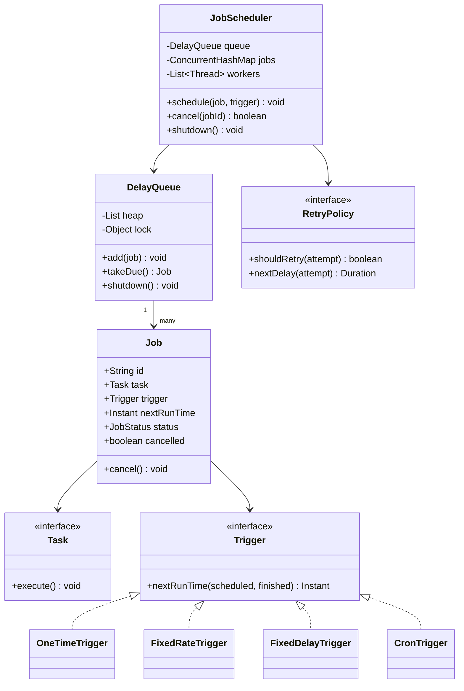
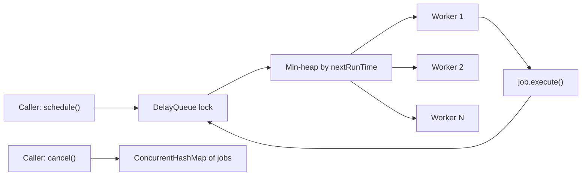

A task scheduler question tests whether you can build a correct producer-consumer system around time itself — jobs are not "ready" until a clock says so, and the queue has to wake workers at exactly the right moment without busy-spinning.

## Requirements

### Functional

- `scheduleOnce(job, delay)`, `scheduleAtFixedRate(job, interval)`, `scheduleWithFixedDelay(job, interval)`, and cron-style recurring schedules.
- A fixed worker pool executes jobs at or after their due time — never early.
- `cancel(jobId)` prevents future runs; a run already in flight is allowed to finish.
- A job that throws is logged and does not kill its worker or its future schedule.

### Non-functional and assumptions

- Single process, in-memory — persistence and distributed coordination are named extensions, not core requirements.
- Thread-safe under concurrent `schedule`/`cancel` calls from many callers while workers are executing jobs.
- The same job instance must never run concurrently with itself, even if one execution overruns its next scheduled time.
- `shutdown()` stops accepting new jobs and drains in-flight work cleanly.

### Clarifying questions to ask

> [!TIP]
> Ask about self-overlap early — "if a recurring job takes longer than its interval, does the next run wait, skip, or run in parallel?" — because the answer changes whether you need a per-job "is running" flag at all.

- How many schedule types are needed: one-time delay, fixed rate, fixed delay, full cron expressions?
- What is the worker pool size, and is it fixed or does it need to scale with load?
- What is the "missed run" policy if the scheduler was busy or paused — fire immediately, skip to the next slot, or fire once and catch up?
- Does cancellation need to interrupt a running job, or only prevent future runs?
- Is exactly-once execution required, or is at-least-once (with idempotent jobs) acceptable?

## Core objects

| Class | Responsibility | Key fields/methods |
|---|---|---|
| `Task` | Command pattern payload — the work itself | `execute()` |
| `Job` | Scheduling wrapper around a `Task` | `id`, `trigger`, `nextRunTime`, `status`, `cancel()` |
| `Trigger` | Strategy computing the next run time | `nextRunTime(scheduled, finished) -> Instant` |
| `OneTimeTrigger` / `FixedRateTrigger` / `FixedDelayTrigger` / `CronTrigger` | Concrete schedule types | `nextRunTime(...)` |
| `DelayQueue` | Thread-safe min-heap ordered by next-run time, blocks until due | `add(job)`, `takeDue() -> Job` |
| `WorkerPool` | Fixed threads pulling due jobs and executing them | `workers`, `workerLoop()` |
| `RetryPolicy` | Strategy for retrying a failed job | `shouldRetry(attempt)`, `nextDelay(attempt)` |
| `JobScheduler` | Public API, orchestrates queue + workers + registry | `schedule(...)`, `cancel(id)`, `shutdown()` |

## Class design



## Key design decisions

### Command pattern for job payloads, not a bag of parameters

`Task.execute()` is the only thing the scheduler knows about a job's actual work — whatever closure, service call, or batch operation it wraps is opaque to the scheduling machinery. The rejected alternative is passing a lambda plus loosely-typed parameters directly into `schedule()`; wrapping the work as a Command object instead lets a job carry its own state, be logged/serialized by identity, and be retried by simply calling `execute()` again without re-marshalling arguments.

### Strategy for trigger types, not a schedule-type enum with branches

`Trigger.nextRunTime(scheduled, finished)` is one method four different classes implement (one-time, fixed rate, fixed delay, cron). The rejected alternative — a `ScheduleType` enum and a `switch` inside the scheduler computing the next run — means every new schedule type (say, "run every weekday at 9am") requires editing shared scheduler code instead of adding one class.

| Trigger | Anchors next run on | Behaviour under a slow execution |
|---|---|---|
| Fixed rate | The *previous scheduled* time + interval | Catches up to "now" if it drifted, does not pile up missed runs |
| Fixed delay | The *previous finish* time + interval | Always a constant gap after the last run ends |
| Cron | The next matching wall-clock instant | Skips to the next valid slot if one was missed |

### Min-heap delay queue with a timed monitor wait, not polling

`DelayQueue.takeDue()` sleeps via `wait(delay)` on the queue's monitor for exactly as long as the head-of-heap job needs, waking early only if a new job is inserted ahead of it (`notifyAll` on insert). The rejected alternative — a worker loop that polls every N milliseconds — either wastes CPU (small N) or adds up to N milliseconds of needless delay to every job (large N); a timed wait gives exact wake-ups with zero idle spinning.

> [!TIP]
> A sorted `List<Job>` insert is O(n), which is fine for a few thousand jobs but worth naming as a known limit: swap it for a binary min-heap or a `PriorityQueue<Job>` ordered by next-run time (or the JDK's `java.util.concurrent.DelayQueue`) to get O(log n) insert/pop with the identical locking protocol, and at very large scale (millions of coarse-grained timers) consider a hashed timing wheel, which gives O(1) insert by bucketing jobs into fixed time slots rather than keeping a fully ordered structure.

### Re-add to the queue only after the run finishes, preventing self-overlap by construction

A recurring `Job` is popped out of the `DelayQueue` before `execute()` runs and is only re-added, with its next run time recomputed, inside a `finally` block after the run completes. The rejected alternative — leaving the job "in" the queue with a mutable next-run-time while workers pull by time — risks a second worker picking up the same job while the first execution is still running, since nothing removes it from eligibility during execution.

## Implementation

```java
public interface Task { void execute(); }

public enum JobStatus { SCHEDULED, RUNNING, CANCELLED, COMPLETED }

public interface Trigger {
    Instant nextRunTime(Instant scheduled, Instant finished); // null => no further runs
}

public class FixedRateTrigger implements Trigger {
    private final Duration interval;

    public FixedRateTrigger(Duration interval) {
        this.interval = interval;
    }

    @Override
    public Instant nextRunTime(Instant scheduled, Instant finished) {
        Instant next = scheduled.plus(interval);
        Instant now = Instant.now();
        return next.isBefore(now) ? now : next; // don't pile up missed slots
    }
}

public class Job {
    private final String id;
    private final Task task;
    private final Trigger trigger;
    private volatile Instant nextRunTime;
    private volatile JobStatus status = JobStatus.SCHEDULED;
    private volatile boolean cancelled;

    public Job(String id, Task task, Trigger trigger, Instant firstRun) {
        this.id = id;
        this.task = task;
        this.trigger = trigger;
        this.nextRunTime = firstRun;
    }

    public void cancel() {
        cancelled = true;
        status = JobStatus.CANCELLED;
    }

    public String getId() { return id; }
    public Task getTask() { return task; }
    public Trigger getTrigger() { return trigger; }
    public Instant getNextRunTime() { return nextRunTime; }
    public void setNextRunTime(Instant t) { nextRunTime = t; }
    public JobStatus getStatus() { return status; }
    public void setStatus(JobStatus s) { status = s; }
    public boolean isCancelled() { return cancelled; }
}

public class DelayQueue {
    private final List<Job> heap = new ArrayList<>(); // kept sorted by nextRunTime
    private final Object lock = new Object();
    private boolean running = true;

    public void add(Job job) {
        synchronized (lock) {
            if (!running) return;
            int index = 0;
            while (index < heap.size() && !heap.get(index).getNextRunTime().isAfter(job.getNextRunTime())) {
                index++;
            }
            heap.add(index, job);
            lock.notifyAll();
        }
    }

    public Job takeDue() {
        synchronized (lock) {
            while (running) {
                if (heap.isEmpty()) {
                    await(0); // wait until a job is added
                    continue;
                }

                Job head = heap.get(0);
                long delayMs = Duration.between(Instant.now(), head.getNextRunTime()).toMillis();

                if (delayMs <= 0) {
                    heap.remove(0);
                    if (head.isCancelled()) continue; // lazily drop cancelled jobs
                    return head;
                }
                await(delayMs);
            }
            return null;
        }
    }

    private void await(long millis) {
        try {
            lock.wait(millis);
        } catch (InterruptedException e) {
            Thread.currentThread().interrupt();
            running = false;
        }
    }

    public void shutdown() {
        synchronized (lock) {
            running = false;
            lock.notifyAll();
        }
    }
}

public class JobScheduler {
    private final DelayQueue queue = new DelayQueue();
    private final ConcurrentMap<String, Job> jobs = new ConcurrentHashMap<>();
    private final RetryPolicy retryPolicy;
    private volatile boolean running = true;

    public JobScheduler(int poolSize, RetryPolicy retryPolicy) {
        this.retryPolicy = retryPolicy;
        for (int i = 0; i < poolSize; i++) {
            Thread worker = new Thread(this::workerLoop, "scheduler-worker-" + i);
            worker.setDaemon(true);
            worker.start();
        }
    }

    public void schedule(String jobId, Task task, Trigger trigger, Duration delay) {
        Job job = new Job(jobId, task, trigger, Instant.now().plus(delay));
        jobs.put(jobId, job);
        queue.add(job);
    }

    public boolean cancel(String jobId) {
        Job job = jobs.remove(jobId);
        if (job == null) return false;
        job.cancel();
        return true;
    }

    private void workerLoop() {
        while (running) {
            Job job = queue.takeDue();
            if (job == null) break;

            Instant scheduledTime = job.getNextRunTime();
            try {
                job.setStatus(JobStatus.RUNNING);
                runWithRetry(job);
            } finally {
                reschedule(job, scheduledTime);
            }
        }
    }

    private void runWithRetry(Job job) {
        for (int attempt = 1; ; attempt++) {
            try {
                job.getTask().execute();
                return;
            } catch (Exception ex) {
                if (retryPolicy.shouldRetry(attempt)) {
                    System.out.println("[" + job.getId() + "] attempt " + attempt + " failed: " + ex.getMessage() + ", retrying");
                    try {
                        Thread.sleep(retryPolicy.nextDelay(attempt).toMillis());
                    } catch (InterruptedException ie) {
                        Thread.currentThread().interrupt();
                        return;
                    }
                } else {
                    System.out.println("[" + job.getId() + "] failed permanently: " + ex.getMessage());
                    return;
                }
            }
        }
    }

    private void reschedule(Job job, Instant scheduledTime) {
        Instant next = job.getTrigger().nextRunTime(scheduledTime, Instant.now());
        if (next != null && !job.isCancelled() && running) {
            job.setNextRunTime(next);
            job.setStatus(JobStatus.SCHEDULED);
            queue.add(job);
        } else {
            job.setStatus(JobStatus.COMPLETED);
            jobs.remove(job.getId());
        }
    }
}
```

## Concurrency and thread safety



Every arrow into the heap goes through the same lock; workers only ever touch the heap to take a due job or to re-add it after `finally`, never while `execute()` itself is running.

> [!WARNING]
> Self-overlap is the trap interviewers probe hardest: a naive design that leaves a recurring job's entry "in" the queue while it executes can let a second worker pick it up mid-run. The fix shown above is structural, not a lock — the job is physically absent from the heap during execution and is only re-inserted, with a freshly computed next-run-time, inside `finally` after the run completes.

| Shared state | Protection |
|---|---|
| The heap of pending jobs | Single `synchronized` block inside `DelayQueue`, held only for heap mutation, never during job execution |
| Worker wake-ups | `wait(timeout)` + `notifyAll` on every insert/shutdown — no busy polling |
| Job registry (for cancellation lookups) | `ConcurrentHashMap<String, Job>` |
| Cancellation flag | `volatile boolean`, checked on pop from the heap and again before rescheduling |
| Self-overlap | Prevented structurally — job is out of the queue for the full duration of `execute()` |

A deliberately rejected option is a lock per job in addition to the queue lock — nested locking invites deadlock for no real benefit here, since the queue lock is only ever held for O(log n) heap operations, never while a job's `execute()` runs.

## Extending the design

| New requirement | Where it plugs in | Why the design allows it |
|---|---|---|
| Cron expressions | New `CronTrigger implements Trigger` parsing an expression and returning the next matching instant | `Trigger` is already the sole seam for "what is the next run time" |
| Cooperative cancellation of a running job | Pass an `AtomicBoolean` cancel flag into `Task.execute(flag)`; `cancel()` also sets it (and can `Thread.interrupt()` the worker) | `Task` already isolates the work from the scheduling machinery |
| Missed-run policy (fire-now vs skip) | A configurable flag on `FixedRateTrigger`/`CronTrigger` controlling whether a stale next-run collapses to "now" or the next future slot | The clamp logic already lives in one place per trigger |
| Observability (metrics, tracing) | Wrap `Task.execute()` in a decorator that records duration/success before delegating | Command pattern means jobs are already objects that can be wrapped |
| Distributed scheduling across nodes | Move the heap to a shared store (DB row or Redis sorted set); nodes atomically claim a due job with a lease and heartbeat | The single-node contract (`takeDue` returns one job, exactly one worker executes it) is exactly what a distributed claim-with-lease must also guarantee |
| One slow job starving the whole pool | Wrap `execute()` with a timeout that logs an overrun, or split workers into separate fast/slow pools by job class | `Task` is already opaque to the scheduler, so isolating one class of job to its own pool needs no change to `DelayQueue` or the scheduling loop |

> [!NOTE]
> Going distributed is the standard closing question. The key insight to state: the in-process `DelayQueue` lock and the distributed "claim a due row with `UPDATE ... WHERE status='SCHEDULED'`" pattern solve the *same* problem — ensuring exactly one consumer wins a due job — just moved from an in-memory mutex to a database's row-level locking or an atomic `ZPOPMIN` in Redis.

## Cheat sheet

- Command pattern (`Task.execute()`) keeps the scheduler ignorant of what work actually does — enables retry, logging and decoration for free.
- Strategy pattern (`Trigger`) keeps schedule types (one-time, fixed rate, fixed delay, cron) independent and addable without touching the scheduler.
- A recurring job must be **out of the queue** for its entire execution — that is what prevents self-overlap, not a per-job lock.
- Use `wait(timeout)` + `notifyAll`, never polling, to wake a worker at exactly the right time.
- Fixed rate anchors on scheduled time (catches up, but clamps to avoid a pile-up of missed runs); fixed delay anchors on finish time (constant gap).
- A job that throws must be caught inside the worker loop — never let an exception escape and kill a worker thread or the schedule.
- `cancel()` sets a flag and removes from the registry; an in-flight run is allowed to finish, future runs are suppressed.
- Distributed scheduling is the same "exactly one consumer claims a due item" problem, moved to a shared store with leases instead of an in-memory lock.

## Common mistakes

| Mistake | Fix |
|---|---|
| Letting a recurring job stay logically "in the queue" during execution | Pop before running, re-add only in `finally` after it finishes |
| Busy-polling the queue every N ms | Use a timed `wait` that wakes exactly when the head job is due |
| An unhandled exception in a job killing its worker thread | Wrap `execute()` in try/catch inside the worker loop |
| Confusing fixed rate with fixed delay | State explicitly which time each anchors on — scheduled vs finish |
| No missed-run policy after a pause | Decide and document fire-now-once vs skip-to-next-slot |
| A single lock guarding both the queue *and* job execution | Lock only heap mutation; never hold the queue lock while a job runs |

## Summary

A task scheduler is a delay-aware producer-consumer system: a min-heap `DelayQueue` orders jobs by next-run time and wakes workers with a timed wait rather than polling, a fixed worker pool drains due jobs, and Command (`Task`) plus Strategy (`Trigger`) keep "what runs" and "when it runs next" both pluggable and independent of the scheduling machinery. Self-overlap is prevented structurally by removing a job from the queue for the full duration of its execution, retries and missed-run policy are handled per trigger/job rather than in the core loop, and the same "exactly one consumer claims a due item" contract is what a distributed version must replicate over a shared store with leases.

## Top Interview Questions

### Q1. How do you wake a worker at exactly the right time without polling?

Use a monitor (lock + condition variable): `takeDue()` computes the delay until the head-of-heap job is due and calls `wait(delay)`, which sleeps the thread efficiently until either that timeout elapses or another thread calls `notify`/`notifyAll`. Every `add()` call notifies after inserting, so if a newly scheduled job is now earlier than what the worker was waiting for, the worker wakes immediately and recomputes the correct (shorter) wait instead of oversleeping. This gives exact, zero-idle-CPU wake-ups, unlike a polling loop that either wastes CPU checking too often or adds latency by checking too rarely.

### Q2. How do you guarantee a recurring job never runs concurrently with itself?

Structure the queue so a job is physically removed from the heap the moment a worker takes it, and only re-inserted — with a freshly computed next-run-time — inside a `finally` block after `execute()` completes. Because the job simply is not present in the "due" structure while it runs, no other worker can ever pull it out a second time; this is a structural guarantee rather than a lock you have to remember to take, which is more robust because there is no code path where it can be forgotten.

### Q3. What's the difference between fixed-rate and fixed-delay scheduling, and why does it matter which one you pick?

Fixed-rate anchors the next run on the *previous scheduled* time plus the interval, aiming for a steady cadence (e.g. exactly every 60 seconds) — if one execution runs long, the next run is computed to catch up towards "now" rather than drifting forever, though a sane implementation clamps this so a very slow run does not trigger a burst of catch-up executions. Fixed-delay anchors on the *previous finish* time plus the interval, guaranteeing a constant gap between the end of one run and the start of the next, which is right for tasks like "wait 60 seconds after this poll finishes before polling again" where overlapping or back-to-back polls would be wasteful or harmful.

### Q4. Why use the Command pattern (`Task.execute()`) instead of just passing a `Runnable`/lambda directly into `schedule()`?

A lambda works for the simplest case, but wrapping the work as a Command object (`Task`) gives you a stable place to attach identity, logging, retry state, and decorators — you can wrap a `Task` in a `LoggingJob` or `MetricsJob` decorator that records timing and success/failure before delegating to `execute()`, without the scheduler's core loop needing to know any of that happened. It also makes serialization and distributed scheduling feasible later, since a Command object with well-defined state is far easier to persist and reconstruct than a captured closure.

### Q5. A job throws an exception every time it runs — what should the scheduler do, and why?

The scheduler must catch the exception inside the worker loop (never let it propagate out of `workerLoop`), log it, and apply the configured retry policy for that individual failure. Critically, the *schedule itself* must survive: after logging or exhausting retries for this run, the job must still be rescheduled for its next trigger time as normal — a job that fails repeatedly should not silently stop running forever, and a worker thread must never die because of one bad job, since that would silently reduce the pool's capacity for every other job too.

### Q6. How would you support cooperative cancellation of a job that is already executing?

You cannot safely force-kill a running thread in most managed runtimes without risking corrupted shared state, so cancellation of in-flight work must be cooperative: pass an `AtomicBoolean` cancel flag into `Task.execute(flag)`, have long-running jobs poll it (or check `Thread.interrupted()` and pass the flag down into cancellable I/O calls like HTTP requests), and have `cancel()` both mark the job as cancelled for future scheduling *and* set the flag (and optionally `Thread.interrupt()` the worker) so an already-running execution can notice and exit early. The scheduler's contract stays "future runs are suppressed"; whether the current run stops early depends on that job's own code honoring the flag or interrupt.

### Q7. What is a "missed run" and what policies can handle it?

A missed run happens when the scheduler was paused, overloaded, or the process was down, and a job's scheduled time has already passed by the time it is next considered. Two common policies: "fire now" (`FIRE_NOW`), where the job runs immediately to catch up, and "skip" (`SKIP_MISSED`), where the scheduler jumps straight to the next valid future slot and treats the missed one as lost. Fixed-rate scheduling additionally needs a clamp to avoid a related but distinct problem — firing a burst of *many* missed intervals back-to-back after a long pause — by capping the catch-up to at most one immediate run before resuming the normal cadence.

### Q8. How would this design change to become a distributed scheduler across multiple nodes?

Move the shared queue out of process into a store all nodes can see — a database table with a `nextRunTime` column and an atomic claim query (`UPDATE jobs SET owner = :node, status = 'CLAIMED' WHERE id = :id AND status = 'SCHEDULED'`), or a Redis sorted set popped with `ZPOPMIN`. Each node runs its own worker pool pulling from this shared store instead of an in-memory heap, and holds a lease with a periodic heartbeat on any job it is executing so that if the node crashes mid-run, another node can detect the expired lease and reclaim the job. The single-node contract — exactly one worker executes a given due job at a time — is preserved, just enforced by the store's atomicity instead of an in-process lock.

### Q9. Why avoid a lock per individual job in addition to the queue's lock?

Introducing a second lock scope (per-job) alongside the queue's lock creates the classic conditions for deadlock — if code ever needs to acquire both locks in different orders across different call paths, two threads can each hold one lock and wait for the other. Since the queue lock in this design is only ever held briefly for heap mutation (insert/remove), and never while a job's `execute()` is running, there is no actual contention window that a second, finer-grained lock would meaningfully shrink — it would only add complexity and deadlock risk for no throughput benefit.

### Q10. How would you test that a `FixedRateTrigger` correctly catches up after a slow execution without piling up runs?

Inject a fake/controllable clock (the same pattern used for rate limiters and caches) so the test can simulate "this execution took much longer than the interval" deterministically. Assert that `nextRunTime(scheduled, finished)` returns "now" (catching up to a single immediate run) rather than a time in the past, and separately assert that calling it again immediately afterward returns a time properly spaced by the interval from that catch-up point — proving the trigger clamps to prevent an unbounded burst of back-to-back "missed" runs firing all at once.

### Q11. How would you add observability (success/failure counts, run duration) without modifying `JobScheduler` or `Task` implementations?

Introduce a decorator, `InstrumentedJob implements Task`, that wraps any existing `Task`, records a start timestamp, calls the inner job's `execute()`, and records duration and success/failure (via try/catch) to a metrics sink afterward, then have `schedule()` accept jobs already wrapped this way (or wrap them internally before enqueuing). Because `Task` is just an interface with one method, any implementation can be transparently wrapped without either the scheduler's core loop or the original job's logic needing any awareness that instrumentation is happening.

### Q12. Why does the design prefer catching exceptions per-attempt inside `runWithRetry` rather than retrying by simply re-enqueuing the job into the `DelayQueue`?

Retrying inline (looping with a short sleep inside the same worker) keeps the retry attempts as part of the same logical execution — the job is never re-exposed to `takeDue()` as a fresh eligible entry mid-retry, which avoids a subtle self-overlap risk where re-enqueuing on failure could race with the job's own next legitimate scheduled run if the retry window is shorter than the recurring interval. The trade-off is that a worker thread is occupied for the full duration of all retry attempts of one job; for retries with long backoff delays, re-enqueuing with a `nextRunTime` in the future (freeing the worker in the meantime) is a reasonable alternative, as long as the job's cancelled/cancelled-during-retry state is still checked before each attempt.
