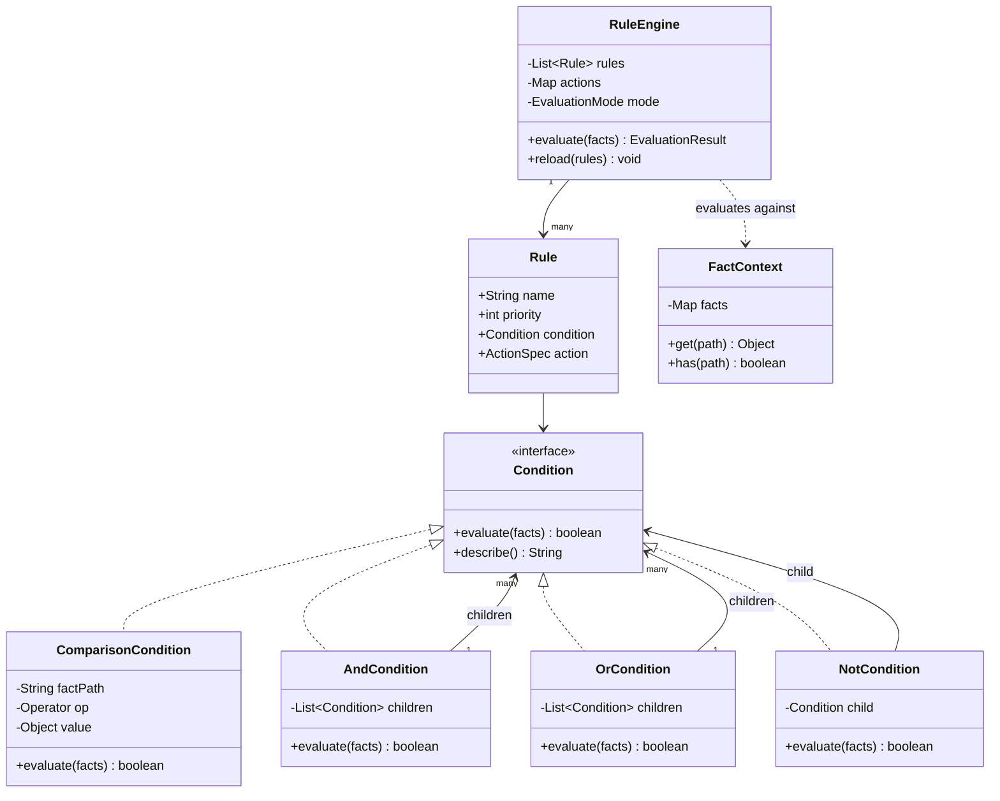
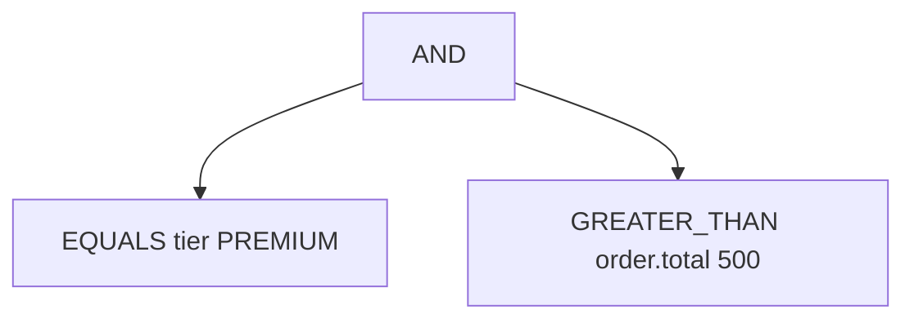

A rule engine question is fundamentally about representing arbitrarily nested logic as a data structure instead of code, so business rules can change in configuration without a deployment.

## Requirements

### Functional

- Load rules from configuration: a name, a priority, a condition tree, and an action.
- Conditions compose: comparison leaves (`EQUALS`, `GREATER_THAN`, `IN`, `CONTAINS`, ...) combined via `AND`/`OR`/`NOT`, nested to any depth.
- Facts are addressed by dot-path (`"order.total"`) against a nested structure.
- Evaluate rules in descending priority order; support both `FIRST_MATCH` (stop after one) and `ALL_MATCHES` modes.
- A missing fact makes its condition evaluate to `false` rather than throwing.
- Report which rules matched and why, for debugging.

### Non-functional and assumptions

- Single-pass evaluation — no forward chaining (an action does not re-trigger evaluation) in the base design.
- Rules are loaded at startup but must support a hot-reload path without restarting the process.
- Evaluation must be fast enough to run per-request against dozens to thousands of rules.
- Adding a new operator or action type must not require touching the evaluation engine's core loop.

### Clarifying questions to ask

> [!TIP]
> The best opening line for this problem: "a condition is a tree, and every node answers the same question — evaluate(facts) → boolean. That's what lets nesting be unlimited with zero special-casing." Say this before writing any code.

- Do all matching rules fire, or only the highest-priority match?
- Can an action's effect feed back into evaluation (forward chaining), or is it strictly single-pass?
- What happens when two rules of equal priority both match and their actions conflict?
- Are rules hot-reloaded, and if so, must in-flight evaluations see a consistent snapshot?
- Do we need an explanation of *why* a rule did or did not match, for debugging in production?

## Core objects

| Class | Responsibility | Key fields/methods |
|---|---|---|
| `RuleEngine` | Orchestrator, evaluates rules against facts | `rules` (sorted), `actions`, `evaluate(facts)` |
| `Rule` | Name + priority + condition + action | `name`, `priority`, `condition`, `action` |
| `Condition` | Composite contract — leaf or logical node | `evaluate(facts) -> boolean`, `describe() -> String` |
| `ComparisonCondition` | Leaf — compares one fact to a value | `factPath`, `op`, `value` |
| `AndCondition` / `OrCondition` / `NotCondition` | Composite logical nodes | `children` (or `child`) |
| `FactContext` | Dot-path fact lookup | `get(path)`, `has(path)` |
| `ConditionFactory` | Recursively builds a condition tree from config | `create(node) -> Condition` |
| `ActionHandler` | Strategy — executes a matched rule's action | `execute(params, facts) -> Object` |
| `RuleBuilder` | Fluent construction of a `Rule` in code | `.when(...)`, `.then(...)`, `.withPriority(...)` |

## Class design



## Key design decisions

### Composite pattern for the condition tree, not a flattened expression list

Every `Condition` — whether a leaf comparison or an `AND`/`OR`/`NOT` node — implements the same `evaluate(facts) -> boolean` method, so a parent node can call `child.evaluate()` without knowing or caring whether the child is a leaf or another deeply nested subtree. The rejected alternative — flattening conditions into a list of clauses joined by a single top-level operator — cannot express arbitrary nesting like `(A AND B) OR (C AND NOT D)` without a second-class "grouping" hack bolted on.



### Recursive factory for building the tree from configuration, not a hand-written parser per shape

`ConditionFactory.create(node)` recurses: `AND`/`OR` map their `children` array through `create` again, `NOT` recurses once, anything else builds a `ComparisonCondition` leaf. The rejected alternative — bespoke parsing code for each possible JSON shape — duplicates the same recursive structure by hand and is far more error-prone; the factory's ~15 lines mirror the config's nesting exactly.

### Strategy map for operators and actions, not `switch` statements sprinkled through the codebase

Comparison operators and action types are both looked up from a `Map<K, V>` of function/handler registrations rather than `switch` statements. The rejected alternative — a `switch (op)` inside `ComparisonCondition` — means every new operator (say, `REGEX_MATCH`) requires editing a shared method; a map registration means a new operator is one line added at startup, and third-party teams can register their own action handlers without touching engine code at all.

| Concern | Chosen approach | Alternative rejected |
|---|---|---|
| New operator | Add one entry to an operator map | Edit a shared `switch` in `ComparisonCondition` |
| New action type | Implement `ActionHandler`, register under a key | Edit a shared `switch` in the engine's dispatch |

### Fluent `RuleBuilder` for code-defined rules, distinct from the JSON `ConditionFactory` path

`RuleBuilder` gives a readable, type-checked way to construct rules directly in Java (`.when(condition).then(action).withPriority(10)`) for tests and for rules that are shipped with the application rather than loaded externally. This is deliberately a separate concern from `ConditionFactory`, which builds the identical `Condition` tree from untyped JSON — both converge on the same `Condition`/`Rule` objects, so the evaluation engine never needs to know which path built them.

## Implementation

```java
public enum Operator { EQUALS, NOT_EQUALS, GREATER_THAN, LESS_THAN, IN, CONTAINS }

public interface Condition {
    boolean evaluate(FactContext facts);
    String describe();
}

public class ComparisonCondition implements Condition {
    private static final Map<Operator, BiPredicate<Object, Object>> OPS = Map.of(
        Operator.EQUALS,       Objects::equals,
        Operator.NOT_EQUALS,   (a, b) -> !Objects.equals(a, b),
        Operator.GREATER_THAN, (a, b) -> toDouble(a) > toDouble(b),
        Operator.LESS_THAN,    (a, b) -> toDouble(a) < toDouble(b),
        Operator.IN,           (a, b) -> ((Collection<?>) b).contains(a),
        Operator.CONTAINS,     (a, b) -> ((Collection<?>) a).contains(b)
    );

    private final String factPath;
    private final Operator op;
    private final Object value;

    public ComparisonCondition(String factPath, Operator op, Object value) {
        this.factPath = factPath;
        this.op = op;
        this.value = value;
    }

    @Override
    public boolean evaluate(FactContext facts) {
        Object actual = facts.get(factPath);
        return actual != FactContext.MISSING && OPS.get(op).test(actual, value);
    }

    @Override
    public String describe() {
        return factPath + " " + op + " " + value;
    }

    private static double toDouble(Object o) {
        return ((Number) o).doubleValue();
    }
}

public class AndCondition implements Condition {
    private final List<Condition> children;

    public AndCondition(List<Condition> children) {
        this.children = children;
    }

    @Override
    public boolean evaluate(FactContext facts) {
        return children.stream().allMatch(c -> c.evaluate(facts)); // short-circuits
    }

    @Override
    public String describe() {
        return "(" + children.stream().map(Condition::describe).collect(Collectors.joining(" AND ")) + ")";
    }
}

public class RuleEngine {
    private volatile List<Rule> rules; // swapped atomically on reload for lock-free hot reload
    private final Map<String, ActionHandler> actions;
    private final EvaluationMode mode;

    public RuleEngine(List<Rule> rules, Map<String, ActionHandler> actions, EvaluationMode mode) {
        this.rules = sortedByPriority(rules);
        this.actions = actions;
        this.mode = mode;
    }

    public void reload(List<Rule> rules) {
        this.rules = sortedByPriority(rules); // atomic reference swap
    }

    private static List<Rule> sortedByPriority(List<Rule> rules) {
        return rules.stream()
            .sorted(Comparator.comparingInt(Rule::getPriority).reversed())
            .toList();
    }

    public EvaluationResult evaluate(Map<String, Object> facts) {
        FactContext context = new FactContext(facts);
        EvaluationResult result = new EvaluationResult();
        List<Rule> snapshot = rules; // consistent view even if reload races concurrently

        for (Rule rule : snapshot) {
            boolean matched = rule.getCondition().evaluate(context);
            result.getTrace().add(rule.getName() + " [" + rule.getCondition().describe() + "] => " + matched);
            if (!matched) continue;

            ActionHandler handler = actions.get(rule.getAction().getType());
            if (handler != null) {
                result.getMatched().add(new MatchedRule(rule.getName(),
                    handler.execute(rule.getAction().getParams(), context)));
            }

            if (mode == EvaluationMode.FIRST_MATCH) break;
        }
        return result;
    }
}
```

## Concurrency and thread safety

> [!KEY]
> Hot reload is solved with an **atomic reference swap**, not a lock. `rules` is a `volatile` field holding an immutable, already-sorted `List<Rule>`; `reload()` builds a brand-new list and assigns it in one atomic reference write. Any `evaluate()` in flight captured its own `snapshot` reference at the start and keeps using it to completion, so a reload can never leave one evaluation reading rules from two different generations.

- The condition tree itself is immutable after construction, so many threads can call `evaluate()` concurrently on the same `Rule` objects with zero synchronization needed.
- `FactContext` wraps a single evaluation's facts and is never shared or mutated across threads — each `evaluate()` call gets its own.
- `ActionHandler` implementations that touch shared state (e.g. writing to a database) are responsible for their own thread safety; the engine does not serialize action execution.
- Avoid a naive "reload in place by mutating the existing list" approach — that requires a reader-writer lock around every `evaluate()` call, adding contention to the hot evaluation path for an operation (reload) that happens rarely.

## Extending the design

| New requirement | Where it plugs in | Why the design allows it |
|---|---|---|
| New operator (`REGEX_MATCH`) | One entry in the operator strategy map | `ComparisonCondition` never branches on a hardcoded `switch` |
| New action type | Implement `ActionHandler`, register under a string key | Actions are looked up, not hardcoded, in `RuleEngine.evaluate` |
| Forward chaining | Loop evaluation: actions write derived facts back into `FactContext`, re-evaluate until no new rule fires or a max-iteration cap trips | `FactContext` is already the single source of truth conditions read from |
| Rule indexing at scale (10,000+ rules) | Build `Map<factPath, List<Rule>>` at load time; only evaluate rules whose indexed fact is present | Rules are already data, not code — indexing is a load-time transform over that data |
| Conflict resolution when multiple rules fire | `ALL_MATCHES` mode plus an explicit tie-break (priority, then declaration order, then a configured resolver) | `EvaluationResult.getMatched()` already carries every firing rule for a resolver to post-process |
| Validating a rule before it goes live | At load time, reject unknown operators/action types and malformed or unreachable condition trees; before enabling, replay the new rule set in shadow mode over recorded facts and diff the outcomes against production | `ConditionFactory.create` already fails fast on a malformed node, and `EvaluationResult` is already the exact diffable artifact a shadow-mode comparison needs |

> [!DANGER]
> "10,000 rules and this evaluates every single one" is the classic scale follow-up. The fix is indexing by the most selective fact at load time, **and** ordering `AND` children so the cheapest/most-selective check runs first — short-circuiting means a false first child skips evaluating the rest, which matters a lot once conditions have expensive children like a `CONTAINS` over a large list.

## Cheat sheet

- A condition is a tree; every node — leaf or `AND`/`OR`/`NOT` — implements the same `evaluate(facts) -> boolean`. That single idea is what makes nesting unlimited.
- `ConditionFactory.create` recurses exactly the shape of the config JSON — no special-casing per depth.
- Operators and actions are strategy maps, not `switch` statements, so new ones are additive, not edits to shared code.
- A missing fact evaluates to `false`, never throws — this belongs entirely inside the leaf `ComparisonCondition`, nowhere else.
- Hot reload = atomic reference swap of an immutable sorted list, never in-place mutation with a lock.
- `FIRST_MATCH` breaks after the first firing rule in priority order; `ALL_MATCHES` continues and needs an explicit conflict-resolution policy.
- Short-circuit `AND`/`OR` and order children cheapest-first once you have many rules — this is the real answer to "how do you make this fast at scale".
- Return a structured trace (`ruleName`, `condition description`, `matched boolean`), not just strings, so "why didn't this rule fire" is answerable without re-running anything.

## Common mistakes

| Mistake | Fix |
|---|---|
| Throwing when a referenced fact is missing | Treat a missing fact as `false` inside the leaf condition only |
| A `switch` on operator/action type in shared code | Use a strategy map keyed by operator/action type |
| Mutating the live rule list in place for reload | Build a new sorted list and swap the reference atomically |
| No conflict-resolution story for `ALL_MATCHES` | Define an explicit tie-break: priority, then order, then a resolver hook |
| Flattening conditions instead of a real tree | Use Composite so arbitrary nesting needs zero special-casing |
| Evaluating every rule against every fact with no indexing | Index rules by their most selective fact at load time |

## Summary

A rule engine is a Composite tree of conditions evaluated against a fact context, where every node — comparison leaf or logical combinator — answers the same `evaluate(facts) -> boolean` question, which is what lets rules nest arbitrarily deep with no special-casing. Operators and actions are strategy lookups rather than branching logic, keeping the engine open to new operators and action types without edits to shared code. Hot reload is an atomic swap of an immutable, pre-sorted rule list rather than a locked in-place mutation, and at scale the two levers that matter are indexing rules by their most selective fact and ordering condition children so short-circuiting does the least work possible.

## Top Interview Questions

### Q1. Why is the Composite pattern the right fit for nested rule conditions?

Composite lets a leaf node (a single comparison like `order.total > 500`) and a composite node (`AND`/`OR`/`NOT` combining other nodes) share one interface — `evaluate(facts) -> boolean` — so a parent never needs to know whether its child is a leaf or another arbitrarily deep subtree; it just calls `evaluate` and gets a boolean back. This uniformity is exactly what allows conditions to nest to any depth with zero special-case code: `AndCondition.evaluate` is the same three-line loop whether its children are all leaves or each is itself a ten-level nested tree.

### Q2. Why does a missing fact evaluate to false instead of throwing an exception?

Rules are meant to describe business conditions robustly against incomplete or evolving data — if `customer.loyaltyTier` does not exist for a given customer, a rule checking `customer.loyaltyTier == "GOLD"` should simply not match, not crash the entire evaluation pass for every other rule as well. Treating a missing fact as `false` inside the leaf `ComparisonCondition` keeps this behaviour localized and predictable, and lets rule authors write conditions without needing to null-check every fact path defensively before referencing it.

### Q3. How would you add a brand-new operator, like `REGEX_MATCH`, with minimal risk to existing rules?

Add one entry to the operator strategy map — `Operator.REGEX_MATCH` mapped to `(actual, pattern) -> Pattern.matches(pattern.toString(), actual.toString())` — and one corresponding enum value. Because `ComparisonCondition.evaluate` looks the function up from the map rather than branching in a `switch`, no existing code path for any other operator is touched, which means no existing rule's behaviour can regress from this change — the blast radius of the change is exactly one new map entry.

### Q4. How does the design support hot-reloading rules without locking every evaluation?

`RuleEngine` holds its sorted rule list in a single reference field; `reload()` builds an entirely new, independently sorted list from the new configuration and assigns it to that field in one atomic reference write — it never mutates the existing list in place. Any `evaluate()` call already in progress captured its own local reference to the list at the start of the call, so it continues operating against a fully consistent snapshot even if a reload happens concurrently on another thread; no lock is needed on the read path because reads are just reference reads, and reference assignment is atomic.

### Q5. Two rules of equal priority both match under `ALL_MATCHES` mode and their actions conflict (e.g. one applies a 10% discount, another applies a 20% discount). How do you resolve this?

This must be an explicit policy decision, not left implicit: common options are "highest priority wins" (requires breaking the tie with a secondary key, such as declaration order or rule name), "most specific condition wins" (a rule with more `AND` clauses is considered more targeted), or "apply a resolver function" that inspects all matched rules' actions and combines or picks among them (e.g. always take the largest discount, or refuse to combine and flag a configuration error). The engine's job is to surface all matches via `EvaluationResult.getMatched()`; the resolution policy itself belongs in a pluggable component downstream so it can change without touching the evaluation engine.

### Q6. How would you make rule evaluation fast when there are 10,000 rules but a request's facts only touch a handful of them?

Build an index at load time mapping each distinct fact path referenced by any rule's top-level condition to the list of rules that reference it — `Map<factPath, List<Rule>>` — and at evaluation time, only consider rules whose indexed fact paths are actually present in the incoming facts, skipping the rest entirely. Additionally, order the children of every `AND` condition so the cheapest and most selective check runs first, since `AndCondition.evaluate` short-circuits on the first `false` — a rule with a cheap equality check before an expensive `CONTAINS` over a large list should have the equality check ordered first.

### Q7. What is forward chaining, and why is it explicitly out of scope for a basic single-pass rule engine?

Forward chaining means an action's effect (writing a new or updated fact) can cause previously non-matching rules to now match, requiring another evaluation pass — potentially repeating until a fixed point where no new rule fires. It is out of scope for a basic engine because it introduces real complexity: you need a termination guarantee (a max-iteration cap to prevent infinite loops from two rules toggling each other's trigger conditions back and forth) and a much harder debugging story (which of several cascading passes caused a given outcome). The addressable extension is a bounded loop — re-run `evaluate` against the updated `FactContext` until no new rule fires or the iteration cap is hit — layered on top of the existing single-pass engine rather than baked into its core loop.

### Q8. Compare a hand-parsed condition tree per rule shape versus a recursive `ConditionFactory`.

A hand-parsed approach writes distinct code for every shape of JSON node encountered (one code path for an `AND` node, another for a comparison node, etc.) usually as a large `if/else` chain checked against the config's structure — this duplicates, by hand, exactly the recursive structure the config already has, and every new operator or nesting pattern risks missing a case. A recursive `ConditionFactory.create(node)` instead directly mirrors the config's own recursive shape: `AND`/`OR` map their children array back through `create`, `NOT` recurses on its single child, and anything else builds a leaf — about 15 lines handles arbitrary nesting because the recursion *is* the parser, rather than simulating one.

### Q9. How would you explain to a business user why a specific rule did not fire, without needing to reproduce the request?

Have every `Condition.evaluate` call also populate a structured trace node (not just a string) with the condition's description, its boolean result, and the actual fact value that was compared, recursively for every child in the tree — rather than a flat log line per rule. When a rule fails to match, you can then walk its condition tree's trace top-down and find the exact leaf that evaluated to `false`, along with what value it saw and what it expected, which turns "why didn't this fire" from a debugging session into a direct lookup in the trace output.

### Q10. Why keep the fluent `RuleBuilder` (for code-defined rules) as a separate concern from the JSON `ConditionFactory`?

They serve genuinely different authors and different lifecycles: `ConditionFactory` parses rules that arrive as external configuration (so business analysts or a config service can change behaviour without a deployment), while `RuleBuilder` is for rules that are authored directly in code — typically in tests, or for rules that are logically part of the application itself rather than externally configurable. Both converge on building the identical `Condition`/`Rule` object graph, so `RuleEngine.evaluate` never needs to know or care which path constructed a given rule — keeping them separate avoids forcing test code to round-trip through JSON just to build a rule for a unit test.

### Q11. How would you unit test a deeply nested condition tree in isolation, without loading it from JSON or wiring up a full `RuleEngine`?

Construct the `Condition` tree directly using the fluent builder or by composing `ComparisonCondition`/`AndCondition`/`OrCondition` objects by hand in the test, build a `FactContext` from a plain map of test facts, and assert directly on `condition.evaluate(context)`. Because `Condition` is a pure function of facts to a boolean with no dependency on the engine, the action registry, or configuration parsing, you can test even a five-level nested `AND(OR(...), NOT(...))` tree with a handful of focused unit tests, each asserting one specific combination of fact values against the expected boolean outcome.

### Q12. What would you monitor in production to catch a rule engine problem before it causes a business-visible incident?

Track evaluation latency per request (a regression here often means too many unindexed rules or an expensive leaf condition like a large `CONTAINS`), the distribution of which rules match most often (a sudden shift can indicate a bad rule deployed or a change in upstream data), and the rate of "no handler registered for action type" trace entries (indicating a rule references an action that was never wired up, a common deployment-ordering bug when rules and action handlers ship on different cadences). Alerting on `ALL_MATCHES` evaluations that return an unusually large number of matched rules is also valuable — it can reveal a rule whose condition is far broader than intended, matching far more traffic than the business owner expects.
