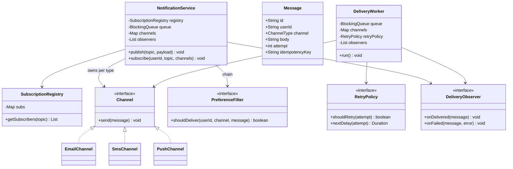
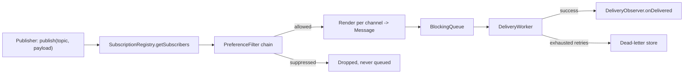

A notification service question tests whether you can fan one event out to many channels and many users asynchronously, while still surviving a flaky SMS provider without losing or duplicating messages.

## Requirements

### Functional

- Publishers emit events (`publish(topic, payload)`); the service fans out to every user subscribed to that topic, across every channel they opted into (email, SMS, push, in-app).
- `publish()` is fire-and-forget — it must return immediately, before any delivery happens.
- Each channel renders its own template (SMS short, email rich HTML, push a short title/body).
- Failed deliveries retry with backoff up to a configured limit, then move to a dead-letter store.
- Delivery status callbacks (sent, failed, bounced) are observable by other parts of the system (analytics, support tooling).

### Non-functional and assumptions

- In-memory queue for the base design, explicitly built to be swappable for Kafka/SQS later.
- At-least-once delivery is acceptable, provided sends are idempotent — a retried send must not become a duplicate notification to the user.
- One slow or down channel provider must not delay or block delivery on other channels.
- User preferences (opted-in channels, quiet hours, do-not-disturb) must be checked before a message is queued, not after.

### Clarifying questions to ask

> [!TIP]
> Ask "is publish synchronous or fire-and-forget" first — the entire architecture (queue, workers, retry) only exists because the answer is fire-and-forget. If it were synchronous, this would just be a fan-out loop with no scheduling concerns at all.

- Is delivery ordering required, or is best-effort acceptable across channels and across users?
- How many retry attempts, and with what backoff, before a message is permanently dead-lettered?
- Do we need per-user throttling (e.g. no more than 3 marketing pushes per day) in addition to per-topic delivery?
- What counts as a duplicate — same event ID, or same rendered content to the same user on the same channel?
- Is the in-memory queue acceptable for this exercise, with a distributed queue as a named future step?

## Core objects

| Class | Responsibility | Key fields/methods |
|---|---|---|
| `NotificationService` | Facade — publish, subscribe, lifecycle | `publish(topic, payload)`, `subscribe(user, topic, channels)` |
| `SubscriptionRegistry` | Who wants what, on which channels | `getSubscribers(topic)` |
| `Channel` | Strategy — one delivery mechanism | `send(message)` |
| `ChannelFactory` | Builds/resolves the right `Channel` per type | `create(channelType) -> Channel` |
| `PreferenceFilter` | Chain of Responsibility — opt-out, quiet hours, throttle | `shouldDeliver(user, channel, message) -> boolean` |
| `Message` | One rendered delivery unit | `userId`, `channel`, `body`, `attempt`, `idempotencyKey` |
| `RetryPolicy` | Strategy — retry timing and limits | `shouldRetry(attempt)`, `nextDelay(attempt)` |
| `DeliveryObserver` | Observer for delivery-status callbacks | `onDelivered(message)`, `onFailed(message, error)` |
| `DeliveryWorker` | Consumer draining the queue, invoking channels | `run()` |

## Class design



### Publish to delivery, end to end



`publish` only walks the left half of this diagram — registry lookup, filtering, rendering, enqueue — and returns. Everything from the queue onward runs on a worker thread, which is exactly what makes the publisher's call fire-and-forget.

## Key design decisions

### Strategy + Factory for channels, not a branching `Send` method

`Channel` is the strategy (`send(message)`), and a `ChannelFactory`/registry map resolves the concrete channel from a `ChannelType`. The rejected alternative — one `NotificationSender` class with `if (channel == EMAIL) ... else if (channel == SMS) ...` — means adding WhatsApp requires editing shared dispatch code; with Strategy, it is a new class implementing `Channel` plus one registry entry, and workers never change.

### Chain of Responsibility for preference/opt-out/throttle checks, run before enqueueing

`PreferenceFilter` implementations (opt-out check, quiet-hours check, per-user throttle) are chained and run at fan-out time, before a `Message` is ever created or queued — so a suppressed notification never occupies queue space or a worker slot. The rejected alternative — checking preferences inside the worker right before sending — wastes queue capacity on messages that will be dropped anyway, and delays the drop decision until much later than necessary.

| Approach | When suppressed | Queue impact |
|---|---|---|
| Filter before enqueue (chosen) | At fan-out time | Suppressed messages never enter the queue |
| Filter inside the worker | At send time | Queue holds messages that will be dropped |

### Observer pattern for delivery-status callbacks, decoupled from the send path

`DeliveryObserver.onDelivered`/`onFailed` are invoked by the worker after every send attempt, and any number of independent listeners (analytics, support dashboards, billing) can subscribe without the channel or worker code knowing who is listening. The rejected alternative — the worker calling specific downstream services directly (`analyticsService.record(...)`, `supportService.log(...)`) — couples the delivery path to every consumer of that status, so adding a new consumer means editing the worker.

### Idempotency key on every message instead of trusting "retry means resend safely"

Every `Message` carries an `idempotencyKey = hash(eventId, userId, channel)`; a channel provider that supports idempotency keys natively (many SMS/email providers do) is passed this key so a retried request that actually succeeded upstream — but whose response was lost — does not create a second real-world message. The rejected alternative — retrying with no dedup key — risks double-sending exactly in the failure mode retries exist to handle (uncertain outcome of a prior attempt).

## Implementation

```java
public enum ChannelType { EMAIL, SMS, PUSH }

public interface Channel { void send(Message message); } // throws on transient failure

public class Message {
    private final String id;
    private final String userId;
    private final ChannelType channel;
    private final String body;
    private int attempt;
    private final String idempotencyKey;

    public Message(String userId, ChannelType channel, String body, String eventId) {
        this.id = UUID.randomUUID().toString();
        this.userId = userId;
        this.channel = channel;
        this.body = body;
        this.idempotencyKey = eventId + ":" + userId + ":" + channel; // stable across retries
    }

    public String getId() { return id; }
    public String getUserId() { return userId; }
    public ChannelType getChannel() { return channel; }
    public String getBody() { return body; }
    public int getAttempt() { return attempt; }
    public void incrementAttempt() { attempt++; }
    public String getIdempotencyKey() { return idempotencyKey; }
}

public interface PreferenceFilter { boolean shouldDeliver(String userId, ChannelType channel); }

public class ChainedPreferenceFilter implements PreferenceFilter {
    private final List<PreferenceFilter> filters;

    public ChainedPreferenceFilter(List<PreferenceFilter> filters) {
        this.filters = filters;
    }

    @Override
    public boolean shouldDeliver(String userId, ChannelType channel) {
        return filters.stream().allMatch(f -> f.shouldDeliver(userId, channel)); // short-circuits on first veto
    }
}

public interface DeliveryObserver {
    void onDelivered(Message message);
    void onFailed(Message message, Exception error);
}

public class DeliveryWorker {
    private final BlockingQueue<Message> queue;
    private final Map<ChannelType, Channel> channels;
    private final RetryPolicy retryPolicy;
    private final List<DeliveryObserver> observers;
    private final Set<String> sentKeys = new HashSet<>(); // idempotency guard

    public DeliveryWorker(BlockingQueue<Message> queue, Map<ChannelType, Channel> channels,
                          RetryPolicy retryPolicy, List<DeliveryObserver> observers) {
        this.queue = queue;
        this.channels = channels;
        this.retryPolicy = retryPolicy;
        this.observers = observers;
    }

    public void run() {
        while (!Thread.currentThread().isInterrupted()) {
            Message message;
            try {
                message = queue.take();
            } catch (InterruptedException e) {
                Thread.currentThread().interrupt();
                return;
            }

            synchronized (sentKeys) {
                if (!sentKeys.add(message.getIdempotencyKey())) continue; // already delivered
            }

            try {
                channels.get(message.getChannel()).send(message);
                observers.forEach(o -> o.onDelivered(message));
            } catch (Exception ex) {
                message.incrementAttempt();
                synchronized (sentKeys) {
                    sentKeys.remove(message.getIdempotencyKey()); // allow a genuine retry
                }
                if (retryPolicy.shouldRetry(message.getAttempt())) {
                    queue.offer(message);
                } else {
                    observers.forEach(o -> o.onFailed(message, ex));
                }
            }
        }
    }
}
```

## Concurrency and thread safety

> [!WARNING]
> The idempotency guard above is a simplified in-memory `HashSet`, fine for a single-process design but insufficient across multiple worker processes or a restart — production systems back this with a shared store (Redis `SETNX` with a TTL) so a duplicate is caught even if a different node processes the retry.

- `publish()` only reads the subscription registry and enqueues — no locks needed beyond what the `BlockingQueue` already provides for concurrent producers.
- `SubscriptionRegistry` is guarded by its own lock (or a `ConcurrentHashMap`) since subscribe/unsubscribe can race with fan-out reads from a publish in progress.
- Each channel provider call happens on a worker thread; a slow or hung provider only blocks that worker, not the queue or other workers — scale worker count, or give each channel its own dedicated pool (a bulkhead) so a slow SMS provider cannot starve email delivery.
- The idempotency `HashSet` must be locked around both the check-and-add and the remove-on-failure, since two workers could otherwise both pass the check for the same key in a race.

## Extending the design

| New requirement | Where it plugs in | Why the design allows it |
|---|---|---|
| New channel (WhatsApp) | Implement `Channel`, add an enum value, register in the channel map, add a template | Strategy boundary means workers and the service never change |
| Swap in-memory queue for Kafka/SQS | Extract `MessageQueue { enqueue, dequeue }`; retries become a delayed topic or visibility timeout | Everything already talks to the queue through one seam |
| Provider failover (primary SMS provider down) | Wrap two `Channel` implementations in a `FailoverChannel` that tries the primary, falls back to secondary on exception | `Channel` is just an interface; composition works like any other Strategy |
| Quiet hours / digest mode | Add a `PreferenceFilter` that returns false and reschedules for morning, or buckets messages for a timed digest flush | Preference checks are already a chain run before enqueue |
| Priority delivery (OTP over marketing) | Add a `priority` field and a second high-priority queue; workers drain high before low | Message and queue are already separate from channel logic |

> [!NOTE]
> "A slow SMS provider is blocking all deliveries" is the most common production follow-up. The fix is a **bulkhead**: a dedicated queue and worker pool per channel so SMS backpressure cannot starve email or push, plus a circuit breaker per channel that fails fast into the retry path after N consecutive failures instead of letting every worker block on a timeout.

## Cheat sheet

- `publish()` must only enqueue and return — rendering, preference checks, and delivery all happen after, asynchronously.
- Channels are a Strategy (`Channel`) resolved via a factory/registry — never branch on channel type in shared code.
- Preference/opt-out/throttle checks run as a Chain of Responsibility **before** enqueueing, not inside the worker.
- Delivery status fans out via Observer (`DeliveryObserver`) so analytics/support/billing can listen independently.
- Idempotency key = `hash(eventId, userId, channel)` — required because at-least-once delivery plus retries can otherwise double-send.
- Bulkhead each channel with its own queue/pool so one slow provider cannot starve the others.
- Retry with exponential backoff, then dead-letter — never retry forever.
- Swapping the in-memory queue for Kafka/SQS only requires one interface (`MessageQueue`) to change.

## Common mistakes

| Mistake | Fix |
|---|---|
| `publish()` blocking on delivery | Enqueue only; deliver asynchronously on worker threads |
| Checking user preferences inside the worker, after enqueueing | Filter before enqueue so suppressed messages never occupy the queue |
| No idempotency key on retries | Derive one from `(eventId, userId, channel)` and check it before sending |
| One shared queue/pool for all channels | Bulkhead per channel so a slow provider cannot starve the others |
| Worker code calling analytics/support services directly | Use `DeliveryObserver` so listeners are decoupled and pluggable |
| Retrying forever on permanent failures | Cap attempts via `RetryPolicy`, then move to a dead-letter store |

## Summary

A notification service is a pub-sub fan-out (topic to interested users) feeding an asynchronous producer-consumer pipeline, where channels are a Strategy resolved by a factory, preference and opt-out checks form a Chain of Responsibility applied before a message is even created, and delivery outcomes are broadcast via Observer so downstream consumers stay decoupled from the send path. Idempotency keys and per-channel bulkheads are what make the design survive real failure modes — duplicate sends from retries, and one slow provider dragging down every other channel — without which "asynchronous and resilient" is just a slide, not a working system.

## Top Interview Questions

### Q1. Why must `publish()` be fire-and-forget, and what does that imply architecturally?

If `publish()` waited for actual delivery to every subscriber across every channel, a single slow SMS provider would make the publisher's request latency depend on an unrelated third party's uptime — completely undermining the publisher's own reliability. Fire-and-forget means `publish()` only needs to do cheap, fast, in-process work (look up subscribers, render messages, enqueue them) and return; this is exactly why the design needs a queue and a separate pool of workers — the queue is the boundary that decouples "an event happened" from "it was actually delivered".

### Q2. Why filter user preferences and opt-outs before enqueueing rather than inside the delivery worker?

Filtering earlier means a message the user has opted out of, or which falls in their quiet hours, never occupies a queue slot or a worker's attention at all — it is simply never created. Filtering inside the worker instead would mean every suppressed notification still goes through the full fan-out-and-enqueue machinery only to be silently dropped moments later, wasting capacity that could have gone to messages that actually need delivering, and pushing the "should this even happen" decision later than necessary.

### Q3. How do you prevent duplicate notifications when a message is retried after an ambiguous failure?

Attach a stable idempotency key to every message, typically `hash(eventId, userId, channel)`, and either check it against a shared store before sending (skip if already marked delivered) or pass it directly to the channel provider's API if it supports idempotency keys natively (many email/SMS providers do, deduplicating server-side). This matters specifically because a retry is often triggered by an *ambiguous* failure — the provider may have actually sent the message successfully, but the response confirming that was lost — so simply resending without a dedup mechanism can and will double-send in exactly the case retries are meant to handle.

### Q4. How does the Observer pattern help with delivery-status tracking, and what's the alternative?

`DeliveryObserver` lets any number of independent consumers (an analytics pipeline, a support dashboard showing delivery history, a billing system counting SMS sent) register to be notified of `onDelivered`/`onFailed` events without the delivery worker knowing anything about who is listening or why. The alternative — the worker directly calling each consumer's specific API (`analyticsService.record(...)`) — tightly couples the send path to every consumer that currently exists, so adding a new consumer means modifying delivery code, and a bug or slowdown in one consumer's code risks affecting the actual send path itself.

### Q5. A slow third-party SMS provider is causing delays in email and push delivery too. Why, and how do you fix it?

This happens when all channels share one queue and one worker pool — workers picking up SMS messages block on the slow provider's response, reducing the effective number of workers available to drain email and push messages from the same shared queue, even though those channels have nothing to do with the SMS provider's problem. The fix is a bulkhead: give each channel its own dedicated queue and worker pool so contention or slowness in one channel is fully isolated, and add a circuit breaker per channel that, after a run of consecutive failures, stops attempting sends for a cooldown window and routes straight to the retry/dead-letter path instead of letting every worker block on a timeout.

### Q6. How would you add a new channel like WhatsApp with minimal risk to existing channels?

Implement `Channel` for WhatsApp (its own `send(message)` calling the WhatsApp Business API), add a `WHATSAPP` value to the `ChannelType` enum, register the new implementation in the channel factory/map, and add a template for rendering WhatsApp-appropriate message bodies. Because `DeliveryWorker` and `NotificationService` only ever depend on the `Channel` interface and look up the concrete implementation by `ChannelType` from a map, none of the existing Email/SMS/Push code paths are touched, so there is no risk of regressing them.

### Q7. How would you replace the in-memory queue with Kafka or SQS without a full rewrite?

Extract a `MessageQueue` interface (`enqueue(message)`, `dequeue()` or a subscribe-style callback) that the current in-memory `BlockingQueue`-backed implementation satisfies, and make sure `NotificationService`/`DeliveryWorker` only ever interact with the queue through that interface, never the concrete type. A Kafka-backed implementation would publish to a topic and use consumer groups for the worker pool; retries with delay would use a separate delayed-retry topic (Kafka has no native per-message delay) or SQS's built-in visibility timeout and `changeMessageVisibility` for the equivalent effect — the surrounding fan-out, filtering and retry-policy logic is entirely unaffected by this swap.

### Q8. Design scenario: a burst of 100,000 events arrives for a topic with 50,000 subscribers across 3 channels each. What breaks first, and how do you protect against it?

The immediate bottleneck is fan-out cardinality — 100,000 events × 50,000 subscribers × up to 3 channels is potentially tens of millions of individual messages hitting the queue almost instantly, likely overwhelming queue capacity and downstream provider rate limits long before workers can drain it. Protections include backpressure at fan-out time (reject or defer publishing if queue depth exceeds a threshold), per-provider rate limiting on the channel implementations themselves (reuse the rate limiter design to cap outbound calls per provider per second), and prioritizing critical channels/messages (e.g. OTPs) over bulk/marketing traffic via a separate high-priority queue so time-sensitive messages are not stuck behind a marketing blast.

### Q9. Why give each `Message` its own `idempotencyKey` instead of relying on the queue's own message-ID for deduplication?

A queue's built-in message ID (or Kafka offset, or SQS message ID) identifies the *queue entry*, not the *business intent* of "send this specific rendered message to this specific user on this specific channel for this specific event" — the same business intent can legitimately end up enqueued twice (e.g. the worker re-enqueues on retry, generating what the queue sees as a distinct new entry). A business-derived idempotency key (`eventId + userId + channel`) is stable across all of these re-enqueues and retries and is also what you would hand to an external channel provider's idempotency-key API, which has no concept of your internal queue's message IDs at all.

### Q10. How would you test that the preference-filter chain correctly suppresses a notification during a user's quiet hours?

Construct a `ChainedPreferenceFilter` with a test double `PreferenceFilter` implementation whose `shouldDeliver` simulates "it is currently within this user's quiet hours" by returning `false`, alongside other filters returning `true`, and assert that `shouldDeliver` on the chain overall returns `false` — proving the short-circuit works even when only one filter in the chain vetoes. Because filters are decoupled from real wall-clock time and real user preference storage behind the `PreferenceFilter` interface, this test needs no database, no real clock manipulation, and no actual message construction — it is a pure unit test of the chain's combining logic.

### Q11. What would you monitor in production to catch a notification delivery problem before users complain?

Per-channel counters for published, delivered, retried and dead-lettered messages (a spike in dead-lettered SMS with no corresponding spike in email is a strong signal the SMS provider specifically is degraded), a histogram of enqueue-to-delivery latency per channel (catches a provider slowing down before it starts outright failing), and queue depth per channel (a growing queue for one channel while others stay flat pinpoints exactly where the bottleneck is). Alerting on dead-letter growth rate specifically is high-value because it represents notifications that will never reach the user without manual intervention, unlike a transient retry that is still expected to eventually succeed.

### Q12. How would you support a "digest mode" where a user receives one summary notification instead of ten individual ones?

Add a `PreferenceFilter`-adjacent stage that, for users in digest mode, does not enqueue an individual `Message` immediately but instead appends the rendered content to a per-user, per-topic accumulation bucket; a separate timer-driven job (itself just another scheduled task) periodically flushes each user's bucket into a single summary message that then goes through the normal enqueue-and-deliver path. This composes cleanly with the existing design because the accumulation stage sits entirely before message creation — by the time a `Message` object exists and reaches the queue, it is already a finished summary, so the queue, workers, retry policy and observers require no changes at all to support this.
